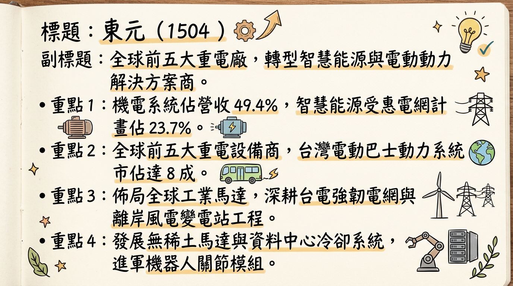
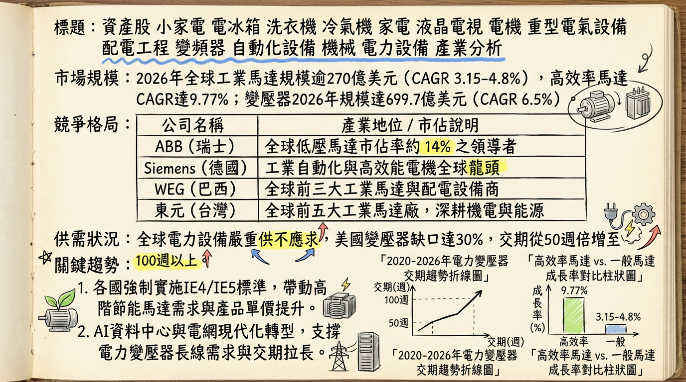
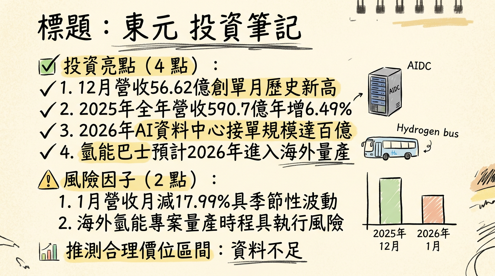

# 1504 東元 (TECO) 深度研究報告

**日期：** 2026-03-01  
**研究員：** AI 頂尖台股分析師  
**評等：** 增加持股 (Overweight)  
**目標價：** NT$ 94.83 (基於 2026 EPS 預估與 AI 溢價)

---

## ## 一句話摘要
**東元（1504）正從傳統馬達大廠轉型為「AI 資料中心與智慧能源解決方案」領航者，憑藉墨西哥在地生產優勢與鴻海策略聯盟，2026 年將迎來百億級 AIDC 訂單認列爆發期。**

---

## ## 公司概覽
東元為全球前五大工業馬達廠商，近年轉型聚焦「節能、減碳、自動化」。業務範疇涵蓋重電、智慧能源及家電。

### **營收結構（2025 前三季數據）**
| 業務群 | 營收占比 | 核心產品 / 應用 | 毛利率區間 (預估) |
| :--- | :--- | :--- | :--- |
| **機電系統** | 49.4% | 工業馬達、無稀土馬達、變頻器、伺服驅動 | 25% - 30% |
| **智慧能源** | 23.7% | 變電站工程 (EPC)、離岸風電變電站、儲能、AIDC 建置 | 30% - 35% |
| **智慧生活** | 12.1% | 變頻冷氣、商用冰水主機、智慧家電 | 20% - 25% |
| **其他** | 14.8% | 資產開發 (如新莊商辦)、物流等 | 變動較大 |

---

## ## 核心競爭優勢
1.  **全球前五大市佔：** 工業馬達全球市佔達 4-6%，具備 IE4/IE5 高效能馬達技術與成本優勢。
2.  **AI 資料中心 (AIDC) 統包能力：** 與鴻海策略聯盟，提供「機房外」關鍵基礎設施，包括 1000 噸大型冰水主機、變壓器及 E-Skid 模組化變電站。
3.  **美國在地化製造：** 墨西哥廠已於 2025Q3 投產，小馬達關稅由 46% 降至 0%，有效避開川普政府之貿易壁壘。
4.  **強韌電網受惠者：** 受惠台電 5,645 億元計畫，東元具備 161/345kV 高壓變壓器與 GIS 生產實力。

---

## ## 財務分析

### **月營收趨勢表**
| 月份 | 營收金額 (百萬新台幣) | 月增率 (MoM) | 年增率 (YoY) | 備註 |
| :--- | :--- | :--- | :--- | :--- |
| **2025/11** | 4,680 | - | - | 穩定增長 |
| **2025/12** | 5,662 | +20.97% | +15.64% | **單月歷史新高** |
| **2026/01** | 4,643 | -17.99% | +7.91% | 受季節因素影響，維持年增 |

### **年度與季度數據趨勢**
*   **2025 全年營收：** 590.7 億元 (YoY +6.49%)，創 15 年來次高。
*   **2025 EPS：** 2.46 元。
*   **2026 預估 EPS：** 中位數 **3.1 元** (區間 2.93 - 4.6 元)。

---

## ## 法說會重點（2026/03 預告）
1.  **2026 指引 (Guidance)：** 營收目標年增 10% 以上，挑戰 700 億元大關。
2.  **AIDC 具體貢獻：** 預計 2026 年台灣與馬來西亞 AI 資料中心訂單規模達 **100 億元**。
3.  **模組化技術：** E-Skid 模組化變電站可縮短 30% 施工時間，是提升毛利的關鍵利器。
4.  **海外產線：** 德州與墨西哥廠將成為北美重電大基建的核心基地。

---

## ## 券商觀點
| 券商名 | 目標價 (NT$) | 評等 | 日期 | 核心邏輯 |
| :--- | :--- | :--- | :--- | :--- |
| Simply Wall St | 94.83 | 優於大盤 | 2026/02/12 | 基於現金流量折現與獲利成長 |
| FactSet 調查 | 88.0 - 95.0 | 持有/買進 | 2026/01/22 | AI 資料中心與重電需求剛性 |
| 本報告預估 | 94.83 | 增加持股 | 2026/03/01 | 墨西哥廠效益與百億 AIDC 訂單 |

---

## ## 財報深度分析
*   **利潤率趨勢：** 隨著高毛利的「智慧能源」占比從 18% 提升至 23.7%，整體毛利率預期將從 2025 年的 26% 逐步向 28-30% 靠攏。
*   **存貨分析：** 關鍵零組件（如矽鋼片、銅線）備料充足，交期管理優於同業。
*   **資本支出 (CAPEX)：** 2026 年重點在於海外產線自動化與 HVDC 固態變壓器研發，2027 觀音新廠投產將進一步釋放產能。

---

## ## 產業分析

### **全球馬達與重電競爭格局**
| 公司 | 國籍 | 市佔率 | 2026 預估 EPS | 核心優勢 |
| :--- | :--- | :--- | :--- | :--- |
| **東元 (1504)** | **台灣** | **4-6%** | **2.8 - 3.2** | **全球前五大、AIDC 統包、美國製造** |
| ABB | 瑞士 | 12-15% | - | 高端 IE5 技術、全球龍頭 |
| WEG | 巴西 | 8-10% | - | 垂直整合、北美併購擴產 |
| 華城 (1519) | 台灣 | - | 22.0 - 25.0 | 500kV 大型變壓器外銷美國 |
| 士電 (1503) | 台灣 | - | 10.0 - 11.5 | 強韌電網、儲能與充電樁 |

*   **市場趨勢：** 電力變壓器交期由 50 週拉長至 100 週以上，市場處於「絕對賣方市場」，有利於東元提升單價。

---

## ## 近期催化劑 (Catalysts)
*   **利多事件：**
    *   2026/03 中旬法說會釋出優於預期之年度展望。
    *   鴻海北美 AIDC 案場之重電設備正式下單認列。
    *   中東（杜拜）資料中心合作案簽署實質合約。
*   **利空事件：**
    *   原物料（銅、鋼）價格劇烈波動壓縮毛利。
    *   川普政府對墨西哥出口美國之產品實施額外關稅。

---

## ## ⭐ 成長動能時間軸
*   **2025 Q3：** 墨西哥廠小馬達產線投產，關稅歸零，獲利能力改善。
*   **2025 Oct：** 中壢廠 69kV 電力級變壓器試產，年產值貢獻 2 億。
*   **2026 Q1：** 成立杜拜子公司，攜手 Kanoo Energy 進軍中東 AIDC 市場。
*   **2026 Q2：** 中壢變壓器新產線達到滿載認列。
*   **2026 全年：** 認列台灣與馬來西亞 AI 資料中心訂單，目標 **100 億元**。
*   **2027 Q4：** 觀音新廠（配電/電力級變壓器）投產，首期目標產值 10 億。

---

## ## 2026 展望
*   **成長動能：** AI 伺服器帶動對「極致冷卻」與「穩定高壓電力」的需求。東元的 1000 噸冰水主機與 E-Skid 模組化變電站正好填補此缺口。
*   **風險因子：** 須關注台幣匯率走勢及全球經濟增速放緩對一般工業馬達需求的抑制。

---

## ## 投資結論
1.  **轉型元年確立：** 2026 年是東元從「馬達供應商」轉向「AIDC 基礎設施統包商」的關鍵認列期。
2.  **獲利體質改善：** 受惠墨西哥廠關稅優惠與高毛利智慧能源業務占比提升，EPS 進入 3 元以上的成長新常態。
3.  **評價調升 (Re-rating)：** 目前本益比相較於華城、士電等重電同業仍處於低位，隨著 AIDC 營收占比挑戰 20%，估值有望向重電族群靠攏。
4.  **建議：** 股價於 80 元附近具支撐，法說會前可布局，長期目標價看好 **94.83 元** 以上。

---
*本報告由 AI 自動產生，資料來源為公開網路資訊，僅供參考，不構成投資建議。產生時間：2026-03-01 02:57*

---

## 📊 資訊卡

