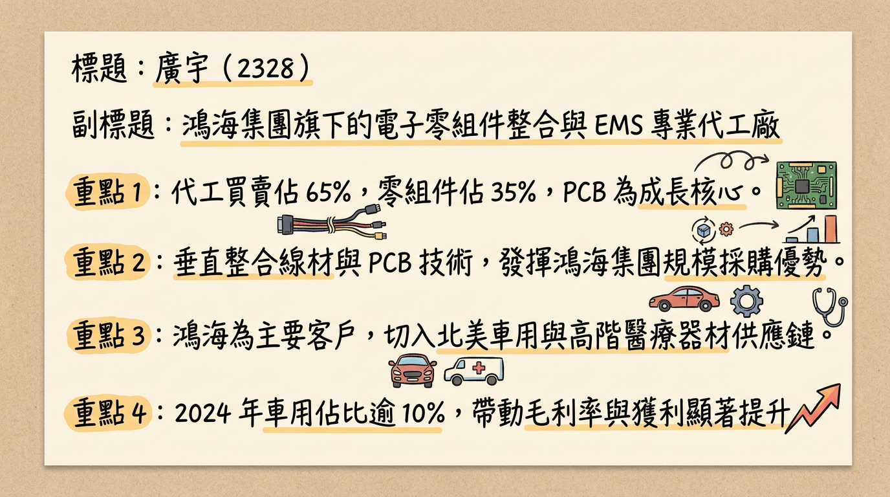
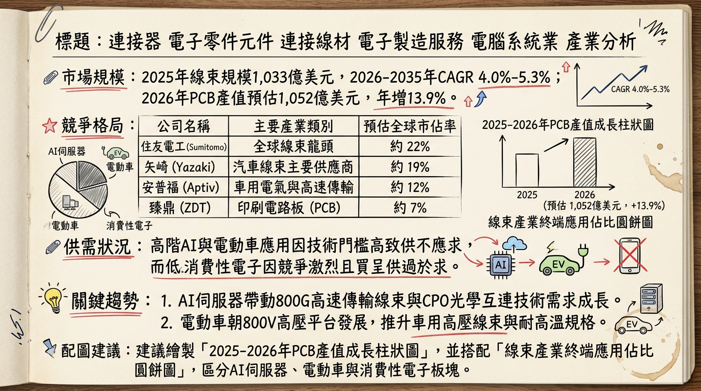
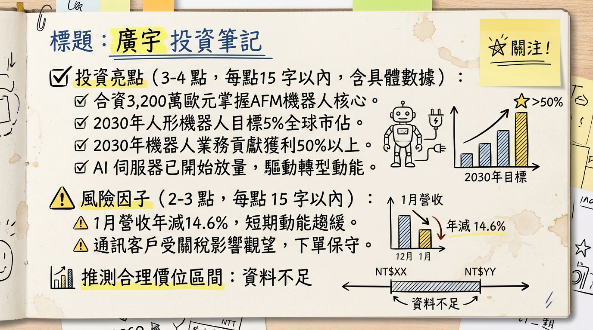

# 2328 廣宇 深度研究報告

## 一句話摘要
廣宇正從傳統線束代工廠，透過併購比利時 Magnax 掌握 AFM 核心技術與馬來西亞 AI 產能擴張，轉型為「AI 伺服器與人形機器人關鍵零組件」供應平台。

---

## 公司概覽
廣宇（2328）隸屬鴻海集團，早期以消費性電子連接線、線束與 PCB（印刷電路板）製造為主。隨集團轉型，廣宇近年積極切入車用（EV）及 AI 伺服器領域。

**【營收結構預估 (2025-2026)】**
| 產品線 | 營收佔比 (預估) | 主要客戶/應用 |
| :--- | :--- | :--- |
| **通訊與消費電子** | 60% - 65% | 傳統 PC、遊戲機、消費型電子產品 |
| **車用產品** | 20% | 鴻海 n7 車系、高壓線束、控制模組 |
| **AI 伺服器與工業** | 15% - 20% | 中系伺服器供應鏈、交換機、AI 運算中心 |
| **機器人 (新事業)** | < 5% (起步期) | 軸向磁通電機 (AFM)、神經線束 |

---

## 核心競爭優勢
1.  **鴻海集團垂直整合（出海口）：** 擁有鴻海集團 AI 伺服器（FII）與電動車（MIH）的龐大內需訂單支撐，並可利用集團全球 100 萬員工之應用場景驗證人形機器人。
2.  **次世代 AFM 技術專利：** 2026 年初併購比利時 Magnax，取得「軸向磁通電機 (AFM)」技術。該技術較傳統馬達減重 50% 且效率更高，是人形機器人與高效能電動車的核心零件。
3.  **地緣政治布局 (China + 1)：** 馬來西亞擁有 15 萬平方米生產基地，具備完善電力設施，滿足 AI 客戶對非中產能的需求。

---

## 財務分析

**1. 最近 6 個月營收趨勢表格**
| 月份 | 營收金額 (億新台幣) | 月增率 (MoM) | 年增率 (YoY) | 備註 |
| :--- | :--- | :--- | :--- | :--- |
| **2026/01** | **15.40** | **-13.61%** | **-14.57%** | 創 2024 年 3 月以來新低，受淡季與關稅觀望影響 |
| **2025/12** | 17.82 | +10.84% | -15.20% | 年底拉貨效應 |
| **2025/11** | 16.08 | +2.96% | -8.47% | 車用需求持續減緩 |
| **2025/10** | 15.62 | -14.07% | -16.25% | 消費電子客戶觀望 |
| **2025/09** | 18.17 | +0.41% | -8.01% | 創近 3 個月新高 |
| **2025/08** | 18.10 | +2.77% | -14.19% | 全球車市銷售放緩 |

**2. 季度與年度趨勢**
*   **2025 Q3 財報：** 營收 53.71 億元（季減 6.31%），毛利率 12.84%，EPS 0.33 元。
*   **2025 全年結算：** 營收 **217.92 億元**（年減 0.24%），預估 **EPS 1.55~1.65 元**。
*   **2024 年度對比：** 2024 全年 EPS 為 2.00 元，2025 年主要受車用市場放緩與消費電子疲軟影響導致獲利下滑。

---

## 法說會重點（2026/01/22）
*   **AI 伺服器：** 2026 年正式放量，目前已切入中系供應鏈，提供內接線及 PCB。
*   **人形機器人目標：** 定位為「機電整合商」，目標 **2030 年全球市佔達 5%**，並期待屆時相關業務貢獻營收過半。
*   **營運指引：** 2026 Q1 為全年谷底，但 **2026 全年度目標重回「兩位數百分比成長」**。
*   **資本支出：** 重點投資東南亞（馬來西亞廠 15 萬平方米規模），以應對 AI 與通訊客戶需求。

---

## 券商觀點
| 券商名稱 | 報告日期 | 目標價 | 評等 | 2025/2026 EPS 預估 |
| :--- | :--- | :--- | :--- | :--- |
| **福邦投顧** | 2026/01/26 | **67 元** | 看多 | 2025 (E): 1.58 / 2026 重回成長 |
| **康和證券** | 2025/08/18 | **44 元** | 看多 | ⚠️資料過時，需重新評估 |
| **CMoney** | 2024/12/25 | **55 元** | 看多 | ⚠️資料過時，需重新評估 |

---

## 財報深度分析
*   **利潤率趨勢：** 2025 Q3 毛利率維持在 12.84%。管理層目標透過 AFM 電機（毛利率為傳統產品 2 倍以上）與 AI 高頻線材提升，使 2026 年毛利率站穩 10% 以上。
*   **存貨與資產：** 2026 年初存貨控制尚屬穩定，但需觀察 2025 年底車用去庫存進度。
*   **資本支出：** 2026 年預計集中於馬來西亞 5 萬平米新廠與 10 萬平米擴建廠房之設備進駐。

---

## 股權異動與重大投資
*   **重大併購（2026/01）：** 廣宇與鴻海合計注資 **3,200 萬歐元（約 12 億台幣）** 取得比利時 Magnax 52% 股權，正式納入合併報表並掌握 AFM 電機關鍵技術。
*   **外資動態：** 2026 年 2 月起外資開始顯著回補，2/26 成交量突破 3 萬張，股價突破均線糾結區。

---

## 產業分析

**1. 市場規模與趨勢**
*   **線束產業：** 2026-2035 年 CAGR 約 **4.0% - 5.3%**，受 800V 高壓與高速傳輸需求驅動。
*   **PCB 產業：** 2026 年產值預估達 **1,052 億美元**，年增 **13.9%**，主要由 AI 伺服器帶動。

**2. 競爭格局比較**
| 公司 | 2025 營收 (億) | 2025 EPS (E) | 核心優勢 | 2026 題材 |
| :--- | :--- | :--- | :--- | :--- |
| **廣宇 (2328)** | 217.9 | 1.55 - 1.65 | 鴻海集團整合、AFM 電機 | 人形機器人、馬國 AI 廠 |
| **貿聯-KY (3665)** | 成長中 | > 20.0 | 高端 800G/CPO 技術 | 矽光子、高效能運算 |
| **良維 (6290)** | 成長中 | 5.5 - 7.0 | AI 伺服器電源線 | 蘋果、亞馬遜供應鏈 |

---

## 近期催化劑
*   **利多：**
    1.  馬來西亞 AI 伺服器產線 2026 Q2 正式放量。
    2.  Magnax AFM 電機產品於 2026 H1 送樣工業客戶。
    3.  鴻海集團內部「關燈工廠」啟動人形機器人採購測試。
*   **利空：**
    1.  美國對等關稅政策導致消費性電子下單持續保守。
    2.  電動車市場復甦力道若不如預期，高壓線束營收將受壓。

---

## ⭐ 成長動能時間軸
*   **2025 Q4 - 2026 Q1：** 完成馬來西亞 5 萬平方米新廠建設，收購額外 10 萬平方米廠房。
*   **2026 Q1：** AI 伺服器 L10 供應鏈切入，供應高速傳輸線與交換機。
*   **2026 Q2：** 馬來西亞廠 AI 相關產能顯著貢獻營收。
*   **2026 H1：** AFM（軸向磁通電機）產品開始向工業與機器人客戶送樣。
*   **2026 H2：** **AFM 電機正式量產**，貢獻高毛利營收。
*   **2030 年：** 目標達成全球人形機器人零組件（神經線束+電機）5% 市佔。

---

## 2026 展望
*   **成長動能：** AI 伺服器產能釋放、轉型平台型企業帶動估值提升（PE Re-rating）、東南亞避稅優勢。
*   **風險：** 2026 Q1 營收基期較低、機器人產品營收佔比目前仍低（個位數）、全球關稅政策波動。

---

## 投資結論
1.  **轉型轉折點：** 2328 廣宇已由單純代工轉向具備核心馬達技術的模組商，雖 2025 年獲利衰退，但 2026 年是轉型元年的獲利回升期。
2.  **AI 實質貢獻：** 馬來西亞廠為 2026 年最直接的營收動能，避開地緣政治風險，切入 AI 伺服器 L10 供應鏈。
3.  **機器人題材：** 併購 Magnax 使其具備人形機器人「心臟（電機）」與「神經（線束）」地位，具備長期本益比調升空間。
4.  **建議目標價：** 參考福邦投顧給予 **67 元** 之預期，建議關注 2026 Q2 營收是否展現雙位數月增。

---
本報告由 AI 自動產生，資料來源為公開網路資訊，僅供參考，不構成投資建議。
**產生時間：2026-03-01 02:30**

---

## 📊 資訊卡

