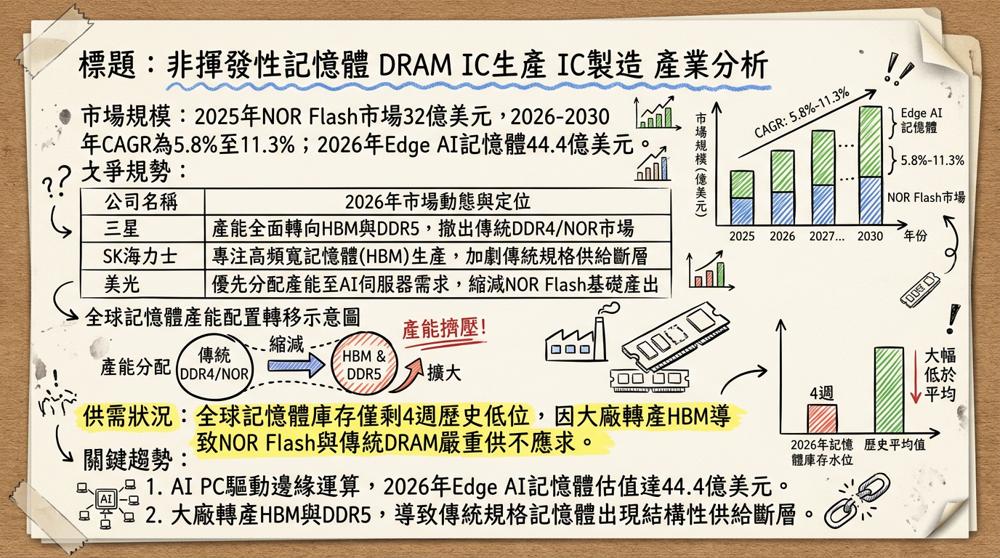
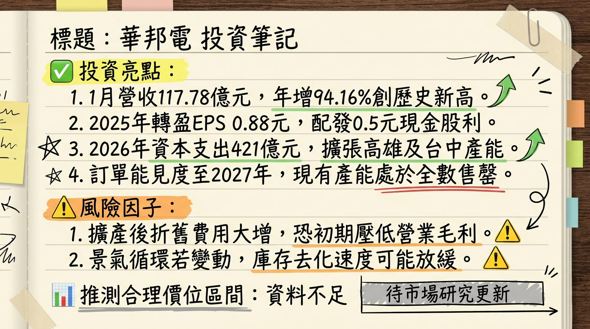

# 2344 華邦電 深度研究報告

## 一句話摘要
華邦電受惠於 AI 引發的記憶體超級循環，憑藉 16nm 製程轉進與 CUBE 邊緣運算技術，2026 年進入產能全數售罄的獲利爆發期。

---

## 公司概覽
華邦電為全球利基型記憶體（Specialty DRAM）與編碼型快閃記憶體（NOR Flash）領導廠商，並透過子公司新唐（4919）布局邏輯 IC 市場。

### 2025 全年營收結構
| 業務別 | 營收佔比 | 核心產品與技術重點 |
| :--- | :--- | :--- |
| **快閃記憶體 (Flash)** | 35% | 全球 NOR Flash 市佔第一，主攻 512Mb 以上高容量產品。 |
| **邏輯 IC (Logic/新唐)** | 34% | 專注 MCU、BMIC（電池管理 IC）及人機介面。 |
| **利基型記憶體 (DRAM)** | 29% | 20nm/16nm DDR3、DDR4，受惠 HBM 產能排擠效應。 |
| **其他** | 2% | 包含代工與代銷業務。 |

**應用領域分佈：** 消費電子 (29%)、車用與工控 (27%)、通訊 (24%)、電腦相關 (20%)。

---

## 核心競爭優勢
1.  **製程領先：** 高雄廠已於 2026 年 Q1 全面導入 **16nm 製程**，大幅領先主要競爭對手（如兆易創新的 40/55nm）。
2.  **AI 秘密武器 - CUBE：** 客製化超高頻寬元件（CUBE）採用 3D 堆疊技術，頻寬可從 7GB/s 提升至 **3TB/s**，被譽為「邊緣 AI 時代的 HBM」。
3.  **DRAM+Flash 整合能力：** 全球唯一具備自主開發兩大主流記憶體技術的公司，在 Edge AI 裝置整合中具備議價與設計優勢。

---

## 財務分析

### 近期月營收趨勢趨勢表（2025/08 - 2026/01）
| 月份 | 金額 (億元) | 月增率 (MoM) | 年增率 (YoY) | 備註 |
| :--- | :--- | :--- | :--- | :--- |
| **2026/01** | **117.78** | **+20.55%** | **+94.16%** | **創單月歷史新高** |
| 2025/12 | 97.70 | +13.21% | +53.32% | 強勁拉貨動能 |
| 2025/11 | 86.30 | +4.91% | +38.69% | 需求穩步走揚 |
| 2025/10 | 82.25 | +3.85% | +34.88% | 景氣確定復甦 |
| 2025/09 | 79.20 | +3.61% | +2.13% | 轉正拐點 |
| 2025/08 | 76.44 | +3.60% | - | - |

### 季度與年度數據
-   **2025 Q4 財報：** 營收 266.25 億元 (QoQ +22.3%)，毛利率 41.9%，EPS 0.76 元。
-   **2025 全年：** 營收 894.06 億元 (YoY +9.55%)，EPS **0.88 元**。
-   **2026 預估：** 營收挑戰 1,345 億至 1,716 億元；法人預估 **EPS 區間 7.52 元至 15.26 元**。

---

## 法說會重點（2026/02/10）
-   **產能現況：** 總經理陳沛銘表示，2026 年至 2027 年產能「**已全數被預約完畢 (Sold out)**」。
-   **價格展望：** 2026 Q1 合約價漲幅預計維持 30% 以上；DDR4 結構性缺貨將持續全年。
-   **出貨指引：** 預估 2026 年位元出貨量將較 2025 年「**翻倍成長**」。
-   **資本支出：** 董事會核准 **421 億元** 預算（較 2025 年 55 億元大幅跳增 665%），鎖定 16nm 擴產。

---

## 券商觀點
| 券商名稱 | 日期 | 目標價 | 評等 | 備註 |
| :--- | :--- | :--- | :--- | :--- |
| **本土老牌投顧** | 2026/02/23 | **150 元** | 買進 | 由 103.5 元大幅調升 |
| **FactSet 綜合調查** | 2026/02/22 | **145 元** | 積極買進 | 2026 EPS 中位數估 15.26 元 |
| **CMoney 彙整分析** | 2026/01/29 | **158 元** | 買進 | 預估 2026 EPS 9.91 元 |
| **群益投顧** | 2026/01/07 | **120.3 元** | 買進 | 給予 16 倍本益比 |

---

## 財報深度分析

### 利潤率趨勢與資本支出
| 項目 | 2025 Q3 | 2025 Q4 | 2026 Q1 (E) | 趨勢分析 |
| :--- | :--- | :--- | :--- | :--- |
| **毛利率** | 46.7% | 41.9% | **> 46%** | 受惠合約價補漲 30%-90% |
| **營業利益率** | 12.8% | 15.4% | 18.0%+ | 稼動率滿載帶動規模經濟 |
| **資本支出** | 55 億 (2025) | - | **421 億 (2026)** | 歷史新高，投入 16nm 設備 |

-   **存貨分析：** 全球記憶體庫存水位降至 **4 週**（歷史極低），華邦電目前無庫存壓力，處於零庫存生產狀態。

---

## 股權異動與資產操作
-   **資產活化（2026/02/23）：** 公告處分封測廠**華東（8110）**持股 1,000 萬股，預計獲得現金 **6.22 億元**，強化營運現金流。
-   **法說後動向（2026/02/26）：** 外資單日大舉買超 **27,413 張**，顯示大戶籌碼快速回流。

---

## 產業分析

### 全球 NOR Flash 競爭格局 (2025 數據)
| 排名 | 公司 | 市佔率 | 優勢與動態 |
| :--- | :--- | :--- | :--- |
| **1** | **華邦電 (Winbond)** | **30% - 35%** | **領先進入 16nm，具備 DRAM/Flash 混合技術。** |
| 2 | 兆易創新 | 18% - 23% | 中國國產替代，但製程仍停留在 40/55nm。 |
| 3 | 旺宏 (Macronix) | 16% | 2025 EPS -1.77 元，表現相對疲弱，主攻車用 ROM。 |
| 4 | 英飛凌 | 10% | 專注於高階工業與航空。 |

-   **HBM 排擠效應：** 三星、SK 海力士產能轉向 HBM，使傳統 DDR4/DDR3 供給缺口達 **4.9%**，華邦電成為主要轉單受惠者。

---

## 近期催化劑
-   **利多事件：**
    1.  2026/01 營收創歷史新高 (117.78 億)。
    2.  DDR4 合約價 2026 Q1 預計季增 90% 以上。
    3.  Edge AI 應用（AI PC/手機）對利基記憶體需求翻倍。
-   **利空/風險：**
    1.  地緣政治：美台潛在關稅壓力（15%-100% 議題）。
    2.  擴產過快：若 2027 年景氣反轉，龐大折舊費用將成為負擔。

---

## ⭐ 成長動能時間軸
-   **2026 Q1：** 高雄廠正式導入 **16nm 製程**，良率進入放量期。
-   **2026/05 - 06：** 高雄廠新一輪裝機擴產，月產能由 **1.5 萬片提升至 2.5 萬片**。
-   **2026/07：** 台中廠 Flash 新產能投片，月產能增加至 **58K 片**。
-   **2026 H2：** **CUBE 記憶體**技術取得首波大宗訂單，鎖定邊緣運算市場。
-   **2027 年：** 421 億資本支出轉化為完整產能，營收挑戰歷史年度新高。

---

## 2026 展望
-   **成長動能：** AI 驅動的記憶體超級循環 (Super Cycle) 導致量價齊揚，16nm 轉換帶動成本競爭力提升。
-   **風險因子：** 需觀察 16nm 良率提升速度，以及 2027 年後原廠 HBM 產能是否釋放回傳統市場。

---

## 投資結論
1.  **營運拐點確立：** 2026 年 1 月營收突破百億創高，象徵公司由景氣循環股轉型為 AI 成長股。
2.  **訂單能見度極高：** 產能預售至 2027 年，2026 年 EPS 具備由 0.88 元跳升至 **10 元以上** 的巨大獲利彈性。
3.  **評價調升空間：** 目前市場給予 150-200 元的目標價，反映市場對其在「邊緣 AI 記憶體」領先地位的溢價。
4.  **建議操作：** 建議目標價區間 **135 - 155 元**（基於預估 EPS 10 元與 14-15 倍 PE）。

---
**本報告由 AI 自動產生，資料來源為公開網路資訊，僅供參考，不構成投資建議。產生時間：2026-03-01 02:30**

---

## 📊 資訊卡

