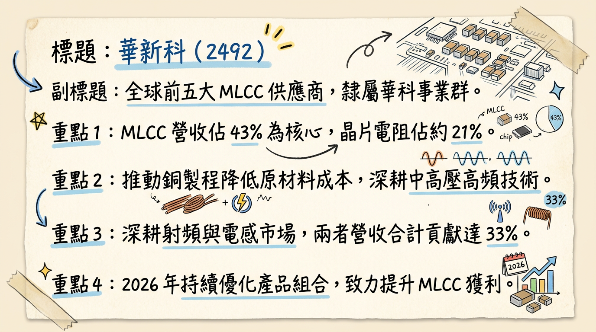
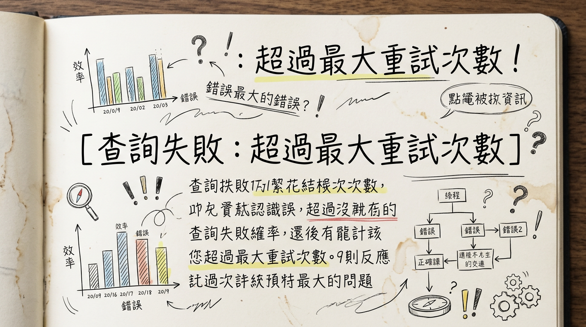
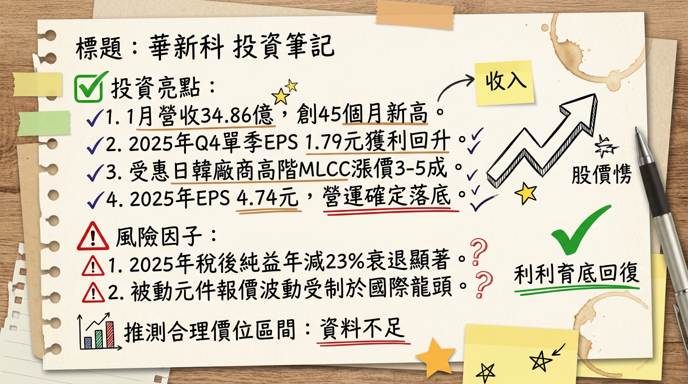

# 2492 華新科 深度研究報告

## 一句話摘要
**「AI 規格升級」與「全球漲價潮」雙箭齊發，華新科營運於 2025 年底見底，2026 年將迎來高毛利產品佔比翻倍與獲利爆發期。**

---

## 公司概覽
華新科（Walsin Technology）為全球前五大積層陶瓷電容（MLCC）製造商，隸屬於華新麗華集團旗下的華科事業群（PSA）。公司近期積極轉型，減少消費性電子比重，全力衝刺 AI 伺服器與 800V 車用高階領域。

### 營收結構（2025 Q4 數據）
| 產品線 | 營收佔比 | 應用領域與趨勢 |
| :--- | :--- | :--- |
| **MLCC (積層陶瓷電容)** | 43% | 核心獲利來源，轉向高壓 (1000V+)、X6S 等高階應用 |
| **晶片電阻 (Resistors)** | 21% | 2026/02 起調漲報價 15%~20% |
| **RF 射頻元件** | 17% | 包含天線、LTCC 濾波器，受益於 Wi-Fi 7 |
| **電感與其他** | 15% | 協同子公司佳邦佈局 |
| **安規/圓板電容** | 4% | 穩定現金流業務 |

---

## 核心競爭優勢
1.  **PSA 集團資源整合：** 結合子公司信昌電（特殊陶瓷粉末原料）與佳邦（天線），提供一站式被動元件解決方案。
2.  **獨家「銅製程」技術：** 2026 年擴大應用以取代昂貴銀、鈀金屬，在原材料波動下建立成本防線。
3.  **LTCC 技術領先：** 在高頻通訊與 Wi-Fi 7 市場具備比傳統封裝更佳的性能與利基優勢。
4.  **產能全球化佈局：** 馬來西亞廠與日本廠產能佔比提升至 11% 以上，有效規避地緣政治風險。

---

## 財務分析

### 近期月營收趨勢
| 月份 | 營收（新台幣 億元） | 月增率 MoM | 年增率 YoY | 備註 |
| :--- | :--- | :--- | :--- | :--- |
| **2026/01** | 34.86 | +21.17% | +20.41% | **創 45 個月新高** |
| **2025/12** | 28.76 | -5.56% | +7.12% | 庫存調整末端 |
| **2025/11** | 30.46 | +7.05% | +6.16% | AI 需求初步顯現 |
| **2025/10** | 28.45 | -10.42% | +2.63% | - |
| **2025/09** | 31.76 | +1.18% | -0.19% | - |
| **2025/08** | 31.39 | +0.27% | +2.04% | - |

### 獲利能力概況
*   **2024 全年：** 營收 347.55 億元，**EPS 6.15 元**。
*   **2025 全年：** 營收約 364.62 億元，**EPS 4.74 元**（受白銀漲價與電費成本拖累）。
*   **2025 Q4 單季：** **EPS 1.79 元**，獲利已自 Q3 底部顯著回升。

---

## 法說會重點
*   **AI 伺服器動能：** AI 伺服器對 MLCC 需求量（2-3 萬顆）是傳統伺服器的 3-5 倍。AI 相關營收佔比預計從 2025 年底的 10% 提升至 **2026 年底的 20%**。
*   **稼動率：** 目前 MLCC 與電阻平均稼動率回升至 **75%~80%**，2026 年目標挑戰 85%。
*   **產品轉型：** 針對 800V 快充與 AI 電源模組，推動 1000V 以上高壓 MLCC 出貨。

---

## 券商觀點
| 券商名稱 | 日期 | 評等 | 目標價 (TWD) | 2026 EPS 預估 |
| :--- | :--- | :--- | :--- | :--- |
| **摩根士丹利 (MS)** | 2026/02/23 | 買進 (調升) | **175.0** | 9.87 元 |
| **法人機構平均** | 2026/02/10 | 買進 | **156.0** | 5.76 元 |
| **國泰證券** | 2025/12/11 | 持平/中立 | **145.0** | 6.00 元 |

---

## 財報深度分析

### 利潤率趨勢表格
| 季度 | 毛利率 (Margin) | 營業利益率 (OPM) | 稅後淨利率 (NI%) |
| :--- | :--- | :--- | :--- |
| **2025 Q3** | 16.76% | 5.41% | 14.29% |
| **2025 Q2** | 17.07% | 5.68% | 2.88% |
| **2024 Q4** | 18.65% | 6.28% | 11.02% |

### 存貨與營運分析
*   **存貨週轉天數：** 從 2024 Q4 的 103 天降至 2025 Q3 的 **86.42 天**，去庫存徹底。
*   **資本支出：** 維持在營收 10%-15%，聚焦馬來西亞與日本廠高階產線升級。
*   **負債比率：** 42.9%，財務結構穩健。

---

## 股權異動
*   **大股東：** 華新麗華集團持股約 18.3%，結構穩定。
*   **董監改選：** 2025/06/17 完成，管理層延續穩健風格。
*   **籌碼動態：** 外資於 2026/02/25 單日回補 **14,789 張**，顯示長線資金重新進場。

---

## 產業分析

### 全球 MLCC 競爭格局（2025-2026 預估）
| 排名 | 公司 | 市佔率 | 核心優勢 | 2026 展望 |
| :--- | :--- | :--- | :--- | :--- |
| 1 | 村田 (Murata) | 35-40% | 技術領導者 | 領頭漲價，轉向高階 AI |
| 2 | 三星電機 | 18-20% | 產能規模大 | 跟進漲價，產能滿載 |
| 3 | **國巨 (Yageo)** | 12-15% | 全球通路、併購利基 | 高毛利產品佔比過半 |
| 4 | **華新科 (Walsin)** | **10-14%** | **LTCC 利基、集團整合** | **報價回升、AI 佔比翻倍** |

---

## 近期催化劑
*   **【利多】電阻漲價：** 2026/02/01 起電阻調漲 15%-20%，直接貢獻 Q1 毛利。
*   **【利多】MLCC 漲價潮：** 日韓大廠擬於 4 月啟動 10%-20% 漲價，華新科具備跟進空間。
*   **【利多】營收創高：** 1 月營收 34.86 億創 45 個月新高，基本面強勁支撐。
*   **【利空】原料波動：** 白銀、銅價若持續飆漲，可能侵蝕部分漲價獲利。

---

## ⭐ 成長動能時間軸
*   **2025 Q4 (已發生)：** 獲利落底回升，AI 伺服器 X6S MLCC 開始大量出貨。
*   **2026/02 (進行中)：** 晶片電阻全系列漲價，1 月營收利多反映在股價爆發。
*   **2026 Q2：** **馬來西亞新廠**產能擴充完成，鎖定高階電阻與車用需求。
*   **2026 全年：** 推動 1000V 以上高壓 MLCC 及 800V 車用電子架構滲透。
*   **2026 H2：** AI 伺服器營收佔比挑戰 20%，產品組合優化使毛利率回歸 20% 以上。

---

## 2026 展望
*   **成長動能：** AI 伺服器、Wi-Fi 7 通訊升級、800V 電動車快充、以及日韓大廠帶動的產業調價循環。
*   **風險：** 全球通膨影響消費性電子復甦進度、原材料價格暴漲風險、地緣政治影響產能調度。

---

## 投資結論
1.  **營運落底轉強：** 2025 年為獲利谷底，2026 年 1 月營收已展現強勁復甦動能。
2.  **漲價效應顯著：** 2 月電阻漲價與 4 月 MLCC 可能跟進漲價，將帶動「三率」同步跳升。
3.  **AI 純度提升：** 從消費級轉向伺服器級，AI 營收佔比目標翻倍至 20%，估值有望重新評價（Re-rating）。
4.  **建議目標價：** 考量 2026 年預估 EPS 5.76 ~ 7.5 元及產業向上趨勢，給予 **155 - 180 元** 區間建議。

***

**本報告由 AI 自動產生，資料來源為公開網路資訊，僅供參考，不構成投資建議。產生時間：2026-03-01 02:52**

---

## 📊 資訊卡

