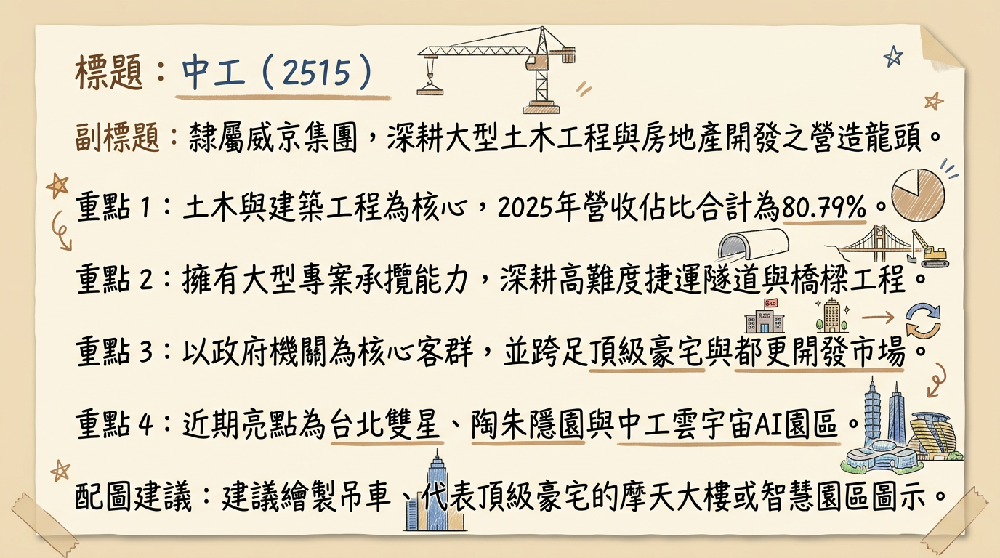
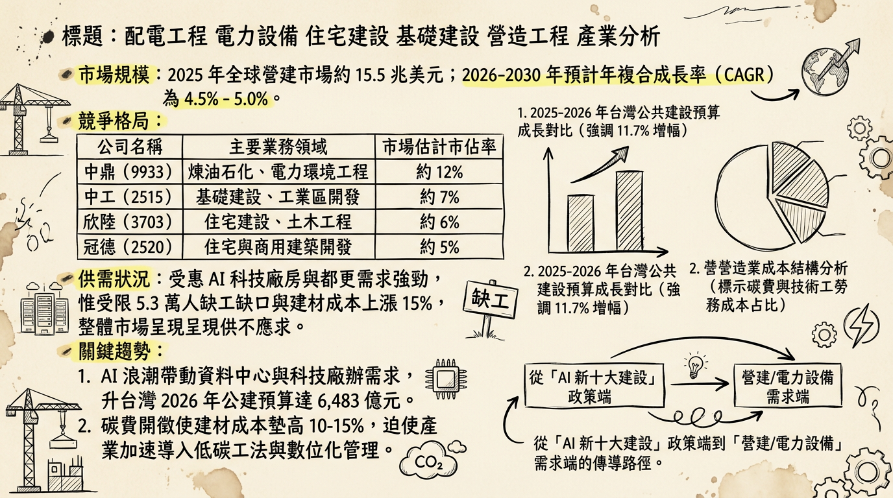
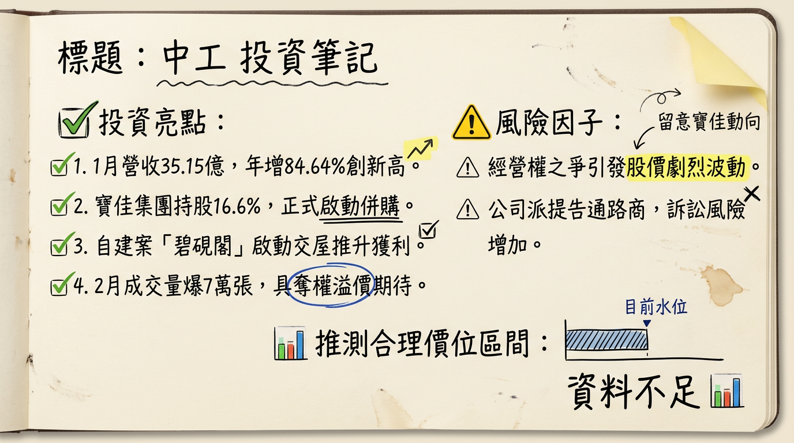

# 2515 中工 深度研究報告

## 一句話摘要
**「建案入帳收割元年」與「經營權奪權溢價」雙重奏：2026 年營收預期挑戰新高，碧硯閣與雲宇宙園區為獲利爆發點。**

---

## 公司概覽
中工（中華工程）為台灣資深大型營造廠，隸屬威京集團。除穩健的公共工程基底外，近年轉型為「營造+開發」雙主軸，並切入高毛利的 AI 智慧廠辦市場。

**營收結構（截至 2025 年底）**
| 業務領域 | 營收佔比 | 核心專案 |
| :--- | :--- | :--- |
| **土木工程** | 59.32% | 台北雙星、捷運、台 61 線改善工程 |
| **建築工程** | 21.47% | 碧硯閣、鳴森苑、社會住宅 |
| **機電工程** | 7.34% | 大型公共建設配電與機電安裝 |
| **開發/其他** | 11.87% | 中工雲宇宙 AI 園區、彰濱工業區開發、保全與人力 |

---

## 核心競爭優勢
1.  **在手案量驚人：** 截至 2025 年底，在手工程合約總額達 **1,768 億元**，待執行量約 **1,032 億元**，業績能見度直達 2030 年。
2.  **技術領先：** 引進 **BIM (建築資訊模型) 全生命週期管理**，縮短管理工時約 20%，在高難度公建與超豪宅領域具備護城河。
3.  **稀缺性資產與 ESG 領航：** 「陶朱隱園」不僅是地標，更是吸碳建築指標。土城「雲宇宙 AI 園區」為全台首座針對 AI 算力需求規劃的智慧廠辦，具溢價優勢。

---

## 財務分析

**月營收趨勢表格（近半年）**
| 月份 | 營收（億元） | 月增率 MoM | 年增率 YoY | 備註 |
| :--- | :--- | :--- | :--- | :--- |
| **2026/01** | **35.15** | **+15.57%** | **+84.64%** | **歷史單月新高，碧硯閣入帳** |
| **2025/12** | 30.41 | +122.14% | +3.22% | 碧硯閣啟動產權移轉 |
| **2025/11** | 13.69 | -16.08% | -45.31% | 工程結算空窗期 |
| **2025/10** | 16.31 | -6.31% | -14.54% | -- |
| **2025/09** | 16.36 | -- | -12.80% | -- |
| **2025/08** | 15.11 | -- | -21.40% | -- |

**季度獲利趨勢（2025 年）**
*   **2025 Q3 EPS：** 0.09 元
*   **2025 累計前三季 EPS：** 0.27 元
*   **2025 全年營收（自結/預估）：** 207.18 億元
*   **2026 預估 EPS：** **1.0 - 1.2 元**（隨高毛利建案入帳大幅跳升）

---

## 法說會重點（2025/12/26）
*   **工程進度：** 「碧硯閣」總銷 50 億，於 2026 Q1 大量認列。
*   **指標案展望：** 「中工雲宇宙 AI 園區」總銷近 **500 億元**，預計 2026 年 6 月取使照，下半年正式入帳，首波潛在成交對象包含鴻海（購置意向達 75.49 億）。
*   **資金規劃：** 2026 年計畫投入 **80 億元** 資本支出，並籌組 **55 - 100 億元** 聯貸案或發行可轉債（CB）。
*   **管理層發言：** 公司正由傳統營造轉型為「專業地產開發商」，預期 2026 年起開發業務利潤貢獻度將超越營造業務。

---

## 券商觀點

**券商目標價與評等表格**
| 券商名稱 | 評等 | 目標價 | 2026 預估 EPS | 日期 |
| :--- | :--- | :--- | :--- | :--- |
| **凱基投顧** | 持有 (Hold) | **18.5 元** | 1.15 元 | 2026/02/12 |
| **統一證券** | 區間操作 | **17.0 元** | 1.08 元 | 2026/01/15 |
| **Win 投資** | 中立 (過時) | 16.5 元 | 1.05 元 | 2026/02/26 |
| **玉山證券** | 偏高位階 | -- | -- | 2026/02/26 |

---

## 財報深度分析

**利潤率趨勢表格**
| 指標 | 2025 Q3 | 2025 Q2 | 2025 Q1 | 2024 全年 |
| :--- | :--- | :--- | :--- | :--- |
| **毛利率 (%)** | 6.31 | 8.59 | 5.92 | 6.52 |
| **營業利益率 (%)** | 3.65 | 3.20 | 2.72 | 3.99 |
| **稅後淨利率 (%)** | 2.76 | 2.17 | 1.85 | 3.04 |

*   **存貨分析：** 截至 2025 Q3，存貨週轉天數約 **634.17 天**，處於高水位，主因陶朱隱園去化緩慢。隨 2026 年雲宇宙園區完工，存貨將轉化為現金流。
*   **財務風險：** 負債比率達 **66.14%**，利息保障倍數僅 1.33，短期融資壓力較大。

---

## 股權異動
*   **經營權之爭：** 寶佳集團（華建）大舉掃貨，持股比例突破 **16.6% - 20%**，並將目的改為「併購」。
*   **法律反制：** 2026/02/24 中工告發通路商涉嫌內線交易與股價操縱，試圖以此凍結對手委託書徵求。
*   **股利政策：** 為保留現金應對開發與鬥爭，2025 年改發股票股利（0.503 元），2026 年預期維持低現金支出、高股票股利政策。

---

## 產業分析

**台灣主要營造開發商比較（2025 數據）**
| 公司 | 2025 營收 (億) | 毛利率 (%) | EPS (元) | 2026/01 營收成長 |
| :--- | :--- | :--- | :--- | :--- |
| **中工 (2515)** | **207.76** | **約 10.5% (估)** | **0.35-0.50 (估)** | **+84.6%** |
| **達欣工 (2535)** | 280.5 | 11.2% | 3.5 - 4.2 | +5.2% |
| **欣陸 (3703)** | 315.4 | 12.8% | 1.8 - 2.1 | +2.1% |
| **皇昌 (2543)** | 125.0 | 14.5% | 4.5 - 5.5 | +12.5% |

---

## 近期催化劑
*   **利多：** 
    1. 碧硯閣（50億）第一季集中入帳。
    2. 雲宇宙 AI 園區預售進度超越 20%，傳鴻海將大手筆購置。
    3. 陶朱隱園成交資訊若再出現，具備強大處分利益與話題性。
*   **利空：** 
    1. 京華城容積率爭議法律判決（預計 2026/03 底）。
    2. 經營權爭奪導致董事會決策僵化。
    3. 負債比 66% 在升息環境下之利息成本壓力。

---

## ⭐ 成長動能時間軸
*   **2026 / Q1：** **「碧硯閣」**大規模交屋入帳（認列主力），1 月營收已創新高。
*   **2026 / 03：** **京華城爭議判決**。若無虞，則京華廣場（2027 完工）之進度威脅消除。
*   **2026 / 05：** **股東常會**。經營權之爭定勝負，可能引發股價最後一波「奪權溢價」。
*   **2026 / 06：** **「中工雲宇宙 AI 園區」**取得使用執照。
*   **2026 / Q3-Q4：** **雲宇宙案產權移轉**。下半年營收有望因大宗土地/建物銷售再創高峰。
*   **2026 / 全年：** 彰濱工業區續推 35.9 公頃銷售，穩定挹注現金流。

---

## 2026 展望
*   **成長動能：** 進入建案入帳高峰期，營運模式由低毛利營造轉為中高毛利地產開發，EPS 具備挑戰 **1.2 元** 以上之潛力。
*   **風險：** 法律訴訟（經營權、京華城）可能干擾公司運作；勞動力短缺與碳費支出恐壓縮後續工程毛利。

---

## 投資結論
1.  **基本面爆發：** 2026 年是營收、獲利雙位數成長的元年，1 月營收已兌現成長邏輯。
2.  **籌碼面溢價：** 寶佳與威京集團的持股之爭（持股均達 15% 以上）提供股價下檔支撐，具備併購題材想像。
3.  **目標價區間建議：** 參考 2026 年預估 EPS 1.1 元及歷史本益比區間，給予 **16.5 - 19.5 元** 區間建議，若經營權之爭加劇，不排除挑戰 20 元大關。
4.  **操作建議：** 建議回檔至 16 元附近分批佈局，並密切觀察 3/18 最後過戶日前之融資券與籌碼異動。

---
**本報告由 AI 自動產生，資料來源為公開網路資訊，僅供參考，不構成投資建議。產生時間：2026-03-02 06:19**

---

## 📊 資訊卡

