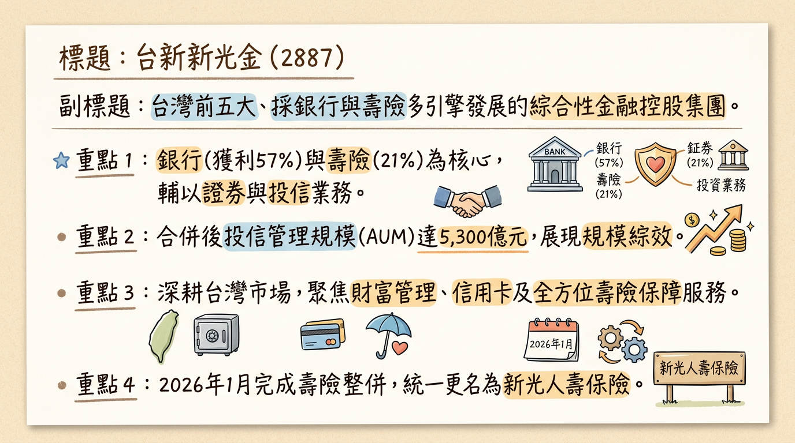
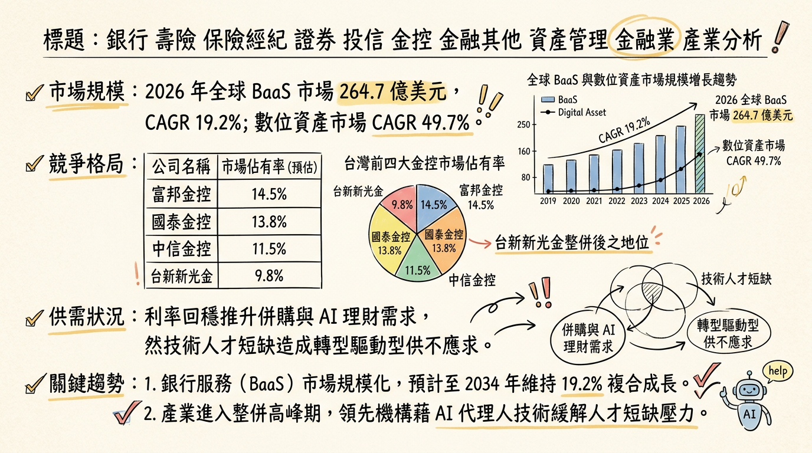
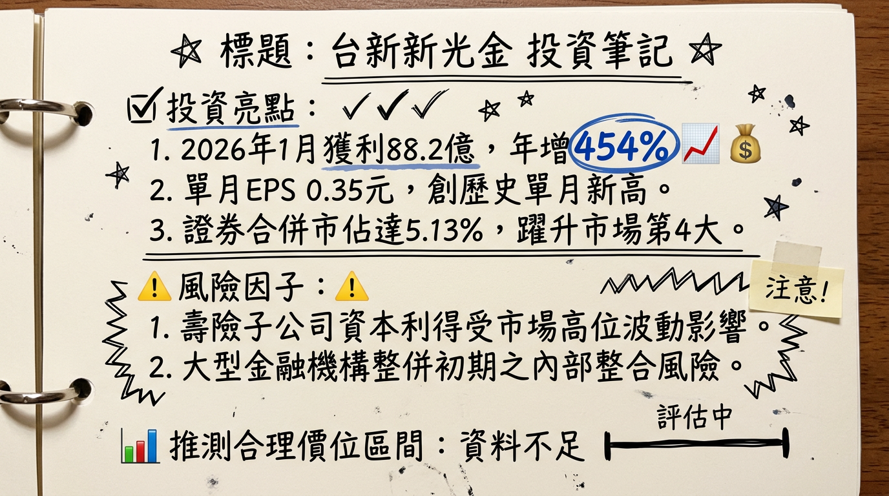

# 2887 台新新光金 深度研究報告

## 一句話摘要
**台新新光金合併綜效進入「獲利爆發期」，2026 年 1 月單月 EPS 達 0.35 元，正式躍升台灣前四大金控並朝全球型金融集團邁進。**

---

## 公司概覽
台新新光金融控股（以下簡稱台新新光金）於 2024 年 7 月完成台新金與新光金之控股層級合併。目前正處於子公司深度整併期，具備銀行、壽險、證券三合一之「多引擎」動能。

### 業務結構與獲利貢獻（2025 年自結數據）
| 業務板塊 | 核心子公司 | 獲利貢獻比重 | 2025 稅後純益 (億元) | 關鍵優勢 |
| :--- | :--- | :--- | :--- | :--- |
| **銀行業務** | 台新銀行 / 新光銀行 | 57% | 213.9 | 數位銀行 Richart 領先、NIM 達 1.34% |
| **保險業務** | 新光人壽 (含台新人壽) | 21% | 約 78.5 | 合併後躍升全台前三大壽險、CSM 穩定釋放 |
| **證券業務** | 台新證券 / 元富證券 | 13% | 48.0 | 經紀市佔率達 5.13% (市場第 4 大) |
| **其他** | 投信、創投、海外 | 9% | 33.2 | 投信 AUM 達 5,300 億元 |

---

## 核心競爭優勢
1.  **通路綜效極大化**：合併後擁有全台最密集的銀行通路，可直接推動高價值保單（CSM）銷售，2025 年新契約保費（FYP）年增達 191%。
2.  **資產規模紅利**：集團總資產突破 8 兆元，晉升台灣前四大金控，在國際市場洽談聯貸與海外設點更具議價力。
3.  **AI 與土地資產整合**：新光人壽北士科 T17、T18 土地案引進 **NVIDIA (輝達)** 進駐，不僅穩定租金收益，更開啟與 AI 供應鏈的長期金融服務機會。
4.  **數位金融領先地位**：Richart 數位帳戶市佔率持續維持全台第一，2026 年導入 Agentic AI 轉型，預期將降低 15-20% 的營運人力成本。

---

## 財務分析

### 月營收趨勢表（受合併報表因素影響，YoY 呈現爆發性增長）
| 月份 | 營收金額 (億元) | 月增率 MoM | 年增率 YoY | 備註 |
| :--- | :--- | :--- | :--- | :--- |
| **2026/01** | 187.73 | -15.69% | **+219.42%** | 合併綜效顯現，壽險獲利挹注 |
| **2025/12** | 222.66 | +8.46% | **+229.51%** | 2025 年底結算高峰 |
| **2025/11** | 205.29 | +16.21% | +187.19% | 銀行利息手續費穩健成長 |
| **2025/10** | 176.70 | -10.19% | +168.66% | 市場波動影響自營收益 |
| **2025/09** | 239.50 | +52.46% | +236.79% | 單月一次性合併調整利益 |
| **2025/08** | 157.10 | +55.95% | +77.99% | 合併初期數據反映 |

### 季度與年度數據
*   **2025 Q3 關鍵數據**：營收累計 2,935.8 億元，毛利率 66.48%，營業利益率 29.36%，單季 EPS 0.59 元。
*   **全年度 EPS 趨勢**：
    *   2024 (實際)：1.39 元
    *   2025 (實際)：1.91 元 (創歷史新高)
    *   2026 (預估)：根據 1 月單月 0.35 元估算，全年挑戰 **2.1 - 2.5 元**。

---

## 法說會重點
*   **子公司整併時程**：
    *   **壽險**：2026/01/01 已完成合併為「新光人壽」。
    *   **證券**：2026/04/06 將完成台新與元富證券合併，據點增至 55 處。
    *   **銀行**：系統最為複雜，目標於 **2026 年底** 完成 IT 整併。
*   **股利政策**：管理層明確表示，2026 年發放之現金股利將「優於 2025 年的 0.9 元」，市場預期落點為 **1.0 - 1.1 元**。
*   **資本支出**：2026 年預計投入 **30-50 億元** 於銀行數位轉型與 IT 系統對齊。

---

## 券商觀點
*註：部分早期報告尚未完全反映 2026 年初獲利爆發，目標價存在低估。*

| 券商名稱 | 報告日期 | 評等 | 目標價 | 2026 EPS 預估 |
| :--- | :--- | :--- | :--- | :--- |
| **凱基投顧** | 2025/12/03 | 持有 (保守) | 20.0 | 1.55 |
| **統一投顧** | 2025/12/03 | 中立 (保守) | 19.0 | 1.70 |
| **Cmoney 社群專家** | 2026/02/15 | 買進 | **35.0 - 40.0** | 2.50 |
| **FactSet 調查中位數**| 2025/05/18 | ⚠️過時 | 17.25 | -- |

---

## 財報深度分析

### 利潤率趨勢 (2025 季度)
| 指標 | 2025 Q1 | 2025 Q2 | 2025 Q3 | 2025 Q4 (自結) |
| :--- | :--- | :--- | :--- | :--- |
| **稅後淨利率** | 23.2% | 24.5% | 27.6% | **29.8%** |
| **單季 EPS** | 0.33 | 0.38 | 0.53 | 0.67 |

*   **資產品質**：2025 年底逾放比（NPL）僅 0.14%，備抵呆帳覆蓋率達 892.7%，體質極其優異。
*   **資本適足率**：壽險端 RBC 於 2025 年底已順利達標 200% 以上，緩解增資壓力。

---

## 股權異動
*   **申報轉讓**：近期無大規模大股東申報轉讓，籌碼面穩定。
*   **庫藏股**：目前無大規模執行庫藏股。
*   **股本變化**：因合併案發行新股，2025 年總股本膨脹約 **90%**，但因獲利成長幅度更大（2026/01 YoY +454%），EPS 稀釋壓力已被獲利成長抵銷。
*   **外資動向**：2026 年 1 月中旬外資連買 7 日達 16 萬張，目前持股比約 23.22%。

---

## 產業分析
### 台灣金控競爭格局 (2025 全年數據)
| 公司名稱 | 2025 獲利 (億元) | EPS (元) | 預估殖利率 | 關鍵動態 |
| :--- | :--- | :--- | :--- | :--- |
| **富邦金 (2881)** | 1,208.5 | 8.36 | 4.84% | 獲利王 |
| **國泰金 (2882)** | 1,079.9 | 7.08 | 5.43% | 資本韌性高 |
| **中信金 (2891)** | 806.2 | 4.08 | 5.49% | 銀行獲利新高 |
| **台新新光金 (2887)** | **373.6** | **1.91** | **5.20%** | **獲利成長 86%，合併綜效爆發** |

---

## 近期催化劑
*   **利多事件**：
    *   2026/04/06 證券子公司正式合併。
    *   2026/05 股東會公布股利發放數字（預期驚喜）。
    *   2026 下半年 申請設立美國分行。
*   **利空/風險事件**：
    *   2026 年底銀行系統整併難度高，若出 Bug 可能影響客戶信心。
    *   2026 接軌 IFRS 17 與 ICS 新制之資本需求挑戰。

---

## ⭐ 成長動能時間軸
*   **2026/01/01**：新光人壽完成合併，更名掛牌。
*   **2026/02**：單月 EPS 0.35 元，創歷史新高。
*   **2026/04/06**：**關鍵節點** - 台新證券與元富證券正式合併。
*   **2026/05**：股東會確認優於預期的股利政策（預估 1.0 元以上）。
*   **2026/Q3**：NVIDIA 進駐 T17/T18 土地案後續效應顯現。
*   **2026/11**：啟動全球型金融金控計畫，申設美國分行。
*   **2026/12/31**：完成台新銀與新光銀 IT 系統整併，達成完整一體化。

---

## 2026 展望
*   **成長動能**：受惠於「以銀養險、以險壯銀」，銀行端 NIM 穩定且壽險端 CSM 快速累積。證券合併後市佔率躍升將帶來強勁經紀手續費收益。
*   **風險因素**：股本膨脹 90% 對 ROE 的稀釋效果，以及全球降息循環對壽險避險成本的影響。

---

## 投資結論
1.  **合併綜效顯現**：2026 年 1 月獲利數據已證明合併利大於弊，獲利天花板大幅提升。
2.  **估值重評價 (Re-rating)**：股價已突破 25.6 元歷史新高，隨著獲利預期上修，本益比有望從目前的 12 倍向富邦/國泰的 15 倍靠攏。
3.  **高息題材助攻**：預期 2026 年配息 1.0 - 1.1 元，殖利率在 4.5%-5% 之間，具備高股息 ETF 納入題材。
4.  **建議操作**：目前處於獲利上升軌道，長線看好合併綜效，建議於回檔至 **24.5 - 26.0 元** 區間分批布局，**目標價區間建議為 32.0 - 38.0 元**。

---
本報告由 AI 自動產生，資料來源為公開網路資訊，僅供參考，不構成投資建議。產生時間：2026-03-02 06:18

---

## 📊 資訊卡

