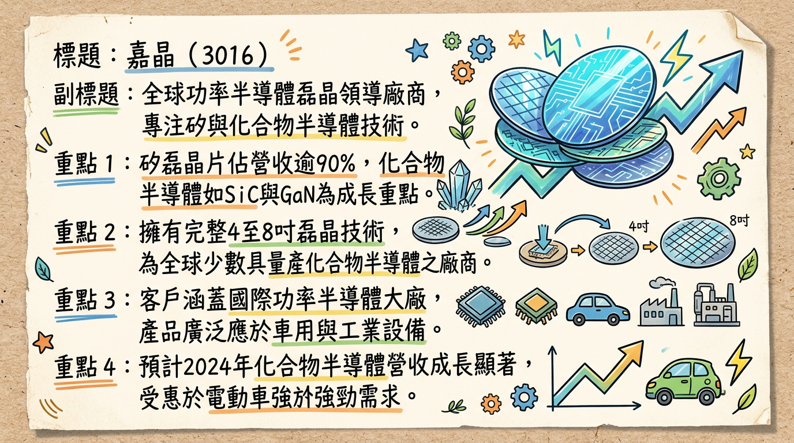
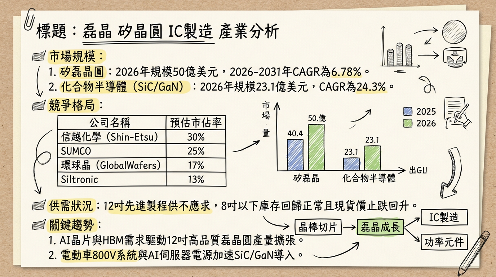
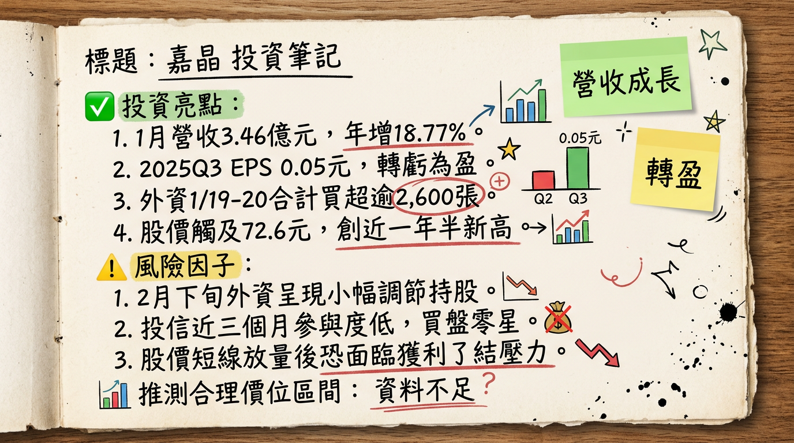

# 3016 嘉晶 深度研究報告

## 一句話摘要
嘉晶（3016）已成功渡過 2025 年化合物半導體殺價競爭的谷底，隨著 2026 年上半年 8 吋 SiC/GaN 進入量產，配合 AI 電源管理與車用需求復甦，營運正式進入「價量齊揚」的強勁成長循環。

---

## 公司概覽
嘉晶電子為全球領先的功率半導體磊晶供應商，產品涵蓋矽磊晶（Si Epi）與化合物半導體（SiC/GaN）。其核心競爭力在於擁有從 4 吋到 8 吋全系列磊晶技術，並與母公司漢磊（3707）形成垂直整合優勢，鎖定非中系供應鏈客戶。

### 營收結構預估 (2025-2026)
| 產品線 | 營收佔比 (估) | 應用領域 | 2026 展望 |
| :--- | :--- | :--- | :--- |
| **8 吋矽磊晶** | 45% - 50% | PMIC、功率 IC、AI 伺服器 | 雙位數成長 |
| **6 吋及以下矽磊晶** | 35% - 40% | 消費性電子、工控、車用元件 | 穩定復甦 |
| **化合物半導體 (SiC/GaN)** | 10% - 15% | EV 800V 系統、AI 高階電源、儲能 | 爆發性成長 |

---

## 核心競爭優勢
1.  **8 吋化合物半導體領先地位**：嘉晶為少數具備 8 吋 SiC 與 GaN 磊晶開發能力的廠商，2026 年上半年量產後可較 6 吋降低約 30% 成本。
2.  **非中系供應鏈紅利**：面對中國廠商（如英諾賽科）價格戰，嘉晶積極爭取日系、歐美車用及 AI 客戶，日系客戶因分散風險需求，採購意願顯著提升。
3.  **垂直整合效應**：受惠漢磊集團在功率半導體的佈局，能提供從磊晶到代工的完整解決方案，確保 AI 伺服器 800V 電源模組的需求。

---

## 財務分析

### 最近 6 個月月營收趨勢
| 月份 | 營收 (億新台幣) | 月增率 MoM | 年增率 YoY | 備註 |
| :--- | :--- | :--- | :--- | :--- |
| **2026/01** | 3.46 | -0.03% | +18.77% | 維持高檔，反映需求復甦 |
| **2025/12** | 3.46 | -7.21% | +18.79% | 年增顯著，營運落底回升 |
| **2025/11** | 3.73 | +7.58% | +9.18% | 近 10 季新高 |
| **2025/10** | 3.46 | +3.16% | +1.14% | 庫存調整結束 |
| **2025/09** | 3.36 | +4.56% | -4.32% | 季增轉正 |
| **2025/08** | 3.21 | +0.88% | -8.86% | 觸底跡象 |

### 年度獲利數據預估
*   **2024 實際**：營收 41.07 億元，EPS 0.92 元。
*   **2025 估計**：營收 38.91 億元，EPS 預估為 -0.03 至 -0.22 元之間（獲利谷底）。
*   **2026 預估**：營收挑戰雙位數年增，EPS 預計回升至 **0.93 元以上**。

---

## 法說會重點
*   **8 吋需求強勁**：管理層預期 2026 年 8 吋矽磊晶將實現 **Double-digit（雙位數）** 成長，主要受 PMIC 與伺服器架構升級帶動。
*   **化合物半導體量產**：8 吋 GaN 與 SiC 磊晶已完成開發與送樣，確認於 **2026 年上半年** 開始小量生產。
*   **2025 下半年指引**：營收較上半年增長「高個位數」，2025 Q3 資本支出達 **9,756 萬元**，主要投入化合物半導體試產。

---

## 券商觀點
| 券商名稱 | 報告日期 | 評等 | 目標價 | 2026 EPS 預估 | 備註 |
| :--- | :--- | :--- | :--- | :--- | :--- |
| **國泰證券** | 2026/01/06 | 中立 | **62 元** | 0.93 元 | 反映 8 吋需求超預期 |
| **元富證券** | 2025/09/18 | 中立 | **60 元** | 未提供 | 觀察化合物半導體轉折 |
| **本土投顧 A**| 2025/12/20 | 增加持股| **66.8 元**| 未提供 | 支撐價 46.6 元 |

---

## 財報深度分析
### 利潤率趨勢與資本支出
| 季度 | 毛利率 (%) | 營業利益率 (%) | EPS (元) | 資本支出 (萬元) |
| :--- | :--- | :--- | :--- | :--- |
| **2025 Q3** | 7.79% | 0.45% | 0.05 | 9,756 |
| **2025 Q4 (E)**| 12% - 14%| 3% - 5% | 0.06 | 12,000 |
| **2026 全年 (E)**| 15% - 20%| 8% - 12% | 0.93 | 45,000 |

*   **存貨分析**：2025 年 Q3 起存貨水位已回歸正常化，2026 年營收成長將直接帶動產能利用率上升，產生顯著的經營槓桿。

---

## 股權異動與法人動向
*   **外資買超**：2026 年 1 月 19-20 日合計買超超過 **2,600 張**，持股比重顯著提升。
*   **近期股價**：2026 年 1 月 21 日創波段高點 **72.6 元**。
*   **關鍵異動**：法人操作已由 2025 年的觀望轉向積極卡位 2026 年轉盈題材。

---

## 產業分析
### 市場規模與趨勢
*   **矽磊晶**：2026 年全球市場預計達 **50 億美元**。
*   **化合物半導體 (SiC/GaN)**：2026 年市場將跳升至 **23.1 億美元**，CAGR 高達 **24.3%**。

### 競爭格局比較 (2025 數據)
| 公司 (代號) | 2025 營收 (億) | 毛利率 (估) | 核心優勢 |
| :--- | :--- | :--- | :--- |
| **嘉晶 (3016)** | 38.92 | 8% - 10% | **8 吋 SiC 磊晶開發能力** |
| **漢磊 (3707)** | 54.21 | 12% - 15% | 代工整合，與世界先進合作 |
| **環球晶 (6488)** | 680+ | 30% - 33% | 12 吋全球領先，規模經濟 |
| **合晶 (6182)** | 95.5 | 18% - 22% | 專注重摻矽晶圓，車用比高 |

---

## 近期催化劑
*   **利多事件**：
    1.  2026/03 月營收公告（預期維持雙位數年增）。
    2.  8 吋 SiC 磊晶正式通過歐美車用客戶驗證。
    3.  AI 伺服器電源架構 800V 升級，GaN 訂單能見度直達年底。
*   **利空事件**：
    1.  中國 SiC 產能擴張導致價格戰重啟。
    2.  川普政府若重啟貿易制裁，可能影響設備進口。

---

## ⭐ 成長動能時間軸
*   **2025 Q4**：單季營收創 10 季新高 (10.64 億)，獲利轉虧為盈。
*   **2026/01**：營收年增 18.77%，股價創 72.6 元高點，完成技術面築底。
*   **2026 H1**：**8 吋 SiC/GaN 磊晶進入小量生產**，開始貢獻高毛利營收。
*   **2026 H2**：8 吋矽磊晶產能利用率回升至 80% 以上，化合物半導體隨車用與 AI 需求放量。
*   **2026 FY**：全年營收目標雙位數成長，獲利較 2025 年顯著跳升。

---

## 2026 展望
*   **成長動能**：8 吋產品佔比提升是優化毛利的關鍵。AI 伺服器與 EV 800V 快充系統對高品質磊晶的剛性需求，抵消了成熟產品的價格壓力。
*   **風險**：需警惕中國英諾賽科等廠商在 6 吋 GaN 的低價傾銷，以及全球總經環境對車用半導體復甦時程的影響。

---

## 投資結論
1.  **營運轉折確立**：2025 年為嘉晶的獲利谷底，2026 年 1 月營收已展現強勁復甦，確認重回成長軌道。
2.  **技術升級紅利**：2026 年上半年 8 吋 SiC/GaN 的量產將是股價的核心驅動力，有助於脫離中國價格戰的泥沼。
3.  **法人卡位明確**：外資持股比重回升，顯示長線資金認可其在化合物半導體供應鏈的地位。
4.  **建議目標價區間**：
    *   **合理區間**：**62 - 70 元**（基於 2026 EPS 預估及歷史本益比區間）。
    *   **壓力位**：**72.6 - 75 元**（需 8 吋產品量產良率達標方可站穩）。
    *   **支撐位**：**55 - 58 元**。

---
**本報告由 AI 自動產生，資料來源為公開網路資訊，僅供參考，不構成投資建議。產生時間：2026-03-01 02:33**

---

## 📊 資訊卡

