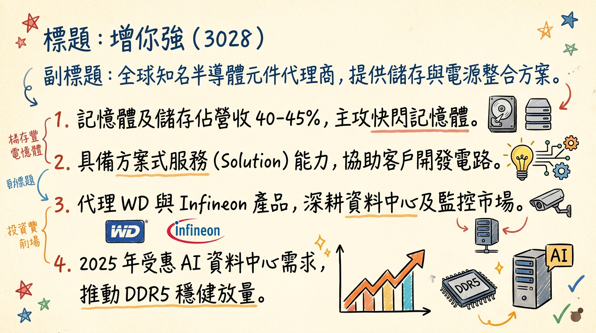
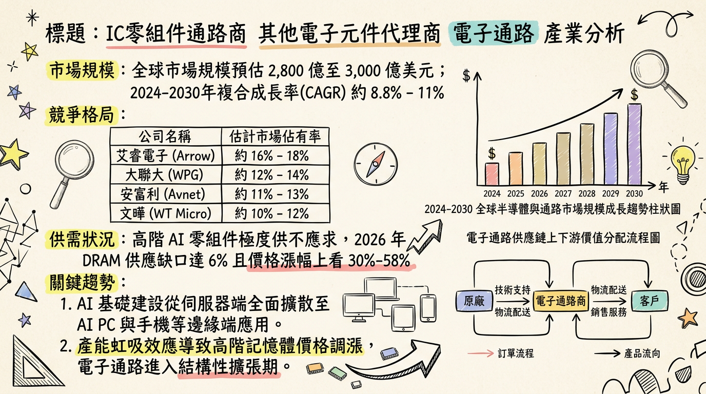
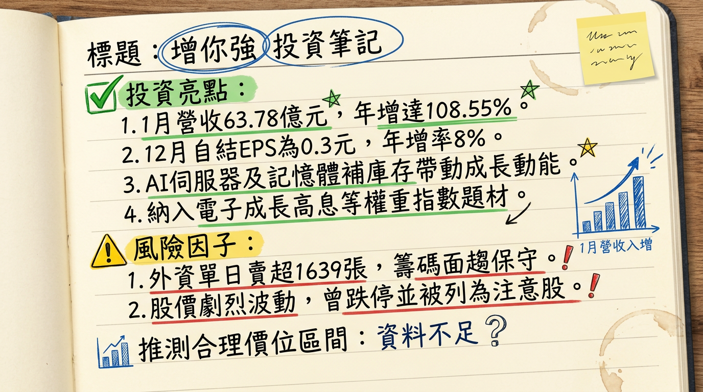

# 3028 增你強 深度研究報告

**日期：2026年03月01日**
**分析師：頂尖台股研究團隊**

---

## ## 一句話摘要
增你強（3028）憑藉 **AI 伺服器高壓電源方案** 與 **記憶體價格上升週期** 雙重紅利，2026 年 1 月營收創下歷史新高（YoY +108%），正式進入獲利爆發期。

---

## ## 公司概覽
增你強（Zenitron）為台灣資深電子通路商，定位為「方案式服務提供者（Solution Provider）」。與傳統通路商不同，其擁有強大的電路設計團隊，協助客戶（原廠）進行技術導入。

### **營收結構（2025 年法說會預估）**
| 業務類別 | 營收佔比 | 核心代理品牌 / 應用 |
| :--- | :---: | :--- |
| **記憶體與儲存 (Memory)** | 40% - 45% | Western Digital / SanDisk (NAND Flash, DDR4/5) |
| **電源與類比元件 (Power)** | 20% - 25% | Infineon, Renesas (AI 伺服器電源、高壓 MOSFET) |
| **工業、車用及通訊** | 20% | 800V 電動車平台、網通設備 |
| **消費性電子及其他** | 10% - 15% | MCU、感測器、被動元件 |

---

## ## 核心競爭優勢
1.  **高階代理權穩固**：身為 Western Digital (WD) 亞太區主要代理商，直接受惠於 AI 伺服器引發的儲存需求及記憶體漲價。
2.  **技術導向轉型**：不僅是代理，更切入「AI 伺服器電源整櫃系統整合」，提供 HVDC 800V 高壓架構方案。
3.  **區域佈局紅利**：成功打入中國「國產替代」供應鏈，並透過菲律賓新廠因應「China + 1」全球供應鏈調整。

---

## ## 財務分析

### **月營收趨勢表格（近 6 個月）**
| 月份 | 營收金額 (億新台幣) | 月增率 MoM | 年增率 YoY | 備註 |
| :--- | :---: | :---: | :---: | :--- |
| **2026/01** | **63.78** | **+79.22%** | **+108.55%** | **創下單月歷史新高** |
| **2025/12** | 35.59 | -2.87% | +25.31% | 2025 年底拉貨穩健 |
| **2025/11** | 36.64 | -6.43% | +23.68% | 營收動能轉強 |
| **2025/10** | 39.16 | -4.09% | +36.59% | AI 需求開始顯現 |
| **2025/09** | 40.83 | +13.97% | +23.06% | 第三季末旺季效應 |
| **2025/08** | 35.82 | +6.28% | +11.11% | 庫存去化完成 |

### **年度趨勢預估**
*   **2024 年營收**：364.17 億元 (EPS 2.08 元)
*   **2025 年營收**：414.44 億元 (年增 13.8%，EPS 預估 2.5 - 2.65 元)
*   **2026 年展望**：受惠 1 月爆發性增長，EPS 預計上修至 **3.2 - 3.8 元**。

---

## ## 法說會重點（2025/11/24 管理層發言摘要）
1.  **需求展望**：AI Server 與 Edge AI 需求極為強勁，預期 2026 年首季呈現「淡季不淡」。
2.  **記憶體循環**：市場處於「供不應求」狀態，DDR5 與 NAND 價格上漲帶動利差擴大。
3.  **庫存效率**：庫存天數已從 100 天降至 **79 天**（最新數據已進一步優化至 59 天左右），營運資金報酬率提升至 **9.3%**。
4.  **菲律賓佈局**：新廠主要針對車用與工控，預計於 2026 年底貢獻營收。

---

## ## 券商觀點（目標價表格）
| 券商名 | 目標價 | 評等 | 日期 | 核心觀點 |
| :--- | :---: | :---: | :---: | :--- |
| **元大證券** | **58 - 62** | 買進 | 2025/11 | 營收重回成長軌道，高殖利率題材 |
| **凱基證券** | **觀察** | 正向 | 2026/02 | 納入 AI 供應鏈首選，受惠記憶體漲價 |
| **美商高盛** | **N/A** | 積極 | 2026/02 | 單日買超 1,729 張，看好 2026 獲利跳升 |

---

## ## 財報深度分析

### **利潤率趨勢表格**
| 項目 | 2024 Q3 | 2024 Q4 | 2025 Q1 | 2025 Q2 | 2025 Q3 |
| :--- | :---: | :---: | :---: | :---: | :---: |
| **毛利率 (%)** | 6.14 | 7.55 | **8.17** | 7.06 | **6.47** |
| **營業利益率 (%)** | 1.98 | 3.05 | 3.47 | 3.14 | 2.81 |
| **單季 EPS (元)** | 0.43 | 0.88 | 1.09 | 0.12 | 0.79 |

*   **存貨分析**：2025 Q3 存貨週轉天數降至 **58.97 天**，創兩年新低，資產品質極佳。
*   **財務成本**：負債比率約 **70%-75%**，需留意高利率環境下的利息支出負擔。

---

## ## 股權異動與資本結構
1.  **申報轉讓**：2025 年 3 月董事陳信義曾申報轉讓 1,200 張（洽特定人），此後大股東持股維持穩定。
2.  **股利政策**：2025 年發放 **2.1 元** 現金股利，市場預期 2026 年因獲利成長，配息有望上調至 **2.3 - 2.5 元**。
3.  **可轉債**：目前流通為 30284 (第四次無擔保 CB)，轉換價已隨除息調整。

---

## ## 產業分析

### **競爭對手比較表格 (2025 全年資料)**
| 公司 (代號) | 營收規模 (億) | 毛利率 (Q3) | EPS 預估 | 核心優勢 |
| :--- | :---: | :---: | :---: | :--- |
| **增你強 (3028)** | **414.4** | **6.47%** | **2.8-3.2** | WD 記憶體代理、AI 高壓電源 |
| 大聯大 (3702) | 9,991.2 | 3.8% | 4.5-5.0 | 全球最大規模、物流平台強 |
| 文曄 (3036) | 11,800.0 | 4.2% | 6.0-6.5 | 併購 Future 後切入歐美工控 |
| 至上 (8112) | 2,500.0 | 3.1% | 4.5-5.2 | 三星記憶體最大代理商 |

**市場趨勢**：2026 年 DRAM 供應缺口預估為 **6%**，DDR5 與 NAND 價格首季預期漲幅達 **30%-50%**，通路商在庫存價值與利差上同步獲益。

---

## ## 近期催化劑
*   **【利多】** 2026/01 營收月增 79%，顯示 AI 伺服器整櫃訂單進入爆發性交付期。
*   **【利多】** 納入「特選台灣電子成長高息等權重指數」，2026/07/01 生效，法人將提前被動建倉。
*   **【利空/風險】** 2026/02 因股價劇烈波動被列為「注意股」，短線融資過多需注意技術性修正。

---

## ## ⭐ 成長動能時間軸
*   **2026 / Q1**：
    *   **新產品**：800V 高壓架構與 HVDC 電源元件正式大量上線。
    *   **新市場**：成功切入中國監控設備（如海康/大華類）與自主 IC 設計供應鏈。
*   **2026 / Q2**：
    *   **需求面**：記憶體報價預期持續走高，貢獻高毛利利潤。
*   **2026 / Q3**：
    *   **事件**：7/1 高息指數納入生效，預期帶來穩定買盤。
*   **2026 / Q4**：
    *   **擴廠**：**菲律賓新廠**正式量產，擴大東南亞車用與工控市場份額。

---

## ## 2026 展望
*   **成長動能**：AI 儲存需求帶動 WD 產品線出貨；伺服器電源架構升級推升 Infineon 產品單價；記憶體報價續揚。
*   **風險**：上游原廠供貨若發生排擠可能導致缺貨；人民幣匯率波動影響中國業務獲利；通路商高負債比帶來的財務利息壓力。

---

## ## 投資結論
1.  **營運轉折確認**：1 月營收突破 63 億元宣告基本面正式轉強。
2.  **高殖利率支撐**：EPS 上看 3.5 元，若以 70% 配發率計算，目前股價具備防禦性。
3.  **AI 純度提升**：由傳統通路轉向 AI 伺服器電源方案商，估值（PE）有機會從 12 倍調升至 15-18 倍。
4.  **建議操作**：目標價區間建議 **58 - 65 元**。短線若因注意股修正回 50 元以下為長線佈局點。

---
本報告由 AI 自動產生，資料來源為公開網路資訊，僅供參考，不構成投資建議。產生時間：2026-03-01 02:53

---

## 📊 資訊卡

