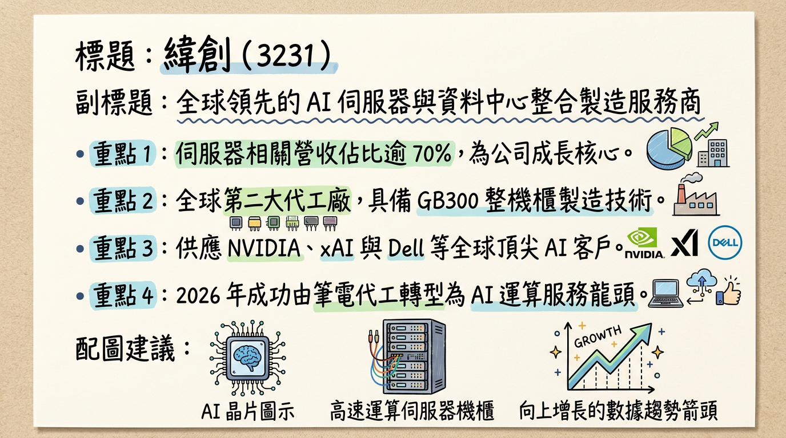
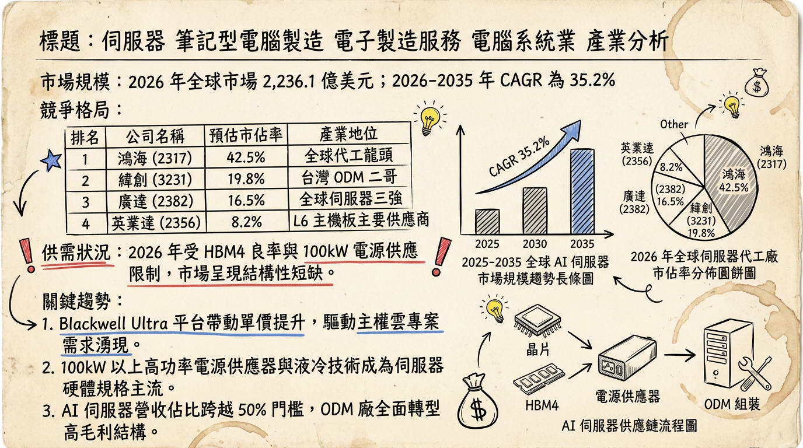
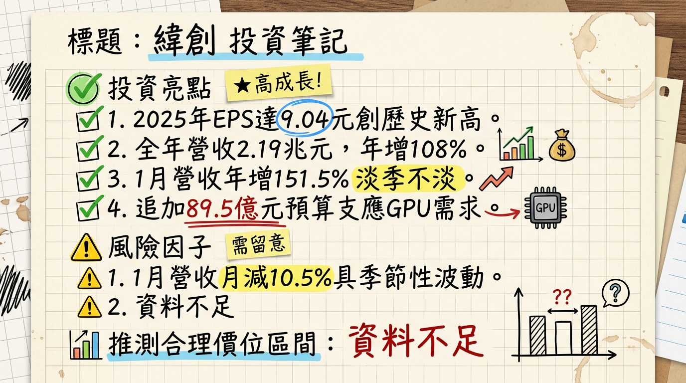

# 3231 緯創 (Wistron) 深度研究報告：從筆電代工轉身，跨入 AI 算力基礎設施的新紀元

## 一句話摘要
緯創已成功轉型為 **AI 伺服器核心供應商**，2025 年營收突破 2.1 兆元，躍升為電子代工「二哥」，2026 年將受惠於 **GB300 機櫃放量**與**網通業務 10 倍成長**，獲利有望挑戰歷史新高。

---

## 公司概覽
緯創目前為全球第二大電子代工製造服務商（EMS/ODM），其業務重心已從傳統的筆記型電腦（NB）全面向 AI 伺服器、高效能運算（HPC）及資料中心轉型。

**2025-2026 營收結構預估表格**
| 業務板塊 | 營收佔比 | 核心產品 / 服務 | 成長動能 |
| :--- | :--- | :--- | :--- |
| **伺服器相關 (含緯穎)** | **70% - 75%** | NVIDIA GPU 基板、GB200/300 運算托盤、L10/L11 整機櫃 | AI 需求爆發、xAI 訂單 |
| **3C 電子 (NB/DT)** | **20% - 25%** | 筆記型電腦、桌上型電腦、顯示器 | AI PC 換機潮、出貨量約 2,410 萬台 |
| **網通及其他** | **5% 以內** | 高速交換機 (Switch)、智慧醫療、車電 | 2026 年預計 10 倍成長空間 |

---

## 核心競爭優勢
1.  **NVIDIA 關鍵合作夥伴：** 在 Blackwell 平台（GB200/GB300）中，緯創擁有 GPU 運算板（Computing Tray）的高市佔率，並具備垂直整合基板至整機櫃的能力。
2.  **全球化產能佈局：** 擁有台灣、美國、墨西哥、馬來西亞、越南五地產能，能有效避開地緣政治關稅風險，特別是美國達拉斯廠對北美 CSP 客戶的就近服務。
3.  **網通與液冷整合：** 透過旗下緯穎技術支援，緯創在 AI 機櫃所需的液冷散熱（Sidecar/CDU）與高速網通設備（800G/1.6T 交換器）具備領先研發實力。

---

## 財務分析

**最近 6 個月月營收趨勢表格 (2025.08 - 2026.01)**
| 月份 | 營收金額 (億元 TWD) | 月增率 (MoM) | 年增率 (YoY) | 備註 |
| :--- | :---: | :---: | :---: | :--- |
| **2026/01** | 2,283.67 | -10.53% | **+151.54%** | 淡季不淡，歷史同期新高 |
| **2025/12** | 2,552.54 | -9.04% | **+141.59%** | AI 伺服器放量 |
| **2025/11** | 2,806.24 | +51.64% | **+194.64%** | **單月歷史新高** |
| **2025/10** | 1,850.62 | -9.03% | +92.20% | 產品轉換過渡期 |
| **2025/09** | 2,034.37 | +17.84% | +109.94% | 季末出貨效應 |
| **2025/08** | 1,726.43 | -9.95% | +92.21% | AI 訂單開始拉升 |

**年度財務趨勢預估**
*   **2024 (實際)：** 營收 1.04 兆元，EPS **6.11 元**。
*   **2025 (自結)：** 營收 **2.19 兆元** (YoY +108%)，EPS **9.04 元** (歷史新高)。
*   **2026 (法人預估)：** 營收挑戰 **2.9 - 3.03 兆元**，EPS 預估 **12.3 ~ 14.22 元**。

---

## 法說會重點與管理層指導
*   **訂單能見度：** 董事長林憲銘表示，AI 基礎建設投資仍處於成長初期（1.5 波），訂單已排至 **2027 年**。
*   **網通業務：** 預期 2026 年為爆發元年，因取得北美 CSP 大客戶交換機訂單，營收具 **10 倍成長潛力**。
*   **筆電展望：** 態度相對保守，預估 2026 年受成本轉嫁影響，出貨量可能持平或微幅衰退。
*   **產能利用率：** 美國德州廠 2026 Q1 量產，墨西哥廠 L10 良率已與台灣同步。

---

## 券商觀點

**券商目標價與評等表 (2025.10 - 2026.02)**
| 券商名稱 | 評等 | 目標價 (TWD) | 2026 EPS 預估 | 報告日期 |
| :--- | :---: | :---: | :---: | :---: |
| **摩根士丹利 (MS)** | 優於大盤 | **215** | > 13.0 | 2026/01/16 |
| **富邦證券** | 增加持股 | **210** | 12.02 | 2026/01/07 |
| **FactSet 綜合** | 中位數 | **190** | 12.64 | 2026/02/13 |
| **高盛證券** | 買進 | 188 | 11.5 | 2025/10/29 |

---

## 財報深度分析

**利潤率趨勢表格**
| 指標 | 2025 Q1 | 2025 Q2 | 2025 Q3 | 2025 Q4 (自結) |
| :--- | :---: | :---: | :---: | :---: |
| **毛利率 (GPM)** | 7.10% | 6.50% | **7.39%** | **5.62%** |
| **營業利益率 (OPM)** | 4.30% | 4.10% | 4.78% | 3.53% |
| **稅後淨利率 (NPM)** | 1.40% | 1.25% | 1.30% | 1.13% |

*   **分析：** 2025 Q4 毛利率稀釋至 5.62%，主因為 **Pass-through (代採購零件)** 模式的整機櫃佔比拉高。雖然營收總額暴增，但會計結構導致毛利率下滑，法人視其為「產品組合調整」的短線陣痛。
*   **資本支出 (CapEx)：** 2025 年約 **355 億元**。2026 年 1 月董事會再追加 **89.54 億元** 預算購置新竹廠設備，顯示需求極度強勁。

---

## 股權異動
*   **經理人申報轉讓：** 2026/01/26 張聰耀轉讓 250 張；2025/10/14 林福謙配偶轉讓 400 張（多屬例行理財或納稅需求）。
*   **庫藏股：** 近期無執行計畫。
*   **股利政策：** 2025 年配發 **3.799 元** 現金股利，配發率約 62%，隨 EPS 提升，2026 年股利可期。

---

## 產業分析

**2025-2026 全球 AI 伺服器代工競爭格局**
| 排名 | 公司 | 市佔預估 | 優勢 |
| :--- | :--- | :---: | :--- |
| 1 | **鴻海 (Foxconn)** | 40-50% | 垂直整合能力、全球最大產能 |
| 2 | **緯創 (Wistron)** | **20-25%** | **NVIDIA 基板主供、xAI 核心供應商** |
| 3 | **廣達 (Quanta)** | 20-25% | CSP 客戶關係穩健 (Google/AWS) |
| 4 | **超微電腦 (SMCI)** | 5-8% | 靈活配置、企業級市場 |

---

## 近期催化劑
*   **利多：**
    *   GB300 機櫃 2026 H2 大量出貨，單價較前代提升。
    *   網通產品取得北美 Tier 1 客戶訂單。
    *   液冷滲透率從 32% 提升至 47%，緯創毛利結構有望優化。
*   **利空：**
    *   HBM4 供應瓶頸可能推遲部分高階機種出貨時程。
    *   2026 年下半年關稅不確定性增加，需觀察墨/美廠產能調節。

---

## ⭐ 成長動能時間軸
*   **2025 Q4：** GB200 開始初步交付，新竹 AI 智慧園區一廠滿載。
*   **2026 Q1：** 美國達拉斯廠正式量產，服務 NVIDIA 次世代架構。
*   **2026 Q2：** 新竹 AI 二廠（304.8 億元投資案）設備進駐，鎖定 GPU 運算板訂單。
*   **2026 H2：** **Blackwell Ultra (GB300)** 世代成為市場主流，機櫃預估年出貨突破 **1.1 萬櫃**。
*   **2027 年：** 網通與 AI 醫療業務營收佔比首度突破 10%，利潤結構趨於多元。

---

## 2026 展望
*   **成長動能：** AI 伺服器營收佔比將正式突破 **80%**，公司性質已轉為純度極高的「算力概念股」。
*   **風險：** 若高單價 Pass-through 產品持續拉高，毛利率維持在 6% 以下可能壓抑本益比提升；另需注意鴻海在 L10 領域的強勢競爭。

---

## 投資結論
1.  **營運位階提升：** 營收規模超越廣達後，展現更強的規模經濟與議價能力，2026 年預估 EPS 具備 13-14 元實力。
2.  **短期整理即是買點：** 2025 Q4 的毛利率稀釋已在股價中反應，隨著 2026 年網通與高毛利組件比重增加，獲利率將回升。
3.  **評價建議：**
    *   **合理評價區間：** 根據歷史平均 15-18 倍本益比，目標價位落於 **185 - 215 元**。
    *   **操作策略：** 建議在 150-160 元區間進行長期佈局，迎接 2026 年獲利爆發。

---
本報告由 AI 自動產生，資料來源為公開網路資訊，僅供參考，不構成投資建議。產生時間：2026-03-01 02:11

---

## 📊 資訊卡

