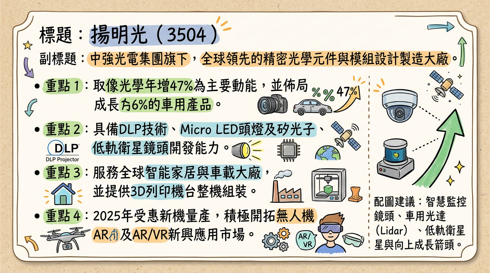
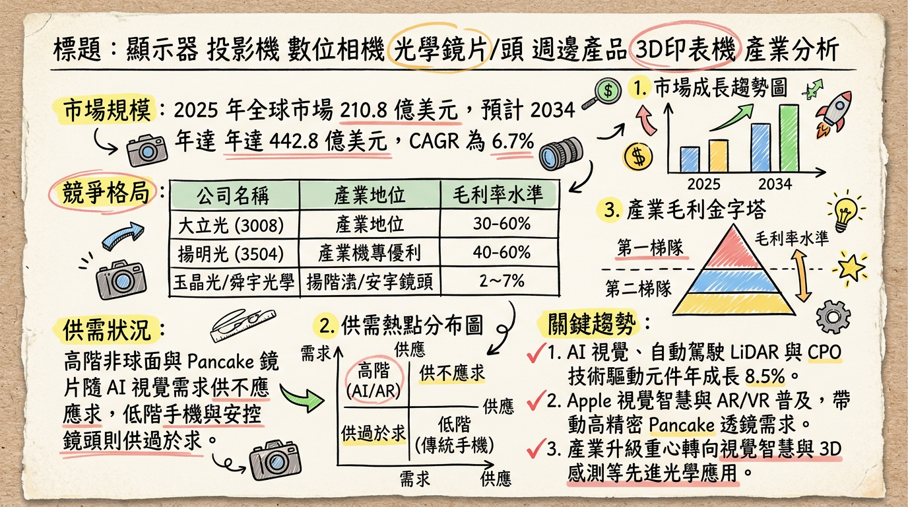
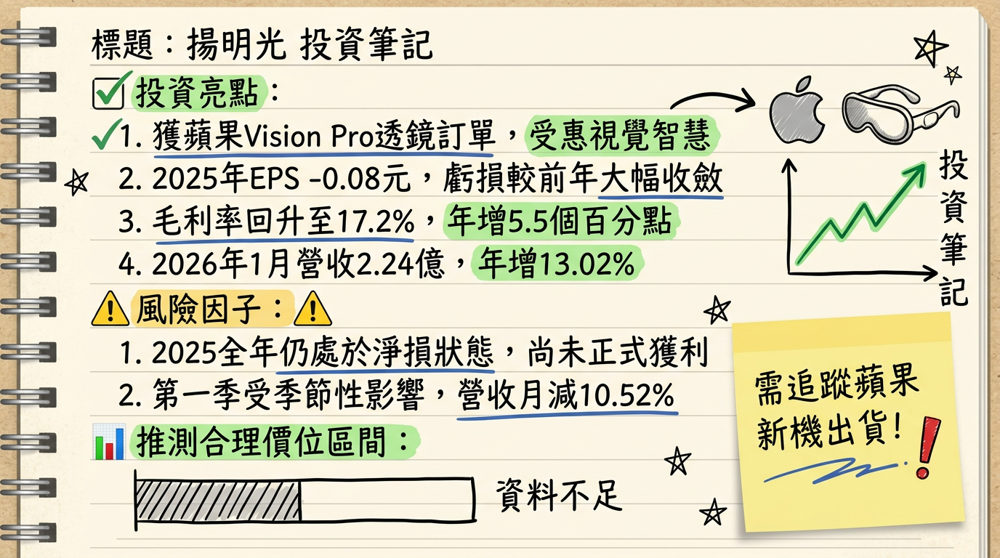

# 3504 揚明光 深度研究報告

## 一句話摘要
揚明光正處於從傳統投影業務轉向「車用、AI 矽光子、AR 眼鏡及低軌衛星」的轉型關鍵期，2025 年虧損大幅收斂 96%，預計 **2026 年將正式實現轉虧為盈**。

---

## 公司概覽
揚明光（Young Optics）隸屬於中強光電集團，為全球精密光學元件大廠。2025 年公司積極優化產品組合，縮減低毛利投影業務，轉向高成長的新興技術領域。

**2025 年各業務營收表現與動態：**
| 產品線 | 2025 營收年增率 | 業務動態與展望 |
| :--- | :--- | :--- |
| **取像光學 (智能家居)** | **+47%** | 成長最強勁，受惠於新機種量產（如 Amazon 等品牌）。 |
| **車用產品** | **+6%** | Lidar 鏡頭及智慧頭燈需求上升，填補 HUD 下滑。 |
| **3D 列印** | **+1%** | 表現持平，提供光機引擎與整機組裝。 |
| **其他 (含低軌衛星)** | **佔比 +2%** | 低軌衛星鏡頭已穩定出貨，成為新成長引擎。 |
| **光學元件** | **-20%** | 受傳統投影市場萎縮影響，持續縮減規模。 |
| **微投光機** | **-29%** | 受中國低價 LCD 投影技術競爭，採取止損策略。 |

---

## 核心競爭優勢
1.  **DLP 與微投技術領先**：具備光學引擎設計到整機組裝的垂直整合能力。
2.  **高階光學材料應用**：具備衛星級與軍事級光學鏡頭量產實績，技術門檻高。
3.  **矽光子 (CPO) 佈局**：開發光纖陣列 (FAU) 元件與 MT 連接器，切入 AI 資料中心供應鏈。
4.  **AR/VR 核心供應**：具備 Pancake 透鏡量產能力，為歐美大廠穿戴裝置核心夥伴。

---

## 財務分析

### 1. 月營收趨勢表格
| 月份 | 營收 (新台幣) | 月增率 (MoM) | 年增率 (YoY) |
| :--- | :--- | :--- | :--- |
| **2026/01** | **2.24 億元** | **-10.52%** | **+13.02%** |
| 2025/12 | 2.50 億元 | +8.60% | +0.29% |
| 2025/11 | 2.30 億元 | +11.14% | +5.80% |
| 2025/10 | 2.07 億元 | -9.39% | -3.04% |
| 2025/09 | 2.28 億元 | +10.43% | -3.54% |
| 2025/08 | 2.07 億元 | -2.35% | -3.08% |

### 2. 季度與年度趨勢
*   **2024 年實績**：營收 25.72 億元，**EPS -2.17 元**。
*   **2025 年實績**：營收 26.89 億元（年增 4.5%），**EPS -0.08 元**（虧損收斂 96%）。
*   **2026 年預估**：法人預期營收重回 30 億元水準，**EPS 預估為 0.15 至 0.45 元**。

---

## 法說會重點（2026/02/06）
*   **2026 Q1 Guidance**：受農曆年工作天數減少影響，出貨量預估較 2025 Q4 持平或略低，但**營收與毛利率將顯著優於 2025 年同期**。
*   **獲利展望**：總經理張雅容明確表示，2026 年全年度目標為「**轉虧為盈**」。
*   **新應用進度**：
    *   **低軌衛星**：已量產出貨，2026 年將持續貢獻。
    *   **物流投影鏡頭**：預計 **2026 年 Q2** 正式量產，為營收回升關鍵。
    *   **矽光子 (CPO)**：MT 連接器已完成送樣，預計 2026 年下半年產能逐步開出。

---

## 券商觀點
| 券商名 | 目標價 | 評等 | 日期 | 備註 |
| :--- | :--- | :--- | :--- | :--- |
| **康和證券** | **62 元** | **看多 (Buy)** | 2025/07/29 | ⚠️ 超過 6 個月，標記過時 |
| **法人綜合預估** | **N/A** | **中立轉偏多** | 2026/02/09 | 聚焦 2026 轉盈潛力 |
| **永豐金證券** | **N/A** | **中立** | 2025/02/14 | ⚠️ 嚴重過時，僅供參考 |

---

## 財報深度分析

### 1. 利潤率趨勢表格
| 期間 | 毛利率 | 營業利益率 | 稅後淨利率 | EPS (元) |
| :--- | :--- | :--- | :--- | :--- |
| **2025 Q4** | **20.05%** | **0.06%** | -1.10% | -0.06 |
| 2025 Q3 | 16.19% | -3.70% | -0.09% | -0.02 |
| 2025 Q2 | 16.50% | -2.60% | 0.51% | 0.03 |
| 2025 Q1 | 15.00% | -4.97% | 0.71% | 0.04 |
| **2025 全年** | **17.20%** | **-2.80%** | **-0.33%** | **-0.08** |
| 2024 全年 | 11.70% | -9.60% | -9.64% | -2.17 |

### 2. 營運與資本分析
*   **存貨分析**：2025 年底存貨週轉天數約 **63.16 天**，較 2024 年底的 68 天持續改善，無庫存積壓風險。
*   **業外收入**：2025 Q2 認列 **3,891 萬元**火災保險理賠，挹注上半年獲利。
*   **折舊費用**：2025 年折舊約 **2.82 億元**，呈緩步下降趨勢，有利於利潤空間釋放。

---

## 股權異動
*   **董監持股**：近期無重大申報轉讓或大股東減持紀錄。
*   **庫藏股與 CB**：目前無執行中之庫藏股計畫，亦無流通中之可轉換公司債（CB）。
*   **股利政策**：2025 年每股淨損 0.08 元，預計 2026 年**不配發股利**。

---

## 產業分析

### 1. 市場趨勢
全球光學鏡頭市場 2025 年約 **210.8 億美元**，預計以 **6.7% CAGR** 成長。揚明光避開手機鏡頭紅海，轉向 AI 視覺眼鏡及 CPO 矽光子等先進光學技術（CAGR 8.5%）。

### 2. 競爭格局比較表格 (2025 年數據)
| 公司名稱 | 2025 營收 (億) | 平均毛利率 | 核心領域 | 揚明光對應優勢 |
| :--- | :--- | :--- | :--- | :--- |
| **舜宇光學** | ~1,500 (人民幣) | ~18% | 車用、手機鏡頭 | 揚明光專精 DLP 投影及特殊規格 |
| **大立光** | ~550 (台幣) | ~47% | 高階手機鏡頭 | 揚明光深耕 3D 列印與工業應用 |
| **玉晶光** | ~215 (台幣) | ~36% | Apple AR/VR | 揚明光具備 LEO 衛星鏡頭實績 |
| **揚明光** | **26.89 (台幣)** | **17.2%** | **CPO、衛星、車載** | **小眾高毛利市場利基點強** |

---

## 近期催化劑
*   **利多事件**：
    1.  **Apple 視覺智慧合作**：受益於新一代 Vision Pro 系列訂單。
    2.  **物流鏡頭量產**：2026 Q2 正式出貨，將顯著推升營收。
    3.  **矽光子送樣**：下半年 CPO 元件進入規格升級週期。
*   **利空事件**：
    1.  **消費性投影萎縮**：傳統業務持續衰退 20% 以上。
    2.  **匯率風險**：台幣強升可能侵蝕毛利。

---

## ⭐ 成長動能時間軸
*   **2025 下半年**：低軌衛星鏡頭穩定放量，矽光子 (CPO) 完成首階段送樣。
*   **2026 Q1**：受農曆年影響營收微降，但毛利率站穩 20% 水準，確立優於去年同期。
*   **2026 Q2**：**物流投影鏡頭**正式量產出貨，成為營收回溫主動能。
*   **2026 全年**：**車用 Lidar/智慧頭燈**出貨量預期較去年「倍增」。
*   **2026 下半年**：**AR 眼鏡**與兩家大廠合作進入量產，**矽光子產能**正式開出。

---

## 2026 展望
*   **成長動能**：物流鏡頭新單填補缺口、車用 Lidar 倍增成長、AR/VR 與 CPO 技術貢獻高毛利。
*   **風險**：傳統投影業務萎縮速度快於預期、地緣政治影響關稅成本。
*   **獲利預測**：在稼動率提升與產品組合優化下，營益率有望轉正，實現年度轉盈。

---

## 投資結論
1.  **基本面觸底反彈**：2025 年 EPS -0.08 元已接近損益兩平點，2026 年「轉盈」能見度高。
2.  **高毛利組合轉型**：毛利率從 2024 年的 11.7% 提升至 2025 Q4 的 20.05%，顯示轉型效益。
3.  **多重題材加持**：具備 **Apple 視覺智慧、低軌衛星、矽光子 (CPO)** 三大強勢科技題材。
4.  **評價面分析**：目前股價位於淨值比河流圖低檔，法說會後市場預期轉趨積極。
5.  **目標價區間建議**：參考 2026 年預估 EPS (0.3~0.45 元) 及產業復甦評價，短中期合理區間看 **60-65 元**，若 AR/VR 與 CPO 產能量產進度超前，有望挑戰長期目標價。

---
本報告由 AI 自動產生，資料來源為公開網路資訊，僅供參考，不構成投資建議。產生時間：2026-03-01 02:13

---

## 📊 資訊卡

