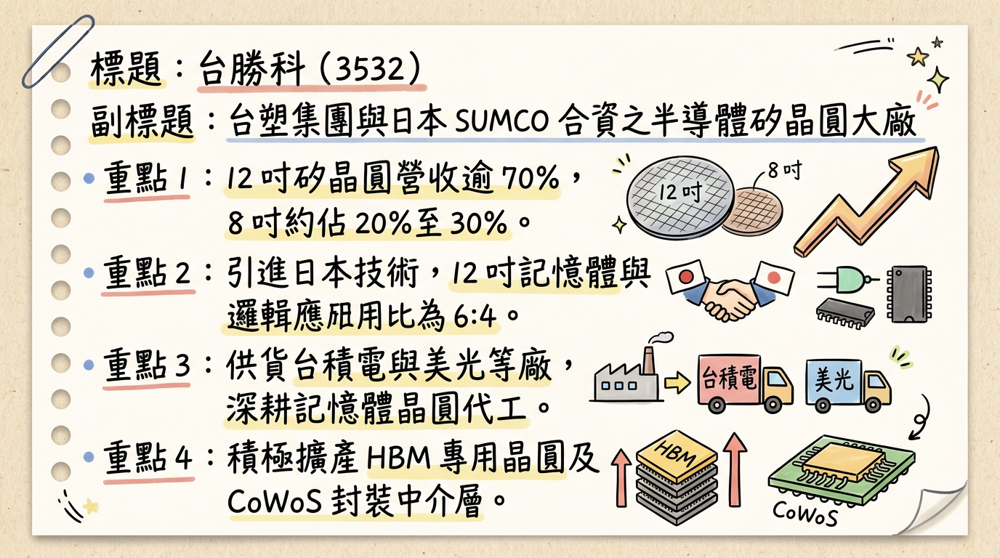
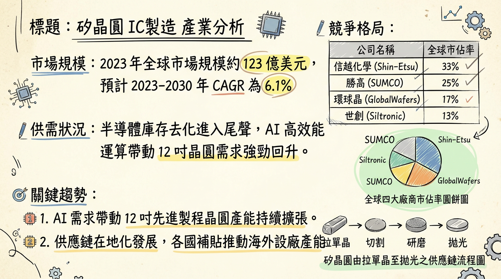
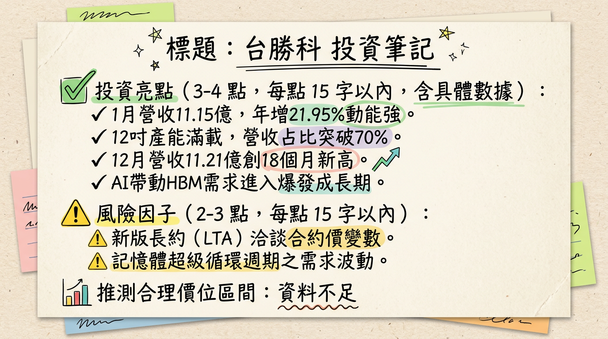

# 3532 台勝科 深度研究報告

## 一句話摘要
**台勝科（3532）正處於由 8 吋成熟製程轉向 12 吋 AI 高階應用的關鍵轉型期，隨麥寮新廠於 2026 年全面產能爬坡，搭配 HBM4 認證與記憶體超級循環，預期 2026 年 EPS 將迎來爆發性增長（YoY +66%）。**

---

## 公司概覽
台勝科（Formosa Sumco Technology）為台塑集團與全球第二大矽晶圓廠日本 SUMCO 之合資公司。核心業務為半導體級矽晶圓之研發、製造與銷售，技術高度依賴日本 SUMCO 移轉。

### 營收結構（資料日期：2025/11/28 法說會）
| 產品線 | 營收佔比 | 主要應用 | 市場動態 |
| :--- | :--- | :--- | :--- |
| **12 吋矽晶圓** | **70% - 80%** | 記憶體(DDR5/HBM)、先進邏輯製程(5nm/3nm) | 稼動率 100% 滿載，需求強勁 |
| **8 吋矽晶圓** | **20% - 30%** | 車用、PMIC、成熟製程 | 面臨中國同業價格競爭，復甦緩慢 |

*註：12 吋產品中，記憶體與邏輯應用比例約為 6：4。*

---

## 核心競爭優勢
1.  **母公司技術背書**：日商 SUMCO 提供最先進的拋光片（Polished Wafer）與磊晶片（Epitaxial Wafer）技術。
2.  **集團綜效**：身為台塑集團成員，具備強大的資金調度能力與基礎建設支援（如麥寮廠區）。
3.  **HBM/先進封裝領先佈局**：已切入 CoWoS 中介層（Interposer）及承載晶圓（Carrier Wafer），並正研發 HBM4 專用高平坦度晶圓。
4.  **長約 (LTA) 保護**：麥寮新廠多數產能已提前與一線大廠（美光、台積電等）簽訂長約，獲利能見度高。

---

## 財務分析

### 月營收趨勢表格（2025/08 - 2026/01）
| 月份 | 營收（億元） | 月增率 (MoM) | 年增率 (YoY) | 備註 |
| :--- | :--- | :--- | :--- | :--- |
| **2026/01** | 11.15 | -0.47% | **+21.95%** | 景氣強勁回升 |
| **2025/12** | 11.21 | +3.52% | +3.82% | 創 18 個月新高 |
| **2025/11** | 10.82 | +1.57% | +1.77% | 逐季走揚 |
| **2025/10** | 10.66 | +1.85% | +9.40% | --- |
| **2025/09** | 10.46 | +1.56% | +2.44% | --- |
| **2025/08** | 10.30 | +1.81% | +2.23% | --- |

### 年度獲利趨勢
*   **2024 年（實際）**：EPS 3.35 元（營收 124.22 億元）。
*   **2025 年（法人預估）**：EPS 1.37 ~ 1.81 元（前三季 0.8 元，Q4 回升）。
*   **2026 年（法人展望）**：EPS 預估達 **5.90 元**，年成長率挑戰 **66%**。

---

## 法說會重點（2025/11/28 紀錄）
*   **產能現況**：12 吋矽晶圓產能利用率 **100% 滿載**，記憶體市場進入「超級循環」。
*   **價格策略**：長約（LTA）價格穩定，現貨價格隨 AI 需求有調漲機會，合約彈性增加（改為半年/一年一約）。
*   **新廠進度**：麥寮 12 吋新廠於 2025 年底投產，2026 年進入產能全面貢獻期。
*   **地緣政治**：中國市場營收佔比已降至 **10%**，有效降低美中貿易戰風險。

---

## 券商觀點（2025/12 - 2026/03）
| 券商名稱 | 報告日期 | 目標價 | 評等 | 2026 EPS 預估 |
| :--- | :--- | :--- | :--- | :--- |
| **華南永昌** | 2025/12/01 | **105 元** | 看多 | 4.38 元 |
| **Investing.com** | 2026/02/24 | **106.8 元** | 持有/觀望 | -- |
| **永豐金證券** | 2026/01/23 | -- | 正向展望 | -- |
| **CMoney** | 2025/09/16 | **91 元** | ⚠️過時 | -- |

---

## 財報深度分析

### 利潤率趨勢表格（近 8 季）
| 季度 | 毛利率 (%) | 營業利益率 (%) | 稅後淨利率 (%) | EPS (元) |
| :--- | :--- | :--- | :--- | :--- |
| **2025 Q3** | 15.86 | 7.69 | 3.43 | 0.56 |
| **2025 Q2** | 16.09 | 7.65 | 1.53 | -0.38 |
| **2025 Q1** | 17.77 | 8.95 | 7.99 | 0.61 |
| **2024 Q4** | 21.43 | 12.93 | 10.46 | -- |
| **2024 Q3** | 21.43 | 13.09 | 9.74 | -- |
| **2024 Q2** | 21.04 | 13.24 | 11.71 | -- |
| **2024 Q1** | 20.36 | 12.68 | 12.73 | -- |
| **2023 Q4** | 33.79 | 27.41 | 23.25 | -- |

*   **存貨分析**：2025 Q3 存貨週轉天數 **136.19 天**，處於高檔但尚無滯銷風險，主因新廠投產認證中。
*   **資本支出**：麥寮新廠投資總額 **282.6 億元**，導致 2025 Q3 負債比升至 **52.31%**，應付公司債餘額達 **227.1 億元**。

---

## 股權異動
*   **母公司調節**：日商 SUMCO 於 2025 年頻繁申報轉讓持股（5月 2,000張、8月 2,500張、12月 2,500張），對短期股價造成壓制。
*   **申報轉讓**：均採取「鉅額逐筆交易」，雖然持股比例略降，但仍維持控股地位，技術合作關係未變。

---

## 產業分析

### 全球矽晶圓競爭格局比較
| 公司名稱 | 市佔率(約略) | 優勢 | 挑戰 |
| :--- | :--- | :--- | :--- |
| **信越半導體** | ~30% | 全球首位，先進製程絕對優勢 | 價格門檻高 |
| **SUMCO (母公司)** | ~24% | 記憶體晶圓技術領先 | 高折舊費用 |
| **環球晶 (6488)** | ~17% | 多元化產品線，併購擴張 | 跨國管理複雜度 |
| **台勝科 (3532)** | ~4% (台灣區) | **台塑集團資源、HBM 高純度比重** | **8 吋受中國削價競爭影響** |
| **中國同業** | 快速增長 | 政府補貼、8 吋市場價格戰 | 12 吋良率仍待提升 |

---

## 近期催化劑（Catalysts）
*   **利多事件**：
    1.  **HBM4 認證**：預計 2026 Q2 通過主要客戶認證，成為營收增長新火種。
    2.  **麥寮新廠產能開出**：2026 年 Q1 起產能逐月拉升，單位成本將隨規模經濟下降。
    3.  **DDR5 轉換潮**：伺服器市場更換 DDR5 帶動高品質 12 吋拋光片需求。
*   **利空事件**：
    1.  **折舊壓力**：2026 年為新廠大規模折舊首年，若稼動率未如預期將衝擊淨利率。
    2.  **匯率風險**：新台幣若大幅走升將導致業外匯損。

---

## ⭐ 成長動能時間軸
*   **2024 - 2025 Q2**：**【底部築底期】** 大規模資本支出（282.6 億），EPS 受折舊與市況壓抑。
*   **2025 Q4**：**【營運轉折點】** 麥寮新廠開始小量產，12 吋營收佔比突破 75%。
*   **2026 Q1**：**【產能攀升期】** 1 月營收年增 22%，反映記憶體客戶積極拉貨。
*   **2026 Q2**：**【高階認證期】** 預計 HBM4 專用晶圓完成認證，切入 AI 核心供應鏈。
*   **2026 Q4**：**【獲利爆發期】** 新廠達到全產能運作，預期單季 EPS 挑戰歷史高位。

---

## 2026 展望
*   **成長動能**：AI 伺服器對 HBM 及 DDR5 的剛性需求將確保 12 吋產能維持 100% 稼動率。新廠加入後，營收規模可望較 2025 年成長 25% 以上。
*   **風險因子**：8 吋產品面臨中國大陸（滬矽、立昂微）低價搶單，毛利率改善空間受限；另需追蹤 SUMCO 是否持續減持。

---

## 投資結論
1.  **景氣循環向上**：2025 年為獲利谷底，2026 年進入「價量齊揚」的超級循環週期。
2.  **產品結構優化**：避開競爭激烈的 8 吋，全力衝刺 12 吋 AI 應用。
3.  **財務壓力可控**：雖然負債比升高，但背靠台塑集團，資金風險低，新廠 LTA 已鎖定多數利潤。
4.  **建議評價**：歷史本益比（P/E）區間約 15-25 倍，以 2026 預估 EPS 5.90 元計算，**目標價區間建議在 105 - 135 元**。若股價回檔至 100 元以下為具備吸引力之佈局點。

---
本報告由 AI 自動產生，資料來源為公開網路資訊，僅供參考，不構成投資建議。產生時間：2026-03-01 02:12

---

## 📊 資訊卡

