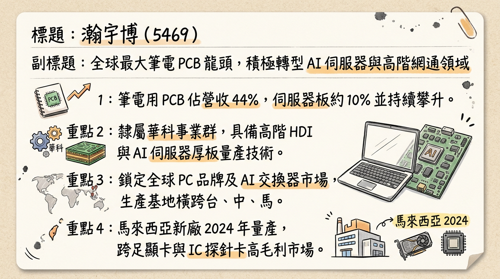
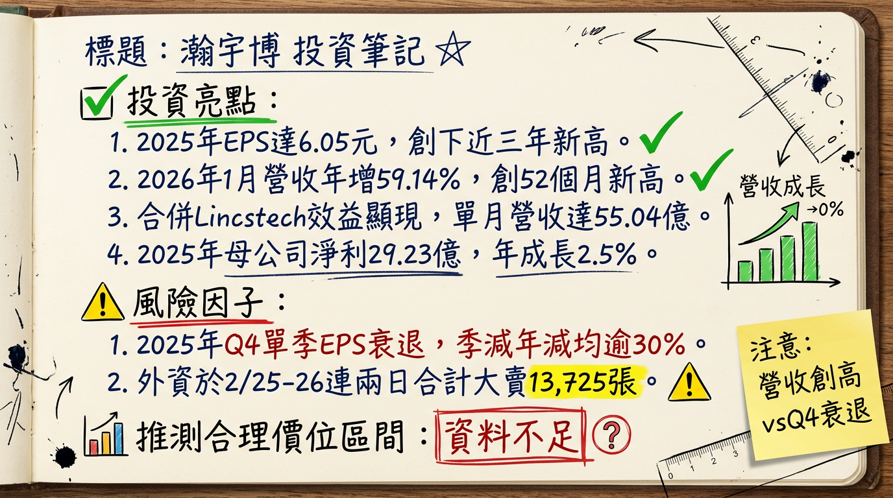

# 5469 瀚宇博 深度研究報告

## 一句話摘要
**從全球 NB PCB 龍頭轉向 AI 與高階網通的價值重估，2026 年受惠新產能釋放與併購效益，獲利動能強勁。**

---

## 公司概覽
瀚宇博（瀚宇博德）隸屬於 **PSA 華科事業群**，為全球最大的筆記型電腦（NB）用印刷電路板製造商。近年透過子公司精成科積極轉型，跨足 AI 伺服器、高階交換器及半導體測試板領域。

### 營收結構（2024 年上半年數據）
| 產品類別 | 營收佔比 | 備註 |
| :--- | :--- | :--- |
| **PC/NB 相關** | 44% | 核心業務，佔比隨轉型逐年下降 |
| **伺服器 (Server)** | 10% | 含 AI 伺服器，2025 Q3 已突破 20% |
| **車載應用** | 8% | 維持穩定成長 |
| **遊戲機與機上盒** | 6% | 消費性電子應用 |
| **其他 (工控、消費性)** | 32% | 包含子公司 Lincstech 挹注之半導體測試板 |

---

## 核心競爭優勢
1.  **PSA 集團綜效：** 結合華科事業群資源，與精成科、嘉聯益形成產業鏈互補。
2.  **AI 伺服器市佔領先：** 2025 Q3 在 AI 伺服器主板市佔率已達 **23%**，展現高階技術競爭力。
3.  **產能全球布局：** 擁有台灣、中國及馬來西亞等多地工廠，能有效規避地緣政治風險並滿足 CSP 客戶「China + 1」需求。

---

## 財務分析

### 近 6 個月營收趨勢表
| 月份 | 營收金額 (億元) | 月增率 (MoM) | 年增率 (YoY) | 備註 |
| :--- | :--- | :--- | :--- | :--- |
| **2026/01** | **55.03** | **+4.16%** | **+59.14%** | **創 52 個月新高** |
| 2025/12 | 52.83 | +5.23% | +54.18% | 併購效益顯現 |
| 2025/11 | 50.20 | -1.03% | +50.04% | 持續高成長 |
| 2025/10 | 50.73 | -2.98% | +49.03% | AI 板出貨穩健 |
| 2025/09 | 52.29 | +1.03% | +36.41% | 第三季旺季效應 |
| 2025/08 | 51.76 | -2.52% | +29.17% | - |

### 年度財務指標
| 年度 | 營收 (億元) | EPS (元) | 備註 |
| :--- | :--- | :--- | :--- |
| 2024 | 416.32 | 5.91 | 實際值 |
| 2025 | 572.26 | **6.05** | 創近三年新高 |
| 2026 (E) | 630~680 | **5.60 ~ 8.85** | 視 AI 產線開出進度而定 |

---

## 法說會重點（2025/11/03 重點摘要）
*   **訂單能見度：** 管理層明確指出，受惠於 AI 加速器及高階高層板需求，訂單能見度已延伸至 **2027 年上半年**。
*   **產能利用率：** 台灣觀音廠目前處於 **全數滿載** 狀態。
*   **產能擴充：** 預計 2026 年折舊費用將增加 **30%**，但由營收規模擴大及產品組合優化（高毛利 AI 板）抵銷。
*   **HDI 目標：** 目標 2025 年底將 HDI 板營收佔比提升至 **15%**。

---

## 券商觀點

| 券商名稱 | 日期 | 目標價 | 評等 | 備註 |
| :--- | :--- | :--- | :--- | :--- |
| **宏遠證券** | 2025/11/04 | **129 元** | 看多 | 重大調升 (前次 65 元) |
| **蔡慶龍分析師** | 2025/10/16 | **200 元以上** | 看多 | 價值低估、雙位數成長潛力 |
| **法人平均預期** | 2026/02/25 | **中立/買進** | 買進 | 2026 EPS 預估 5.6~8.85 元 |

---

## 財報深度分析

### 季度利潤率趨勢
| 期間 | 毛利率 | 營業利益率 | 單季 EPS (元) | 狀態 |
| :--- | :--- | :--- | :--- | :--- |
| 2025 Q3 | 20.04% | 10.57% | 2.26 | 營運高峰 |
| 2025 Q4 | 估 ~17% | 估 ~8% | 1.12 | 傳統淡季/庫存調整 |

*   **資本支出：** 2025 年集團資本支出高達 **60 億元**（瀚宇博占 30 億元），主要用於 AI 生產設施。
*   **存貨分析：** 隨 AI 伺服器客戶訂單增加，存貨周轉維持健康水平，正積極透過產能調度轉嫁 CCL 漲價成本。

---

## 股權異動
*   **集團支撐：** 華新科於 2025 年底以每股約 **95.37 元** 回補 4,160 張，顯示公司派認可目前價值。
*   **法人動態：** 2026/02/24 財報公布後，外資單日大買 **2,417 張**；惟 2/25-2/26 出現短期獲利了結賣壓（兩日合計賣超逾 1.3 萬張）。

---

## 產業分析

### PCB 同業競爭格局比較
| 公司名稱 | 核心領域 | AI 伺服器佔比 | 估值 (P/E) | 競爭優勢 |
| :--- | :--- | :--- | :--- | :--- |
| **5469 瀚宇博** | **NB PCB / AI 伺服器** | **~20%** | **9.5x - 15x** | 低本益比、PSA 集團資源 |
| 3044 健鼎 | 多元化 (車用/伺服器) | ~15% | 15x - 18x | 財務結構最穩健 |
| 2368 金像電 | 高階伺服器/網通 | >50% | 20x+ | AI 伺服器純度最高 |
| 3037 欣興 | IC 載板 / HDI | ~10% | 18x - 22x | 載板技術領先 |

---

## 近期催化劑
*   **利多事件：**
    1.  2026/01 營收創 52 個月新高（+59% YoY）。
    2.  馬來西亞新廠於 2026 Q1 正式量產。
    3.  800G 交換器板 2026 年開始貢獻營收。
*   **利空事件：**
    1.  短期外資大規模調節壓力。
    2.  2026 年折舊費用預計增加 30%。
    3.  傳統 NB 成長動能疲軟。

---

## ⭐ 成長動能時間軸
*   **2025 年底：** 成功併購日商 Lincstech，切入 HBM 記憶體與 IC 探針卡測試板市場。
*   **2026 年 Q1：** **馬來西亞廠** 正式量產，供應 AI 伺服器主板及高階車用板。
*   **2026 年 H1：** **台灣桃科廠**（租用嘉聯益 1.03 萬坪空間）產能上線，主攻 **400G/800G 高速交換器**。
*   **2026 年全年度：** AI 相關產品營收佔比目標從 20% 提升至 **25% 以上**。
*   **2027 年 H1：** 目前高階產品訂單能見度之截止日期。

---

## 2026 展望
*   **成長動能：** AI PC 滲透率提升帶動 HDI 板需求；400G/800G 網通板進入規模產量期；馬來西亞廠產能去瓶頸。
*   **風險：** 全球折舊費用增加衝擊短期利潤率；銅箔基板（CCL）原物料價格波動；若 AI PC 需求低於預期將影響稼動率。

---

## 投資結論
1.  **價值重估誘因：** 2025 EPS 6.05 元，目前本益比仍處於 10-15 倍區間，顯著低於同業如金像電。
2.  **營收跳升確信度高：** 1 月營收年增 59% 證實併購 Lincstech 後的規模經濟效應。
3.  **產能轉型期：** 2026 年為資本支出轉化為營收的關鍵年，毛利率能否回升至 20% 以上為觀察重點。
4.  **建議區間：** 考量 2026 年預估 EPS 高標可達 8.85 元，以 15 倍 P/E 計算，中長期具備挑戰 **120-130 元** 潛力，惟百元整數關卡短期籌碼尚待消化。

---
本報告由 AI 自動產生，資料來源為公開網路資訊，僅供參考，不構成投資建議。產生時間：2026-03-01 02:32

---

## 📊 資訊卡

