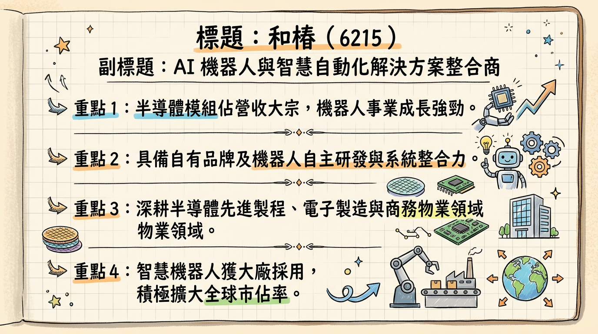
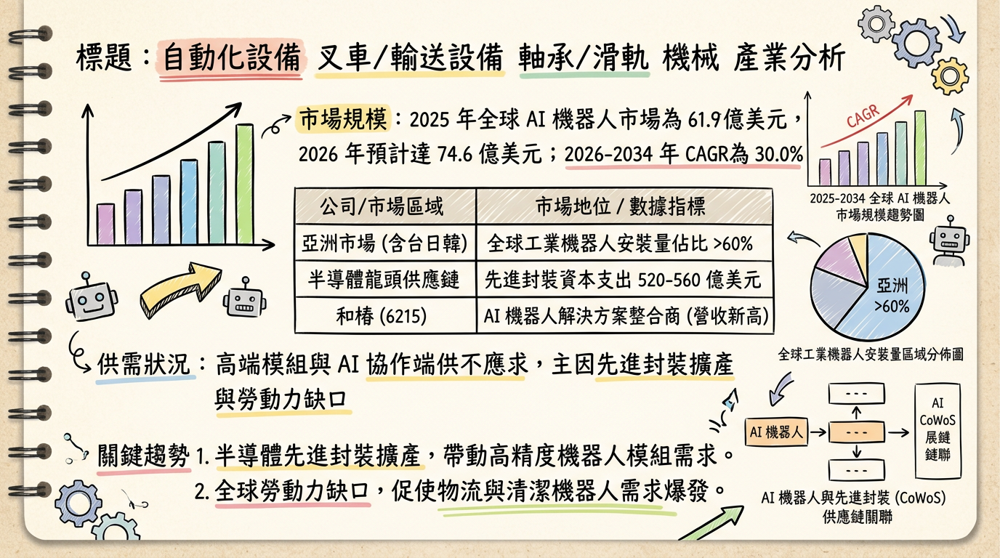
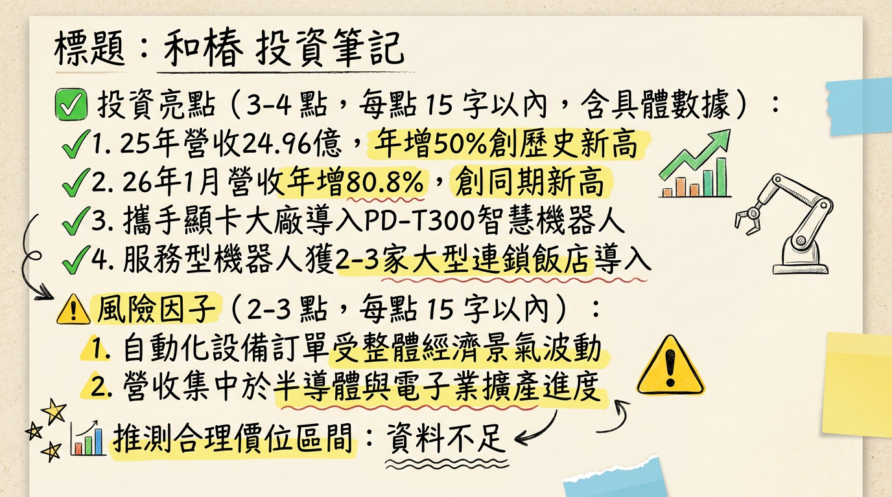

# 6215 和椿 深度研究報告

## 一句話摘要
**從傳統代理轉型 AI 機器人系統整合商，受惠半導體擴產與自主移動機器人 (AMR) 爆發，2025 年營收創歷史新高，訂單能見度直達 2026 年下半年。**

---

## 公司概覽
和椿（6215）已成功轉型為 **AI 機器人與智慧自動化解決方案整合商**。採取「雙軸發展」策略，以半導體設備模組為基石，並以自有品牌「AURO」切入 AI 機器人市場。

### 業務與營收結構
| 事業體 | 核心產品 / 品牌 | 營收佔比 (2025E) | 應用領域 |
| :--- | :--- | :---: | :--- |
| **第一曲線：智慧製造** | 半導體機器人模組、高精度軸承、滑軌 | ~47% | 半導體先進製程 (CoWoS)、SMT 設備 |
| **第二曲線：AI 機器人** | **AURO** 品牌、PD-T300 AMR、服務型機器人 | ~15-20% | 電子廠物流、連鎖飯店、商辦、零售 |
| **其他** | 自動化零組件代理、系統整合專案 | 其餘 | 工業 4.0 產線升級 |

---

## 核心競爭優勢
1.  **物理智慧 (Physical Intelligence) 整合能力：** 不同於單純銷售硬體，和椿具備將 AI 軟體驅動與自主導航 (AMR) 整合至複雜場域（如跨樓層產線）的能力。
2.  **半導體供應鏈深度合作：** 已切入台積電及 AI 伺服器（顯示卡大廠）供應鏈，提供高精密運動控制模組。
3.  **自有品牌 AURO：** 避開低價競爭，成功切入德國與日本智慧倉儲市場。

---

## 財務分析

### 月營收趨勢表格（單位：新台幣億元）
| 月份 | 營收金額 | 月增率 (MoM) | 年增率 (YoY) | 備註 |
| :--- | :---: | :---: | :---: | :--- |
| **2026/01** | **2.57** | -9.85% | **+80.81%** | **創歷年同期新高** |
| **2025/12** | **2.85** | +50.62% | **+42.42%** | **單月歷史新高** |
| 2025/11 | 1.89 | -17.20% | -17.50% | |
| 2025/10 | 2.28 | -10.20% | +75.50% | |
| 2025/09 | 2.54 | +45.30% | +62.10% | |
| 2025/08 | 1.75 | -36.50% | -5.50% | (⚠️過時資料) |

### 季度與年度趨勢
*   **2025 全年營收：** 24.96 億元（**年增 50.12%**），創歷史新高。
*   **2025 預估 EPS：** 2.50 ~ 2.65 元（2024 年為 2.11 元）。
*   **2025 Q3 表現：** EPS 0.63 元，營業利益率 7.08%。

---

## 法說會重點（2025/11/27）
1.  **訂單能見度：** 智慧製造與半導體模組需求強勁，訂單能見度已延伸至 **2026 年下半年**。
2.  **毛利率展望：** 2025 年因承接策略性半導體專案（毛利約 24.4%），預期 2026 年隨高毛利機器人系統整合專案增加，毛利率目標回升至 **28% 以上**。
3.  **產能與擴廠：** 產能利用率維持 **85% 以上**；已啟動 **泰國新廠** 建設，支應東南亞自動化需求。
4.  **研發投入：** 規劃投入營收之 **2.5%~4%** 用於 AI 驅動協作與自主導航技術。

---

## 券商觀點
| 券商名 | 目標價 | 評等 | 日期 | 核心觀點 |
| :--- | :---: | :---: | :---: | :--- |
| 華南永昌 | 188 元 | 看多 (Buy) | 2025/08/14 | ⚠️ 早期評估，看好 2025 營收爆發 |
| 摩爾投顧 | -- | 強烈推薦 | 2025/10/21 | 看好機器人概念股補漲，預期 2026 EPS 挑戰 3.5 元 |
| 外資券商 | 145~160 元 | 積極買進 | 2026/02/09 | 基於 2026 EPS 3.08 元之 50 倍 P/E 估值 |

---

## 財報深度分析

### 利潤率趨勢表格
| 季度 | 毛利率 (GPM) | 營業利益率 (OPM) | 稅後淨利率 (NPM) | EPS (元) |
| :--- | :---: | :---: | :---: | :---: |
| **2025 Q3** | 24.42% | 7.08% | 7.35% | 0.63 |
| **2025 Q2** | 24.98% | 7.34% | 3.87% | 0.28 |
| **2025 Q1** | 23.60% | 5.61% | 6.20% | 0.36 |
| **2024 Q4** | 27.46% | 6.16% | 8.83% | 0.59 |

### 營運指標分析
*   **存貨分析：** 2025 Q3 存貨週轉天數降至 **95.19 天**（2023 年曾超過 200 天），顯示去化良好。原料庫存由 2024 年的 6,770 萬元增至 **1.4 億元**，係為 2026 年訂單提前備料。
*   **財務風險：** 負債比率升至 **40.69%**；2025 Q3 自由現金流為 **-1.02 億元**，主因營收暴增導致應收帳款暫時佔用資金。
*   **資本支出：** 2025 Q3 單季約 664 萬元，折舊平穩（約 1,043 萬元）。

---

## 股權異動
*   **內部人持股：** 副董事長張以昇於 2024/11 申報轉讓 690 張 (⚠️已過時)，2025-2026 年尚無重大申報轉讓或庫藏股資訊。
*   **股利政策：** 2025 年發放現金股利 1.5 元。2026 年（配發 2025 盈餘）預計於 3 月中旬公告，市場預期具備增長空間。

---

## 產業分析

### 全球 AI 機器人競爭格局 (2025-2026)
| 公司名稱 | 核心優勢 | 2025 營收規模 (E) | 技術定位 |
| :--- | :--- | :---: | :--- |
| **和椿 (6215)** | **AI 系統整合 / AMR** | **24.96 億** | **物理智慧與場域整合** |
| 上銀 (2049) | 螺桿、滑軌硬體龍頭 | 260.5 億 | 關鍵零組件製造 |
| 盟立 (2464) | 半導體自動倉縮 | 145.2 億 | 大型系統整合 (SI) |
| Teradyne (UR) | 協作機器人 (Cobots) | -- | 全球協作型市佔 40% |

*   **市場規模：** 全球 AI 機器人市場 2026 年預計達 **74.6 億美元**，CAGR 達 **30%**。

---

## 近期催化劑
*   **利多：**
    *   **CES 2026 展示：** 展示最新 AI 驅動協作技術與自主導航機器人。
    *   **大廠導入：** 成功導入「知名顯示卡大廠」跨樓層 PD-T300 AMR 解決方案。
    *   **營收動能：** 2026 年 1 月營收年增 80.8% 展現強勁成長。
*   **利空/風險：**
    *   **地緣政治：** 2026/02 中東局勢影響外資提款壓力。
    *   **利潤承壓：** 若專案競爭激烈，毛利率回升速度可能慢於預期。

---

## ⭐ 成長動能時間軸
*   **2025 Q4：** 服務型機器人正式導入台北車站商圈及 2-3 家大型連鎖飯店。
*   **2026 Q1：** 公布 1 月營收創新高；受惠台積電 2026 資本支出上調（520-560 億美元），半導體模組訂單激增。
*   **2026 Q2：** 泰國新廠預計產能開出，支應東南亞自動化轉型需求。
*   **2026 H2：** 訂單能見度確保期，預計 AI 機器人營收佔比進一步提升，優化整體獲利結構。

---

## 2026 展望
*   **成長動能：** AI 伺服器產線物流自動化、先進封裝設備模組需求、服務型機器人進入收割期。
*   **風險：** 高庫存 (1.4 億) 若去化不及、應收帳款回收天數若拉長、高本益比 (54倍) 的修正壓力。

---

## 投資結論
1.  **營運轉捩點：** 2025 年營收創高證明轉型成功，2026 年將進入「獲利結構優化期」。
2.  **機器人指標股：** 和椿已從代理商變身為具備 AI 軟硬整合能力的標的，與輝達 (NVIDIA) 機器人生態系方向一致。
3.  **財務觀察：** 需關注 3 月份即將公布的 2025 全年財報，特別是自由現金流是否隨營收創高後回正。
4.  **操作建議：** 2026 年 EPS 預估 3.0-3.5 元。**目標價區間建議 150 - 175 元**（基於 50x P/E），回檔至月線不破可視為中長線布局機會。

---
本報告由 AI 自動產生，資料來源為公開網路資訊，僅供參考，不構成投資建議。產生時間：2026-03-02 06:18

---

## 📊 資訊卡

