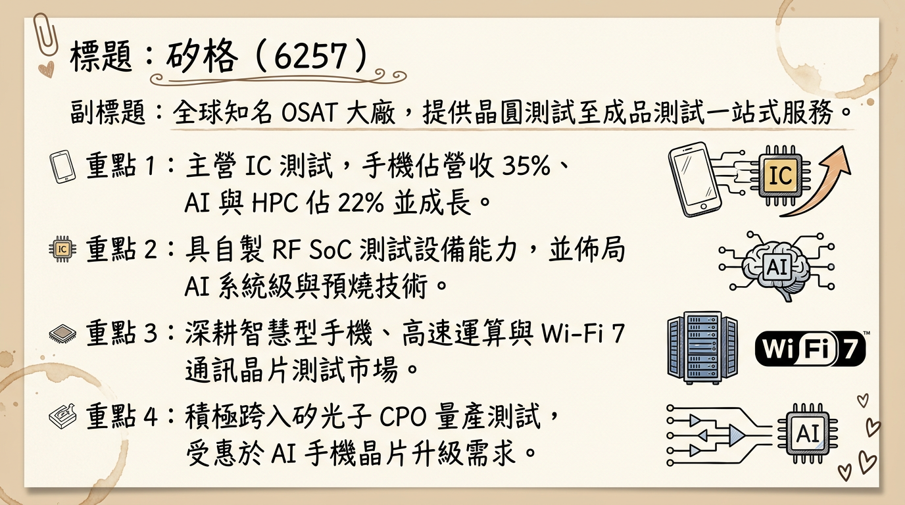
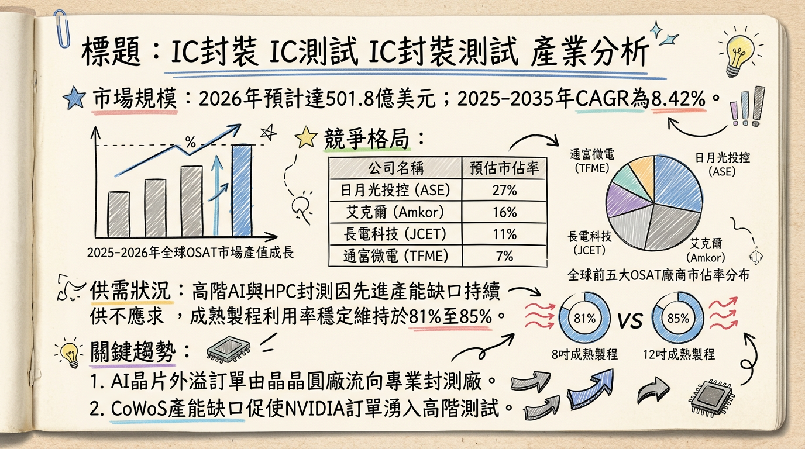
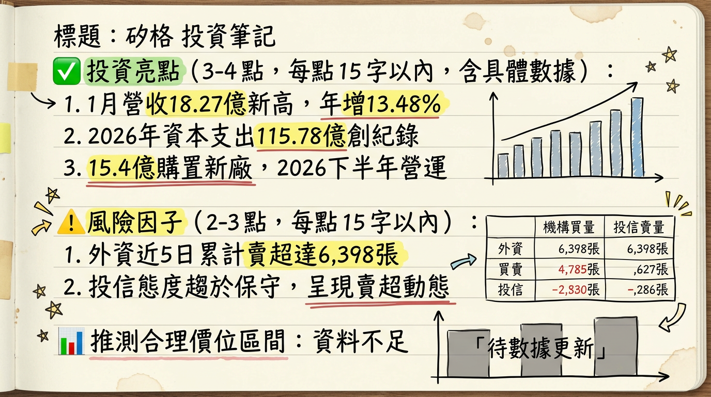

# 6257 矽格 深度研究報告

## 一句話摘要
**從穩健封測廠轉型 AI 測試先驅，受惠 CoWoS 產能外溢與 CPO 商轉，2026 年進入「歷史級」資本擴張期。**

---

## 公司概覽
矽格（Sigurd）為全球領先的中型半導體 OSAT（封裝測試代工）大廠，專精於晶圓測試（CP）與成品測試（FT）。近年積極轉型，透過「3A 策略」（先進測試、自動化、AI 智慧工廠）切入高效能運算（HPC）與矽光子（CPO）領域。

### 營收結構表格（2025 年前三季數據）
| 業務分類 | 營收佔比 | 趨勢與備註 |
| :--- | :--- | :--- |
| **智慧型手機** | 33% - 35% | 佔比下降，但 AI 手機晶片升級帶動絕對金額成長 |
| **網通及物聯網 (IoT)** | 22% | 受惠於 Wi-Fi 7 滲透率提升 |
| **AI、ASIC、CPO、HPC** | **21% - 22%** | **成長最快領域，較 2024 年顯著提升** |
| **消費性電子與智慧家庭** | 17% | 需求平穩回升 |
| **車用及醫療** | 7% | 鎖定 3A 客戶，具備長期增長潛力 |

---

## 核心競爭優勢
1.  **矽光子 (CPO) 一條龍佈局：** 與子公司台星科（3265）專業分工，台星科負責封裝，矽格負責測試，已成功切入美系雲端大廠供應鏈。
2.  **自製設備成本優勢：** 擁有自製 RF SoC 測試設備（MAP），相較於外購昂貴機台，在 Wi-Fi 7 與矽光子測試具備更高毛利空間。
3.  **先進測試技術：** 提供 TDP > 700W 的高功率 AI 晶片「液冷預燒（Burn-in）」技術，建立技術門檻。

---

## 財務分析

### 月營收趨勢趨勢表格
| 月份 | 營收金額 (億新台幣) | 月增率 MoM | 年增率 YoY | 狀態 |
| :--- | :--- | :--- | :--- | :--- |
| **2026/01** | **18.27** | **+1.30%** | **+13.50%** | **單月歷史新高** |
| **2025/12** | 18.03 | +3.52% | +11.87% | 歷史次高 |
| **2025/11** | 17.42 | +1.02% | +7.04% | |
| **2025/10** | 17.24 | +4.23% | +2.63% | |
| **2025/09** | 16.54 | +2.81% | +4.49% | |
| **2025/08** | 16.09 | +1.14% | +6.50% | |

### 季度與年度趨勢
*   **2025 全年：** 營收達 195.87 億元（年增 7.51%），創歷史新高。預估 EPS 落在 5.63 ~ 5.65 元。
*   **2026 展望：** 法人預估 EPS 有望衝擊 **7.8 至 8.4 元**，主因 AI 測試佔比提升至 25% 以上。

---

## 法說會重點
*   **訂單能見度：** AI 伺服器、ASIC、CPO 訂單已延伸至 2026 年上半年；2026 Q1 給出「淡季不淡」預期。
*   **新客戶拓展：** 2025 年成功切入美國、日本及以色列的 ASIC 新客戶，終端應用集中在 AI 伺服器交換器。
*   **產能擴張：** 2026 資本支出預算 59.3 億元，創歷史新高，全力投入 AI 與 2nm 先進製程後段測試。

---

## 券商觀點
| 券商名稱 | 報告日期 | 評等 | 目標價 (NTD) | 2026 EPS 預估 |
| :--- | :--- | :--- | :--- | :--- |
| **兆豐證券** | 2026/02/06 | 看多 | **157** | -- |
| **法人即時新聞**| 2025/12/31 | 看多 | -- | **7.80** |
| **群益證券** | 2025/11/28 | 看多 | 106 | 6.64 |

---

## 財報深度分析

### 利潤率趨勢表格
| 季度 | 毛利率 (%) | 營業利益率 (%) | 稅後淨利率 (%) | 備註 |
| :--- | :--- | :--- | :--- | :--- |
| **2025 Q3** | 27.22 | 17.84 | 18.55 | 獲利略遜預期 |
| **2025 Q2** | 31.42 | 23.48 | 7.03 | **匯兌損失 7 億元**侵蝕淨利 |
| **2025 Q1** | 28.47 | 19.55 | 16.16 | |
| **2024 Q4** | 26.12 | 16.81 | 14.88 | |

*   **存貨分析：** 2025 Q3 存貨週轉天數（DIO）僅約 **14 天**，顯示客戶拉貨強勁。
*   **資本支出：** 2026 年集團總支出達 **115.8 億元**（矽格 59.3 億 + 台星科 56.5 億），創史上新高。

---

## 股權異動
*   **庫藏股：** 2025 年 4-6 月買回 5,131 張，均價 **75.13 元**，用於轉讓員工。
*   **可轉債：** 矽格四 (62574) 已於 2024/10 到期，目前暫無新發行 CB，財務結構穩健（負債比 43%）。
*   **股利政策：** 2025 年配發 4.043 元，2026 年 3 月 9 日將決議 2025 年度股利，市場預期具高配發率特性。

---

## 產業分析

### 全球 OSAT 競爭格局表格（2025 預估）
| 排名 | 公司名稱 | 市佔率 | 主要優勢 |
| :--- | :--- | :--- | :--- |
| 1 | 日月光投控 | 43-45% | 先進封裝 (2.5D/3D) 規模領先 |
| 2 | 安靠 (Amkor) | 14-16% | 汽車電子、台積電合作夥伴 |
| 3 | 長電科技 | 10-12% | 中國市場規模優勢 |
| **-** | **矽格** | **中型龍頭** | **RF 測試與 CPO 專業測試領先者** |

### 台灣同業比較
*   **京元電 (2449)：** 專注大型 GPU 測試，與矽格在 AI 領域具互補關係。
*   **欣銓 (3264)：** 聚焦車用與 MCU 測試，毛利率約 26-28%。

---

## 近期催化劑
*   **利多：** 2026/02 斥資 **15.4 億** 購買欣興湖口廠（增加 AI/車用產能）。
*   **利多：** Wi-Fi 7 測試時間增加 2-3 倍，帶動單價（ASP）提升。
*   **利空：** 外資近期在高檔（150 元附近）出現獲利了結調節。
*   **利空：** 2026 大規模擴產帶來的折舊費用壓力。

---

## ⭐ 成長動能時間軸
*   **2026 Q1：** Wi-Fi 7 換機潮帶動 RF 測試需求爆發，營收連續創高。
*   **2026 Q2：** TDP > 700W 液冷預燒測試設備開始放量。
*   **2026 Q3 - Q4：** **湖口二廠** 正式投產，鎖定美系 ASIC 與車用 3A 客戶。
*   **2026 Q4：** **中興三廠** 完工，預計 2027 Q1 量產，每層樓產值預估達 1 億元/月。
*   **2026 全年：** 矽光子（CPO）商轉，光學驗證 (PIC) 取得更多客戶認證。

---

## 2026 展望
*   **成長動能：** 受惠於 AI ASIC 市場年成長預期達 113%，矽格相關營收佔比將突破 25%，帶動產品結構優化（毛利率挑戰 31.5%）。
*   **風險：** 地緣政治影響美系客戶訂單穩定性；若產能利用率未達 80%，高額資本支出產生的折舊將侵蝕利潤。

---

## 投資結論
1.  **營運轉型成功：** 矽格已從傳統手機封測轉向 **AI/CPO 高成長領域**，2026 年 EPS 有望跳升至 7.8-8.4 元。
2.  **產能大幅擴張：** 湖口二廠與中興三廠的銜接將確保 2026-2027 年的營收天花板持續拉高。
3.  **評價調升：** 隨著 AI 營收佔比提升，市場給予的本益比（P/E）有望從傳統 12-14 倍上修至 18-20 倍。
4.  **建議目標價區間：** 參考法人預估與近期擴產動能，目標價區間建議在 **150 - 165 元**。短期留意 150 元關卡法人籌碼調節壓力，逢回分批佈局。

---
本報告由 AI 自動產生，資料來源為公開網路資訊，僅供參考，不構成投資建議。
產生時間：2026-03-02 06:18

---

## 📊 資訊卡

