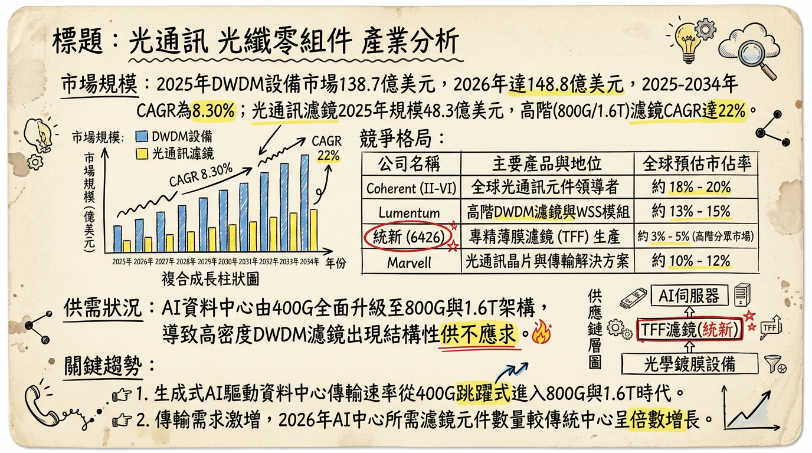
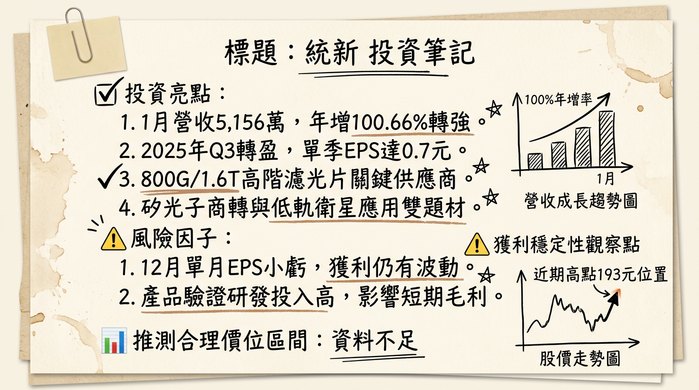

# 6426 統新 深度研究報告

## 一句話摘要
統新（6426）憑藉高階薄膜濾光片（TFF）技術，成功由電信市場轉型至 AI 資料中心（800G/1.6T）與低軌衛星領域，2026 年進入獲利爆發期，EPS 有望挑戰 3.5-4.8 元之轉機轉強格局。

---

## 公司概覽
統新為專業光學鍍膜廠商，核心技術在於高密度波分複用（DWDM）系統所需的薄膜濾光片（TFF）。

**營收結構與產品線：**
| 產品類別 | 應用領域 | 營收佔比 (2025 Est.) | 備註 |
| :--- | :--- | :--- | :--- |
| **高階光通訊濾鏡** | AI 資料中心 800G/1.6T、矽光子 CPO | 45% | 毛利最高，核心成長動能 |
| **電信級 DWDM 濾鏡** | 5G 基地台、美國 BEAD 寬頻基建 | 40% | 需求穩健回升 |
| **太空與特殊應用** | 低軌衛星 (LEO) 間通訊、生醫感測 | 10% | 2026 年新貢獻來源 |
| **其他** | 半導體光學元件、鍍膜代工 | 5% | 結構優化中 |

---

## 核心競爭優勢
1.  **高階鍍膜技術壁壘：** 統新專精於 TFF 技術，能實現 100 層以上的精密鍍膜，其 800G 濾鏡毛利率達 40% 以上，優於產業平均（25-35%）。
2.  **生產彈性與自動化：** 相較於全球大廠 Lumentum，統新具備更高的客製化彈性，並於 2025 年完成 75% 的設備升級投資，大幅提升產出精度。
3.  **太空級認證：** 成功切入 SpaceX 等衛星供應鏈，濾片具備抗輻射與極端溫差穩定性，為國內少數具備太空實績的濾片廠。

---

## 財務分析

### 近 6 個月月營收趨勢
| 月份 | 營收 (新台幣萬元) | 月增率 (MoM) | 年增率 (YoY) |
| :--- | :--- | :--- | :--- |
| **2026/01** | 5,156.0 | +10.23% | **+100.66%** |
| **2025/12** | 4,677.3 | +5.9% | +26.63% |
| **2025/11** | 4,417.0 | -9.87% | +41.87% |
| **2025/10** | 4,900.0 | +16.18% | +68.45% |
| **2025/09** | 4,218.0 | +2.48% | +63.91% |
| **2025/08** | 4,115.0 | -19.7% | **+101.5%** |

### 季度數據與年度趨勢
*   **2025 Q3 表現：** 營收 1.346 億元，EPS 0.70 元，毛利率由 2024 年的 0.82% 飆升至 **42.46%**。
*   **年度 EPS 趨勢：** 2024 年為 -3.58 元；2025 年預估收斂至 -0.92 至 -1.08 元；**2026 年市場共識 EPS 為 3.5 至 4.8 元**。

---

## 法說會重點
*   **AI 規格升級：** 800G EML 濾片已放量出貨；1.6T 產品正處於驗證階段，預計 **2026 H2** 貢獻營收。
*   **產能展望：** 2026 Q1 利用率約 70%（淡季），預期全年平均可達 **85% 以上**。
*   **BEAD 計畫：** 美國寬頻補貼計畫撥款進入高峰，光纖濾片能見度已達 2026 上半年。
*   **資本支出：** 2025 年增長 75% 專注於高階鍍膜機與 1.6T 研發，非傳統擴廠而是「結構優化」。

---

## 券商觀點
| 券商名 | 目標價 (TWD) | 評等 | 日期 | 核心邏輯 |
| :--- | :--- | :--- | :--- | :--- |
| **凱基投顧** | 220 | 買進 | 2026/02/26 | AI 供應鏈獲利爆發性成長 99% 預期 |
| **永豐金證券** | 215-230 | 強烈建議買進 | 2026/02/23 | 參考同族群 PE 估值，隱含高成長空間 |
| **凱旭投顧** | 205 | 買進 | 2026/02/11 | 紅包行情與 1.6T 規格升級題材 |

---

## 財報深度分析

### 利潤率趨勢表格
| 指標 | 2024 全年 | 2025 Q1 | 2025 Q2 | 2025 Q3 | 2026 Q1 (E) |
| :--- | :--- | :--- | :--- | :--- | :--- |
| **毛利率** | 0.82% | ~22.5% | ~32.5% | **42.46%** | >40% |
| **營業利益率** | -51.8% | 負值 | 損平 | 11.87% | ~15% |
| **EPS** | -3.58 | - | - | 0.70 | >0.8 |

*   **存貨分析：** 2025 Q3 存貨週轉天數由 132 天降至 **100.22 天**，顯示庫存去化完成，轉為健康備料。
*   **資本支出：** 聚焦於高階產品研發，每季折舊約 2,500-2,800 萬元，壓力逐年遞減。

---

## 股權異動
*   **法人動態：** 2026 年 1 月 30 日外資單日買超 **1,660 張**，顯見法人對 2026 年轉盈題材認同度高。
*   **資本結構：** 目前無掛牌交易中之可轉債（CB），負債比率 18.33% 極低，財務結構優異。
*   **股利政策：** 2025 年以資本公積配發 0.5 元，預計 2026 年隨獲利回升，配息有望優於 0.5 元。

---

## 產業分析

### 全球 DWDM/光學元件競爭格局
| 公司名稱 | 2026 預估市佔 | 優勢與定位 |
| :--- | :--- | :--- |
| **Cisco** | 25% | 系統設備端領導者，收購 Acacia 強化光學整合 |
| **Ciena** | 18% | 專精相干光技術，DCI 市場核心 |
| **Lumentum** | 10% | 統新主要對手，高階濾鏡與雷射光源大廠 |
| **統新 (6426)** | 利基型市場 | **高階 TFF 鍍膜專家，1.6T 驗證領先者** |

### 台灣同業比較 (2025 Q3 數據)
| 公司 | 營收 (2026/01) | 毛利率 | 單季 EPS | 關鍵題材 |
| :--- | :--- | :--- | :--- | :--- |
| **統新 (6426)** | 0.52 億 (YoY+101%) | **42.46%** | 0.70 | 800G、低軌衛星 |
| **華星光 (4979)** | 4.21 億 (YoY+20%) | 27.5% | 1.53 | Marvell 供應鏈、CPO |
| **波若威 (3163)** | 2.15 億 (預估) | 22.0% | 1.15 | 分波多工、電信端整合 |

---

## 近期催化劑
*   **利多：**
    1. 2026 年 1 月營收翻倍成長（YoY +100.66%）。
    2. Nvidia B300 (Blackwell Ultra) 平台帶動 1.6T 濾鏡需求提前。
    3. 成功切入低軌衛星間通訊（Inter-Satellite Link）訂單。
*   **利空/風險：**
    1. 1.6T 產品驗證時程若延後。
    2. 匯率波動（統新持有大量外幣資產，對台幣匯率敏感）。

---

## ⭐ 成長動能時間軸
*   **2025 Q4：** 完成 75% 資本支出，精密鍍膜機台就位。
*   **2026 Q1：** 低軌衛星應用開始小量交付，1 月營收創新高。
*   **2026 Q2：** 1.6T 光模組用濾鏡預計完成客戶端首波驗證。
*   **2026 H2：** 1.6T 產品正式量產貢獻營收；美國 BEAD 計畫撥款入帳高峰。
*   **2027 年：** CPO（共同封裝光學）技術商轉，微型化濾鏡需求爆發。

---

## 2026 展望
**成長動能：**
AI 資料中心持續往 800G/1.6T 升級，統新高毛利 TFF 濾片市佔率擴大。低軌衛星通訊成為「第二隻腳」，分散單一產業風險。

**風險：**
主要在於 1.6T 技術轉換期若長於預期，以及 2024 年曾經歷的匯率與存貨波動風險，需關注單月獲利穩定度。

---

## 投資結論
1.  **獲利具爆發性：** 2026 年為統新正式「轉虧為大盈」的關鍵年，EPS 具備跳升至 4 元左右的潛力。
2.  **毛利結構改善：** 產品重心由電信轉向 AI 資料中心與太空，40% 以上的高毛利有望成為新常態。
3.  **目標價區間建議：** 綜合多家券商觀點與 PE 估值（參考 2026 EPS 預估 4 元，給予 50x-55x PE），建議目標價區間為 **210 元至 230 元**，當前股價（約 191.5 元）仍有向上修正空間，拉回可分批佈局。

---
本報告由 AI 自動產生，資料來源為公開網路資訊，僅供參考，不構成投資建議。產生時間：2026-03-01 02:32

---

## 📊 資訊卡

