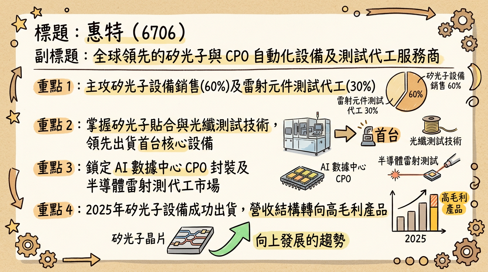
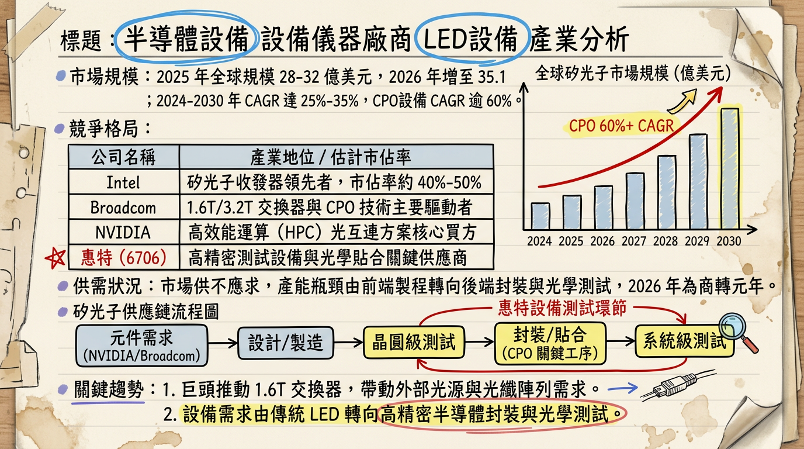
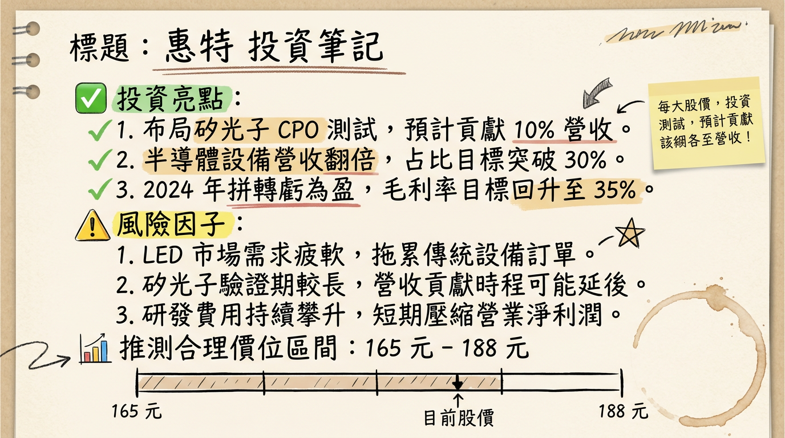

# 6706 惠特 深度研究報告

## 一句話摘要

惠特（6706）正積極從傳統LED測試設備轉型至矽光子、共同封裝光學（CPO）與化合物半導體等高成長領域，並在2026年第二季前力拚單季轉虧為盈。儘管近期財務數據仍處低谷，且新業務尚處驗證與小量出貨階段，但隨著AI與高速傳輸需求驅動產業升級，加上14.91億元仲裁案勝訴大幅改善財務體質，其轉型效益與成長潛力值得市場關注。

## 公司概覽

惠特科技（6706）是一家光電半導體測試設備與雷射微細加工設備供應商。公司近年營運重心已策略性轉向矽光子、化合物半導體，並鎖定CPO等先進光通訊市場。

**核心產品與服務：**
1.  **LED / Micro / Mini LED 測試與製程設備**：涵蓋晶粒點測機、分選機、AOI、Dumping、Mass Transfer、Implant等。應用於手機背光、穿戴裝置、車用與大型顯示器。
2.  **雷射二極體與化合物半導體測試**：提供VCSEL/PD點測機、遠/近場點測、EML/邊射型雷射低溫點測與分選，以及功率半導體晶圓點測。應用於3D感測、光通訊、LiDAR、自駕、資料中心光模組、SiC/GaN功率元件。
3.  **雷射微細加工**：包含陶瓷切割、雙雷射Strip切割、PCB雷射切割/鑽孔、晶圓刻印、雷射清潔（已應用於Pogo Pin與Probe Card清針）。
4.  **矽光子解決方案**：開發矽光子元件貼合機（FAS）、矽光子單晶點測機（FOT）、光纖陣列功能測試機（FAT）、光纖陣列移除機（MFR）與外觀檢測機（FAI）等CPO相關設備。
5.  **測試代工與 OEM**：提供LED晶粒點測代工、外觀檢測代工與分類代工，並擴大DFB與EEL元件的測試與分選代工服務。
6.  **工業 4.0 與新產品**：高功率LiDAR量測、AI中央控管平台、AGV+Prober/Sorter整合，以及為AI眼鏡精密生產開發的組裝與測試系列自動化設備。

**營收結構（2025年前三季）**

| 業務類別 | 營收金額 (億元) | 營收佔比 |
| :------- | :-------------- | :------- |
| 設備銷售 | 4.53            | 約 60%   |
| 代工業務 | 2.76            | 約 30%   |
| 其他     | 未揭露          | 約 10%   |

**製造基地：**
新營運總部已於2025年9月落成啟用，整合原先分散於臺中及桃園的六個廠區，並取得銀級綠建築認證。測試與分選代工廠區位於精密科學園區。目前未找到各製造基地的具體營收貢獻比例資料。

**所屬細分產業和相關題材：**
半導體設備、光電半導體測試設備、雷射微細加工設備、光通訊設備、化合物半導體設備。
相關題材：矽光子（Silicon Photonics）、共同封裝光學（CPO）、化合物半導體（SiC/GaN）、雷射元件代工（DFB/EEL）、Micro/Mini LED、AI、先進封裝。

## 核心競爭優勢

1.  **前瞻技術佈局**：惠特在矽光子、CPO及化合物半導體測試設備領域積極投入，已開發出矽光子元件貼合機等一系列CPO相關設備，並對外接單AI眼鏡精密生產設備，精準切入AI時代高速運算與資料中心傳輸升級的關鍵趨勢。
2.  **雷射應用整合能力**：公司不僅提供LED/Micro/Mini LED測試，更拓展至VCSEL/PD、EML/邊射型雷射測試，並涵蓋陶瓷切割、PCB雷射切割、晶圓刻印等雷射微細加工技術，形成多元且高附加價值的雷射應用解決方案。
3.  **代工服務拓展**：加碼投資DFB與EEL邊射型雷射元件的測試、分選與AOI設備，力拚成為台灣最大的雷射光源代工廠，預期2026年代工營收占比將突破五成，提供穩定營收來源。
4.  **財務體質改善**：2026年2月5日仲裁案勝訴，可追回約14.91億元款項，大幅改善公司流動性及財務健全度，降低呆帳風險，有助於未來營運發展。
5.  **營運效率提升**：新總部於2025年9月啟用，整合研發、生產與倉儲管理，預期將顯著提升管理綜效、溝通效率及產能彈性。

## 財務分析

### 月營收趨勢

| 月份    | 金額 (萬元) | 月增率 MoM (%) | 年增率 YoY (%) |
| :------ | :---------- | :------------- | :------------- |
| 2026年1月 | 5,038.9     | 16.70          | -63.82         |
| 2025年12月| 4,317.8     | 6.13           | -68.16         |
| 2025年11月| 4,068.3     | 9.06           | -66.37         |
| 2025年10月| 3,730.2     | -1.65          | -65.96         |
| 2025年9月 | 3,792.7     | 7.74           | -55.32         |
| 2025年8月 | 3,520.1     | 0.53           | -46.40         |

**分析：**
惠特月營收在2025年下半年雖呈現逐步回升態勢，2026年1月達到5,038.9萬元，創近7個月新高，但相較去年同期仍大幅衰退逾六成。公司說明主因是積極轉型中的新產品仍在驗證狀態，客戶尚未放量，導致營收基期較低。

### 季度數據

| 季度       | 營收 (億元) | 毛利率 (%) | 營業淨損 (萬元) | EPS (元) |
| :--------- | :---------- | :--------- | :-------------- | :------- |
| 2025年第三季 | 1.0814      | 36.9       | 7,800           | -0.28    |

**分析：**
2025年第三季營收1.0814億元創歷史新低，毛利率雖回升至36.9%，但營業淨損7,800萬元，EPS為-0.28元，顯示營運仍處於虧損狀態。儘管毛利率改善，但營收規模不足以支應固定成本及費用。

### 年度趨勢

*   **2024年實際營收**：9.27875 億元。
*   **2024年實際 EPS**：-4.29 元。
*   **2025年累計營收** (至12月)：8.99 億元。
*   **2025年累計 EPS** (至第三季)：-3.69 元。
*   **2025年預估 EPS**：過往券商報告曾預估2025年EPS可達6.1元或6.19元至8.55元（發布日期：2025年6月至7月），但根據2025年前三季的實際虧損情況，此預估數字已明顯不適用。

**分析：**
公司連續兩年處於虧損狀態，2025年累計營收和EPS表現均不佳，反映傳統業務衰退與新業務轉型陣痛。營運能否在2026年第二季如期轉盈，將是關鍵觀察點。

## 法說會重點

**最近一次法說會日期：** 2025年11月25日。

**管理層發言與具體Guidance：**
1.  **營運重心轉型：** 公司營運重心已從傳統LED測試設備轉向矽光子與化合物半導體，鎖定CPO等先進光通訊市場。
2.  **矽光子與CPO設備進展：**
    *   首台矽光子元件貼合機已對外出機，CPO相關設備也與多家客戶進行實驗機驗證，並開始貢獻小量營收。
    *   產品線涵蓋矽光子探針機、主動對位設備、光纖陣列功能測試機、AOI檢測設備及Rework機台等，提供高精度製程解決方案。
3.  **代工業務爆發：** DFB（分佈式回饋）與EEL（邊射型雷射）雷射元件代工業務需求強勁，目標成為台灣最大的代工廠，預期2026年代工營收占比有望突破五成。
4.  **新動能佈局：**
    *   雷射清潔設備已在Pogo Pin與Probe Card清針應用上配合客戶驗證，市場潛力看好。
    *   AI眼鏡精密生產系列自動化設備已接單研發生產，期望成為中期新動能來源之一。
5.  **轉虧為盈目標：** 管理層力拚於2026年第二季前達成單季轉虧為盈。
6.  **產能與資本支出：** 新總部已於2025年9月啟用，整合台中多處廠區，有助於提升管理綜效及溝通效率，並擴張產能。法說會中未明確提及具體的產能利用率數字或明確的資本支出金額。

## 券商觀點

目前可查閱的券商報告目標價多已過時，主要反映公司在2025年中期的潛在價值評估，與其後公布的實際營運表現存在較大落差。

**券商目標價（過時資訊）**

| 券商名           | 目標價 (元) | 評等 | 日期            |
| :--------------- | :---------- | :--- | :-------------- |
| 元富證券投顧     | 180         | 買進 | 2024年8月16日   |
| 未具名券商報告   | 180         | 買進 | 2025年6月10日   |
| 未具名券商報告   | 180         | 買進 | 2025年7月11日   |

**2025-2026年 EPS 預估：**
*   2025年EPS預估：6.1元 (2025年6月10日/7月11日) 或 6.19元至8.55元 (2025年6月10日)。上述預估皆已與公司實際營運大幅偏離。
*   未找到2026年最新且來源明確的EPS預估數字。

**評等調整：**
目前未找到2025-2026年最新且來源明確的重大調升/調降評等資料。

**分析：**
市場對惠特的期待主要來自其轉型後的巨大潛力，但由於實際業績尚未兌現，且券商報告多屬舊資訊，投資者應以公司最新財報與法說會展望為主要參考依據。

## 財報深度分析

### 利潤率趨勢

| 季度     | 毛利率 (%) | 營業利益率 (%) | 稅後淨利率 (%) |
| :------- | :--------- | :------------- | :------------- |
| 2025Q3   | 36.90      | -72.00         | -20.31         |
| 2025Q2   | 9.58       | -37.60         | -100.65        |
| 2025Q1   | 15.40      | -16.64         | -3.84          |
| 2024Q4   | 7.87       | -24.47         | -6.19          |
| 2024Q3   | 14.78      | -44.86         | -47.03         |
| 2024Q2   | -6.20      | -101.09        | -72.69         |
| 2024Q1   | 17.69      | -89.03         | -40.01         |

**利潤率變化的原因分析：**
惠特在2024年第二季毛利率曾降至-6.20%，顯示營運面臨巨大挑戰。2025年第二季毛利率雖回升至9.58%，但仍處低點，且稅後淨利率錄得-100.65%，反映營收下滑時固定成本與費用未能有效縮減，導致虧損擴大。2025年第三季毛利率回升至36.9%，但營業利益率及稅後淨利率仍為負值，整體獲利能力仍有待改善。這可能與新產品驗證階段成本較高、產能利用率不足以及舊有Mini LED業務去化壓力有關。

### 存貨分析

| 季度     | 存貨週轉天數 (天) | 應收帳款收現天數 (天) | 營運週轉天數 (天) |
| :------- | :---------------- | :------------------ | :---------------- |
| 2025Q3   | 1238.5            | 413.05              | 1651.55           |
| 2025Q2   | 376.11            | 229.06              | 605.17            |
| 2025Q1   | 273.15            | 134.9               | 408.05            |
| 2024Q4   | 299.22            | 111.37              | 410.59            |

**存貨與營運分析：**
2025年第三季存貨週轉天數顯著飆升至1238.5天，遠高於過往同期，同期應收帳款收現天數也從2024年Q4的111.37天大幅增加至413.05天。這兩項關鍵指標的惡化，導致營運週轉天數高達1651.55天，顯示公司存貨去化緩慢、應收帳款回收困難，資金積壓嚴重，短期經營效率大幅降低，資金週轉風險上升。這也反映了市場需求疲軟及新產品尚未大規模放量前的過渡期壓力。

### 資本支出與折舊攤銷

*   **近3年資本支出趨勢：** 缺乏直接具體數據，但從投資現金流可間接觀察。惠特2025年Q3的投資現金流為-280,517仟元；2025年前9個月自由現金流為-1,352,577仟元，2024年前9個月為-594,940仟元，顯示公司仍有持續的資金投入需求。
*   **未來資本支出計畫：** 新總部已於2025年9月啟用，此為一項重大資本投資。公司亦決議加碼投資DFB、EEL邊射型雷射元件所需的測試、分選與AOI設備，以擴大代工產能，此部分將帶動未來資本支出。
*   **折舊攤銷趨勢：** 2025年Q3折舊為32,862仟元，攤銷為1,548仟元，與過往季度變化不大。

### 負債與自由現金流

*   **負債比率：** 2025年Q3負債佔資產比率為46.83%，較2024年Q3的48.23%略有下降，但整體仍處於波動上升趨勢。債務股本比為64.24%。
*   **EBITDA：** 截至2025年11月9日，EBITDA為-365.51M，為負值，反映公司營運獲利能力不足。
*   **自由現金流量：** 惠特近期自由現金流持續為負值，2025年前9個月累計為-1,352,577仟元，表明公司經營活動產生的現金不足以支應投資活動所需，資金壓力較大。

### 業外收支

惠特業外收支佔營收比率在2024年和2025年Q1-Q3波動較大。2024年上半年曾提列呆帳與呆滯料，導致營運虧損，公司表示呆帳已提列98%，下半年將擺脫包袱。2026年2月5日仲裁案勝訴可追回約14.91億元款項，將顯著改善業外收入並降低未來潛在的呆帳提列風險。

## 股權異動

### 董監事/大股東申報轉讓紀錄

*   **2025/05/05：** 廣略管理顧問有限公司 (董事本人) 申報轉讓100張。
*   **2025/05/05：** 文生熱處理股份有限公司 (法人董事代表人) 申報轉讓80張。
*   **2025/04/01：** 廣略管理顧問有限公司 (董事本人) 申報轉讓80張。
*   **2025/04/01：** 文生熱處理股份有限公司 (法人董事代表人) 申報轉讓80張。

截至2026年1月，董事長鎧叡投資有限公司持股3,992張 (5.08%)，質押比率25.05%。董事廣略管理顧問有限公司持股410張 (0.52%)，質押比率70.73%。

### 庫藏股買回紀錄

目前未找到2024-2026年惠特庫藏股買回的最新資料。

### 可轉換公司債（CB）

*   **惠特一 (67061)：** 已於2024年2月3日到期，依債券面額以現金一次償還。
*   **惠特二 (67062)：** 為無擔保可轉換公司債。
    *   **發行日：** 2024年10月25日。
    *   **到期日：** 2027年10月25日。
    *   **轉換價格：** 178.8元。
    *   **發行總額：** 5億元。

### 增減資計畫

*   **現金增資計畫：** 惠特於2024年度進行現金增資，發行普通股5,000,000股，每股面額新台幣10元，發行價格每股132元。
*   **增資基準日：** 2024年11月21日。
*   **資金用途：** 償還銀行借款及充實營運資金。

### 股利政策

*   **2024年：** 現金股利0元，股票股利0元。
*   **2023年：** 現金股利2.51元，股票股利0.99元，合計3.5元 (股利所屬年度)。

## 產業分析

### 市場規模與CAGR成長率

*   **半導體測試設備市場：** 2025年全球規模為76.5億美元，預計2026年成長至81.5億美元，至2034年達143.8億美元，CAGR為7.35%。另有報告預估2025年為152億美元，至2033年達296億美元，CAGR為8.7%。
*   **雷射微細加工市場：** 2025年預估10.7億美元，2026年成長至11.8億美元，CAGR為9.61%，預計至2032年達20.5億美元。另有報告預估2025年25億美元，至2033年達64.2億美元，CAGR為12.5%。
*   **矽光子市場：** 全球市場規模預計將從2024年的2.78億美元，快速成長至2030年的27億美元，CAGR高達46%。另有報告預估2025年超過28.1億美元，2026年達35.1億美元，至2035年將超過319億美元，CAGR超過27.5%。
*   **化合物半導體市場：** 預計將從2025年的842.9億美元成長到2026年的911.1億美元，CAGR達8.1%，至2030年達1240.6億美元。

**供需狀況：**
半導體測試設備市場受惠於AI與HPC對測試需求的爆炸式增長，特別是SoC測試預計2025年成長41%。HBM市場極度短缺，亦帶動記憶體測試需求。整體ATE市場預計2026年將達到80億美元的巔峰。矽光子技術與CPO預計2026年正式進入大規模商轉，開啟「光進銅退」時代。2023年全球CPO連接埠僅5萬個，預計2026年將突破450萬個，市場規模從2024年的4,600萬美元跳漲到2026年的35.1億美元。當前市場成長最大限制因素是客戶無塵室空間建置進度，顯示設備市場處於供不應求或產能擴張受限狀態。

**產業的平均毛利率水準：**
未找到半導體測試設備、光電半導體測試設備、雷射微細加工設備產業的平均毛利率水準的具體2025-2026年數據。

### 競爭格局

| 項目         | 惠特 (6706)                                      | 國際大型半導體測試設備商 (如 Advantest)           | 特定利基競爭者 (如 創新服務 7828) |
| :----------- | :--------------------------------------------- | :------------------------------------------------ | :---------------------------------- |
| **主要市場** | 矽光子、CPO、化合物半導體、雷射微細加工          | 廣泛的半導體測試 (記憶體、SoC)；綜合性解決方案    | 特定高階測試應用 (MEMS探針卡植針)     |
| **技術方向** | 轉向高階光通訊與功率半導體測試、雷射製程創新     | 全方位測試技術、領先製程節點測試、廣泛研發投入    | 高精度、專用自動化設備、特定材料製程  |
| **產能**     | 新總部整合提升、代工加碼投資 DFB/EEL，具擴產潛力 | 規模龐大、全球佈局、具高度生產彈性                | 聚焦特定高階設備，產能相對較小但專業性強 |
| **客戶**     | 美系客戶 (矽光子)、資料中心、光通訊模組、電動車  | 全球主要晶圓廠與 IDM (如 Intel, Samsung, TSMC)    | 特定晶圓廠或探針卡廠                 |
| **價格**     | 利基市場高附加價值，產品單價與毛利率潛力較高     | 具市場主導力、標準化產品議價能力強，高端客製化高價 | 高技術門檻，產品單價高，利潤空間優異 |

**台灣同業比較：**
未找到2024-2026年台灣半導體測試設備或雷射微細加工同業的完整營收規模、毛利率、EPS對比的最新資料。

### 產業趨勢

1.  **AI、HPC與先進封裝技術的快速發展：**
    *   **具體影響：** AI對高效能晶片與記憶體的爆炸性需求，推動對先進製程（如5nm及以下）、先進封裝（如CoWoS、3D IC、CPO）及高階測試設備的強勁投資。晶圓層級測試的重要性提升，以確保良率。HPC對SoC測試要求日益嚴苛，導致測試設備數量需求增加。
2.  **矽光子技術與CPO（共同封裝光學）的興起：**
    *   **具體影響：** AI算力增加使傳統銅線傳輸逼近物理極限，矽光子（CPO）技術將於2026年大規模商轉，開啟「光進銅退」時代。CPO具低功耗、超高速優勢，將加速導入資料中心，為光通訊測試設備帶來龐大商機。
3.  **化合物半導體（如SiC/GaN）的普及：**
    *   **具體影響：** 功率半導體是綠能轉型關鍵，在電動車、再生能源等高功率應用中，SiC/GaN扮演核心角色。新材料的導入對測試設備提出新的要求，如功率半導體晶圓點測等。

**對惠特而言的具體機會和威脅：**
*   **機會：**
    *   **轉型契機**：積極轉向矽光子、化合物半導體和CPO等先進光通訊市場，與AI、HPC趨勢高度契合。
    *   **技術領先**：在LED/Micro/Mini LED測試、VCSEL/PD點測、化合物半導體測試及雷射微細加工等核心技術具優勢。
    *   **先進封裝需求**：受惠於CoWoS等先進封裝產能擴張，以及晶圓級測試、高階測試設備需求增加。
    *   **資料中心擴張**：資料中心對高速、低延遲光互連的需求，直接帶動矽光子測試設備。
*   **威脅：**
    *   **技術快速迭代**：需持續投入研發以保持競爭力。
    *   **國際大廠競爭**：全球半導體測試設備市場由國際巨頭主導，惠特作為相對較小的參與者，面臨資金、研發、客戶基礎上的強大競爭。
    *   **市場波動性**：半導體產業具循環性，若需求不如預期，可能影響營收與獲利。

**相關投資題材的具體連結：**
*   **AI**：AI市場需求是半導體測試設備產業成長核心驅動力，特別是高階SoC測試。AI晶片對先進測試技術的需求與惠特轉型方向直接相關。
*   **HBM**：HBM是AI應用不可或缺，市場極度短缺，對HBM測試需求將持續增長，惠特半導體測試設備佈局有望間接受惠。
*   **電動車（EV）**：電動車發展推動功率半導體（SiC/GaN）需求，惠特提供功率半導體晶圓點測，具潛在連結。
*   **共同封裝光學（CPO）**：CPO是因應AI算力需求的新一代光通訊技術，惠特明確鎖定此市場，將直接受惠。
*   **Micro/Mini LED**：惠特仍提供相關測試設備，應用於手機背光、穿戴裝置、車用與大型顯示器等持續發展領域。

## 近期催化劑

### 利多事件

*   **仲裁案勝訴 (2026年2月5日)**：與湖北三安光電及泉州三安半導體科技仲裁案獲勝訴，預計可追回約14.91億元款項，大幅改善公司財務體質與流動性。
*   **新總部啟用 (2025年9月)**：新總部整合研發、生產與倉儲管理，面積逾55,000平方公尺，提升管理綜效與溝通效率。
*   **矽光子元件貼合機出貨 (2025年9月12日)**：首台矽光子元件貼合機已獲客戶驗證並開始小量出貨給美系客戶，運作效率優於預期，顯示新技術受到市場肯定。
*   **代工業務潛力 (2025年11月法說會)**：DFB、FEL測試代工業務需求殷切，訂單能見度明確，總經理預期2026年可望倍數成長，代工營收占比將超過50%。
*   **CPO/MPO及雷射清潔設備發酵 (2025年11月法說會)**：CPO/MPO、雷射清潔及精密光學等新產品陸續發酵中，CPO相關設備與多家客戶進行實驗機驗證。
*   **AI眼鏡精密生產設備接單 (2025年11月法說會)**：已接單研發生產AI眼鏡精密生產系列設備，期望成為中期新動能。
*   **外資買超 (2026年2月-3月)**：外資在2026年2月23、24日大舉買超706張及2,717張，2月26日買超1,030張，3月3日買超243張，顯示市場對其矽光子與AI裝置題材的期待。

### 利空事件

*   **營收表現仍低 (2026年1月)**：1月合併營收5,038.9萬元，月增16.7%，但年減63.82%，顯示轉型期間新產品尚未放量，營收仍處相對低檔。
*   **財務持續虧損 (2025年第三季)**：第三季EPS為-0.28元，前三季累計EPS為-3.69元，營運尚未轉虧為盈。
*   **Mini LED產能去化挑戰 (2025年6月股東會)**：公司仍面臨Mini LED產能去化挑戰，影響舊有業務。
*   **存貨與應收帳款壓力 (2025年第三季)**：存貨週轉天數飆升至1238.5天，應收帳款收現天數達413.05天，顯示營運效率大幅降低，資金週轉風險上升。

## ⭐ 成長動能時間軸

| 時間點      | 成長動能事件                                           | 具體內容                                                                                                                                                                             |
| :---------- | :----------------------------------------------------- | :----------------------------------------------------------------------------------------------------------------------------------------------------------------------------------- |
| **2024年**  | **新產品線導入**                                       | 矽光子元件貼合機及CPO相關設備陸續出機首台。                                                                                                                                        |
| **2025年9月** | **擴廠與營運整合**                                     | 新總部落成啟用，斥資23.61億元興建，整合研發、生產、倉儲，提升管理綜效、溝通效率及產能彈性。                                                                                       |
| **2025年9月** | **新客戶與市場驗證**                                   | 矽光子元件貼合機小量出貨給美系客戶，並獲客戶驗證與肯定。                                                                                                                           |
| **2025年**  | **客戶結構優化**                                       | 客戶結構從過往高度依賴中國大陸市場，轉為台灣客戶占比約略八成，有效分散地緣政治風險。                                                                                               |
| **2025年11月**| **CPO設備多客戶驗證**                                  | CPO相關設備已與多家客戶進行實驗機驗證，並開始貢獻初步營收。                                                                                                                        |
| **2025年11月**| **AI眼鏡市場佈局**                                     | 投入AI眼鏡組裝與測試相關精密光學設備，並已接單研發生產，期望成為中期新動能。                                                                                                       |
| **2025年11月**| **雷射清潔應用拓展**                                   | 雷射清潔設備在Pogo Pin與Probe Card清針應用上已配合客戶驗證，潛力看好。                                                                                                             |
| **2026年Q1** | **仲裁案資金回流**                                     | 仲裁案勝訴，預計可追回約14.91億元款項，顯著改善公司現金流與財務體質，有助於支應未來發展。                                                                                           |
| **2026年Q2前**| **單季轉虧為盈目標**                                   | 管理層力拚達成單季轉虧為盈，若實現將是營運轉折點。                                                                                                                                   |
| **2026年**  | **代工業務倍數成長**                                   | DFB、EEL測試代工業務需求強勁，公司決議加碼投資相關測試、分選與AOI設備，預期代工營收占比突破五成並實現倍數成長。目標成為「台灣最大的雷射光源代工廠」。                                   |
| **2026年**  | **矽光子與CPO大規模商轉**                              | 隨著AI運算需求帶動高速傳輸，矽光子與CPO技術預計正式進入大規模商轉，惠特作為設備供應商將直接受惠。CPO連接埠預計從2023年的5萬個躍升至2026年的450萬個，市場規模同步激增。         |
| **長期**    | **終端應用拓展**                                       | AI伺服器、資料中心、AI眼鏡等終端應用對高速光通訊、先進測試與精密製造的需求將持續成長，為惠特提供穩定的成長基礎。                                                               |

## 2026 展望

### 成長動能

惠特在2026年將迎來多重成長動能的匯聚：

1.  **矽光子與CPO市場爆發**：隨著AI、HPC需求持續高漲，資料中心對高速傳輸的需求將驅動矽光子與CPO技術從驗證期進入大規模商轉。惠特已成功出機矽光子元件貼合機予美系客戶，並與多家客戶驗證CPO相關設備，預計2026年將迎接關鍵放量期。
2.  **雷射元件代工業務躍升**：DFB、EEL邊射型雷射元件測試代工需求強勁，公司積極加碼投資，目標2026年代工營收占比突破五成並實現倍數成長，有望成為新的穩定獲利引擎。
3.  **AI眼鏡與雷射清潔新應用**：已接單研發生產AI眼鏡精密生產系列設備，並在Pogo Pin與Probe Card清針應用上驗證雷射清潔設備，這些新業務有望在中期帶來額外營收貢獻。
4.  **財務體質改善與營運轉機**：仲裁案勝訴追回的14.91億元款項將顯著提升公司財務穩健性，降低營運風險。管理層力拚2026年第二季前單季轉虧為盈的目標，若能達成將是重要的里程碑。
5.  **新總部效益發酵**：新總部的啟用將整合營運、提升效率，為產能擴充和新產品研發提供堅實基礎。

### 風險因子

1.  **基本面復甦進度不確定**：儘管轉型題材熱絡，但惠特目前營收與獲利數據仍處於低檔，新產品放量速度與客戶導入進度仍需觀察，若實際出貨不如預期，轉虧為盈的目標可能延後。
2.  **客戶導入與市場競爭壓力**：矽光子與CPO商機雖大，但技術門檻高，且可能面臨國際大廠的激烈競爭。客戶的導入速度、對供應商的選擇（自建或委外）以及惠特在價格與良率上的競爭力，將影響其市場滲透率。
3.  **Mini LED業務去化挑戰**：舊有Mini LED產能過剩，市場需求不如預期，這部分業務的持續去化壓力可能拖累整體獲利。
4.  **營運效率與資金週轉風險**：2025年第三季存貨週轉天數與應收帳款收現天數顯著惡化，顯示營運週轉效率低落，儘管仲裁案勝訴有助於資金回籠，但仍需持續改善經營效率。
5.  **技術迭代與研發投入**：半導體產業技術快速迭代，惠特需持續投入大量研發以保持競爭力，若研發投入不足或方向偏差，可能影響其在先進技術領域的領先地位。

## 投資結論

惠特正處於營運轉型的關鍵時刻，儘管短期財報表現不佳，但其在矽光子、CPO、化合物半導體等新興領域的積極佈局，使其有望抓住AI時代高速傳輸與運算升級的巨大商機。

1.  **轉型正確，潛力巨大**：公司戰略性轉向AI與高速傳輸相關的矽光子、CPO及化合物半導體測試市場，方向明確且符合產業趨勢。尤其CPO市場預計在2026年大規模爆發，惠特有望作為關鍵設備供應商直接受惠。
2.  **財務壓力緩解，利多浮現**：仲裁案勝訴將為公司帶來14.91億元的現金回流，大幅改善財務結構與營運資金，同時降低過去呆帳的負面影響，為新業務發展提供堅實的資金基礎。
3.  **代工業務提供營收護城河**：公司加碼投資DFB/EEL代工，目標成為台灣最大雷射光源代工廠，預計2026年代工營收占比突破五成。這將提供相對穩定的營收與獲利，平衡設備銷售的週期性波動。
4.  **近期催化劑與風險並存**：2026年第二季前力拚單季轉虧為盈的目標，以及矽光子與CPO設備的客戶驗證與放量進度，將是支撐股價上漲的關鍵催化劑。然而，新業務實際放量速度、舊業務去化壓力，以及公司營運效率的改善程度仍是風險所在。
5.  **目標價區間建議：$155 - $190 (未來12-18個月)**
    考量到惠特在先進光通訊與化合物半導體領域的長期成長潛力，以及仲裁案勝訴對財務體質的顯著助益，我們認為市場對其2026年第二季轉虧為盈的預期具備實現的可能性。若新產品能按計畫放量，配合代工業務的成長，公司營運將迎來拐點。基於未來獲利能力的恢復與新市場的爆發性成長，我們給予惠特未來12-18個月的目標價區間為 **$155 - $190**。此區間反映了其轉型成功後的市值重估空間，但也納入了新業務導入期仍可能面臨的執行與市場風險。建議投資者持續追蹤公司訂單能見度與每月營收表現。

本報告由 AI 自動產生，資料來源為公開網路資訊，僅供參考，不構成投資建議。產生時間：2026-03-06 09:36

---

## 📊 資訊卡

