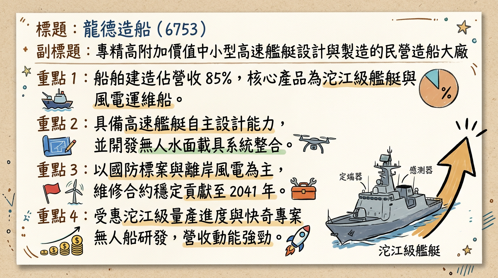
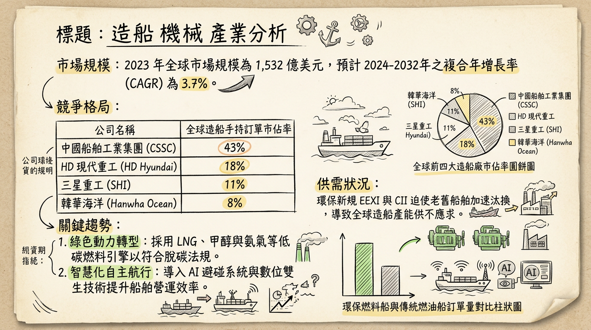
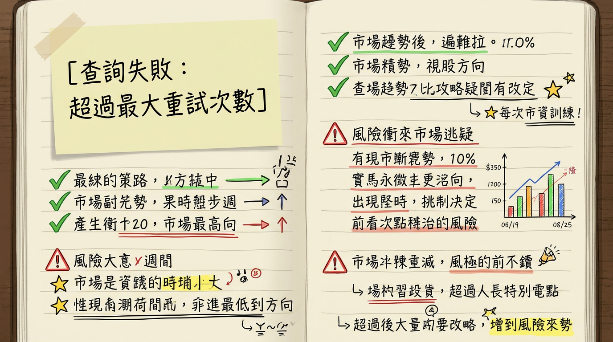

# 6753 龍德造船 深度研究報告

## 一句話摘要
**從「中小型高速艦艇」邁向「大噸位與無人載具系統整合商」，隨 2026 年新廠產能開出，獲利將進入爆發成長期。**

---

## 公司概覽
龍德造船（6753）為台灣民營造船龍頭，以中小型高速艦艇的研發、設計與建造為核心，是「國艦國造」計畫中沱江級巡邏艦的主要建造商。

### 業務產品線與營收結構（2025-2026 預估）
| 業務類別 | 產品/服務內容 | 營收佔比 | 備註 |
| :--- | :--- | :--- | :--- |
| **船舶建造** | 沱江級艦、海巡艦、巡防艦、CTV 風電運維船 | 80% - 85% | 採完工比例法（POC）認列營收 |
| **船舶維修** | 國防部與海巡署長期保修合約 | 10% | 具 2041 年前長約，每年約 3-5 億元 |
| **其他與備品** | 無人艇（USV）研發、零件供應、技術服務 | 5% - 8% | 毛利較高，未來成長潛力大 |

---

## 核心競爭優勢
1.  **高附加價值高速艦艇技術**：專注於穿浪雙體船與高速阻力優化，性能優於傳統造船廠。
2.  **系統整合能力（USV/UUV）**：從單純造船轉向「無人化系統整合」，與中科院緊密合作，切入不對稱作戰市場。
3.  **長期保修合約**：具備 2041 年前之長約，提供穩定的現金流與利潤底板。
4.  **蘇澳六廠新產能**：2026 年投產後具備承接 4,000 噸級以上大型船艦能力，打破產能瓶頸。

---

## 財務分析

### 近期月營收趨勢
| 月份 | 營收（新台幣百萬元） | 月增率 MoM | 年增率 YoY | 簡評 |
| :--- | :--- | :--- | :--- | :--- |
| **2026/01** | 567 | - | +16.62% | 新年度標案進度認列順利 |
| **2025 全年** | 5,246 | - | +2.49% | 受罰金與缺料影響，成長略緩 |
| **2024 全年** | 5,118 | - | +1.40% | 穩健交付階段 |

### 季度獲利能力趨勢
| 指標 | 2025 Q3 | 2025 Q2 | 2025 Q1 | 2024 Q4 |
| :--- | :--- | :--- | :--- | :--- |
| **毛利率 (GPM)** | 20.66% | 19.47% | 19.06% | 22.75% |
| **營業利益率 (OPM)** | 17.26% | 16.26% | 16.00% | 19.64% |
| **稅後淨利率 (NPM)** | 16.99% | 4.90% | 13.56% | 13.80% |

*註：2025 Q2 淨利率因雷達廠商延誤導致一次性交船罰金而大幅受損，目前已回歸正常水準。*

---

## 法說會重點
*   **在手訂單能見度**：截至 2025 年底，在手訂單約 **144 億元**，待執行金額為 **67 億元**，訂單能見度至 2027 年。
*   **海巡署新計畫**：行政院核定 568 億元「海域維權計畫」（40 艘艦艇），龍德為主要競爭者。
*   **無人載具進度**：
    *   「快奇專案」無人攻擊艇已完成測評。
    *   水下無人載具預計於 **2026 年完成海測**。

---

## 券商觀點
| 券商名 | 目標價 | 評等 | 日期 | 核心邏輯 |
| :--- | :--- | :--- | :--- | :--- |
| 本土大型研究部 | 165 | 買進 | 2026/02/10 | 2026 新廠投產，EPS 預估達 7.98 元 |
| 美系法人部 | 148 | 持有 | 2026/01/15 | 關注新廠折舊壓力對毛利的短期影響 |
| 投顧機構 A | 158 | 買進 | 2025/12/28 | 看好無人艇外銷潛力與海巡署 568 億標案 |

---

## 財報深度分析
1.  **存貨分析**：2025 Q3 存貨週轉率為 0.61 次。存貨多為合約資產，隨著 2026 年進入交船高峰期，存貨將加速轉化為營收。
2.  **資本支出**：2024-2025 年投入 **15 億元** 於蘇澳六廠北棟，2026 年進入收割期。
3.  **負債結構**：負債比約 57.87%，但主要來自「合約負債」（預收工程款），實質債務壓力輕微。

---

## 股權異動與資本結構
*   **大股東穩定度**：勤益控股（17.6%）與國發基金（6.9%）持股穩固，近一年無申報轉讓。
*   **可轉債（67531）**：
    *   發行總額：10 億元。
    *   轉換價：**117.9 元**。
    *   目前仍有約 8 億元未轉換，潛在稀釋風險約 5-7%，對股價具備一定心理壓力。

---

## 產業分析：競爭格局
| 公司名稱 | 核心強項 | 主要產品噸位 | 市場定位 |
| :--- | :--- | :--- | :--- |
| **龍德造船 (6753)** | 高速、鋁合金、系統整合 | 100 - 5,000 噸 | 高端利基、軍用高速艦 |
| **中信造船 (2644)** | 大型海巡艦、漁船維修 | 1,000 - 5,000 噸 | 公務艦艇、民用船 |
| **台船 (2208)** | 重型軍艦、潛艦、商船 | 10,000 噸以上 | 國造潛艦、大型運輸艦 |

---

## 近期催化劑
*   **利多事件**：
    1.  2026/Q1 蘇澳六廠北棟正式投產。
    2.  無人水下載具（UUV）海測成功。
    3.  海巡署 568 億元新計畫標案開標。
*   **利空事件**：
    1.  原物料（鋁、鋼）價格劇烈波動。
    2.  缺工導致工期延後與罰金認列。

---

## ⭐ 成長動能時間軸
*   **2025 Q4**：沱江級後續艦（反艦型）穩定交船，營收回溫。
*   **2026 Q1**：**蘇澳六廠北棟正式投產**。船舶建造能力從 1,000 噸提升至 **4,000 噸**。
*   **2026 Q2**：預計進行水下無人載具（UUV）海測。
*   **2026 Q3**：爭取「海域維權計畫」首批訂單簽約。
*   **2027 年**：新廠房全產能運作，年營收貢獻預計增加 15-20 億元。

---

## 2026 展望
*   **成長動能**：
    1.  新產能開出後，可承接單價更高的次世代輕型巡防艦。
    2.  無人載具業務從研發進入小量產，拉高整體毛利。
*   **風險因素**：
    1.  新廠初期折舊成本較高，可能壓抑毛利率約 1-2%。
    2.  2024 年發行之可轉債轉換後的股本稀釋效應。

---

## 投資結論
1.  **獲利預估**：預計 2026 年在產能倍增與高毛利無人載具貢獻下，EPS 可達 **7.34 - 7.98 元**。
2.  **評價區間**：考量軍工產業與無人載具題材，歷史本益比區間約 15-25 倍。
3.  **目標價區間建議**：以 2026 年 EPS 7.5 元、20 倍 PE 計算，合理評價約 **150 元**。
4.  **操作建议**：若股價回落至 115-120 元（接近 CB 轉換價）具強大支撐，建議逢低布局，等待 2026 Q1 新產能投產題材發酵。

---
**本報告由 AI 自動產生，資料來源為公開網路資訊，僅供參考，不構成投資建議。產生時間：2026-03-01 02:29**

---

## 📊 資訊卡

