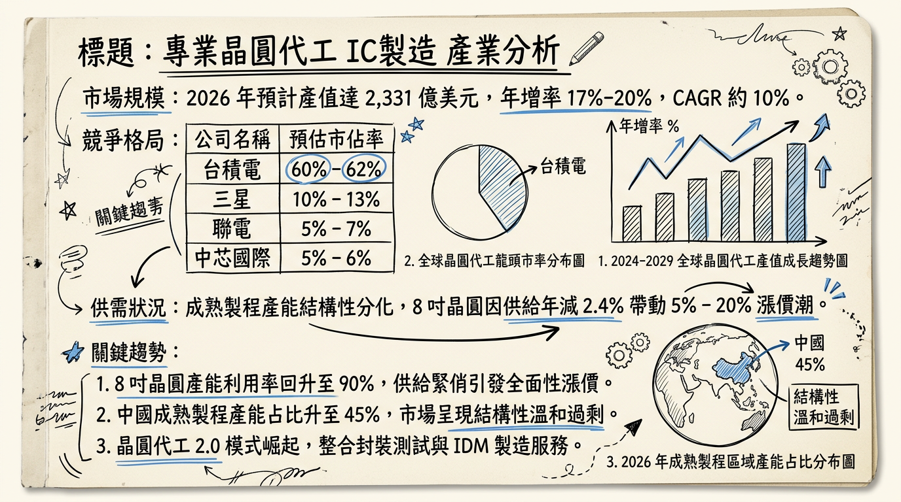
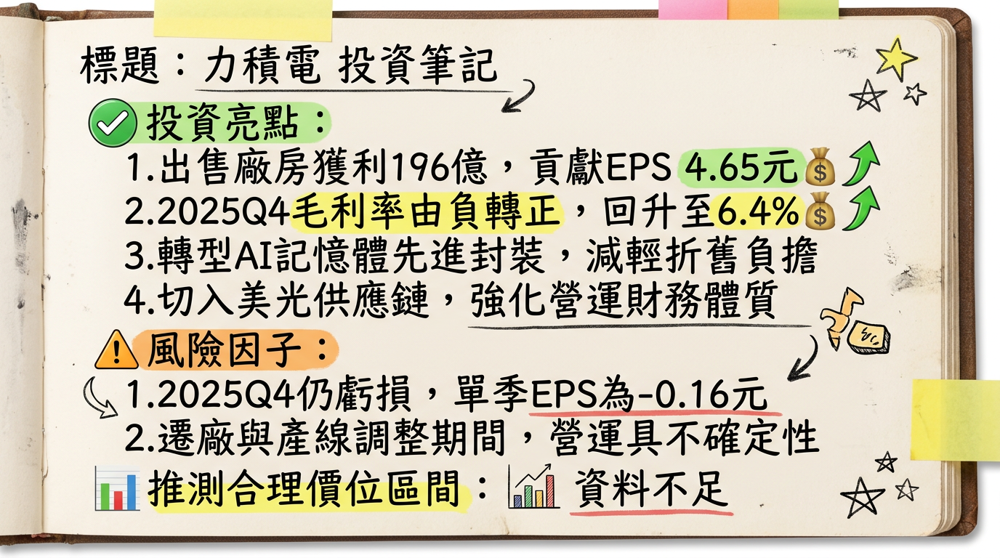

# 6770 力積電 (PSMC) 深度研究報告

## 一句話摘要
**從「產能過剩」轉向「資產輕量化」：力積電透過售廠美光獲取鉅額處分利益，並藉由 3D AI Foundry 與 HBM 後段代工開啟 2026 年獲利結構性轉折。**

---

## 公司概覽
力積電（PSMC）為全球前十大晶圓代工廠，是少數同時具備邏輯 IC 與記憶體製造技術的晶圓代工廠。

### 業務與營收結構 (2025 Q4/2026 預估)
| 業務類別 | 營收佔比 | 核心產品 / 應用 |
| :--- | :--- | :--- |
| **邏輯代工 (Logic)** | 60% - 65% | PMIC (21%)、HV 驅動 IC (17%)、MOSFET/IGBT (16%) |
| **記憶體代工 (Memory)** | 30% - 35% | 利基型 DRAM (27%)、NAND/NOR Flash (6%) |
| **3D AI Foundry** | ~3% | 矽中介層 (Silicon Interposer)、3D 晶圓堆疊 (WoW) |

*註：公司目標在 2028 年將 3D AI 相關營收佔比提升至 20%~30%。*

---

## 核心競爭優勢
1.  **獨特技術堆疊：** 全球唯一具備「邏輯 + 記憶體」整合代工能力的純代工廠，有利於 AI 運算所需的 **WoW (Wafer-on-Wafer)** 技術。
2.  **資產輕量化轉型：** 透過將銅鑼 P5 廠售予美光，大幅降低每年的折舊費用負擔（預計 2026 年折舊年減 50%）。
3.  **FAB IP 輸出模式：** 與印度塔塔集團（Tata）合作，採技術授權模式獲取權利金（累計已入帳 1.43 億美元），不需負擔海外建廠盈虧。

---

## 財務分析

### 月營收趨勢表格
| 月份 | 營收 (億新台幣) | 月增率 MoM | 年增率 YoY | 備註 |
| :--- | :---: | :---: | :---: | :--- |
| **2026/01** | **46.18** | **+8.17%** | **+26.27%** | **創 39 個月新高** |
| 2025/12 | 42.69 | ~+2% | +21.92% | |
| 2025/11 | 41.80 | ~+3.2% | - | 區間預估 |
| 2025/10 | 40.50 | ~+1.2% | - | 區間預估 |
| 2025/09 | 40.00 | ~+2.5% | - | 區間預估 |

### 季度數據與年度趨勢
*   **2025 Q4 表現：** 營收 124.95 億元（季增 6%），EPS -0.16 元（虧損較 Q3 的 -0.65 元顯著收斂）。
*   **獲利轉折：** 2025 全年營收 467.30 億元，EPS -1.86 元。法人預期 2026 年受惠於售廠利益（約 EPS 4.65~8 元）與本業轉盈，**EPS 有望挑戰 8.0 - 11.0 元**。

---

## 法說會重點 (2026/02/05)
1.  **報價調漲：** 證實 12 吋代工於 1 月起漲價；**8 吋產線因產能滿載，預計 3 月起全面調漲代工報價**。
2.  **稼動率：** 2025 Q4 產能利用率回升至 **82%**，其中記憶體產線接近滿載。
3.  **Guidance：** 預期本業將於 **2026 Q1 挑戰單季虧轉盈**。
4.  **AI 進度：** 4 層晶圓堆疊技術已獲一線大廠認證，2027 年將開始大規模貢獻。

---

## 券商觀點

### 主要券商目標價表格 (2026/02 更新)
| 券商名稱 | 評等 | 目標價 (NT$) | 2026 EPS 預估 | 報告日期 |
| :--- | :--- | :---: | :---: | :---: |
| **摩根士丹利** | 優於大盤 | **88.0** | - | 2026/02/06 |
| **FactSet 調查中位數**| 中立/偏多 | **74.0** | 8.0 ~ 11.0 | 2026/02/07 |
| **鉅亨/Factset** | 買進 | **77.0** | - | 2026/02/04 |
| **富邦證券** | 中立 | **60.0** | 1.11 (不含售廠) | 2026/02/06 |

---

## 財報深度分析

### 利潤率趨勢表格
| 季度 | 毛利率 | 營業利益率 | 稅後淨利率 | 備註 |
| :--- | :---: | :---: | :---: | :--- |
| **2025 Q4** | **6.36%** | **-5.76%** | **-5.23%** | **毛利率由負轉正** |
| 2025 Q3 | -6.53% | -22.69% | -23.04% | 營運谷底 |
| 2025 Q2 | -9.06% | -15.04% | -29.56% | |
| 2025 Q1 | -4.82% | -7.72% | -9.87% | |

*   **資本支出：** 2025 年實際支出 3.41 億美元。預估 2026 年維持在 **3-4 億美元**，專注於 3D AI 特殊製程。
*   **存貨分析：** 2025 Q3 存貨周轉天數降至 **64.24 天**（YoY 減少 20 天），去庫存圓滿結束。
*   **折舊壓力：** 2026 年折舊費用預計降至 **100-110 億元**，年減幅達 50%。

---

## 股權異動與資本結構
1.  **申報轉讓：** 2025/12 總經理朱憲國申報轉讓 500 張（個人財務規劃），仍持股 688 張。
2.  **股利政策：** 2026/02 董事會決議 **2025 下半年不分派股利**（因全年淨損）。
3.  **負債比率：** 截至 2025 Q3 為 **53.94%**，預計美光售廠資金 18 億美元入帳後將顯著下降至 40% 以下。

---

## 產業分析

### 全球晶圓代工市佔率 (2025 Q3)
| 排名 | 公司 | 市佔率 | 核心領域 |
| :--- | :--- | :---: | :--- |
| 1 | 台積電 | 71.0% | 先進製程 (2nm/3nm) |
| 2 | 三星 | 6.8% | 先進製程 / 記憶體 |
| 10 | **力積電** | **1.2%** | **邏輯+記憶體代工** |

### 競爭對手對比
| 公司 | 2025 毛利率 | 2026 營運亮點 | 競爭局勢 |
| :--- | :---: | :--- | :--- |
| **力積電** | -3.0% (全年) | 售廠利益、HBM 代工 | 轉向特殊製程避開中國競爭 |
| **聯電** | ~32% | 矽光子佈局 | 成熟製程規模化領先 |
| **世界先進**| ~26% | 8 吋漲價受惠 | 受惠於驅動 IC 需求回溫 |

---

## 近期催化劑 (Catalysts)
*   **利多：**
    *   **2026/03：** 8 吋晶圓代工報價全面調漲（預計 5%-20%）。
    *   **2026 H1：** 銅鑼 P5 廠 18 億美元交割款入帳（EPS 挹注）。
    *   **2026 H2：** 美光 HBM 後段晶圓製造（PWF）訂單開始小量驗證。
*   **利空：**
    *   中國成熟製程產能持續開出，標準型產品毛利承壓。
    *   地緣政治關稅風險影響設備進口成本。

---

## ⭐ 成長動能時間軸
*   **2026 Q1：** 12 吋邏輯代工漲價，本業挑戰轉盈。
*   **2026 Q2：** 完成與美光的 P5 廠交易，大幅改善資產負債表。
*   **2026 年底：** 印度塔塔集團 12 吋廠首批 28nm 晶片產出，持續認列權利金。
*   **2027 年：** **3D AI Foundry** 進入量產，4 層堆疊 WoW 技術正式貢獻營收。
*   **2028 年：** AI 營收佔比目標達成 **20% 以上**。

---

## 2026 展望
**成長動能：** 受惠於 8 吋與 12 吋成熟製程報價上漲，加上記憶體（DRAM/Flash）市況回暖。最大動能來自於處分 P5 廠的非經常性損益，將使公司在 2026 年展現強勁的 EPS 成長，成為台股轉機股代表。
**風險：** 設備搬遷期間可能短期影響部分產能；需密切關注 3D AI 技術轉化為實際營收的速度。

---

## 投資結論
1.  **轉虧為盈明確：** 本業隨稼動率回升至 80% 以上與漲價效應，2026 年將正式走出連續兩年虧損陰霾。
2.  **資產負債表重塑：** 售廠美光獲得的 18 億美元將使其從「資金緊迫」轉向「現金充足」，有利於未來 3D AI 研發。
3.  **估值修復：** 目前市場對其售廠後的價值評估落差大（$60 - $115），若本業獲利如期於 Q1 轉正，股價有機會向券商中位數目標價 **$74 - $77** 靠攏。
4.  **建議操作：** 建議於 2026 Q1 季報公布前，逢低布局轉機題材，目標價區間建議在 **$65 - $80**。

---
本報告由 AI 自動產生，資料來源為公開網路資訊，僅供參考，不構成投資建議。產生時間：2026-03-01 02:30

---

## 📊 資訊卡

