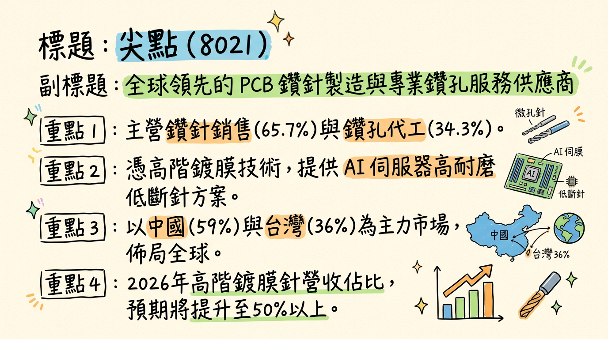
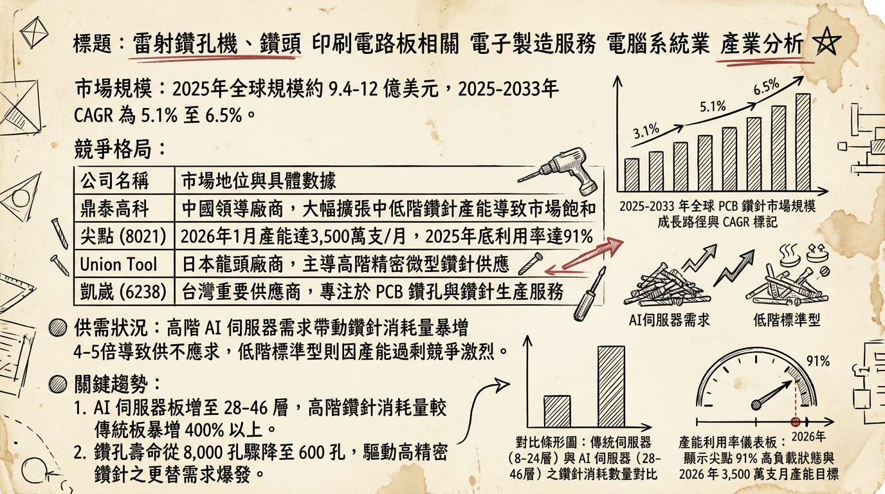
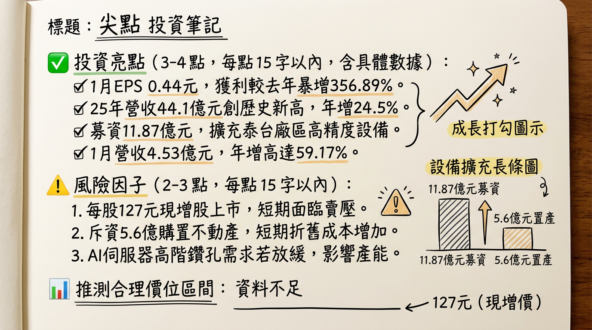

# 8021 尖點 深度研究報告：AI 伺服器浪潮下的 PCB 精密耗材龍頭

## 一句話摘要
受惠 AI 伺服器帶動高多層板（HLC）需求爆發，尖點憑藉「高階鍍膜鑽針」轉型與「泰國產能佈局」雙引擎，2026 年進入獲利倍增的高速成長期。

---

## 公司概覽
尖點（8021）為全球第四大 PCB 鑽針製造商，提供「鑽針銷售」與「鑽孔服務」雙軌營運模式。核心產品聚焦於高精度、高附加價值的鍍膜技術，主要應用於 AI 伺服器、HPC 及 IC 載板。

**營收結構（截至 2025 Q3 法說會資料）：**

| 項目 | 佔比 | 備註 |
| :--- | :--- | :--- |
| **PCB 鑽針銷售** | 65.7% | 核心產品，高階鍍膜針佔比持續提升 |
| **鑽孔代工服務** | 34.3% | 涵蓋機械鑽孔與雷射鑽孔 |
| **區域：中國大陸** | 59% | 主要生產與銷售基地 |
| **區域：台灣** | 36% | 高階研發與先進製程中心 |
| **區域：其他** | 5% | 泰國廠量產後預計 2026 年佔比破 10% |

---

## 核心競爭優勢
1.  **高階鍍膜技術（Coating）：** 尖點開發的鑽針具備高耐磨、低斷針率特性。隨 AI 板材層數升至 28-46 層，一般白針壽命銳減，高階鍍膜針成為標配，尖點技術已直逼日系大廠，價格則具 15-20% 競爭優勢。
2.  **鑽針+服務雙軌模式：** 不僅賣耗材，更直接代工鑽孔。這種模式能即時反饋針具壽命數據，優化研發，並強化與大客戶（如臻鼎、欣興）的黏著度。
3.  **南向佈局先機：** 泰國廠於 2025 年正式量產，是少數能提供東南亞 PCB 聚落完整鑽孔代工服務的廠商，有效分散地緣政治風險。

---

## 財務分析

**近期月營收趨勢：**

| 年月份 | 月營收 (億元) | 月增率 (MoM) | 年增率 (YoY) | 備註 |
| :--- | :--- | :--- | :--- | :--- |
| **2026/01** | 4.53 | -2.77% | **+59.17%** | 歷史次高，營運淡季不淡 |
| **2025/12** | 4.66 | +6.50% | +44.29% | **單月歷史新高** |
| **2025/11** | 4.38 | +0.01% | +39.19% | 訂單能見度極高 |
| **2025/10** | 4.38 | +4.60% | +38.74% | 高階產品出貨暢旺 |
| **2025/09** | 4.18 | +7.33% | +29.90% | 產能利用率快速攀升 |
| **2025/08** | 3.90 | +8.06% | +21.71% | 營收重回成長軌道 |

**年度財務趨勢：**
*   **2024 年度：** 營收 35.41 億元，EPS 1.45 元。
*   **2025 年度：** 營收 44.10 億元（年增 24.5%），EPS 2.45 元。
*   **2026 預估：** 隨 3500 萬支新產能全數開出，法人普遍預期 **EPS 挑戰 4.00 - 6.50 元**。

---

## 法說會重點（2025/11 & 2026/02 綜整）
*   **產品組合優化：** 目標 2026 年高階鍍膜鑽針營收佔比提升至 **60% 以上**（2025 年約 45-50%）。
*   **AI 需求結構性轉變：** AI 伺服器（如 GB200）板材硬度高且孔徑微細化，鑽針消耗量較傳統伺服器增加 **4-5 倍**，且不可重磨再用，帶動「量價齊揚」。
*   **訂單能見度：** 核心客戶需求強勁，目前訂單能見度已看至 **2026 年第二季底**，稼動率維持在 90% 以上的高位。

---

## 券商觀點（2026 年初最新數據）

| 券商名稱 | 報告日期 | 評等 | 目標價 | 2026 EPS 預估 |
| :--- | :--- | :--- | :--- | :--- |
| **中信證券** | 2026/01/27 | 強力買進 | **300 元** | 6.00 元 |
| **凱基投顧** | 2026/01/14 | 買進 (調升) | **260 元** | 6.50 元 |
| **福邦投顧** | 2026/01/08 | 買進 | **230 元** | 5.20 元 |

---

## 財報深度分析

**利潤率趨勢表格：**

| 期間 | 毛利率 (GPM) | 營業利益率 (OPM) | 稅後淨利率 (NPM) | 備註 |
| :--- | :--- | :--- | :--- | :--- |
| **2025 Q3** | **31.3%** | 15.9% | 11.1% | 高階產品佔比過半 |
| **2025 Q2** | 29.4% | 12.1% | 7.7% | 稼動率回升至 90% |
| **2025 Q1** | 26.8% | 7.9% | 4.8% | 傳統淡季影響 |
| **2024 Q4** | 27.2% | 8.4% | 5.1% | 營運落底轉強 |

**資本支出與營運效率：**
*   **資本支出：** 2025 年支出約 5-6 億元；2026 年預計支出將 **>6 億元**，重點投入中壢二廠與泰國二期。
*   **購置資產：** 2026/02 決議投入 **5.6 億元** 購置新北不動產，擴充研發中心。
*   **存貨天數：** 2025 Q3 降至 **89.77 天**（2024 年初 >100 天），顯示庫存去化極佳，供不應求。

---

## 股權異動與籌資紀錄
*   **可轉換公司債（CB）：** 2026/01 發行「尖點二」（80212），面額 7 億元，**轉換價 203.5 元**。
*   **現金增資：** 2026/01 完成，發行 3000 張，價格 **127 元**。
*   **MSCI 納入：** 2026/02/25 獲選納入 **MSCI 全球小型指數成分股**，帶動外資法人被動資金大量流入。

---

## 產業分析

**全球 PCB 鑽針競爭格局 (2025 數據)：**

| 排名 | 公司名稱 | 市佔率 | 優勢與定位 |
| :--- | :--- | :--- | :--- |
| 1 | **鼎泰高科** | 28.9% | 中國龍頭，規模化與成本優勢 |
| 2 | **金洲精工** | 20.8% | 具上游原料背景，切入中低階 |
| 3 | **Union Tool** | 14.0% | 日本技術領先者，高標定價 |
| **4** | **尖點科技** | **10.0%** | **性價比之王，唯一具備大規模服務+產品模式** |

**市場趨勢：**
*   **材料革命：** 2026 年 NVIDIA Rubin 平台預計導入石英玻璃材料，鑽針壽命將從 600 孔進一步降至 200 孔，屆時鑽針消耗量將再迎來一波翻倍成長。
*   **原料成本：** 鎢鋼成本受中國出口管制影響。尖點已於 2025 年底成功調漲白針價格 15%，轉嫁能力強。

---

## 近期催化劑（Catalysts）
*   **利多：**
    1.  2026/01 自結 EPS 達 0.44 元，年增 356%，獲利爆發力驚人。
    2.  2026/03/06 法說會，市場期待管理層上修全年 Guidance。
    3.  與 **臻鼎-KY (4958)** 簽署戰略合作，鞏固先進封裝載板市佔。
*   **利空：**
    1.  鎢精礦原料價格波動若過劇，短期可能壓縮毛利。
    2.  AI 伺服器終端拉貨若出現暫時性空窗期（Gap）。

---

## ⭐ 成長動能時間軸
*   **2025 Q4：** 泰國廠正式量產貢獻營收（代鑽服務）。
*   **2026/01：** 鑽針總產能從 3100 萬支/月 提升至 **3500 萬支/月**。
*   **2026 Q2：** 高階鍍膜針產能拉升至 1800 萬支/月，佔比挑戰 60%。
*   **2026 H2：** 評估泰國廠建置「鑽針工具生產線」，達成在地供貨。
*   **2026 全年：** 泰國廠營收佔比預計突破 **10%**。

---

## 2026 展望
*   **成長動能：**
    *   AI 伺服器（B200/GB200）出貨量攀升帶動 HLC 高階耗材需求。
    *   產品組合轉向高毛利鍍膜針，帶動整體毛利率重回 33-35% 歷史高峰水準。
    *   東南亞 PCB 聚落成形，尖點具備泰國在地服務優勢。
*   **潛在風險：**
    *   中國同業擴產可能導致中低階產品價格競爭。
    *   高額資本支出帶來之折舊攤銷壓力。

---

## 投資結論
1.  **結構性轉型成功：** 尖點已從傳統 PCB 耗材廠成功轉型為 **AI 高階關鍵耗材供應商**，其鍍膜技術具備強大的技術護城河。
2.  **營運淡季不淡：** 2026 年 1 月營收年增近 60%，反映出下游需求並非季節性，而是由 AI 驅動的結構性成長。
3.  **獲利具跳升空間：** 隨產能擴充 13% 及高階佔比拉升，2026 年獲利成長將遠超營收成長。
4.  **建議評價：** 法人預估 2026 年 EPS 均值約 5.5 元，給予 35-40 倍 AI 供應鏈本益比，**目標價區間建議為 195 - 260 元**，300 元為激進看多目標。

---
**本報告由 AI 自動產生，資料來源為公開網路資訊，僅供參考，不構成投資建議。產生時間：2026-03-01 02:55**

---

## 📊 資訊卡

