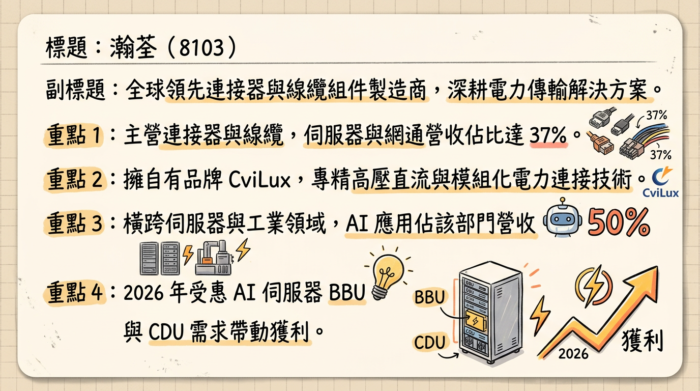
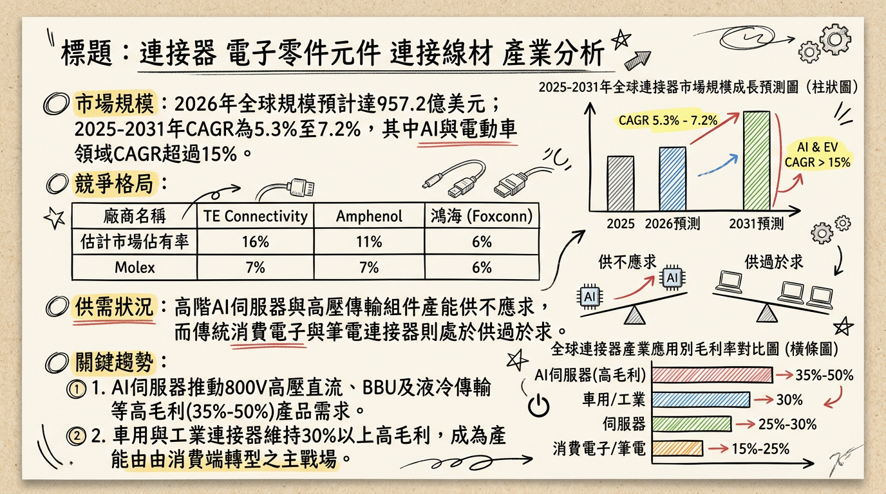
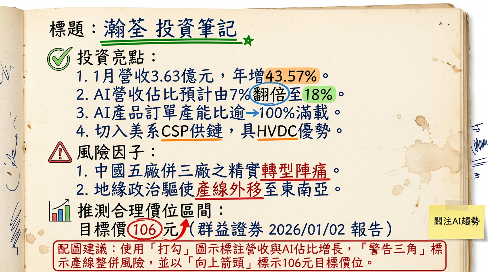

# 8103 瀚荃 深度研究報告：轉型 AI 電力傳輸專家，2026 迎來獲利爆發期

---

## ## 一句話摘要
瀚荃（8103）成功從傳統 NB 連接器廠轉型為 **AI 伺服器高壓直流（HVDC）電力傳輸方案商**，隨 ASIC 客戶訂單放量與泰越產能開出，2026 年 EPS 有望挑戰歷史新高，具備翻倍成長潛力。

---

## ## 公司概覽
瀚荃（CviLux）為全球領先的連接器與線纜組件製造商，擁有自有品牌「CviLux」。近年積極優化產品結構，從消費電子轉向高毛利的伺服器、網通與工業應用。

**2025 年營收結構分析表**
| 業務別 | 營收佔比 | 關鍵發展動態 |
| :--- | :--- | :--- |
| **伺服器與網通** | 36% - 37% | AI 相關應用佔該部門 50%，2026 年預計進一步提升 |
| **筆記型電腦 (NB)** | 23% - 24% | 比重持續調降，重點轉向高單價 AI PC 連接器 |
| **工業電子** | 20% | 受惠自動化與基礎建設復甦，毛利率穩定 |
| **光電與消費電子** | 13% - 17% | 包含三星電視核心供應鏈訂單 |
| **汽車電子** | 4% | 佈局高壓大電流線材，長期成長潛力大 |

---

## ## 核心競爭優勢
1.  **高壓直流（HVDC）技術：** AI 伺服器電力密度飆升，瀚荃具備 800V 高壓直流電源連接器技術，切入 PSU、BBU、CDU 內部電力板端連接。
2.  **ASIC 供應鏈地位：** 成功由 NVIDIA GPU 架構延伸至 AWS、Google 等美系 CSP 之 ASIC 伺服器電力櫃供應鏈。
3.  **全球產能佈局：** 採「中國精實、東南亞擴張」策略，規避地緣政治風險，滿足美系客戶去中化需求。

---

## ## 財務分析

**月營收趨勢表（2025 H2 - 2026 Q1）**
| 月份 | 營收金額 (億元) | 月增率 MoM | 年增率 YoY |
| :--- | :--- | :--- | :--- |
| **2026/01** | 3.63 | +9.3% | **+43.57%** |
| **2025/12** | 3.32 | +12.57% | +6.73% |
| **2025/11** | 2.95 | +11.49% | +1.09% |
| **2025/10** | 2.65 | -15.73% | +17.04% |
| **2025/09** | 3.14 | +18.12% | +11.31% |
| **2025/08** | 2.66 | -9.70% | -11.16% |

**年度與季度財務摘要**
*   **2025 Q3 實際表現：** 季營收 8.74 億元，毛利率 **38.35%**，EPS **1.35 元**（年增 103%）。
*   **2024 年度：** 營收 31.88 億元，EPS **3.96 元**。
*   **2025 年度（預估）：** 營收 33.55 億元（YoY +5.25%），EPS 約 **3.89 元**。
*   **2026 年度（預估）：** 法人共識營收將重回雙位數增長，EPS 挑戰 **6.48 - 6.87 元**。

---

## ## 法說會重點（2025/12/12）
1.  **訂單能見度：** AI 伺服器相關產線目前**稼動率超過 100%（滿載）**，訂單能見度已看到 2026 年上半年。
2.  **產線精實計畫：** 中國廠區 5 座整併為 3 座，優化成本結構；泰國、越南將成為主要成長基地。
3.  **技術轉向：** 伺服器電力架構由 AC 轉向 HVDC，帶動板端連接器用量較傳統伺服器增加 **50% 以上**。

---

## ## 券商觀點

**研究報告目標價整理表**
| 券商名 | 目標價 | 評等 | 日期 | 2026 EPS 預估 |
| :--- | :--- | :--- | :--- | :--- |
| **群益證券** | **106 元** | 看多 | 2026/01/02 | 6.48 元 |
| **某國內研究部**| **117 元** | 強力買進 | 2025/12/15 | 6.87 元 |
| **元富證券** | 80 元 | 看多 | 2025/10/18 | 3.65 元 (2025 估) |

---

## ## 財報深度分析

**利潤率趨勢與營運效率**
| 項目 | 2025 Q3 | 2024 Q3 | 變動 (YoY) |
| :--- | :--- | :--- | :--- |
| **毛利率 (%)** | 38.35% | 36.84% | +1.51 ppt |
| **營業利益率 (%)**| 15.98% | 15.97% | +0.01 ppt |
| **存貨週轉天數** | 68.5 天 | 73.6 天 | -5.1 天 (改善) |
| **應收帳款天數** | 97.47 天 | 95.2 天 | +2.27 天 |

*   **資本支出：** 2026 年資本支出預計較去年**增加 50%**，重點投入泰國、越南二期產線及自動化設備。

---

## ## 股權異動與資本結構
1.  **現金減資：** 2025 年 10 月執行**現金減資 15%**，每股退還 1.5 元，有效優化股本、提升 ROE。
2.  **股利政策：** 2025 年配發現金股利 2.8 元，配發率維持高水準，法人預期 2026 年將隨獲利提升增加配息。
3.  **財務健康度：** 負債比率維持在 **40% 以下**，財務結構穩健。

---

## ## 產業分析

**全球連接器市場競爭格局 (2025 數據)**
| 公司 | 市佔率 | 強項領域 | 2025 預估毛利率 |
| :--- | :--- | :--- | :--- |
| **TE Connectivity** | 15.5% | 汽車、航太、工業 | 32% - 35% |
| **Amphenol** | 11.2% | 通訊、軍工、高頻線材 | 31% - 33% |
| **瀚荃 (8103)** | - | **PSU/BBU 板端連接器** | **37% - 39%** |
| **嘉澤 (3533)** | - | CPU Socket | 50% - 52% |

*   **產業趨勢：** 全球連接器市場 2026 預計達 **957.2 億美元**。其中 AI 高壓直流傳輸領域之複合年增長率（CAGR）高達 **15%**，遠高於產業平均的 5.3%。

---

## ## 近期催化劑
*   **利多事件：**
    *   2026/01 營收創 45 個月新高（3.63 億）。
    *   獲美系兩大 ASIC 廠訂單（AWS/Google），2026 Q1 開始放量。
    *   泰國廠新產能預計於 2026 Q2 正式上線。
*   **風險因子：**
    *   台幣升值對外銷營收產生匯損壓力。
    *   傳統 NB 市場復甦緩慢影響低階產品產能利用率。

---

## ## ⭐ 成長動能時間軸
*   **2025/11：** 越南廠正式量產，供應台系電源大廠海外需求。
*   **2026/01：** 公告 1 月營收年增 43.57%，確立 AI 轉型進入收割期。
*   **2026 Q1：** ASIC 伺服器電源連接器訂單開始大量出貨。
*   **2026 Q2：** 泰國租賃廠房產能到位，擴大供應北美伺服器客戶。
*   **2026 H2：** AI 營收佔比預計突破 40%，獲利結構持續優化。
*   **2027 年：** 東莞常平新廠投產，進一步實現產線自動化與規模效益。

---

## ## 2026 展望
*   **成長動能：** AI 伺服器電力架構升級（Busbar、BBU）及去中化產能配置。伺服器事業群將成為 2026 年毛利率站穩 38% 以上的核心支柱。
*   **風險：** 全球貿易關稅政策變數及海外擴產初期之營業費用上升。

---

## ## 投資結論
1.  **轉型紅利：** 瀚荃已成功從 NB 零組件廠轉型為 AI 電力傳輸專家，產品單價（ASP）與毛利顯著提升。
2.  **獲利跳升：** 預估 2026 年 EPS 有望從 3.89 元跳升至 **6.5 元以上**，本益比具備上修空間。
3.  **產能就位：** 泰、越雙基地產能開出，可滿足美系大廠去中化需求，訂單能見度高。
4.  **建議：** 參考券商目標價區間 **106 - 117 元**。短期關注 Q1 財報獲利是否如預期隨營收規模擴大而展現高度槓桿效應。

---
本報告由 AI 自動產生，資料來源為公開網路資訊，僅供參考，不構成投資建議。產生時間：2026-03-01 02:54

---

## 📊 資訊卡

