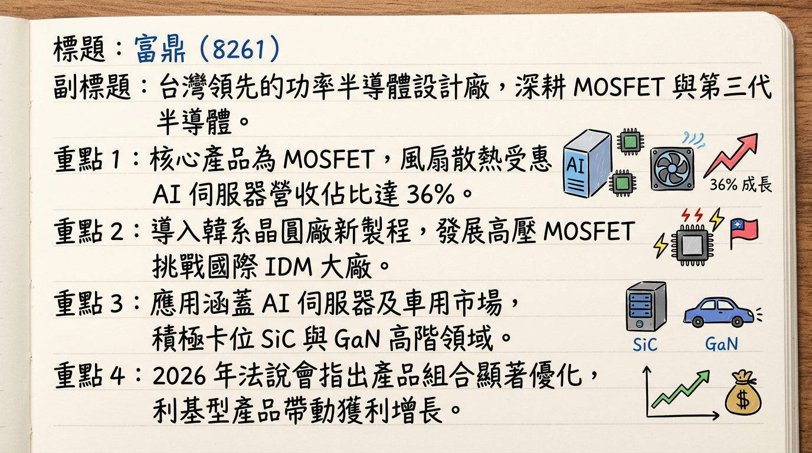
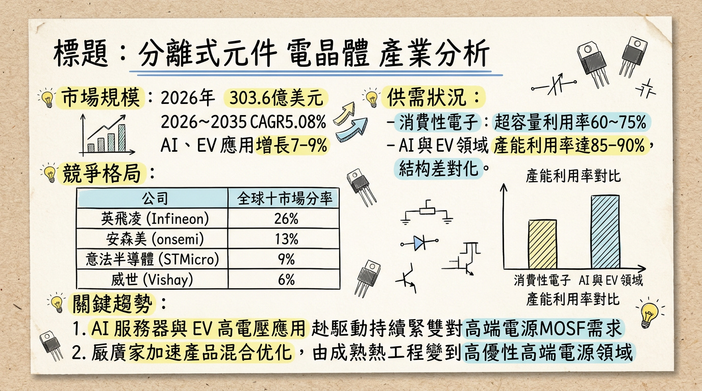
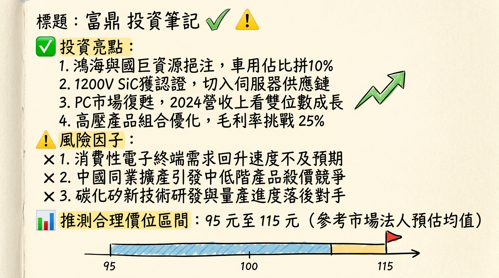

# 8261 富鼎 (APEC) 深度研究報告

## 一句話摘要
**「富鼎憑藉 AI 伺服器散熱（DC Fan）產品線成功轉型，在鴻海與國巨兩大集團資源加持下，正從傳統 PC MOSFET 供應商蛻變為高階電力電子解決方案提供商。」**

---

## 公司概覽
富鼎（Advanced Power Electronics Corp.）為台灣領先之功率半導體（MOSFET）設計公司，採 Fabless（無晶圓廠）模式。近年積極切入第三代半導體（SiC/GaN）與高壓超結（Super Junction）技術。

### 營收結構分析（2025 Q3 數據）
| 應用領域 | 營收佔比 | 趨勢動向 |
| :--- | :--- | :--- |
| **風扇散熱 (DC Fan)** | 36% | 受惠 AI 伺服器散熱需求，成長最顯著（2023 僅 5%） |
| **電源供應器 (SPS)** | 35% | 核心業務，受歐美 IDM 價格競爭影響，比重略降 |
| **電腦運算 (Computing)** | 18% | 主要為 PC/主機板，隨 AIPC 換機潮預期緩步回溫 |
| **其他 (工業/消費)** | 11% | 包含車用、閃光燈、工業用 MOSFET |

**產品電壓組合：** 低壓 (50%)、中壓 (32%)、高壓 (16%)。

---

## 核心競爭優勢
1.  **集團綜效：** 透過國創半導體，擁有**鴻海（出海口）**與**國巨（全球通路）**雙強支持，加速切入車用 Tier 1 與歐洲工控供應鏈。
2.  **新製程導入：** 導入韓系 8 吋晶圓廠新製程開發高壓 MOSFET，顯著降低成本並提升性價比，具備與英飛凌等大廠競爭實力。
3.  **產品結構優化：** 成功從低毛利的消費性電子轉向高毛利的 AI 散熱風扇與伺服器電源市場。

---

## 財務分析

### 近 6 個月營收趨勢
| 月份 | 營收金額 (億新台幣) | 月增率 (MoM) | 年增率 (YoY) |
| :--- | :--- | :--- | :--- |
| **2026/01** | 2.89 | +25.20% | +19.34% |
| **2025/12** | 2.31 | -7.41% | -0.63% |
| **2025/11** | 2.49 | -4.22% | -12.53% |
| **2025/10** | 2.60 | -3.74% | -3.78% |
| **2025/09** | 2.70 | -8.07% | +10.05% |
| **2025/08** | 2.94 | +10.76% | -0.70% |

### 年度財務表現
| 年份 | 營收 (億新台幣) | 年增率 | EPS (元) | 毛利率 (%) |
| :--- | :--- | :--- | :--- | :--- |
| 2024 (實) | 29.18 | - | 4.80 | 28.1% |
| 2025 (實) | 31.04 | +6.4% | **5.73** | **37.4%** |
| 2026 (預) | 34.15 (E) | +10% | **6.25 (E)** | 36.5% (E) |

---

## 法說會重點 (2026/02/25)
*   **2026 營運目標：** 管理層明確提出 2026 年營收挑戰「**雙位數成長**」。
*   **短期展望：** 2026 Q1 受季節性淡季與庫存去化影響，營收預計 QoQ 持平至微幅下滑，但 1 月開門紅優於預期。
*   **產品線觀察：** AI 伺服器 DC Fan 訂單能見度已達 **2026 Q2**；SPS 產品線則因國際 IDM 大廠殺價競爭，壓力尚存。
*   **股利政策：** 董事會決議配發 **5.0 元現金股利**，配發率 87%，以百元股價計，殖利率約 5%。

---

## 券商觀點
| 券商名稱 | 目標價 | 評等 | 日期 | 備註 |
| :--- | :--- | :--- | :--- | :--- |
| 元富證券 | **110 元** | 看多 | 2025/10/31 | 估 2026 EPS 6.1 元 |
| 華南永昌 | **96 元** | 看多 | 2025/11/08 | 估 2026 EPS 6.8 元 |
| Investing 綜合 | **110 元** | 偏多 | 2026/02/27 | 財報公布後維持正向評估 |

---

## 財報深度分析

### 利潤率與營運效率趨勢
| 季度 | 毛利率 (%) | 營益率 (%) | 存貨週轉天數 | 備註 |
| :--- | :--- | :--- | :--- | :--- |
| **2025 Q4** | 37.90% | 24.86% | **144.82 天** | 存貨顯著跳升，需觀察去化 |
| **2025 Q3** | 36.75% | 25.26% | 109.74 天 | AI 散熱佔比高峰 |
| **2025 Q2** | 37.89% | 26.77% | 98.09 天 | 受匯損影響淨利 |
| **2025 Q1** | 37.01% | 23.70% | 103.78 天 | 產品組合開始優化 |

*   **存貨警訊：** 2025 年底存貨金額年增逾 50%，週轉天數拉長至 144 天，主因為 SPS 需求轉疲。
*   **資本支出：** 年均約 1-2 億元，專注於 SiC 研發設備與測試。

---

## 股權異動與資本結構
*   **申報轉讓：** 近半年無重大董監事持股拋售。
*   **庫藏股/增減資：** 近三年無執行計畫，財務結構穩健（負債比 < 30%）。
*   **集團持股：** 鴻海與國巨透過國創半導體間接持股，結構穩定，為長期戰略合作。

---

## 產業分析

### 競爭格局比較 (2025 數據)
| 類別 | 公司 | 2025 毛利率 | 核心技術優勢 |
| :--- | :--- | :--- | :--- |
| **國際 IDM** | Infineon (英飛凌) | ~40-45% | SiC 全球龍頭，擁有自有晶圓廠 |
| **台廠** | **富鼎 (8261)** | **37.4%** | **AI 風扇、高壓 MOSFET、集團資源** |
| **台廠** | 杰力 (5299) | 34.3% | 高階 NB/PC 電源管理 |
| **台廠** | 尼克森 (3317) | 27.1% | 主機板與工控馬達 |

**市場規模：** 全球功率 MOSFET 2026 年預計達 **303.6 億美元**，其中 AI 與 EV 領域複合成長率達 7-9%。

---

## 近期催化劑
*   **利多：**
    *   AI 伺服器對散熱風扇與高功率電源需求不減。
    *   2026 年 1 月營收展現強勁 MoM 成長（+25.2%）。
    *   國巨集團通路發力，切入歐洲工控市場。
*   **利空：**
    *   2025 Q4 存貨水位偏高，短期有毛利率修正壓力。
    *   中國廠商成熟製程產能過剩，導致中低壓產品價格戰。

---

## ⭐ 成長動能時間軸
*   **2025 H2：** AI 伺服器 DC Fan 營收佔比首度突破 35%，確立轉型主軸。
*   **2026 Q1：** 韓系晶圓廠合作之高壓 MOSFET 新產品開始貢獻，1 月營收優於市場預期。
*   **2026 Q2：** 預計完成 2025 Q4 堆積之存貨去化，毛利率可望止穩。
*   **2026 H2：** SiC（碳化矽）產品小規模量產，預計打入車用 OBC（車載充電器）供應鏈。

---

## 2026 展望
*   **成長動能：** AI 伺服器滲透率提升帶動高單價 MOSFET 需求；SPS 市場回溫。
*   **風險因素：** 歐美 IDM 大廠價格競爭持續、地緣政治影響供應鏈成本、庫存去化速度慢於預期。

---

## 投資結論
1.  **獲利體質改善：** 2025 年毛利率達 37.4% 創近年高標，顯示公司已脫離低毛利 PC 戰場，營收與 EPS 連續兩年成長趨勢明確。
2.  **AI 題材純度高：** 散熱風扇佔比 36%，是少數實質受惠於 AI 散熱需求的 MOSFET 廠。
3.  **集團溢價：** 鴻海/國巨的策略結盟，賦予富鼎優於同業的訂單能見度與通路優勢。
4.  **操作建議：** 2025 年 EPS 5.73 元，配息 5 元。預估 2026 年 EPS 可挑戰 6.25 元。參考歷年本益比 15-18 倍，**合理股價區間預計在 94 - 112 元**。短期需留意存貨天數偏高之負面因子。

---
本報告由 AI 自動產生，資料來源為公開網路資訊，僅供參考，不構成投資建議。
產生時間：2026-03-01 02:56

---

## 📊 資訊卡

