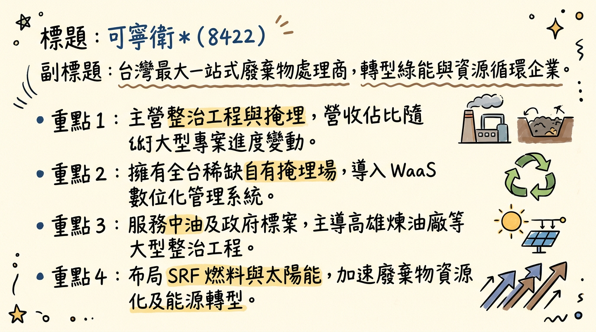
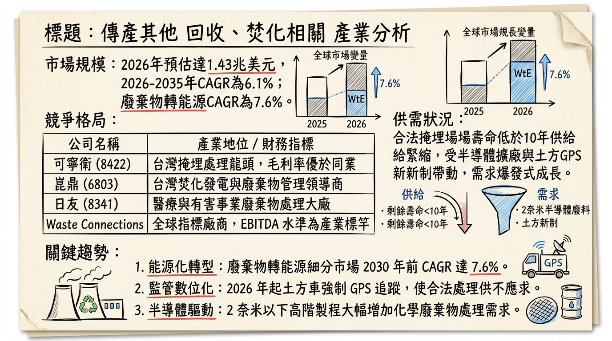
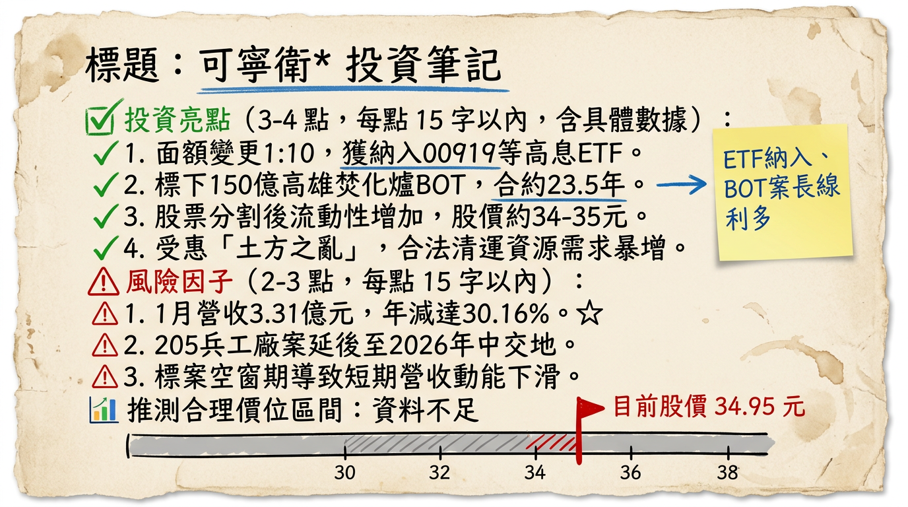

# 8422 可寧衛* 深度研究報告

## 一句話摘要
**從「廢棄物掩埋龍頭」蛻變為「綠能循環經濟巨頭」，2026年將迎來 SRF 商轉與大型整治專案重啟的獲利雙引擎爆發期。**

---

## 公司概覽
可寧衛（8422）為台灣環境處理產業龍頭，擁有全台稀缺的自有掩埋場資產。公司正由傳統末端處理轉型為「廢棄物資源化」與「能源化」企業，提供從清除、固化、物化到掩埋的一站式服務。

### 營收結構 (2025/2026 預估)
| 業務項目 | 營收佔比 | 核心內容 | 趨勢 |
| :--- | :--- | :--- | :--- |
| **環境整治專案** | 40-50% | 高雄 205 兵工廠、中油煉油廠土壤整治標案 | 專案導向，2026 認列回升 |
| **廢棄物處理** | 35-40% | 有害/一般事業廢棄物清運、固化與掩埋 | 穩定高毛利核心本業 |
| **再生能源與再利用** | 10-15% | SRF 電廠售電、太陽能(漁電共生)、再生建材 | 持續提升，提供穩定現金流 |

---

## 核心競爭優勢
1.  **特許資產稀缺性：** 擁有全台極少數合法的有害事業廢棄物掩埋場，新場址環評困難，具備長期壟斷地位與強大定價權。
2.  **一站式技術門檻：** 具備高濃度重金屬土壤整治技術，為台積電、中油等大型標案的首選廠商。
3.  **數位化管理：** 透過「大云永續科技」提供 WaaS 數位管理，強化客戶黏著度並符合 ESG 趨勢。
4.  **穩定配息記錄：** 盈餘配發率長期維持在 90% 以上，為市場公認的優質防禦型高息股。

---

## 財務分析

### 月營收趨勢表 (近期 6 個月)
*註：2026/01 為最新數據*

| 月份 | 營收金額 (億元) | 月增率 MoM | 年增率 YoY | 簡評 |
| :--- | :--- | :--- | :--- | :--- |
| 2026/01 | 3.31 | -4.14% | -30.16% | 專案空窗期影響 |
| 2025/12 | 3.46 | +10.39% | -27.80% | 季末認列回溫 |
| 2025/11 | 3.13 | -8.87% | -36.36% | 205 兵工廠第一區完工 |
| 2025/10 | 3.43 | -4.15% | +5.28% | 整治進度穩定 |
| 2025/09 | 3.58 | +5.25% | +6.19% | 去年基期較低 |
| 2025/08 | 3.40 | -4.98% | -23.90% | 專案認列空檔 |

### 年度與季度數據預估
- **2025 全年 (預估)：** 營收 48-49 億元，EPS 預估為 **1.36 元** (新面額 1 元計)。
- **2026 全年 (展望)：** 營收目標站回 **50 億元**，法人預估 EPS 區間為 **1.26~1.89 元**。

---

## 法說會重點
- **高雄南區焚化爐 BOT：** 投資 150 億元，合約 23.5 年。2025 Q4 已移交舊廠代操作，2026 起每年穩定貢獻 7-8 億元營收。
- **205 兵工廠標案：** 第一區完工後，第二、三區因汙染超預期導致交地延後，預計 **2026 年 Q2-Q3** 重新啟動認列。
- **SRF 商轉進度：** 觀音 SRF 電廠能源轉換效率 > 26%，預計 2026 年內正式商轉，年營收貢獻預估逾 3.5 億元。

---

## 券商觀點 (目標價整理)
*註：所有數據已依 2025 年底股票面額 1:10 拆分進行調整*

| 券商名稱 | 目標價 (新面額) | 評等 | 日期 | 核心觀點 |
| :--- | :--- | :--- | :--- | :--- |
| **宏遠證券** | 28.0 元 | 看多 | 2025/11 | 認同轉型綠能價值 |
| **台新投顧** | 24.0 元 | 買進 | 2025/11 | 重點在 SRF 投產進度 |
| **兆豐證券** | 23.3 元 | 看多 | 2025/07 | 205 專案為短期獲利動能 |
| **市場共識** | **30-35 元** | 強烈買進 | 2026/01 | 「土方新制」與 ESG 重估 (Re-rating) |

---

## 財報深度分析

### 利潤率趨勢 (2024Q4 - 2025Q3)
| 季度 | 毛利率 (%) | 營業利益率 (%) | 稅後淨利率 (%) | EPS (面額 10 元) |
| :--- | :--- | :--- | :--- | :--- |
| 2025 Q3 | 48.74% | 34.57% | 26.01% | 2.47 |
| 2025 Q2 | 59.61% | 48.34% | 34.64% | 4.38 |
| 2025 Q1 | 53.05% | 41.98% | 29.90% | 3.62 |
| 2024 Q4 | 44.11% | 32.53% | 29.56% | 2.50 |

### 財務健康度分析
- **存貨週轉：** 2025 Q3 存貨週轉天數僅 **10.57 天**，無庫存積壓風險。
- **應收帳款：** 週轉天數拉長至 **104.44 天**，主因政府標案（205 專案）請款週期較長。
- **資本支出：** 隨著 SRF 與太陽能場建置，單季折舊費用已上升至 **1.1-1.3 億元**，將測試未來稼動率。

---

## 股權異動
- **股票分割：** 2025/11/17 完成面額由 10 元變更為 **1 元**，增加市場流動性。
- **申報轉讓：** 2026/01/07 董事 **楊永發** 申報轉讓 2,000 張（一般交易），持股降至 600 張，需關注後續籌碼影響。
- **ETF 動向：** 拆分後成功納入 00919、00929 等高息 ETF，法人持股結構趨於穩定。

---

## 產業分析

### 台灣同業競爭格局比較 (2025-2026 預估)
| 公司名稱 | 預估毛利率 | 核心業務 | 優勢比較 |
| :--- | :--- | :--- | :--- |
| **可寧衛\* (8422)** | **52-56%** | **危廢、土壤整治** | **擁有自有掩埋場，具定價權** |
| 崑鼎 (6803) | 25-28% | 焚化、再生水 | 專精於公部門代操作 |
| 日友 (8341) | 40-42% | 醫廢、中國事廢 | 專注於醫療廢棄物細分市場 |

---

## 近期催化劑
- **【利多】土方新制政策：** 2026 年元月起強制 GPS 追蹤，使合法處理需求爆發。
- **【利多】SRF 電廠商轉：** 預計 2026 Q1-Q3 併網售電，增加穩定現金流。
- **【利多】ETF 買盤：** 因高殖利率特性，有望持續獲得被動基金加碼。
- **【利空】專案延宕：** 高雄 205 兵工廠若交地再度延遲，將壓抑上半年營收表現。

---

## ⭐ 成長動能時間軸

- **2026 Q1：** 桃園 SRF 電廠進行最後驗收，小港焚化爐舊廠代操作穩定貢獻。
- **2026 Q2：** **關鍵節點**：高雄 205 兵工廠二、三區預計重啟認列；大承再生粒料廠商轉。
- **2026 Q3：** SRF 正式商轉貢獻營收（預估年增 3.5 億元）；太陽能二期工程推進。
- **2026 Q4：** 太陽能裝置容量目標達成 **140MW**；205 專案進入認列高峰。
- **2027-2028：** 高雄南區焚化爐新廠完工（日處 1,350 噸），營收結構進入二次成長。

---

## 2026 展望
- **成長動能：**
  1. 能源轉型見效，售電收入佔比提升至 15% 以上。
  2. 土壤整治大型標案進入收益收割期。
  3. 面額變更後吸引更多散戶與 ETF 參與。
- **主要風險：**
  1. 資本支出過大導致折舊費用侵蝕利潤率。
  2. 政府行政流程導致專案認列進度不如預期。

---

## 投資結論
1.  **結構重估：** 可寧衛正從掩埋公司轉型為綠能發電股，市場估值(PE)有望從 12-15 倍上修至 18-20 倍。
2.  **獲利拐點：** 2026 年 Q2 為營收回升的關鍵拐點，建議投資人關注 205 專案交地訊息。
3.  **高息守護：** 現金殖利率維持 5% 以上，具備強大的下檔支撐。
4.  **建議操作：** 目前股價位於 34-35 元區間，法人目標價平均約 **30-35 元**。考量 2026 年 EPS 成長性，**32 元以下具投資價值，長期目標看好 40 元 (對應舊面額 400 元)**。

---
本報告由 AI 自動產生，資料來源為公開網路資訊，僅供參考，不構成投資建議。產生時間：2026-03-01 02:54

---

## 📊 資訊卡

