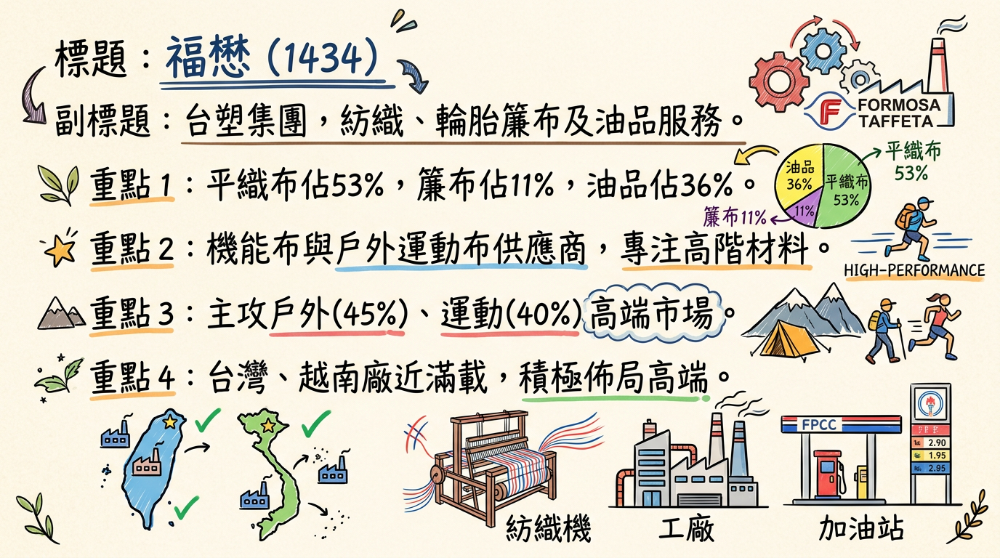
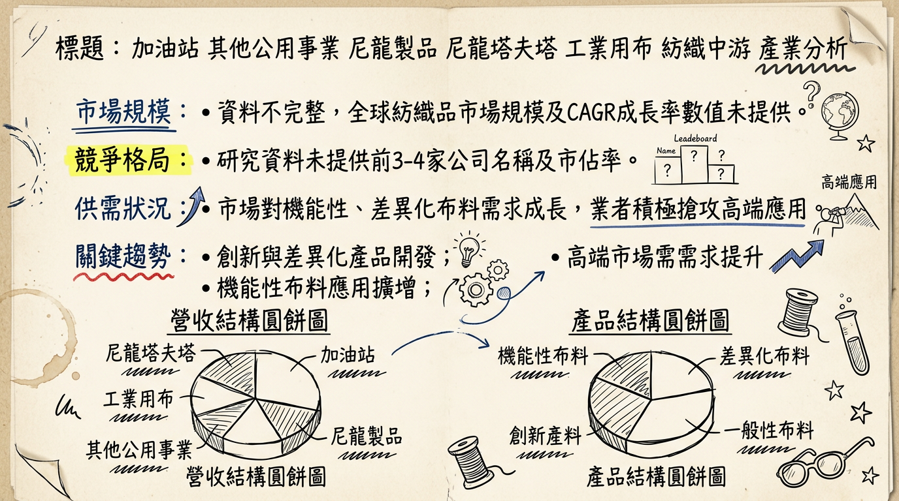
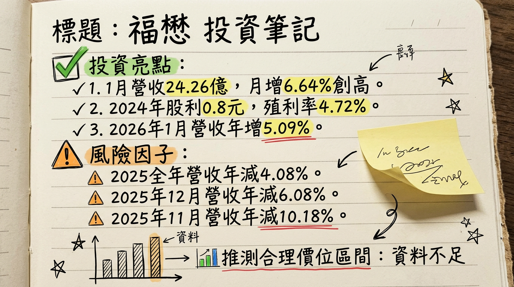

# 1434 福懋 深度研究報告

## 一句話摘要

福懋興業（1434）作為台塑集團旗下的多元化企業，在紡織產業面臨挑戰之際，正積極透過高毛利機能布與戶外布料的產品轉型、新市場開拓及亞洲第三生產據點的佈局，以應對中國大陸低價競爭並搶佔高端市場。受惠於2026年世界盃足球賽的球衣布料需求拉貨及戶外運動風潮，公司預期營運基本面將自2026年好轉，儘管短期仍需面對總體經濟不確定性與潛在關稅影響，長期成長動能仍值得關注。

## 公司概覽

福懋興業主要從事平織布製造，同時也是機能布料的重要供應商，並跨足輪胎簾布製造及加油站經營。公司致力於創新產品和差異化材料開發，以搶攻高端市場。

**核心產品與服務：**
尼龍多富達布、聚酯布、傘骨槽骨、輪胎簾布、棉紗、人造棉紗、合成纖維紗、混紡紗、織布染整、成衣、被單、床單等相關製品，以及高分子聚合物製品、防彈衣背心、夾克、工業用工作服等。

**製造基地：**
台灣、越南、中國。台灣和越南廠區目前接近滿載運作，中國廠區仍有餘裕。越南廠區為公司主要供應鏈之一，約佔五成，主要供應美國市場。

**2025年前三季合併營收結構**

| 業務項目 | 營收佔比 |
| :------- | :------- |
| 平織布   | 53%      |
| 簾布     | 11%      |
| 油品     | 36%      |

**2026年產品結構預估（總經理李敏章於2025年10月指出）**

| 產品類別     | 佔比預估 |
| :----------- | :------- |
| 戶外布料     | 45%      |
| 運動布料     | 40%      |
| 休閒與生活風格 | 15%      |

## 核心競爭優勢

1.  **多元業務佈局與抗風險能力：** 涵蓋紡織纖維、輪胎簾布及油品事業，透過多角化經營分散單一產業波動風險。
2.  **高端機能布料研發實力：** 積極發展高機能性、永續、環保等創新與差異化材料，搶佔高端市場並維繫品牌信任。
3.  **全球化生產供應鏈：** 擁有台灣、越南、中國製造基地，其中越南廠區為美國市場主力供應商，並積極評估亞洲第三生產據點，提升產能利用率並分散地緣政治風險。
4.  **台塑集團資源整合：** 作為台塑集團旗下公司，可望在原料供應、技術合作及資金調度上獲得集團支持。
5.  **長期品牌合作關係：** 主要客戶以大型品牌為主，佔比達95%，顯示其產品品質與供應穩定性獲得國際品牌認可。

## 財務分析

### 月營收趨勢

**福懋 (1434) 近6個月合併營收**

| 月份   | 金額 (新台幣億元) | 月增率 (MoM) | 年增率 (YoY) |
| :----- | :---------------- | :----------- | :----------- |
| 2 026/01 | 24.26             | +6.64%       | +5.09%       |
| 2 025/12 | 22.75             | +17.91%      | -6.08%       |
| 2 025/11 | 19.29             | +1.20%       | -10.18%      |
| 2 025/10 | 19.07             | -11.59%      | -15.64%      |
| 2 025/09 | 21.57             | -1.21%       | -8.86%       |
| 2 025/08 | 21.83             | -0.13%       | -10.54%      |

*   **營收動能：** 2026年1月營收達新台幣24.26億元，創近9個月新高，顯示營運有逐步回溫跡象，年增率及月增率皆轉正。

### 季度數據

**福懋 (1434) 最新季度財務表現 (2025年第三季)**

| 指標       | 2025年第三季 (Q3) |
| :--------- | :---------------- |
| 季營收     | 新台幣65.06億元   |
| 毛利率     | 11.27%            |
| 營業利益率 | 1.43%             |
| 每股盈餘 (EPS) | 新台幣0.2元       |

### 年度趨勢

**福懋 (1434) 年度營收與EPS**

| 年度       | 全年營收 (新台幣億元) | 全年EPS (新台幣元) |
| :--------- | :-------------------- | :----------------- |
| 2024 (實際) | -                     | 0.89               |
| 2025 (實際) | 275.43 (年減4.08%)      | 0.29 (累計至Q3)    |
| 2026 (預估) | 未提供                  | 未提供             |

*   **年度表現：** 2025年累計營收年減4.08%，且前三季累計EPS僅0.29元，顯示整體營運仍處於壓力之下，但已開始展現回溫跡象。

## 法說會重點

**最近一次法說會日期：** 2025年11月26日下午2點，華南永昌證券舉辦。

**管理層發言與Guidance：**

*   **產業困境與應對：** 紡織業面臨中國大陸低價競爭與全球需求保守壓力，福懋透過創新產品與差異化材料搶占高端市場，維繫品牌信任。
*   **2026年世足賽商機：** 預期將帶動球衣布料需求，供應鏈自2025年下半年起陸續拉貨，若晉級隊伍有望迎來追加訂單，對業績有正面挹注。
*   **機能性平織布：** 預計2026年出貨量可增加近1成。
*   **產能利用率：** 目前台灣、越南廠區接近滿載（秋冬九成以上，春夏約七成），中國大陸廠區仍有餘裕。
*   **資本支出與新產能規劃：** 傾向不在現有生產基地擴廠，正積極尋找第三生產據點，以亞洲地區為主，鎖定具成衣聚落與市場規模的地區，暫不考慮歐美設廠。**未找到2025-2026年具體資本支出金額。**
*   **2026年展望：** 公司預期在產品結構調整後，三大事業群在2026年看穩健往上，基本面預期將自2026年好轉。
*   **短期風險：** 短期內仍需應對總體經濟不確定性、美國關稅政策影響和匯率波動壓力，可能導致獲利能力繼續承壓。

## 券商觀點

**福懋 (1434) 券商目標價與評等**

| 券商名稱 | 目標價 (新台幣元) | 評等 | 日期 | 備註 |
| :------- | :---------------- | :--- | :--- | :--- |
| **總結** | **未提供**          | **未提供** | **2026/03/06** | **目前未找到2025-2026年至少3家券商對福懋（1434）的具體目標價資料。** |

**EPS預估與評等調整：**

*   目前未找到2025-2026年各券商對福懋（1434）的EPS預估數字。
*   目前未找到2025-2026年福懋（1434）最近有無重大調升/調降評等的資料。

## 財報深度分析

### 利潤率趨勢

**福懋 (1434) 近8季利潤率趨勢**

| 季度       | 毛利率   | 營業利益率 | 稅後淨利率* |
| :--------- | :------- | :--------- | :---------- |
| 2025 Q3    | 11.27%   | 1.43%      | 5.10%       |
| 2025 Q2    | 11.41%   | 3.85%      | -0.48%      |
| 2025 Q1    | 11.26%   | 3.55%      | 2.43%       |
| 2024 Q4    | 10.70%   | 2.29%      | 1.55%       |
| 2024 Q3    | 10.70%   | 1.96%      | 13.57%      |
| 2024 Q2    | 11.37%   | 3.06%      | 2.62%       |
| 2024 Q1    | 11.97%   | 3.10%      | 2.89%       |

*稅後淨利率根據季稅後淨利/季營收計算得出。

*   **利潤率變化原因：** 2025年前三季合併營收年減2.03%，但營業毛利年增3.62%，營業淨利年增27.98%，營業淨利率從2%提升至3%，顯示公司在核心營運管理及成本控制方面有所成效。然而，非營業收入及支出（如匯兌損益）的大幅減少以及匯率變動的負面影響，對最終的稅前淨利和本期淨利造成顯著拖累。2024年Q3的稅後淨利率顯著提高，主要受台塑化約7.3億元的股息收入遞延入帳所致。

### 存貨與營運

**福懋 (1434) 近8季存貨與應收帳款週轉天數**

| 季度       | 存貨週轉天數 | 應收帳款收現天數 |
| :--------- | :----------- | :--------------- |
| 2025 Q3    | 102.08       | 36.99            |
| 2025 Q2    | 96.38        | 37.19            |
| 2025 Q1    | 96.8         | 34.09            |
| 2024 Q4    | 108.07       | 35.62            |
| 2024 Q3    | 101.56       | 36.60            |
| 2024 Q2    | 97.92        | 35.40            |
| 2024 Q1    | 108.66       | 32.95            |

*   **存貨分析：** 近幾季存貨週轉天數在96-108天之間波動，顯示公司在供應鏈管理上較為穩定。雖然存銷比有逐漸減少的走勢，但尚未明確指出是否有異常堆積或備料現象。
*   **應收帳款：** 應收帳款收現天數維持在33-37天左右，收款效率穩定。

### 資本支出

**福懋 (1434) 近8季資本支出 (千元)**

| 季度       | 資本支出 (千元) |
| :--------- | :-------------- |
| 2025 Q3    | 253,946         |
| 2025 Q2    | 54,419          |
| 2025 Q1    | 99,581          |
| 2024 Q4    | 497,317         |
| 2024 Q3    | 85,860          |
| 2024 Q2    | 114,509         |
| 2024 Q1    | 176,611         |

*   **未來資本支出計畫：** 公司傾向不在現有生產基地擴廠，正積極尋找第三生產據點，以亞洲為主，鎖定具成衣聚落與市場規模的地區。**目前未找到福懋（1434）母公司具體的新增產能數據或未來明確的資本支出金額計畫。**
*   **折舊攤銷趨勢：** 2025 Q3 折舊為新台幣329,354千元。

## 股權異動

*   **董監事/大股東申報轉讓：** 最近一年無董監事或大股東申報持股轉讓紀錄。
*   **庫藏股：** 未找到2024-2026年庫藏股買回紀錄。
*   **可轉債/增減資：** 未找到2024-2026年發行可轉換公司債（CB）或現金增資/減資計畫。
*   **股利政策：** 福懋自1985年連續41年發放股利。
    *   2025年（發放2024年股利）：現金股利0.80元。除息日2025/07/24，發放日2025/08/27。現金殖利率為4.72%（以除權息前股價16.95元計算）。
    *   2024年（發放2023年股利）：現金股利0.50元。除息日2024/07/31，發放日2024/08/30。
*   **負債比率：** 2025年Q3負債比為27.70%。
*   **自由現金流量：** 2025年Q3自由現金流為新台幣1,034,146千元，呈現波動但維持正向。
*   **業外收支：** 業外收支對淨利影響顯著，2025年Q3業外收支佔稅前淨利比為77.03%。主要受匯兌損益及轉投資股利收入（如2024年Q3台塑化股利收入約7.3億元）影響。

## 產業分析

### 產業數據

*   **全球紡織品市場規模與CAGR：**
    *   整體紡織品市場預計從2025年的1.104兆美元成長至2034年的1.5081兆美元，2026-2034年CAGR為3.53%。
    *   紡織布料市場在2025年超過6,595億美元，預計2026年達7,004.5億美元，2026-2035年CAGR超過6.9%，至2035年將超過1.29兆美元。
    *   衣料用纖維市場預計2025年約2,340億美元，2025-2034年CAGR約4.6%，至2034年成長至約3,741億美元。
*   **全球輪胎簾布市場規模與CAGR：**
    *   預計從2025年的63.3億美元成長到2026年的66.7億美元，CAGR為5.3%。預計到2030年達80.6億美元，CAGR為4.9%。
*   **供需狀況：**
    *   整體紡織業在2025年面臨全球需求分化、原料價格波動及中國產能過剩壓力，品牌商下單保守，多採取急單、短單。
    *   棉花方面，2025/26年度全球棉花供需預計收緊，期末庫存消費比降至63%以下，顯示供給趨於緊繃。
*   **產業平均毛利率水準：**
    *   台灣紡織龍頭儒鴻平均毛利率達27.6%，聚陽達25.9%，遠高於電子業。福懋的毛利率（2025Q3為11.27%）相對較低，顯示其產品組合仍有優化空間。

### 競爭格局

**福懋 (1434) vs. 主要競爭對手比較**

| 項目         | 福懋 (1434)                                | 中國布廠                                 | 台灣同業 (如儒鴻、聚陽)                      |
| :----------- | :----------------------------------------- | :--------------------------------------- | :------------------------------------------- |
| **技術與產品** | 創新產品、差異化材料，搶攻高端市場；戶外及運動布為主。 | 快速擴張，低價競爭；品質穩定性待提升。     | 技術密集、機能布料、彈性針織；布料成衣垂直整合；科技與時尚跨界。 |
| **產能與生產據點** | 台灣、越南廠接近滿載，中國有餘裕；正評估亞洲第三生產據點。 | 生產基地外移至越南、印尼等地。             | -                                            |
| **客戶**     | 主要為大型品牌 (95%)，新興品牌 (5%)。    | -                                        | 全球前5大成衣品牌，逾8成產品與台灣相關。   |
| **價格策略** | 以創新與品質維繫品牌信任，避免低價競爭。   | 靠價格優勢切入市場。                       | 高附加價值產品帶來較高毛利。                 |

**台灣紡織同業比較 (2025年部分數據)**

| 公司名稱   | 營收規模 (2025年前三季/全年) | 營業毛利率 (2025年) | EPS (2025年)        | 備註                                       |
| :--------- | :--------------------------- | :----------------- | :------------------ | :----------------------------------------- |
| 福懋(1434) | 合併營收214.39億元 (前三季)  | 11.27% (Q3)        | 0.29元 (累計至Q3)   | Q2稅後虧損0.34億元。                     |
| 儒鴻(1476) | 未提供                       | 平均27.6%          | 未提供              | 2026年新產品占比目標逐步拉升至20%。     |
| 聚陽(1477) | 未提供                       | 平均25.9%          | 未提供              | -                                          |

### 產業趨勢

1.  **永續發展與綠色轉型：**
    *   **趨勢：** 消費者對環保產品需求提升，永續纖維、再生與生物基材料、循環紡織經濟成重點。綠色製造與循環經濟是行業底線。
    *   **影響：** 業者需投入研發生物基纖維、回收聚酯與綠色材料，推動T2T閉環回收技術，改變生產流程和供應鏈，提升產品附加價值。
2.  **智慧化與數位化生產：**
    *   **趨勢：** AI、大數據、物聯網賦能全鏈條，普及智能化生產，提升柔性製造與快速反應能力。數位紡織印花技術與供應鏈可追溯性日益重要。
    *   **影響：** 導入AI輔助設計、行銷，優化流程，推動產業從勞動密集型向技術密集型轉型。
3.  **機能性與高性能布料的升級：**
    *   **趨勢：** 功能性纖維需求成長，機能布料從「功能堆疊」轉向「體感導向」與「全天候適配性」，重視「長時間穿著」的舒適與穩定性。
    *   **影響：** 開發需更注重舒適性、濕熱釋放、體溫穩定性及應對多種生活場景，提升產品競爭力。

### 福懋的機會與威脅

*   **機會：**
    *   **高端市場與差異化產品：** 符合機能性布料升級趨勢，可抓住「體感導向」需求。
    *   **全球性賽事帶動需求：** 2026年世界盃足球賽有望帶動球衣布料拉貨與追加訂單。
    *   **戶外運動風潮：** 戶外布料需求動能強勁，預計2026年佔比達45%，成主要成長引擎。
    *   **新生產據點佈局：** 亞洲第三生產據點可分散風險、降低成本、接近成衣聚落。
*   **威脅：**
    *   **中國低價競爭：** 中國廠以低價搶單並將生產基地外移，加劇市場價格戰。
    *   **全球經濟不確定性：** 景氣疲弱、美國關稅政策、匯率波動與地緣風險。
    *   **原料價格波動：** 油價下滑拖累紡纖上中游產品報價。

### 相關投資題材

*   **AI紡織：** AI可輔助設計、行銷及電商，優化生產流程。福懋需投入AI技術提升效率。
*   **電動車(EV)應用：** 輪胎簾布作為核心業務，電動車對輪胎耐久性、輕量化需求增加，推動先進簾布加工技術投資。若能開發輕量化、環保紡織複合材料，有機會切入電動車內裝或安全材料供應鏈。
*   **HBM (高頻寬記憶體)：** 福懋紡織本業與HBM無直接連結。但子公司福懋科(8131)從事IC封測，計畫2026年切入高容量伺服器DDR5模組市場，間接與HBM相關的伺服器產業有聯繫。

## 近期催化劑

*   **營收表現：**
    *   2026年1月合併營收24.26億元，月增6.64%，年增5.09%，創近9個月新高。
    *   2025年12月合併營收22.75億元，月增17.91%，年減6.08%。
    *   2025年全年累計營收達275.43億元，年減4.08%。
*   **股利政策：** 2025年3月7日公告2024年股利政策，預計發放現金股利0.8元。
*   **股東會/法說會：** 2025年11月26日舉行線上法說會，重點強調區域分散、產能整合、智能創新、深化品牌合作等策略。董事會決議2026年6月25日召開股東會。
*   **外資/投信買賣超：** 截至2026年3月5日，外資買超28張，投信買賣超0張，自營商賣超54張。三大法人持股比重截至2026年2月底為10.84%。

## ⭐ 成長動能時間軸

| 時間點           | 成長動能                                     | 具體內容                                         |
| :--------------- | :------------------------------------------- | :----------------------------------------------- |
| **2025年下半年起** | **2026年世界盃足球賽備貨需求**             | 球衣布料供應鏈陸續拉貨，若晉級隊伍確定有望追加訂單。 |
| **2025年第四季開始評估，2026年進行中** | **第三生產據點擴廠計畫**                     | 積極評估亞洲地區（如越南、印尼）設立新廠，以分散風險、貼近市場。 |
| **2026年**       | **產品結構調整：戶外布料佔比提升**           | 預計戶外布料佔比升至45%，運動布佔40%，成為主要動能。 |
| **2026年**       | **新產品創新與應用**                         | 推出長效防曬環保彈性布料、渲閃色無氟環保撥水織物等，爭取運動、休閒、戶外品牌客戶。 |
| **2026年**       | **機能性平織布出貨量增加**                   | 預計出貨量可增加近1成。                          |

## 2026 展望

**成長動能：**

*   **世界盃足球賽效應：** 2026年擴大舉辦的世界盃將顯著帶動球衣布料需求，自2025年下半年啟動的拉貨潮將持續為公司業績提供動能。
*   **戶外運動風潮：** 戶外布料市場的成長將使福懋產品結構中該類別佔比提升至45%，成為新的成長引擎。
*   **創新差異化策略：** 透過研發高機能性、環保、生物基材料等新產品，持續鞏固高端市場，避免與中國低價競爭。
*   **新產能佈局：** 規劃亞洲第三生產據點，將有助於提升長期產能利用率、優化供應鏈韌性，並更有效應對市場需求變化。
*   **基本面好轉預期：** 管理層與法人普遍預期福懋基本面將自2026年起好轉。

**風險：**

*   **總體經濟不確定性：** 全球景氣復甦力道不足、通膨及升息壓力持續，可能影響終端消費需求。
*   **美國關稅政策：** 潛在的美國關稅政策可能削弱消費力，進而影響品牌2026年下單動能，特別是對越南廠區的影響。
*   **中國低價競爭：** 中國廠商持續以低價搶單，且逐漸提升品質，對福懋的毛利率構成長期壓力。
*   **匯率波動與原料成本：** 油價與棉花等原料價格波動，以及匯率變動，將持續影響公司獲利能力。

## 投資結論

1.  **營運轉折點浮現：** 儘管2025年福懋獲利表現仍受壓抑，但營收已見回溫跡象，且經營層預期2026年基本面將好轉。2026年世界盃足球賽及戶外運動風潮，為公司帶來明確的近期催化劑，尤其戶外布料佔比提升有望優化產品組合。
2.  **高端轉型與全球佈局：** 公司積極發展高機能性與差異化材料，並尋求亞洲第三生產據點，顯示其具備轉型升級的決心與應對全球供應鏈變化的策略彈性，有助於長期競爭力提升。
3.  **利潤結構仍具挑戰：** 儘管營業毛利及營業利益有所改善，但業外收支（尤其是匯兌損益）對淨利影響甚鉅，凸顯公司在非核心營運風險管理上的挑戰。
4.  **競爭與總經風險不容忽視：** 中國低價競爭、全球經濟疲軟、美國關稅政策與原料價格波動仍是福懋2026年營運的主要風險因子，需密切關注。
5.  **投資建議：** 考量公司在營運轉型與新市場機會的積極佈局，以及2026年足球賽事的拉貨動能，預期福懋營運有望逐步擺脫谷底。然而，鑒於目前券商尚未提供具體目標價區間，且總體經濟不確定性仍高，建議投資人持續關注其每月營收變化、新產能佈局進度及利潤率改善情況。若公司能有效控制業外風險並成功提升產品附加價值，中長期投資價值有望逐步顯現。

本報告由 AI 自動產生，資料來源為公開網路資訊，僅供參考，不構成投資建議。產生時間：2026-03-06 14:35

---

## 📊 資訊卡

