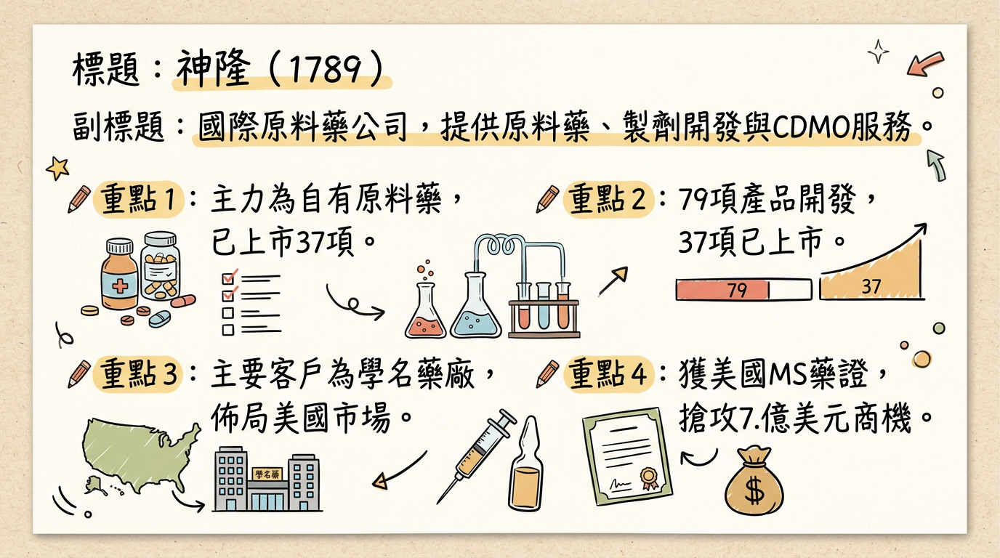
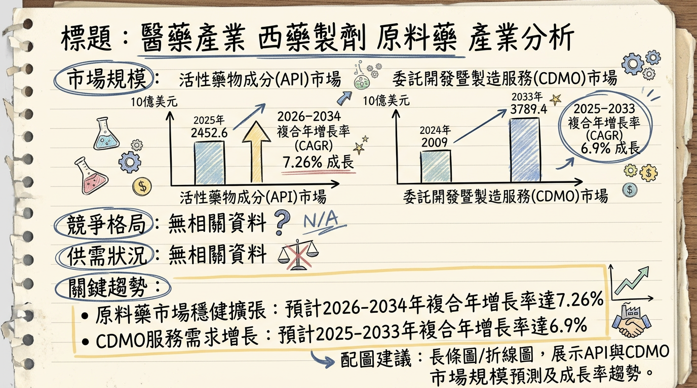
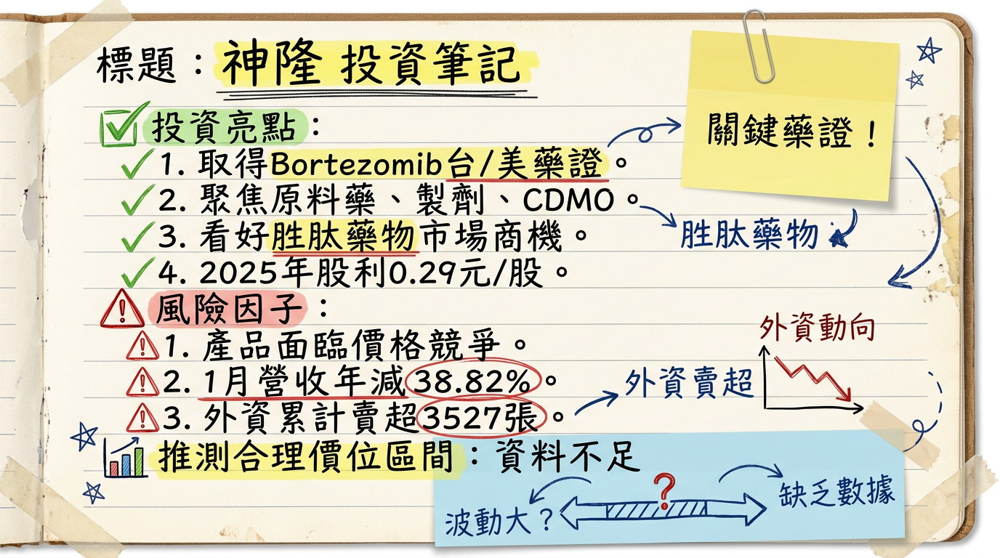

# 1789 神隆 深度研究報告

## 一句話摘要

神隆（1789）作為國際性原料藥與製劑CDMO公司，正積極轉型並聚焦高技術門檻產品。儘管短期受市場競爭與匯率波動影響，2025年前三季營收與獲利承壓，然隨著成功取得台灣首例多發性硬化症藥物 Glatiramer Acetate Injection 的美國製劑藥證，並預計於2026年第二季在美國上市，結合糖尿病/減重胜肽藥物布局與 CDMO 業務穩定發展，有望為公司帶來顯著的長期成長動能。

## 公司概覽

神隆（1789）是一家國際性的原料藥公司，主要提供原料藥、中間體的開發與製造服務，以及針劑製劑和委託研製 (CDMO) 服務。

**1. 公司核心業務與產品線：**

*   **自有原料藥 (Proprietary API)：** 主要供應學名藥廠，產品以抗癌藥物為大宗（2025年前三季有43項），也開發中樞神經、腸胃類等原料藥。截至2025年上半年，已完成79項產品開發與藥事主檔案（DMF）註冊，其中37個品項已支持客戶取得藥證上市銷售。
*   **自有製劑 (Proprietary Formulations)：** 聚焦高價值、高技術門檻的藥械組合產品，鎖定癌症、血液疾病、代謝疾病及中樞神經等領域。
    *   **Glatiramer Acetate Injection：** 成功取得多發性硬化症（MS）治療藥物 Glatiramer Acetate Injection 的美國製劑藥證（2026年1月），預計2026年第二季透過銷售夥伴在美國開賣，目標搶攻美國每年7.1億美元的市場商機。
    *   **Bortezomib：** 成功取得多發性骨髓瘤治療藥物 Bortezomib 的台灣藥證（2026年1月），已於2023年取得美國FDA藥證。
    *   **其他針劑：** 數項治療糖尿病、骨質疏鬆症的針劑產品已送件美國FDA審查，目標於2026年取得藥證。
*   **委託研製 (CDMO)：** 為新藥客戶提供從原料藥到製劑的一條龍服務。專長領域包括胜肽、類固醇及細胞毒性產品。2025年成功取得3項新原料藥專案，涵蓋癌症、腎臟病及肌少症等領域。

**2. 營收結構 (2025年前三季)：**

| 業務類型          | 營收佔比 |
| :---------------- | :------- |
| 自有原料藥        | 約 70%   |
| 委託研製 (CDMO)   | 約 30%   |
| 自有製劑業務      | 0% (尚未達授權收入里程碑) |

| 適應症類別        | 營收佔比 |
| :---------------- | :------- |
| 癌症用藥          | 約 66%   |
| 中樞神經用藥      | 約 23%   |
| 其他              | 約 11%   |

**3. 製造基地：**

*   **台灣臺南廠：** 針劑廠的兩條產線（西林瓶與卡式瓶）皆已通過美國FDA實地查核。
*   **中國大陸江蘇常熟廠：** 6項原料藥產品通過中國CGMP符合性檢查，配合客戶進行量產出貨。

## 核心競爭優勢

1.  **高技術門檻製劑開發實力：** 成功開發並取得美國多發性硬化症 Glatiramer Acetate Injection 學名藥藥證，證明其在高複雜度針劑產品的研發與製造能力，此藥被視為全球最具挑戰性的學名藥之一。
2.  **多元且深化的產品組合：** 自有原料藥產品線豐富（79項開發，43項癌症用藥），並積極布局高價值、高技術門檻的針劑製劑，如胜肽類（GLP-1藥物潛力）、類固醇及細胞毒性產品。
3.  **一站式 CDMO 服務：** 能提供從原料藥到製劑的一站式委託研製服務，深化與客戶的合作關係，降低客戶供應鏈風險。
4.  **國際級品質與合規能力：** 台灣針劑廠通過美國FDA實地查核，常熟廠原料藥亦通過中國CGMP檢查，符合國際規範標準，為拓展全球市場提供品質保證。
5.  **地理優勢與供應鏈韌性：** 在全球供應鏈重組趨勢下，台灣作為高階製造樞紐的地位提升，神隆有望受惠於客戶供應鏈多元化需求。

## 財務分析

### 月營收趨勢

| 月份   | 金額 (新台幣億元) | 月增率 MoM | 年增率 YoY |
| :----- | :---------------- | :--------- | :--------- |
| 2026年01月 | 1.27              | -73.98%    | -38.82%    |
| 2025年12月 | 4.88              | +133.53%   | -17.96%    |
| 2025年11月 | 2.09              | -32.70%    | -2.12%     |
| 2025年10月 | 3.11              | +75.15%    | +36.43%    |
| 2025年09月 | 1.77              | -48.54%    | -33.31%    |
| 2025年08月 | 3.45              | +72.84%    | +62.71%    |

### 季度數據 (2025年)

| 項目         | 2025年第三季 | 2025年第二季 | 2025年第一季 |
| :----------- | :----------- | :----------- | :----------- |
| 營收 (億元)  | 6.81 (預估值) | 7.53 (預估值) | 7.53 (預估值) |
| 毛利率       | 29.91%       | 42.75%       | 33.22%       |
| 營業利益率   | -2.72%       | 10.74%       | 5.86%        |
| EPS (元)     | 0.02         | 0.08 (半年報0.1元，非單季) | 0.02 (半年報0.1元，非單季) |

*註：2025年第三季營收為10-12月月營收加總，但法說會提及前三季營收為21.55億元。單季EPS僅提供Q3，Q1/Q2為半年報數據。*

### 年度趨勢

| 項目         | 2024年實際           | 2025年預估             |
| :----------- | :------------------- | :--------------------- |
| 合併營收     | 新台幣 34.06 億元    | 新台幣 31.63 億元 (累計至2025/12，YoY -7.13%) |
| 稅後淨利     | 新台幣 3.39 億元     | 新台幣 2.18 億元 (法人平均預估) |
| EPS (元)     | 0.43                 | 0.20 ~ 0.35 (法人平均預估) |

## 法說會重點

**日期：** 2025年12月11日 (線上法人說明會)

**管理層發言與具體 Guidance：**

*   **2025年前三季營運：** 合併營收新台幣21.55億元，較去年同期減少9%；稅後淨利新台幣9,600萬元，每股盈餘(EPS)為0.12元。營收下滑主因自有原料藥業務中，部分癌症及阿茲海默症用藥受市場需求與價格競爭影響。
*   **自有原料藥 (Proprietary API)：**
    *   佔2025年前三季營收約70%。
    *   產品組合擴大至79項，其中43項為癌症用藥。
    *   預計在2025年至2026年間再完成2至3項產品開發。
    *   全球藥事主檔案(DMF)註冊達976項，其中美國佔70項。
    *   將透過品質與價格優勢鞏固利基產品市場，並與客戶合作拓展中國、歐洲、南美等新興市場。
*   **自有製劑 (Proprietary Formulations)：**
    *   目前有4項產品已取得美國藥證，另有3項在美國、2項在臺灣申請藥證審查中。
    *   產品線鎖定高技術門檻的針劑，包括治療多發性硬化症的預充填針、以及治療糖尿病、骨質疏鬆症的注射筆產品，目標在2026年取得美國藥證。
    *   公司將加速自有製劑產品在美國的取證工作。
    *   計畫於2026年遞交更多糖尿病與減重用藥的美國藥證申請。
    *   規劃於2026年起，啟動自有針劑產品在加拿大、歐洲及巴西等國家的註冊工作，以擴大全球製劑市場佈局。
*   **委託研製 (CDMO)：**
    *   佔2025年前三季營收約30%，呈現穩定成長。
    *   已執行超過200個專案，其中14項產品已獲批上市，4項處於臨床三期。
    *   2025年成功取得3項新原料藥專案，目前在線專案共55個。
*   **產能利用率、資本支出：** 未找到2025-2026年具體產能利用率及資本支出金額資料。

## 券商觀點

目前公開資料未找到具體券商於2025-2026年發布的目標價與評等。
Fintel 預估台灣神隆醫藥股份有限公司在2026年的年度收入為3,689百萬，預測年度每股盈利為0.41元。Fintel 預估2027年2月4日的股價為27.03美元，此價格應為特定市場的股價或預估價格，與台灣上市股價單位不同。

**2025-2026年 EPS 預估：**

*   **2025年：** 法人機構平均預估年度EPS將落在0.2至0.35元之間。
*   **2026年：** Fintel 預估2026年12月31日的季度EPS為0.26元；年度EPS為0.41元。

**評等趨勢：**

根據Fintel的評級趨勢顯示（截至2026年2月1日）：

*   強力買入：2個
*   買入：4個
*   暫時持有：2個
*   賣出：0個
*   強力賣出：0個

## 財報深度分析

### 利潤率趨勢 (近8季)

| 季度       | 毛利率   | 營業利益率 | 稅後淨利率 |
| :--------- | :------- | :--------- | :--------- |
| 2025年第三季 | 29.91%   | -2.72%     | 2.14%      |
| 2025年第二季 | 42.75%   | 10.74%     | 4.58%      |
| 2025年第一季 | 33.22%   | 5.86%      | 6.71%      |
| 2024年第四季 | 36.39%   | 6.39%      | 9.39%      |
| 2024年第三季 | 38.52%   | 4.40%      | 3.74%      |
| 2024年第二季 | 38.14%   | 9.33%      | 9.82%      |
| 2024年第一季 | 40.00%   | 17.19%     | 15.85%     |
| 2024年全年   | 38.20%   | 9.42%      | N/A        |

**利潤率變化原因分析：**
神隆的利潤率在2025年呈現波動且整體下滑趨勢。尤其2025年第三季，營業利益率轉為負值-2.72%，稅後淨利率也降至2.14%，反映出營運面臨壓力。2025年上半年營運受自有原料藥客戶需求延遲、CDMO客戶產品銷售放緩及新台幣大幅升值產生匯兌損失等因素影響，導致獲利顯著衰退（2025年上半年稅後純益年減63%）。業外收支波動較大（2025年Q3佔營收5.38%，Q2為-4.49%），對淨利率亦有影響。

### 存貨分析

目前公開資料未找到神隆近4季存貨金額、存貨週轉天數、應收帳款週轉天數的具體數據，也未提及存貨是否有異常堆積或備料現象。

### 資本支出

目前公開資料未提供神隆近3年（2024-2026）具體的資本支出金額與折舊攤銷數據。然而，公司持續投資製劑及委託研製業務，並提升自有原料藥產能彈性。針劑廠完成調劑擴充後，能提供原料、調劑到充填的一站式服務。

## 股權異動

*   **董監事/大股東申報轉讓：** 未找到2024-2026年相關紀錄。
*   **庫藏股買回：** 未找到2024-2026年相關紀錄。
*   **可轉換公司債 (CB)：** 未找到2024-2026年相關發行及轉換價格資訊。
*   **增減資計畫：** 未找到2024-2026年相關計畫。

**股利政策：**
董事會決議2025年度盈餘分配現金股利每股0.29元。

## 產業分析

### 全球市場規模與 CAGR 成長率

| 市場類別                      | 2025年市場規模 (預估) | 2026年市場規模 (預估) | 2026-2035年 CAGR (預估) |
| :---------------------------- | :-------------------- | :-------------------- | :---------------------- |
| 原料藥 (API)                  | 2452.6億美元          | 2612.8億美元          | 7.26% (至2034年)        |
| 醫藥 CDMO (整體)              | 2146.9億美元          | 1602.4億美元          | 7.7%                    |
| 醫藥 CDMO (Fortune預測)       | 2550.1億美元          | N/A                   | 9.90% (至2034年)        |
| 生物製劑 CDMO                 | 210.2億美元           | 235.4億美元           | 13.3%                   |
| 無菌注射劑 CDMO               | 66.5億美元            | 73.6億美元            | 10.7%                   |

### 供需狀況

*   **原料藥市場：** 面臨供應鏈風險和價格壓力，仿製藥競爭激烈。但人口老齡化、新興市場崛起、生物製劑發展和創新技術應用帶來新動力。COVID-19後，各國視原料藥為戰略產業，促使供應鏈重組。
*   **CDMO市場：** 製藥開發日益複雜化、成本效益需求增加，推動CDMO成長。新藥批准增加，中小製藥公司缺乏製造能力，加速CDMO新技術導入。無菌注射劑CDMO因基礎設施缺乏而需求強勁。GLP-1藥物市場產能私有化趨勢加劇無菌針劑灌裝短缺。

### 產業的平均毛利率水準

*   **原料藥板塊：** 2024年為38%，較去年同期提升1.58個百分點。2025年第一季度同比略有提升。
*   **小分子CDMO業務：** 凱萊英公司2025年上半年毛利率為47.8%，同比上升0.6個百分點。

### 競爭格局

由於API及CDMO市場細分眾多，以下列出在相關市場被提及的領先企業：

| 公司名稱                     | 主要市場/業務範圍                                                                |
| :--------------------------- | :------------------------------------------------------------------------------- |
| Lonza Group Ltd              | 生物製劑CDMO、無菌注射劑CDMO、CDMO                                               |
| Samsung Biologics Co Ltd     | 生物製劑CDMO                                                                     |
| WuXi Biologics Cayman Inc    | 生物製劑CDMO、CDMO                                                               |
| Catalent Inc                 | 生物製劑CDMO (已被Novo Nordisk收購以加劇產能私有化趨勢)                          |
| Thermo Fisher Scientific Inc | 生物製劑CDMO、無菌注射劑CDMO、CDMO                                               |
| Pfizer Inc.                  | 無菌注射劑CDMO (主要為自身產品，也提供CDMO服務)                                  |
| Boehringer Ingelheim         | 無菌注射劑CDMO                                                                   |
| Fresenius Kabi AG            | 無菌注射劑CDMO                                                                   |
| WuXi Apptec                  | CDMO (小分子)                                                                    |
| AbbVie, Inc.                 | CDMO                                                                             |

**神隆 vs 主要競爭對手的具體比較：**
目前尚無直接公開資料能提供神隆與上述全球主要競爭對手在技術、產能、客戶和價格方面的詳細比較數據。然而，神隆在高技術門檻製劑（如 Glatiramer Acetate Injection）和特定利基原料藥方面具備優勢，並能提供一站式CDMO服務。相較於全球巨頭，神隆的規模可能較小，但在「批次量小或需要特殊製程的原料藥」方面，台灣業者能以「專業技術和靈活的生產能力」應對市場需求，其競爭力來自於品質、技術和服務附加價值，而非規模成本。

**台灣同業比較：**
台灣CDMO/原料藥領域的同業包括：

*   **保瑞 (6472)：** 被稱為「製藥界的台積電」，純CDMO公司，橫跨大小分子一站式CDMO，擁有台灣最大產能。
*   **台康生技 (6589)：** 生物相似藥兼CDMO廠商，提供一站式藥品開發與商業化生產服務。
*   **永昕生醫 (4726)：** 生物相似藥兼CDMO廠商，積極擴展CDMO業務與新廠房。
*   **北極星藥業 (6550)：** 新藥研發兼CDMO。

由於上述公司業務範圍、產品組合及發展階段有所差異，且缺乏2024-2026年最新可直接對比的營收規模、毛利率及EPS數據，難以進行精確量化比較。

### 產業趨勢

1.  **生物製劑、細胞與基因療法 (CGT) 與抗體藥物複合體 (ADC) 的高速發展：**
    *   **影響：** 推動CDMO業務從傳統小分子製藥擴展至高技術門檻領域，促使產業向全方位研製平台轉型。生物製劑CDMO市場將高速成長，要求廠商具備更專業技術、靈活生產與嚴格品管。
2.  **綠色生產、永續性與數位化轉型：**
    *   **影響：** 國際市場對產品碳排放與永續生產標準提高，低碳產品更具競爭力。AI與數位化技術應用於工藝優化、質量監控，可降低生產成本20%-30%，並透過數位孿生技術縮短技術轉移時間。永續與數位化成為未來藥廠的「執照」。
3.  **地緣政治與供應鏈重組：**
    *   **影響：** 美中貿易摩擦、生物安全法案等地緣政治因素，促使跨國藥廠尋求中國以外製造基地，加速全球產能向亞太地區轉移。台灣有機會成為「亞洲的高階、可信賴製造樞紐」，爭取高附加價值訂單。

### 對神隆而言的具體機會和威脅

*   **機會：**
    *   **產品組合契合趨勢：** 主力抗癌藥物原料藥與高技術門檻針劑製劑，均為CDMO及製藥市場的快速成長點。
    *   **專利懸崖紅利：** 2024-2028年專利到期藥品將釋放大量學名藥替代機會，有利於神隆的學名藥原料藥業務。
    *   **台灣產業定位優勢：** 全球供應鏈重組下，台灣作為高階製造與CDMO樞紐的地位，可獲政策支持並爭取高附加價值訂單。
    *   **高技術門檻製劑成功：** Glatiramer Acetate Injection 美國藥證的取得，證明其研發與製造實力，有助於提升國際競爭力與合作機會。
    *   **GLP-1 胜肽藥物布局：** 成功搭上糖尿病與肥胖症治療領域的爆發性成長趨勢。
*   **威脅：**
    *   **全球市場競爭加劇：** 國際大型CDMO巨頭擴大產能，亞洲市場品質要求提高，競爭激烈。
    *   **價格壓力：** 仿製藥市場持續面臨價格競爭。
    *   **法規與環境要求：** 國際對碳排放與永續生產標準提高，需持續投入符合規範。
    *   **人才爭奪：** 產業轉型需要跨域專業人才，人才稀缺可能成為發展瓶頸。
    *   **匯率波動與政經不確定性：** 影響外銷型企業的獲利表現。

### 相關投資題材

*   **AI (人工智慧)：**
    *   AI技術在製藥產業的工藝優化、質量監控、大數據分析預測市場需求等方面應用日益廣泛。神隆可藉由導入AI提升生產效率、降低成本、優化CDMO服務精準度，並實現智能化管理。
*   **HBM (高頻寬記憶體)、電動車等：**
    *   目前沒有直接公開資訊顯示HBM、電動車等產業與神隆或其所在原料藥/CDMO產業有直接投資題材連結。

## 近期催化劑

### 利多事件清單

*   **2026年01月06日：** 成功取得多發性硬化症（MS）治療藥物 Glatiramer Acetate Injection 美國製劑藥證，為台灣首家達成此里程碑的企業。預計於2026年第二季透過銷售夥伴在美國開賣，將可搶攻每年7.1億美元（約新台幣223億元）的藥物市場商機。
*   **2026年01月21日：** 成功取得多發性骨髓瘤治療藥物 Bortezomib 台灣藥證，並將積極提交健保給付申請。
*   **2025年09月12日：** 8月營收衝上新台幣3.45億元，月增率達72.8%，年增率達62.7%，創當年最佳表現，主要受代客研製的治阿茲海默症新藥訂單貢獻。
*   **2025年09月：** 在台灣送出抗癌藥物及糖尿病代謝藥物的藥證申請，預計最快可於2026年上半年取證。
*   **GLP-1胜肽藥物布局：** 積極布局GLP-1胜肽藥物，搭上糖尿病與肥胖症治療市場的爆發性成長趨勢。
*   **CDMO 業務擴展：** 2025年成功取得3項新原料藥專案，目前在線專案共55個，CDMO業務穩定成長。

### 利空事件清單

*   **2026年01月營收表現：** 2026年1月合併營收為新台幣1.27億元，月減73.99%，年減38.82%，為2019年5月以來新低。
*   **2025年前三季營收與獲利下滑：** 2025年前三季合併營收新台幣21.55億元，較去年同期減少9%；稅後淨利新台幣9,600萬元，每股盈餘(EPS)為0.12元。營收下滑主受自有原料藥部分癌症及阿茲海默症用藥受市場需求與價格競爭影響。
*   **子公司營運放緩：** 神隆常熟廠受到委託研製客戶產品銷售放緩影響，營收低於預期（2025年上半年）。
*   **匯率波動：** 新台幣對美元大幅升值產生匯兌損失，影響獲利（2025年上半年）。
*   **自有製劑業務短期無收入貢獻：** 尚未達成授權收入的里程碑條件，2025年上半年無相關收入貢獻。
*   **外資賣超：** 2026年累計至2026/03/04，外資累計賣超3,527張。

## ⭐ 成長動能時間軸

*   **2025年3月：** 國際合作計畫推進，有機會帶來新客戶與市場。
*   **2025年8月：** 自有原料藥部分，聚焦強化產能，優化產銷與提升產能利用率。
*   **2025年9月：** 代客研製阿茲海默症新藥訂單貢獻，帶動營收成長。
*   **2025年Q2：** 糖尿病注射劑產品完成美國FDA回覆工作，力拚2025年底至2026年初取得藥證。
*   **2025年：** 成功取得3項新原料藥CDMO專案（癌症、腎臟病、肌少症），持續擴展CDMO業務。
*   **2025年至2026年間：** 自有原料藥業務預計再完成2至3項產品開發。
*   **2026年1月06日：** **關鍵里程碑** 取得多發性硬化症藥物 Glatiramer Acetate Injection 美國製劑藥證。
*   **2026年1月21日：** 取得多發性骨髓瘤治療藥物 Bortezomib 台灣藥證。
*   **2026年Q2：** Glatiramer Acetate Injection 預計透過銷售夥伴在美國開賣，搶攻每年7.1億美元市場。
*   **2026年上半年：** 台灣遞交的抗癌與代謝用藥證申請，預計獲准上市並爭取納入健保給付。
*   **22026年起：** 啟動自有針劑產品在加拿大、歐洲及巴西等非美國市場的註冊工作，擴大全球製劑市場佈局。
*   **持續布局：** GLP-1胜肽藥物市場的巨大潛力，有望成為未來重要成長引擎。
*   **長期產能優化：** 針劑廠完成調劑擴充，能提供原料、調劑到充填一站式服務。

## 2026 展望

### 成長動能

1.  **美國製劑市場爆發：** Glatiramer Acetate Injection 於2026年第二季在美國上市，有望搶佔每年7.1億美元的巨大市場，成為營收和獲利關鍵成長來源。此外，多項糖尿病、骨質疏鬆症針劑藥物目標2026年取得美國藥證。
2.  **GLP-1 胜肽藥物趨勢：** 全力布局 GLP-1 胜肽藥物，搭上治療糖尿病與肥胖症的百億美元級市場，預期未來成長空間可期。
3.  **自有原料藥持續開發：** 預計2025-2026年間再完成2-3項產品開發，鞏固利基產品市場，並拓展新興市場。
4.  **CDMO 業務穩健成長：** 積極取得新專案，強化胜肽、類固醇與細胞毒性藥物的技術優勢，深化CDMO平台競爭力，中國市場的CDMO業務亦具潛力。
5.  **全球市場多元化：** 規劃於2026年起啟動自有針劑產品在加拿大、歐洲及巴西等國家的註冊工作，降低對單一市場的依賴。

### 風險因子

1.  **市場價格競爭：** 既有自有原料藥產品仍面臨激烈的價格競爭，對毛利率造成壓力。
2.  **客戶需求波動：** 自有原料藥與CDMO客戶需求可能存在不確定性或延遲，影響短期營收貢獻。
3.  **新藥證上市進度：** 新取得藥證的產品（如 Glatiramer Acetate Injection）的市場接受度、銷售夥伴推廣成效及實際營收貢獻仍需觀察。
4.  **匯率波動風險：** 以美元計價的外銷業務，易受新台幣對美元匯率波動影響，產生匯兌損益，壓縮利潤。
5.  **法規與地緣政治不確定性：** 國際藥品法規變化、關稅議題及全球政經局勢的不確定性，可能對供應鏈及營運造成潛在影響。
6.  **授權收入里程碑：** 自有製劑業務的授權收入仍需達成特定里程碑條件才能實現，短期內貢獻有限。

## 投資結論

神隆（1789）正處於從傳統原料藥供應商轉型為高價值製劑與CDMO服務提供商的關鍵時期。儘管短期內面臨營收與獲利壓力，但多項新藥證的取得與市場布局，為其長期成長奠定了堅實基礎。

1.  **高技術門檻製劑成功突破：** Glatiramer Acetate Injection 美國藥證的取得，是公司製劑業務的重大里程碑，預計2026年第二季開始貢獻營收，其每年7.1億美元的美國市場潛力有望顯著提升公司營運規模與獲利能力。這是神隆估值重估的關鍵催化劑。
2.  **GLP-1 市場潛力巨大：** 公司積極布局 GLP-1 胜肽藥物，瞄準糖尿病與肥胖症市場的爆發性成長，若能成功切入此領域，將為未來長期成長提供強大動能。
3.  **CDMO 業務穩健發展提供基石：** 委託研製業務的穩定成長和新專案的持續取得，為公司營收提供相對穩定的基本盤，並能發揮技術優勢與一站式服務的綜效。
4.  **短期壓力與長期轉型：** 2025年獲利衰退，2026年1月營收表現不佳，顯示公司仍需時間消化市場競爭與匯率衝擊。然而，管理層積極加速產品取證、拓展多元市場的策略，有助於逐步擺脫低毛利競爭，轉向高附加價值產品。

考量到 2026年 Fintel 預估 EPS 為 0.41元，以及Glaticamer Acetate Injection 等高價值產品上市所帶來的再評價空間，若以產業中具備特殊技術門檻與成長性的CDMO/學名藥公司給予合理本益比區間 (例如25-35倍)，保守預估目標價區間為 **新台幣 10.25元 至 14.35元**。若新產品銷售優於預期或GLP-1布局展現明確成果，則有望上修。

**目標價區間建議：新台幣 10.25元 - 14.35元**
（基於2026年預估EPS 0.41元，乘上25x-35x本益比推估）

本報告由 AI 自動產生，資料來源為公開網路資訊，僅供參考，不構成投資建議。產生時間：2026-03-06 00:25

---

## 📊 資訊卡

