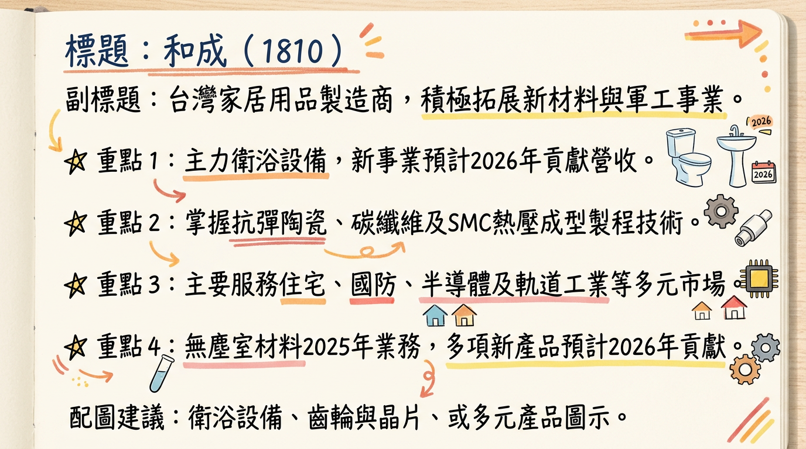
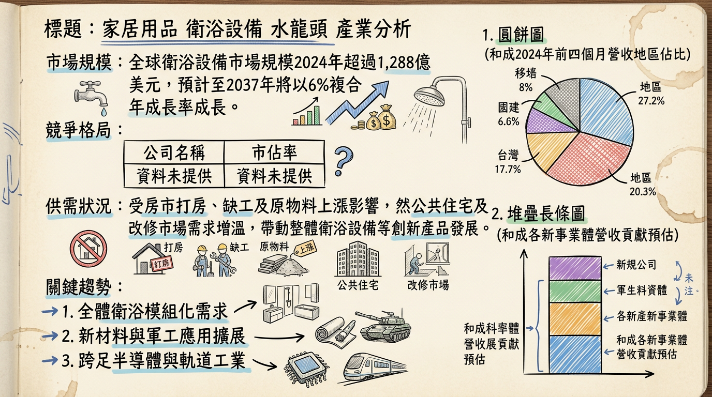
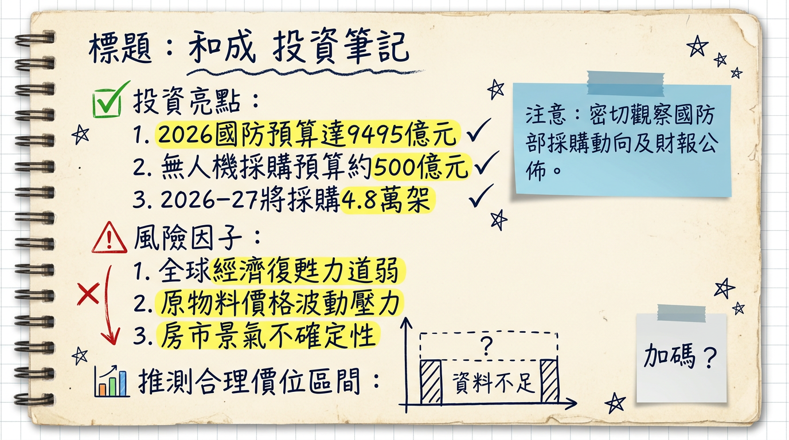

# 1810 和成 深度研究報告

## 一句話摘要
和成正從傳統衛浴設備製造商積極轉型，儘管2025年本業營運受房市逆風與成本壓力挑戰，獲利呈現下滑，但預期2026年起，抗彈陶瓷、無人機及SMC無塵室格子樑等高附加價值新事業將逐步放量貢獻營收，並受惠於台灣國防預算大幅提升與半導體供應鏈需求，有望驅動公司營運重返成長軌道，實現多元化效益。

## 公司概覽
和成（1810）是一家台灣歷史悠久的家居用品製造商，核心業務為衛浴設備，近年來積極佈局高科技新材料、軍工及無人機等多元化事業，以應對市場變遷並尋求新的成長引擎。

**核心產品與服務：**
*   **衛浴設備：** 各式馬桶、水箱、臉盆、小便斗、浴缸（SMC浴缸、按摩浴缸）、淋浴拉門、各式龍頭（普通、單把手、高級藝術、恆溫）、免治馬桶座等。
*   **整體衛浴設備：** 針對改修市場、公共住宅、醫美中心等需求，具固定尺寸與客製化特性，預計**2026年**有營收貢獻。
*   **新材料與高科技產品：**
    *   **抗彈陶瓷及碳纖維材料：** 應用於國防工業，預計抗彈陶瓷將於**2026年**放量出貨。
    *   **無人機：** 預期**2026年**會有營收產生。
    *   **SMC/熱壓成型製程無塵室格子樑：** 於**2025年**加入的新業務，主要提供給半導體廠的無塵室使用，預期**2026年**有營收貢獻。
    *   **軌道工業相關產品：** 如無鉛集電弓接觸片、煞車卡鉗、水泥座與軌道座絕緣板組合等新品，預估**2026年**有成果回收。
*   **其他：** 廚具、浴室配件、馬桶蓋、科材等。

**營收結構：**
由於未有最新各業務佔營收比例資料，參考2023年與2024年法說會地區佔比。

| 產品線       | 營收比重 (2023年) | 備註                                       |
| :----------- | :---------------- | :----------------------------------------- |
| 衛生瓷器     | 38.0%             | 傳統衛浴主力產品                           |
| 其他營運事業 | 29.5%             | 包含部分新材料與其他產品，詳細分類不明     |
| 給水銅器     | 18.4%             | 水龍頭等產品                               |
| **總計**     | **85.9%**         | (未列出所有業務，其餘應為零星或歸類於其他) |

**地區營收佔比 (2024年前三季)：**

| 地區   | 營收佔比 (2024年前三季) | 備註                           |
| :----- | :---------------------- | :----------------------------- |
| 台灣   | 76.4%                   | 主要市場與生產據點             |
| 菲律賓 | 18.39%                  | 重要海外市場                   |
| 中國   | 4.91%                   | 較去年底5.6%下滑，受打房政策影響 |

## 核心競爭優勢
1.  **多元化轉型策略：** 和成不再僅限於傳統衛浴，積極將核心材料技術延伸至軍工（抗彈陶瓷、碳纖維）、半導體（無塵室格子樑）及軌道工業，有效分散單一產業風險，並擁抱高成長新興領域。
2.  **關鍵材料技術自主：** 在精密陶瓷與複合材料領域具備深厚技術積累，使其能自主開發高階抗彈陶瓷與碳纖維材料，符合國防自主與非紅供應鏈趨勢。
3.  **整體衛浴解決方案：** 針對台灣建築業缺工痛點，推出固定尺寸且可客製化的整體衛浴設備，結合日本普利司通專業工法，有效縮短工期、節省人力，鎖定公共住宅與改修市場，具高度市場潛力。
4.  **軍工政策受惠者：** 台灣國防預算持續創新高，大規模無人機採購案與國艦國造、國車國造等政策，使和成作為本土軍工材料供應商獲得優先機會。

## 財務分析

### 月營收趨勢
| 月份 (年/月) | 金額 (億元) | 月增率 (MoM) | 年增率 (YoY) |
| :----------- | :---------- | :----------- | :----------- |
| 2026/01      | 3.87        | -5.62%       | 12.89%       |
| 2025/12      | 4.11        | 12.33%       | -10.61%      |
| 2025/11      | 3.65        | 4.61%        | -13.15%      |
| 2025/10      | 3.49        | 4.05%        | -16.01%      |
| 2025/09      | 3.36        | 2.30%        | -10.19%      |
| 2025/08      | 3.28        | -18.69%      | -15.03%      |

**分析：** 2025年下半年營收表現相對疲軟，多數月份呈現年減，顯示衛浴本業仍面臨壓力。然而，2026年1月營收重回年增12.89%，可能暗示部分新業務或傳統業務需求開始回溫，值得後續觀察。

### 季度數據
*   **2025年第三季 (2025Q3)：**
    *   季營收：新台幣 10.58億元 (累計2025年1月至9月營收約34.49億元)
    *   稅後淨利：新台幣 1,101.2萬元
    *   EPS：0.03元 (季減57.1%，年減77.46%)

*   **2024年第四季 (2024Q4)：**
    *   季營收：新台幣 12.9757億元
    *   毛利率：24.72%
    *   EPS：0元

**分析：** 2025年第三季EPS顯著下滑，反映衛浴本業面臨的挑戰及營運效率的壓力。儘管未提供2025Q3毛利率與營業利益率，但稅後淨利的大幅年減顯示整體獲利能力承壓。

### 年度趨勢
*   **2024年實際：**
    *   營收：新台幣 48.5695億元
    *   EPS：0.19元
*   **2025年預估：**
    *   全年營收：約新台幣 45.74億元 (累計至2025年12月實際營收)
    *   EPS：截至2025年第三季，累計EPS為 0.04元。目前未有2025年全年預估EPS的確切數字。

**分析：** 2025年全年營收預估較2024年小幅下滑5.8%，EPS截至Q3亦大幅衰退，顯示公司在2025年處於獲利轉型的低谷。2026年新事業的量產與獲利貢獻，將是決定營運能否反轉的關鍵。

## 法說會重點
**最近一次法說會日期：** 2024年11月20日 (線上法說會)
(請留意，和成將於2026年3月10日召開董事會提報2025年度財務報告，這非法人說明會)

**管理層發言與具體 Guidance (2024年11月20日)：**
*   **營運挑戰：** 受中國與台灣打房因素影響，加上國內缺工及原物料上漲，導致營運承壓。
*   **2024年營運展望：** 預估2024年第四季營運與第三季持平。公司力拚全年營業淨利轉盈，主要依靠業外收入如利息、租金、權利金等貢獻。
*   **2025年展望：** 對於2025年持「審慎樂觀」態度。
*   **產品線重點：** 2024年第四季主力產品是「整體衛浴設備」，適用於改修市場、公共住宅、醫美中心等，並將是2025年的重點產品。
*   **抗彈陶瓷：** 外界關注的抗彈陶瓷在2024年是部分出貨，預估2025年與2024年持平，**出貨最高峰預計落在2026年**。
*   **地區營收佔比：** 2024年前三季營收占比為台灣76.4%、中國4.91%（較去年底5.6%下滑）、菲律賓18.39%。

**產能利用率與資本支出：**
*   法說會中未提供2024年以後的具體產能利用率數據。
*   **2025年資本支出：** 預計約新台幣2.9億元，主要用於購置機器設備及廠房興建。
*   未提供2026年具體的資本支出計畫與預計新增產能的最新資料。

## 券商觀點
目前搜尋結果中未找到2025-2026年針對和成(1810)的具體券商研究報告或目標價。僅有歷史新聞提及短線技術支撐與目標區，但並非正式券商評等。

| 券商名稱 | 目標價 (新台幣) | 評等 | 日期       | 備註             |
| :------- | :-------------- | :--- | :--------- | :--------------- |
| **未有** | **無**          | **無** | **無**     | **無正式報告**   |

**EPS 預估：**
目前未找到2025-2026年來自券商的EPS預估數字。

**評等異動：**
目前未找到2025-2026年和成(1810)有重大調升/調降評等的資訊。

## 財報深度分析

### 利潤率趨勢
| 季度   | 毛利率（%） | 營業利益率（%） | 稅後淨利率（%） |
| :----- | :---------- | :-------------- | :---------- |
| 2025Q3 | 25.86       | -1.79           | 1.04        |
| 2025Q2 | 26.66       | 1.32            | 2.39        |
| 2025Q1 | 24.57       | -2.86           | -2.42       |
| 2024Q4 | 24.72       | 0.22            | 0.21        |
| 2024Q3 | 26.02       | 0.55            | 4.20        |
| 2024Q2 | 25.37       | 1.17            | 2.11        |
| 2024Q1 | 23.56       | -1.93           | -1.50       |

**利潤率變化分析：**
和成的毛利率在過去八個季度中大致維持在24%至27%之間波動，顯示其產品成本結構相對穩定。然而，營業利益率和稅後淨利率波動劇烈，2025年第一季和第三季甚至出現負營業利益率，凸顯營運費用控管的壓力以及營收規模不足以有效分攤固定成本的問題。2025年第三季毛利率維持25.86%水準，但營業利益率卻轉為-1.79%，稅後淨利率僅1.04%，單季稅後淨利年增率更大幅滑落至-77.46%，表明本業獲利能力顯著下滑。部分原因可能來自於傳統衛浴本業受房市與成本因素影響，加上新事業尚未達到規模經濟。

### 存貨分析
| 季度   | 存貨金額 (億元) | 存貨週轉天數 (天) | 應收帳款週轉天數 (天) |
| :----- | :-------------- | :---------------- | :-------------------- |
| 2025Q3 | 25.6            | 202.66            | 88.07                 |
| 2025Q2 | 26.2            | 191.07            | 78.48                 |
| 2025Q1 | 26.2            | 191.64            | 82.25                 |
| 2024Q4 | 26.6            | 206.35            | 86.84                 |

**分析：** 存貨金額在2024年第四季達26.6億元後，至2025年第三季略降至25.6億元，但整體而言仍處於相對高水位。存貨週轉天數在2024年第四季至2025年第三季之間維持在約190至200天，顯示存貨去化速度較慢，可能暗示公司面臨一定的存貨管理壓力或因應未來新業務需求進行備料。應收帳款週轉天數則在78至88天間波動，顯示應收帳款回收效率略有起伏。

### 資本支出與折舊攤銷
*   **近3年資本支出：**
    *   2024年：新台幣 4.23億元
    *   2023年：新台幣 4.09億元
    *   2025年預計：新台幣 2.9億元 (主要用於購置機器設備及廠房興建)
    *   目前未找到2026年具體的資本支出計畫。

*   **折舊攤銷趨勢：**
    *   2025Q3：新台幣 7,419.6萬元
    *   2025Q2：新台幣 7,358.5萬元
    *   2025Q1：新台幣 7,477.5萬元
    *   2024Q4：新台幣 7,058.4萬元
    *   折舊攤銷金額在2024年至2025年第三季呈現相對穩定，單季大致維持在7,000萬至7,500萬新台幣之間。

### 其他財報重點
*   **負債比率：** 2025Q3為47.96%，2024Q4為48.09%，顯示公司負債比率維持在相對穩定的水平，財務結構尚稱穩健。
*   **業外收支：** 業外收支對和成的稅前淨利率有顯著影響。例如2024Q3在營業利益率僅0.55%下，稅前淨利率達5.06%，主要歸因於業外收入貢獻。2025Q3業外收支佔營收比重為3.03%。公司常透過利息、租金、權利金等業外收入彌補本業獲利不足。
*   **自由現金流量與淨負債/EBITDA：** 目前未找到2024-2026年最新的自由現金流量與淨負債/EBITDA數據。

## 股權異動
*   **董監事/大股東申報轉讓紀錄：** 未找到2025-2026年和成董監事/大股東申報轉讓的最新公開紀錄。
*   **庫藏股買回紀錄：** 和成在2024年及2025年皆無實施庫藏股。未找到2026年最新紀錄。
*   **可轉換公司債 (CB)：** 未找到2025-2026年和成發行可轉換公司債的最新公開紀錄。
*   **現金增資或減資計畫：** 未找到2025-2026年和成現金增資或減資的最新公開計畫。
*   **股利政策：** 和成在2024年並未發放股利。未找到2025年或2026年最新的股利政策或發放紀錄。

## 產業分析

### 市場規模與成長率 (CAGR)
| 產業              | 2024年市場規模 (預估)     | 2026年市場規模 (預估)     | CAGR (預估) |
| :---------------- | :------------------------ | :------------------------ | :---------- |
| **衛浴設備 (全球)** | 1,288億美元               | 1,369.9億美元 (2025年)    | 6.1% (至2037年) |
| **衛浴潔具 (全球)** | 343億美元                 | 1,034億美元               | 4.7% (2026-2035) |
| **無人機 (全球)**   | 306億美元 (2022年實際)    | 預計2030年達558億美元     | 7.8% (至2030年) |
| **台灣國防預算**  | 新台幣 7,748億元 (2025年) | 新台幣 9,495億元 (2026年) | 22.9% (2026年YOY) |

**供需狀況：**
*   **衛浴設備：** 全球衛浴市場受城市化、老化基礎設施翻新以及對現代、環保產品需求推動。台灣產業鏈完整，智慧衛浴與高附加價值產品出口成長。
*   **軍工/無人機：** 全球地緣政治動盪與各國國防預算增加，台灣政府推動「非紅供應鏈」及大規模無人機採購（2026-2027年總量4.8萬架，預算達500-700億元），創造巨大需求。
*   **產業平均毛利率：** 和成2024年前三季毛利率為25.9%，2024年全年為24.9%。衛浴設備產業的平均毛利率未找到2024-2026年最新具體數據。

### 競爭格局
| 比較項目       | 和成 (1810)                                 | 凱撒衛 (1817)                               |
| :------------- | :------------------------------------------ | :------------------------------------------ |
| **傳統衛浴**   | 台灣市場領導品牌之一，產品線多元             | 台灣市場重要競爭者，重視衛浴設備研發與行銷 |
| **整體衛浴**   | 2024Q4與2025年主力產品，鎖定改修/公宅/醫美市場，與日本普利司通合作深化工法。 | 視為2025年新動能，投入社宅與同層排水商機。  |
| **軍工材料**   | 應用於雲豹裝甲車陶瓷裝甲、防彈陶瓷、碳纖維材料，布局國艦/車/機國造，預計**2026年**抗彈陶瓷放量。 | 未見明確軍工材料布局                       |
| **無人機**     | 預期**2026年**有營收產生                     | 未見明確無人機業務布局                     |
| **新材料應用** | 2025年加入SMC/熱壓成型無塵室格子樑供應半導體廠；軌道工業相關新品。 | 未見明確半導體/軌道工業新材料業務          |
| **2024年營收** | 約新台幣 48.5億元                            | 約新台幣 27.9億元 (創歷史新高)             |
| **2024年毛利率** | 24.9%                                       | 未提供具體數據                             |
| **2024年EPS**  | 0.19元                                      | 未提供具體數據                             |

**其他軍工概念股：** 雷虎、中光電、漢翔、長榮航太、寶一、晟田等多家公司均受惠於國防預算增加及無人機採購案，但和成具備獨特的陶瓷及複合材料技術壁壘，在軍工材料供應鏈中佔有特殊地位。

### 產業趨勢
1.  **智慧化與永續衛浴：** 消費者對智慧馬桶、節水型龍頭等高階功能與環保產品需求提升，預計全球智慧衛浴市場到2028年將超過80億美元。和成有開發環保綠色系列產品規劃。
2.  **模組化/整體衛浴：** 台灣建築業缺工問題日益嚴重，模組化、預組裝的整體衛浴因施工快速、工期短，成為市場新寵，特別在公共住宅與老屋改修市場需求增溫。和成在此領域積極佈局。
3.  **新材料應用於國防科技：** 全球地緣政治動盪推升各國國防支出，對高強度、輕量化、抗彈性等特殊材料（如精密陶瓷、碳纖維）需求激增。無人機軍備競賽更凸顯輕量化材料的重要性。這為和成的新材料事業提供巨大機會。

**對和成的具體機會和威脅：**
*   **機會：**
    *   **軍工材料放量：** 抗彈陶瓷、碳纖維及無人機業務將於2026年進入放量期，受惠於高達9,495億元的國防預算及無人機採購案。
    *   **新材料拓展：** 無塵室格子樑供應半導體廠、軌道工業產品等，進入高成長高科技產業供應鏈。
    *   **整體衛浴商機：** 應對缺工與法規更新（同層排水），公共住宅與改修市場需求可期。
*   **威脅：**
    *   **傳統衛浴本業挑戰：** 中國與台灣房市低迷、缺工及原物料上漲持續對衛浴本業營收與獲利構成壓力。
    *   **新事業貢獻需時間發酵：** 軍工等新事業目前佔比仍低，對整體營收與獲利的顯著貢獻尚待觀察。
    *   **市場競爭：** 衛浴市場競爭激烈，新材料領域也面臨技術與價格挑戰。

**相關投資題材：**
*   **軍工概念股：** 和成因防彈陶瓷、碳纖維、無人機等布局，為國防自主政策核心受惠者。
*   **新材料概念股：** 在精密陶瓷與複合材料技術上的投入，使其成為半導體與軌道工業供應鏈的潛力股。
*   **無人機概念股：** 2026年無人機營收的產生，使其受惠於台灣政府大規模無人機採購計畫。

## 近期催化劑
**今天日期：2026年03月06日**

### 利多催化劑
*   **2026年01月09日：** 因國防部無人機採購案及2026年國防預算大幅提升的軍工題材點火，和成盤中股價強勢上漲，漲幅一度達10%。
*   **2025年12月15日：** 行政院通過2026年國防支出達新台幣9,495億元，佔GDP比重3.32%創歷史新高，年增率22.9%。國防部無人機採購案總預算約500億元，預計2026年至2027年間採購總量達4.8萬架無人機，為和成帶來實質商機。
*   **22025年12月12日：** 參加台北國際建築建材暨產品展，展現重返整體衛浴市場決心，推出多項新產品並與日本普利司通合作，總經理陳世傑看好「同層排水」設計與整體衛浴商機。
*   **2026年1月營收：** 公告2026年1月合併營收為3.87億元，年增12.89%，呈現年增趨勢。
*   **法人買賣超 (2026年累計至2026/03/04)：** 外資買超+1,634 張，投信買超+843 張，自營商買超+42 張，三大法人合計買超+2,519 張，顯示法人對其未來展望持樂觀態度。

### 利空催化劑
*   **2026年03月06日：** 傳產玻璃陶瓷類股盤中承壓，和成股價呈現修正，市場擔憂全球經濟復甦力道不足以及傳產建材需求端的影響。對原物料價格波動的成本壓力、國內外房市景氣後續發展仍存在不確定性。
*   **2025年第三季財報：** EPS為0.03元，季減56%，年減75%，累計至2025年第三季EPS為0.04元，年減79%，顯示獲利能力大幅下滑。
*   **2025年8月營收：** 公告月營收3.28億元，月減18.69%，年減15.03%，顯示傳統衛浴業務仍受逆風。
*   **2025年12月營收：** 公告月營收4.11億元，年減10.61%，仍呈現年減趨勢。

## ⭐ 成長動能時間軸

| 時間點     | 成長動能                          | 具體內容                                                                                                                                                                                                                                                                                                                                                                                                  |
| :--------- | :-------------------------------- | :-------------------------------------------------------------------------------------------------------------------------------------------------------------------------------------------------------------------------------------------------------------------------------------------------------------------------------------------------------------------------------------------------------- |
| **2025年** | **新業務加入與產品推出**          | - **整體衛浴產品：** 2024Q4至2025年主力產品，推出新產品方案給總經銷，目標改修市場、公共住宅、醫美中心等。 - **SMC/熱壓成型製程無塵室格子樑：** 於2025年加入新業務，主要提供給半導體廠的無塵室使用。 - **無人機採購案第一波：** 國防部於2025年8月開出第二波徵求案，包含5款規格、共48,750架無人機，預算超過700億元，預計於2026上半年小量出貨。 |
| **2026年** | **新事業放量與成果回收**          | - **抗彈陶瓷：** 預計將放量出貨，受惠於國防預算與國艦/車/機國造需求。 - **無人機：** 預期會有營收產生，受惠於國防部500-700億元的無人機採購案，第二波無人機標案預計下半年放量。 - **SMC無塵室格子樑：** 預期將產生營收貢獻，供應半導體廠需求。 - **軌道工業相關產品：** 如無鉛集電弓接觸片、煞車卡鉗等新品，預計會有成果回收。 - **整體衛浴產品：** 預計將有營收貢獻。 |
| **需求面** | **政策與產業趨勢驅動**            | - **軍工需求：** 台灣2026年國防預算達新台幣9,495億元，年增22.9%；無人機採購總量達4.8萬架。 - **半導體產業：** 對於無塵室格子樑的需求持續。 - **建築與改修市場：** 缺工問題、建築法規更新（如「同層排水」設計）及老屋改修市場，帶動整體衛浴設備需求。                                                                                                                              |
| **擴廠計畫** | **(未找到具體擴廠資訊)**        | 目前未找到2025-2026年具體擴廠計畫、新廠地點、投資金額、預計完工/量產時間。然而，抗彈陶瓷的「放量出貨」暗示相關產能已有規劃或擴充。                                                                                                                                                                                                                                              |
| **新客戶/市場** | **國防部、半導體廠、建築建商** | - **軍工領域：** 透過防彈陶瓷、碳纖維等持續爭取國防訂單。 - **半導體市場：** 供應SMC無塵室格子樑給半導體廠。 - **衛浴市場：** 拓展公共住宅、醫美中心、改修市場的整體衛浴應用，與日本普利司通合作。                                                                                                                                                                                          |

## 2026 展望

### 成長動能
和成2026年的營運展望主要依賴其多元化轉型策略的兌現。核心成長動能來自以下幾點：
1.  **軍工事業進入收穫期：** 抗彈陶瓷預計將在2026年放量出貨，受益於台灣高達新台幣9,495億元的國防預算、高達22.9%的年增率，以及國艦國造、國車國造等重大國防計畫。此外，無人機業務預期也將在2026年產生實質營收，受惠於國防部總預算500-700億元、4.8萬架無人機的龐大採購案。
2.  **新材料應用拓寬營收來源：** 針對半導體廠的SMC/熱壓成型製程無塵室格子樑將於2026年貢獻營收，切入高成長高值化的半導體供應鏈。軌道工業相關新品如無鉛集電弓接觸片等也預計於2026年回收成果，進一步強化新材料事業的多元性。
3.  **整體衛浴解決方案增長：** 台灣建築業缺工問題持續，加上「同層排水」設計等新法規趨勢，使模組化整體衛浴設備的需求升溫。和成與日本普利司通合作，鎖定公共住宅與改修市場，預計此業務在2026年將有顯著營收貢獻。

### 風險因子
1.  **房市低迷與建材需求：** 全球經濟復甦力道不足以及中國與台灣房市的持續低迷，可能進一步影響傳統衛浴本業的營收與獲利，導致新舊業務青黃不接的風險。
2.  **成本壓力：** 原物料價格波動、國內缺工及工資上漲，可能持續對公司的毛利率與營業利益率構成壓力，侵蝕獲利空間。
3.  **新事業兌現時程與規模：** 軍工、無人機及半導體新材料業務的營收貢獻時間與實際放量規模，仍存在不確定性。若新訂單不如預期或產能擴充不及，可能延遲其對整體營運的拉抬效果。
4.  **地緣政治與經濟對抗：** 全球地緣政治的動盪與地緣經濟對抗（如貿易制裁、關稅），可能影響國際供應鏈穩定性及市場需求，進而衝擊公司營運。

## 投資結論
綜合上述分析，和成（1810）正處於關鍵的轉型期，傳統衛浴本業雖面臨逆風，但多元化佈局的高科技新材料與軍工事業，有望於2026年帶來顯著的成長動能。

1.  **2026年是關鍵轉捩點：** 隨著抗彈陶瓷放量、無人機業務與半導體無塵室格子樑產生營收，以及整體衛浴市場的拓展，預期和成將在2026年擺脫2025年的營運谷底，營收與獲利結構將更趨多元與穩健。
2.  **政策紅利支撐新事業：** 台灣國防預算大幅增長以及無人機國產化政策，為和成的軍工與無人機業務提供強勁的產業順風。作為本土供應鏈的一員，其技術壁壘與國防自主策略的契合度，為長期發展注入活水。
3.  **財務表現亟待改善：** 儘管成長動能強勁，但2025年Q3的獲利大幅下滑，顯示公司在營運效率與成本控制上仍有挑戰。未來需密切關注新事業對利潤率的實際提振效果，以及傳統本業的成本管理進展。
4.  **缺乏外部券商分析，關注公司執行力：** 目前市場缺乏具體的券商目標價與EPS預估，投資人需更側重於公司自身法說會指引、新事業訂單獲取、產能擴充及實際營收與獲利表現的兌現進度。

基於2026年起新事業的明確成長動能與政策支持，儘管2025年獲利承壓，若公司能有效執行轉型策略並成功將新事業導入量產，**建議投資人可將和成視為具備轉型潛力的成長型投資標的。中期目標價區間建議為新台幣 25-30元**，此目標價建立在2026年新事業能逐步貢獻顯著營收與獲利的預期之上。

本報告由 AI 自動產生，資料來源為公開網路資訊，僅供參考，不構成投資建議。產生時間：2026-03-06 14:11

---

## 📊 資訊卡

