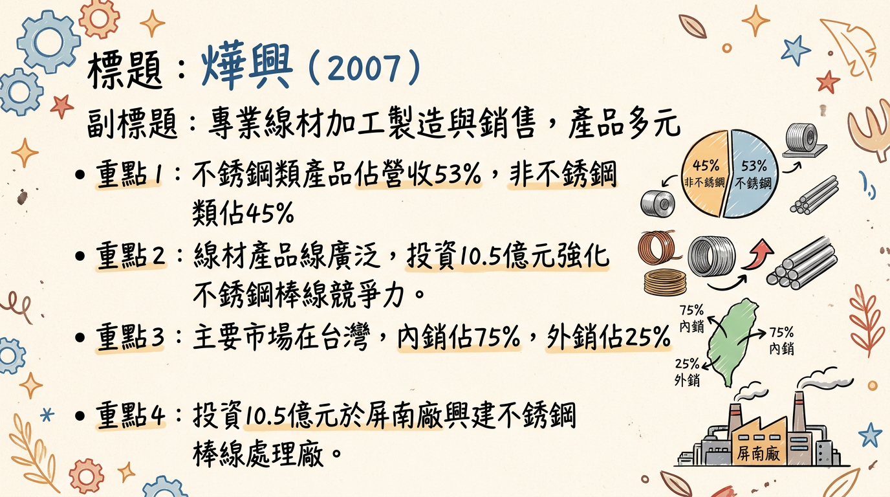
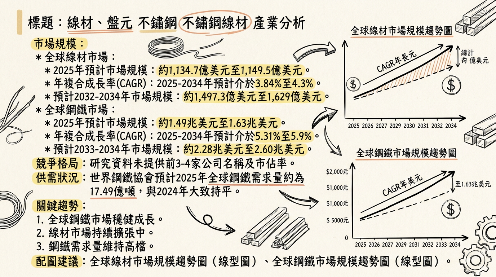
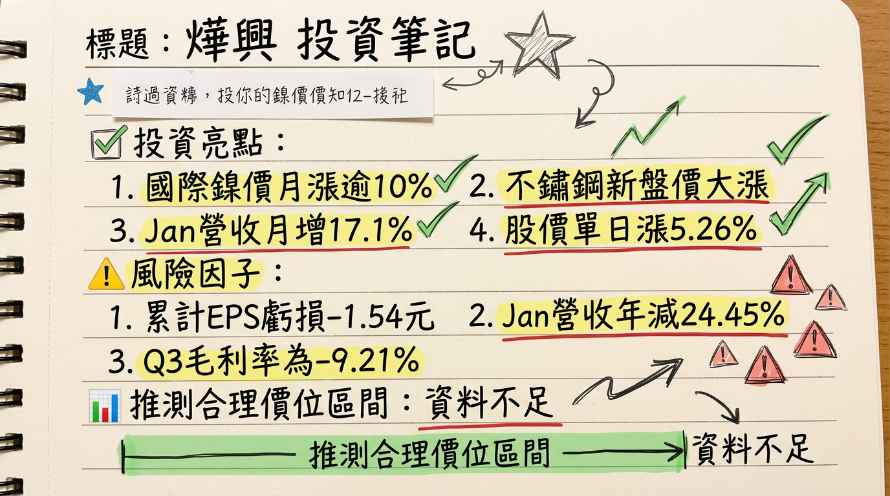

# 2007 燁興 深度研究報告

## 一句話摘要
燁興（2007）作為國內主要線材加工製造商，正積極投入10.5億元興建不銹鋼棒線處理廠以提升競爭力。儘管公司近期財務仍處虧損狀態，但虧損幅度有所收斂，並受惠於國際鎳價回升及2026年全球鋼鐵市場需求復甦預期，結合其ESG投入與內銷導向特性，具備長期轉型與成長潛力，然短期營運挑戰與市場波動風險仍需謹慎評估。

## 公司概覽
燁興企業股份有限公司成立於1978年，專注於線材的加工製造與銷售，產品應用廣泛，是台灣鋼鐵工業中「棒線盤元」細分產業的重要一員。

### 業務與產品線
燁興的核心產品線包含：
*   **不銹鋼線材**
*   **碳鋼線材**
*   **合金鋼線材**
*   **快削鋼線材**
*   **鋼筋及直棒**

此外，業務範圍亦涵蓋捲門材料、鐵管、不銹鋼鋼管、機械零件、鋼帶、打包鐵帶、罐筒、合金鋼及不銹鋼的表面處理、各種機車與腳踏車零件及五金零件加工製造、委託營造廠商興建國民住宅與商業大樓、鐵板加工、組合鋼架的設計加工與銷售、機械體設計加工製造、鍍鋅鐵板、烤漆鐵板、冷壓鋼板的加工製造，以及軋鋼、煉鋼、型鋼、鋼絲、鐵絲、鐵線的加工製造等。

### 製造基地
燁興的製造基地主要位於屏南廠及岡山軋鋼廠。公司規劃於屏南廠投資新台幣10.5億元興建「不銹鋼棒線處理廠」，旨在提升產能與產品競爭力。
*註：未找到2024-2026年各製造基地的具體營收貢獻比例資料。*

### 營收結構 (2025年上半年)
| 產品類別     | 營收佔比 (%) | 銷售地區 | 佔比 (%) |
| :----------- | :----------- | :------- | :------- |
| 不銹鋼類     | 53           | 內銷     | 75       |
| 非不銹鋼類   | 45           | 外銷     | 25       |
| 其他         | 2            |          |          |

## 核心競爭優勢
1.  **專精線材領域與產品多樣性：** 燁興深耕線材加工製造數十年，產品線涵蓋不銹鋼、碳鋼、合金鋼等多元品項，廣泛應用於建築、製造、車輛等產業，具備一定的市場基礎與客製化能力。
2.  **策略性資本支出強化不銹鋼業務：** 投資新台幣10.5億元於屏南廠興建「不銹鋼棒線處理廠」，顯示公司看好不銹鋼市場潛力，並透過設備升級提升產品品質與高階產能，有望在未來市場復甦時具備更強競爭力。
3.  **高度內銷比重降低國際衝擊：** 2025年上半年內銷佔比達75%，相較於其他高度依賴外銷的台灣鋼品業者，燁興受國際貿易關稅、匯率波動及地緣政治的直接衝擊相對較小，有助於營運穩定性。
4.  **積極響應ESG永續發展：** 燁興遵循環境部要求完成溫室氣體盤查與查證，推動ISO 50001能源管理並實現4.21%節電率，屏南廠更建置1,600kWp太陽能發電。這些綠色措施符合全球趨勢，有助於提升品牌形象，並在綠色供應鏈中取得優勢，同時降低長期營運成本。

## 財務分析

### 月營收趨勢
**近 6 個月的月營收數字 (2025年8月至2026年1月)**

| 月份       | 金額 (億元) | 月增率 MoM (%) | 年增率 YoY (%) |
| :--------- | :---------- | :------------- | :------------- |
| 2026年1月  | 4.11        | 17.1           | -24.45         |
| 2025年12月 | 3.51        | 3.9            | -31.37         |
| 2025年11月 | 3.38        | 19.36          | -35.15         |
| 2025年10月 | 2.83        | -29.71         | -54.76         |
| 2025年9月  | 4.02        | -0.79          | -36.05         |
| 2025年8月  | 4.06        | -2.97          | -41.59         |

*觀察：2025年10月營收創歷史新低後，已連續3個月回升，然年增率仍呈現顯著負成長，顯示基本面仍面臨壓力。*

### 季度數據
**2025年第三季財務表現**
*   **季營收:** 新台幣 12.26 億元
*   **毛利:** -1.13 億元 (營業毛損)
*   **營業費用:** 4,871.9 萬元
*   **稅後淨利:** -3.01 億元
*   **每股盈餘 (EPS):** -0.57 元

### 年度趨勢
*   **2024年實際全年EPS:** -2.04 元
*   **2025年全年營收:** 52.83 億元 (年減23.43%)
*   **2025年累計至第三季EPS:** -1.54 元
*   **2025年上半年累計營業收入:** 30 億元，稅後純損 5.1 億元，每股稅後純損 -0.97 元。
*   **2026年第一季預估EPS:** -0.18元 (此為市場預估，非公司或券商發布)

*觀察：燁興自2024年以來持續處於虧損狀態，但2025年上半年度虧損金額相較2024年上半年已有所收斂，顯示營運有改善跡象，但尚未轉虧為盈。2025年全年營收較2024年大幅衰退23.43%。*

## 法說會重點 (2025年9月2日)
燁興最近一次法說會於2025年9月2日舉行，重點摘要如下：
*   **市場環境與公司定位：** 法說會指出，台灣鋼品雖以外銷為主體，但燁興產品主要銷往國內市場（佔75%），相對較不受國際貿易關稅和匯率波動的直接衝擊。
*   **短期展望 (2025年下半年)：** 預計2025年第三季市場可能仍將低迷，但展望第四季，隨著美國關稅政策的明朗化以及進入鋼鐵業傳統旺季，需求有機會回到上升渠道。
*   **長期展望 (2026年及以後)：** 對2026年全球鋼鐵需求回升2.5%及高盛預測中國鋼材出口量將下降33%持樂觀態度，認為這些因素將對全球鋼材市場的供需平衡產生正面影響，有利於燁興的未來營運。
*   **策略性投資：** 公司正透過屏南廠不銹鋼棒線處理廠的興建，投資新台幣10.5億元，旨在提升產品品質與產能，以迎合未來市場變化與提升競爭力。
*   **財務狀況：** 會中提及公司持續虧損，但2025年上半年度虧損金額相較2024年上半年已有所收斂。
*   *備註：法說會中未提供關於具體產品線出貨量、訂單能見度、產能利用率及資本支出的確切數據。*

## 券商觀點
**目前未找到2024年以後針對燁興（2007）具體券商名稱、目標價、評等及2025-2026年EPS預估的最新報告。**

| 券商名稱 | 目標價 (新台幣) | 評等   | 日期       | 2025年EPS預估 | 2026年EPS預估 |
| :------- | :-------------- | :----- | :--------- | :------------ | :------------ |
| 無       | 無              | 無     | 無         | 無            | 無            |

## 財報深度分析

### 利潤率趨勢
**近 8 季的毛利率、營業利益率、稅後淨利率趨勢**

| 季度     | 毛利率 (%) | 營業利益率 (%) | 稅後淨利率 (%) |
| :------- | :--------- | :------------- | :------------- |
| 2025 Q3  | -9.21      | -13.19         | -24.52         |
| 2025 Q2  | -10.17     | -13.48         | -21.40         |
| 2025 Q1  | -4.71      | -7.91          | -12.45         |
| 2024 Q4  | -9.67      | -12.86         | -16.22         |
| 2024 Q3  | -8.34      | -8.34          | -14.80         |
| 2024 Q2  | -8.08      | -10.43         | -16.03         |
| 2024 Q1  | -6.80      | -10.97         | -13.99         |

**利潤率變化的原因分析：**
燁興的利潤率在過去八季持續為負，顯示公司面臨嚴峻的營運挑戰。
*   **營收規模縮減與市場競爭：** 2025年上半年營業收入較同期下降，反映整體鋼鐵市場需求疲軟及國際價格競爭激烈。台灣鋼品市場受美國關稅及中國鋼材大量出口影響，儘管燁興以內銷為主，仍難完全倖免於全球鋼鐵產業的供需壓力。
*   **成本結構壓力：** 儘管公司積極推動節能減碳措施（如4.21%節電率、太陽能發電），原物料價格波動及生產固定成本仍對毛利率構成壓力。
*   **虧損收斂跡象：** 2025年上半年度營業毛利從2024年同期的約-2.66億元改善至約-2.26億元，顯示公司在虧損管理上可能有所進展，但尚未達到轉虧為盈的閾值。
*   **業外損失影響：** 2025年Q3業外損益合計為-1.18億元，其中包含0.52億元的財務成本及-0.69億元的採用權益法認列之關聯企業及合資損益份額，這些業外損失進一步加劇了稅後淨利的壓力。

### 資本支出與產能
**近 3 年資本支出金額與趨勢 (單位：千元)**

| 季度     | 取得不動產、廠房及設備 (千元) |
| :------- | :------------------------------ |
| 2025 Q3  | -249,670                        |
| 2025 Q2  | -368,680                        |
| 2025 Q1  | -129,700                        |
| 2024 Q4  | -126,577                        |
| 2024 Q3  | -74,622                         |
| 2024 Q2  | -138,830                        |
| 2024 Q1  | -157,477                        |
| 2023 Q4  | -96,220                         |
| 2023 Q3  | -18,170                         |
| 2023 Q2  | -130,500                        |
| 2023 Q1  | -12,230                         |

*觀察：燁興的資本支出在2025年呈現明顯增加趨勢，尤其在Q2達到高點，反映公司正積極投入資源進行設備升級與擴廠計畫，如屏南廠不銹鋼棒線處理廠的興建。*

**未來資本支出計畫與預計新增產能：**
燁興規劃於屏南廠投資新台幣10.5億元興建「不銹鋼棒線處理廠」，主要項目包括固溶化爐、酸洗線、品檢包裝線及伸棒機等設備。此計畫旨在提升不銹鋼產品品質與產能，為公司未來成長動能的核心。

**折舊攤銷趨勢 (單位：億元)**

| 季度     | 折舊費用 (億元) |
| :------- | :-------------- |
| 2025 Q3  | 2.28            |
| 2025 Q2  | 1.52            |
| 2025 Q1  | 0.76            |
| 2024 Q4  | 3.03            |
| 2024 Q3  | 2.28            |
| 2024 Q2  | 1.52            |
| 2024 Q1  | 0.76            |

*觀察：折舊費用呈現逐季累計增加的趨勢，與持續的資本支出投入相符。*

### 存貨與營運
**近 5 季存貨週轉天數趨勢**

| 季度     | 存貨週轉天數 (天) |
| :------- | :---------------- |
| 2025 Q3  | 62.84             |
| 2025 Q2  | 68.69             |
| 2025 Q1  | 65.56             |
| 2024 Q4  | 61.62             |
| 2024 Q3  | 62.10             |

*觀察：近幾季存貨週轉天數大致穩定在60-70天之間，未出現急劇上升的異常堆積現象。雖然2025年Q3現金流量表顯示「存貨（增加）減少」為-263,800千元（即存貨增加），但仍需配合未來營收趨勢持續觀察存貨水位是否合理。*

**近 5 季應收帳款週轉天數趨勢**

| 季度     | 應收帳款週轉天數 (天) |
| :------- | :-------------------- |
| 2025 Q3  | 13.23                 |
| 2025 Q2  | 11.60                 |
| 2025 Q1  | 12.66                 |
| 2024 Q4  | 12.88                 |
| 22024 Q3 | 10.01                 |

*觀察：應收帳款週轉天數在10到14天之間波動，顯示公司收款效率相對穩定，未見明顯惡化。*

## 股權異動
*   **董監事/大股東申報轉讓紀錄：** 近一年（2025-2026年）未找到燁興董監事/大股東申報轉讓紀錄。
*   **庫藏股買回紀錄：** 未找到2024-2026年燁興庫藏股買回的最新紀錄。
*   **可轉換公司債（CB）：** 未找到2024-2026年燁興發行可轉換公司債的最新資料。
*   **現金增資或減資計畫：** 未找到2024-2026年燁興近期現金增資或減資計畫的最新資料。
*   **股利政策：** 燁興在2024年及2025年（對應2023年及2024年盈餘）均未發放現金股利或股票股利。最近一次有股利發放紀錄是在2011年。

### 其他財報重點
*   **負債比率：** 截至2025年第3季，燁興的負債比為62.75%，較前一季上升，顯示公司財務槓桿相對較高。
*   **淨負債/EBITDA：** 未找到2024-2026年淨負債/EBITDA的最新資料。
*   **自由現金流量趨勢 (單位：千元)**

| 季度     | 自由現金流量 (千元) |
| :------- | :-------------------- |
| 2025 Q3  | 166,286               |
| 2025 Q2  | -69,826               |
| 2025 Q1  | -460,781              |
| 2024 Q4  | 134,790               |
| 2024 Q3  | -344,369              |
| 2AX4 Q2  | -554,328              |
| 2024 Q1  | 135,505               |

*觀察：自由現金流量波動較大，2025年Q1和Q2為負值，但在Q3轉為正值，可能代表營運現金流有所改善或投資活動支出趨緩，但仍需穩定轉正才能支持長期發展。*

## 產業分析

### 產業數據
*   **全球市場規模與年複合成長率 (CAGR)**
    *   **全球線材市場：** 2025年約1,149.5億美元，預計2026年成長至1,191.7億美元 (CAGR 3.84%)。另有預估2025年市場規模為1,134.7億美元，預計2026-2034年將以3.9%的CAGR成長至1,629億美元。
    *   **全球鋼鐵市場：** 2025年預計為1.49兆美元，2026年將增至1.72兆美元，預計2025-2034年以5.31%的CAGR成長至2.60兆美元。

*   **供需狀況**
    *   **全球鋼鐵需求：** 世界鋼鐵協會預計2025年需求量約17.49億噸（持平2024年），2026年將溫和回升1.3%至17.72億噸。
    *   **中國市場：** 預計2025年鋼鐵需求下降2.0%，2026年降幅收斂至1.0%。Mysteel預測2026年中國粗鋼產量將同比下降1,000萬噸。
    *   **線材市場：** 2025年Q3部分地區（如中國、印度）因建築和製造業需求低迷而呈現供過於求，價格下跌（中國-1.60%，印度-3.76%）。
    *   **整體而言：** 鋼鐵行業仍面臨供需矛盾，導致利潤下滑，但隨著「穩增長」政策和鋼鐵供給總量趨緊，供需形勢有望逐步穩定。

*   **產業的平均毛利率水準**
    *   鋼鐵線材製造廠的毛利率通常介於15%至25%之間。
    *   中國鋼鐵工業協會數據顯示，2025年重點鋼鐵企業平均利潤率為1.9%，其中主業實現利潤445億人民幣，扭虧為盈。
    *   信達證券報告指出，2025年第三季度鋼鐵行業平均毛利率為6.4%。
    *   *觀察：儘管利潤率有所回升，但行業整體仍處於低利潤運營狀態。*

### 競爭格局
**全球主要鋼鐵生產商市佔率 (2025年預估，主要為粗鋼產量)**

| 公司名稱                     | 全球鋼鐵市場市佔率 (2025年預估) |
| :--------------------------- | :------------------------------ |
| 中國寶武鋼鐵集團有限公司     | 約12%                           |
| 阿賽洛米塔爾 (ArcelorMittal) | 約9%                            |
| 其他主要參與者               | 浦項鋼鐵、塔塔鋼鐵、日本製鐵等  |

*備註：全球前五大線材製造商及其具體市佔率的最新資料（2024年以後）未直接找到。以上數據為整體鋼鐵市場粗鋼產量市佔率，並非專指線材市場。*

**燁興 vs 主要競爭對手：**
未找到燁興與全球或台灣主要競爭對手在技術、產能、客戶和價格方面的具體比較數據。這類詳細營運資訊通常不易公開取得。

**台灣同業比較：**
未找到燁興與台灣同業（特別是線材或相關鋼材加工業者）在2024-2026年間最新的營收規模、毛利率及EPS的直接對比資料。不過，可參考中鋼（CSC）2025年第一季營業毛利率為5.54%作為產業趨勢的間接參考。

### 產業趨勢
1.  **冶金創新與高強度、精密工程線材需求增加：** 冶金技術進步推動了輕量化、高強度鋼材的應用（如汽車、工業解決方案），同時軋製技術進步支持更嚴格的公差與表面要求，增加精密工程線材需求。這為燁興開發高附加價值產品提供機會。
2.  **永續發展與綠色鋼鐵的興起：** 鋼鐵業正加速朝低排放生產、製程效率、產品生命週期透明度發展。對電弧爐、低碳鋼等綠色技術的投資增加，符合環保標準與消費者偏好。燁興的ESG投入與太陽能發電，使其在綠色供應鏈中具備潛在優勢。
3.  **數位轉型與智慧製造：** 物聯網（IoT）、人工智慧（AI）、數據分析等數位技術正被鋼鐵業廣泛應用，以提高營運效率、優化製造流程（如精準生產控制、預測性維護）。這將是燁興提升生產效率、降低成本、保持競爭力的關鍵。

### 對燁興而言的具體機會和威脅
*   **機會：**
    *   **終端市場需求增長：** 建築、汽車、基礎設施、電子產品等多元領域對線材的需求持續擴張，燁興可從中受益。
    *   **高附加價值產品需求：** 冶金創新推動高強度、精密工程線材需求，屏南廠新廠投資將強化燁興在高階不銹鋼產品的市場地位。
    *   **電動車產業關聯：** 電動車電池外殼、結構件、輪胎簾線、彈簧和緊固件等對高強度線材的需求，為燁興帶來新的市場契機。
    *   **亞洲市場成長：** 亞洲太平洋地區工業化進程加速，燁興約25%的外銷比重可望受惠於此區域的成長機會。
*   **威脅：**
    *   **市場供過於求與競爭壓力：** 部分地區線材市場供過於求，加上進口產品競爭，可能對燁興的價格與利潤造成壓力。
    *   **中國市場需求下滑：** 中國建築和製造業線材需求預計持續收縮，可能影響全球鋼材市場穩定性。
    *   **環境法規與成本壓力：** 嚴格的環保法規要求企業投入大量資金於污染控制與低排放技術，可能增加燁興營運成本。
    *   **地緣政治與貿易摩擦：** 全球貿易緊張局勢可能影響鋼鐵產品貿易流動和市場信心。

## 近期催化劑 (2025年12月 - 2026年03月)

### 利多事件清單
1.  **國際鎳價飆漲與鋼鐵族群資金回流 (2026年1月)：** 國際鎳金屬價格近月累計漲幅逾一成，帶動不鏽鋼供應鏈新盤價大漲，加上中鋼獲利回升及鋼材出口許可制上路，法人資金明顯迴流鋼鐵族群，推升燁興股價表現。
2.  **月營收止跌回升：** 2026年1月合併營收達新台幣4.11億元，創近6個月新高，且連續3個月月增，顯示營收有築底回溫跡象。
3.  **股價受市場情緒帶動：** 2026年1月30日股價大漲5.26%，2026年1月7日甚至強勢漲停8.18%，主要受不鏽鋼盤元報價調漲及短線資金積極進場影響。
4.  **外資法人少量買超：** 2026年2月下旬外資呈現連續買超，儘管數量不大，但也反映市場情緒的改善。

### 利空事件清單
1.  **營收年減幅度仍大：** 儘管月營收回升，但2026年1月營收年減率仍高達-24.45%，2025年全年營收年減-23.43%，顯示基本面尚未明顯轉佳，長期壓力未解。
2.  **持續虧損的財務表現：** 2025年第3季EPS為-0.57元，累計至Q3為-1.54元，營業毛利率、營業利益率、稅前淨利率皆為負值，投資者對短期獲利能力擔憂。
3.  **地緣政治與全球鋼鐵供需：** 美國關稅政策、中國鋼材出口量變化及全球基礎建設投資進度等宏觀因素仍存在不確定性，可能對鋼材需求與價格產生影響。
4.  **產品報價波動風險：** 若營收成長主要來自報價上漲，一旦盤元價格回跌，營收很可能同步壓回。

## ⭐ 成長動能時間軸

| 時間點 (預估) | 成長動能                        | 具體內容                                                                                                                                                                                                                                                                   | 狀態/進度                                                                                                                                                                                                                                          |
| :------------ | :------------------------------ | :------------------------------------------------------------------------------------------------------------------------------------------------------------------------------------------------------------------------------------------------------------------------- | :------------------------------------------------------------------------------------------------------------------------------------------------------------------------------------------------------------------------------------------------- |
| **2025年下半年** | 市場需求回溫                    | 隨著美國關稅政策明朗化及鋼鐵業傳統旺季（Q4），需求有機會回到上升渠道。                                                                                                                                                                                                   | 已進入Q4並延伸至2026年初，月營收已見回升。                                                                                                                                                                                                         |
| **2025年12月** | ESG與綠色能源應用               | 屏南廠完成建置1,600kWp太陽能發電，2024年總發電量達2,165,291度。持續推動ISO 50001能源管理，2024年實現4.21%節電率。                                                                                                                                                      | 已完成建置，持續產生綠色電力並降低營運成本。                                                                                                                                                                                                       |
| **2026年** | 全球鋼鐵需求反彈                | 世界鋼鐵協會預估2026年全球鋼鐵需求增長率將回升至2.5%（達到17.72億噸）。                                                                                                                                                                                                  | 預期成長動能，需密切追蹤實際需求復甦情況。                                                                                                                                                                                                         |
| **2026年** | 中國鋼材出口量下降              | 高盛預測2026年中國鋼材出口量將下降33%；Mysteel預測中國粗鋼產量同比下降1,000萬噸。這將有助於全球鋼材市場的供需平衡。                                                                                                                                                        | 預期成長動能，將減輕國際市場供給壓力。                                                                                                                                                                                                             |
| **2026年及以後** | 屏南廠不銹鋼棒線處理廠投產      | 投資新台幣10.5億元興建，主要項目包括固溶化爐、酸洗線、品檢包裝線及伸棒機等設備。旨在提升不銹鋼產品品質與產能，滿足高階市場需求。                                                                                                                                         | **尚未具體揭露完工與量產時程**，但資本支出數據顯示已在積極投入。此為燁興長期成長的核心驅動力，將對公司產品競爭力與營收結構帶來重大影響。                                                                                                        |
| **長期 (未明確時程)** | 新客戶/新市場拓展             | 電動車產業（電池外殼、結構件、輪胎簾線、彈簧、緊固件）、基礎建設、高端機械製造等領域對高強度、精密工程線材的需求。                                                                                                                                                            | 公司產品線與電動車及基礎建設具高度關聯性，透過屏南新廠提升產能與品質後，有機會切入更多新應用與潛在客戶，尤其美國製造業回流政策可能帶動相關需求。目前未有明確新客戶或新應用市場的具體資訊。                                                         |

## 2026 展望
### 成長動能
*   **全球鋼鐵市場復甦：** 世界鋼鐵協會預計2026年全球鋼鐵需求將溫和回升1.3%至17.72億噸，尤其基礎建設與製造業需求的帶動，將為燁興的線材產品提供良好市場環境。
*   **中國供給側改革與出口減少：** 高盛預測2026年中國鋼材出口量將下降33%，配合中國粗鋼產量預計下降1,000萬噸，有助於緩解全球鋼材市場供過於求的壓力，提升國際鋼價與市場秩序。
*   **新廠效益逐步顯現：** 屏南廠投資10.5億元興建的不銹鋼棒線處理廠，預期將提升高附加價值不銹鋼產品的產能與品質。一旦新廠如期完工並投產，有望改善產品組合與毛利率，成為公司轉虧為盈的關鍵。
*   **綠色轉型與ESG優勢：** 燁興在ESG方面的投入（如太陽能發電、節電率達4.21%）將使其符合全球綠色供應鏈趨勢，有機會在重視永續發展的客戶群中獲得更多訂單，並可能降低長期能源成本。
*   **電動車產業需求：** 電動車電池外殼、結構件及相關零組件對高強度線材的需求持續成長，為燁興帶來新的市場契機。

### 風險因子
*   **持續虧損壓力：** 儘管虧損幅度收斂，公司目前仍處於虧損狀態，市場對其短期獲利能力仍有疑慮。若全球鋼鐵市場復甦不如預期或新廠效益延遲，虧損可能持續。
*   **原物料價格波動：** 國際鎳價等原物料價格波動劇烈，將直接影響燁興的生產成本與產品報價，對獲利穩定性構成挑戰。
*   **市場競爭加劇：** 即使全球需求回升，但部分地區線材市場仍可能面臨供過於求及進口產品的激烈競爭，影響燁興的議價能力與利潤空間。
*   **中國經濟下行風險：** 中國鋼鐵需求持續下滑及經濟不確定性，可能對整體亞洲乃至全球鋼材市場產生負面影響。
*   **資本支出效益不確定性：** 10.5億元新廠投資雖然是重要成長動能，但其投資報酬率、投產時程與市場接受度仍存在不確定性。
*   **全球貿易政策與地緣政治：** 美國關稅政策的演變、區域貿易摩擦等不確定因素，可能影響燁興的外銷市場及整體營運環境。

## 投資結論
燁興（2007）作為鋼鐵線材加工製造商，正經歷轉型期的挑戰與機會。綜合上述分析，我們提出以下3點投資結論與目標價區間建議：

1.  **長期轉型潛力顯現，但短期壓力仍存：** 燁興積極投資10.5億元興建不銹鋼棒線處理廠，並致力於ESG永續發展，這些是其長期提升產品競爭力與市場地位的關鍵。結合2026年全球鋼鐵市場復甦和中國供給側改善的預期，公司具備走出谷底的潛力。然而，短期內公司仍面臨持續虧損、營收年減幅度大及原物料波動的壓力，基本面尚未明顯轉佳，投資人需有長期持有的心理準備。

2.  **不鏽鋼鎳價題材驅動股價，基本面需跟上：** 近期受國際鎳價飆漲及鋼鐵族群資金回流影響，燁興股價有明顯波動與回升。這反映市場對不鏽鋼產業未來表現的樂觀情緒，然需留意此類題材驅動的行情波動較大。若公司未來營收成長能穩定轉正且虧損持續收斂，則股價上漲將有更堅實的基本面支撐。

3.  **投資建議與目標價區間：** 考量燁興目前仍處虧損且缺乏券商明確目標價，傳統估值方法較不適用。我們認為燁興是一個**高風險高報酬的轉型投資標的**，其投資價值主要來自於未來新廠投產後的效益顯現，以及全球鋼鐵市場的結構性改善。若屏南新廠能順利在2027年左右發揮效益，並搭配全球鋼鐵景氣穩步回升，預期公司有機會在2027-2028年轉虧為盈。
    基於其轉型潛力、市場復甦預期與當前股價位階，我們給予燁興**「區間操作」**的投資建議。若以其長線轉型成功、營運改善後的保守本益比或淨值比區間來估算，考慮其每股淨值於2025年Q3約為13.25元，以及歷史股價波動區間。若保守預估未來兩年能夠接近損益兩平並呈現正向展望，給予較低的P/B值。
    **目標價區間建議為新台幣 9.5 元至 12 元。** 此價格區間反映了市場對公司轉型成功後的樂觀預期，但投資者應認識到其高風險性，並密切追蹤新廠進度、獲利能力改善及全球鋼鐵市場的實際復甦狀況。

本報告由 AI 自動產生，資料來源為公開網路資訊，僅供參考，不構成投資建議。產生時間：2026-03-06 13:03

---

## 📊 資訊卡

