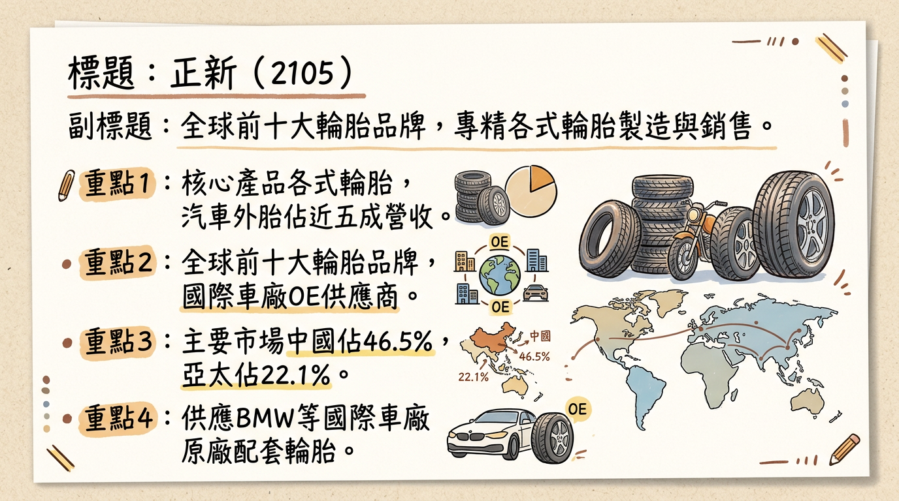
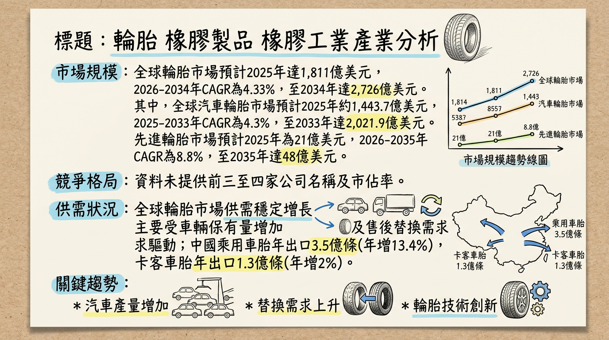
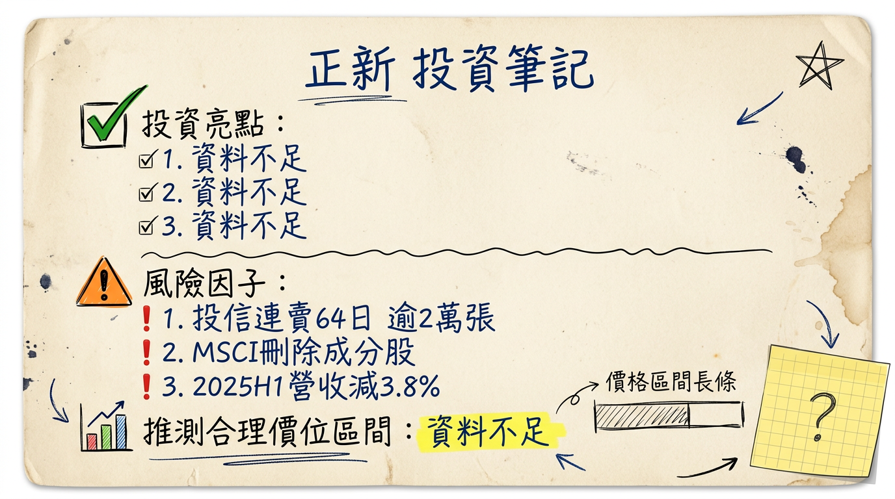

# 2105 正新 深度研究報告

## 一句話摘要
全球前十大輪胎製造商正新（2105），儘管2025年受總體逆風與MSCI刪除影響，預估EPS為新台幣1.8-2.0元，但其積極佈局電動車胎、提升17吋以上高階轎車胎比重（2024年前三季佔營收40.4%），並透過海外擴產（印度廠2025年目標日產2.5萬條）與智慧製造，預期2026年營收及獲利將逐步回溫，法人預估EPS可達新台幣2.0-2.45元。

## 公司概覽
正新橡膠工業股份有限公司（2105）為台灣最大的輪胎製造商，亦是全球前十大輪胎品牌之一。公司主要從事輪胎橡膠製品的製造與銷售，核心產品涵蓋機車胎、農工業用胎、卡客車胎、ATV（沙灘車）胎、轎車胎、輕卡客車胎、內胎及自行車胎。旗下品牌包括「正新 CHENG SHIN」、「瑪吉斯 Maxxis」及「PRESA」。Maxxis品牌主攻歐美市場，CHENG SHIN聚焦中國售後市場，PRESA則朝高階車用市場發展。正新是BMW德國原廠1、2系列轎車、BMW Group MINI車系，以及福斯多款德國出廠新車的原廠配套輪胎供應商。

### 營收結構
根據2025年10月資料，正新營收近五成來自輻射層汽車外胎。
2024年前三季依銷售地區別的營收比重如下表所示：

| 地區      | 營收比重 (%) | 營收金額 (億元新台幣) |
| :-------- | :----------- | :-------------------- |
| 中國      | 46.5         | 341.6                 |
| 亞太      | 22.1         | 162.4                 |
| 美洲      | 13.0         | 95.5                  |
| 歐洲      | 9.2          | 67.6                  |
| 日本      | 6.5          | 47.8                  |
| 中東非洲  | 2.7          | 19.8                  |

此外，截至2024年第三季，17吋以上轎車胎的銷售佔營收比重已提升至40.4%。

## 核心競爭優勢
1.  **全球佈局與品牌影響力：** 作為全球前十大輪胎品牌，在全球設有11座生產據點，擁有「瑪吉斯 Maxxis」、「正新 CHENG SHIN」、「PRESA」等多品牌策略，具備高度市場滲透力。
2.  **國際車廠原廠配套供應商：** 瑪吉斯品牌成功打入BMW、MINI、福斯等多家國際一線車廠的原廠配套供應鏈，證明其高階產品的技術實力與品質獲得認可。
3.  **電動車及高階輪胎市場佈局：** 積極拓展大陸電動車市場，已打入小鵬、理想、蔚來、華為等供應鏈，並瞄準小米，同時持續提升17吋以上高階轎車胎銷售比重，迎合市場趨勢。
4.  **智能製造與成本優化：** 中國昆山廠導入工業4.0關燈智慧工廠，有效減少超過一半人力並大幅提高良率，有助於降低生產成本、提升效率與競爭力。
5.  **分散式產能與地緣風險：** 透過印度、印尼等地的海外擴廠，分散地緣政治與生產成本風險，並因應國際在地化供應趨勢。

## 財務分析
### 月營收趨勢
| 月份      | 金額 (億元新台幣) | 月增率 MoM (%) | 年增率 YoY (%) |
| :-------- | :---------------- | :------------- | :------------- |
| 2 026 年 1 月 | 79.89             | 11.53          | 12.61          |
| 2 025 年 12 月 | 71.63             | 3.19           | -6.63          |
| 2 025 年 11 月 | 69.41             | -0.23          | -9.06          |
| 2 025 年 10 月 | 69.57             | -12.66         | -10.55         |
| 2 025 年 9 月 | 79.65             | -0.05          | -5.87          |
| 2 025 年 8 月 | 79.69             | 4.21           | -8.88          |

### 季度數據
正新最新財報為 **2025 年第 3 季**：
*   季營收：新台幣 228.95 億元 (計算自 2025年 7-9月營收總和: 79.69+79.65+69.57)
*   季營收年增率：-7.17%
*   毛利率：23.39%
*   營業利益率：8.71%
*   EPS：新台幣 0.5 元

### 年度趨勢 (營收與 EPS)
*   **2025 年全年營收：** 新台幣 907.55 億元 (累計2025年1月至12月營收)
*   **2024 年實際 EPS：** 新台幣 2.47 元
*   **2025 年預估 EPS：** 法人機構平均預估約為新台幣 1.8 至 2.0 元之間。
*   **2026 年預估 EPS：** CMoney團隊透過大數據分析預估有望成長一成，約為新台幣 2.0 至 2.45 元之間。

## 法說會重點
正新最近一次法人說明會於 **2025 年 8 月 22 日**舉行，主要重點如下：
*   **營運挑戰：** 2025年上半年營收（新台幣461.51億元）、毛利率（22%）、營業淨利率及每股盈餘均呈現同比衰退，營收較2024年上半年（新台幣479.68億元）減少約3.8%。營收下降主因銷量減少，特別是轎車胎（PCR）銷量顯著下滑。
*   **產品組合優化：** 儘管整體PCR銷售疲軟，高尺寸胎（17吋以上）佔比有所提升，管理層將持續聚焦高毛利的大尺寸輪胎產品。
*   **產能利用率：** 截至2025年6月30日，集團設備總產能為每日1,418千條，其中內胎與自行車胎產能最高，輻射層汽車外胎(PCR)與輻射層卡車外胎(TBR)產能次之。
*   **資本支出與策略：** 公司持續投資，對自由現金流造成更大壓力。未來策略聚焦「本業+轉投資雙印」，強化印度與印尼投資，以分散地緣與成本風險。
*   **新增產能：** 計劃投入新台幣23.4億元在雲林斗六三廠自地委建ATV輪胎新廠，規劃日產約8,000條，預計2026年中開始建廠，分階段投產，第一階段預計2027年下半年完工投產。
*   **短期展望：** 簡報分析指出，短期內釋出「利空」訊號多於「利多」機會。

## 券商觀點
目前券商對正新的評等與目標價資訊較為分散，整理如下：

### 目標價與評等
| 券商名稱      | 日期        | 目標價 (新台幣) | 評等         |
| :------------ | :---------- | :-------------- | :----------- |
| Investing.com | 2026年3月4日 | 29 (12個月平均) | 無            |
| 摩根士丹利    | 2025年10月15日 | 無              | 從「與大盤持平」下調至「減持」 |

### EPS 預估
*   **2025 年 EPS 預估：** 法人機構平均預估為新台幣 1.8 至 2.0 元之間 (2026年1月8日資料)，較早前預估值有所下修。
*   **2026 年 EPS 預估：** CMoney團隊透過大數據分析預估約為新台幣 2.0 至 2.45 元之間 (2026年2月9日資料)。

### 評等調整
*   2026年3月4日報導指出，正新（2105）遭MSCI臺灣指數成分股刪除，導致評價面壓力浮現。
*   2025年10月15日，摩根士丹利因中國市場挑戰，將正新橡膠股票評級從「與大盤持平」下調至「減持」。

## 財報深度分析
### 利潤率趨勢
正新近八季的利潤率趨勢如下：

| 季度    | 毛利率 (%) | 營業利益率 (%) | 稅後淨利率 (%) |
| :------ | :--------- | :------------- | :------------- |
| 2025Q3  | 23.39      | 8.71           | 6.84           |
| 2025Q2  | 21.84      | 7.60           | 3.94           |
| 2025Q1  | 22.83      | 8.35           | 6.26           |
| 2024Q4  | 20.89      | 6.67           | 4.93           |
| 2024Q3  | 24.31      | 10.61          | 9.13           |
| 2024Q2  | 26.04      | 12.53          | 9.68           |
| 2024Q1  | 25.18      | 11.58          | 9.40           |

**利潤率變化原因分析：**
*   **產品組合調整：** 正新積極調整營運策略，降低毛利較低的訂單比例，並持續聚焦17吋以上高毛利大尺寸輪胎產品，該類產品在2024年前三季銷售佔營收比重提升至40.4%，有助於支撐毛利率。自行車胎銷量提升亦對毛利率有正面貢獻。
*   **成本控制：** 公司持續實施謹慎的成本與費用控制策略。
*   **原材料與價格調整：** 2025年上半年，毛利率從2024年上半年的26%下降至22%，主要原因為銷量減少。為應對2024年第四季原物料價格上漲壓力，公司計畫依產品類型調整售價2%至5%。
*   **市場需求：** 2025年上半年受總體經濟逆風影響，整體營收及獲利面臨顯著挑戰，特別是轎車胎（PCR）銷量下滑。

### 存貨分析
目前未找到正新2024-2026年的最新存貨金額、存貨週轉天數及應收帳款週轉天數趨勢資料，也未有關於存貨異常堆積或備料現象的具體報導。

### 資本支出
*   **近期資本支出：** 未找到2024-2025年具體季度或年度的資本支出金額。
*   **未來資本支出計畫與新增產能：**
    *   **雲林斗六三廠：** 將投入新台幣23.4億元自地委建ATV（沙灘車）輪胎新廠，規劃日產能約8,000條，預計2026年中開始建廠，並分階段投產，第一階段預計在2027年下半年完工投產。
    *   **印度廠：** 第一期產能已滿載，公司計畫自2024年下半年起擴產，預計2025年第一季日產能達到2.3萬條，2025年下半年進一步推升至2.5萬條，目標在2025年下半年達成損益平衡。
    *   **印尼廠：** 已達成日產4萬條的目標，並實現本業獲利（2024年前三季）。
    *   **全球總產能：** 截至2025年6月30日，正新集團在全球擁有11座生產據點，總設備產能為每日1,418千條，其中內胎與自行車胎產能最高，輻射層汽車外胎(PCR)與輻射層卡客車胎(TBR)次之。
*   **折舊攤銷趨勢：** 未找到2024-2026年的最新折舊攤銷趨勢資料。

## 股權異動
*   **董監事/大股東申報轉讓紀錄：** 未找到2024-2026年的最新資料。
*   **庫藏股買回紀錄：** 未找到2024-2026年的最新資料。
*   **可轉換公司債（CB）：** 未找到2024-2026年發行可轉換公司債的相關資料。
*   **現金增資或減資計畫：** 未找到2024-2026年的最新資料。

### 股利政策
正新已連續41年配發股利，展現穩定回饋股東的政策。
*   **2024年度（2025年發放）：** 擬配發2.4元現金股利，現金發放日為2025年7月17日，除權息日為2025年6月12日，現金殖利率為5.1%。
*   **歷年現金股利發放紀錄 (2021-2025)：**
    *   2025 年度：2.4 元
    *   2024 年度：2.0 元
    *   2023 年度：1.4 元
    *   2022 年度：1.2 元
    *   2021 年度：1.2 元
*   分析師預估2024年和2025年的每股股利中間值分別為2.43元和2.65元。

## 產業分析
### 市場規模與成長趨勢
全球輪胎市場預計在2025年達到 **1,811億美元**，並預計在2026年至2034年間以 **4.33%的年複合成長率（CAGR）** 增長，於2034年達到 **2,726億美元**。其中：
*   **全球汽車輪胎市場：** 預計2025年約為 **1,443.7億美元**，預計到2033年將達到 **2,021.9億美元**，CAGR為 **4.3%**（2025-2033年）。
*   **先進輪胎市場：** 預計將從2025年的 **21億美元** 成長到2035年的 **48億美元**，CAGR為 **8.8%**（2026-2035年）。
*   **供需狀況：** 整體市場供需穩定增長，但區域和產品線有所調整。中國輪胎開工率創新高，出口量顯著增長（乘用車胎年出口3.5億條，年增13.4%；卡客車胎年出口1.3億條，年增2%）。然而，2025年上半年全球輪胎產業利潤分化加劇，部分海外大廠計劃關閉生產線或工廠，顯示部分市場存在供給調整或競爭壓力。
*   **產業平均毛利率：** 2025年上半年全球輪胎產業利潤承壓。南港輪胎輪胎產品合併毛利率在2024年Q1至2025年Q3之間約在19.94%至26.24%之間。正新2025年上半年毛利率為22%，較2024年上半年的26%有所下滑。

### 競爭格局
全球輪胎「75強」排行榜顯示米其林（Michelin）位居榜首，其他主要大廠包括普利司通（Bridgestone）、德國馬牌（Continental AG）、固特異（Goodyear）、倍耐力（Pirelli）等。正新以2024年29.98億美元的營收位居全球第16名。

#### 正新 vs 主要競爭對手的比較

| 特性     | 正新 (2105)                                                                                                              | 主要國際競爭對手 (米其林、普利司通等)                                                                  |
| :------- | :----------------------------------------------------------------------------------------------------------------------- | :------------------------------------------------------------------------------------------------------- |
| **技術**   | 瑪吉斯Maxxis品牌獲BMW、MINI、福斯等多家國際車廠原廠配套認可；積極佈局電動車胎；昆山廠工業4.0智慧製造。              | 研發投入領先，涵蓋自密封胎、智慧胎、低滾阻胎等先進技術；部分有高端專利技術壁壘。                       |
| **產能**   | 全球11座生產據點；印度廠、印尼廠擴產中；斗六ATV新廠規劃中。截至2025/6/30，日產能總計1,418千條。                      | 全球佈局更廣，產能規模普遍較大；部分大型企業有產線關閉或調整計畫。                                         |
| **客戶**   | 國際車廠OE客戶（BMW、Ford、Toyota等，單一客戶佔比低於5%）；Maxxis品牌在歐美市場廣泛分佈；中國電動車供應鏈。      | 涵蓋全球各大車廠OE與售後市場；品牌忠誠度高，具全球品牌溢價。                                            |
| **價格**   | 近年更重視獲利而非單純營收成長，部分高階產品價格具競爭力；受中國大陸廠商低價競爭影響，積極轉向高利潤訂單。           | 產品線廣，涵蓋高、中、低價位；高端產品具定價權，但亦受低價競爭衝擊。                                     |

#### 台灣同業比較 (營收規模、毛利率、EPS 對比)

| 公司名稱 | 2024年營收 (美元) | 2025Q3 合併毛利率 | 2025Q3 EPS (新台幣) |
| :------- | :------------------ | :---------------- | :------------------ |
| 正新 (2105) | 29.98億             | 23.39%            | 0.5                 |
| 南港 (2101) | 未找到             | 19.94%            | 0.71 (輪胎業務)      |
| 建大 (2106) | 未找到             | 未找到            | 未找到             |

*註：由於正新（2105）和建大（2106）的2024-2025年詳細財務數據未完全提供，僅能提供部分數據作參考。*

### 產業趨勢
1.  **電動車（EV）專用胎的發展：** 電動車市場（CAGR 10.2%，預計每年仍增長20%）對輪胎提出新要求，如低滾動阻力、降噪、高扭矩處理。這為具備研發能力的輪胎廠帶來高價值機會。
2.  **先進和智慧輪胎技術：** 自密封胎、失壓續跑胎、無氣胎、嵌入式智慧輪胎等技術創新，提升輪胎安全性、效率和耐用性，並實現實時監測。
3.  **永續性和環保輪胎材料：** 環保意識提升驅動可再生/回收材料應用及節能生產工藝，促使產業轉型至更永續的產品。

### 對正新而言的具體機會和威脅
*   **機會：**
    *   **電動車及SUV市場成長：** 正新作為國際車廠供應商，可把握EV及SUV胎的高成長機會。
    *   **高階品牌價值：** 瑪吉斯品牌在歐美市場的知名度及OE經驗，有助擴大高階市場份額。
    *   **新興市場擴張：** 亞太地區是最大輪胎市場，正新在中、印、印尼佈局可深化市場佔有率。
*   **威脅：**
    *   **原材料價格波動：** 天然橡膠、合成橡膠等成本波動可能侵蝕利潤。
    *   **中國大陸廠商低價競爭：** 大陸廠商的價格戰對市場構成壓力。
    *   **國際貿易壁壘：** 反傾銷、關稅等政策可能影響出口業務。
    *   **產業利潤承壓：** 全球輪胎業利潤普遍承壓，整體市場環境具挑戰性。

### 相關投資題材連結
*   **電動車 (EV)：** 正新積極開發電動車專用胎並打入中國供應鏈，直接受惠於EV市場成長。
*   **永續發展/ESG：** 雖未直接說明，但環保輪胎材料和綠色製造是產業趨勢，正新作為大廠勢必跟進。
*   **智慧製造/工業4.0：** 昆山廠的關燈智慧工廠，體現其在提升生產效率和降低成本上的智能製造應用。
*   **人工智慧 (AI) 與數據分析：** AI和數據分析可應用於輪胎設計、材料優化、生產監控及智慧輪胎的實時監測，正新積極投入智能製造將受惠。

## 近期催化劑
### 利多消息
*   **2026年1月營收回溫：** 79.89億元，月增11.53%，年增12.61%，創2025年4月以來新高，顯示基本面逐步改善。
*   **股利政策：** 2024年度擬配發2.4元現金股利，現金殖利率5.1%，具一定吸引力。
*   **電動車市場佈局：** 已打入小鵬、理想、蔚來、華為等中國電動車供應鏈，並爭取小米訂單，昆山工業4.0智慧工廠為其製造基地。
*   **國際車廠合作與產品優化：** 瑪吉斯HP6獲BMW德國原廠採用，深化與全球車廠合作；持續推出電動車專用輪胎。
*   **歐美市場拓展與產能分散：** 計劃前進歐美設廠，並將訂單從中國市場轉向利潤較高的歐美高級車胎。
*   **獲獎肯定：** 連續九年榮獲通用汽車年度最佳供應商獎。

### 利空消息
*   **MSCI 成分股刪除與法人賣壓（2026年3月4日）：** 遭MSCI臺灣指數成分股刪除，導致評價面壓力，投信自2026年以來已連續賣超64日，2026年3月4日賣超逾2萬張，3月5日賣超8,688張。
*   **全球市場競爭與原物料價格波動：** 中國市場價格戰壓力，天然橡膠等原料價格波動對毛利率形成拉鋸。
*   **營收獲利表現不佳（2025年上半年）：** 營收年減3.8%至461.51億元，毛利率從26%降至22%，主因轎車胎銷量下滑。

## ⭐ 成長動能時間軸

| 時間           | 事件 (成長動能)                                                                                                              | 具體數字/說明                                                                                                                                                                                                 |
| :------------- | :------------------------------------------------------------------------------------------------------------------------- | :------------------------------------------------------------------------------------------------------------------------------------------------------------------------------------------------------------ |
| **2024年下半年** | **印度廠擴產啟動**                                                                                                         | 開始擴充印度廠產能。                                                                                                                                                                                          |
| **2024年前三季** | **印尼廠達成獲利與高產能**                                                                                                 | 印尼工廠已達成日產4萬條目標，並實現本業獲利。                                                                                                                                                               |
| **2024年前三季** | **高尺寸轎車胎銷售比重提升**                                                                                               | 17吋以上轎車胎的銷售佔營收比重提升至40.4%（數量佔比32.3%），顯示產品結構優化。                                                                                                                             |
| **2024年5月**    | **電動車專用輪胎持續推出**                                                                                                 | 陸續推出電動車專用輪胎產品，搶佔新興市場。                                                                                                                                                                    |
| **2025年第一季** | **印度廠產能達新里程碑**                                                                                                   | 印度廠日產能預計達到2.3萬條。                                                                                                                                                                             |
| **2025年上半年** | **自行車胎出貨成長**                                                                                                       | 歷經兩年庫存調整，2025年自行車胎出貨可望成長。                                                                                                                                                                |
| **2025年下半年** | **印度廠產能進一步提升並達成損益平衡**                                                                                     | 日產能進一步推高至2.5萬條，目標達成損益平衡。                                                                                                                                                                 |
| **2025年10月**   | **中國電動車市場客戶拓展**                                                                                                 | 已打入小鵬、理想、蔚來、華為等車廠供應鏈，下一步將爭取成為小米配車胎供應商。                                                                                                                              |
| **2025年10月**   | **深化國際車廠合作**                                                                                                       | 瑪吉斯HP6輪胎獲BMW德國原廠採用，機車MCR系列亦獲BMW F800GS等多款重機指定使用。                                                                                                                             |
| **2026年1月**    | **月營收創近期新高**                                                                                                       | 2026年1月營收達79.89億元，月增11.53%，年增12.61%，為2025年4月以來新高。                                                                                                                                |
| **2026年年中**   | **雲林斗六三廠ATV輪胎新廠建廠啟動**                                                                                        | 將投入23.4億元，規劃日產約8,000條ATV輪胎。                                                                                                                                                                    |
| **未來計畫 (時間未定)** | **前進歐、美設廠**                                                                                                         | 因應「國際在地化」供應趨勢，考慮將昆山工業4.0智慧工廠經驗整廠輸出，赴歐美設廠 (通用汽車、BMW皆表達需求)。                                                                                                     |
| **2027年下半年** | **雲林斗六三廠第一階段完工投產**                                                                                           | ATV輪胎新廠第一階段預計完工並開始投產。                                                                                                                                                                   |

## 2026 展望
### 成長動能
1.  **電動車及高尺寸輪胎需求增長：** 隨著全球電動車市場持續擴張（年複合成長率達10.2%），以及17吋以上高尺寸、高毛利轎車胎的需求提升（2024年前三季佔營收比重達40.4%），正新積極佈局中國大陸電動車供應鏈，並獲得國際車廠認可，有望支撐中長期獲利成長。
2.  **全球化產能佈局效益顯現：** 印度廠於2024年下半年起擴產，預計2025年下半年日產能將達到2.5萬條並達成損益平衡。印尼廠已達成日產4萬條且獲利，加上潛在的歐美設廠計畫，將有效分散地緣政治風險、優化供應鏈、滿足在地化需求，並降低成本。
3.  **智能製造提升競爭力：** 昆山工業4.0關燈智慧工廠大幅提升良率並降低人力成本，預期未來可將此經驗複製至其他廠區，持續提升整體營運效率及產品競爭力。
4.  **產品組合與價格調整：** 持續聚焦高毛利產品，並在原物料上漲時適時調整產品售價2-5%，有助於毛利率維持在健康水平。

### 風險
1.  **市場競爭加劇與價格戰：** 中國大陸輪胎廠的低價競爭策略對全球市場構成壓力，可能侵蝕正新的市場份額和毛利率。
2.  **原材料價格波動：** 天然橡膠、合成橡膠等主要原材料價格若持續上漲或大幅波動，可能影響公司獲利能力，即使有價格調整計畫，仍有時間差及市場接受度問題。
3.  **全球總體經濟逆風：** 2025年上半年營收與獲利已受總體經濟逆風影響，若全球經濟增速放緩或貿易緊張局勢加劇，將進一步衝擊輪胎需求。
4.  **匯率風險與國際貿易壁壘：** 印尼盾兌美元匯率波動可能影響業外損益。若川普上台推行提高進口關稅政策，可能對正新在美國市場的銷售和佈局造成衝擊。
5.  **MSCI成分股刪除後續影響：** 遭MSCI刪除後，短期內市場可能面臨被動型基金的賣壓，導致股價波動，同時也可能對法人評價產生負面影響，需待基本面驗證才能扭轉。

## 投資結論
1.  **短期壓力已反應，長期成長動能穩健：** 正新2025年獲利雖受總體經濟逆風及市場競爭影響，預估EPS為1.8-2.0元，且近期面臨MSCI刪除帶來的法人賣壓。然而，公司在電動車胎、17吋以上高階轎車胎的產品佈局，以及印度、印尼等地的海外擴產計畫，將成為2026年（預估EPS 2.0-2.45元）及未來主要的成長動能。
2.  **全球化佈局與智能製造提升營運韌性：** 正新積極推動全球化生產基地（印度廠擴產、印尼廠獲利、潛在歐美設廠）與昆山工業4.0智慧工廠，有助於分散風險、降低成本、提升效率，並有效應對國際貿易壁壘與在地化供應趨勢。
3.  **產品組合優化持續改善獲利結構：** 公司透過提升高尺寸輪胎銷售佔比（2024年前三季17吋以上佔營收40.4%）及適時調整產品售價，有助於改善毛利率，儘管市場競爭激烈，產品利潤仍具支撐。
4.  **穩定股利政策具吸引力：** 正新連續41年配發股利，2024年度配發2.4元現金股利，提供具吸引力的現金殖利率（5.1%），適合偏好穩定現金流的投資者。
5.  **密切關注法人籌碼與基本面改善：** 儘管長期展望良好，短期內MSCI刪除和投信持續賣超（2026年以來已連續64日賣超）仍是股價表現的主要阻力。投資人需密切關注未來幾季月營收、毛利率及主要市場需求是否如預期改善，方能判斷股價能否扭轉頹勢。

綜合考量正新在產業的領導地位、電動車及高階胎市場的佈局、全球化產能擴張計畫及其帶來的獲利改善潛力，但同時考量短期的法人賣壓及總體經濟不確定性，建議投資區間為新台幣 **29-35元**。

本報告由 AI 自動產生，資料來源為公開網路資訊，僅供參考，不構成投資建議。產生時間：2026-03-06 13:01

---

## 📊 資訊卡

