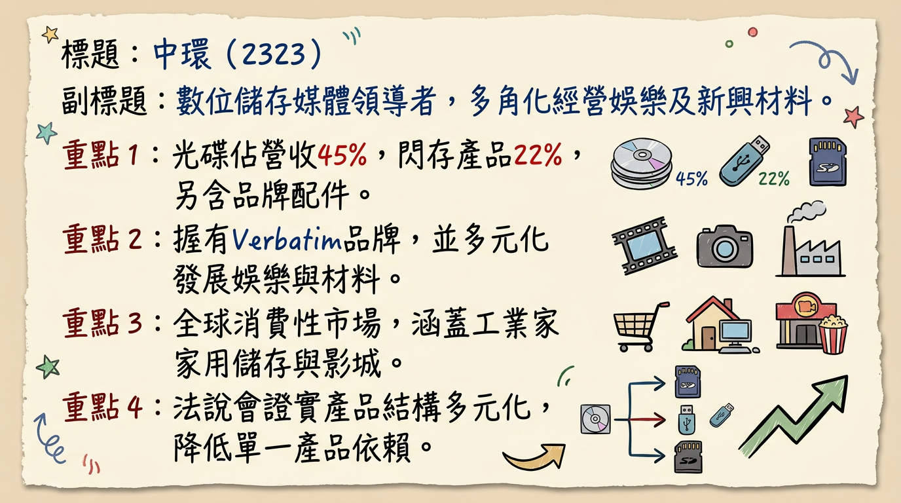
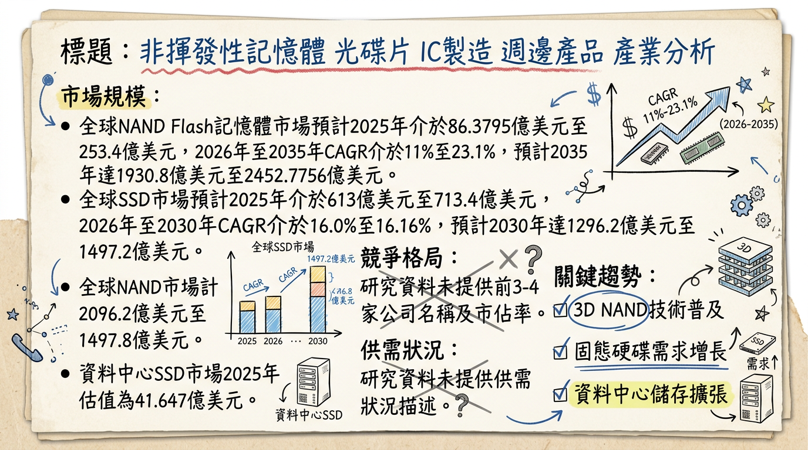
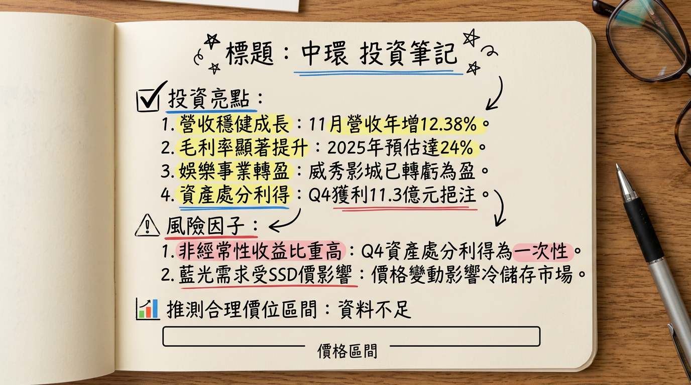

# 2323 中環 深度研究報告

## 一句話摘要
中環 (2323) 成功從傳統光碟製造商轉型為多元化品牌服務商，在SSD/Flash漲價及高階藍光光碟需求驅動下，儲存媒體業務強勁成長，旗下Verbatim品牌擴大市場版圖，威秀影城營運亦轉虧為盈。2025年毛利率預估達24%，公司財務結構穩健，配合資產活化，預期2026年營運將持續穩健成長。

## 公司概覽
中環股份有限公司（2323）成立於1978年12月2日，1992年2月17日上市。公司業務已從傳統光碟製造轉向多元化發展，涵蓋儲存媒體、品牌事業、娛樂事業及新興材料。

**核心產品與服務：**
*   **儲存媒體：** 光儲存媒體（DVD-R、BD-R）、數位存儲（SSD、USB、記憶卡）。
*   **品牌事業：** 國際品牌Verbatim，產品線廣泛涵蓋消費性電子產品。
*   **娛樂事業：** 經營威秀影城。
*   **新興材料：** 光電材料與鋰電池模組研發製造。

**業務營收佔比（2025年12月12日法說會資料）：**

| 產品線       | 營收佔比 |
| :----------- | :------- |
| 光碟 (OD)    | 45%      |
| 閃存 (Flash) | 22%      |
| 配件 (Accessory) | 24%      |
| 其他         | 9%       |

**所屬細分產業與相關題材：**
光電業、電子下游-其他、電腦及週邊設備、高階光碟市場（國防、醫療100G/200G光碟）、非揮發性記憶體（SSD、Flash）、熱冷儲存鏈（衛星高解析影像）、光電材料與鋰電池模組、娛樂產業。

## 核心競爭優勢
1.  **成功轉型與毛利率提升：** 公司已成功從傳統製造業轉型為品牌服務業，毛利率從2019年的15%顯著提升至2025年預計的24%。
2.  **全球品牌影響力：** 旗下Verbatim品牌擁有超過50年歷史，銷售網絡遍及全球120多個國家，涵蓋5,000多個實體通路及電商平台，在歐日等成熟市場銷售強勁，年增長11-15%。
3.  **儲存媒體供應鏈優勢：** 憑藉長期供應鏈佈局，在SSD與Flash全球供應吃緊及價格上漲趨勢下，能保持穩定供貨與價格優勢，市佔持續擴大。
4.  **互補的儲存策略：** 高容量藍光光碟定位於衛星高解析影像等高資料量產業的「冷儲存」市場，與SSD的「熱儲存」市場形成互補，滿足全儲存鏈需求。
5.  **娛樂事業復甦與領先：** 威秀影城本年度已轉虧為盈，觀影人次與市佔率穩居全台第一，提供穩定的現金流貢獻。
6.  **資產活化能力：** 透過處分南亞科、新盛力等有價證券，成功實現處分利益約新台幣1,779萬元及2,134萬元，強化財務彈性。

## 財務分析

**月營收趨勢：**

| 月份   | 金額 (新台幣億元) | 月增率 (MoM) | 年增率 (YoY) |
| :----- | :---------------- | :----------- | :----------- |
| 2026/01 | 7.53              | 23.53%       | 27.8%        |
| 2025/12 | 6.10              | -9.04%       | -0.73%       |
| 2025/11 | 6.70              | 5.33%        | 12.38%       |
| 2025/10 | 6.37              | 0.29%        | -10.9%       |
| 2025/09 | 6.35              | 7.34%        | -0.36%       |
| 2025/08 | 5.91              | -5.67%       | -4.41%       |

**季度數據 (2025年第三季)：**
*   毛利率：23.29%
*   營業利益率：2.10%
*   EPS：0.83元

**年度趨勢：**
*   **2024年實際：** 全年營收 74.35 億元，全年 EPS -0.27 元。
*   **2025年預估：** 累計至2025年12月營收約 71.83 億元。累計至2025年第三季 EPS 為 0.37 元。

## 法說會重點
**日期：** 2025年12月12日 (凱基證券線上法人說明會)

**管理層發言與 guidance：**
*   **公司定位與策略：** 已成功轉型為品牌導向的服務業，核心策略為追求穩健獲利，預計2025年毛利率將達到24%，較2019年的15%大幅提升。
*   **儲存媒體業務：**
    *   SSD與Flash價格上漲且全球供應吃緊，Verbatim憑藉長期供應鏈佈局，展現穩定供貨與價格優勢，市佔持續擴大。
    *   高容量藍光光碟用於衛星高解析影像等高資料量產業的長期備份，與SSD的「熱儲存」市場形成互補，共同帶動全儲存鏈需求。
*   **品牌事業 (Verbatim)：**
    *   擁有超過50年歷史，產品線涵蓋光碟、USB、記憶卡、SSD及其他消費性電子產品。
    *   銷售網絡遍及全球超過120個國家與5,000個實體通路，在歐洲、日本等成熟市場銷售強勁，較去年增長11%至15%。
    *   透過Amazon等電商平台積極拓展新興市場。
*   **娛樂事業 (威秀影城)：**
    *   市佔率穩居全台第一，營運表現已轉虧為盈，觀影人次與市佔率均恢復至疫情前水準。
    *   未來將持續增加據點、更新設備，並開發周邊商品以提升營收。
*   **產品組合變化：** 光碟佔集團營收比重已從2019年的86%大幅下降至2023年的45%。2023年產品組合為：光碟45%、消費性電子周邊(Accessory) 24%、Flash 22%。未來成長動能主要來自Accessory與Flash兩大類別。
*   **資本支出與產能利用率：** 法說會資料中未提及具體的產能利用率和資本支出金額。
*   **下季/下半年 guidance：** 預期在SSD價格上漲及藍光光碟冷儲存需求增加的雙重效益下，儲存媒體業務將持續成長；品牌事業將深化歐美日市場並拓展新興市場；娛樂事業預期2026年將持續成長。中環董事長翁明顯預期，高階光碟市場供不應求將帶動2025年整體毛利率持續攀升。

## 券商觀點
**目前未找到 2025-2026 年券商對中環（2323）的具體目標價、EPS預估及評等調整資訊。**

| 券商名稱 | 目標價 (新台幣) | 評等 | 日期 |
| :------- | :-------------- | :--- | :--- |
| N/A      | N/A             | N/A  | N/A  |

## 財報深度分析

### 利潤率趨勢

| 季度       | 毛利率   | 營業利益率 | 稅前淨利率 | 稅後淨利率 |
| :--------- | :------- | :--------- | :--------- | :--------- |
| 2025年第三季 | 23.29%   | 2.10%      | 50.93%     | 49.01%     |

**利潤率變化原因分析：**
中環在2025年第三季達成「三率三升」（毛利率、營業利益率、淨利率同步提升）。其中，2025年Q3的營業利益為39.09M美元，營業利益率為2.1%，與去年同期相比成長146.2%。這反映了公司產品組合優化、品牌轉型效益以及高階儲存產品需求帶來的獲利能力改善。

### 存貨分析
目前未找到2024-2026年的最新存貨金額、存貨週轉天數趨勢，以及存貨是否有異常堆積或備料現象的具體資料。

### 資本支出
目前未找到2024-2026年的最新資本支出金額與趨勢、未來資本支出計畫與預計新增產能的具體資料。

### 其他財報重點
中環期末持有現金及約當現金總額為2.19B美元，佔總資產比率為0.08。流動比率與速動比率皆反映其短期償債能力穩健。高水位現金代表企業具備良好的資金調度彈性，可支應營運需求、擴張投資或股東回饋政策。

## 股權異動

*   **處分南亞科持股獲利（2026年1月30日）：** 2026年1月6日至29日期間，處分南亞科（2408）共1,200張持股，交易均價261.7元，總金額約3.14億元，實現處分利益約1,779萬元。交易後，仍持有約28萬股南亞科普通股。
*   **處分新盛力持股獲利（2025年8月22日）：** 公告處分新盛力普通股，交易總金額約3.61億元，處分利益約2,134萬元。
*   **取得群聯普通股（2026年2月26日）：** 2026年2月11日至2026年2月26日期間，取得群聯普通股205仟股，總金額約3.94億元。累計持有餘額365仟股，金額約7.21億元，持股比例0.18%。
*   **取得南亞科普通股（2026年3月3日）：** 2026年2月23日至2026年3月3日期間，取得南亞科普通股1,547仟股，總金額約4.24億元。累計持有餘額2,182仟股，金額約6.01億元，持股比例0.07%。
*   **股利政策（2025年）：** 董事會通過，2025年每股配發現金股利0.3元。除息交易日為2025年9月4日，現金發放日為2025年10月3日。
*   **董監事/大股東申報轉讓、庫藏股、可轉債、增減資：** 目前未找到2025-2026年的最新相關具體資料。

## 產業分析

### 市場規模與CAGR成長率
中環主要涉足NAND Flash/SSD、光電材料及鋰電池模組市場。

*   **NAND Flash / SSD / 記憶卡市場：**
    *   全球3D NAND Flash市場規模：2025年253.4億美元，預計2026年成長至296.6億美元，2026-2035年CAGR為23.1%，至2035年達1930.8億美元。
    *   全球SSD市場規模：預計從2025年的713.4億美元成長到2026年的828.2億美元，CAGR為16.1%。
    *   資料中心SSD市場：2025年估值41.647億美元，預計2026年達44.951億美元，2026-2034年CAGR為7.5%。
*   **光電材料市場：**
    *   全球光電市場：預計從2025年的436.9億美元成長到2026年的562.8億美元，CAGR達28.8%。
    *   光電材料市場：預計2026-2033年CAGR為20.20%。
*   **鋰電池模組市場：**
    *   全球鋰離子電池市場：2024年估計752億美元，2025-2034年CAGR為15.8%。
    *   全球鋰市場規模：2025年164.6億美元，預計從2026年的195.2億美元增長到2034年的784.9億美元，CAGR為18.90%。

### 供需狀況
*   **NAND Flash / 記憶體市場：**
    *   目前處於供需嚴重失衡狀態，預計2026年第一季整體NAND Flash價格將季增85%~90%。
    *   AI伺服器儲存需求暴增，刺激企業級SSD需求爆發式成長，加上HDD嚴重缺貨，使NAND Flash短缺情況惡化。
    *   高盛預估2026年NAND供需缺口將達4.2%，企業級SSD需求成長率在2026年預估將飆升至58%。
    *   原廠將產能幾乎全數傾斜給AI伺服器，導致消費級SSD供應受到擠壓，價格維持高檔。
*   **鋰電池產業：**
    *   22025年全球儲能市場擴張超乎預期，加上電動車市場成長，逐漸將鋰電池產業從供過於求推向供需平衡，部分環節甚至轉向「緊平衡」。
    *   預計2026年中國鋰電池產業鏈將迎來「第三輪」擴產週期，但新增產能短期內難以完全彌補供需缺口，關鍵材料仍將維持供應緊張。

### 產業平均毛利率水準
目前未找到2025-2026年NAND Flash、SSD、記憶卡、光電材料或鋰電池模組產業的平均毛利率水準的具體數據。

### 競爭格局

**NAND Flash 產業 (2025年第四季營收表現)：**

| 排名 | 公司名稱                 | 2025年第四季營收 (億美元) | 季增率 | 市佔率 |
| :--- | :----------------------- | :-------------------------- | :----- | :----- |
| 1    | Samsung (三星)           | 66                          | 10%    | 28%    |
| 2    | SK Group (SK海力士、Solidigm) | 52.1                        | 47.8%  | 22.1%  |
| 3    | Kioxia (鎧俠)            | 33.1                        | 16.5%  | -      |
| 4    | Micron (美光)            | 30.3                        | 24.8%  | -      |
| 5    | SanDisk (閃迪)           | 30.3                        | 31.1%  | -      |

*   **SSD 產業：** 主要經營者包括Intel Corporation、Samsung Group、Western Digital Corporation、Kingston Technology Corporation、Micron Technology Inc.等。
*   **中環 vs 主要競爭對手：** 中環作為數位儲存模組廠，其品牌事業Verbatim在消費性電子產品領域與眾多品牌商（如Kingston, ADATA, Transcend等）競爭。目前未找到中環與主要競爭對手在技術、產能、客戶、價格等方面的具體比較數據。
*   **台灣同業比較：** 目前未找到中環與台灣同業（如威剛、十銓、創見、宇瞻等記憶體模組廠）在2024年以後的營收規模、毛利率、EPS的直接對比數據。然而，同業普遍看好記憶體市場在2026年的供不應求趨勢。

### 產業趨勢
1.  **AI伺服器與企業級SSD需求爆發：** AI對海量數據處理的需求，帶動高容量、高效能企業級SSD的瘋狂搶購，導致NAND Flash供需失衡，價格飆升。
2.  **3D NAND技術與高密度儲存：** 176層及232層3D NAND技術應用，提供更高儲存密度與更低成本。原廠加速轉向122TB/245TB等大容量QLC企業級SSD，以應對AI對儲存容量與速度的要求。
3.  **固態電池技術發展：** 固態電池被視為下一代電池技術，2025-2026年是從試驗線轉向量產的關鍵拐點，將為電池設備廠商帶來新市場與技術升級需求。

**對中環而言的具體機會和威脅：**
*   **機會：**
    *   **數位儲存產品線拓展：** 受惠於AI及資料中心對SSD與記憶體的需求激增，Verbatim品牌數位儲存產品線將直接受益於市場需求成長和價格上漲。
    *   **新興材料業務：** 抓住AI數據中心對備援電池模組 (BBU) 及全球電動車、儲能市場對鋰電池的強勁需求，創造新成長動能。
    *   **高容量產品策略：** 高階光碟片（100G、200G）因國防、醫療需求旺盛而供不應求，提供利基市場成長機會。
*   **威脅：**
    *   **原廠產能傾斜：** 記憶體原廠優先供應AI伺服器用高毛利產品，可能導致中環在消費級SSD/記憶卡NAND Flash晶片採購面臨供應緊缺和成本上升壓力。
    *   **市場競爭激烈：** 數位儲存市場競爭劇烈，需持續投入研發與品牌建設。
    *   **傳統光碟業務萎縮：** 儘管轉型有成，傳統光碟片業務仍面臨數位化趨勢的長期挑戰。

**相關投資題材的具體連結：**
*   **AI (人工智慧)：** AI伺服器對HBM和企業級SSD的需求是記憶體市場供不應求的主導因素，中環作為數位儲存產品供應商間接受益。AI數據中心建設也帶動BBU備援電池模組需求，成為鋰電池產業成長動能。
*   **HBM (高頻寬記憶體)：** HBM產能排擠效應影響DDR5和NAND Flash供應，進而影響中環相關產品的成本和供應。
*   **電動車 (EV) 與儲能系統：** 電動車市場成長是鋰電池產業重要驅動力。再生能源及AI數據中心建設帶動儲能系統需求，政府補助政策也提供台灣電池芯產業新契機，中環的鋰電池模組業務有機會受惠。
*   **國防軍工產業：** 台灣國防自主對無人機、無人載具、低軌衛星等鋰電池需求，是中環鋰電池業務的潛在機會。

## 近期催化劑

**利多事件清單：**
*   **2026年1月營收強勁：** 7.53億元，月增23.53%，年增27.8%。
*   **法說會確認轉型成功：** 2025年12月12日，法說會強調轉型品牌服務業，毛利率顯著提升（2025預計24%），威秀影城轉虧為盈，儲存媒體市場具供貨與價格優勢。
*   **資產活化顯現效益：** 2025年第四季度處分資產淨利達新台幣11.3億元，強化現金流。
*   **SSD與Flash市場趨勢利多：** 全球供應吃緊，價格上漲，中環Verbatim品牌受益。
*   **高階光碟需求旺盛：** 國防、醫療相關100G、200G光碟市場供不應求。
*   **法人買超積極：** 2026年1月6日三大法人買超逾9,500張；2月23-26日外資持續買超，總計逾2.3萬張。
*   **股利政策：** 2025年每股配發現金股利0.3元。
*   **投資佈局：** 持續取得群聯、南亞科等具產業前景的資產，優化資產配置。

**利空事件清單：**
*   **2025年12月營收下滑：** 6.10億元，月減9.04%，年減0.73%。
*   **法人賣超：** 2026年2月5日三大法人賣超6,070張；3月3日賣超360張；3月4日賣超4,304張。
*   **總經風險：** 股市波動對財務影響大（有價證券投資占總資產74.51%）。

## ⭐ 成長動能時間軸

*   **2025年5月：**
    *   **新產品發佈：** COMPUTEX 2025展示智慧儲存與行動周邊新品，包括資安固態硬碟、AI可攜式觸控螢幕、整合充電顯示器等，展現研發實力。
    *   **高階光碟需求：** 董事長翁明顯指出，國防、醫療相關100G、200G高階光碟市場供不應求，看好毛利率持續攀升。
*   **2025年起：**
    *   **轉型效益顯現：** 從傳統製造業成功轉型為品牌服務業，預計2025年毛利率達24% (2019年為15%)。
*   **2025年12月起：**
    *   **儲存媒體業務成長：** SSD價格上漲及藍光光碟冷儲存需求增加，雙重效益驅動儲存媒體業務持續成長。
    *   **品牌事業拓張：** Verbatim品牌在歐洲、日本等成熟市場銷售年增11-15%，並透過Amazon等電商平台積極拓展新興市場。
    *   **娛樂事業復甦：** 威秀影城觀影人次與市佔率恢復至疫情前水準，成功轉虧為盈，預期2026年持續成長。
    *   **資料儲存需求：** 受益於衛星高解析度影像等高資料量產業對冷儲存的需求，與SSD熱儲存互補。
*   **2025年第四季度至2026年：**
    *   **資產活化與現金流：** 2025年Q4處分資產淨利達新台幣11.3億元，預估2026年租金收入1.06億元，強化現金流。
*   **2026年：**
    *   **產業需求驅動：** NAND Flash市場持續供不應求，AI伺服器對企業級SSD需求飆升，鋰電池產業供需趨緊，均為中環相關業務帶來成長機會。
    *   **娛樂事業拓展：** 威秀影城將持續增加據點、更新設備，並開發周邊商品。
*   **擴廠、新客戶、產能擴充、資本支出：** 目前未找到2025-2026年的具體最新資料。

## 2026 展望

**成長動能：**
*   **產品組合優化與獲利能力提升：** 成功轉型帶動毛利率顯著提升至24%，未來將持續受益於高毛利產品比重增加。
*   **數位儲存市場成長：** 受益於全球AI發展帶動的企業級SSD及資料中心儲存需求激增，以及NAND Flash價格上漲，中環的SSD、Flash、記憶卡及高階藍光光碟業務將持續擴大市場佔有率與獲利。
*   **品牌事業全球擴張：** Verbatim品牌在歐、日市場的強勁增長，以及電商平台對新興市場的滲透，將持續貢獻穩健營收。
*   **娛樂事業穩健復甦：** 威秀影城已轉虧為盈並保持市佔第一，未來據點擴增與營運優化將帶來持續性增長。
*   **新興材料潛力：** 光電材料及鋰電池模組業務有望受惠於電動車、儲能、AI數據中心BBU及國防軍工等產業的發展。
*   **資產活化效益：** 2025年資產處分實現可觀利益，未來租金收入與持續優化的資產配置將增強公司財務彈性。

**風險：**
*   **技術替代與市場競爭：** 傳統光碟市場持續萎縮，數位儲存市場競爭激烈，公司需不斷創新並維持競爭力。
*   **原廠產能分配：** 記憶體原廠優先將產能提供給高毛利的AI伺服器相關產品，可能影響中環消費級產品的晶片採購成本與供貨穩定性。
*   **股市波動的財務影響：** 公司有價證券投資占總資產比重高達74.51%，使股市波動對公司財務表現影響甚鉅，儘管公司表示將優化資產配置，仍需持續關注。
*   **總體經濟不確定性：** 全球經濟成長放緩、通膨、匯率波動及地緣政治風險等，仍可能對消費需求及公司營運造成潛在衝擊。

## 投資結論
中環（2323）已成功走出傳統製造業的陰霾，透過產品組合優化、品牌轉型及策略性資產配置，迎來顯著的營運轉機。我們認為其投資價值主要體現在以下三點：

1.  **獲利能力顯著改善與多元成長引擎：** 2025年預計毛利率提升至24%，搭配SSD/Flash市場漲價趨勢、高階藍光冷儲存的利基需求，以及Verbatim品牌與威秀影城的穩健貢獻，形成多元且具韌性的成長動能。2025年第三季EPS達0.83元，顯示其獲利能力已明顯轉強。
2.  **產業趨勢浪潮下的受惠者：** 在AI伺服器對高容量、高效能SSD的龐大需求驅動下，NAND Flash市場供不應求、價格飆升，中環作為數位儲存產品供應商直接受益。同時，其在鋰電池模組的佈局也搭上電動車、儲能及國防軍工產業的成長順風車。
3.  **穩健的財務體質與資產活化潛力：** 公司擁有高水位現金，流動性良好，且持續透過處分有價證券活化資產，強化現金流並支持長期擴張，有助於抵禦市場風險。

綜合公司成功轉型、強勁的成長動能以及優化的財務結構，我們看好中環2026年的營運表現將持續向上。考量其在記憶體模組市場的成長潛力、品牌價值的提升及新興材料的佈局，建議目標價區間為 **新台幣 28元 - 35元**。

本報告由 AI 自動產生，資料來源為公開網路資訊，僅供參考，不構成投資建議。產生時間：2026-03-06 13:01

---

## 📊 資訊卡

