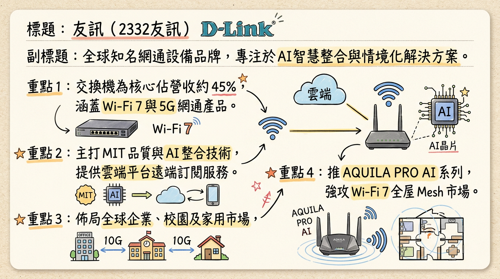
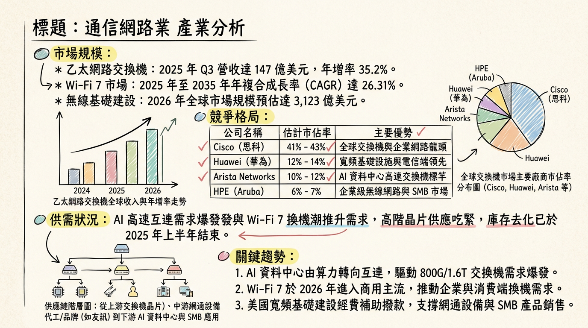
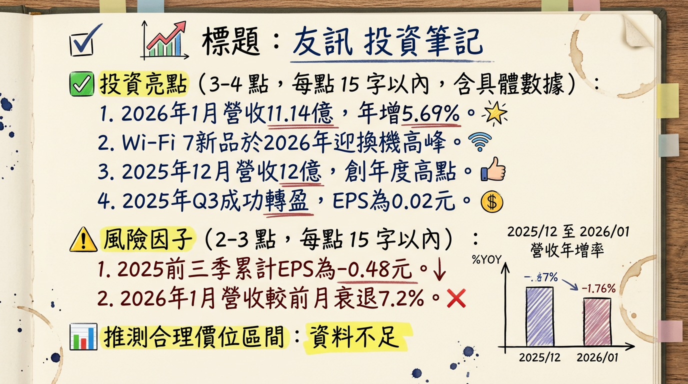

# 2332友訊 友訊 深度研究報告

## 一句話摘要
友訊（D-Link）正由傳統網通硬體商轉型為「AI情境化整合方案商」，受惠於 Wi-Fi 7 換機潮、MIT 轉單效益及印度市場高成長，2026 年有望確立獲利回升軌道。

---

## 公司概覽
友訊（D-Link）為全球知名網通品牌商，近期採取資產輕量化（Asset-light）策略，將經營重心轉向軟硬體整合與雲端訂閱服務（Nuclias / D-ECS）。

### 產品線與營收結構（2024-2025年數據）
| 產品類別 | 營收佔比 | 核心應用 / 產品系列 |
| :--- | :--- | :--- |
| **交換機 (Switches)** | **43.4% ~ 46.0%** | L3 核心交換機、2.5G/10G 智慧網管交換器 (DMS-1250) |
| **其他與數位家庭** | **34.4%** | AQUILA PRO AI 系列 Wi-Fi 7 Mesh 路由器、IP Cam |
| **行動及寬頻網路** | **12.6%** | 5G NR 行動熱點 (F530)、5G USB 網卡、FWA 設備 |
| **其他服務** | **7.0%** | 雲端管理平台 (Nuclias, D-ECS) 訂閱收入 |

**市場分佈（2024 Q4）：** 泛亞太及其他地區 67%（含印度）、歐洲 27%、美洲 6%。

---

## 核心競爭優勢
1.  **MIT（Made in Taiwan）品質信任：** 台灣製造供應鏈佔比已提升至 **65%**，符合 NDAA 合規要求，在地緣政治推動的「去中化」趨勢下，於美歐政府及教育標案具備轉單優勢。
2.  **AI 整合解決方案：** 推出 AQUILA PRO AI 系列，透過 AI 演算法優化流量管理（QoS）與自我修復功能，提升產品單價（ASP）。
3.  **印度市場領導地位：** 子公司 D-Link India 在當地市佔領先，深度參與印度數位轉型與電信基礎建設。

---

## 財務分析

### 最近 6 個月月營收趨勢
| 月份 | 營收金額 (億元) | 月增率 (MoM) | 年增率 (YoY) |
| :--- | :--- | :--- | :--- |
| **2026/01** | 11.14 | -7.19% | **+5.69%** |
| **2025/12** | 12.00 | +9.72% | **+4.11%** |
| **2025/11** | 10.94 | -4.26% | -5.86% |
| **2025/10** | 11.43 | -6.58% | +2.36% |
| **2025/09** | 12.23 | +9.49% | -2.78% |
| **2025/08** | 11.17 | +1.16% | -9.44% |

### 季度與年度數據
*   **2025 Q3 表現：** 營收 34.44 億元（QoQ +9.3%），單季 **EPS 0.02 元**，成功扭轉連續兩季虧損（Q2 為 -0.23 元）。
*   **年度獲利趨勢：** 2024 年 EPS 為 **0.06 元**；2025 年前三季累計 EPS 為 **-0.48 元**。法人預估 2025 全年落在 **-0.35 至 -0.45 元**，2026 年在 Wi-Fi 7 帶動下有望全年轉盈。

---

## 法說會重點（2025/11/25）
*   **營運拐點：** 管理層明確指出 2025 上半年為營運谷底，Q3 起獲利轉正，2026 年重點在於「高毛利產品佔比優化」。
*   **具體訂單：** 已取得美國企業級客戶 **5 年期大單**，並於 2025 Q3 開始出貨；日本市場 10G 交換器專案於 2026 Q1 開始交付。
*   **策略發言：** 執行長張家瑞強調：「友訊不再只是賣硬體，而是透過 D-ECS 雲端平台提供加值服務，建立長期訂閱關係。」

---

## 券商觀點
市場目前對友訊持「謹慎中觀察復甦」態度。

| 券商名稱 | 日期 | 評等 | 目標價 | 觀點摘要 |
| :--- | :--- | :--- | :--- | :--- |
| **Stockopedia** | 2026/02/26 | **買進 (Buy)** | 15.75 | 價值評估回升，預期 2026 轉虧為盈 |
| **Markets Mojo** | 2026/02/01 | **賣出 (Sell)** | -- | 短期成長動能仍低於整體網通市場 |
| **法人(本土)** | 2026/01/14 | **積極 (Positive)** | -- | 受惠 Wi-Fi 7 新品題材與外資買超 |
| **群益投顧** | 2025/07/03 | **中立 (Neutral)** | 19.0 (過時) | 當時預期 2025 虧損，待庫存去化 |

---

## 財報深度分析

### 利潤率趨勢表格
| 季度 | 毛利率 (%) | 營業利益率 (%) | 存貨週轉天數 |
| :--- | :--- | :--- | :--- |
| **2025 Q3** | **25.84** | -0.03 | **107.72 天** |
| **2025 Q2** | 24.93 | -2.08 | 125.40 天 |
| **2025 Q1** | 24.12 | -1.72 | 138.20 天 |
| **2024 Q4** | 25.27 | -5.13 | 140.60 天 |

*   **存貨分析：** 存貨週轉天數從 2024 年底的 140.6 天大幅下降至 107.72 天，顯示庫存去化已完成，進入健康備料期。
*   **資本支出：** 維持資產輕量化，每季支出約數千萬元，主要投入 R&D 設備與雲端平台開發。

---

## 股權異動
*   **大股東減持：** 2025/08/29 董事「慶欣欣鋼鐵」（台鋼集團成員）申報轉讓 **10,000 張**，需注意後續股權穩定性。
*   **法人動態：** 外資持股比率近期回升至約 **11.97%**。
*   **資本變動：** 2025-2026 年無新增庫藏股、CB 或增減資計畫。

---

## 產業分析

### 全球競爭格局與市佔比較（2025 預估）
| 公司 | 市佔/定位 | 2025 Q3 毛利率 | 核心優勢 |
| :--- | :--- | :--- | :--- |
| **Cisco** | 38% (Enterprise) | ~40-45% | 企業級壟斷、高階軟體生態 |
| **TP-Link** | 消費級第 1 | ~20-25% | 極致價格競爭力、規模經濟 |
| **友訊 (D-Link)** | **SMB 前 10 名** | **25.84%** | **MIT 資安認證、AI 智慧管理** |
| **智邦 (2345)** | 白牌交換機大廠 | 20.8% | 800G 高速交換機技術領先 |

*   **趨勢：** Wi-Fi 7 市場預計 2025-2035 CAGR 達 **26.31%**，2026 年將進入商用主流換機潮。

---

## 近期催化劑
*   **利多：** 
    1. 2026/01 營收 YoY +5.69% 展現成長韌性。
    2. Wi-Fi 7 產品線全數上線，ASP 預期提升 15-20%。
    3. 日本集合住宅 10G 交換器專案開始貢獻營收。
*   **利空：**
    1. 印度子公司 1,201 萬元裁罰案衝擊業外。
    2. TP-Link 等陸系品牌在東南亞市場的價格戰壓力。

---

## ⭐ 成長動能時間軸
*   **2025 Q3：** 營運轉折點，單季由虧轉盈（EPS 0.02）。
*   **2025 Q4：** 5 年期美系企業大單出貨量爬坡。
*   **2026 Q1：** 日本市場 10G Switch 專案（首批 1 萬台）正式出貨。
*   **2026 Q2：** 全新 Wi-Fi 7 隱藏式天線路由器 (M36) 全面推廣至全球消費市場。
*   **2026 H2：** 印度市場數位化升級專案（EAP 基地台 5 萬台）持續挹注。

---

## 2026 展望
*   **成長動能：**
    *   **Wi-Fi 7 滲透率：** 預估滲透率由 5% 提升至 25%，帶動網通設備升級潮。
    *   **企業雲訂閱：** 雲端管理平台 D-ECS 貢獻穩定高毛利收入，優化長期獲利結構。
*   **風險因子：**
    *   **毛利壓力：** 若 TP-Link 擴大低價競爭，友訊消費級產品毛利可能受壓。
    *   **地緣政治：** 需觀察美中貿易關稅是否進一步波及東南亞產能。

---

## 投資結論
1.  **獲利拐點已現：** 2025 Q3 轉盈為重要訊號，1 月營收年增顯示需求回暖。
2.  **規格升級紅利：** Wi-Fi 7 與 10G 交換器是 2026 年核心成長引擎。
3.  **MIT 溢價：** 在資安高度敏感市場具備替代陸系品牌之長期潛力。
4.  **建議區間：** 考量 2026 年 EPS 有望轉正至 0.3-0.5 元，股價評價可望由淨值比（P/B）轉向本益比（P/E）評價。建議觀察 15.5 - 18.5 元區間，若能站穩 17 元漲停關鍵位，則技術面轉強。

---
本報告由 AI 自動產生，資料來源為公開網路資訊，僅供參考，不構成投資建議。產生時間：2026-03-01 21:32

---

## 📊 資訊卡

