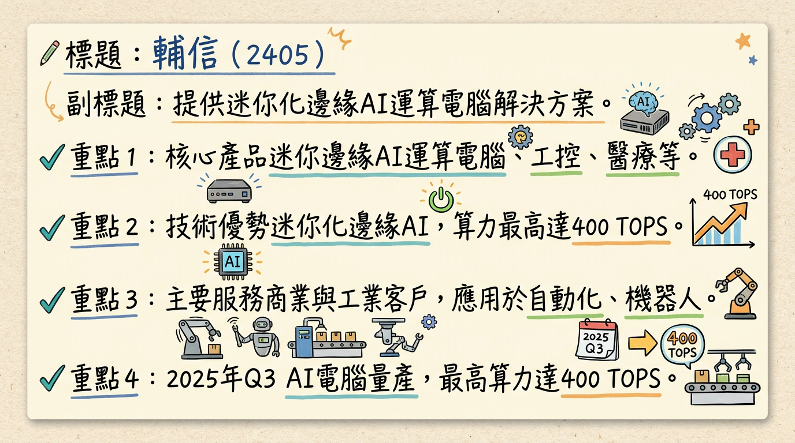
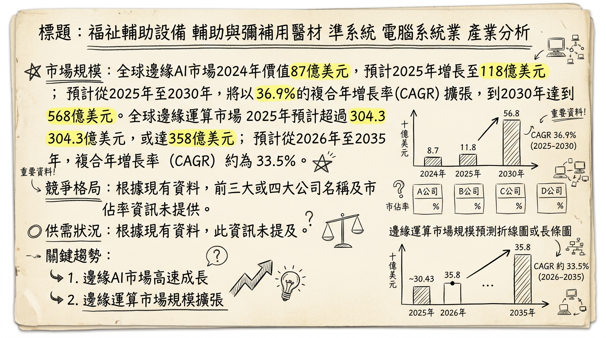
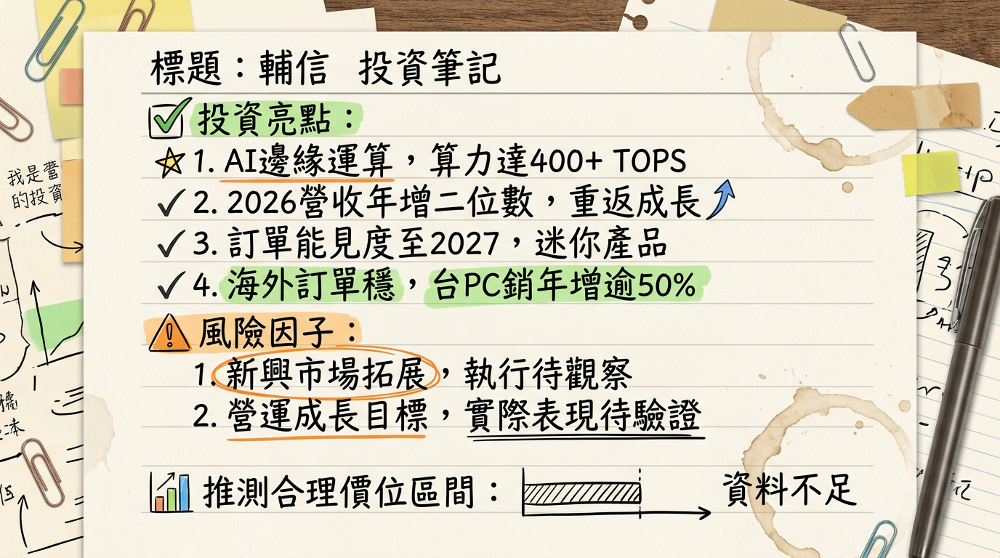

# 2405 輔信 深度研究報告

**今天日期：2026年03月06日**

## 一句話摘要

輔信 (2405) 已成功轉型為迷你化邊緣AI運算解決方案供應商，受惠於全球邊緣AI應用加速落地、產業數位轉型與Windows 10換機潮，2026年營運展望樂觀，管理層預期營收將實現雙位數成長。公司聚焦智慧零售、視訊監控、機器視覺與智慧城市等高潛力應用領域，並透過多元晶片平台與小型化產品策略，有望在快速成長的邊緣AI市場中佔據一席之地。

## 公司概覽

輔信科技 (2405) 前身為準系統廠商浩鑫電腦，於2020年更名後，業務重心已轉向迷你化邊緣AI運算電腦解決方案。其核心業務為開發與製造適用於商業與工業領域的智慧解決方案。

**核心產品與服務：**

*   **迷你化邊緣運算電腦：** 產品線完整，涵蓋基礎運算、特定邊緣任務到高階邊緣AI推論，已推出0.45公升迷你邊緣PC，並規劃開發下一代0.25公升產品。
*   **工業電腦 (IPC)：** 提供高可靠度嵌入式電腦解決方案，應用於工廠自動化、機器人應用、機器視覺等嚴苛環境，2025年台灣市場銷售額年增逾50%。
*   **AI電腦：** 持續推進AI電腦開發，新一代系列已於2025年第三季陸續量產，支援Intel、AMD、NVIDIA三大平台，高階工作站算力最高可達400 TOPS。
*   **數位看板與顯示產品：** 基於雲端的互動式顯示器、數位看板、Kiosk等產品，在日本市場有穩定交付專案。
*   **醫療級產品線：** 透過子公司暄達醫學提供醫材產品與專案服務，出貨穩定。

**營收結構（依地區別，2024年數據）：**

| 地區   | 營收金額 (新台幣) | 佔比 (%) |
| :----- | :---------------- | :------- |
| 歐洲   | 8.01 億元         | 48.06    |
| 美國   | 5.59 億元         | 33.54    |
| 亞洲   | 1.80 億元         | 10.79    |
| 台灣   | 6,393.40 萬元     | 3.84     |
| 其他   | 5,694.10 萬元     | 3.42     |
| 中國   | 608.60 萬元       | 0.37     |
| **合計** | **16.67 億元**    | **100**  |

**製造基地：** 輔信在全球設有子公司，並具備在地組裝與客製化產線，主要位於德國、美國和日本。新建總部大樓預計於2026年投入使用。

## 核心競爭優勢

1.  **迷你化邊緣AI運算領導者：** 專注於開發0.45公升甚至未來0.25公升的超緊湊邊緣PC，在空間受限場域具備獨特優勢，榮獲2026年台灣精品獎。
2.  **多元晶片平台整合能力：** 產品支援Intel、AMD、NVIDIA三大主流晶片平台，並可整合NPU/GPU，提供最高達400 TOPS的AI推論算力，具備高度彈性與客製化能力。
3.  **深耕垂直應用市場：** 透過在地化團隊，將邊緣AI解決方案深入應用於智慧零售、視訊監控、機器視覺、智慧城市、工廠自動化、醫療影像輔助等利基市場，並具備多個成功案例。
4.  **全球化佈局與服務網絡：** 在德國、美國、日本等地設有子公司與組裝客製化產線，能夠提供在地化的快速響應與專案支援服務，有助於承接大型國際專案。
5.  **子公司醫療級產品線支撐：** 子公司暄達醫學的醫療級產品線提供穩定營收，有助於熨平景氣循環波動，並擴大醫療科技應用。

## 財務分析

**月營收趨勢 (最近 6 個月)：**

| 月份   | 金額 (新台幣) | 月增率 MoM (%) | 年增率 YoY (%) |
| :----- | :------------ | :------------- | :------------- |
| 2026年01月 | 1.35 億元     | -1.46          | 14.47          |
| 2025年12月 | 1.37 億元     | -20.61         | 10.62          |
| 2025年11月 | 1.73 億元     | 18.93          | 28.74          |
| 2025年10月 | 1.46 億元     | -8.73          | 3.75           |
| 2025年09月 | 1.60 億元     | 5.51           | 26.45          |
| 2025年08月 | 1.51 億元     | 11.59          | 22.62          |

*註：輔信已連續六個月實現年增正成長，顯示營運韌性。*

**季度數據：**

*   **2025年第四季**
    *   季營收：4.56 億元，季增率 (QoQ) 2.3%，年增率 (YoY) 14.3%。
    *   毛利率、營業利益率、EPS 等詳細數據未公開，預計將於後續財報揭露。
*   **2025年第三季**
    *   季營收：約 4.46 億元 (計算自Q4季增率)。
    *   EPS：0.00 元。
    *   累計EPS (Q1-Q3)：-0.15 元。
    *   毛利率：38.26% (鉅亨網資料)。
    *   營業利益率：-3.61% (鉅亨網資料)。

**年度趨勢：**

*   **2025年全年營收：** 17.42 億元 (實際)，年增率 4.47%。
*   **2024年全年 EPS：** 0.03 元 (實際)。
*   **2025年全年 EPS：** 截至2025年第三季累計EPS為-0.15元。2025年全年EPS明確預估數字目前未找到。

## 法說會重點

**最近一次法說會日期：** 2025年12月1日

**管理層發言與 Guidance：**

*   **2026年營運展望：** 對2026年營運發展持審慎樂觀看法，預期營運將重返成長軌跡，並有望實現**兩位數百分比的年增長**。預計第二季後營運能見度將逐步明朗。
*   **產品策略：** 持續聚焦智慧零售、視訊監控、機器視覺與智慧城市等AI邊緣運算領域，深化軟硬整合能力。邊緣AI PC新產品布局已於2025年底完成，預計2026年第二季啟動新年度產品開發規劃，提前因應主要晶片平台世代更新節奏。
*   **海外專案進展：**
    *   **美國市場：** 企業資料管理與備援應用專案持續出貨，並在醫療與電信通路訂單方面有所推動。部分長期訂單能見度已看到2027年。
    *   **日本市場：** 互動式終端服務機 (Kiosk) 與視訊監控專案交付穩定，藥妝通路應用專案持續出貨，既有監控應用客戶進行產品平台升級，新年度訂單逐步導入新機種。
    *   **歐洲市場：** 儘管受記憶體及部分關鍵零組件價格波動影響，客戶拉貨節奏轉趨保守，但公司持續與客戶協調專案時程與交付規劃。
    *   **亞洲市場：** 台灣工業電腦銷售額年增逾50%，印度與澳洲市場同樣升溫。
*   **供應鏈管理：** 面對記憶體及部分關鍵零組件價格波動，公司採取策略性備貨，並靈活運用多元供應商與規格選項，以維持零組件供應彈性，降低對營運的影響。
*   **新總部大樓：** 已新建總部大樓，預計於2026年投入使用，以擴大營運規模及優化工作環境。
*   **子公司表現：** 子公司暄達醫學出貨穩定。

**產能利用率、資本支出金額：**
*   未提供2024年以後具體產能利用率及資本支出金額數據。

## 券商觀點

目前未找到2025-2026年間有具體券商針對輔信 (2405) 發布目標價或EPS預估的報告。

| 券商名稱 | 目標價 (新台幣) | 評等 | 日期 |
| :------- | :-------------- | :--- | :--- |
| N/A      | N/A             | N/A  | N/A  |

## 財報深度分析

**利潤率趨勢 (季)：**

| 季度    | 毛利率 (%) | 營業利益率 (%) | 稅後淨利率 (%) |
| :------ | :--------- | :------------- | :------------- |
| 2024 Q1 | 40.72      | -1.15          | 5.17           |
| 2024 Q2 | 41.73      | -2.89          | 0.35           |
| 2024 Q3 | 39.86      | -4.15          | -2.42          |
| 2024 Q4 | 41.87      | -4.07          | -1.23          |
| 2025 Q1 | 40.54      | -3.12          | 1.15           |
| 2025 Q2 | 41.11      | -4.42          | -14.96         |
| 2025 Q3 | 38.26      | -3.61          | -0.28          |

**利潤率變化分析：**
輔信的毛利率在40%左右震盪，顯示產品具有一定的競爭力。然而，營業利益率和稅後淨利率在2024年和2025年多數季度呈現負值，主要受外部因素影響，包括美國關稅、美元匯率波動及歐洲經濟復甦緩慢。2025年Q2受業外損失影響，稅後淨利率大幅下降。公司管理層預期隨著邊緣AI PC新產品佈局完成，2026年第二季後營運能見度將逐步明朗，若新產品能順利放量，將有助於優化產品組合並提升獲利表現。

**存貨分析：**
輔信為因應記憶體及部分關鍵零組件價格波動，已採取策略性備貨措施，並透過多元供應商體系維持規格選項的彈性。這顯示公司採取預防性備料以確保供應鏈穩定，而非異常堆積。
*   *備註：近4季存貨金額與存貨週轉天數趨勢、應收帳款週轉天數趨勢，目前未找到2024-2026年具體數據。*

**資本支出：**
輔信已新建總部大樓，預計於2026年投入使用，此為擴大營運規模及優化工作環境的資本支出計畫。公司也將持續擴大工業電腦客戶基礎，並利用各地子公司的在地化組裝、測試與客製化能力，爭取更多專案型合作機會。
*   *備註：近3年資本支出金額與趨勢、預計新增產能、折舊攤銷趨勢，目前未找到2024-2026年具體數據。*

## 股權異動

*   **董監事/大股東申報轉讓：** 未找到2024-2026年最新紀錄。
*   **庫藏股買回：** 未找到2024-2026年最新紀錄。
*   **可轉換公司債 (CB) 發行：** 未找到2024-2026年最新資訊。
*   **現金增資或減資計畫：** 未找到2024-2026年最新計畫。
*   **股利政策：**
    *   2024年度現金股利：0.17元。
    *   除息日：2025年07月03日。
    *   現金股利發放日：2025年07月23日。
    *   以2025年7月1日收盤價15.85元計算，現金股利殖利率為1.07%。
    *   近五年平均現金股利為0.11元，平均現金殖利率為0.62%。

## 產業分析

### 市場規模與趨勢

邊緣AI運算市場正處於高速成長階段，主要動力來自物聯網(IoT)設備、自駕車與智慧基礎設施對即時數據處理的需求，以及5G網路的普及。

*   **全球邊緣運算市場：**
    *   2025年預計市場規模超過304.3億美元，或達358億美元。
    *   2026年預計達到396億美元。
    *   2026年至2035年CAGR約為33.5%；另有預測2026年至2032年CAGR為24.43%。
*   **全球邊緣AI市場：**
    *   2024年價值87億美元，2025年預計增長至118億美元。
    *   2025年至2030年預計以36.9% CAGR擴張，到2030年將達到568億美元。
*   **全球邊緣AI晶片市場：**
    *   2024年達到75億美元。
    *   ABI Research報告指出，2025年邊緣AI晶片組市場規模將達到122億美元，首次超過雲端AI晶片組市場規模。
    *   2025年至2032年CAGR為17.4%，預計到2032年達到271億美元。
*   **工業邊緣運算市場：**
    *   2025年全球市場規模預計達564.6億美元。
    *   並將於2030年增至1062.5億美元，年複合成長率達13.48%。

**供需狀況：** 目前邊緣AI運算產業呈現**需求旺盛、供不應求**的態勢，驅動產業持續投資與發展。MIC指出，由於產業AI運算需求旺盛，將帶動邊緣AI硬體滲透率成長至接近2成。

**產業平均毛利率水準：** 目前未找到2024年以後邊緣AI運算產業或工業電腦產業的平均毛利率水準具體數據。

### 競爭格局

邊緣AI運算和工業電腦領域競爭激烈且分散，主要參與者包括晶片大廠、傳統IPC業者和雲服務提供商。

**主要競爭對手比較：**

| 公司名稱              | 相關領域及影響力                                                                                                                                                                                                     | 輔信 (2405) 優勢/差異點                                                                                                                                                                  |
| :-------------------- | :------------------------------------------------------------------------------------------------------------------------------------------------------------------------------------------------------------------- | :----------------------------------------------------------------------------------------------------------------------------------------------------------------------------------------- |
| **NVIDIA (輝達)**     | 邊緣AI晶片、模組（如Jetson系列），提供強大AI推論算力，主導AI半導體市場。                                                                                                                                              | 輔信是其重要的應用夥伴，專注於提供**小型化、整合性**的邊緣AI電腦解決方案，而非晶片本身。                                                                                              |
| **Intel (英特爾)**    | 推出Gaudi 3 Edge AI處理器，在邊緣AI晶片組市場中佔重要地位，提供OpenVINO等軟體平台。                                                                                                                                    | 輔信亦是Intel平台的合作夥伴，並在**迷你化準系統**設計、特定垂直市場應用上形成差異。                                                                                                   |
| **Qualcomm (高通)**   | Edge AI 100加速器晶片系列，專注於超低功耗NPU，實現物聯網和穿戴式裝置即時推論。                                                                                                                                        | 輔信可將高通的低功耗晶片整合至其超小型化產品中，擴展物聯網節點應用。                                                                                                                     |
| **研華 (Advantech)**  | 工業電腦(IPC)領域全球領導廠商，也推出中高階算力AI Box產品，客戶群廣泛。                                                                                                                                               | 輔信的差異化在於其**「迷你化」**和**「準系統」**解決方案，更專注於機器人視覺、醫療及利基邊緣AI等特定應用，提供彈性客製方案。                                                      |
| **Amazon Web Services (AWS)** | 提供雲端服務與IoT解決方案，利用AWS IoT在邊緣部署AI。                                                                                                                                                               | 輔信提供**地端邊緣硬體**解決方案，可與雲端服務商的平台整合，作為其生態系中的硬體供應商。                                                                                               |
| **Microsoft (微軟)**  | 透過Azure AI提供AI解決方案，部署和管理跨邊緣裝置的模型。                                                                                                                                                               | 同AWS，輔信作為其**地端邊緣硬體供應商**，協助將AI模型高效運行於實體邊緣設備。                                                                                                        |
| **輔信 (2405)**         | 迷你化邊緣AI運算電腦解決方案供應商，產品支援Intel、AMD、NVIDIA三大平台，從0.45L到規劃0.25L超小型PC，高階工作站算力最高400 TOPS。專注智慧零售、機器視覺、醫療等垂直市場。                                                   | **優勢：** 獨特的迷你化設計能力、多平台整合彈性、深耕利基垂直市場的解決方案經驗、全球在地化服務能力。 **劣勢：** 相較於大型業者，品牌知名度、規模經濟、研發資源投入可能較小。 |

*   *備註：目前未找到輔信與主要競爭對手在產能、客戶、價格等方面的直接具體比較資料。也未找到輔信及其台灣同業的最新營收規模、毛利率、EPS直接對比資料。*

### 產業趨勢

1.  **邊緣AI晶片算力提升與模型優化：**
    *   **趨勢：** 邊緣AI晶片算力持續增強，且AI模型壓縮與量化運算技術進步，使小型模型能在有限資源的邊緣設備上高效運行。
    *   **影響：** 邊緣裝置具備更強大的本地AI推論能力，大幅降低對雲端運算的依賴，減少延遲與頻寬成本。這加速了智慧工廠、智慧醫療等領域的AI落地，提升即時決策力與數據安全。
    *   **對輔信影響：** **機會** - 輔信可整合最新高效能、低功耗邊緣AI晶片，持續提升其迷你化產品的算力與能效，鞏固技術領先地位，滿足市場對高性能邊緣AI的需求。

2.  **5G網路普及與物聯網 (IoT) 設備激增：**
    *   **趨勢：** 全球5G網路持續推廣，IoT設備數量爆發性增長，為邊緣運算提供高速、低延遲的連接基礎和海量數據來源。
    *   **影響：** 5G與IoT的融合促使更多數據在邊緣產生並被即時處理，推動製造業、醫療保健、零售等行業對邊緣AI解決方案的強勁需求。
    *   **對輔信影響：** **機會** - 輔信的邊緣運算解決方案是IoT/IIoT實現智能化的核心組件，能直接受惠於5G和IoT的廣泛部署，擴大其產品應用範圍和市場滲透率。

3.  **Windows 10 終止支援與AI PC換機潮：**
    *   **趨勢：** Windows 10將逐步終止支援，加上AI晶片普遍整合NPU，預期將帶動企業與個人用戶對AI PC的換機需求。
    *   **影響：** AI PC市場將迎來爆發性成長，帶動邊緣運算相關硬體需求。
    *   **對輔信影響：** **機會** - 儘管輔信不主攻消費級AI PC，但在商用/工業級AI PC或特定邊緣工作站領域，其迷你化、高效能、多平台支援的產品線有望抓住企業換機潮中的利基市場需求。

**相關投資題材連結：**
*   **AI (人工智慧) / 邊緣運算 (Edge Computing)：** 輔信的業務核心即是「迷你化邊緣AI運算電腦解決方案」，直接受惠於邊緣AI市場的爆發性成長。
*   **AI PC：** 雖然非消費級AI PC，但輔信的邊緣AI電腦可視為專業級或工業級AI PC，受惠於AI算力下放至終端的趨勢及Windows 10換機需求。
*   **物聯網 (IoT) / 工業物聯網 (IIoT)：** 輔信的迷你邊緣運算電腦和工業電腦是IoT/IIoT實現智慧化、自動化的關鍵硬件，與此題材高度結合。
*   **5G：** 作為邊緣運算和邊緣AI發展的基礎設施，5G網路的普及直接支持輔信解決方案在需要即時數據傳輸處理場景的應用。

## 近期催化劑

**利多事件：**

*   **2026年01月營收強勁：** 2026年1月合併營收達1.35億元，年增14.47%，已連續六個月實現年增正成長，展現營運韌性。
*   **2025年全年營收成長：** 2025年全年合併營收達17.42億元，年增4.47%，繳出全年正成長成績單。
*   **2026年營運展望樂觀：** 管理層預期2026年營收可望年增二位數百分比，營運能見度預計第二季後逐步明朗。
*   **AI邊緣運算產品布局完善：** 輔信已於2025年底前完成多數邊緣AI PC產品開發，並規劃2026年第二季啟動新年度產品開發，持續領先晶片平台世代更新。
*   **榮獲台灣精品獎：** 旗下SPC系列工業級邊緣AI電腦新品榮獲2026年台灣精品獎，肯定其產品創新與競爭力。
*   **海外專案持續推進：** 美國企業資料管理與備援應用、日本互動式終端服務機與藥妝通路、既有監控應用客戶產品平台升級訂單穩定且導入新機種，部分訂單能見度已看到2027年。
*   **新總部大樓啟用：** 新建總部大樓預計2026年投入使用，擴大營運規模並優化工作環境。
*   **與KIOSK Information Systems合作：** KIOSK Information Systems選擇AOPEN為HIMSS 2026提供關鍵任務醫療解決方案 (2026年02月19日)。

**利空事件：**

*   **記憶體及關鍵零組件價格波動：** 記憶體及部分關鍵零組件價格波動影響客戶出貨安排，歐洲市場客戶拉貨節奏轉趨保守，短期內可能影響單季營收表現。
*   **法人賣超壓力：** 近一個月 (2026年02月03日至2026年03月04日) 外資累計賣超較多，顯示法人對短期展望或評價持謹慎態度。

**外資/投信近期買賣超張數 (2026年02月03日 - 2026年03月04日)：**

| 日期         | 外資買賣超 (張) | 投信買賣超 (張) | 自營商買賣超 (張) | 總計買賣超 (張) |
| :----------- | :-------------- | :-------------- | :-------------- | :-------------- |
| 2026年03月04日 | -278            | 0               | 0               | -278            |
| 2026年03月03日 | -607            | 0               | 0               | -607            |
| 2026年02月26日 | -180            | 0               | -7              | -187            |
| 2026年02月25日 | -41             | 0               | 0               | -41             |
| 2026年02月24日 | -217            | 0               | 1               | -216            |
| 2026年02月23日 | 685             | 0               | 0               | 685             |
| 2026年02月11日 | -12             | 0               | 2               | -10             |
| 2026年02月10日 | 341             | 0               | 3               | 344             |
| 2026年02月09日 | 13              | 0               | -35             | -22             |
| 2026年02月06日 | -828            | 0               | 0               | -828            |
| 2026年02月05日 | 103             | 0               | 32              | 135             |
| 2026年02月04日 | 101             | 0               | 2               | 103             |
| 2026年02月03日 | -68             | 0               | 3               | -65             |

## ⭐ 成長動能時間軸

*   **2025年第三季：**
    *   新一代AI電腦系列陸續量產，支援Intel、AMD、NVIDIA三大平台。
*   **2025年底：**
    *   完成多數邊緣AI PC產品開發，以保持產品線完整性。
    *   美國企業資料管理與備援應用專案、日本Kiosk與藥妝通路專案訂單啟動出貨，並延續至2026年第三季。
*   **2026年：**
    *   **總部大樓啟用：** 新建總部大樓預計投入使用，擴大營運規模及優化工作環境。
    *   **新年度產品開發：** 預計第二季啟動新年度產品開發規劃，提前因應主要晶片平台世代更新節奏。
    *   **產品小型化推進：** 持續因應客戶需求打造下一代0.25公升迷你邊緣PC產品。
    *   **垂直應用深化：** 持續聚焦智慧零售、視訊監控、機器視覺與智慧城市等領域，深化軟硬整合能力。
    *   **新市場拓展：** 公司計劃將更多資源投入東南亞與新興市場，看好無人化與智慧場域帶起的AI與邊緣運算需求。
    *   **訂單能見度：** 部分客戶專案訂單能見度已看到2027年。
*   **2026年第二季後：**
    *   營運能見度逐步明朗，預期新年度專案陸續放量，帶動營收成長。

## 2026 展望

**成長動能：**

1.  **邊緣AI市場爆發式成長：** 全球邊緣AI市場預計在2025-2030年以36.9%的CAGR擴張，輔信作為迷你化邊緣AI解決方案供應商，直接受惠於此趨勢。
2.  **管理層樂觀指引：** 管理層預期2026年營收將實現**兩位數百分比的年增長**，顯示對公司轉型成果與未來訂單的高度信心。
3.  **產品競爭力提升：** 新一代AI電腦系列已量產，產品線支援三大平台且具備高算力，小型化產品設計符合市場利基需求，榮獲台灣精品獎肯定。
4.  **全球專案落地加速：** 美、日市場長期專案訂單持續出貨，亞洲市場（台灣IPC、印度、澳洲）成長亮眼，並積極拓展東南亞與新興市場，海外營收貢獻可期。
5.  **產業換機潮與數位轉型：** Windows 10終止支援、代理式AI興起及模型小型化趨勢，將持續推動對AI PC與邊緣AI運算的需求，加速各產業的數位轉型。

**風險：**

1.  **競爭加劇：** 邊緣AI運算市場潛力大，將吸引更多國內外業者投入，可能導致價格競爭與技術快速迭代壓力。
2.  **訂單延續性與新應用落地速度：** 輔信營運高度依賴專案型訂單，其延續性及新應用市場的實際落地速度，將直接影響未來營收成長幅度。
3.  **供應鏈波動與成本壓力：** 記憶體及部分關鍵零組件價格波動，雖有策略性備貨因應，仍可能影響客戶拉貨節奏，對短期毛利率與營運造成挑戰。
4.  **總體經濟不確定性：** 全球政經環境不確定性、美國關稅、美元匯率波動及歐洲經濟復甦緩慢等外部因素，仍是影響公司獲利表現的關鍵變數。
5.  **獲利能力待提升：** 2025年前三季累計EPS仍為負值，若新產品放量速度不如預期或費用控制不佳，可能影響2026年轉虧為盈的進度。

## 投資結論

1.  **明確轉型與市場契合度高：** 輔信成功轉型為迷你化邊緣AI運算解決方案供應商，其產品線高度契合全球邊緣AI、AIoT與智慧應用市場的爆發性成長趨勢，具備中長期成長潛力。
2.  **2026年營收成長動能強勁：** 管理層預期2026年營收將實現兩位數百分比成長，加上美日海外專案訂單能見度高，且積極拓展新興市場，營收展望樂觀。
3.  **產品差異化與技術優勢：** 在迷你化邊緣PC設計、多平台晶片整合能力及垂直應用解決方案方面具備競爭優勢，榮獲台灣精品獎肯定其創新實力。
4.  **短期獲利承壓，但營運效率改善可期：** 儘管2025年獲利受外部因素影響，但公司積極應對供應鏈挑戰並投入新產品開發，若新產品能在2026年第二季後順利放量，配合嚴謹的費用管控，有望逐步改善利潤率並實現轉虧為盈。
5.  **投資目標價區間建議：** 考量邊緣AI市場的長期成長潛力、公司2026年營收雙位數成長的指引，以及未來若能成功改善獲利能力，輔信有望獲得市場重估。若公司能如期實現營收成長並同步提升獲利水準，預期其股價將有重新評價的空間，**目標價區間建議為新台幣 25 - 30 元**，此區間反應了市場對AI題材的溢價及公司未來潛在的獲利成長動能。

本報告由 AI 自動產生，資料來源為公開網路資訊，僅供參考，不構成投資建議。產生時間：2026-03-06 13:02

---

## 📊 資訊卡

