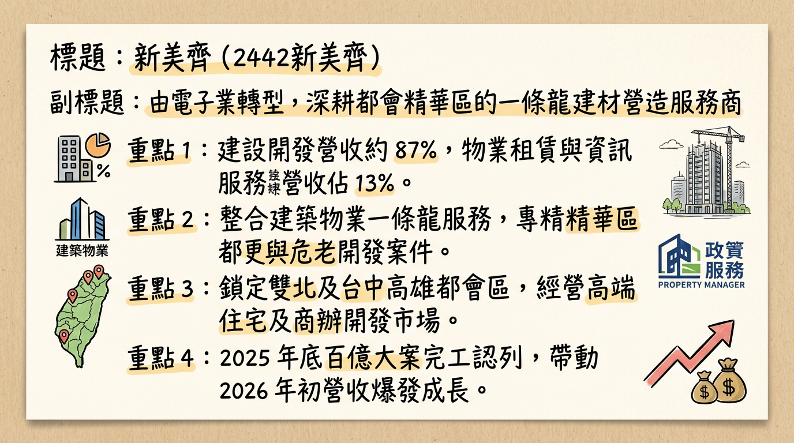
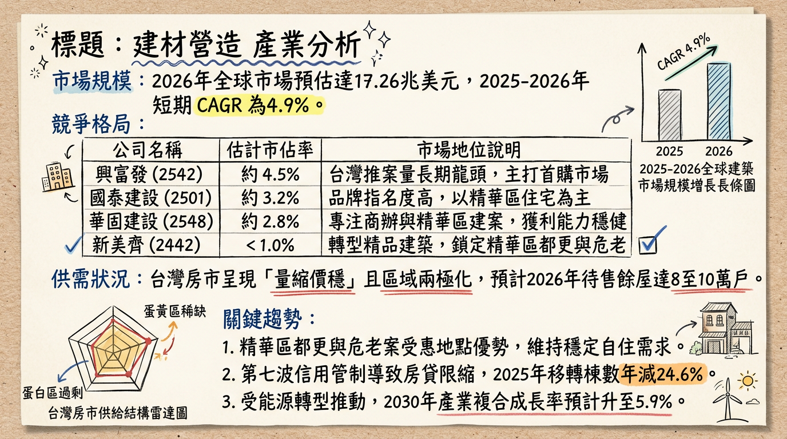
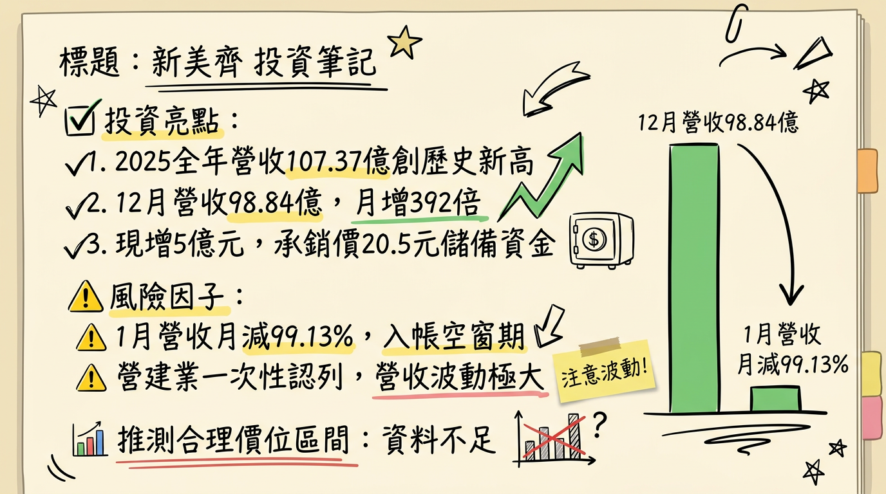

# 2442新美齊 新美齊 深度研究報告

## 一句話摘要
新美齊（2442）正迎來史上最強「入帳大爆發期」，受惠於板橋百億都更案「画世代」於 2025 年底進入交屋高峰，帶動營收與獲利跳躍式成長，2025 年 EPS 有望挑戰 7-8 元歷史新高，2026 年則由「The Top」接棒支撐業績。

---

## 公司概覽
新美齊原為電子業，現已成功轉型為精緻營建與物業管理商。公司採取「建築、物業、保全、資訊」一條龍服務模式，專注於雙北及台中核心精華區之都更與危老重建。

### 業務營收結構 (2025 H1)
| 業務板塊 | 佔比 | 核心內容 |
| :--- | :--- | :--- |
| **建設本業** | 87% | 不動產開發、銷售、都更案認列 |
| **物業與資訊服務** | 13% | 酒店式公寓租賃、保全、CRM系統 |

---

## 核心競爭優勢
1.  **高週轉都更模式**：專注於高價值的精華區（蛋黃區），規避蛋白區供過於求風險，銷售率極高（画世代 98%、The Top 100%）。
2.  **品牌溢價與一條龍服務**：整合旗下保全與物業管理，提供酒店式住宅體驗，帶動毛利率優於同業平均。
3.  **精準選地能力**：在建與儲備資產達 **215.5 億元**，包含台中七期、新店裕隆城、北投洲美等熱門地段。

---

## 財務分析

### 近 6 個月月營收趨勢
| 月份 | 營收金額 (百萬元) | 月增率 MoM | 年增率 YoY | 備註 |
| :--- | :--- | :--- | :--- | :--- |
| **2026/01** | 86.14 | -99.13% | -58.05% | 12月基期過高所致 |
| **2025/12** | **9,884.00** | **+39,299.88%** | **+2,031.99%** | **「画世代」密集入帳** |
| **2025/11** | 25.09 | +13.13% | +46.95% | 入帳前期 |
| **2025/10** | 22.18 | -62.43% | +25.77% | - |
| **2025/09** | 59.03 | +187.82% | +270.63% | - |
| **2025/08** | 20.51 | +42.72% | -78.43% | - |

### 季度數據趨勢
*   **2025 全年營收**：**107.37 億元**（年增 881%）。
*   **2025 EPS 預估**：法人普遍預估介於 **3.15 元至 8.0 元**（取決於 12 月營收結算進度）。
*   **2026 EPS 展望**：預估落在 **4.0~4.5 元**。

---

## 法說會重點 (2025/10/07)
*   **「畫世代」進度**：總銷 **146~148.5 億元**（新美齊分回約 89 億元），2026 Q1 前目標完成全數交屋。
*   **「The Top」進度**：總銷 **39.4 億元**，已 100% 完銷，預計 2026 Q4 入帳。
*   **經營策略**：採「先開工、後銷售」以應對政策不確定性，並將加大「商辦」開發比重以分散住宅限制。
*   **毛利指引**：管理層設定長期毛利率目標為 **30%~35%**。

---

## 券商觀點
| 券商名稱 | 報告日期 | 評等 | 目標價 | 備註 |
| :--- | :--- | :--- | :--- | :--- |
| **台新投顧** | 2025/10/16 | 看多 | **30 元** | 看好「画世代」入帳爆發力 |
| **營建產業研究** | 2025/03/23 | 中立 | **26 元** | 較早期數據，現供參考 |
| **CMoney 法人** | 2026/01/12 | 謹慎 | **未提供** | 關注 2027 入帳空窗風險 |

---

## 財報深度分析

### 利潤率趨勢表格 (%)
| 季度 | 毛利率 | 營業利益率 | 稅後淨利率 | 關鍵驅動 |
| :--- | :--- | :--- | :--- | :--- |
| **2025 Q3** | **59.28** | 21.10 | 21.65 | 餘屋銷售與業外收益 |
| **2025 Q2** | 34.59 | 20.36 | 20.00 | 穩定去化 |
| **2024 Q4** | 35.95 | 20.77 | 28.80 | 高基期認列 |

*   **存貨分析**：截至 2025 Q3 存貨金額 **224.54 億元**，顯示儲備案量充足。
*   **財務健康度**：負債比 80.47% 為開發期常態，隨百億資金回籠，2026 年負債比將優化。

---

## 股權異動與資本結構
1.  **內部人信託**：2026/02/25 經理人申報轉讓（鮑凱行 320 張、陳繼宇 150 張等）至台新受託專戶，屬**信託財務規劃**而非市場拋售。
2.  **現金增資**：2026/01 完成 5 萬張新股現增，承銷價 **20.5 元**。
3.  **可轉債 (CB)**：新美齊四 (24424) 轉換價自 2026/01/27 起調整至 **25.3 元**。

---

## 產業分析
台灣房市受央行「第七波信用管制」影響進入盤整，但「蛋黃區都更案」具備強勁抗跌性。

### 競爭對手比較 (2025 預估)
| 公司名稱 | 2025 預估營收 | 預估 EPS | 毛利率水準 | 核心動能 |
| :--- | :--- | :--- | :--- | :--- |
| **新美齊 (2442)** | **107.37 億** | **7.0 - 8.0 元** | **35%** | **板橋百億大案完工** |
| **華固 (2548)** | ~190 億 | 10.15 元 | ~30% | 商辦與大型住宅案 |
| **長虹 (5534)** | ~130 億 | ~9.0 元 | ~28% | 廠辦認列穩定 |

---

## 近期催化劑
*   **✅ 利多：** 2025 年 12 月營收創歷史新高，確立年度獲利爆發。
*   **✅ 利多：** 「The Top」三重案預計 2026 年底交屋，接續成長動能。
*   **❌ 利空：** 2026 年 1 月營收月減 99%，引發市場對一次性入帳後動能的疑慮。
*   **❌ 利空：** 2027 年目前預估為入帳空窗期，需關注新案取得進度。

---

## ⭐ 成長動能時間軸
*   **2025 Q4 - 2026 Q1**：「新美齊-画世代」百億元案量密集入帳，推升 EPS 至歷史高點。
*   **2026 H1**：取得 5 筆新案建照（三重頂崁、高雄齊功、新店寶元、台中七期、北投新洲美）。
*   **2026 Q4**：「新美齊-The Top」（39.4 億）完工入帳，支撐 2026 全年獲利。
*   **2027**：預計入帳空窗期（市場估算風險期）。
*   **2028**：「台中 14 期仁平段」（29.6 億）預計完工，重啟增長。

---

## 2026 展望
*   **成長動能**：2026 年將呈現「前高後穩」趨勢，上半年消化「画世代」尾款，下半年由三重案銜接。毛利率受惠於高價案認列可維持在 30% 以上。
*   **風險因子**：營建成本上揚（碳費與土方新制）、2027 年入帳斷層風險。

---

## 投資結論
1.  **業績噴發期**：2025 年營收破百億，2026 年獲利仍將維持在每股 4 元以上的高標，目前評價仍具備殖利率想像空間。
2.  **存貨價值高**：逾 200 億的存貨多位於雙北精華區，抗政策風險能力強。
3.  **操作建議**：
    *   **目標價區間**：**25.3 - 30.0 元**（以 2026 EPS 4 元給予 6.5-7.5 倍 PE 估算，並參考現增與 CB 轉換價）。
    *   **進場策略**：20.5 元現增價附近具強支撐，26 元（CB 轉換壓力區）若放量突破則可加碼。

---
**本報告由 AI 自動產生，資料來源為公開網路資訊，僅供參考，不構成投資建議。產生時間：2026-03-01 21:29**

---

## 📊 資訊卡

