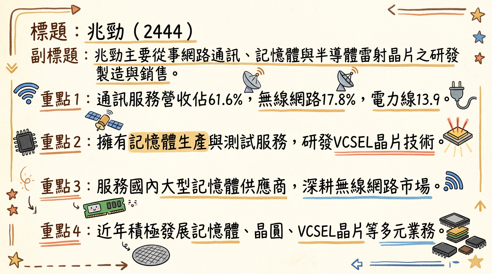
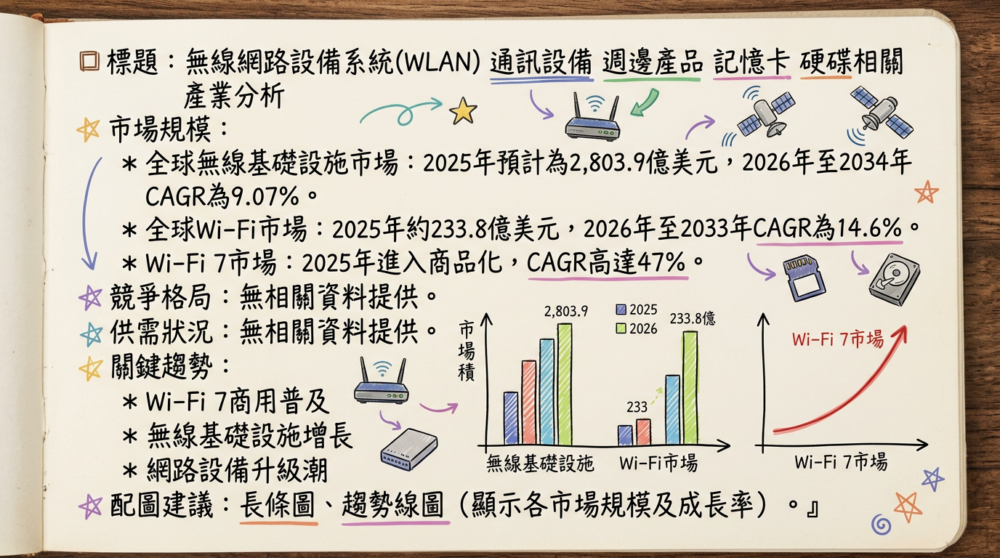
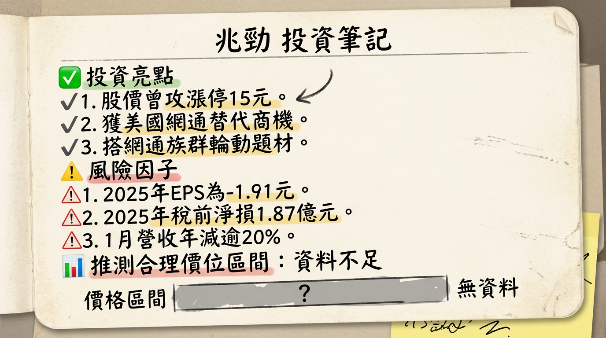

# 2444 兆勁 深度研究報告

## 一句話摘要
兆勁 (2444) 正積極從傳統網通業務轉型，佈局高毛利記憶體、VCSEL晶片及非網通創新應用（智能家居、醫療醫美、移動能源）。儘管短期營運面臨虧損擴大及毛利率壓力，長期成長動能繫於新事業的加速落地，特別是2026年起出貨的新興移動能源與醫療醫美產品，輔以網通設備替代商機的題材性支撐。

## 公司概覽
兆勁科技股份有限公司（2444），成立於1995年，原名友旺科技。公司主要從事各式數位、數據網路通訊資訊、視聽電子產品、記憶體產品及筆記型電腦週邊設備之研究、開發、生產、製造及銷售。近年來積極拓展多角化業務，包含半導體減薄再生晶圓設備及光速光通訊雷射晶片。

### 核心產品與服務
*   **無線網路設備：** 網路卡、Wi-Fi 模組、電力線通訊、無線藍芽通訊服務相關產品。
*   **記憶體事業：** 記憶體模組、晶圓 Die (Wafer Die)、NAND Flash 晶片測試與銷售。
*   **先進精密製造事業：** 包含晶圓研磨。
*   **先進雷射晶片事業：** VCSEL 晶片 (光通訊雷射晶片) 研發。

### 營收結構 (2025年預估)
| 業務類別   | 營收佔比 (約) |
| :--------- | :------------ |
| 通訊服務   | 61.6%         |
| 無線網路   | 17.8%         |
| 電力線通訊 | 13.9%         |
| 其他業務   | 未明確列出    |

### 製造基地
兆勁科技註冊地及主要營運據點位於新竹科學園區苗栗縣竹南鎮科研路50-8號2樓及苗栗縣竹南鎮友義路77號。公開資料**未找到2024-2026年各製造基地的營收貢獻比例**。

## 核心競爭優勢
*   **記憶體產業深耕：** 與韓國海力士保持合作，並與金士頓建立業務，已跨入資料中心、雲端應用的伺服器記憶體產品領域，並積極關注HBM供應鏈。
*   **VCSEL晶片研發潛力：** 子公司兆通光電在化合物半導體與VCSEL晶片領域的專利成果，具備長期在高科技光通訊市場的佈局潛力。
*   **非網通多元轉型：** 積極發展消費性智能產品、醫療與醫美應用及新興移動能源三大成長引擎，以優化營收結構並降低對傳統網通的依賴。
*   **網通利基市場聚焦：** 網通業務轉向高毛利的工業與醫療利基市場，並與主要客戶達成新合作協議，期望提升獲利能力。

## 財務分析
### 月營收趨勢 (單位：億元)
| 月份   | 金額 (億元) | 月增率 MoM | 年增率 YoY |
| :----- | :---------- | :--------- | :--------- |
| 2026年01月 | 0.78        | -42.27%    | -20.41%    |
| 2025年12月 | 1.34        | 151.24%    | 31.22%     |
| 2025年11月 | 0.53        | -28.47%    | -60.35%    |
| 2025年10月 | 0.75        | -26.86%    | -52.69%    |
| 2025年09月 | 1.02        | 20.79%     | -10.19%    |
| 2025年08月 | 0.85        | -1.74%     | -43.65%    |

### 季度數據 (2025年)
| 季度     | 季營收 (累計至9月) | 毛利率   | 營業利益率 | EPS (元) |
| :------- | :----------------- | :------- | :--------- | :------- |
| 2025年第三季 | 8.73億元           | -0.65%   | -26.73%    | -0.46    |

### 年度營收與 EPS (單位：億元/元)
| 年度   | 全年營收 (億元) | EPS (元)      |
| :----- | :-------------- | :------------ |
| 2024年 (實際) | 13.93           | -0.24         |
| 2025年 (實際) | 11.36           | -1.91 (全年) |
| 2025年 (預估) | 11.46           | -1.54 (Q3累計) |

## 法說會重點 (2025年10月20日)
*   **營運概況：** 2025年上半年營運面臨顯著挑戰，營收持續下滑，毛利率大幅壓縮，虧損擴大。2025年Q2營收為3.07億元，季增4.48%、年減5.62%；毛利率1.3%，較去年同期8%下滑。
*   **網通業務策略轉型：** 公司目標調整網通業務營收結構，鎖定工業與醫療等高門檻利基市場，以毛利導向優化產品組合。
*   **IoT無線藍牙溫度感測器：** 佔整體營收約38.99%。最大客戶營收貢獻年減約37.96%，毛利率明顯下降。公司已與該客戶達成新合作協議，將從原本兩家代工廠縮減為僅由兆勁單一供應，預期2026年相關營收將優於2025年。
*   **其他網通產品：** PLC智能插頭佔營收比重30.55%、工業級Wi-Fi/LTE Router佔15.81%、醫療影音傳輸模組佔12.42%，這三項產品線營收均維持穩定，但因匯率變動導致毛利率下滑。
*   **非網通三大成長引擎 (2026年展望)：**
    *   **消費性智能產品：** 開發智能精油噴霧器，結合Wi-Fi遠端控制。
    *   **醫療與醫美應用：** 開發結合RF、光療、電療與超聲霧化技術的手持醫療器材，預計2026年年中推出。
    *   **新興移動能源：** 已取得中國大型電動自行車品牌充電模組訂單，預計2026年1月開始出貨，有望成為成長最快的領域。
*   **產能利用率/資本支出：** 法說會未提供2025-2026年最新產能利用率及資本支出金額資料。

## 券商觀點
**目前未找到2025-2026年兆勁(2444)的最新券商目標價及評等資料。**

| 券商名稱 | 目標價 (元) | 評等 | 日期 | 備註 |
| :------- | :---------- | :--- | :--- | :--- |
| **無**   | **無**      | **無** | **無** | **未找到2025-2026年最新券商目標價資料** |

CMoney法人機構平均預估兆勁(2444) **2025年度稅後純益100億元、預估EPS將落在10.81~13.45元之間。** (此預估與公司實際財報顯著不符，應為資料異常或法人對未來業務發展極度樂觀的長期預期，需審慎看待)。**未找到2026年EPS預估數字。**

## 財報深度分析
### 利潤率趨勢 (2025年H1與2024年同期比較)
| 產品線           | 2025年H1營收 (仟元) | 2024年H1營收 (仟元) | 營收年增率 | 2025年H1毛利率 | 2024年H1毛利率 | 毛利年增率 |
| :--------------- | :------------------ | :------------------ | :--------- | :------------- | :------------- | :--------- |
| 醫療影音傳輸模組 | 95,375              | 81,443              | 17.11%     | 21.99%         | 28.51%         | -22.88%    |
| PLC智能插頭      | 234,664             | 192,917             | 21.64%     | 6.93%          | 11.77%         | -41.09%    |

**利潤率變化原因分析：** 綜合資料顯示，利潤率下降主要歸因於市場競爭加劇、產品售價壓力、原物料成本上升以及匯兌損失等負面因素。公司正透過產品組合調整，鎖定高毛利利基市場，以期改善整體獲利表現。

### 存貨與營運週轉趨勢
| 年度/季別 | 應收帳款收現(天) | 存貨週轉(天) | 營運週轉(天) |
| :-------- | :----------------- | :--------------- | :--------------- |
| 2025Q3    | 38.95              | 105.33           | 144.28           |
| 2025Q2    | 42.51              | 109.29           | 151.8            |
| 22025Q1   | 42.94              | 133.31           | 176.25           |
| 2024Q4    | 38.39              | 108.57           | 146.96           |

*   **存貨分析：** 2025年Q1存貨週轉天數較高，隨後兩季有所下降，顯示存貨去化速度有改善。然而，公司毛利率為負，顯示去化存貨可能面臨跌價損失壓力。
*   **應收帳款週轉：** 2025年前9個月累積應收帳款收現天數為45.58日，整體在合理範圍內，但需持續關注應收帳款品質。
*   **負債比率：** 2025年第三季負債比為54.23%，較前一季上升。
*   **自由現金流量：** 2025年第三季自由現金流為73,980仟元。由於僅有單季數據，無法判斷長期趨勢，但公司目前處於虧損狀態，現金流健康狀況仍需密切關注。
*   **業外收支：** 2025年上半年虧損擴大受匯兌損失等負面因素影響，顯示匯率波動對公司獲利具潛在風險。

### 資本支出與產能
**未找到2024-2026年兆勁具體的資本支出金額、趨勢及未來擴廠計畫。**
2025年第三季折舊為18,911仟元，攤銷為2,301仟元，此為單季數據，無法判斷長期趨勢。

## 股權異動
*   **董監事/大股東申報轉讓：** 兆勁在2017年以後**未有新的董監事或大股東申報轉讓紀錄**。
*   **庫藏股買回：** **未找到2024-2026年兆勁庫藏股買回的相關紀錄**。
*   **可轉換公司債 (CB)：** **未找到2024-2026年兆勁發行可轉換公司債的相關資訊**。
*   **現金增資或減資：** **未找到2024-2026年兆勁現金增資或減資計畫的相關資訊**。
*   **股利政策：** 兆勁董事會於2026年3月3日決議，**2025年度不分派任何股利 (0元)**。2024年股利亦為0元。

## 產業分析
### 產業市場規模與成長率
| 產業領域     | 2025年市場規模 (預估) | 2026年市場規模 (預估) | 2026-20XX年 CAGR | 備註           |
| :----------- | :-------------------- | :-------------------- | :--------------- | :------------- |
| **無線基礎設施** | 2,803.9億美元         | 3,123.2億美元         | 9.07% (至2034年) |                |
| **Wi-Fi市場**  | 184.8億美元           | 210.6億美元           | 13.94% (至2031年) | Wi-Fi 7 CAGR高達47% |
| **半導體記憶體** | 1,189億美元           | 1,277億美元           | 7.4% (至2035年)  | 2025年整體記憶體市場接近2,231億美元，年增34.8% |
| **DRAM市場**   | 1,061.6億美元 (2025年) |                       | 6.5% (至2033年)  | 2026年DRAM價格預計上漲超過70% |
| **VCSEL晶片**  | 30.7億美元            | 36.6億美元            | 19.45% (至2034年) |                |

### 供需狀況
*   **無線網路設備：** 市場需求受到5G、IoT擴展、Wi-Fi 7商用化及AI數據中心對高速網路設備需求推動，**整體而言正經歷升級週期，需求成長。**
*   **記憶體 (DRAM & NAND Flash)：** 由於AI需求（特別是HBM）大量消耗產能，導致DRAM、NAND Flash等產品供給不足。**市場處於「超級循環」中的供不應求狀態，預計延續至2026年。**
*   **VCSEL晶片：** AI基礎設施、ADAS、下一代通訊、工業智能化及3D感測應用推動需求。**整體市場需求強勁，處於成長階段。**

### 產業平均毛利率水準
*   **無線網路設備/VCSEL晶片：** **未找到2024-2026年的最新產業平均毛利率數據。**
*   **記憶體模組：** 未找到最新產業平均毛利率。參考同業威剛2025年第四季毛利率跳增至48.41%，全年平均27.81%。預期模組廠毛利率在2026年下半年低成本庫存消化完畢後將回歸常態。

### 競爭格局
**全球主要廠商 (非市佔率排序)**
| 產業領域       | 主要廠商                                    |
| :------------- | :------------------------------------------ |
| **無線基礎設施** | 華為、三星、愛立信、諾基亞、思科            |
| **Wi-Fi 設備**   | 思科、HPE-Aruba、TP-Link、F5、Ubiquiti      |
| **半導體記憶體** | 三星電子、SK海力士、美光科技、鎧俠、西部數據 |
| **VCSEL晶片**  | Lumentum Holdings、ams OSRAM、Coherent Corp.、濱松光子、博通 |

**兆勁 vs. 主要競爭對手：** 由於兆勁業務多元且各領域都有大型國際或本土競爭者，直接進行全面具體比較不易。兆勁可能在特定利基市場、與台灣供應鏈整合或成本效益方面尋求競爭優勢。

**台灣同業比較 (營收規模、毛利率、EPS 對比)**
| 公司名稱 | 產業領域   | 2025年營收 (億元) | 2025年毛利率 | 2025年EPS (元) |
| :------- | :--------- | :---------------- | :----------- | :------------- |
| 兆勁 (2444) | 多元       | 11.36             | -0.65% (Q3)  | -1.91 (全年)  |
| 威剛 (3260) | 記憶體模組 | 530.87            | 27.81%       | 23.18          |
| _註：與威剛相比，兆勁在記憶體模組領域的營收規模和獲利能力仍有顯著差距。網通/VCSEL領域尚無可直接比較之台灣同業公開數據。_ |

### 產業趨勢
1.  **AI驅動的高效能運算與記憶體需求爆發：** AI模型訓練推升HBM及DDR5等高頻寬、大容量記憶體需求，導致市場供不應求與價格上漲。AI數據中心亦推動VCSEL光互連模組需求。
2.  **5G/6G與Wi-Fi 7技術普及，帶動網通設備升級：** Wi-Fi 7進入商品化，提供超高速、低延遲連網，適應XR、4K/8K串流等應用。企業WLAN更新、數據中心頻寬升級（800G/1.6T交換器）為網通設備帶來成長。
3.  **矽光子技術的大規模商轉與「光進銅退」：** 傳統銅線傳輸逼近物理極限，矽光子（CPO）技術將於2026年大規模商轉，成為資料中心高速光通訊主流，為光學元件及VCSEL晶片帶來龐大商機。

### 對兆勁的機會與威脅
*   **機會：**
    *   **記憶體超級循環：** AI/HBM需求帶動記憶體價格上漲及供不應求，兆勁記憶體事業可望受惠。
    *   **網通設備升級潮：** Wi-Fi 7、5G/6G及網通設備替代商機為其無線網路業務帶來成長契機。
    *   **VCSEL晶片應用擴展：** AI數據中心、3D感測、車載LiDAR等領域的強勁需求，有望推動其VCSEL晶片研發成果商業化。
    *   **非網通新業務成長：** 消費性智能產品、醫療與醫美應用及新興移動能源 (電動自行車充電模組) 提供新的營收動能。
*   **威脅：**
    *   **記憶體供需反轉點：** 市場可能在2026年底至2027年初回歸供需平衡，面臨價格下行壓力。
    *   **巨頭競爭與技術門檻：** 無線網路、記憶體及VCSEL市場均有大型巨頭競爭，兆勁在技術、資金、規模上處於劣勢。
    *   **基本面挑戰：** 營收下滑、毛利率偏低、虧損擴大，顯示轉型陣痛期較長。
    *   **供應鏈不確定性與地緣政治：** 半導體供應鏈風險及貿易政策變化。

### 相關投資題材連結
*   **AI (人工智慧) / HBM (高頻寬記憶體)：** 兆勁的記憶體事業直接受惠於AI對記憶體的需求爆發；VCSEL晶片研發與AI數據中心的高速光通信需求相關。
*   **電動車 (EV)：** VCSEL晶片在車載LiDAR系統中的應用，是電動車自動駕駛關鍵技術。其新興移動能源業務已切入電動自行車充電模組市場。
*   **5G/6G與物聯網 (IoT)：** 5G普及、雲端運算及IoT擴展推升對高速無線網路設備的需求，兆勁的無線網路設備與通訊服務受益。
*   **矽光子 (CPO)：** 兆勁的VCSEL晶片研發與矽光子在光通訊領域的發展趨勢高度相關。

## 近期催化劑
*   **利多：**
    *   **2026年2月/3月：** 兆勁股價因網通裝置替代商機題材而數次上漲，市場預期美國淘汰陸製網通設備政策將利好台廠。
    *   **2026年1月22日：** 美國擬禁陸製網通設備政策利多及2025年12月營收回升，激勵股價攻上漲停15元。
    *   **2025年12月：** 合併營收達1.34億元，月增151.24%，年增31.22%，創近13個月新高。
    *   **2025年10月23日法說會：** 公布非網通三大成長引擎，新興移動能源業務已獲中國大型電動自行車品牌充電模組訂單，預計2026年1月開始出貨。網通業務與最大客戶達成新協議，2026年相關營收預期優於2025年。
*   **利空：**
    *   **2026年3月3日：** 董事會決議2025年度不分派股利，並通過2025年全年EPS為-1.91元，顯示公司仍處於虧損狀態。
    *   **2026年2月10日：** 2026年1月合併營收為0.78億元，月減42.27%，年減20.41%，顯示營收波動劇烈，單月成長動能未能持續。
    *   **2025年第三季：** 每股盈餘 (EPS) 為-0.46元，累計前三季EPS為-1.54元，毛利率為-0.65%，反映營運挑戰顯著。
    *   **2025年上半年：** 營收持續下滑，毛利率大幅壓縮，虧損擴大，稅後淨損9,202萬元，每股淨損0.91元。

## ⭐ 成長動能時間軸
*   **2025年10月20日：** 法人說明會揭示三大非網通成長引擎：消費性智能產品、醫療與醫美應用、新興移動能源。
*   **2026年1月：** 新興移動能源業務（中國大型電動自行車品牌充電模組）開始出貨。
*   **2026年年中：** 醫療與醫美手持醫療器材產品預計推出。
*   **2026年全年：** IoT無線藍牙溫度感測器業務與最大客戶新合作協議生效，預期營收將優於2025年。
*   **中長期：** VCSEL晶片研發持續推進，有望受惠於AI數據中心、3D感測及車載LiDAR需求。記憶體事業深化與金士頓合作，切入伺服器記憶體市場。

## 2026 展望
兆勁在2026年的展望主要聚焦於非網通業務的轉型與新產品線的發展，以期優化營收結構並尋找新的成長動能。

### 成長動能
*   **非網通三大引擎發力：** 新興移動能源（電動自行車充電模組）已於2026年1月開始出貨，預期為2026年成長最快領域。醫療與醫美手持器材預計年中推出，智能精油噴霧器亦將上市。
*   **網通業務優化：** 透過產品組合調整，鎖定工業與醫療等高毛利利基市場，並與大客戶深化合作，提升獲利表現。
*   **記憶體與VCSEL潛力：** 受益於記憶體「超級循環」及VCSEL晶片在AI、3D感測與車載應用領域的長期成長趨勢。
*   **政策利多：** 美國剔除陸製網通設備政策為台廠帶來替代商機，為兆勁網通業務提供潛在短線題材。

### 風險因子
*   **基本面疲弱：** 公司目前仍處於虧損狀態，2025年全年EPS為-1.91元，且營收波動劇烈，新業務能否快速貢獻獲利仍待觀察。
*   **毛利率挑戰：** 傳統網通業務競爭激烈，毛利率持續受壓；新業務初期投入成本可能影響整體獲利。
*   **轉型執行風險：** 新興業務的市場接受度、量產能力及成本控制對公司營運至關重要，轉型成效具不確定性。
*   **資金壓力：** 持續虧損及無股利發放可能對公司現金流及再融資能力造成壓力。
*   **記憶體市場反轉：** 儘管目前供不應求，記憶體市場可能在2026年底至2027年初回歸供需平衡，屆時可能面臨價格壓力。

## 投資結論
兆勁(2444) 正處於關鍵轉型期，短期營運面臨嚴峻挑戰，但長期佈局具備一定潛力。

1.  **轉型陣痛期，基本面待改善：** 2025年公司持續虧損，毛利率為負，顯示核心網通業務競爭激烈。新興業務雖有潛力，但要彌補現有虧損並實現規模獲利仍需時間與驗證。
2.  **非網通新事業是未來主要看點：** 新興移動能源（電動自行車充電模組）已於2026年1月出貨，加上醫療醫美與智能產品的推出，將是公司營收結構優化及成長的核心動能。投資者應密切關注這些新業務的訂單成長與實際獲利貢獻。
3.  **地緣政治與產業趨勢提供題材性支撐：** 美國對陸製網通設備的禁令為台廠帶來替代商機想像空間，加上AI、HBM、VCSEL及EV等產業大趨勢，使兆勁在技術題材上仍具吸引力。
4.  **記憶體業務具波動性與潛力：** 受益於記憶體超級循環，其記憶體模組業務有望短期內改善，但需留意市場供需反轉點的風險。
5.  **高風險高報酬，適合具耐心投資者：** 兆勁股價目前波動劇烈，基本面尚未穩固。若新事業發展成功且規模效益顯現，公司有望迎來轉機。但目前股利為零且處於虧損，屬於高風險、高潛在報酬的投資標的，適合對公司轉型故事有信心並願意承受較高風險的投資者。

**綜合考量當前基本面挑戰與未來成長動能的潛在不確定性，建議投資者對於兆勁(2444)採取區間操作或觀望態度。若公司能持續證明新事業的營收與獲利貢獻，並有效改善整體財務結構，其股價有望反映轉型成功。保守建議在基本面確立前，將其視為題材股操作。**

**目標價區間建議：考量公司目前仍處虧損且新事業貢獻尚未明確，但具備轉型題材與潛在新動能，基於現階段的資訊，建議目標價區間為 12.0 元至 18.0 元。此區間反映了對其轉型進度與市場題材的預期，同時也納入營運風險。**

本報告由 AI 自動產生，資料來源為公開網路資訊，僅供參考，不構成投資建議。產生時間：2026-03-06 13:35

---

## 📊 資訊卡

