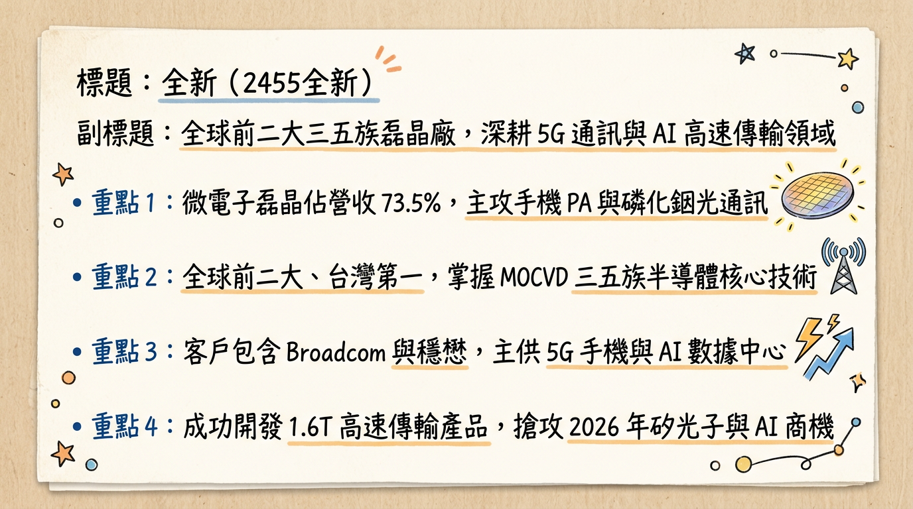
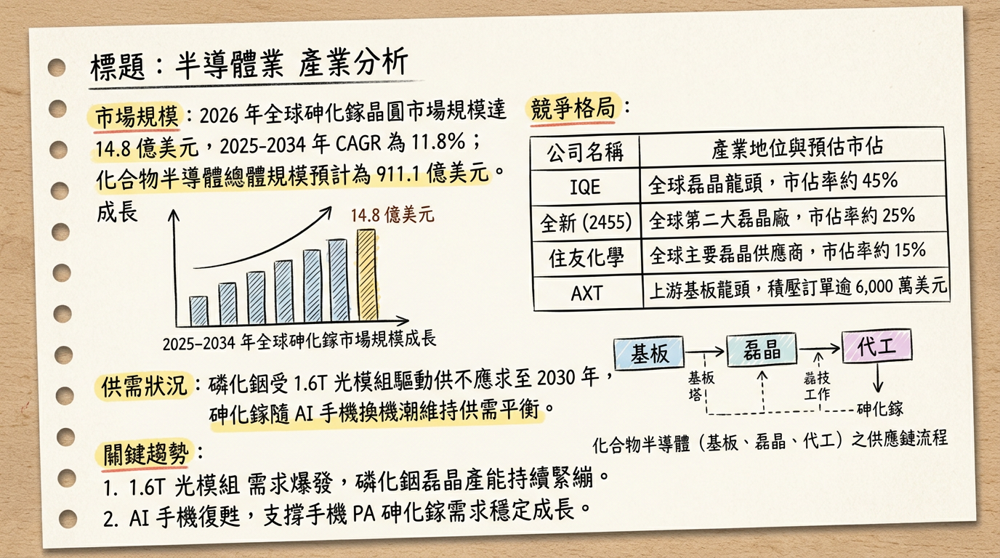
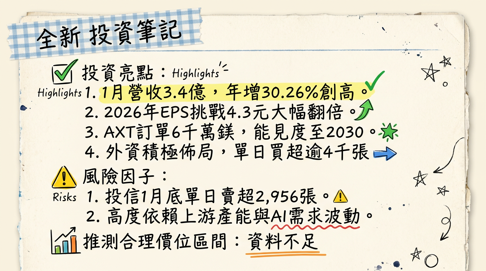

# 2455全新 全新 深度研究報告

## 一句話摘要
**「AI 光通訊」與「Wi-Fi 7」雙引擎啟動，全新從手機 PA 廠轉型為 1.6T 矽光子關鍵供應商，2026 年獲利預計挑戰歷史巔峰。**

---

## ## 公司概覽
全新光電（VPEC）為全球前二大、台灣第一大的三五族化合物半導體磊晶（Epitaxy）製造商。公司處於產業中游，利用 MOCVD 技術在基板上生長磊晶層，供應給下游 IDM 與代工廠。

**【2026 年初營收結構預估】**
| 業務類別 | 營收佔比 | 核心產品與應用 |
| :--- | :--- | :--- |
| **微電子 (Microelectronics)** | 73.5% | 砷化鎵 (GaAs) 磊晶、手機/基地台 PA、Wi-Fi 7 |
| **光電子 (Optoelectronics)** | 23.5% | 磷化銦 (InP) 磊晶、800G/1.6T PD、CW Laser、VCSEL |
| **其他/研發收入** | 3.0% | 新技術研發與代工服務 |

---

## 核心競爭優勢
1.  **矽光子核心地位：** 為台股少數能提供矽光子（CPO）外置光源 CW Laser 磊晶的廠商，已成功認證美系及日系大廠。
2.  **供應鏈韌性：** 因應中國出口管制，已成功開發「非中系」基板供應來源，確保 2026 年產能無虞。
3.  **高技術門檻：** 在磷化銦（InP）及 1.6T 接收端（PD）產品認證進度領先亞洲同業，深度綁定 Broadcom 與 Skyworks。
4.  **成本效益：** 相比日系廠商（住友、三菱）具備價格競爭力，良率則遠優於中國二線廠商。

---

## 財務分析

**【近 6 個月月營收趨勢表】**
| 月份 | 營收金額 (億元) | 月增率 (MoM) | 年增率 (YoY) |
| :--- | :--- | :--- | :--- |
| **2026/01** | 3.40 | +6.6% | +30.26% |
| **2025/12** | 3.19 | +11.9% | +28.30% |
| **2025/11** | 2.85 | -19.7% | +20.10% |
| **2025/10** | 3.55 | +2.4% | +50.30% |
| **2025/09** | 3.47 | +26.0% | +28.80% |
| **2025/08** | 2.75 | -5.4% | +0.40% |

**【年度財務趨勢】**
*   **2024 (實際)：** 營收 32.41 億元，EPS 3.63 元。
*   **2025 (實際)：** 營收 33.80 億元，EPS 2.97 元（受上半年基板供給與手機疲軟影響）。
*   **2026 (預估)：** 營收 44.34 億元，EPS 預估區間 **4.30 - 5.49 元**。

---

## 法說會重點
1.  **光電子產能滿載：** 800G 接收端（PD）與發射端（VCSEL）於 2025 Q4 放量，2026 年出貨規模將「倍數成長」。
2.  **2026 爆發年：** 管理層定義 2025 年為「先蹲」，2026 年隨 1.6T 光模組、AI 眼鏡及自駕車 LiDAR 需求啟動，獲利有望翻倍。
3.  **產能利用率：** 微電子約 60-70%，光電子則因 AI 需求持續逼近滿載。
4.  **資本支出與募資：** 啟動 5 億元 CB 募資，主要針對 6/8 吋化合物半導體 MOCVD 機台擴張。

---

## 券商觀點
**【券商目標價與評等表】**
| 券商名稱 | 報告日期 | 評等 | 目標價 | 2026 EPS 預估 |
| :--- | :--- | :--- | :--- | :--- |
| **FactSet (中位數)** | 2026/01/15 | 看多 | 177.5 元 | 5.39 元 |
| **某美系大行** | 2026/01/12 | 看多 | 185.0 元 | 5.49 元 |
| **CMoney 法人** | 2026/02/08 | 買進 | N/A | 4.30 元 |
| **某大系券商** | 2025/11/10 | 買進 | 172.0 元 | 5.36 元 |
| **元大投顧** | 2025/08/22 | 買進 | 190.0 元 | N/A |

---

## 財報深度分析

**【2025 年季度利潤率趨勢表】**
| 季度 | 毛利率 | 營業利益率 | 稅後淨利率 | 備註 |
| :--- | :--- | :--- | :--- | :--- |
| **2025 Q4** | 37.27% | 21.78% | 20.20% | 光電子佔比提升帶動回升 |
| **2025 Q3** | 32.86% | 17.44% | 17.58% | 手機 PA 需求波動影響 |
| **2025 Q2** | ~34.5% | ~18.0% | ~17.0% | 法人估算值 |
| **2025 Q1** | 39.90% | 23.50% | 21.00% | 基期與產品組合優勢 |

*   **資本支出：** 2025 年中「預付設備款」暴增至 **1.1 億元**（較 2024 年底 338 萬元成長數十倍），顯示大規模機台採購。
*   **存貨分析：** 2025 Q3 存貨週轉天數 **97.63 天**，較 Q2 的 117.63 天大幅改善，去庫存健康。

---

## 股權異動
*   **可轉換公司債 (CB)：** 2025/10/30 決議發行「國內第二次無擔保轉換公司債」，總額 **5 億元**，主要用於購置機器設備。
*   **股利政策：** 2026/02/26 董事會決議 2025 年度配發 **現金股利 2.65 元**。
*   **籌碼動向：** 外資於 2026/02/26 單日買超 **4,332 張**，累計三大法人持股比重約 32.82%。

---

## 產業分析

**【全球三五族磊晶/晶圓競爭格局】**
| 公司名稱 | 市佔率 (2025 估) | 核心優勢 | 2026 預估 EPS |
| :--- | :--- | :--- | :--- |
| **IQE (英)** | ~45% | 全球規模最大，產品線最齊全 | N/A |
| **全新 (台)** | **~25%** | **RF 龍頭，矽光子認證領先** | **4.3 - 5.59 元** |
| **住友 (日)** | ~12% | 高階 InP，綁定日系客戶 | N/A |
| **聯亞 (台)** | ~5% | 專注矽光子與 1.6T 磊晶 | 4.8 - 5.2 元 |

**【市場趨勢】**
*   **GaAs 市場：** 預計 2026 年規模達 14.8 億美元，CAGR 11.8%。
*   **InP 供需：** AXT 指出積壓訂單超過 6,000 萬美元，能見度達 2030 年，全新作為中游磊晶廠，議價能力提升。

---

## 近期催化劑
*   **利多：**
    1.  AXT 法說釋放 InP 需求強勁訊號，訂單能見度長。
    2.  1.6T 光模組規格於 2026 年正式量產，ASP（平均售價）大幅提升。
    3.  Meta/Google AI 眼鏡獨家供貨，進入全面量產期。
*   **利空：**
    1.  中美地緣政治導致鎵、鍺材料出口管制風險。
    2.  傳統手機換機潮若不如預期，可能拖累微電子業務增速。

---

## ⭐ 成長動能時間軸
*   **2025 Q4：** 800G 光通訊 PD/VCSEL 正式量產放量，毛利率落底回升至 37% 以上。
*   **2026 Q1：** 1.6T 光模組接收端產品獲得美系 CSP 大廠最終認證。
*   **2026 Q2：** Wi-Fi 7 滲透率突破 40%，帶動手機 PA 需求回升。
*   **2026 H2：** **Meta 與 Google/Samsung AI 眼鏡** 進入全面量產期，VCSEL 磊晶出貨爆發。
*   **2026 全年：** 光電子營收目標較 2024 年翻倍成長，挑戰營收佔比 30%。

---

## 2026 展望
*   **成長動能：** AI 資料中心規格升級（800G -> 1.6T）對磷化銦磊晶的高標準要求，將使全新成為「矽光子」題材下的最大受惠者。此外，XR 穿戴裝置的 VCSEL 需求將開啟第二增長曲線。
*   **潛在風險：** 需關注新 MOCVD 機台到位後的良率磨合期，以及匯率波動對業外損益之影響。

---

## 投資結論
1.  **結構性轉型成功：** 公司已從低毛利的手機 PA 磊晶廠轉型為高毛利、高技術門檻的 AI 光通訊材料商。
2.  **獲利跳升：** 2026 年 EPS 有望從 2.97 元跳升至 4.3-5.49 元，獲利結構顯著改善。
3.  **評價調升：** 隨光電子佔比接近 30%，市場評價應從傳統 PA 廠（PE 15-20x）上修至 AI 半導體材料（PE 30-35x）。
4.  **建議目標價區間：** 基於 2026 年預估 EPS 中位數約 4.9 元，給予 35-40 倍本益比，建議參考價格區間為 **171.5 元至 196 元**。

---
本報告由 AI 自動產生，資料來源為公開網路資訊，僅供參考，不構成投資建議。產生時間：2026-03-01 21:30

---

## 📊 資訊卡

