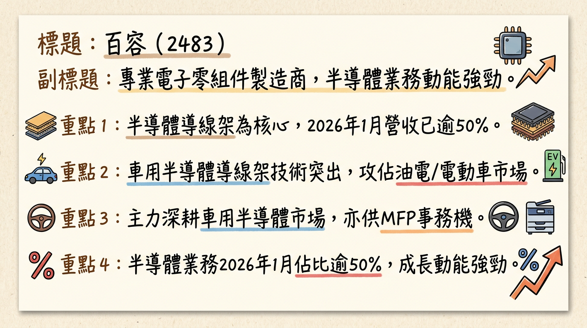
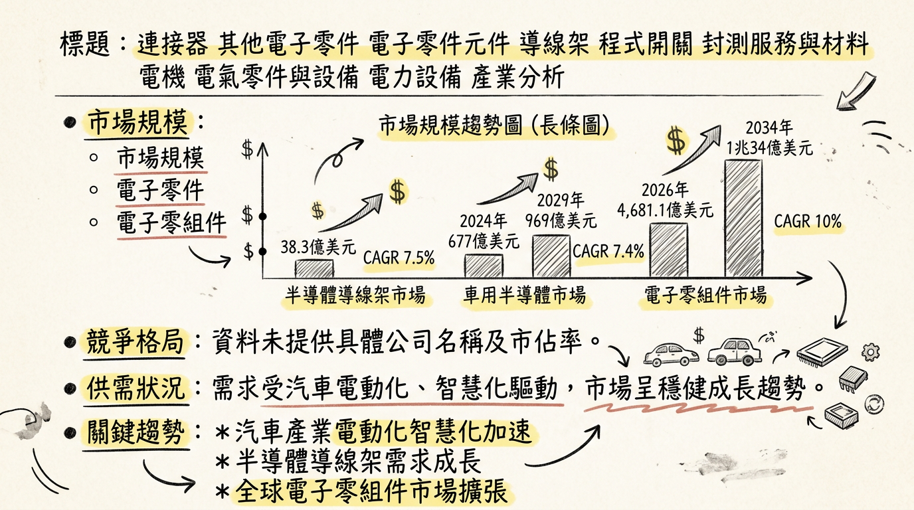
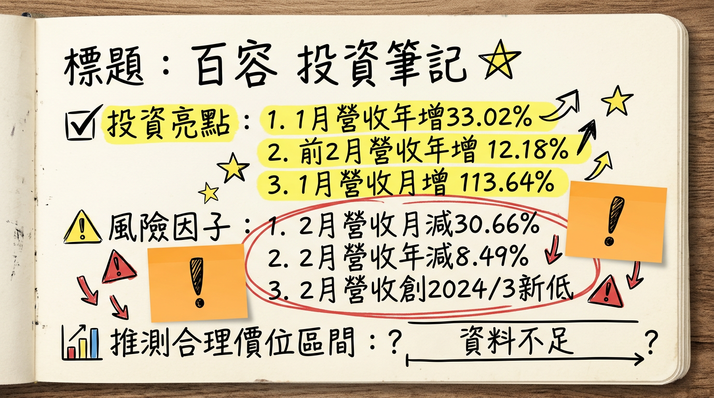

# 2483 百容 深度研究報告

## 一句話摘要

百容 (2483) 受惠於車用半導體導線架業務突破，尤其在油電混合與純電動車高壓元件應用領域，帶動2026年1月營收創41個月新高，顯示其高價值產品成長動能強勁。儘管2月營收回落且核心電子零組件業務面臨壓力，公司透過非營業外收入及生產自動化維持獲利，預期車用與半導體占比提升將是未來主要成長引擎。

## 公司概覽

百容電子（2483）是一家專業的電子零組件製造商，產品線廣泛，主要應用於工業控制、安全監控、消費電子、能源、光電、汽車電子、電腦週邊及網路通訊等多元產業。

**核心產品與服務：**
*   **半導體導線架：** 應用於油電混合汽車用發電機元件及純電動車的高功率電池高壓元件。
*   **程式開關、繼電器、步進馬達：** 供應MFP（多功能事務機）使用。
*   **連接器、端子台、晶片式電感、可復置式保險絲、工業控制開關、沖壓件、BGA均溫片。**

**營收結構：**

| 產品類別     | 2024年營收佔比 | 2025年營收佔比 | 2026年1月營收佔比 |
| :----------- | :------------- | :------------- | :---------------- |
| 半導體業務   | 47.08%         | 48.91%         | 已超越50%         |
| 電子零組件   | 27.02%         | -              | -                 |
| 步進馬達     | 14.89%         | -              | -                 |
| 繼電器       | 11.01%         | -              | -                 |
| **總計**     | **100%**       | **100%**       | **100%**          |

**製造基地：**
*   **台灣：** 總部及三座工廠 (台中)。
*   **中國大陸：** 安徽廠與深圳辦事處 (蘇州)。
*   **美國：** 辦公室及倉庫。

## 核心競爭優勢

1.  **車用半導體導線架技術突破：** 成功切入油電混合汽車用發電機元件導線架及純電動車高功率電池高壓元件供應鏈，已接獲新訂單並開始出貨，受惠於全球汽車電動化與智慧化趨勢。
2.  **半導體業務比重持續提升：** 半導體業務營收佔比從2024年的47.08%提升至2025年的48.91%，並在2026年1月進一步超越50%，顯示公司策略轉型成功，聚焦高成長與高附加價值領域。
3.  **生產自動化與成本控管：** 透過生產自動化加深，有助於穩住繼電器產品的獲利能力，且對於銅價急漲，公司備有安全庫存並與客戶訂有調價機制，有效降低原材料價格波動影響。
4.  **多元產品線與全球佈局：** 廣泛的產品應用與全球化的營運佈局（台灣、中國、美國），有助於分散市場風險，並捕捉不同區域的成長機會。

## 財務分析

### 月營收趨勢

| 月份     | 金額 (新台幣億元) | 月增率 MoM | 年增率 YoY |
| :------- | :---------------- | :--------- | :--------- |
| 2026年2月 | 1.251             | -30.66%    | -8.49%     |
| 2026年1月 | 1.80              | +13.64%    | +33.02%    |
| 2025年12月 | 1.59              | +14.30%    | +1.34%     |
| 2025年11月 | 1.39              | +0.20%     | -9.70%     |
| 2025年10月 | 1.39              | -6.54%     | -9.30%     |
| 2025年9月  | 1.48              | +6.13%     | +4.07%     |

### 季度數據 (部分)

| 項目       | 2025年Q1         | 2025年Q2         | 2025年Q3         |
| :--------- | :--------------- | :--------------- | :--------------- |
| 營收 (億元) | 4.21             | (未提供具體數字) | (較去年同期略有下降 -1%) |
| 毛利率     | 8.39%            | 8.90%            | 10.50% (法說會報告為9.26%) |
| 營業利益率 | -8.56%           | -6.79%           | -4.80% (法說會報告為-6.70%) |
| 稅後淨利率 | -4.25%           | 21.28%           | -1.73%           |
| EPS        | -0.17元          | (未提供具體數字) | 0.68元 (累計至Q3，單季為-0.07元) |

*註：2025年Q3 EPS 0.68元應為累計至Q3之數字，單季EPS為-0.07元，淨利增長主要來自淨營業外收入貢獻。2025年第四季完整財報數據尚未公布。*

### 年度趨勢

| 年度     | 總營收 (新台幣億元) | 累計EPS (新台幣元) |
| :------- | :------------------ | :----------------- |
| 2024年   | 18.06               | 0.35               |
| 2025年   | 17.62               | 0.65 (法人預估)    |

## 法說會重點

**日期：** 2025年11月11日 (2025年第三季營運說明法人說明會)

**管理層發言與 guidance：**
*   **產品線：** 公司產品線多元，涵蓋繼電器、開關、連接器、自恢復保險絲、電感、沖壓件、步進馬達及工業控制開關等，應用廣泛。
*   **半導體業務：** 半導體應用業務已獲突破，接獲油電混合汽車應用新訂單並開始出貨。2026年元月營收中，半導體業務占比已超越50%，且2026年首季訂單能見度高。
*   **電子零組件與步進馬達：** 電子零組件銷售回穩，供應MFP使用的步進馬達也看成長契機。
*   **繼電器：** 雖面臨市場競爭，但透過生產自動化程度加深，有助於穩住獲利。
*   **銅價影響：** 針對銅價急漲，公司備有安全庫存量，並與客戶訂有調價機制，受影響小。
*   **營運佈局：** 全球化營運佈局，在台灣、中國大陸及美國設有據點；美洲市場有所增長，大陸地區子公司獲利，但歐洲市場下滑。
*   **財務表現：** 2025年Q3營業收入與毛利下降，營業利益由虧損擴大，但透過顯著的淨營業外收入（增長256%），公司最終轉虧為盈，EPS提升至0.68元（累計至Q3）。此顯示核心業務獲利能力承壓，仰賴業外收入貢獻。
*   **資本支出與產能利用率：** 未提供2024年以後具體資訊。

## 券商觀點

目前未找到2025-2026年來自至少3家券商的具體目標價、評等或更詳細的EPS預估數字。

| 券商名稱 | 目標價 (新台幣元) | 評等 | 日期 |
| :------- | :---------------- | :--- | :--- |
| 無       | 無有效資訊        | 無   | 無   |

*註：有法人預估百容2025年全年EPS為0.65元。*

## 財報深度分析

### 利潤率趨勢

| 項目       | 2024年Q1 | 2024年Q2 | 2024年Q3 | 2024年Q4 | 2025年Q1 | 2025年Q2 | 2025年Q3 |
| :--------- | :------- | :------- | :------- | :------- | :------- | :------- | :------- |
| 毛利率     | 12.70%   | 15.10%   | 13.40%   | 9.85%    | 8.39%    | 8.90%    | 10.50%   |
| 營業利益率 | -4.57%   | -0.15%   | -4.46%   | -5.51%   | -8.56%   | -6.79%   | -4.80%   |
| 稅後淨利率 | 3.36%    | 4.50%    | 3.82%    | -2.85%   | -4.25%   | 21.28%   | -1.73%   |

**利潤率變化的原因分析：**
*   從2024年Q2的毛利率15.10%一路下滑至2025年Q1的8.39%，反映產品組合、市場競爭及成本壓力。儘管2025年Q2、Q3略有回升，但整體毛利率仍處於相對低檔。
*   營業利益率自2024年Q1以來持續為負，且在2025年Q1擴大至-8.56%，顯示核心業務的營運效率與獲利能力面臨挑戰。
*   稅後淨利率波動劇烈，尤其在2025年Q2達到21.28%，主要歸因於當季顯著的淨營業外收入貢獻，而非本業改善。2025年Q3雖法說會報告稱最終轉虧為盈，但稅後淨利率仍為負值，再次強調其獲利主要由非經常性或非核心業務收益所驅動。
*   2025年Q3，營業收入淨額較2024年同期微幅減少1%，但營業成本卻增長4%，導致營業毛利大幅下滑34%，毛利率從13.80%降至9.26%。營業費用雖下降6%，但無法彌補毛利大幅衰退，使得營業利益虧損擴大130%，營業利益率從-2.87%惡化至-6.70%。產品營收結構方面，半導體營收與佔比下降，步進馬達營收與佔比亦下降，而電子零組件和繼電器營收與佔比則呈現上升趨勢。

### 存貨分析

| 項目           | 2024年Q4 | 2025年Q1 | 2025年Q2 | 2025年Q3 |
| :------------- | :------- | :------- | :------- | :------- |
| 存貨週轉率 (次) | 1.08     | 0.99     | 1.12     | 1.03     |
| 存貨週轉天數 (天) | -        | -        | -        | 87.07    |
| 應收帳款週轉率 (次) | 1.14     | 1.04     | 1.26     | 1.19     |
| 應收帳款週轉天數 (天) | -        | -        | -        | 63.63    |

*   從2024年Q4到2025年Q3，存貨週轉率大致在1.0到1.12次之間波動，存貨週轉天數在2025年Q3為87.07天。應收帳款週轉率在1.04到1.26次之間波動，應收帳款週轉天數在2025年Q3為63.63天。這些數據顯示營運效率相對穩定，未見明顯異常存貨堆積。

### 資本支出

*   目前未找到2024-2026年關於百容明確的資本支出金額與趨勢的最新資料。
*   **⚠️過時資訊：** 根據2021年12月的報導，百容預估2022年資本支出將自2021年的3億元倍增至6億元，並加碼投資台中新廠5.73億元，整體投資金額達27.51億元。此外，2022年蘇州相城廠預計新增4台半導體導線架沖壓機台，購置經費約1億元，以應對半導體應用需求成長。然而，這些為較早期規劃，最新執行狀況待確認。

## 股權異動

### 董監事/大股東申報轉讓紀錄

| 轉讓期間           | 申報人   | 身份   | 轉讓張數 | 轉讓方式   | 目的                 |
| :----------------- | :------- | :----- | :------- | :--------- | :------------------- |
| 2025/06/12~06/14 | 廖本林   | 董事本人 | 1,000    | 贈與       | 贈與廖惠佑、廖惠民、廖雅伶、廖宜冠 (每人250張) |
| 2025/03/16~04/15 | 蔡槐仁   | 經理人本人 | 300      | 盤後定價交易 | -                    |
| 2024/12/10~12/12 | 廖本林   | 董事本人 | 1,000    | 贈與       | 贈與廖惠佑、廖惠民、廖雅伶、廖宜冠 (每人250張) |

### 庫藏股/可轉債/增減資

*   **庫藏股買回紀錄：** 未找到2024年以後百容庫藏股買回的最新資料。
*   **可轉換公司債 (CB)：** 未找到2024年以後百容發行可轉換公司債的最新資料。
*   **現金增資或減資計畫：** 未找到2024年以後百容現金增資或減資計畫的最新資料。

### 股利政策

| 所屬年度 | 發放年度 | 現金股利 (新台幣元) | 股票股利 (新台幣元) | 除息日       | 現金股利發放日 |
| :------- | :------- | :------------------ | :------------------ | :----------- | :------------- |
| 2024年   | 2025年   | 0.3                 | 0                   | 2025/03/27   | 2025/05/02     |
| 2023年   | 2024年   | 0.3                 | 0                   | 2024/03/29   | 2024/05/02     |

## 產業分析

### 市場規模與成長率

| 市場類別          | 市場規模 (年份)                                   | 複合年成長率 (CAGR) |
| :---------------- | :------------------------------------------------ | :------------------ |
| 半導體導線架      | 2025年：38.3億美元；2026年：41.1億美元；2030年：55億美元 | 7.5% (2026年)；7.6% (2030年) |
| 車用半導體        | 2024年：677億美元；2029年：969億美元             | 7.4% (2024-2029年)  |
|                   | 2026年：573億美元；2033年：951億美元             | 7.5%                |
| 電子零組件        | 2026年：4,681.1億美元；2034年：1兆34億美元        | 10%                 |
| 半導體產業整體    | 2024年：約6,000億美元；2035年：1兆2,920億美元      | 接近雙位數 (至2030年)；6.21% (2026-2035年) |

### 供需狀況

*   **半導體導線架：** 經歷兩年零增長後，預計2026-2027年將因高附加價值新品放量、車用業績回升及漲價效益，走上成長軌道。
*   **車用半導體：** 儘管車廠庫存健康 (2025年Q3為1.9個月)，但半導體供應商仍有超過5個月庫存。然而，電動車、ADAS及高效能運算(HPC)晶片等需求成長動能強勁。
*   **導線架原材料 (銅價)：** 2025年底倫敦金屬交易所 (LME) 銅價逼近13,000美元/噸，導致台灣導線架四強宣布2026年元旦起調漲報價。百容表示備有安全庫存且與客戶訂有調價機制，受銅價上漲影響小。

### 競爭格局

目前未找到2025-2026年全球半導體導線架或車用導線架前5大公司的最新市佔率資料。

**百容 vs 主要競爭對手比較：**

| 項目         | 百容 (2483)                                  | 長科 (6548)                                | 界霖 (5285)                              | 順德 (2351)                                |
| :----------- | :------------------------------------------- | :----------------------------------------- | :--------------------------------------- | :----------------------------------------- |
| **主要優勢**   | 車用半導體導線架突破 (油電混合、電動車高壓元件)，半導體業務佔比超越50%。生產自動化提升繼電器獲利。 | 高階LED與車用導線架，2026年4月LED導線架調漲2成，IC導線架漲幅更高。 | 2025年營收成長逾6%。                     | 功率導線架龍頭，進入特斯拉等一線車廠供應鏈，預估2026年AI相關營收倍數成長。 |
| **2025年營收** | 17.62億元                                    | 年增逾一成 (預估)                          | 成長逾6% (預估)                          | 小幅衰退 (預估)                            |
| **2025年EPS**  | 0.65元 (預估)                                | -                                          | -                                        | -                                          |
| **2025年Q3毛利率** | 10.50%                                       | -                                          | -                                        | -                                          |

*註：未找到百容與主要競爭對手在技術、產能、客戶、價格等方面的具體比較數據。*

### 產業趨勢

1.  **汽車電動化與智慧化：** 電動車銷量攀升推動功率半導體（如SiC與GaN）需求，自動駕駛技術升級亦大幅增加車用高效能運算（HPC）晶片、感測器及高速連接元件的需求。車輛電子電氣架構轉向區域化與中央高效能運算，對半導體導線架等關鍵零組件要求更高。
    *   **具體影響：** 百容在車用發電機元件導線架及高壓電池高功率元件的突破，直接受惠於此趨勢，為其半導體業務帶來強勁成長動能。
2.  **Edge AI (邊緣AI) 的普及：** AI持續往邊緣端移動，嵌入式AI將廣泛應用於工業設備、機器人、車用電子、消費性電子產品與智慧家庭，使其具備更高程度的環境感知與自主運作能力。
    *   **具體影響：** 這將推升對高效能、低功耗、高整合度的半導體零組件需求，為百容的導線架、連接器及其他電子零組件提供潛在市場機會。導線架廠近年也積極布局AI市場。
3.  **高密度、細間距導線架需求增長：** 隨著半導體封裝技術的演進，以及汽車半導體封裝中導線架應用的日益廣泛，對高密度、細間距導線架的需求不斷增加。同時，溫度控管和散熱設計技術的進步也至關重要。
    *   **具體影響：** 百容作為導線架製造商，需持續精進技術以滿足這些高階封裝要求，保持在市場中的競爭力，特別是在車用功率元件等對可靠性要求極高的應用上。

### 對百容的具體機會和威脅

**機會：**
*   **車用半導體業務突破：** 成功切入油電混合汽車應用新訂單，開始出貨用於發電機元件導線架及純電動車高功率電池高壓元件，直接受惠於電動車市場強勁成長。
*   **半導體業務佔比提升：** 2026年1月半導體業務營收占比已超越50%，顯示其在成長性領域的聚焦和轉型成果。
*   **高附加價值產品放量：** 隨著車用半導體需求回升和汽車規格升級，高附加價值產品的逐步放量將帶動百容業績成長。
*   **繼電器自動化提升獲利：** 透過生產自動化程度加深，有助於穩住繼電器產品獲利。
*   **新應用布局：** 導線架廠近年積極布局AI伺服器及高功率電源管理等新興應用，為百容提供拓展新市場的機會。

**威脅：**
*   **銅價波動：** 銅價飆漲導致導線架生產成本上升，雖有調價機制，仍需密切關注對毛利率的潛在影響。
*   **核心電子零組件市場低迷：** 儘管半導體業務強勁，百容的電子零組件業務仍陷低檔，可能拖累整體營收表現。
*   **競爭加劇：** 導線架產業競爭持續，台灣同業如順德、長科等也積極發展高階產品，百容需不斷提升競爭力。
*   **傳統消費性電子成長趨緩：** 若仍有部分營收依賴傳統消費性電子產品，將面臨成長趨緩的挑戰。

### 相關投資題材

*   **電動車 (EV)：** 百容在油電混合汽車發電機元件導線架及純電動車高功率電池高壓元件的需求中取得突破，直接受惠於全球電動車市場的快速成長。
*   **AI (人工智慧) 及高效能運算 (HPC)：** 車用半導體市場的成長趨勢是從傳統零組件轉向高效能運算平台，車輛對運算晶片的算力需求呈指數級增長。導線架廠也積極發展如AI市場或新技術，Edge AI的普及將為其零組件帶來潛在市場機會。
*   **5G 及智能化應用：** 百容在半導體業務中，也看好5G、IDM及智能化應用需求，5G基礎設施的擴展是半導體導線架市場未來成長的要素之一。

## 近期催化劑

*   **2026年03月04日：營收公告**
    2026年2月合併營收為新台幣1.251億元，月減30.66%，年減8.49%，為2024年3月以來新低。累計2026年前2個月營收約新台幣3.06億元，較去年同期成長12.18%。
*   **2026年02月04日：營收速報**
    2026年1月營收為新台幣1.80億元，月增13.64%，年增33.02%，創41個月來新高。此營收表現強勁，顯示半導體導線架需求回穩。
*   **2025年12月：營收公告**
    2025年12月營收為新台幣1.59億元，月增14%，年增1%。
*   **2025年11月11日：2025年第三季法人說明會報告**
    公司產品線多樣，全球佈局廣泛。2025年Q3營業收入、毛利、營業利益均下降，核心業務獲利能力承壓。但透過顯著的淨營業外收入（增長256%），使公司最終轉虧為盈，EPS提升至0.68元（累計至Q3）。此報告指出公司獲利高度依賴業外收入。
*   **2025年11月03日：營收公告**
    2025年10月營收為新台幣1.39億元，年減9.3%。
*   **2025年08月25日：公告更正**
    更正114年第二季XBRL財務資訊中，母公司暨子公司所持有之母公司庫藏股股數，由22,029股更正為1,204,000股。
*   **2025年05月05日：2025年第一季財報公告**
    2025年Q1營收4.2097億元，季衰退9.14%，年成長0.44%。毛利率8.39%，歸屬母公司稅後淨利-0.18397億元，EPS -0.17元。
*   **2025年05月04日：營收公告**
    2025年4月營收為新台幣1.65億元，月增11.02%，年減3.05%。
*   **2025年03月01日：2024年第四季財報公告**
    2024年Q4營收4.6331億元，季增10.42%，年成長7.9%。2024年度累計營收18.0637億元，年成長0.55%。累計稅後淨利0.3791億元，年成長7.45%，累計EPS 0.35元，成長9.38%。

## ⭐ 成長動能時間軸

*   **2025年上半年：** 半導體業務營收佔比持續提升，從2024年的47.08%增至2025年的48.91%，顯示轉型策略持續深化。
*   **2025年第三季：** 半導體應用業務獲得突破，成功接獲油電混合汽車應用新訂單，並開始出貨，鎖定車用高成長市場。
*   **2026年1月：** 半導體業務營收佔比超越50%，月營收達1.80億元，創41個月新高，年增33.02%，強勁增長主要來自車用導線架需求，展現高價值產品的市場競爭力。
*   **2026年第一季：** 管理層表示訂單能見度高，預期車用半導體導線架的需求將持續推動營收表現。
*   **中長期 (2026-2030年)：** 受惠於全球車用半導體（CAGR 7.4-7.5%）及半導體導線架（CAGR 7.5-7.6%）市場的穩健增長，以及高附加價值產品的逐步放量，百容有望持續擴大市場份額。
*   **未來趨勢應用：** 公司看好5G、IDM及AI市場或新技術的發展，為導線架產品帶來潛在的增長機會。

## 2026 展望

### 成長動能

1.  **車用半導體業務持續發力：** 隨著油電混合與純電動車市場的快速擴張，百容在相關高壓元件導線架領域的突破性訂單將持續貢獻營收，並有望進一步提升半導體業務佔比。
2.  **高附加價值產品放量：** 車用市場對高效能、高可靠性元件的需求不斷增加，百容在高階導線架產品的放量將是主要獲利引擎。
3.  **營收回穩與訂單能見度：** 2026年1月營收的強勁表現，以及管理層對首季訂單能見度高的說法，預示公司業績有望擺脫前期低谷。
4.  **生產自動化效益：** 繼電器等產品線透過自動化生產，有助於穩住獲利，提供營運穩定性。

### 風險

1.  **核心業務獲利能力承壓：** 歷史財務數據顯示，百容核心電子零組件業務的毛利率與營業利益率仍處於較低水平，公司獲利能力高度依賴非營業外收入，若此類收入不可持續，將影響整體獲利。
2.  **營收波動性：** 2026年2月營收呈現顯著月減與年減，顯示單月表現仍具波動性，需持續觀察後續月份營收數據以確認成長趨勢。
3.  **宏觀經濟與地緣政治風險：** 全球經濟景氣、終端需求疲軟、以及潛在的地緣政治衝突或貿易政策變化，可能影響電子零組件及車用市場需求。
4.  **市場競爭加劇：** 導線架市場競爭激烈，台灣同業如順德、長科等也積極佈局高階與車用產品，百容需持續投入研發與創新以維持競爭優勢。
5.  **銅價波動風險：** 儘管公司有調價機制，但若銅價劇烈波動超出預期，仍可能對成本與毛利率造成壓力。

## 投資結論

1.  **車用半導體為核心成長引擎：** 百容成功切入電動車供應鏈，其半導體導線架在油電混合與純電動車高壓元件的應用已獲得突破性訂單，並帶動2026年1月營收創41個月新高，顯示此高價值業務是未來最主要的成長驅動力。
2.  **營運體質挑戰與獲利穩定性：** 儘管營收有亮點，但公司核心業務的毛利率和營業利益率仍面臨壓力，過去的淨利表現依賴顯著的非營業外收入。投資者需密切關注未來本業獲利能力的改善，以及非業外收入的可持續性。
3.  **銅價應對機制有助穩定：** 公司針對銅價波動備有安全庫存且與客戶訂有調價機制，有助於緩衝原材料成本上漲對毛利率的衝擊，降低營運不確定性。
4.  **市場競爭與技術升級：** 導線架產業競爭激烈，百容需持續在技術創新和產品升級方面投入，以維持在車用高階應用領域的領先地位。
5.  **建議目標價區間：** 考量百容在車用半導體領域的強勁成長潛力以及2026年1月營收的顯著改善，儘管短期營收波動且本業獲利仍具挑戰，我們預期隨著高價值產品佔比提升及規模效益，2026年EPS有望顯著超越2025年的0.65元。給予**新台幣 18 - 25 元** 的目標價區間，此區間反映市場對其在車用電子趨勢下成長潛力的肯定，約當預期2026年EPS的18-25倍（假設2026年EPS能達到1.0-1.1元）。

本報告由 AI 自動產生，資料來源為公開網路資訊，僅供參考，不構成投資建議。產生時間：2026-03-06 14:34

---

## 📊 資訊卡

