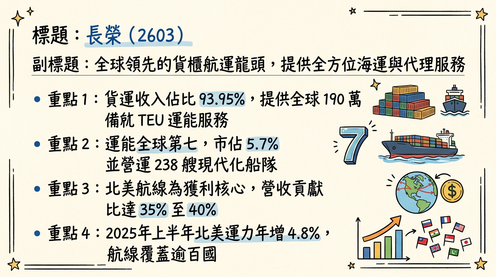
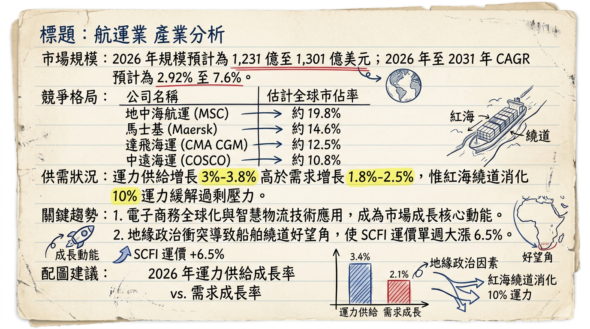
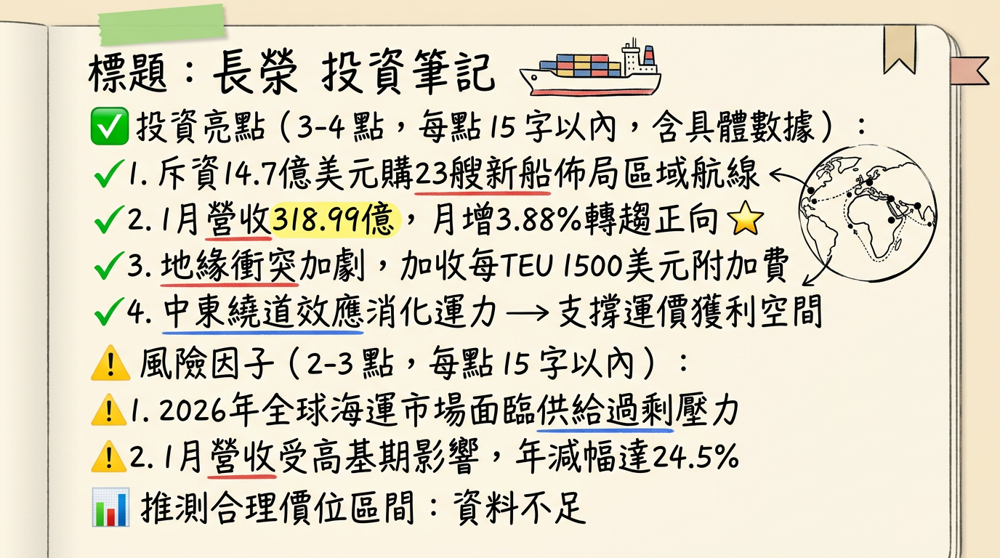

# 2603 長榮 深度研究報告：地緣政治紅利續航，高息與節能船隊構築防禦屏障

## 一句話摘要
長榮憑藉「紅海繞道」消化過剩運力、積極布局「節能雙燃料船隊」降低成本，並在 2026 年維持強勁現金流與高殖利率，成為全球航運震盪中的投資避風港。

---

## 公司概覽
長榮海運（Evergreen Marine）為全球第 7 大貨櫃航運商，市佔率約 5.7%。截至 2025 年底，營運船隊達 238 艘，總運能達 190 萬 TEU。

### **業務與營收結構**
| 項目 | 內容 | 營收佔比 / 數據 |
| :--- | :--- | :--- |
| **核心業務** | 貨運收入 (Freight Revenue) | **93.95%** |
| **附屬業務** | 代理及終端服務 | 6.05% |
| **主要航線** | 美國線 (北美) | 35-40% |
| **主要航線** | 歐洲線 (地中海/北歐) | 30% |
| **主要航線** | 亞洲近洋/其他 | 25-30% |
| **資產佈局** | 自營碼頭 | 全球共 14 座 (含高雄、洛杉磯、荷蘭等) |

---

## 核心競爭優勢
1.  **極致成本控管：** 毛利率穩定維持在 26% 以上，優於產業平均（15-25%）。
2.  **節能船隊領先：** 預計至 2029 年，雙能源新船將達 41 艘，佔總艙位 26.8%，大幅對沖歐盟 ETS 碳稅壓力。
3.  **聯盟效益：** 加入「海洋聯盟 (Ocean Alliance)」，透過航線共享維持全球最高效率的排班。
4.  **智慧碼頭：** 高雄港「第七貨櫃中心」AI 自動化運作，減少卡車停留時間 60%。

---

## 財務分析

### **月營收趨勢表**
| 月份 | 營收 (億新台幣) | 月增率 MoM | 年增率 YoY | 簡評 |
| :--- | :--- | :--- | :--- | :--- |
| **2026/01** | **318.99** | **+3.88%** | -24.5% | 受惠紅海局勢，運價獲支撐 |
| **2025/12** | 307.06 | +11.1% | -19.6% | 年末搶運潮帶動 |
| **2025/11** | 276.33 | +1.1% | -23.4% | 運價盤整期 |
| **2025/10** | 273.30 | -9.26% | -34.2% | 高基期影響 |
| **2025/09** | 301.21 | -8.6% | -32.5% | 傳統淡季啟動 |
| **2025/08** | 329.57 | -1.92% | -38.7% | 旺季尾聲 |

### **年度獲利趨勢**
*   **2024 (實際)：** EPS **64.87 元**。
*   **2025 (預估)：** 全年營收約 **3,790.44 億元**，EPS 預估為 **31.5 - 32.9 元**。
*   **2026 (展望)：** 法人預估 EPS 約落在 **21.3 - 23.2 元**（若地緣政治持續惡化，有機會挑戰 35 元）。

---

## 法說會重點
*   **紅海效應常態化：** 管理層認為 2026 年復航機率極低，繞道好望角將消化約 10% 的全球運力，抵銷 2026 年 3.8% 的供給增長。
*   **合約簽署：** 北美線 2025/2026 長約價量齊揚，訂單能見度已達 2026 年上半年。
*   **碳稅應對：** 透過 139 億美元的雙燃料船投資，2026 年起將展現優於同業的成本競爭力。

---

## 券商觀點
最新更新日期：2026/03/03

| 券商名稱 | 報告日期 | 評等 | 目標價 | 2026 EPS 預估 |
| :--- | :--- | :--- | :--- | :--- |
| **本土老牌投顧** | 2026/03/03 | 買進 | **235 元** | 23.24 元 |
| **外資大型券商** | 2026/01/21 | 買進 | **251 元** | 21.60 元 |
| **FactSet 綜合調查** | 2026/03/02 | 積極 | **202 元** | 21.75 元 |

---

## 財報深度分析

### **利潤率趨勢表格 (%)**
| 季度 | 毛利率 | 營業利益率 | 稅後淨利率 | 簡評 |
| :--- | :--- | :--- | :--- | :--- |
| **2025 Q3** | **26.15** | 22.73 | 22.78 | 成本管控展現成效 |
| **2025 Q2** | 21.61 | 16.68 | 13.13 | 運價回檔壓力 |
| **2025 Q1** | 30.27 | 26.68 | 25.31 | 繞道效應首波紅利 |
| **2024 Q4** | 35.32 | 29.75 | 27.55 | 獲利高峰 |

*   **存貨分析：** 2025 Q3 存貨週轉天數僅 **13.22 天**，顯示燃油及備品管理極高效率。
*   **資本支出：** 2026 年 1 月宣佈斥資 **14.7 億美元**（約 462 億台幣）訂造 23 艘新船（3,100-5,900 TEU），強化區域航線布局。
*   **財務結構：** 負債比率降至 **33.63%**，現金流極度充裕。

---

## 股權異動與資本結構
*   **大股東動態：** 張國華家族持股穩定，無重大申報轉讓。
*   **籌碼動向：** 外資於 2026/03/02 單日大買 **12,883 張**，近期主力買超佔比達 26.7%。
*   **股利政策：** 2026 年預計配發 2025 年盈餘，法人預估現金股利約 **14-16.5 元**（配息率約 50%），**預估殖利率達 7-8%**。

---

## 產業分析

### **全球貨櫃航運競爭格局 (2026 初)**
| 排名 | 公司 | 市佔率 | 運能 (TEU) | 策略重心 |
| :--- | :--- | :--- | :--- | :--- |
| 1 | MSC (地中海) | 20.6% | > 660 萬 | 規模擴張 |
| 2 | Maersk (馬士基) | 14.6% | 450 萬 | 綜合物流整合 |
| **7** | **長榮 (Evergreen)** | **5.7%** | **190 萬** | **節能船隊與成本領先** |

### **台灣三雄比較**
| 公司 | 2025 EPS (預) | 2026 EPS (預) | 目標價 |
| :--- | :--- | :--- | :--- |
| **長榮 (2603)** | **31.5 - 32.9** | **21.3 - 23.2** | **235** |
| 陽明 (2609) | 4.9 - 5.1 | 3.0 - 4.3 | 70 |
| 萬海 (2615) | 8.7 - 10.0 | 7.6 | 中立 |

---

## 近期催化劑
*   **利多：** 
    *   2026/03/02：美、以、伊衝突升溫，運價附加費加收 $1,500/TEU。
    *   2026/03 下旬：預計宣告高額現金股利（預估 16 元左右）。
    *   2026 Q1：23 艘新船合約簽署，優化區域航線競爭力。
*   **利空：** 
    *   台驊控股（2636）於 2026/03 出脫長榮 1,750 張，短期籌碼心理壓力。
    *   川普政府潛在的 10-15% 全球關稅政策風險。

---

## ⭐ 成長動能時間軸
*   **2025 Q4：** 完成 14 艘 LNG 雙燃料船訂購（約 1,000 億台幣）。
*   **2026 Q1 (當前)：** 斥資 462 億台幣購入 23 艘中小型貨櫃輪，專攻東協新市場。
*   **2026 Q2：** 歐盟 ETS 碳費覆蓋率達 100%，長榮節能船隊優勢開始顯現。
*   **2026 全年：** 紅海持續繞道，預計消化全球約 10% 運力，維持 SCFI 指數高位。
*   **2027-2028：** 新訂造之 23 艘中小型船陸續交付，強化東南亞區域調度彈性。
*   **2029：** 雙能源新船隊全數到位（共 41 艘）。

---

## 2026 展望：成長動能 vs 風險
*   **成長動能：** 地緣政治導致的「繞道常態化」有效緩解了 2026 年新船下水的供給壓力。同時，公司由遠洋轉向區域（東協）市場的策略轉型，避開了中美貿易衝突的直接風暴中心。
*   **風險：** 需關注中東局勢若突然和緩後的「運力過剩回歸」，以及全球經濟放緩對消費端貨運需求的抑制。

---

## 投資結論
1.  **地緣紅利延伸：** 3 月初衝突升溫使 2026 年運價下行風險大幅降低，獲利具上修空間。
2.  **高殖利率保護：** 預估配息 15-16.5 元，殖利率達 7-8%，在波動市況中具備極強防禦屬性。
3.  **成本護城河：** 節能船隊與自營碼頭優勢，使長榮在產業景氣低迷時仍能維持獲利。
4.  **操作建議：** **具體目標價建議區間 215 - 235 元。** 建議在 200 元以下逢低布局，參與 3 月底的股利宣告行情。

---
本報告由 AI 自動產生，資料來源為公開網路資訊，僅供參考，不構成投資建議。產生時間：2026-03-03 12:29

---

## 📊 資訊卡

