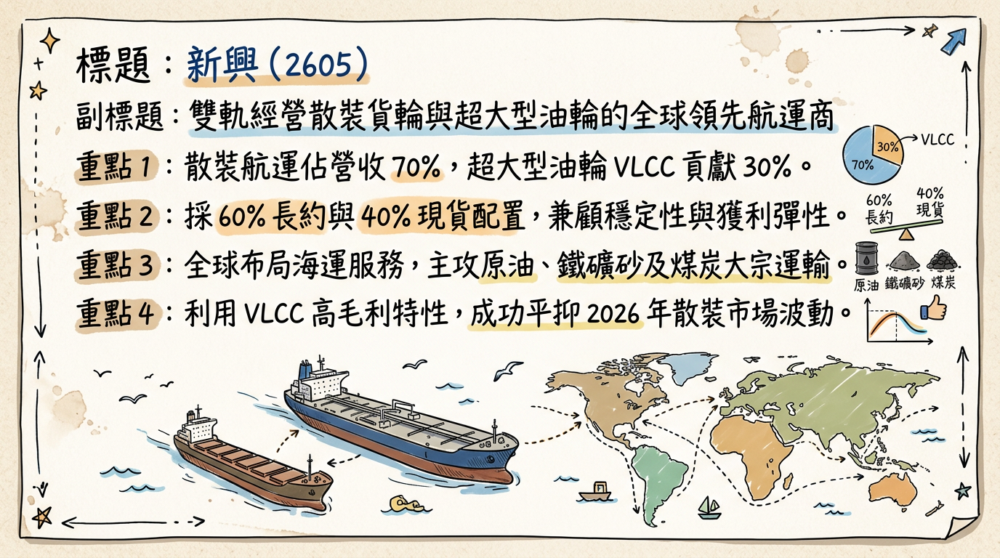
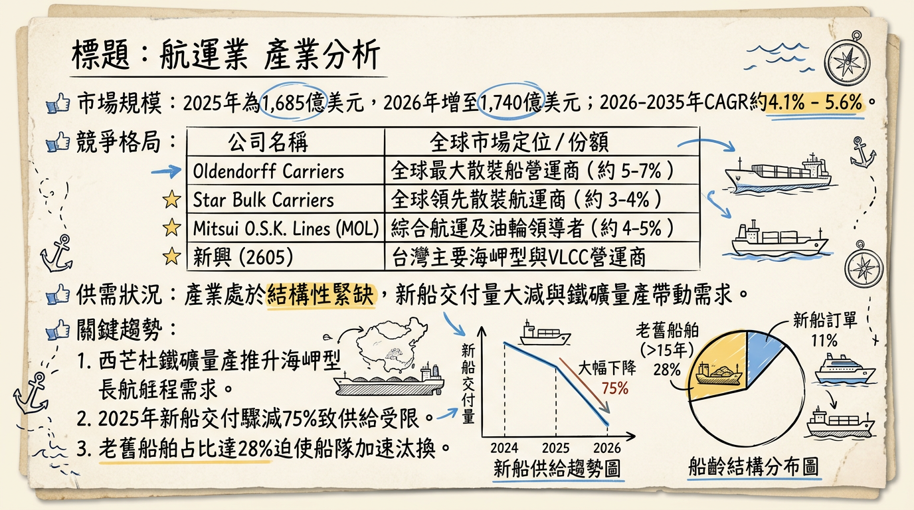
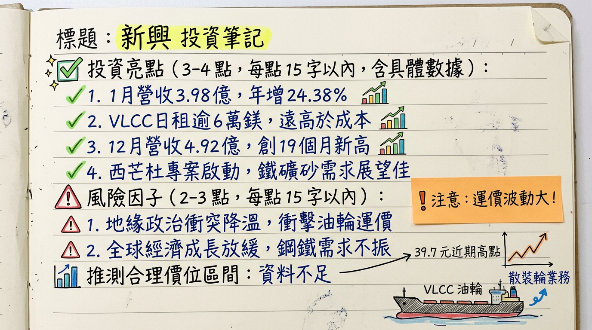

# 2605 新興 深度研究報告

## 一句話摘要
**「油散雙引擎」布局，受惠地緣政治推升油輪運價與西非 Simandou 鐵礦砂計畫啟動，2026 年獲利預計迎來結構性爆發。**

---

## 公司概覽
新興航運（2605）成立於 1968 年，為台灣少數同時具備「超大型油輪 (VLCC)」與「散裝貨輪」的航運業者。公司採取穩健的租約策略（60% 長約 / 40% 現貨），在景氣波動中兼顧收益穩定性與運價彈性。

### 業務與營收結構 (2025-2026 預估)
| 業務類別 | 營收佔比 | 核心資產 | 主要載運物 |
| :--- | :--- | :--- | :--- |
| **散裝航運** | 70% | 7 艘 Capesize、1 艘 VLOC、4 艘 Kamsarmax | 鐵礦砂、煤炭、穀物 |
| **油品運輸** | 30% | 3 艘 30 萬噸級 VLCC | 原油 |
| **其他** | <1% | 船務代理、拖船、駁船業務 | - |

---

## 核心競爭優勢
1.  **獨特雙軌模式：** 相較於純散裝業者，新興擁有 3 艘 VLCC，在原油運價高漲時具備強大的獲利溢價空間。
2.  **財務極度穩健：** 截至 2025 Q3，**負債比僅 21.84%**，並持有約 2.295 億美元現金，抗風險能力強。
3.  **長程航線佈局：** 深耕巴西/澳洲及西非航線，是全球鐵礦砂貿易流向改變的主要受益者。

---

## 財務分析

### 近 6 個月月營收趨勢
| 月份 | 營收 (億元 TWD) | 月增率 MoM | 年增率 YoY |
| :--- | :--- | :--- | :--- |
| **2026/01** | 3.98 | -19.19% | **+24.38%** |
| **2025/12** | 4.92 | +2.07% | **+28.50%** |
| **2025/11** | 4.82 | +17.28% | **+49.16%** |
| **2025/10** | 4.11 | +10.90% | **+33.59%** |
| **2025/09** | 3.71 | +15.90% | +6.85% |
| **2025/08** | 3.20 | -8.97% | -8.21% |

### 季度數據與年度趨勢
*   **2025 前三季累計 EPS：** 0.49 元。
*   **2024 全年 EPS (實際)：** 2.56 元（含處分資產一次性收益）。
*   **2025 全年 EPS (法人預估)：** 約 1.42 元。
*   **2026 全年 EPS (法人挑戰目標)：** **2.17 元**，受惠本業毛利改善，獲利有望翻倍成長。

---

## 法說會重點 (2025/11/28)
1.  **VLCC 供給緊缺：** 管理層強調全球新造油輪訂單極低，2026 年預計僅交付 33 艘，日租金將長期維持在 6 萬美元以上的損益兩平點（2.45 萬美元）之上。
2.  **西芒杜 (Simandou) 利多：** 隨著 2026 年進入全面投產期，長程運距需求將吸納全球 5% 海岬型運力。
3.  **財務 Guidance：** 公司優先目標為「降槓桿、增利息」，利用高利定存（年利率約 4.05%）貢獻業外收入。

---

## 券商觀點
| 券商名稱 | 報告日期 | 評等 | 目標價 | 2025 EPS 預估 | 2026 EPS 預估 |
| :--- | :--- | :--- | :--- | :--- | :--- |
| **永豐金** | 2026/02/24 | 買進 | **34.0** | 1.42 | - |
| **富邦證券** | 2026/02/10 | 增加持股 | **32.0** | 1.25 | - |
| **FactSet (中位數)** | 2026/02/24 | 看多 | **32.0** | 1.35 | 2.17 (部分預估) |

*註：當前股價 (39.7) 已超越多數券商目標價，反映市場對中東戰事突發利多的激進定價。*

---

## 財報深度分析

### 利潤率趨勢表格
| 季度項目 | 2025 Q3 | 2025 Q2 | 2025 Q1 | 2024 Q4 | 2024 Q3 |
| :--- | :--- | :--- | :--- | :--- | :--- |
| **毛利率 (%)** | 24.78% | 21.77% | 3.26% | 21.58% | 27.90% |
| **營業利益率 (%)** | 14.23% | 14.01% | -1.81% | 15.72% | 19.94% |
| **稅後淨利率 (%)** | 15.56% | 10.77% | 1.40% | 20.65% | 22.20% |

### 營運效率指標
*   **存貨分析：** 存貨週轉天數 6.18 天，表現穩定，無囤油風險。
*   **資本支出：** 2026 年無大規模造船計畫，主要投入節能改裝以符合 IMO CII 法規。

---

## 股權異動
*   **申報轉讓：** 近一年無董監事或大股東重大轉讓紀錄。
*   **股利政策：** 2025 年配發現金股利 1.3 元。預計 2026 年（配發 2025 年度）股利介於 0.6-0.8 元。
*   **籌碼面：** 2026/03/03 單日三大法人買超逾 3.4 萬張，顯示地緣政治引發法人大規模補貨。

---

## 產業分析

### 全球散裝市場規模
*   2026 年預估規模：**1,740 億美元**。
*   供需狀況：結構性偏緊，2025 年新船交付量下降 75%。

### 台灣航運同業比較 (2025 預估數據)
| 股票代號 | 公司 | 預估 EPS | 毛利率水準 | 核心優勢 |
| :--- | :--- | :--- | :--- | :--- |
| **2605** | **新興** | **1.42** | **~22%** | **VLCC 油輪溢價、財務極健壯** |
| 2606 | 裕民 | 2.1 - 2.5 | 22.8% | 節能船比例高、環保優勢 |
| 2612 | 中航 | 1.8 - 2.1 | ~24% | 海岬型長約穩定度高 |
| 2637 | 慧洋-KY | 5.30 | 34% | 輕型船龍頭、買賣船獲利 |

---

## 近期催化劑
*   **利多：**
    1.  **中東局勢升級：** 美伊衝突導致 VLCC 日租金曾衝上 9.3 萬美元。
    2.  **西芒杜量產：** 2026 年 1 月首船抵達中國，確立長線噸海浬需求。
    3.  **法人大買：** 2026 年 3 月初外資與本土法人同步轉向積極加碼。
*   **利空：**
    1.  **船齡老化：** 28% 船舶超過 15 年，需應對 CII 減速限制。
    2.  **中國內需：** 房地產疲軟可能部分抵銷礦砂進口增量。

---

## ⭐ 成長動能時間軸
*   **2025/11：** 法說會確立 2026 年「淡季不淡」基調。
*   **2026/01/17：** 西芒杜首批鐵礦砂抵華，散裝長航程需求轉捩點。
*   **2026/02：** 營收年增率連續三個月維持 20% 以上。
*   **2026/03/03：** 地緣政治導致運價與股價同步噴發（觸及 39.7 元）。
*   **2026 H2 (展望)：** 西芒杜全面投產，預計年出口量挑戰 2,000 萬噸。

---

## 2026 展望
*   **成長動能：** 油輪運價受惠地緣政治風險溢價，散裝受惠西非礦業爆發，雙引擎同時運轉。
*   **風險：** 突發停火導致避險溢價回落、高船價限制公司擴充船隊速度。

---

## 投資結論
1.  **獲利谷底已過：** 2025 Q1 為獲利低點，2026 年在油輪與散裝同步回溫下，本業 EPS 有望挑戰 2.17 元。
2.  **地緣政治紅利：** VLCC 在中東動盪下具備高 beta 屬性，為股價短期催化劑。
3.  **西非結構性轉型：** Simandou 計畫為未來 5 年散裝運價提供有力支撐。
4.  **建議目標價：** 鑑於 2026 年獲利回升預期，建議投資區間定於 **32.0 - 42.0 元**。目前股價已接近高位，建議待拉回 10 日線附近分批佈局。

---
**本報告由 AI 自動產生，資料來源為公開網路資訊，僅供參考，不構成投資建議。產生時間：2026-03-03 12:30**

---

## 📊 資訊卡

