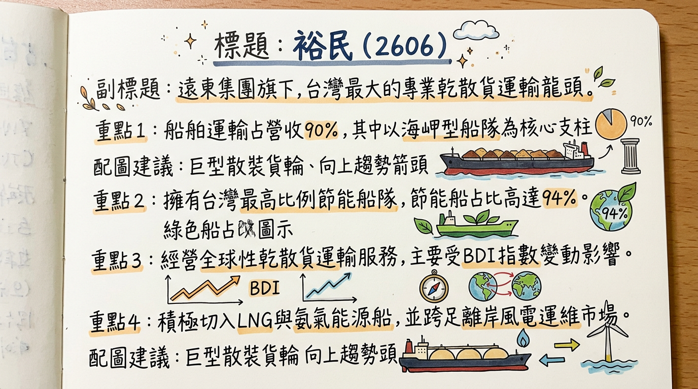
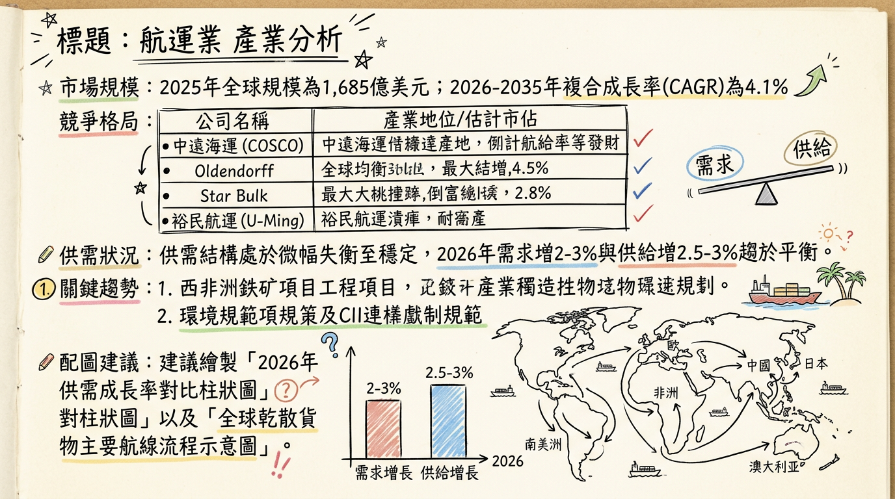
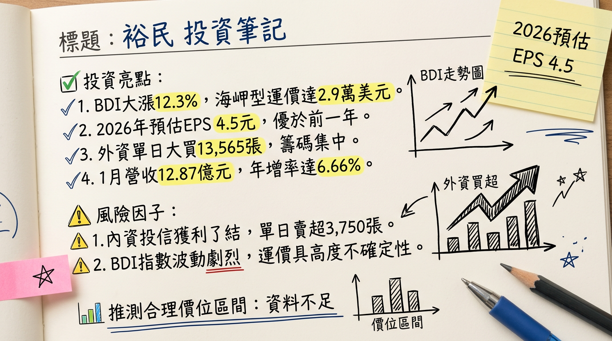

# 2606 裕民 深度研究報告：長水路需求爆發與節能船隊紅利，迎接 2026 成長大循環

## 一句話摘要
受惠「西非幾內亞 Simandou 鐵礦計畫」引發的長水路海岬型船舶需求，以及全球最年輕節能船隊的成本優勢，裕民（2606）正進入供需結構優化後的獲利高速增長期，預期 2026 年 EPS 將挑戰 5 元大關。

---

## 公司概覽
裕民航運隸屬**遠東集團**，為台灣散裝航運龍頭，以經營全球性乾散貨運輸（鐵礦砂、煤炭、穀物）為核心。

### 業務與營收結構
| 業務類別 | 營收佔比 | 核心內容 |
| :--- | :--- | :--- |
| **船舶運輸收入** | ~90% | 以海岬型（Capesize）為主，受 BDI 指數高度影響 |
| **船務代理及其他** | ~10% | 含租賃、代理、水泥船及離岸風電運維船 (CTV) |

### 船隊構成特點
*   **規模**：截至 2026/03，營運中及訂造船隊約 80 艘，總載重噸位逾 950 萬噸。
*   **環保優勢**：**94% 船隊為節能船**（業界平均僅約 35%）。
*   **船齡**：平均船齡僅 **6.8 年**（遠低於市場平均 12.8 年）。

---

## 核心競爭優勢
1.  **高比例節能船隊**：在歐盟碳稅（FuelEU Maritime）及 CII 規範下，裕民的節能船具備更低燃油成本（節省 10-15%）與免受環保罰款的優勢。
2.  **海岬型配置領先**：營收 55% 來自海岬型船，最能直接受惠於西非與巴西長途航線帶動的「延噸海浬」需求。
3.  **遠東集團綜效**：穩定的內部水泥與電力（煤炭）運輸需求提供基本盤。

---

## 財務分析

### 月營收趨勢表
| 月份 | 營收金額 (億新台幣) | 月增率 MoM | 年增率 YoY | 備註 |
| :--- | :--- | :--- | :--- | :--- |
| **2026/01** | 12.87 | -8.12% | +6.66% | 淡季不淡，反映運價基期抬高 |
| **2025/12** | 14.01 | -2.48% | +16.53% | 西非鐵礦砂首批出貨帶動 |
| **2025/11** | 14.36 | +3.51% | +8.94% | 幾內亞計畫啟動 |
| **2025/10** | 13.88 | -3.04% | +3.07% | 營運平穩 |
| **2025/09** | 14.31 | -2.39% | -1.09% | |
| **2025/08** | 14.66 | +4.98% | +16.58% | 2025 下半年復甦起點 |

### 年度與季度獲利數據
*   **2025 全年營收**：155.69 億元。
*   **2025 Q3 表現**：單季 EPS **1.72 元**（較 Q1 的 0.27 元成長 537%），毛利率達 **35.32%**。
*   **2026 預估**：法人預期營收達 **178.86 億元**，EPS 預估 **5.15 ~ 5.20 元**。

---

## 法說會重點（2025/12 管理層 Guidance）
1.  **Simandou 效應**：西非幾內亞鐵礦計畫於 2025 年底投產，其至中國航程為澳洲線的 3 倍，極大化海岬型船需求。
2.  **2026 Q2 展望**：預期第二季營收季增與年增將雙雙**突破 20%**，單季 EPS 季增幅度看好達 80%。
3.  **供給受限**：目前全球散裝新船訂單率僅 10%（歷史低位），且船廠產能被貨櫃船與 LNG 船填滿，2026 年新船供給增速將維持低檔。

---

## 券商觀點
| 券商名稱 | 報告日期 | 評等 | 目標價 | 2026 EPS 預估 |
| :--- | :--- | :--- | :--- | :--- |
| **國票證券** | 2026/02/24 | 看多 | **$77** | 5.20 元 |
| **元大投顧** | 2026/02/23 | 看多 | **$75** | 5.15 元 |
| **市場共識均值** | 2026/03/02 | 買進 | **$72-78** | 5.10 元 |

---

## 財報深度分析

### 利潤率趨勢比較
| 指標 | 2025 Q3 | 2025 Q2 | 2024 Q3 | 趨勢分析 |
| :--- | :--- | :--- | :--- | :--- |
| **毛利率** | 35.32% | 22.8% | 35.3% | 運價回升帶動利潤顯著跳增 |
| **營業利益率** | 30.13% | 17.8% | 29.8% | 規模經濟與成本控制優異 |
| **淨利率** | 33.83% | 17.9% | 32.5% | 業外匯兌與轉投資貢獻穩定 |

### 營運效率與資本支出
*   **應收帳款週轉天數**：由 20.92 天縮短至 **10.56 天**，現金流極佳。
*   **資本支出**：2024-2025 年密集訂造 13 艘新船，2026 年起進入交付高峰期。
*   **負債結構**：財務穩健，每股未分配盈餘約 **23.69 元**，具備高配息能力（2025 發放 3.2 元現金股利）。

---

## 產業分析

### 全球競爭格局比較
| 公司 | 國籍 | 優勢 | 2025 營收規模 (預估) |
| :--- | :--- | :--- | :--- |
| **中遠海運 (COSCO)** | 中國 | 國家級規模，垂直整合 | 全球首位 |
| **裕民 (2606)** | 台灣 | **節能船佔比 94%**、年輕船隊 | ~155 億 NTD |
| **慧洋-KY (2637)** | 台灣 | 中小型船霸主，日系造船 | ~169 億 NTD |
| **Star Bulk** | 希臘 | 數位化管理、全數加裝脫硫塔 | 納斯達克巨頭 |

---

## 近期催化劑
*   **利多**：
    1.  **BDI 彈升**：2026/01 下旬海岬型運價站回 29,000 美元/日。
    2.  **外資掃貨**：2026/03/02 外資單日大買 13,565 張。
    3.  **烏克蘭重建**：預期 2026 H2 啟動基建原物料運輸需求。
*   **利空**：
    1.  **中國房市**：若鋼鐵需求總量面臨天花板，將壓抑長期運價上限。
    2.  **油價波動**：若中東局勢導致油價暴漲，雖有節能船優勢但仍會侵蝕毛利。

---

## ⭐ 成長動能時間軸
*   **2025/11**：幾內亞 Simandou 鐵礦計畫首批出貨（長水路需求起點）。
*   **2026/Q1**：BDI 淡季不淡，海岬型日租金重返 $29,000。
*   **2026/Q2**：預計 2 艘新船交付（1 艘 LNG、1 艘極限靈便型），營收挑戰季增 20%。
*   **2026/H2**：烏克蘭戰後重建商機預期發酵，大宗物資運輸需求達高峰。
*   **2027-2028**：剩餘 11 艘新船陸續交付，船隊規模達成 100 艘目標。
*   **2027**：2 艘新型 CSOV 離岸風電運維船產能開出，切入綠能營收。

---

## 2026 展望：成長動能 vs 風險
*   **成長動能**：延噸海浬增加（Simandou 計畫）、低新船供給成長（< 3%）、環保法規促使老舊船汰除。
*   **潛在風險**：中國房地產復甦力道弱於預期、地緣政治緩解導致繞道需求消失（運力釋放）。

---

## 投資結論
1.  **獲利上升週期**：裕民 2026 年受惠供需結構性改善，EPS 有望從 2025 年的 4.2-4.5 元成長至 **5.1-5.5 元**。
2.  **資產品質最優**：擁有全台最高比例節能船隊，在低碳航運時代具備訂價權與溢價能力。
3.  **高股息防禦**：預期 2026 年現金股利維持 3 元以上，殖利率約 **4.5% - 5.0%**，具下檔支撐。
4.  **建議目標價**：基於 2026 年 EPS 與 14-15 倍本益比估算，合理股價區間為 **$71 - $82**，目前股價約 $71.4，具備參與旺季行情的空間。

---
**本報告由 AI 自動產生，資料來源為公開網路資訊，僅供參考，不構成投資建議。產生時間：2026-03-03 12:27**

---

## 📊 資訊卡

