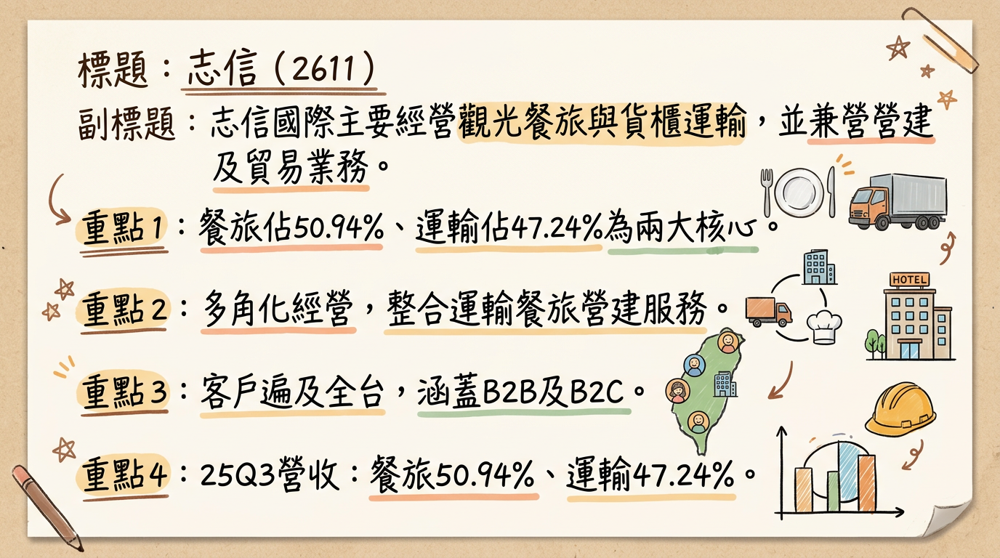
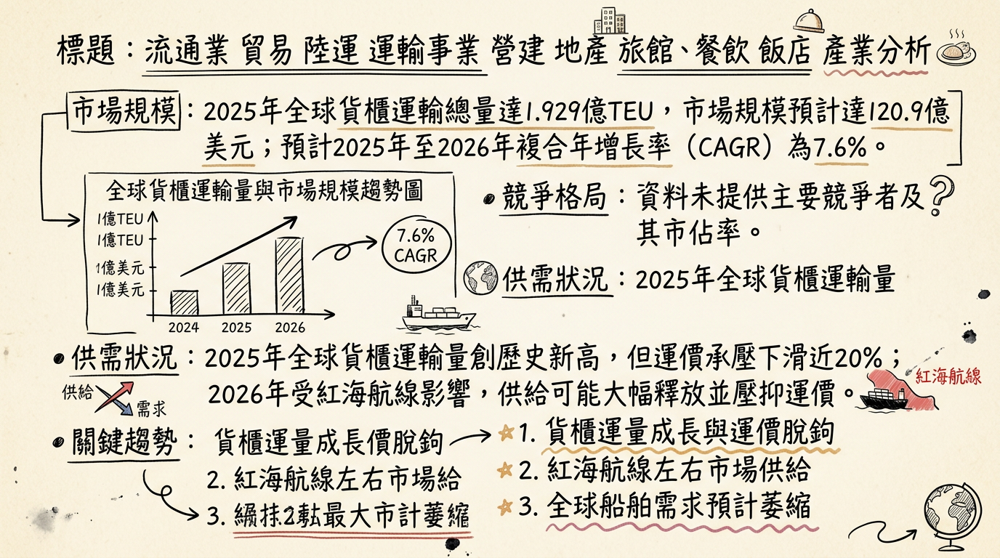
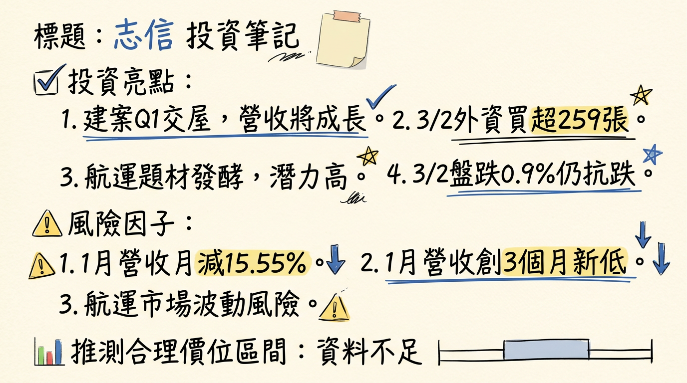

# 2611 志信 深度研究報告

**今天日期：2026年03月06日**

## 一句話摘要

志信國際（2611）為多角化經營企業，涵蓋運輸、觀光休閒與營建。旗下美麗信花園酒店改裝後營運表現亮眼，營建事業竹南「志信耘豊」建案預計2026年第一季開始交屋入帳，將成為未來營收與獲利的重要催化劑，管理層預期若建案順利入帳，全年獲利有望較2025年顯著翻倍。然而，運輸本業面臨全球運力過剩挑戰，且公司獲利高度依賴業外收益，長期獲利穩定性仍需持續觀察。

## 公司概覽

志信國際（2611）主要經營運輸、營建、觀光休閒及貿易商品買賣業務，核心業務多元，旨在分散經營風險並尋求多角化成長。

*   **運輸事業：** 由子公司新海運輸負責，核心服務為**貨櫃運輸**，提供全省長途轉運、港口船邊拖運及油槽櫃運輸等服務。
*   **觀光休閒事業：** 主要經營**國際觀光旅館業務**，旗下擁有**美麗信花園酒店**，提供住宿、餐飲、健身俱樂部及商務會議等服務，並包含美麗灣渡假村的其他休閒服務。
*   **營建事業：** 由母公司主導，從事**不動產開發、興建與銷售業務**，產品涵蓋廠辦、商場及住宅大樓。
*   **貿易商品買賣業務**。

### 營收結構（2025年前三季）

| 業務類型     | 營收佔比 |
| :----------- | :------- |
| 餐旅收入     | 50.94%   |
| 運輸收入     | 47.24%   |
| 其他收入     | 1.82%    |
| **合計**     | **100%** |

*註：2025年上半年度數據顯示，運輸收入佔合併營收50.8%，餐旅收入佔47.43%，結構大致維持。*

### 營運據點

志信主要為服務業及營建業，無傳統「製造基地」，其營運據點分佈如下：

*   **運輸事業營運據點：** 遍布基隆、桃園、台中及高雄，提供全省性貨櫃運輸服務。
*   **觀光休閒事業據點：** 位於台北市的「美麗信花園酒店」及台東的「美麗灣渡假村」。
*   **營建事業進行中/規劃中建案：** 位於苗栗竹南的「志信耘豊」別墅社區建案，規劃16棟別墅，預計於2026年第一季開始交屋入帳。公司於2025年度再度購入竹南土地，預計2026年推動新案。

## 核心競爭優勢

1.  **多角化經營分散風險：** 志信業務涵蓋運輸、觀光休閒與營建三大板塊，多元化的營收來源有助於分散單一產業景氣波動帶來的風險。
2.  **觀光事業強勁復甦：** 美麗信花園酒店自2023年1月完成全館設備更新後，營運表現顯著提升，2024年全年住房率達93%，2025年前三季平均住房率仍維持此高水準，創下開館以來最佳營運紀錄，成為公司穩定的獲利來源。
3.  **營建事業轉型升級：** 營建事業將朝危老都更等多元化方向發展，並有「志信耘豊」建案預計於2026年第一季交屋入帳，以及2025年購入竹南新土地預計2026年推動新案，有望成為公司重要的成長催化劑。
4.  **永續發展策略：** 公司未來將持續關注綠能產業及ESG議題，並設置永續發展委員會，以追求永續發展，有助於提升企業形象並符合市場長期趨勢。

## 財務分析

### 月營收趨勢

| 月份      | 金額 (新台幣萬元) | 月增率 (MoM) | 年增率 (YoY) |
| :-------- | :---------------- | :----------- | :----------- |
| 2026年01月 | 5,540             | -15.55%      | -3.17%       |
| 2025年12月 | 6,560.2           | 15.67%       | -5.33%       |
| 2025年11月 | 5,672             | 4.47%        | -6.71%       |
| 2025年10月 | 5,429             | 6.87%        | 0.04%        |
| 2025年09月 | 5,080             | -3.36%       | -8.36%       |
| 2025年08月 | 5,256             | -1.10%       | -8.23%       |

### 季度數據

| 年度/季度   | 季營收 (新台幣億元) | 毛利率    | 營業利益率 | EPS (新台幣元) |
| :---------- | :------------------ | :-------- | :--------- | :------------- |
| 2025年第三季 | 1.57                | 25.81%    | -7.58%     | 0.73           |
| 2025年第二季 | 1.71                | 31.02%    | -14.99%    | 0.19           |
| 2025年第一季 | 1.68                | 32.00%    | -20.65%    | -0.49          |

### 年度趨勢

| 年度       | 全年度營收 (新台幣億元) | 全年度 EPS (新台幣元) |
| :--------- | :---------------------- | :-------------------- |
| 2024年 (實際) | 6.87                    | 1.64                  |
| 2025年 (實際) | 6.72                    | 0.38                  |

*註：2025年全年營收與EPS較2024年有所下滑，顯示當年度獲利面臨挑戰。*

## 法說會重點

**最近一次法說會日期：** 2025年12月18日

**管理層發言與具體 guidance：**

*   **營建事業：** 位於苗栗竹南的「志信耘豊」建案已進入完工登記階段，預計於**2026年第一季**開始交屋入帳，將成為未來營收的重要動能。公司已於2025年度再度購入竹南土地，預計**2026年**推動新案。
*   **觀光事業：** 美麗信花園酒店在全館設備更新後，營運表現顯著提升。2024年全年度住房率達**93%**，2025年前三季平均住房率仍維持此高水準，創下開館以來最佳表現。
*   **運輸事業：** 保持穩健營運。
*   **獲利展望：** 管理層預期，若**2026年第一季**建案能順利入帳，全年獲利有望較2025年顯著翻倍。

**產能利用率、資本支出金額：** 法說會資料中未提及具體的產能利用率和資本支出金額。

## 券商觀點

目前未找到2025-2026年關於志信 (2611) 具體的券商目標價、各券商對2025-2026年EPS的預估數字，以及近期重大調升/調降評等的最新公開資料。

| 券商名稱 | 目標價 (新台幣元) | 評等 | 日期 |
| :------- | :---------------- | :--- | :--- |
| **無**   | **無**            | **無** | **無** |

## 財報深度分析

### 利潤率趨勢

| 年度/季度   | 毛利率    | 營業利益率 | 稅後淨利率 |
| :---------- | :-------- | :--------- | :--------- |
| 2025年第三季 | 25.81%    | -7.58%     | 89.18%     |
| 2025年第二季 | 31.02%    | -14.99%    | 20.96%     |
| 2025年第一季 | 32.00%    | -20.65%    | -55.14%    |
| 2024年第四季 | 33.48%    | -16.48%    | -16.66%    |

*   **利潤率變化的原因分析：**
    *   2025年前三季合併營收新台幣4.96億元，歸屬於母公司業主之淨利7,280萬元，EPS 0.39元。
    *   毛利率與營業利益率在2025年呈現波動且營業利益率多為負值，顯示本業經營成本壓力較大。
    *   稅後淨利率在2025年第一季為負值，但第三季顯著提升至89.18%，這強烈暗示了**業外收入**對於公司整體獲利貢獻的重要性與波動性。

### 存貨分析

| 年度/季度   | 存貨週轉天數 (天) | 應收帳款收現天數 (天) |
| :---------- | :---------------- | :-------------------- |
| 2025年第三季 | 568.99            | 34.52                 |
| 2025年第二季 | 437.93            | 33.07                 |
| 2025年第一季 | 315.47            | 37.10                 |
| 2024年第四季 | 266.16            | 35.61                 |

*   **存貨是否有異常堆積或備料現象：** 志信的存貨週轉天數從2024年第四季的266.16天顯著上升至2025年第三季的568.99天，這表示存貨去化速度明顯變慢，可能存在存貨異常堆積的現象，特別是在營建事業。這需要密切關注後續的存貨跌價損失風險。
*   **應收帳款趨勢：** 近幾季應收帳款週轉天數相對穩定，約在33至37天之間，顯示公司的收款能力大致維持。

### 資本支出與折舊攤銷

| 年度/季度   | 投資現金流 (新台幣千元) |
| :---------- | :---------------------- |
| 2025年第三季 | -276,306                |
| 2025年第二季 | 3,429                   |
| 2025年第一季 | -31,665                 |
| 2024年第四季 | -60,956                 |
| 2024年第三季 | -207,686                |

*   **近3年資本支出金額與趨勢：** 投資現金流在2025年第三季有較大的流出（-276,306千元），顯示存在較高的資本支出活動。這可能與公司在2025年購入竹南土地，以及營建項目推進有關。
*   **未來資本支出計畫：** 公司已於2025年度再度購入竹南土地，預計2026年推動新案。營建事業將朝危老都更等多元化方向發展，這些都預示著未來的資本支出將持續投入於土地與建案開發。
*   **折舊攤銷趨勢：** 2024年折舊費用為**0.42億元**，攤銷費用為**0.24億元**。從2018年至2024年的年度數據來看，折舊費用在0.37億元至0.63億元之間波動，攤銷費用則在0.19億元至0.34億元之間波動，反映相對穩定的資產折舊情況。

### 其他財務重點

*   **負債比率：** 2025年第三季負債比率為**30.83%**，較前一季的36.29%有所下降，維持在相對健康的財務水位。
*   **自由現金流量：** 自由現金流量在2025年上半年呈現負值（Q1 -244,357千元, Q2 -240,838千元），顯示營運現金流不足以支應投資活動，但在2025年第三季轉為正值（67,720千元）。
*   **業外收支：** 志信2025年前9個月累積營業外收入及支出合計為**71,569千元**，2025年第三季營業外收入及支出合計為**134,956千元**。業外收支佔稅前淨利比率在各季度均為較高的百分比，顯示業外收入（如投資收益、處分資產利得等）對公司獲利具有顯著影響，也增加了獲利波動性。

## 股權異動

*   **董監事/大股東申報轉讓紀錄：** 未找到2024年以後的最新申報轉讓紀錄。
*   **庫藏股買回紀錄：** 未找到2024年以後的最新庫藏股買回紀錄。
*   **可轉換公司債 (CB)：** 未找到2024年以後的最新發行可轉換公司債紀錄。
*   **現金增資或減資計畫：** 未找到2024年以後的最新現金增資或減資計畫。

### 股利政策

| 發放年度 | 現金股利 (新台幣元) | 股票股利 (新台幣元) | 除息日     | 現金發放日   |
| :------- | :------------------ | :------------------ | :--------- | :----------- |
| 22025年  | 1.64                | 0                   | 2025年7月2日 | 2025年7月31日 |
| 2024年   | 2.30                | 0                   | 2024年7月2日 | 2024年7月31日 |

志信近年股利政策以發放現金股利為主，2024年和2025年均無股票股利發放紀錄，顯示公司傾向以現金回饋股東。

## 產業分析

志信國際（2611）業務多元，以下針對其主要業務所屬產業進行深入分析。

### 產業數據

#### 1. 運輸事業：貨櫃運輸 (全球市場)

*   **市場規模：** 2025年全球貨櫃運輸總量達到**1.929億TEU**，較2024年增長**4.7%**。全球貨櫃市場規模預計將從2025年的**120.9億美元**增長到2026年的**130.1億美元**。
*   **CAGR 成長率：** 預計2025年至2026年的複合年增長率為**7.6%**，2026年至2030年為**7.4%**。
*   **供需狀況：** 2025年全球貨櫃運輸量創歷史新高，但運價持續承壓，年末整體運費水平較上一年度下滑近**20%**，顯示貨量增長未能帶動運價同步上漲。2026年市場不確定性顯著，若紅海航線恢復暢通，BIMCO估計全球船舶需求將減少約**10%**，且2023年至2027年間新船運能將激增**36%**，加劇結構性產能過剩問題。
*   **平均毛利率水準：** 未找到2025-2026年貨櫃運輸業平均毛利率的具體數據。陽明海運2025年12月法說會表示，歐洲線長約談判艱困，反映運價尚未能充分反映成本壓力。

#### 2. 觀光休閒事業：國際觀光旅館業務 (全球市場)

*   **市場規模：** 全球酒店市場規模在2025年為**20,805.7億美元**，預計2026年增長至**21,978億美元**。全球高級酒店市場在2025年估值為**1707.7億美元**，預計2026年將達到**1896.8億美元**。
*   **CAGR 成長率：** 全球酒店市場預計2026年至2034年複合年增長率為**7.54%**。全球高級酒店市場預計2026年至2034年複合年增長率為**10.33%**。
*   **供需狀況：** 2025-2026年是商旅市場由「復甦」轉向「再成長」的關鍵轉折期。2025年酒店業績表現平穩，RevPAR（每間可銷售客房收入）微幅增長**0.2%**。預計2026年新客房供應有限，將使各區域每日房價仍維持小幅走揚。
*   **平均毛利率水準：** 酒店利潤率預計在2025年連續第三年下降。未找到2025-2026年國際觀光旅館業平均毛利率的具體數據。

#### 3. 營建事業：不動產開發、興建與銷售業務 (台灣市場)

*   **市場規模：** 台灣營建業在2025年實質增長**4.8%**。2025年前三季台灣營建業的附加價值年增率在Q1、Q2、Q3分別為**5.4%、6.5%、3%**。2025年台灣不動產市場景氣顯著向下修正，全年建物買賣移轉件數面臨**26萬件**的保衛戰，創八年來新低。
*   **CAGR 成長率：** 台灣營建業產值預計在2027年至2029年間以**4.2%**的平均年增長率增長，此前2025年增長**4.8%**。
*   **供需狀況：** 2025年台灣房市因央行選擇性信用管制措施、銀行緊縮房貸等因素，呈現量縮價緩跌。2026年將是「交屋潮」全面來襲的一年，特別是新北市、台中市與桃園市將面臨巨大的賣壓，預計2026年上半年價格將開始實質性下修。市場結構已從「供不應求」轉向「供多需少」。
*   **平均毛利率水準：** 過去營造廠毛利率多為「毛三到四」（3-4%），現在透過「擇優承攬」訂單，平均毛利率可達**7%以上**。根基營造（2546）2025年營業毛利率為**8.5%**。

#### 4. 貿易商品買賣業務

*   未找到2024年以後的最新市場規模、CAGR成長率、供需狀況及平均毛利率水準等具體數據。

### 競爭格局

由於志信（2611）的業務多元且在各領域規模相對較小，直接與全球前五大公司比較並取得具體數據難度高。以下聚焦於台灣同業比較。

#### 志信 vs 主要競爭對手的具體比較 (台灣同業)

| 公司名稱     | 業務性質             | 營收規模 (2025)     | 毛利率 (2025) | EPS (2025) | 備註                                         |
| :----------- | :------------------- | :------------------ | :------------ | :--------- | :------------------------------------------- |
| **志信 (2611)** | 貨櫃運輸、觀光旅館、營建、貿易 | 6.72億元 (預估)     | 25.81% (Q3)   | 0.38元 (實際) | 美麗信酒店營運良好，營建案2026Q1交屋入帳。 |
| **運輸同業** |                      |                     |               |            |                                              |
| 陽明 (2609)  | 貨櫃運輸             | 營收疲軟            | -             | -          | 歐線長約談判艱困，2026年變數仍多。全球排名第九。 |
| 長榮 (2603)  | 貨櫃運輸             | 營收疲軟            | -             | -          | 積極訂造新船，強化競爭力，全球節能船舶達八成。 |
| 萬海 (2615)  | 貨櫃運輸             | 營收疲軟            | -             | -          | 近年船舶規模成長最快，已擴大到遠洋線。全球第十大。 |
| **觀光休閒同業** |                      |                     |               |            |                                              |
| **(無直接可比台灣上市櫃國際觀光旅館同業的2025-2026年數據)** |                     |                     |               |            |                                              |
| **營建同業** |                      |                     |               |            |                                              |
| 根基 (2546)  | 營建工程             | 214.94億元 (2025)   | 8.5%          | 9.52元     | 營收和EPS創歷史新高，在手未認列工程金額約406億元。 |
| 達欣工       | 營建工程             | -                   | >7%           | -          | 廠辦工程佔比60%，長期為台積電建廠夥伴。在手案量超過350億元。 |
| 新亞建       | 營建工程             | -                   | >7%           | -          | 手中工程總案量逾500億元，未完工案量340多億元。 |

*   **志信與主要競爭對手比較概述：**
    *   **運輸事業：** 志信的運輸事業規模遠小於「貨櫃三雄」（陽明、長榮、萬海），在國際航線運力及議價能力上處於劣勢。大型航商正積極投資環保節能新船。
    *   **觀光休閒事業：** 缺乏直接可比的上市櫃國際觀光旅館同業數據。志信的美麗信花園酒店在改裝後表現亮眼，但整體飯店業面臨利潤率下降的壓力。
    *   **營建事業：** 志信的營建業務規模較根基、達欣工、新亞建等大型營造廠小。大型營造廠受惠於公共工程、科技廠辦及商辦訂單，在手案量充沛且毛利率有所提升。

### 產業趨勢

#### 1. 影響該產業的 2-3 個關鍵技術趨勢和具體影響

*   **運輸事業（貨櫃運輸）：**
    *   **智慧貨櫃追蹤與物聯網（IoT）：** 航運公司積極開發基於雲端的技術，優化追蹤、庫存管理和物流運營，提升貨運可視性、降低營運成本。
    *   **減碳與環保船隊：** 減碳趨勢推動航運公司訂造符合EEDI法規的環保船隊（如LNG雙燃料貨櫃輪），降低排放並提升燃油效率。
*   **觀光休閒事業（國際觀光旅館）：**
    *   **人工智慧（AI）應用：** AI加速導入酒店業，驅動個性化服務、動態定價和營運效率提升，提高盈利能力和客戶參與度。
    *   **永續旅遊與健康主題：** 企業會議活動更注重「體驗、健康、永續」，永續差旅方案和健康旅遊擴大，促使酒店提供相關服務。
*   **營建事業（不動產開發與銷售）：**
    *   **智慧建築與綠建築：** 企業對高規格、永續的商用不動產需求提升，強調ESG、節能與智慧化，吸引追求高效與環保的企業客戶。
    *   **營建工程系統化、自動化：** 面對缺工問題，導入工程系統化、自動化作業可降低人力依賴，解決「人才荒」，縮短工期並控制成本。

#### 2. 對 志信 而言的具體機會和威脅

*   **機會：**
    *   **運輸事業：** 區域供應鏈一體化及全球電子商務興起，對高效物流與產品交付需求增加。若能導入智慧物流技術，可提升效率。
    *   **觀光休閒事業：** 全球商務旅遊需求回歸正常及亞洲地區觀光客成長快速，為美麗信花園酒店帶來客源。AI技術應用可提升服務和營運效率。
    *   **營建事業：** 台灣營建業受惠於重大公共建設及AI帶動科技廠建廠需求，若志信能專注於具備永續認證與智慧建築規格的產品，並導入自動化作業以解決缺工問題，將具有競爭力。
*   **威脅：**
    *   **運輸事業：** 全球貨櫃航運市場結構性運力過剩，若紅海航線恢復暢通，運價可能進一步下跌，對獲利造成壓力。
    *   **觀光休閒事業：** 酒店利潤率預計在2025年持續下降，全球經濟不確定性可能影響旅遊意願，高端市場競爭激烈。
    *   **營建事業：** 台灣房市因央行信用管制和房貸緊縮進入盤整期，2026年將是「調整年」，價格面臨修正壓力。商辦市場也將面臨新供給高峰期，空置率可能上升。營建業缺工問題持續。

#### 3. 相關投資題材的具體連結

*   **AI (人工智慧)：**
    *   **運輸：** AI可優化貨櫃航線、提升港口自動化效率，實現智慧物流。
    *   **觀光休閒：** AI可提升酒店客戶服務體驗、精準行銷、動態定價和營運管理。
    *   **營建：** AI應用於智慧建築設計、施工流程優化、BIM管理，提升廠辦智慧化程度。
*   **電動車：**
    *   **運輸：** 電動卡車和電動港口設備推動綠色轉型，降低碳排放和燃油成本。
    *   **營建：** 電動車充電樁基礎設施建置需求，以及相關廠辦興建帶來商機。
*   **ESG (環境、社會、公司治理)：**
    *   **運輸：** 航運業面臨減碳要求，投資綠色環保船隊是趨勢。
    *   **觀光休閒：** 酒店業需推動永續經營，如綠色能源、減少廢棄物、永續旅遊方案。
    *   **營建：** 綠建築、智慧建築和符合ESG標準的廠辦、商辦開發，是未來不動產市場關鍵。

## 近期催化劑

### 利多/利空事件清單 (近 3 個月)

*   **2026年03月03日：** 志信公告其114年度合併財務報告董事會預計於**2026年3月11日**召開，市場將關注2025年全年獲利表現。
*   **2026年03月02日：** 志信獲得外資買超**259張**，自營商買超**46張**，融資買超**35張**。在當日大盤下跌**0.90%**的情況下，顯示特定資金進場，具抗跌性與攻擊意圖。
*   **2026年02月26日：** 外資買超**92張**。
*   **2026年02月09日 (利空)：** 志信公布2026年1月合併營收為新台幣**5,540萬元**，月減**15.55%**，年減**3.17%**，為近3個月以來新低。
*   **2026年01月10日：** 志信公布2025年12月合併營收為新台幣**6,560.2萬元**，月增**15.67%**，年減**5.33%**。
*   **2025年12月22日 (利多)：** 苗栗竹南「志信耘豊」建案已進入完工登記階段，預計於**2026年第一季**開始交屋入帳，將成為未來營收的重要動能。公司於2025年度已再度購入竹南土地，預計**2026年**推動新案。
*   **2025年12月18日：** 召開法人說明會，管理層樂觀預期若2026年Q1建案順利入帳，全年獲利有望較2025年顯著翻倍。
*   **2025年11月12日：** 董事會通過114年第三季合併財務報告，累計營收**4.96億元**，歸屬於母公司業主淨利**7,280萬元**，EPS **0.39元**。同時決議設置永續發展委員會。
*   **2025年12月09日：** 志信公布2025年11月營收為新台幣**5,671.6萬元**，月增**4.46%**，年減**6.71%**。
*   **地緣政治風險 (中東衝突)：** 志信雖主要業務為陸運，但歸類於航運族群，中東局勢（哈梅內伊遇害、荷姆茲海峽封鎖風險）推升運價與通膨預期的情緒下，志信常隨航運三雄同步起舞。

## ⭐ 成長動能時間軸

| 成長動能         | 具體內容                                         | 時間點/狀態                           |
| :--------------- | :----------------------------------------------- | :------------------------------------ |
| **營建事業入帳**   | 「志信耘豊」別墅社區建案規劃16棟別墅，預計開始交屋入帳。 | **2026年第一季**                      |
| **新土地開發案**   | 2025年度再度購入竹南土地，預計推動新案。         | **2026年**                            |
| **觀光事業升級效益** | 美麗信花園酒店全館設備更新完成，營運表現顯著提升。 | **2023年1月完成，效益持續至2026年**   |
| **觀光住房率**     | 2024年全年住房率達93%，2025年前三季仍維持高水準。 | **持續高檔**                          |
| **綠能與ESG策略**  | 公司將持續關注綠能產業及ESG議題，追求永續發展。    | **長期策略，持續推進**                |
| **運輸下游需求**   | 運輸本業與台灣進出口貿易量連動，若全球供應鏈重配置，對陸運與倉儲需求具支撐。 | **持續連動，受全球貿易與地緣政治影響** |

*   **擴廠計畫：** 未找到2025-2026年的最新擴廠地點、投資金額、預計完工/量產時間的具體資料。
*   **新客戶/新市場：** 未找到2025-2026年是否切入新客戶或新應用市場（含具體客戶名或領域）的最新資料。
*   **資本支出增加：** 未找到2025-2026年資本支出增加的原因、預計帶來的產能增幅的具體資料，但投資現金流在2025Q3有較大流出，暗示相關投入。
*   **產能擴充：** 未找到2025-2026年現有產能 vs 規劃產能（具體數字 + 時程）的具體資料。

## 2026 展望

### 成長動能

1.  **營建事業挹注獲利：** 苗栗竹南「志信耘豊」建案預計於2026年第一季開始交屋入帳，將為2026年上半年帶來顯著的營收與獲利成長，有望成為全年獲利的重要支撐。
2.  **觀光事業穩健貢獻：** 美麗信花園酒店在全館設備更新後，住房率持續維持高檔（2024年93%，2025年前三季同），預計將繼續為公司提供穩定的營收與獲利。
3.  **新土地開發潛力：** 2025年購入竹南新土地，預計2026年推動新案，為營建事業的未來成長奠定基礎。
4.  **綠能與ESG轉型：** 公司對綠能產業及ESG議題的關注，若能有效轉化為具體業務成果或提升企業價值，有望建立更具韌性的長期成長基礎。
5.  **運輸本業支撐：** 儘管面臨產業挑戰，但其進出口貨櫃運輸業務與台灣貿易量連動，且中東衝突可能導致供應鏈重配置，對其陸運與倉儲業務需求具備支撐。

### 風險因子

1.  **營運外收入波動風險：** 志信的獲利穩定性受到業外收入的顯著影響，例如2025年第三季稅後淨利率高達89.18%，但營業利益率仍為負值，顯示本業獲利能力較弱，對非經常性收益的依賴性高，增加了未來獲利的不確定性。
2.  **財務結構弱化趨勢：** 2025年第三季總資產與股東權益較去年同期顯著下滑，儘管負債比率有所下降，但自由現金流量在2025年上半年呈現負值，且存貨週轉天數大幅拉長至568.99天，可能暗示資產去化速度變慢，潛在存貨跌價損失風險，長期可能影響公司擴張能力及抗風險能力。
3.  **營建市場不確定性：** 台灣房市在政策調控與升息環境下，2026年預計為「調整年」，面臨交屋潮帶來的賣壓與價格修正壓力。若「志信耘豊」建案入帳不如預期或後續新案銷售不佳，將對2026年獲利造成衝擊。
4.  **全球航運市場逆轉風險：** 若紅海航線恢復暢通，全球貨櫃運輸市場可能面臨結構性運力過剩，運價恐再度承壓，對志信的運輸本業造成衝擊。
5.  **總經風險與地緣政治：** 全球經濟不確定性、通膨壓力及中東衝突的持續演變，都可能影響其各事業體的營運，例如觀光收益的壓抑或營運成本的上升。
6.  **技術面弱勢格局：** 截至2026年2月，技術面呈現弱勢格局，移動平均線空頭排列，短期內股價可能維持弱勢盤整或有進一步下跌空間，投資人需謹慎觀望。

## 投資結論

綜合上述分析，志信（2611）在2026年面臨轉機與挑戰並存的局面。

1.  **營建事業為2026年主要催化劑：** 苗栗竹南「志信耘豊」建案預計於2026年第一季交屋入帳，是驅動2026年獲利大幅成長的關鍵。管理層「全年獲利有望較2025年顯著翻倍」的展望，主要依賴此項營建案的順利入帳。
2.  **觀光事業表現穩健，但運輸本業承壓：** 美麗信花園酒店在改裝後持續展現高住房率，提供穩定的現金流。然而，運輸事業受全球運力過剩及運價波動影響，預計將面臨較大挑戰。
3.  **獲利結構具波動性，需關注業外收益與存貨風險：** 公司過往獲利高度依賴業外收益，且2025年存貨週轉天數顯著拉長，需警惕潛在的存貨跌價風險，以及未來獲利波動性較高的特性。
4.  **中長期發展關注ESG與新案開發：** 公司積極關注綠能產業及ESG議題，並持續進行竹南新土地開發，若能有效轉型並深化各事業領域的永續發展，將有助於建立更具韌性的長期成長基礎。

**投資建議區間：**
考量公司2026年有望受營建案入帳帶動獲利較2025年（EPS 0.38元）顯著翻倍，若以2026年EPS達到0.76元至1.0元為基準（此區間反映了「顯著翻倍」的幅度，並考量營建業入帳的潛在爆發力），再給予一個反映其多角化經營、資產題材但獲利波動較高的本益比區間 **18至25倍**，建議其目標價區間為 **新台幣13.7元至25.0元**。

*   保守估計 (EPS 0.76 * 18倍本益比) = 13.68 元
*   樂觀估計 (EPS 1.00 * 25倍本益比) = 25.00 元

**目標價區間建議：新台幣13.7元 – 25.0元。** 建議投資人密切關注「志信耘豊」建案的實際入帳進度、營建市場景氣變化，以及公司業外收入的穩定性。

本報告由 AI 自動產生，資料來源為公開網路資訊，僅供參考，不構成投資建議。產生時間：2026-03-06 13:02

---

## 📊 資訊卡

