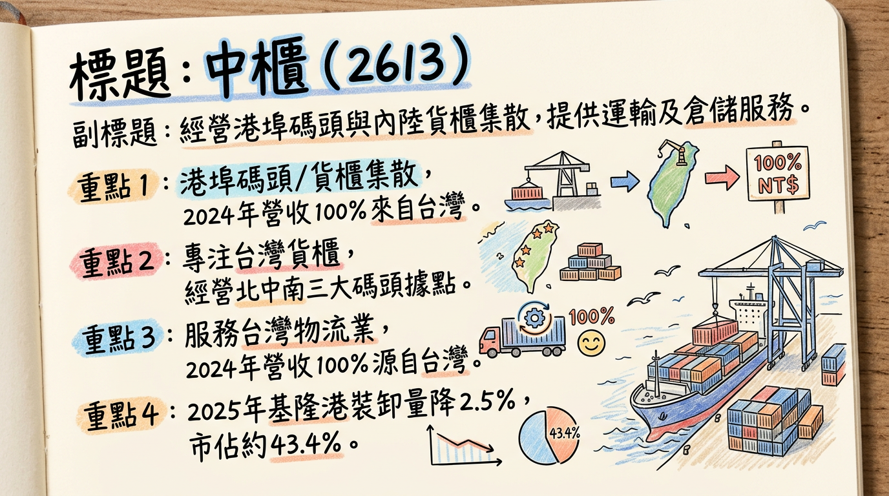
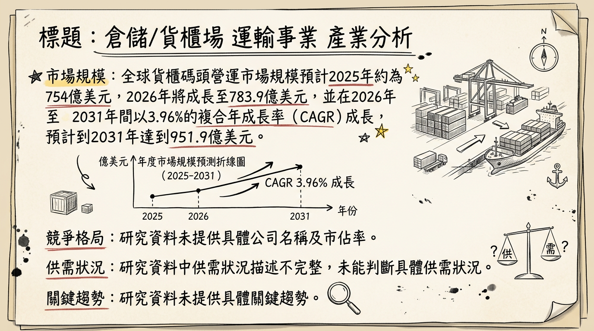
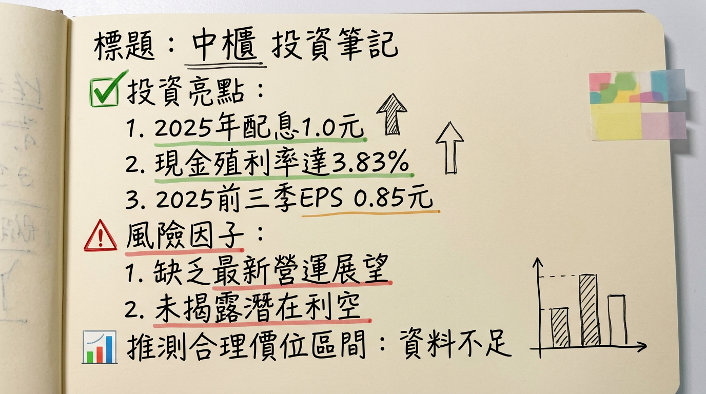

# 2613 中櫃 深度研究報告

## 一句話摘要
中櫃（2613）作為台灣港埠碼頭與貨櫃集散站的領導業者，受惠於穩健的基礎設施業務及航運產業輪動題材，儘管面臨全球海運市場運力過剩挑戰，仍透過成本控制與效率提升維持獲利韌性，並以穩定股利政策吸引資金，2026年首月營收年增14.65%，展望營運持穩向上，然需留意全球經濟放緩與航運供需失衡風險。

## 公司概覽

中國貨櫃運輸股份有限公司（中櫃，股票代碼2613）主要經營港埠碼頭與內陸貨櫃集散站，以及商港區船舶貨物裝卸承攬業務。此外，公司也辦理貨櫃修理維護業務、一般倉庫及保稅業務等多元服務。

### 營收結構 (2025年Q3)

| 業務類別   | 營收佔比 |
| :--------- | :------- |
| 碼頭業務   | 86.7%    |
| 櫃場業務   | 7.5%     |
| 其他業務   | 5.8%     |

### 製造基地與市佔率 (2025年Q1-Q3)

中櫃專注於臺灣的貨櫃集散業務，擁有北、中、南三大據點，主要承租並經營基隆港西19-21號碼頭及台中港10、11號碼頭。

| 據點   | 2025年Q1-Q3貨櫃裝卸量 (萬TEU) | 2024年Q1-Q3貨櫃裝卸量 (萬TEU) | 2025年Q1-Q3總裝卸量 (萬TEU) | 年增率 (YoY) | 2025年Q1-Q3市佔率 | 2024年Q1-Q3市佔率 |
| :----- | :----------------------------- | :----------------------------- | :---------------------------- | :----------- | :------------------ | :------------------ |
| 基隆港 | 52.0                           | 53.6                           | 119.7                         | -2.5%        | 43.41%              | 43.65%              |
| 台中港 | 45.0                           | 42.3                           | 119.0                         | -2.1%        | 35.58%              | 35.32%              |

## 核心競爭優勢

1.  **穩固的市場領導地位：** 在台灣主要港口（基隆港與台中港）的貨櫃裝卸業務中擁有領先市佔率（基隆港43.41%，台中港35.58%），反映其深厚的營運經驗與客戶基礎。
2.  **多元且穩定的業務模式：** 業務涵蓋碼頭營運、貨櫃集散、修理維護及倉儲保稅，形成相對穩定的收入來源，降低單一業務波動風險。
3.  **財務韌性與成本控制：** 儘管全球海運市場面臨多重逆風，公司透過營運效率提升與成本控制，仍展現良好的財務韌性及獲利能力，2025年Q1-Q3 EPS已超越2024全年。
4.  **積極響應ESG與智慧化：** 持續進行設備汰舊換新，引進新式橋式機與電動化設備，並在台中31號碼頭導入綠電，提升作業效率並達成碳中和目標，符合綠色港口趨勢。
5.  **高股利吸引力：** 2025年度配發每股現金股利1.0元，以近期股價計算，現金殖利率約3.83%，具備一定的防禦性與投資吸引力。

## 財務分析

### 月營收趨勢

| 月份      | 金額 (新台幣億元) | 月增率 (MoM) | 年增率 (YoY) |
| :-------- | :------------------ | :----------- | :----------- |
| 2 2026年1月 | 3.07                | -1.20%       | 14.65%       |
| 2025年12月 | 3.11                | 14.52%       | 5.27%        |
| 2025年11月 | 2.71                | 2.19%        | -4.87%       |
| 2025年10月 | 2.65                | -8.24%       | 5.28%        |
| 2025年9月  | 2.89                | -2.32%       | 3.85%        |
| 2025年8月  | 2.96                | 2.01%        | -0.25%       |

**分析：** 中櫃2026年1月營收達3.07億元，年增14.65%，創十年單月營收同期新高，顯示營運動能延續2025年底的強勁表現。儘管有月份波動，但整體年增率趨勢穩定，反映其業務量在不利的產業環境中仍能維持增長。

### 季度財務數據 (新台幣千元)

| 年度/季度 | 營收       | 營業毛利 | 營業利益 | 稅後淨利 | EPS (元) |
| :-------- | :--------- | :------- | :------- | :------- | :------- |
| 2025 Q3   | 877,386    | 159,965  | 101,000  | 49,615   | 0.36     |
| 2025 Q2   | 869,609    | 157,180  | 102,000  | 35,374   | 0.26     |
| 2025 Q1   | 771,692    | 114,723  | 62,000   | 32,370   | 0.23     |
| 2024 Q4   | 833,892    | 144,011  | 93,000   | -1,162   | -0.01    |
| 2024 Q3   | 849,000    | 153,000  | 96,000   | 50,000   | 0.36     |
| 2024 Q2   | 834,000    | 144,000  | 92,000   | 47,000   | 0.34     |
| 2024 Q1   | 769,000    | 109,000  | 60,000   | 21,000   | 0.15     |

**分析：** 2025年第三季EPS為0.36元，季增38.46%，顯示獲利能力有所改善。累計2025年前三季EPS為0.85元，已超越2024年全年獲利（0.84元），反映公司營運表現穩健，且毛利率及營業利益率在2025年均呈增長態勢。

### 年度營收與EPS

| 年度   | 全年營收 (新台幣億元) | EPS (新台幣元) |
| :----- | :---------------------- | :--------------- |
| 2025   | 33.68 (實際)            | 0.85 (Q1-Q3累計) |
| 2024   | 32.85 (實際)            | 0.84 (實際)      |

**分析：** 2025年全年營收達33.68億元，較2024年32.85億元成長2.5%。在2025年前三季EPS已超越2024全年水準，顯示公司整體營運狀況持續改善。

## 法說會重點

中櫃於2025年11月21日舉行法人說明會，說明2025年前三季營運成果與市場展望。

*   **營運成果 (2025 Q1-Q3)：**
    *   累計合併營收為新台幣25.19億元，年增2.7%。
    *   累計稅後淨利為1.17億元，每股盈餘(EPS)為0.85元，已超越2024年全年。
    *   核心碼頭作業量年減3.2%，反映全球海運市場貨量放緩，但公司獲利能力仍提升。
*   **業務部門營收比重：** 碼頭業務佔合併營收86.7%，櫃場業務佔7.5%，其他業務佔5.8%。
*   **市佔率表現：** 基隆港裝卸量市佔率為43.41%，台中港市佔率為35.58%，維持市場領先地位。
*   **資本支出與效率提升：** 公司持續進行設備汰舊換新，引進新式橋式機與電動化設備，並在台中31號碼頭導入綠電，以提升作業效率並達成碳中和目標。
*   **管理層展望與Guidance：**
    *   管理層表示，若排除報廢損失與移泊成本等特殊因素，2025年的財務表現應優於2024年。
    *   面對海運市場供過於求的新常態，預計2025年全球船隊運能將增長6.3%，遠高於貨運需求增長率2%，導致運價面臨下行壓力。
    *   公司將專注於成本控制、提升服務品質，並透過綠色港口的競爭優勢吸引客戶，以應對市場的不確定性。

## 券商觀點

目前公開資料中，未有針對中櫃（2613）於2025-2026年度的具體券商目標價及EPS預估。部分報導僅提及特定券商對貨櫃航運龍頭（如長榮）的目標價，但未涵蓋中櫃。

| 券商名稱 | 目標價 (新台幣元) | 評等 | 日期 (資訊發布) |
| :------- | :------------------ | :--- | :-------------- |
| (無明確資料) | N/A                 | N/A  | N/A             |

**註：** CMoney研究員曾於2024年11月5日提及中櫃股價報36.3元，但此為股價而非目標價，且已過時。

## 財報深度分析

### 利潤率趨勢 (季，單位：%)

| 年度/季度 | 營收 (千元) | 毛利率 | 營業利益率 | 稅後淨利率 |
| :-------- | :---------- | :----- | :--------- | :--------- |
| 2025 Q3   | 877,386     | 18.23% | 11.51%     | 5.65%      |
| 2025 Q2   | 869,609     | 18.08% | 11.73%     | 4.07%      |
| 2025 Q1   | 771,692     | 14.86% | 8.04%      | 4.19%      |
| 2024 Q4   | 833,892     | 17.27% | 11.15%     | -0.14%     |
| 2024 Q3   | 849,000     | 18.02% | 11.31%     | 5.89%      |
| 2024 Q2   | 834,000     | 17.27% | 11.03%     | 5.64%      |
| 2024 Q1   | 769,000     | 14.17% | 7.80%      | 2.73%      |

**利潤率變化原因分析：**
2025年第三季毛利率、營業利益率和稅後淨利率均呈現穩健表現，其中毛利率維持在18%以上。相較2024年第四季度的稅後淨利為負值，2025年第一季至第三季已恢復穩定獲利。整體利潤率的改善，可能歸因於公司在營運效率提升與成本控制上的努力。業外損益對稅前淨利的影響仍較大，尤其2024年Q4和2025年Q3，顯示公司在非核心業務或投資上可能存在波動，需進一步關注。

### 存貨與營運週轉趨勢

| 年度/季度 | 存貨週轉天數 (天) | 應收帳款週轉天數 (天) | 自由現金流 (千元) |
| :-------- | :------------------ | :-------------------- | :---------------- |
| 2025 Q3   | 22.74               | 62.27                 | -101,143          |
| 2025 Q2   | 22.99               | 57.83                 | -13,985           |
| 2025 Q1   | 24.70               | 64.14                 | 75,106            |
| 2024 Q4   | 23.84               | 60.36                 | 42,550            |

**分析：**
*   **存貨週轉天數：** 近四季維持在22-25天之間，顯示中櫃的存貨管理能力良好，未有異常堆積或備料現象。
*   **應收帳款週轉天數：** 約在58-64天之間波動，收款速度穩定，未見明顯惡化。
*   **自由現金流量：** 2025年第一季和2024年第四季為正值，但在2025年第二季轉為負值，第三季惡化至-101,143千元，這可能反映公司在該季度有較大的資本支出或其他投資活動，需要持續關注其現金運用狀況。

### 資本支出與折舊攤銷

| 年度/季度 | 折舊 (千元) | 攤銷 (千元) |
| :-------- | :---------- | :---------- |
| 2025 Q3   | 158,103     | 1,307       |
| 2025 Q2   | 157,477     | 1,312       |
| 2025 Q1   | 158,762     | 1,313       |
| 2024 Q4   | 155,361     | 1,336       |

**分析：** 近幾季折舊攤銷金額維持相對穩定，反映公司固定資產規模和使用狀況變化不大。法說會提及公司持續進行設備汰舊換新，引進新式橋式機與電動化設備，暗示持續的資本支出以維持競爭力與效率，但具體金額未公開。

## 股權異動

### 董監事持股與轉讓

*   **2026年1月董監事持股比例：** 37.12%。
*   **主要股東持股：** 董事長大同通運股份有限公司持股29,485張（19.9%），設質5,000張（17.0%）；大統海運股份有限公司持股12,914張（8.70%），設質5,000張（38.72%）。
*   **近期申報轉讓：** 未找到2024年以後董監事/大股東申報轉讓的最新紀錄。

### 庫藏股、可轉債、增減資

*   **庫藏股買回：** 未找到2024年以後的庫藏股買回紀錄。
*   **可轉換公司債 (CB)：** 未找到2024年以後發行可轉換公司債的紀錄。
*   **現金增資或減資：** 未找到2024年以後現金增資或減資計畫的紀錄。

### 股利政策 (現金股利，股票股利)

| 年度 (發放年度) | 現金股利 (元) | 股票股利 (元) | 除息日   | 現金發放日 | 現金殖利率 (2026/03/04收盤價25.75元) |
| :-------------- | :------------ | :------------ | :------- | :--------- | :----------------------------------- |
| 2025            | 1.0           | 0.0           | N/A      | N/A        | 3.83%                                |
| 2024            | 1.0           | 0.0           | 2025/3/13 | 2025/4/11  | 3.83%                                |
| 2023            | 0.6           | 0.0           | 2024/3/14 | 2024/4/12  | 2.33%                                |

**分析：** 中櫃近年主要以現金股利為主，2025年度配發現金股利1.0元，較2024年度維持不變，顯示公司在穩定獲利後，積極回饋股東，提供具有吸引力的現金殖利率。

## 產業分析

### 全球貨櫃碼頭營運市場規模與成長

| 市場定義           | 2025年市場規模 (美元) | 2026年市場規模 (美元) | 複合年成長率 (CAGR) | CAGR區間    | 2031/2032/2034年預估規模 (美元) |
| :--------------- | :-------------------- | :-------------------- | :------------------ | :---------- | :------------------------------ |
| 全球貨櫃碼頭營運 | 754億                 | 783.9億               | 3.96%               | 2026-2031年 | 951.9億 (2031年)              |
| 海運港口服務     | 965.7億               | 1003.1億              | 5.06%               | 2026-2034年 | 1489.3億 (2034年)             |
| 港口及碼頭營運   | 49.5141億             | N/A                   | 9.8%                | 2026-2032年 | 95.2736億 (2032年)            |
| 港口及碼頭營運   | N/A                   | N/A                   | 12%                 | 2024-2029年 | 628.8億 (2029年)              |

### 供需狀況

全球海運市場預計在2026年面臨**供過於求**的嚴峻挑戰。

*   **供給方面：** 預計2026年將有大量新造船交付，全球運力供給增速預計為3.6%，導致供給過剩壓力顯著。若紅海危機緩解，全球船舶需求將減少約10%，進一步加劇運力過剩。
*   **需求方面：** 國際貨幣基金組織（IMF）預計2026年世界經濟增長動能將進一步減弱至3.1%。儘管2025年全球貨櫃運輸總量達到1.929億TEU，增長4.7%，但同期整體運費水平卻下滑近20%，顯示貨量增長與運價上漲之間的正相關性正在弱化。

### 產業的平均毛利率水準
目前未找到2025-2026年貨櫃碼頭或港口營運產業的具體平均毛利率水準的最新資料。

### 競爭格局

#### 全球主要貨櫃碼頭營運商

| 公司名稱                       | 主要業務/備註                                                  |
| :--------------------------- | :--------------------------------------------------------------- |
| PSA International Pte Ltd      | 全球領先的港口及碼頭營運商。                                     |
| DP World                       | 港口及碼頭營運巨頭，亦涉足港口基礎設施與物流。                   |
| China Merchants Port Holdings  | 中國大型港口營運商，業務遍及全球。                               |
| APM Terminals (A.P. Moller-Maersk) | 馬士基旗下碼頭營運部門，全球主要港口服務供應商。                 |
| Hutchison Ports                | 長江和記實業旗下，全球最大的港口投資、發展和營運商之一。         |
| COSCO Shipping Ports Ltd       | 中國遠洋海運集團旗下，全球領先的碼頭營運商。                     |

#### 中櫃 vs 主要競爭對手比較

目前未找到2025-2026年關於中櫃與其主要競爭對手在技術、產能、客戶或價格方面的具體比較資料。

#### 台灣同業比較

台灣上市櫃公司中，陽明（2609）、長榮（2603）、萬海（2615）主要為貨櫃航運公司，而非純粹的碼頭營運商，故無法直接進行營收規模、毛利率、EPS的同業比較。中櫃的業務模式更偏向基礎設施服務。

### 產業趨勢

1.  **港口智慧化與自動化：**
    *   **趨勢：** 導入AI、IoT、大數據、自動化裝卸、無人機及預測性抵港時間（ETA）工具，台灣港務公司已於2025年啟動AI數位轉型。
    *   **影響：** 提升港口吞吐量與貨物周轉速度，降低人力成本與錯誤，強化安全管理，並透過數據分析支持決策。自動化貨櫃碼頭市場規模預計在2026-2035年間以7.9% CAGR成長。
2.  **綠色港口與永續發展 (ESG)：**
    *   **趨勢：** 積極推動節能減碳、岸電系統、低碳港口政策，將ESG理念融入核心業務。
    *   **影響：** 減少能源消耗與排放，符合國際海事組織（IMO）減排目標，提升企業形象與競爭力。
3.  **供應鏈韌性與區域化：**
    *   **趨勢：** 地緣政治衝突與貿易保護主義加速供應鏈重組，企業重視韌性並加速區域化布局。
    *   **影響：** 物流與航運業者加速多元布局以分散風險，亞洲區域內貿易增長，對數位化與AI應用要求提高以符合國際標準。

### 對中櫃的具體機會與威脅

*   **機會：**
    *   搭上台灣智慧港口轉型浪潮，提升營運效率與競爭力。
    *   發展綠色永續服務，吸引ESG導向客戶，提升企業形象。
    *   受惠於亞洲區域內貿易成長，穩定貨櫃集散和倉儲業務量。
    *   電子商務蓬勃發展持續推升貨物運輸與倉儲需求。
*   **威脅：**
    *   全球運力過剩與運價下行壓力，可能影響碼頭服務費率及營收。
    *   紅海危機緩解導致全球有效運力釋放，加劇供過於求，對業務量和收益造成負面影響。
    *   技術升級所需的大額投資，若未能及時跟進，可能在競爭中處於劣勢。
    *   全球經濟成長放緩，可能影響整體貨物貿易量。

### 相關投資題材連結

*   **AI (人工智慧)：** 智慧港口的核心技術，可用於智能調度、自動化裝卸、智慧監控等，直接提升中櫃營運效率。
*   **物聯網 (IoT) 與大數據分析：** 智慧港口基礎，用於實時數據採集與決策支持，提高運營可視性。
*   **ESG (環境、社會、公司治理)：** 推動綠色港口、節能減碳，符合全球永續發展趨勢，提升企業形象並吸引投資。

## 近期催化劑 (2025年12月6日 – 2026年3月6日)

*   **2026年1月營收表現：** 新台幣3.07億元，年增14.65%，創十年單月營收同期新高，展現良好開局。
*   **2025年度股利政策：** 董事會決議配發每股現金股利1.0元，以2026年3月4日收盤價25.75元計算，現金殖利率約3.83%，具穩定配息吸引力。
*   **2025年法說會資訊 (2025/11/21)：** 強調透過成本控制與服務品質提升應對市場逆風，累計前三季EPS已超越2024年全年。
*   **三大法人近期買賣超：** 截至2026年3月5日，三大法人合計賣超1,173張，其中外資賣超1,140張，顯示近期法人有獲利了結壓力。但在2月下旬曾有外資買超紀錄。
*   **2025年全年營收：** 33.68億元，較2024年成長。

## ⭐ 成長動能時間軸

*   **持續性動能 (即時至2026年)：**
    *   **效率提升與綠色港口建設：** 公司持續投入設備汰舊換新（如新式橋式機、電動化設備）與綠電導入（台中31號碼頭），以提升作業效率，降低營運成本，並達成碳中和目標，此為長期競爭力基礎。
    *   **成本控制與服務品質強化：** 面對海運市場供過於求，公司專注於精準成本控制與提升服務品質，以維持客戶黏著度與市場份額。
    *   **亞洲區域貿易增長：** 亞洲區域內貿易作為全球最大航線板塊，持續深化的一體化趨勢將為中櫃在台灣的港埠業務提供穩定需求支撐。
*   **潛在催化動能 (2026年下半年至2027年)：**
    *   **全球散裝需求回溫：** 市場預期2026年全球散裝需求將回溫，尤其西非鐵礦、煤鐵與穀物運輸量放大，有望間接帶動港埠業務成長。
    *   **智慧港口技術導入深化：** 台灣港務公司啟動AI數位轉型計畫，中櫃若能積極配合或自主導入更多AI、IoT應用，將進一步提升營運效率與服務價值。
    *   **新客戶/新市場拓展：** 隨著供應鏈區域化與多元化，若能抓住新興貿易路線或新客戶群，將為公司帶來增量業務，但目前無具體資料。
    *   **產能優化與擴充：** 雖無具體擴廠或產能擴充計畫，但設備汰舊換新與效率提升，實質上可視為「有效產能」的提升。

## 2026 展望

### 成長動能
*   **營收強勢開局：** 2026年1月營收年增14.65%，為全年營運奠定良好基礎，顯示其在特定市場或策略調整下仍具成長潛力。
*   **港埠基礎設施剛性需求：** 作為港埠基礎設施服務商，中櫃業務相對穩定，受海運景氣波動影響較航運公司小，具防禦性。
*   **散裝航運與港埠題材輪動：** 若全球散裝航運市場如預期回溫，西非鐵礦、煤鐵與穀物運輸量放大，中櫃作為後段受惠股，業務量有望提升。
*   **智慧化與綠色港口轉型：** 持續投資於設備升級和綠電導入，提升營運效率和ESG形象，將有助於長期競爭力。

### 風險因子
*   **全球海運市場供過於求：** 預計2026年新船大量交付，運力過剩將持續對運價和碼頭服務費率形成壓力。
*   **全球經濟成長放緩：** IMF預計2026年世界經濟增長動能減弱，可能影響整體貨物貿易量，進而衝擊中櫃業務。
*   **地緣政治風險：** 紅海危機等不確定性因素雖短期拉長航程，但若危機緩解，可能導致運力大量釋放，加劇供需失衡。
*   **2026年第一季EPS警訊：** 資料顯示2026年第一季EPS為-0.08元，若此為預估數且非單一偶發因素，可能暗示公司獲利能力面臨挑戰，需要密切關注後續財報以確認營運走向。
*   **法人賣壓：** 近期三大法人合計賣超，顯示市場對短期股價上漲空間持謹慎態度。

## 投資結論

中櫃（2613）作為台灣重要的港埠碼頭與貨櫃集散站營運商，具備穩固的市場地位和穩定的現金流。考量其2025年穩健的獲利與配息能力、2026年1月營收的強勁表現，以及其基礎設施服務的防禦性，我們認為其投資價值在於其穩定性與長期趨勢。

然而，全球海運市場運力過剩與經濟成長放緩的風險不容忽視，且2026年第一季可能出現的EPS負值，暗示了短期營運的潛在挑戰，這將對市場預期造成壓力。

1.  **穩健的基礎業務與高殖利率：** 中櫃在台灣港口的市佔率穩定，業務模式具韌性。2025年度配發每股現金股利1.0元，現金殖利率約3.83%，提供具吸引力的股利回報，適合追求穩定收益的投資者。
2.  **營運效率與ESG轉型：** 公司持續投入設備更新與綠電導入，不僅提升營運效率，也符合全球ESG趨勢，有助於長期競爭力與企業形象。
3.  **航運題材的間接受惠者：** 儘管非直接的航運公司，但當散裝與貨櫃航運景氣回升時，中櫃作為港埠服務提供商，可望間接受惠於貨量增加。
4.  **需關注短期財報風險：** 2026年第一季EPS預估為-0.08元為重要警訊，投資人應密切關注公司後續財報與管理層解釋，以評估是否為一次性因素或長期趨勢轉變。
5.  **目標價區間建議：** 基於2025年穩健的獲利與配息能力，以及2026年1月營收的強勁表現，並考量其作為基礎設施服務的防禦性，但同時考量潛在的短期營運逆風及法人賣壓，預估合理目標價區間為 **新台幣 26.0 - 30.0 元**。此區間反映其當前現金殖利率的合理估值，並給予穩健成長與潛在產業輪動題材的溫和溢價空間。

---
本報告由 AI 自動產生，資料來源為公開網路資訊，僅供參考，不構成投資建議。產生時間：2026-03-06 00:28

---

## 📊 資訊卡

