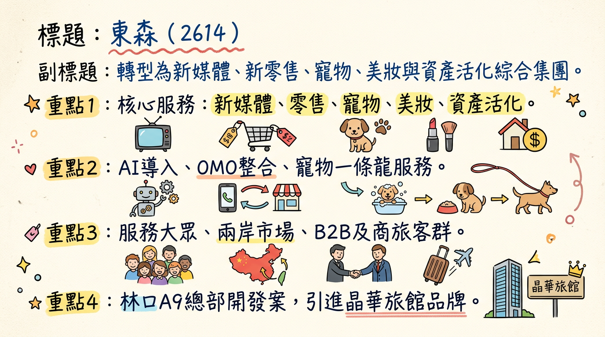
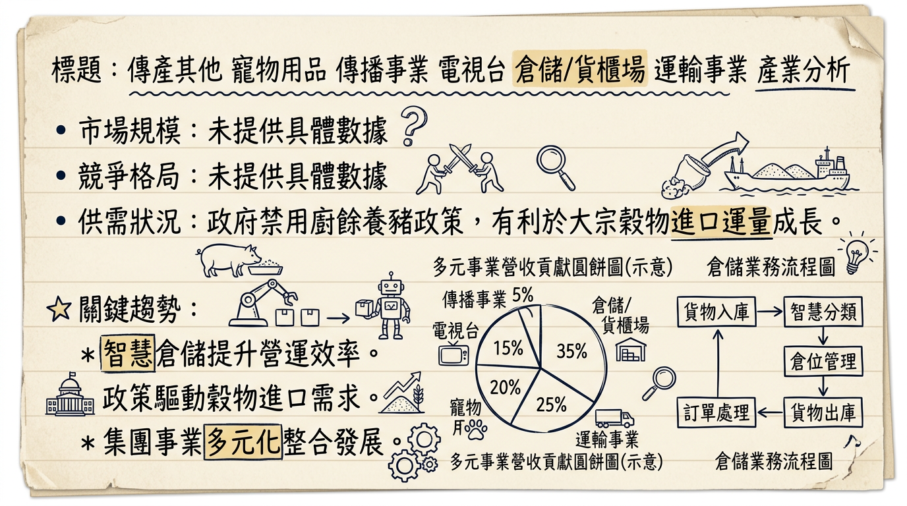
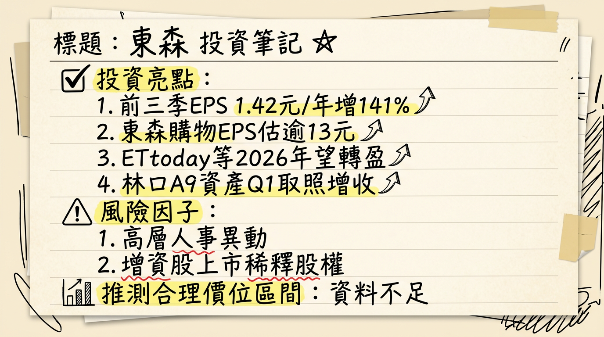

# 2614 東森 深度研究報告

## 一句話摘要
東森國際(2614)正從傳統貿易與倉儲業務，成功轉型為涵蓋新零售、新媒體、寵物、美妝及資產活化等多元成長動能的綜合型集團。隨著林口AI智慧國際媒體園區於2026年啟用，以及旗下東森新媒體、東森寵物雲、自然美等轉投資事業預期於2026年全面轉盈，結合全面導入AI技術所帶來的成本效益，公司獲利能力與資產價值有望迎來顯著提升，開啟新的成長週期。

## 公司概覽
東森國際（2614）已從傳統貿易及倉儲的業務結構轉型，成為一個以新媒體、新零售、寵物、美妝及資產活化為核心的綜合型集團。

**公司主要業務與核心產品/服務**
*   **倉儲事業**：提供穩定的倉儲服務，尤其涉及大宗穀物進口運量。
*   **新媒體事業**：以「ETtoday新聞雲」為平台，提供數位內容、AI廣告投放、短影音與展演轉播。
*   **新零售會員服務平台**：主要為「東森購物」，加速線上線下整合（OMO），運用AI強化選品、行銷與營運效率。
*   **寵物事業**：經營「東森寵物雲」，為全台少數可提供美容、醫療、特寵等一條龍服務的寵物連鎖零售體系，並與「慈愛動物醫院」合作。
*   **美妝事業**：旗下的「自然美生物科技」推動兩岸市場，台灣聚焦異業結盟，上海則以AI科技導入「AI科美」新模式。
*   **資產開發與活化**：包括林口A9「東林資產」開發案，規劃整合集團營運總部、展演廳、商場及引進晶華旗下品牌「Silks X 晶英薈旅」商務旅館。

**各業務獲利貢獻概況**
目前最新的公開資料中，未明確提供各業務佔營收的具體百分比。然而，根據2025年法說會和財報資訊顯示，東森國際已轉向以轉投資事業為核心的綜合型獲利模式，各事業體獲利動能如下：

| 事業體            | 2025年營運概況/獲利展望                               |
| :---------------- | :------------------------------------------------------ |
| **東森購物**      | 2025年前10月EPS達10.45元，法人預估全年EPS將超過13元。 |
| **東森新媒體**    | 2025年前三季轉虧為盈，預估2026年全年獲利可望破億元。   |
| **東森寵物雲**    | 2025年虧損收斂，預計2026年將全面轉盈。                 |
| **自然美**        | 預估2025年亦將轉虧為盈。                               |
| **倉儲事業**      | 2025年前三季營運量下降5.1%，營收下降6.7%，但獲利穩定。 |
| **林口媒體園區**  | 預計2026年3月取得使照，9月起陸續啟用，將帶來穩定租金收益。 |

## 核心競爭優勢
1.  **多元事業體轉型與協同效應**：成功從傳統倉儲轉型，擁抱新零售、新媒體、寵物、美妝等高成長領域，各事業體間透過OMO（線上線下整合）策略，共享會員、數據與資源，強化集團整體競爭力與顧客黏著度。
2.  **全面導入AI技術，提升營運效率與創新**：集團自2024年全面導入ChatGPT，2025年深化AI應用於選品、行銷投放、新聞產製、美容服務及開店評估等，預估2025-2026年全年可降低營運成本約新台幣5億元，並驅動各事業線的產品與服務創新。
3.  **獨特的寵物事業一條龍服務**：東森寵物雲結合寵物零售、美容、醫療（與慈愛動物醫院合作）及特寵服務，形成全台少見的完整生態系，搶佔快速成長的寵物市場商機。
4.  **資產活化與價值重估**：林口AI智慧國際媒體園區的開發，將整合集團總部、商場、展演廳及酒店，不僅為集團提供現代化營運基地，其預期帶來的穩定租金與管理收益，更將顯著提升公司資產價值與現金流。
5.  **兩岸美妝市場策略聯動與AI科美創新**：自然美透過兩岸市場策略聯動，結合AI科技推出高端儀器專案「AI科美」新模式，瞄準高端美容與個人化服務需求，具備差異化競爭優勢。

## 財務分析

### 月營收趨勢
| 月份      | 金額 (新台幣億元) | 月增率 MoM | 年增率 YoY |
| :-------- | :---------------- | :--------- | :--------- |
| 2026年01月 | 4.24              | -14.98%    | -11.40%    |
| 2025年12月 | 4.99              | 7.84%      | -4.75%     |
| 2025年11月 | 4.63              | -1.93%     | -6.15%     |
| 2025年10月 | 4.72              | 4.22%      | -1.31%     |
| 2025年09月 | 4.53              | -4.59%     | -1.47%     |
| 2025年08月 | 4.75              | 6.03%      | 5.68%      |

### 季度數據 (最新完整季度：2025年第三季)
| 項目          | 2025年第三季 |
| :------------ | :----------- |
| 營收年增率    | -1.20%       |
| 毛利率        | 35.29%       |
| 營業利益率    | 11.51%       |
| 稅後淨利率    | 14.53%       |
| 單季EPS       | 0.58元       |

### 年度趨勢
| 項目      | 2024年實際 | 2025年實際/預估 |
| :-------- | :--------- | :-------------- |
| 全年營收  | 57.4億元   | 54.73億元       |
| 全年EPS   | 1.24元     | 2.07元 (法人預估) |
| 備註      | 年減1.59%  | 前三季累計EPS為1.42元 |

## 法說會重點 (2025年12月26日)
*   **林口AI智慧國際媒體園區**：「恩典大樓」預計2026年3月取得使用執照，集團同仁預計2026年第三季遷入集中辦公。相關展演、住宿、餐飲及休閒設施預計2026年9月陸續啟用。
*   **轉投資事業轉盈預期**：東森新媒體（ETtoday新聞雲）、東森寵物雲、東森自然美預計2026年都將轉盈，顯著挹注集團獲利。
*   **倉儲事業**：2025年前三季營運量較去年同期下降5.1%，營收下降6.7%，但獲利仍穩定成長。預計2026年隨政府禁用廚餘養豬政策推動，有利於大宗穀物進口運量成長，獲利可望再創新高峰。
*   **東森寵物雲**：2025年線下通路已建立116間專業寵物零售通路及18間結合慈愛動物醫院專業醫療合作通路，服務遍及全台18縣市。2026年將優化門市績效、汰弱留強、提升覆蓋率，並透過異業合作開設店中店、導入AI開店評估系統。
*   **東森自然美**：截至2025年9月營收年增59%，通路據點新增331家達2,027家，年增19.5%。預計2025年轉虧為盈，2026年在中國大陸新開500家店，年底店數目標達2,177家。
*   **東森購物**：2025年前三季EPS已超過10元，法人預估全年EPS將超過13元。將加速線上線下融合，推動全通路(OMO)零售模式，2025年前三季營業利益率達14%。
*   **產能利用率與資本支出**：法說會中未具體說明2025-2026年產能利用率及總體資本支出金額。

## 券商觀點
目前未找到2025-2026年最新券商目標價、EPS預估數字及評等調整的公開資料。

| 券商名稱 | 目標價 (新台幣) | 評等   | 日期       |
| :------- | :-------------- | :----- | :--------- |
| N/A      | N/A             | N/A    | N/A        |

## 財報深度分析

### 利潤率趨勢
| 季度       | 毛利率   | 營業利益率 | 稅後淨利率 |
| :--------- | :------- | :--------- | :--------- |
| 2025年第三季 | 35.29%   | 11.51%     | 14.53%     |
| 2025年第二季 | 35.25%   | 10.20%     | 11.40%     |
| 2025年第一季 | 29.51%   | 2.89%      | 5.16%      |
| 2024年第四季 | 32.30%   | 4.27%      | 10.59%     |
| 2024年第三季 | 32.62%   | 6.57%      | 3.00%      |
| 2024年第二季 | 32.45%   | 5.38%      | 7.97%      |
| 2024年第一季 | 31.67%   | 6.48%      | -0.60%     |

**利潤率變化原因分析**
東森國際的利潤率在2025年呈現顯著改善，尤其在第三季達到較高水準，主要受惠於其多元轉投資事業的獲利能力提升：
*   **轉投資事業動能齊發**：東森新媒體於2025年第三季轉虧為盈，東森寵物雲及自然美虧損收斂並預期2026年轉盈，東森購物保持穩健獲利（2025年前三季營業利益率達14%）。這些事業體的改善直接提升了集團整體利潤率。
*   **AI導入效益**：集團全面導入AI，預估2025-2026年全年可降低營運成本約5億元，有助於營業費用率的控制，進而提升營業利益率。
*   **資產處分**：2024年處分復興南路資產對其獲利有正面影響，使得2024年全年EPS達1.24元。
*   **倉儲事業**：儘管2025年前三季營運量和營收小幅下降，但獲利仍穩定，為集團提供基本盤支撐。

### 存貨與營運
| 季度       | 存貨週轉天數 (日) | 存貨週轉率 (次) | 應收帳款收現天數 (日) | 應收帳款週轉率 (次) |
| :--------- | :---------------- | :-------------- | :-------------------- | :------------------ |
| 2025年第三季 | 42.42             | 2.12            | 26.06                 | 3.45                |
| 2025年第二季 | 42.40             | 2.12            | 24.14                 | 3.46                |
| 2025年第一季 | 41.84             | 2.15            | 29.12                 | 2.91                |
| 2024年第四季 | 36.55             | 2.46            | 25.20                 | 3.37                |

**存貨分析**：從2024年第四季至2025年第三季，存貨週轉天數呈現微幅上升趨勢，存貨週轉率則微幅下降，可能表示存貨去化速度略有放緩，但目前未見異常堆積現象。
**應收帳款分析**：應收帳款週轉天數在2025年第一季有所上升後，在第二、三季下降，顯示收款效率在2025年中有所改善。

### 資本支出
| 季度       | 資本支出 (千元) | 折舊攤銷 (千元) |
| :--------- | :-------------- | :-------------- |
| 2025年第三季 | 4,404           | 311,442         |
| 2025年第二季 | 3,076           | 310,034         |
| 2025年第一季 | 3,109           | 309,459         |
| 2024年第四季 | 4,297           | 309,780         |

**資本支出趨勢**：近期季度資本支出金額相對穩定且規模較小。然而，林口A9「東林資產」開發案是總投資逾130億元的重大資產投資，預計2026年3月取得使用執照，9月起陸續啟用，雖然非傳統產能擴充，但對未來租金與管理收益有重大影響。
**折舊攤銷趨勢**：折舊攤銷金額近幾季保持相對穩定，顯示公司資產折舊攤銷政策未有重大改變。

## 股權異動
*   **董監事/大股東申報轉讓紀錄**：近期（2024-2026年）未找到東森（2614）董監事/大股東大規模申報轉讓的明確紀錄。總經理周惠英(新任，前發言人)截至2026年1月持股59張，持股比例0.02%。
*   **庫藏股買回紀錄**：未找到2024-2026年的最新庫藏股買回紀錄。
*   **可轉換公司債(CB)**：未找到2024-2026年的最新可轉換公司債發行資訊。
*   **增資/減資計畫**：2025年12月24日公布114年(2025年)增資股股票上市掛牌日期為2026年1月2日，普通股數量為27,021,876股。未找到近期現金增資或減資計畫。
*   **股利政策**：
    *   **2024年**：每股配發現金股利0.25元、股票股利0.90元，合計1.15元。發放日期為2025年8月13日。
    *   **歷史股利**：2023年、2022年無股利；2021年現金股利1元；2020年現金股利0.8元；2019年現金股利1元。2024年恢復發放股利且股利結構現金與股票並重。

## 產業分析

### 市場規模與CAGR
| 產業類別          | 市場規模 (2025/2026)                       | CAGR (預估)        | 趨勢重點                                           |
| :---------------- | :------------------------------------------- | :----------------- | :------------------------------------------------- |
| **倉儲事業**      | N/A (未明確數據)                             | N/A                | 政府禁用廚餘養豬政策有利於大宗穀物進口運量成長。 |
| **新媒體 (數位廣告)** | 2026年: 1.27兆美元 (全球廣告), 73%為數位廣告 | 15.61% (2025-2034) | AI主導創意、投放、優化；短影音與互動內容興起。     |
| **新零售 (電商)** | 2026年: 8.1兆美元 (全球零售電商)             | 25.83% (2025-2033) | 會員經濟深化、虛實整合(OMO)、營運效率提升。        |
| **寵物事業**      | 2030年: 突破5,000億美元 (全球寵物產業)       | 5.77% (2026-2034)  | 寵物人性化、高端化；專業照護、醫療服務需求增長。   |
| **美妝事業**      | 2025年: 1900-2000億美元 (全球護膚品)         | 6.97% (2026-2034)  | 大眾盤穩固、高端線高增；AI護膚、個人化美容方案。   |

### 競爭格局
| 業務類型          | 東森 (2614)                                | 主要競爭對手 (類型/實例)             | 競爭優勢/策略                                    |
| :---------------- | :----------------------------------------- | :----------------------------------- | :----------------------------------------------- |
| **倉儲**          | 穩定獲利大宗穀物、智慧倉儲                 | N/A (未具體列出)                     | 穩定基底，政策利多                               |
| **新媒體**        | ETtoday新聞雲、AI生成內容、多平台轉播     | Google, Meta, TikTok, 傳統新聞媒體 | 數位內容與AI投放，加速內容製作與多元佈局         |
| **新零售 (電商)** | 東森購物、OMO線上線下整合、AI選品行銷     | Momo, 蝦皮, PChome, 酷澎             | 會員經濟深化，虛實整合提升用戶體驗與轉換率       |
| **寵物事業**      | 東森寵物雲、一條龍服務 (零售+美容+醫療)    | Destination Pet, Pet Paradise, CVS Group, (台灣在地連鎖寵物店) | 一站式專業服務，結合醫療資源，異業合作擴展覆蓋率 |
| **美妝事業**      | 自然美生物科技、兩岸策略聯動、AI科美       | 歐萊雅, 聯合利華, 寶潔, 雅詩蘭黛     | AI高端美容服務，客製化體驗，深耕中國市場         |

### 產業趨勢
1.  **人工智慧 (AI) 深度整合**：AI已成為產業核心基礎設施，主導創意、投放與優化。東森集團全面導入AI於數位媒體（內容生成、廣告投放）、新零售（AI導購、選品、庫存）、美妝（AI科美、個人化方案）及倉儲（智慧穀物倉儲），此為提升效率與競爭力的關鍵。
2.  **虛實整合 (OMO, Online-Merge-Offline) 全面化**：零售業與服務業競爭從單一線上轉向線上線下整合。東森購物及東森寵物雲積極推動OMO，串聯實體門市、電商平台、社群，打造一致且可轉換的消費體驗，有助於提升客戶黏著度與營運效率。
3.  **短影音與內容經濟的崛起**：短影音取代靜態貼文成為主要品牌接觸點，社群影音「即購化」趨勢明顯。ETtoday新聞雲需強化短影音製作與多平台整合，以適應消費者決策路徑的改變。

### 對 東森 而言的具體機會和威脅
**機會 (Opportunities)**
*   **AI技術導入**：集團全面深化AI應用於各事業體，預期帶來顯著的成本節降（5億元）和營運效率提升，符合產業趨勢。
*   **OMO策略深化**：東森購物及東森寵物雲積極實踐虛實整合，有效應對消費者行為轉變，提升客戶黏著度。
*   **寵物經濟成長**：台灣寵物市場「人性化」與「高端化」趨勢，有利於東森寵物雲一條龍服務的商業模式擴張。
*   **美妝市場高端需求**：自然美上海以「AI科美」模式抓住高端與個人化美容服務商機，並持續擴展中國大陸門店。
*   **資產活化價值**：林口AI智慧國際媒體園區預計2026年啟用，將帶來穩定的租金與管理收益，並提升集團總部營運效率。
*   **轉投資事業獲利改善**：ETtoday、寵物雲、自然美預期2026年轉盈，將顯著挹注東森國際獲利。

**威脅 (Threats)**
*   **電商市場激烈競爭**：台灣電商市場高度集中且跨境電商強勢崛起，東森購物面臨嚴峻挑戰。
*   **消費者行為變化**：消費者對折扣疲乏、趨向理性消費，對平台業者獲利能力構成壓力。
*   **技術快速迭代**：AI等新技術發展迅速，若未能持續投資與快速導入，可能在競爭中落後。
*   **總經風險**：國際關稅政策不確定性、疾病、風災等可能影響倉儲事業的穀物進口運量。

## 近期催化劑
*   **2026年03月05日**：外資買超79張，投信買賣超-997張（年初至今），自營商賣超8張。
*   **2026年03月04日**：公告其及子公司背書保證金額達「公開發行公司資金貸與及背書保證處理準則」第二十五條之規定，被背書保證公司為東森新媒體控股股份有限公司。
*   **2026年03月03日**：董事會決議聘任周惠英出任總經理，廖尚文董事長卸下兼任總經理職務。
*   **2026年02月09日/10日**：公布2026年1月合併營收為新台幣4.24億元，較上月減少14.98%，較去年同期減少11.4%，為2025年4月以來新低。
*   **2026年01月27日**：東森集團積極推動AI轉型，預估2025年至2026年全年將因AI導入降低營運成本約新台幣5億元。
*   **2026年01月02日**：東森國際114年(2025年)增資股股票上市掛牌。
*   **2025年12月26日**：法說會公布林口AI智慧國際媒體園區2026年3月取得使照，9月起陸續啟用；旗下東森新聞雲、東森寵物雲與東森自然美預計2026年都將轉盈。
*   **2025年12月12日**：林口A9東林資產開發案預計2026年第一季取得使用執照，最快第三季營運。
*   **2025年12月11日**：2025年前三季稅後純益達新台幣4.64億元，年增139%，每股稅後純益為1.42元，已超越2024年全年獲利。

## ⭐ 成長動能時間軸

| 成長動能項目          | 具體內容                                                   | 預計時間點        |
| :-------------------- | :--------------------------------------------------------- | :---------------- |
| **擴廠 (資產活化)**   | **林口AI智慧國際媒體園區**：「恩典大樓」取得使用執照     | 2026年3月         |
| **擴廠 (資產活化)**   | **林口AI智慧國際媒體園區**：集團同仁遷入集中辦公          | 2026年第三季      |
| **擴廠 (資產活化)**   | **林口AI智慧國際媒體園區**：展演、住宿、餐飲、休閒設施啟用 | 2026年9月起陸續   |
| **轉投資事業轉盈**    | 東森新媒體、東森寵物雲、自然美預計全年轉虧為盈            | 2026年全年        |
| **新市場/產能擴充**   | **東森自然美**：在中國大陸新開500家店，年底店數達2,177家 | 2026年全年        |
| **新客戶/新市場**     | **東森寵物雲**：優化門市績效、異業合作開拓店中店、強化第三方外送平台 | 2026年全年        |
| **AI導入效益**        | 集團全面導入AI，全年可降低營運成本約新台幣5億元            | 2025年至2026年全年 |
| **需求面利多**        | **倉儲事業**：政府禁用廚餘養豬政策，有利於大宗穀物進口運量成長 | 2026年全年        |
| **IPO計畫**           | **東森寵物雲**：積極規劃三年內掛牌上市                     | 2025年5月宣佈，預計三年內 |

## 2026 展望
**成長動能**
東森國際2026年的主要成長動能來自多個面向：
1.  **林口AI智慧國際媒體園區啟用**：預計2026年3月取得使照、9月陸續啟用，將整合集團總部、商場、展演廳與酒店，帶來穩定租金與管理收益，大幅提升資產價值和長期現金流。
2.  **三大轉投資事業全面轉盈**：東森新媒體、東森寵物雲、自然美預計在2026年全面轉虧為盈，將顯著挹注東森國際的本業獲利，而非過去的虧損拖累。其中ETtoday新聞雲更預估獲利破億元。
3.  **AI導入效益顯現**：集團全面導入AI預計在2025-2026年全年節省5億元成本，有效提升各事業體的獲利能力。
4.  **寵物事業持續擴張**：東森寵物雲將繼續優化門市績效、擴大覆蓋率，並深化寵物醫療等一站式服務，抓住「寵物人性化」的市場趨勢。
5.  **自然美中國市場成長**：自然美在中國大陸預計新開500家店，擴大市場滲透率並推廣AI科美新模式，推升營收與獲利。
6.  **倉儲事業穩定成長**：受益於政府禁用廚餘養豬政策，大宗穀物進口運量有望成長，維持倉儲本業的穩定獲利。

**風險**
儘管成長動能強勁，仍需關注以下風險：
1.  **電商市場競爭加劇**：台灣電商市場Momo、蝦皮等強勢平台競爭激烈，跨境電商如酷澎也持續投入，對東森購物的市場份額和獲利能力構成壓力。
2.  **景氣循環影響消費力**：若全球或台灣經濟成長放緩，可能影響消費者在零售、媒體及美容服務上的支出意願。
3.  **新事業體獲利不及預期**：儘管預期轉盈，但新媒體、寵物雲、自然美等事業若因市場變化或營運挑戰，未能達到預期獲利目標，將影響集團整體表現。
4.  **林口媒體園區招商與營運進度**：園區啟用後的招商情況及營運效率，將直接影響其收益貢獻。
5.  **國際貿易政策變化**：倉儲事業受國際穀物貿易政策影響，存在一定的波動性。

## 投資結論
東森國際(2614)正處於一個關鍵的轉型與收穫期，其多元化的戰略佈局與數位轉型成果，預期將在2026年開始顯現。
1.  **多角化經營帶來穩健成長**：東森成功從單一倉儲業務轉型為涵蓋新媒體、新零售、寵物、美妝及資產活化等多元事業的集團。各事業體在2026年有望陸續轉虧為盈，將為集團獲利帶來顯著的增長動能。
2.  **資產活化價值重估**：林口AI智慧國際媒體園區的啟用，不僅將改善集團營運效率，更將帶來穩定的租金收益與潛在資產重估價值，為公司提供長期現金流與基本面支撐。
3.  **AI導入提升營運效率與競爭力**：集團全面導入AI技術，預計2025-2026年全年將節省5億元營運成本，並在各事業線推動創新，是未來提升獲利能力的重要驅動力。
4.  **寵物經濟與美妝市場的藍海商機**：東森寵物雲的一條龍服務和自然美的AI科美模式，精準抓住台灣及兩岸市場的寵物與美容高端化趨勢，具備高成長潛力。
5.  **投資建議**：考慮到東森國際在2025年法人預估EPS為2.07元，且2026年將有顯著的轉投資事業轉盈與資產活化收益，我們預期其未來獲利能力將有顯著提升。若給予一家具備多元成長動能與資產重估潛力的複合型企業20倍至25倍的預期本益比區間，則目標價區間建議落在 **新台幣 42 元至 52 元**。此目標價區間反映了公司核心事業的轉型成功、新成長動能的爆發，以及其資產價值的重新評估。

本報告由 AI 自動產生，資料來源為公開網路資訊，僅供參考，不構成投資建議。產生時間：2026-03-06 14:13

---

## 📊 資訊卡

