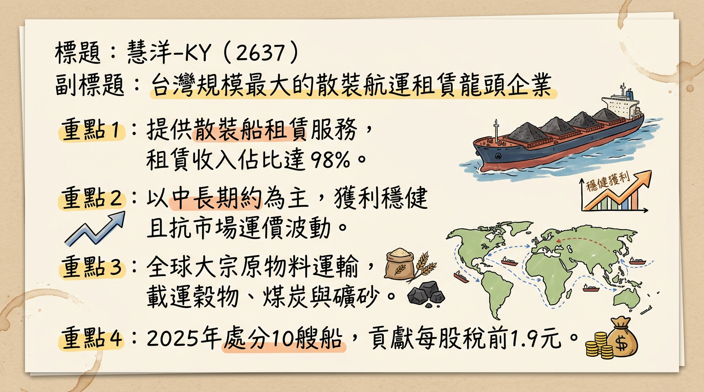
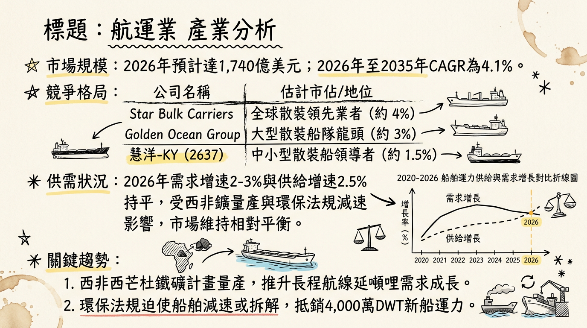
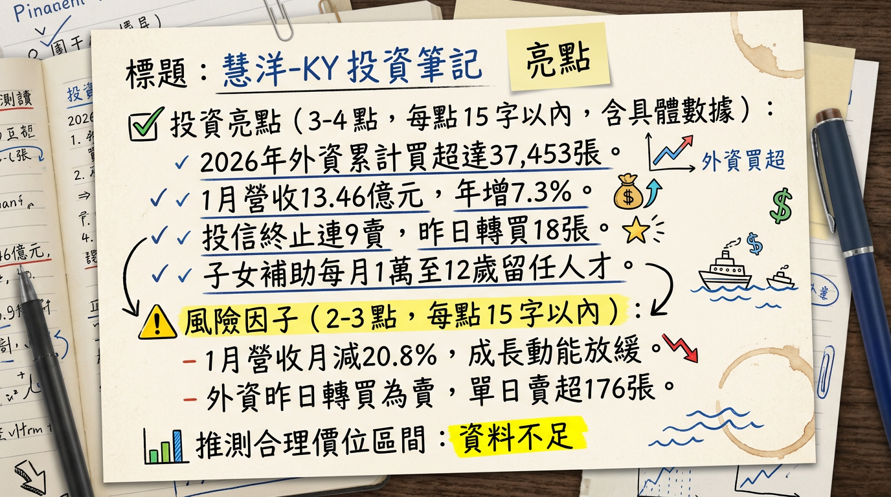

# 2637 慧洋-KY 深度研究報告

## 一句話摘要
慧洋-KY 為台灣散裝航運龍頭，憑藉全球最高比例的「節能船隊」與 2026 年 8 艘高毛利新船交付，成為環保法規（EEXI/CII）趨嚴下的最大受益者，具備 7% 高殖利率防禦力。

---

## 公司概覽
慧洋-KY（Wisdom Marine）是台灣規模最大的散裝航運商，專精於中小型船舶（Handysize / Supramax / Panamax）的租賃服務。

### 業務與營收結構
| 業務項目 | 營收佔比 | 核心內容 |
| :--- | :--- | :--- |
| **租金收入** | 98% - 99% | 以中長期約為主，搭配部分指數連結合約，營收穩健度高。 |
| **處分船舶與其他** | 1% - 2% | 執行「汰舊換新」策略，出售老舊船舶認列處分利益（2025 貢獻 EPS 1.9 元）。 |

*   **船隊規模**：截至 2025 年底約 **127 艘**，平均船齡 9.1 年，遠低於全球平均。
*   **營運特色**：與日本名村、今治造船廠長期合作，新船均為節能環保規格。

---

## 核心競爭優勢
1.  **節能船隊護城河**：節能船佔比超過 **8 成**（全台最高），在 2026 年歐盟排放交易體系（EU ETS）全面實施後，具備極強的租金溢價（Premium）與談判力。
2.  **營運彈性**：專攻中小型船（4 萬至 8 萬噸），相較於大型海岬型船，能進入的港口更多、承運貨種（穀物、鋁土、水泥、鋼材）更具多樣性。
3.  **財務結構優化**：透過售船回收資金，負債比率已從高點降至 **40%-42.55%**，大幅提升抗風險能力。

---

## 財務分析

### 近 6 個月營收趨勢表
| 月份 | 營收金額 (億新台幣) | 月增率 MoM | 年增率 YoY | 備註 |
| :--- | :--- | :--- | :--- | :--- |
| **2026/01** | 13.46 | -20.81% | +7.30% | 淡季與瑞郎升值匯損影響 |
| **2025/12** | 17.00 | +1.94% | +17.49% | 2025 全年營收最高月 |
| **2025/11** | 16.67 | -2.95% | +9.81% | 北美穀物旺季支撐 |
| **2025/10** | 17.18 | +6.33% | +1.71% | 營運高檔期 |
| **2025/09** | 16.16 | +8.31% | -8.83% | --- |
| **2025/08** | 14.92 | +11.08% | -19.87% | --- |

### 季度獲利數據
*   **2025 Q3 財報**：
    *   營收：44.51 億元
    *   毛利率：**30.70%**
    *   營業利益率：**29.63%**
    *   EPS (稅後)：2.06 元
*   **2025 全年自結**：營收 168.96 億元，自結每股稅前盈餘（EPS）為 **5.30 元**。

---

## 法說會重點（2025/12 指引）
1.  **租金展望**：2026 年預計有 **16 艘船** 進行換約，預期平均租金調漲約 **+5.54%**。
2.  **新船毛利**：2026 年交付之 8 艘節能新船，預期毛利率高達 **40% 至 50%**。
3.  **需求支撐**：中國承諾 2026 年起每年採購 2,500 萬噸美國大豆，將直接拉動中小型船隊需求。
4.  **管理層發言**：第一季雖為淡季，但因中美貿易合約與環保法規導致的老船拆解，預期將呈現「淡季不淡」。

---

## 券商觀點
| 券商名稱 | 目標價 | 評等 | 日期 | 備註 |
| :--- | :--- | :--- | :--- | :--- |
| **元大投顧** | **85 元** | 買進 | 2026/02/10 | 看好節能船紅利與評價上修 |
| **FactSet 綜合** | **82 元** | 持有/看多 | 2025/12/24 | 2026 EPS 預估 8.58 (偏樂觀) |
| **華南永昌** | **78 元** | 中立/偏多 | 2026/02/10 | 預估 2025 EPS 為 4.52 元 |

---

## 財報深度分析

### 利潤率趨勢表格
| 期間 | 營業利益率 | 變動主因 |
| :--- | :--- | :--- |
| **2025 Q4 (自結)** | **37.0%** | 售船利益與運價回升帶動全年高點 |
| **2025 Q3** | **29.63%** | 本業營運穩健 |
| **2025 Q2** | **12.0%** | 中國房地產需求疲軟影響 |
| **2026/01 (自結)** | **18.0%** | 散裝淡季與運價指數回檔 |

*   **經營效率**：應收帳款週轉天數僅 **3.47 天**，存貨週轉天數 **3.65 天**，顯示極佳的現金回收能力。
*   **資本支出**：2026 年交付 8 艘新船；董事會已再加訂 2 艘 4 萬噸輕便型船（每艘 <3,300 萬美元）。
*   **匯率變動**：2026/01 認列 **260 萬美元** 匯兌損失，主因瑞士法郎（CHF）負債隨瑞郎升值而增加。

---

## 股權異動與資本結構
1.  **股權變動**：董事長藍俊昇於 2024 年底進行贈與及信託轉讓約 1.7 萬張，2025 年下半年至今無重大賣出紀錄。
2.  **可轉債（CB）**：慧洋三-KY (26373) 轉換價已下修至 **24.5 元**。
3.  **股利政策**：2025 年配發 5.0 元。依 2025 自結 5.3 元稅前 EPS 估算，2026 年仍有高配息潛力（隱含殖利率約 7%）。

---

## 產業分析

### 全球散裝航運供需（2026 展望）
*   **需求成長**：2% - 3%（受惠西非鐵礦石量產、中美大豆貿易）。
*   **供給成長**：2.5%（新船交付量增，但被老船減速、拆解抵銷）。

### 競爭對手比較表
| 公司名稱 | 核心船型 | 2025 營業利益率 | 2026 核心動能 |
| :--- | :--- | :--- | :--- |
| **慧洋-KY (2637)** | **中小型 (Handy)** | **30-37%** | **8 艘高毛利節能新船交付** |
| **裕民 (2606)** | 大型 (Capesize) | 25-30% | 鐵礦砂現貨運價彈性最大 |
| **新興 (2605)** | 超大型油輪/散裝 | 20-25% | 受惠油輪運價飆漲紅利 |
| **Star Bulk (全球)** | 綜合型 | 20-30% | 全球 161 艘船隊多樣化操作 |

---

## 近期催化劑
*   **利多事件**：
    *   中國 2,500 萬噸大豆年採購合約啟動。
    *   烏俄戰爭停火預期帶動「重建題材」（鋼材、水泥運輸）。
    *   3 月中國復工行情帶動 BDI/BSI 指數反彈。
*   **利空事件**：
    *   瑞郎持續強勢導致帳面匯損。
    *   若紅海危機解除，蘇伊士運河復航將釋放 2% 運力，對運價產生下行壓力。

---

## ⭐ 成長動能時間軸
*   **2026/01**：首艘節能船「Paiwan Champion」交付，毛利率預期 50%。
*   **2026 Q1-Q4**：**累計 8 艘** 輕便型環保節能新船陸續投入，優化整體利潤結構。
*   **2026 H2**：觀察烏俄重建需求對鋼材運輸的實質貢獻。
*   **2027-2028**：後續 5-7 艘新船訂單計畫陸續執行，維持船隊年輕化。

---

## 2026 展望：成長動能 vs 風險
*   **成長動能**：法人預估 2026 年稅後純益有望年增 **30%**。節能新船不僅租金高，更能因應歐盟碳稅政策，在競爭中脫穎而出。
*   **主要風險**：瑞郎匯率波動、美國川普政府新關稅政策對全球貿易總量的抑制。

---

## 投資結論
1.  **評價修復**：慧洋目前 P/E 仍處於歷史中軌，隨 8 艘新船入列，盈餘品質（Quality of Earnings）將因節能船佔比提升而優化。
2.  **殖利率保護**：預估具備 **7% 以上高殖利率**，在市場波動期提供強力下檔支撐。
3.  **目標價區間建議**：
    *   **短線觀測**：70 - 75 元（季線支撐位）。
    *   **中長線目標**：**78 - 85 元**（參考法人共識與新船獲利貢獻）。
4.  **操作建議**：3 月若中國復工行情推升 BSI 指數，為加碼良機；需持續留意每個月 5 號之營收與匯損自結數據。

---
**本報告由 AI 自動產生，資料來源為公開網路資訊，僅供參考，不構成投資建議。產生時間：2026-03-03 12:28**

---

## 📊 資訊卡

