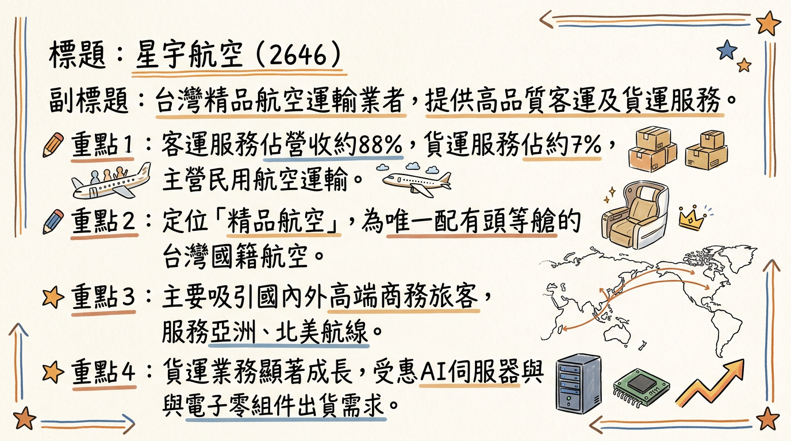
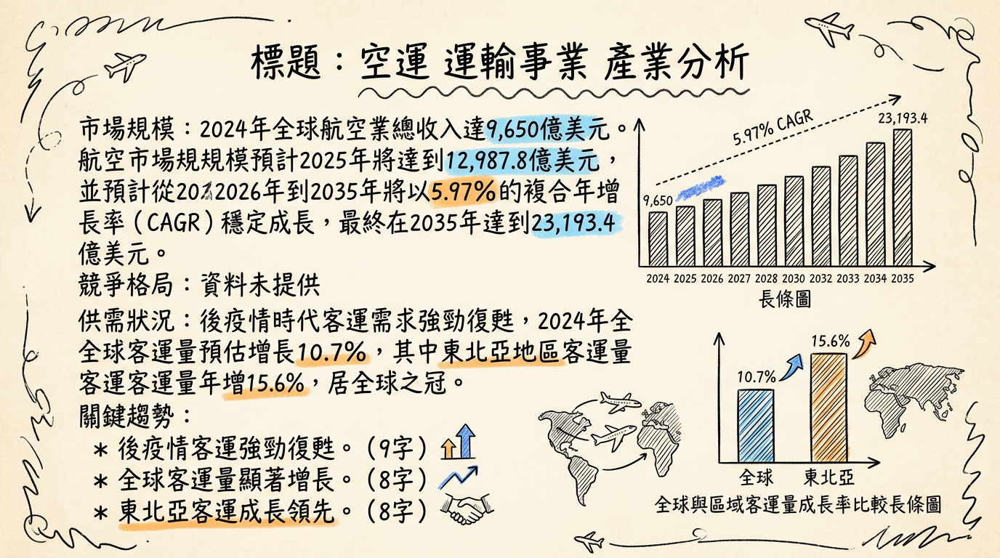
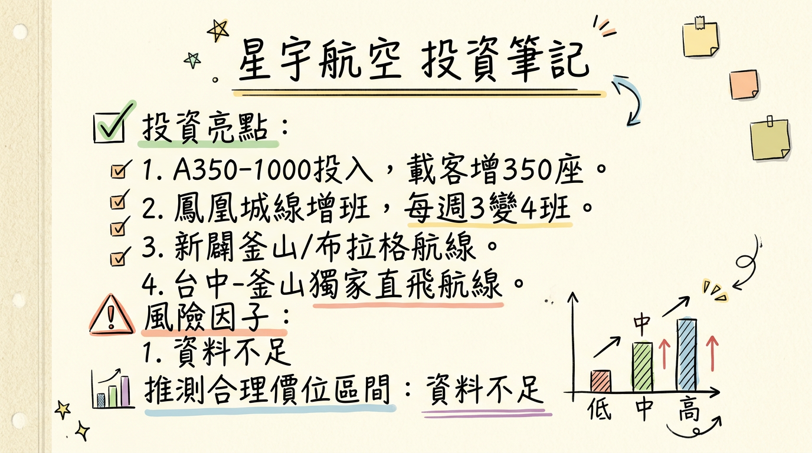

# 2646 星宇航空 深度研究報告

## 一句話摘要

星宇航空 (2646) 以其「精品航空」定位，積極擴張北美與歐洲長程航線，搭配年輕高效機隊及客貨運雙引擎策略，在後疫情時代展現強勁成長動能。儘管短期內因機隊擴張導致資本支出與折舊壓力影響獲利，但隨著航網日趨完整、轉機樞紐效益提升，加上 AI 伺服器帶動的高價值貨運需求，2026 年營運表現有望再創新高，並朝穩定獲利與發放股利目標邁進。

## 公司概覽

星宇航空（2646）是一家台灣的民用航空運輸業者，核心業務為提供高品質的客運及貨運服務。公司以「精品航空」的品牌形象區隔市場，是台灣國籍航空中唯一配有頭等艙的航空公司，旨在吸引國內外高端商務旅客與追求高品質體驗的觀光客群。

**主要產品與服務：**

*   **客運服務：** 提供亞洲、北美及未來歐洲航線的載客服務，強調精緻質感與差異化服務，如頭等艙。
*   **貨運服務：** 運輸高價值貨物，特別受惠於全球 AI 伺服器與電子零組件的出貨需求。
*   **其他業務：** 亦經營民用航空人員訓練業及酒類輸入業等。

**營運樞紐：**
主要營運樞紐為台灣桃園國際機場。2024年3月起進駐台中機場，成立台灣第二個主基地，深化中部市場布局。目前已拓展至 31 個城市、37 條航線。

**營收結構（2026年1月）：**

| 業務類別 | 營收佔比 |
| :------- | :------- |
| 客運     | 88%      |
| 貨運     | 7%       |
| 其他     | 5%       |

*註：2025年12月數據顯示，客運營收佔比約 79.6%，貨運約 12.1%，客運仍為主要營收來源，貨運成長顯著。*

## 核心競爭優勢

1.  **精品航空定位：** 台灣國籍航空中唯一配有頭等艙，提供精緻質感與差異化服務，吸引高端商務與觀光客群，提高單位收益。
2.  **戰略性航網布局：** 利用台灣優越地理位置，發展「北美－台北－東南亞」及「歐亞－北美」轉機樞紐戰略，強化全球航網覆蓋。
3.  **年輕高效機隊：** 平均機齡僅 5 年，具備卓越燃油效率，燃油成本佔總營運成本約 25%，優於同業平均 30%-35%。持續引進新機擴大運能。
4.  **強勁貨運成長潛力：** 受惠於 AI 伺服器、半導體等高價值電子零組件空運需求，貨運營收表現突出，未來全貨機機隊投入將進一步提升其市場地位。
5.  **積極市場開拓：** 不斷開闢新航點，包含鳳凰城（台積電商機）、歐洲（布拉格）、韓國（釜山）、大洋洲等，並深化台中市場布局，快速擴展市場版圖。

## 財務分析

### 月營收趨勢

| 月份   | 金額 (億元新台幣) | 月增率 (MoM) | 年增率 (YoY) |
| :----- | :---------------- | :----------- | :----------- |
| 2026年1月 | 42.15             | 1.94%        | -0.55%       |
| 2025年12月 | 41.34             | 17.00%       | 17.00%       |
| 2025年11月 | 35.25             | -4.64%       | 18.10%       |
| 2025年10月 | 36.97             | 25.51%       | 19.33%       |
| 2025年9月 | 29.46             | -21.97%      | 4.50%        |
| 2025年8月 | 37.75             | -5.91%       | 14.08%       |

*註：2026年1月年增率為負，主要受去年農曆春節假期基期較高影響。*

### 季度數據

| 季度     | 季營收 (億元新台幣) | 毛利率   | 營業利益率 | EPS (新台幣) |
| :------- | :------------------ | :------- | :--------- | :----------- |
| 2025年Q3 | 107.32              | 11.20%   | -0.59%     | -0.15        |

### 年度趨勢

*   **2024年實際：**
    *   全年營收：355.47 億元，年增 58%。
    *   EPS：0.53 元。
*   **2025年實際（已公布全年）：**
    *   全年營收：440.53 億元，較 2024 年成長 24%，創歷史新高。
*   **2025年預估 EPS：**
    *   截至 2025年第三季累計 EPS 為 0.16 元。
    *   管理層於 2025年12月法說會表示，為擴充產能，公司犧牲 2025年 EPS，從預估的 0.64 元降至 0.16 元，與前三季累計 EPS 吻合。

## 法說會重點

**最近一次法說會日期：** 2025年12月22日

**管理層對各產品線的具體說明與 Guidance：**

*   **客運：** 2025年第四季載客率已強勁回升至 78% 以上。2025年12月載客人數創歷史單月新高。2026年1月客運營收雖受假期落點影響，但隨著寒假及農曆春節旅遊需求遞延至 2月，預期客運營收將有進一步推升空間。
*   **貨運：** 2025年前三季貨運營收年增 69%，其中北美航線佔比高達 72%。受惠於電子零組件及 AI 等高價值產品出貨穩健，2026年1月貨運營收達 3.95 億元，年增率高達 35%。
*   **機隊擴張：** 公司處於資本支出極大化階段。預計 2025年底至 2026年間，機隊規模將由目前的 29 架擴充至 43 架，年增幅近 50%。2026年將交機 14 架新機，包括 3 架 A321neo、5 架 A330neo 及 6 架 A350-1000。首架 A350-1000 已於 2026年1月6日抵台，初期投入曼谷、東京等熱門航線。
*   **資本支出影響：** 14 架新機的加入直接推高攤銷及折舊成本，目前已佔營運成本的 17%。
*   **航網佈局：**
    *   2026年1月15日開航台北－鳳凰城直飛航線，初期每週 3 班，預計 3月起增為每週 4 班。
    *   2026年3月30日新增台中－峴港（每週 3 班）及台中－東京（每週 4 班），皆以 A321neo 客機執飛。
    *   2026年2月13日起新增台中－宮古島（每週 2 班）。
    *   2026年下半年規劃開闢台北至布拉格的首條歐洲航線，並規劃插旗另一個歐洲航點及進軍大洋洲。
    *   與阿提哈德航空深化共掛班號，擴大全球航網覆蓋。
*   **營運展望：** 管理層看好 2026年客貨運維持穩健成長，預期營運表現將再創新高。2026年2月春節旺季的營收表現將是檢驗第一季營運成果的關鍵指標。
*   **股利政策：** 執行長暨總經理翟健華表示，2024年累積虧損已全部打平，2025年可以依照獲利概況發放股利。

## 券商觀點

目前公開資訊中未找到具體券商名稱及其明確的目標價或評等。法人對星宇航空 2025-2026 年 EPS 的預估如下：

| 評等日期      | 券商名稱/機構 | 2025年 EPS 預估 (新台幣) | 2026年 EPS 預估 (新台幣) | 評等 | 備註                                   |
| :------------ | :------------ | :----------------------- | :----------------------- | :--- | :------------------------------------- |
| 2024年12月20日 | 法人預估      | 1.07                     | -                        | -    | 早期預估                               |
| 2025年4月10日  | 法人機構平均  | 1.07 ~ 1.22              | -                        | -    | 早期預估                               |
| 2025年12月22日 | 管理層法說會  | 0.16 (累積前三季)        | **將再創新高**           | -    | 因擴充產能犧牲，實際與累計前三季吻合 |

*註：星宇航空管理層於 2025年12月法說會預期 2026年營運表現將再創新高。*

## 財報深度分析

### 利潤率趨勢

| 季度     | 毛利率   | 營業利益率 | 稅後淨利率 |
| :------- | :------- | :--------- | :--------- |
| 2025年Q3 | 11.20%   | -0.59%     | -4.18%     |
| 2025年Q2 | 14.77%   | 3.13%      | 0.08%      |
| 2025年Q1 | 21.60%   | 10.60%     | 8.17%      |
| 2024年Q4 | 17.72%   | 0.49%      | -2.19%     |
| 2024年Q3 | 21.57%   | 9.86%      | 6.62%      |
| 2024年Q2 | 18.81%   | 6.50%      | 3.33%      |
| 2024年Q1 | 23.12%   | 10.44%     | 7.79%      |

**利潤率變化原因分析：**

*   **2025年Q3 轉虧：** 主要受新機陸續交付的前置成本、折舊攤銷費用增加，以及美國簽證政策收緊影響北美航線商務與探親需求。
*   **燃油成本效益：** 星宇航空機隊平均機齡僅 5 年，具備卓越燃油效率，燃油成本佔總營運成本約 25%，優於同業平均的 30%~35%。若國際油價維持穩定或下跌，將有利於利潤率改善。
*   **航網擴張與載客率：** 積極拓展北美及歐洲長程航線初期可能伴隨較高成本，但若能有效提升載客率與票價收益，將有助於長期利潤率改善。2025年12月客運載客率在旺季已達 80-90% 高檔。
*   **永續航空燃油（SAF）成本：** SAF 法規要求日趨嚴格，其價格是傳統燃油的 2 至 4 倍，未來可能逐步墊高環保合規成本。

### 存貨分析

目前公開資訊中未找到 2024-2026 年存貨金額、存貨週轉天數及異常堆積的具體數據。航空業的存貨主要為航材、備品，非傳統製造業模式。

### 資本支出

*   **機隊擴張：** 星宇航空正處於大規模資本支出階段，預計在 2025年底至 2026年間，機隊規模將由目前的 29 架擴充至 43 架，年增幅近 50%。2026年將交機 14 架新機，其中包含 6 架 A350-1000。
*   **航線建設：** 新開闢的長程航線（如鳳凰城、布拉格）需要大量前期投資與營運成本。
*   **融資計畫：** 公司已取得銀行團支持，每年會依新機交機情況進行各種籌資計畫，可綜合考量增資、發債等方式。
*   **折舊攤銷趨勢：** 新機隊的大量引入將顯著增加折舊攤銷費用，法說會指出目前已佔營運成本的 17%。

## 股權異動

*   **申報轉讓/庫藏股/可轉債：** 近期未找到 2024-2026 年董監事/大股東申報轉讓、庫藏股買回或發行可轉換公司債的最新公開紀錄。
*   **增減資：**
    *   公司累計虧損曾達 81.5 億元，計劃利用資本公積 36 億元，加上上市發行 47 萬張股票募集的逾 47 億元，合計約 83 億元來彌補虧損，以改善資本結構。
*   **股利政策：** 財務長於 2025年12月法說會表示，星宇航空已於 2025年第二季彌補累計虧損打平，2025年獲利無虞，有望發放股利。若能順利打消虧損，最快 2026年可發放 2025年的股利。

## 產業分析

### 市場規模與趨勢

**1. 全球航空市場規模**

全球航空業在後疫情時代展現強勁復甦，並預計在 2025 年首次突破 1 兆美元的總收入大關。

*   **整體航空市場：**
    *   2024 年預計總收入 9,650 億美元，年增 6.2%。
    *   2025 年預計總收入首次突破 1 兆美元，達到 10,070 億美元，年增 4.4%。
    *   預計從 2026 年到 2035 年將以 5.97% 的複合年增長率（CAGR）穩定增長，最終在 2035 年達到 23,193.4 億美元。
*   **客運市場：**
    *   2024 年全球客運量預估增長 10.7%，東北亞客運量成長居全球之冠，年增 15.6%。
    *   2025 年全球航空乘客量預計將達 52 億人次，年增 6.7%，首次突破 50 億人次大關。
    *   2025 年客運收入預計將達到 7,050 億美元，佔總收入的約 70%。
*   **貨運市場：**
    *   2024 年全球航空貨物市場規模達 3,194 億美元。
    *   2025 年全球航空貨物市場預計達 1,601.7 億美元，並預計在 2026 年達到 1,695.3 億美元。
    *   國際航空運輸協會（IATA）預計 2025 年航空貨運收入將達到 1,570 億美元，貨物噸公里數（CTK）將增長 6%。

**2. 供需狀況：供不應求**

目前全球航空業呈現**供不應求**的狀況，主要因素包括：

*   **強勁客運需求：** 2024 年航空旅行需求強勁，2025 年亞太地區客運流量年增 5.8%，運能年增 4.9%，顯示需求略大於供給。
*   **飛機供應鏈瓶頸：** 製造商面臨供應鏈問題，導致新機交付延遲。截至 2024 年底，空中巴士和波音待交付訂單已達 17,000 架，創歷史新高，按目前速度需 14 年才能完成。
*   **機隊老化與停飛：** 全球機隊平均機齡已升至 14.8 年，約有 5,000 架飛機（佔機隊總數 14%）處於「停航」狀態，部分需進行發動機檢查，預計持續至 2025 年。
*   **運力擴充受限：** 飛機供應鏈問題短期內難以解決，有限運力將支撐票價。

**3. 產業的平均毛利率水準**

航空業是資本密集、成本高昂的產業，利潤率普遍較低。

*   IATA 預估，2024 年全球航空業淨利為 315 億美元，**淨利潤率為 3.3%**。
*   預計 2025 年全球航空業淨利潤將達到 366 億美元，**淨利潤率上升至 3.6%**。
*   燃料成本是主要成本，2024 年約佔總成本的 30%，預計 2025 年因油價下滑可降至 26.4%。

### 競爭格局

**1. 全球前 5 大公司及其市佔率**

目前公開資料中未找到 2025-2026 年全球航空公司以營收或載客量計算的具體市佔率排名。以下為 Skytrax 2025 年全球最佳航空公司前五名（主要基於服務品質與旅客評價）：

| 排名 | 公司名稱                 | 總部所在地      |
| :--- | :----------------------- | :-------------- |
| 1    | 卡達航空 (Qatar Airways) | 卡達            |
| 2    | 新加坡航空 (Singapore Airlines) | 新加坡          |
| 3    | 國泰航空 (Cathay Pacific Airways) | 香港            |
| 4    | 阿聯酋航空 (Emirates)    | 阿拉伯聯合大公國 |
| 5    | 全日空 (ANA All Nippon Airways)   | 日本            |

**2. 星宇航空 vs 主要競爭對手的具體比較**

| 特性     | 星宇航空 (2646)                        | 長榮航空 (2618)                        | 中華航空 (2610)                         |
| :------- | :------------------------------------- | :------------------------------------- | :-------------------------------------- |
| **技術 (機隊)** | - 年輕機隊 (平均機齡 5 年)                | - 2026 年預計有 2 架 B787-9 新機加入   | - 擁有國內最大規模貨機機隊              |
|          | - 高燃油效率 (燃油成本佔 25%)           | - 機隊規模穩定                         | - 舊機折舊多已攤提完畢                  |
|          | - 主要為 Airbus 機隊                   | - 以 Boeing 機隊為主                    | - 搭配 2026 年開始陸續交付新機          |
|          | - 2026 年將交付 14 架新機 (含 A350-1000) |                                        |                                         |
| **產能 (航線)** | - 積極擴展東南亞航線比重，強化轉機樞紐   | - 深化北美佈局，透過加密班次與新航點     | - 加開鳳凰城航線 (每週 3 班，1 月訂位 >7 成) |
|          | - 2024 Q3 已開闢 27 航點、29 條航線     | - 未來北美直飛航點將達 10 個，有望全年每週百班 | - 2026 年增班釜山、布拉格、紐約       |
|          | - 2026 年開航鳳凰城、布拉格等長程線       |                                        |                                         |
| **客戶與價格 (定位)** | - 「精品航空」定位，提供頭等艙服務     | - 長期累積穩定商務客群，長程線與商務艙支撐收益 | - 廣泛客群基礎，肩負國家任務            |
|          | - 吸引高端商務旅客與觀光客群             | - Skytrax 2025 年全球最佳航空第 12 名 | - Skytrax 2025 年全球最佳航空第 37 名 |

**3. 台灣同業比較**

| 公司名稱   | 2025 年全年營收 (億元新台幣) | 2024 年前三季毛利率* | 2025 年 EPS (新台幣) | 備註                 |
| :--------- | :--------------------------- | :------------------- | :------------------- | :------------------- |
| 長榮航空 (2618) | 2,203.33                     | 未找到最新數據       | 27.74 (預估可達 31-33) | 歷史次高營收         |
| 中華航空 (2610) | 2,090.9                      | 未找到最新數據       | 未找到最新數據       | 營收創新高           |
| 星宇航空 (2646) | 440.53                       | 21.2% (2024年Q3)     | 0.16 (累計前三季)    | 營收年增 24%         |
| 台灣虎航 (6757) | 168.99                       | 未找到最新數據       | 未找到最新數據 (上半年 3.26 元) | 營收創新高 (廉價航空) |

*註：星宇航空 2023 年毛利率為 17.4%。其他航司毛利率數據未更新。*

### 產業趨勢

**1. 關鍵技術趨勢與具體影響**

*   **永續航空燃料 (SAF) 與電動飛機：**
    *   **影響：** SAF 是航空業實現 2050 年碳中和的關鍵，預計提供 65% 的碳減量。2025 年 SAF 產量預計倍增至 200 萬噸，但僅佔總需求的 0.7%。電動飛機（如 eVTOL）預計 2025 年臨近商業認證，可降低運營成本與碳足跡。
*   **人工智慧 (AI) 在航空營運中的應用：**
    *   **影響：** AI 將優化空中交通管理，實時規劃飛行路徑、預測擁堵、實現日常任務自動化，提高空域利用率、減少延誤。在維護方面，AI 驅動的預測性維護能識別潛在故障，減少延誤、提高機隊利用率。AI 也應用於收益管理和數位化轉型。
*   **數位化轉型與智慧機場：**
    *   **影響：** 機場正透過數位化提升乘客體驗、優化地面營運效率。機上互聯服務將成為標配，並為航空公司創造新收入。區塊鏈、大數據、物聯網等技術應用於航空貨運等流程，提高效率和透明度。

**2. 對星宇航空的具體機會和威脅**

*   **機會：**
    *   **高端市場定位：** 吸引高價位客戶，提高收益。
    *   **台灣樞紐地位：** 台灣位於「北美—東南亞」黃金航線樞紐，受惠於供應鏈重組及高端商務客流。桃園機場第三航廈啟用將進一步提升轉機效益。
    *   **貨運需求增長：** AI 伺服器與電子零組件高價值貨物需求推動貨運成長，未來全貨機機隊潛力大。
    *   **新機隊優勢：** 年輕且燃油效率高的機隊有助於降低成本、提升競爭力。
*   **威脅：**
    *   **供應鏈挑戰：** 飛機製造商供應鏈瓶頸導致新機交付延遲、維護成本增加，預計持續到 2030 年。
    *   **高營運成本與薄利潤率：** 航空業資本密集，星宇「精品航空」定位帶來高成本，若載客率或貨運收益不足，可能面臨虧損壓力。
    *   **競爭激烈：** 台灣市場有華航、長榮兩大巨頭，星宇需持續投入資源維持差異化。
    *   **地緣政治與經濟不穩定：** 可能影響燃油價格、貨運需求和國際旅行意願。

**3. 相關投資題材的具體連結**

*   **AI 伺服器與半導體：**
    *   **具體連結：** AI 產業爆發性增長是推動台灣航空貨運市場的主力。高單價、時效性高的 AI 伺服器與零組件高度依賴空運。
    *   **對星宇航空影響：** 即使目前僅客機腹艙載貨，2025年12月貨運營收仍年增 37%。隨著 AI 產業發展，星宇航空在貨運方面的成長潛力巨大。鳳凰城航線也直接服務台積電（AI晶片主要供應商）的商務需求。

## 近期催化劑

### 利多事件清單

*   **2026年1月6日：** 首架 A350-1000 廣體客機抵台，將投入長程航線。
*   **2026年1月15日：** 正式開航台北－鳳凰城直飛航線，初期每週 3 班，預計 3月起增為每週 4 班，搶進台積電商機。
*   **2026年1月營收：** 總營收 42.15 億元，貨運營收 3.95 億元，年增率高達 35%，受惠於電子零組件與 AI 伺服器相關產品出貨穩定。
*   **2026年2月10日：** 首架 A350-1000 正式投入營運，執飛台北－東京航線。
*   **2026年2月12日/13日：** 恢復台北－宮古島航線，並新增台中－宮古島航線，擴展區域航網。
*   **22026年2月25日：** 宣布自 2026年6月1日開闢全新「台北／台中－釜山」航線，首次進入韓國市場，並成為全台唯一提供台中直飛釜山的航空公司。
*   **2026年2月25日：** 台北－布拉格航線正式開賣，歐洲航線布局啟動。
*   **2026年3月：** 台中出發航線陸續開航宮古島、東京、熊本，預計使台中出發航線增加至 9 條。
*   **22026年3月30日：** 新增台中－峴港（每週 3 班）及台中－東京（每週 4 班），深化中部市場布局。
*   **2025年12月22日法說會：** 管理層表示 2024年累積虧損已全部打平，2025年有望發放股利；看好 2026年客貨運維持穩健成長，預期營運表現將再創新高。
*   **2025年全年營收：** 達新台幣 440.53 億元，較前一年成長 24%，創歷史新高。
*   **外資回補：** 2026年2月11日外資在 1 月營收公布前後出現回補動作。

### 利空事件清單

*   **2026年1月營收年增率負值：** 2026年1月總營收年減 0.55%，主要受去年農曆春節基期較高影響，但仍需觀察後續表現。
*   **外資近期賣超：** 截至 2026年3月5日，外資近 20 日買賣超為 -1,900 張，2026年第 1 季累計買賣超為 -11,865 張，顯示近期外資有部分賣壓。

## ⭐ 成長動能時間軸

*   **擴廠計畫 (航空基地與航網擴張)**
    *   **2024年3月：** 進駐台中機場，成立第二個主基地，深化中部市場布局。
    *   **2026年上半年：** 2、3月陸續開航台中出發的宮古島、東京、熊本航線，使台中航線增加至 9 條。6月1日開闢台北/台中-釜山航線。
    *   **2027年：** 桃園機場第三航廈預計上線，將對星宇航空帶來極大助益，北美和東南亞航線將集中在第三航廈，提升轉機效率與客戶體驗。
*   **新客戶/新市場**
    *   **2026年1月15日：** 開航台北－鳳凰城直飛航線，搶進台積電美國廠的商務需求，具有極高戰略指標意義。
    *   **2026年2月25日：** 開賣台北－布拉格航線，預計下半年開闢，首次插旗歐洲市場。
    *   **2026年6月1日：** 開闢全新「台北／台中－釜山」航線，正式進軍韓國市場。
    *   **2026年底至2027年初：** 規劃進軍紐澳等大洋洲市場。
    *   **長期：** 北美轉機客佔總載客約 6 成，受惠於台灣作為「北美—東南亞」黃金航線中轉站的供應鏈重組。
*   **產能擴充 (機隊與運力)**
    *   **2026年：** 將迎來民航業罕見的交機高峰，新增 14 架各式飛機，屆時總機隊規模將達到 43 架 (增幅近 50%)。
    *   **2026年：** 將再迎來 5 架 A350-1000 客機，加上已抵台的首架，總計交付 6 架 A350-1000，成為推展北美及歐洲長程市場的主力機種。
    *   **2026年：** 貨運運力預計新增 3 成，客運運力預計新增 25％。
    *   **2027年：** 第一階段 48 架客機預計全數交完。
    *   **2029年：** 10 架貨機預計交付完成。
    *   **2033年：** 長期目標機隊規模達 68 架。
*   **需求面 (下游需求爆發性成長)**
    *   **客運市場：** 全球航空客運市場已擺脫疫情陰霾，2026年全球客運需求預計成長 4.9%，其中亞太地區貢獻近 50% 的增長份額。IATA 預估 2026年總旅客人數將達 52 億人次，載客率 83.8%，創歷史新高。
    *   **貨運市場：** 受惠於 AI、半導體、高科技電子等高價值貨物需求。台灣位居全球 AI 供應鏈關鍵地位，預計 2026年全球八大 CSP 資本支出將突破 6,000 億美元大關，推升貨運市場穩健成長。

## 2026 展望

### 成長動能

1.  **機隊規模與航網擴張紅利：** 2026 年是星宇航空交機高峰期，新增 14 架飛機使機隊規模達 43 架，運力大幅提升。鳳凰城、布拉格、釜山等新航線陸續開闢，將顯著擴大市場覆蓋率與轉機效益。
2.  **客運需求強勁復甦：** 全球旅運需求持續看漲，特別是亞太地區成長最快。星宇航空在高端客群的定位，有助於在激烈競爭中維持高載客率與單位收益。
3.  **航空貨運高價值需求：** AI 伺服器、半導體及電子零組件等高價值產品的強勁出口需求，將持續推升航空貨運市場。星宇航空憑藉北美航線的高佔比，有望持續受惠。
4.  **轉機樞紐戰略成效顯現：** 台灣作為「北美－東南亞」黃金航線中轉站的戰略地位，加上桃園機場第三航廈的啟用規劃，將為星宇航空帶來更多轉機客源，提升載客率和收益。

### 風險因子

1.  **財務槓桿與股權稀釋風險：** 截至 2025 年負債權益比高達約 159%，高利率環境下利息支出壓力大。未來為購置新機與償債，可能需增資導致股權稀釋。
2.  **供應鏈挑戰與成本壓力：** 全球民航製造供應鏈緊繃，可能導致新機交機延遲，進而影響運力規劃及營運效益。飛機及零組件成本、維護成本可能居高不下。
3.  **地緣政治與總經不確定性：** 地緣政治衝突、國際經貿政策變動、匯率波動及燃油價格不確定性，均可能影響營運成本、貨運需求和國際旅行意願，對獲利能力構成潛在威脅。
4.  **市場競爭加劇：** 台灣航空市場仍有長榮、華航兩大強勁競爭對手，星宇航空需持續投入資源以維持其差異化與服務品質優勢。
5.  **過度依賴單一市場風險：** 過去曾因過度依賴日本航線而受國際政策影響，儘管正積極擴展，但航網平衡性仍需時間驗證。

## 投資結論

星宇航空正處於高速成長的轉折點，其「精品航空」定位、積極的航網擴張、高效年輕機隊以及 AI 驅動的貨運成長潛力，構築了其獨特的競爭優勢和長期成長曲線。儘管短期內受巨額資本支出與折舊攤銷影響獲利能力，但這些投資是為未來高速成長鋪路。管理層對 2026 年營運表現創新高的信心，以及彌補虧損並有望發放股利的目標，顯示公司對未來展望樂觀。

綜合考量其成長動能與潛在風險，給予星宇航空以下 3-5 點投資結論及目標價區間建議：

1.  **高成長期投資：** 星宇航空目前處於機隊、航網快速擴張的高成長期，雖短期獲利受壓，但市場份額與航網效益正迅速建立。長期投資者應關注其營收成長與轉機樞紐戰略的實踐。
2.  **客貨運雙引擎驅動：** 受惠於全球觀光復甦帶來的客運需求，以及 AI 伺服器等高科技產品空運需求，星宇航空的客貨運業務將持續增長，尤其貨運有望提供穩定的高毛利貢獻。
3.  **「精品航空」差異化優勢：** 其高端品牌定位有助於在競爭激烈的航空市場中區隔化，吸引高價值客戶，維持較高的平均票價收益。
4.  **財務結構改善與股利展望：** 隨著累計虧損的彌補，以及管理層對 2025 年底有望發放股利的承諾，將有助於提振市場信心，並吸引更多價值型投資人關注。
5.  **風險管理：** 需密切關注燃油價格波動、全球供應鏈對交機時程的影響，以及地緣政治風險對國際旅運與貨運市場的衝擊。公司對負債槓桿與股權稀釋的應對策略也至關重要。

**投資建議：** 鑑於 2026 年營運預期將再創新高，若 EPS 能恢復並超越 2024 年的 0.53 元，預估可達 **0.8-1.2 元**。考量其成長性與精品航空定位，給予 **20-25 倍**的本益比區間。
**目標價區間建議：新台幣 16 元 至 30 元。**

本報告由 AI 自動產生，資料來源為公開網路資訊，僅供參考，不構成投資建議。產生時間：2026-03-06 12:57

---

## 📊 資訊卡

