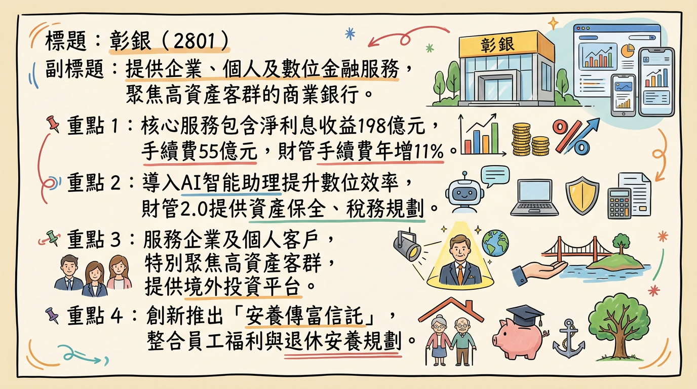
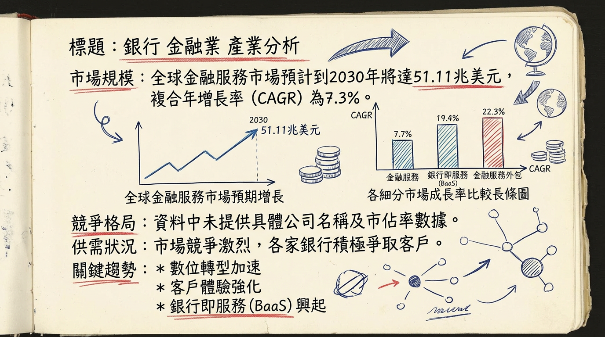
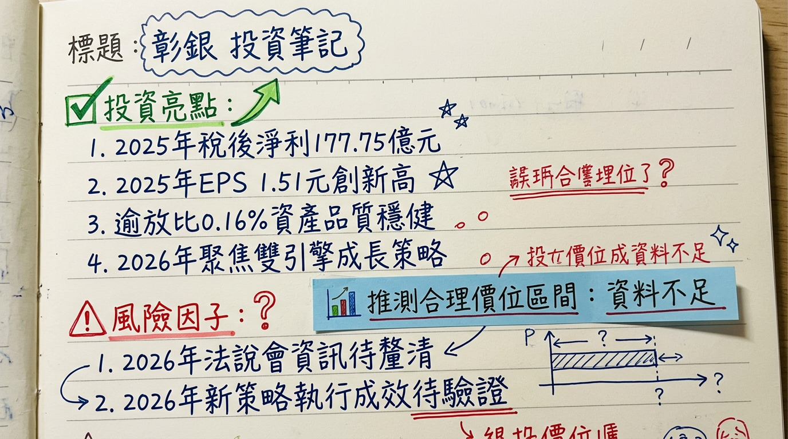

# 2801 彰銀 深度研究報告

## 一句話摘要
彰化銀行2025年稅後純益達新台幣177.75億元，EPS 1.51元，雙創歷史新高，展現核心業務成長與海外布局成效。展望2026年，彰銀將以「企金擴張、個金升級」為雙引擎，深化數位轉型與高資產財富管理，並積極拓展新南向與新東向海外據點，惟需留意全球經濟不確定性及美國降息循環對利差的潛在壓力。

## 公司概覽
彰化銀行（2801）主要提供多元化的商業銀行服務，涵蓋企業金融、個人金融及數位金融三大領域，並積極拓展海外市場與永續金融。

**業務、產品線：**
*   **企業金融：** 提供企業貸款、結算服務、貿易融資、資本運作及資金管理解決方案。持續擴大對中小企業放款。
*   **個人金融：** 包括理財型房貸、個人信貸、財富管理、保險業務及信託服務等。尤其聚焦於高資產客群，提供「財管2.0」服務，內容包括資產保全、稅務規劃、家族傳承等一站式服務。近年推出整合式「安養傳富信託」服務。
*   **數位金融：** 積極推動網路銀行、行動銀行，導入AI智能助理，並優化AI模型以偵測高風險帳戶與防詐。
*   **海外營運：** 拓展海外分行網絡，主要獲利市場為香港、美國與英國，並積極拓展馬來西亞、澳洲與加拿大市場。

**營收結構（業務貢獻說明）：**

| 業務類別      | 2025年前十月主要貢獻數據                                                                                             | 2025年上半年主要貢獻數據                                                                           | 2024年主要貢獻數據                                                                             |
| :------------ | :------------------------------------------------------------------------------------------------------------------- | :--------------------------------------------------------------------------------------------------- | :----------------------------------------------------------------------------------------------- |
| **淨利息收益** | 新台幣198億元，年增17.7%                                                                                             | (未提供具體金額)                                                                                     | (未提供具體金額)                                                                                 |
| **手續費收入** | 新台幣55億元，年增1.6%；其中財富管理手續費收入新台幣40.6億元，年增11%                                               | 年增逾12%，保險業務年增逾24%                                                                         | 年增幅度達四成                                                                                   |
| **投資收益**   | 新台幣85億元，年減12%                                                                                                | (未提供具體金額)                                                                                     | 年增近一成                                                                                       |
| **放款結構**   | (未提供)                                                                                                             | 放款總量年增6.75% (企業金融4.34%，個人金融7.17%，海外放款22.47%)                                      | 授信業務餘額增長10.63% (房貸12.33%，中小企業放款12.03%)；中小企業放款佔33.43%，房貸佔28.98% |
| **海外獲利**   | 海外與OBU稅前盈餘貢獻度提升至22.7% (2024年為12.4%)                                                                    | 獲利已超越2024年全年紀錄                                                                             | 獲利貢獻佔比12.4%                                                                                |

**營運據點：**
彰銀為銀行業，無製造基地。主要營運據點為其國內外分行網絡及辦事處。
*   **海外營運：** 2025年第一季，海外獲利貢獻佔比已由2024年底的12.4%提升至23.7%。前三大獲利市場為香港、美國與英國。
*   **新據點擴展：** 馬來西亞納閩分行與吉隆坡行銷服務處已獲當地主管機關核准，預計於2026年上半年開業。澳洲雪梨與加拿大多倫多分行的申請也同步進行中。
*   **國內據點：** 將進駐高雄亞洲資產管理中心專區，瞄準國際高資產客群。

## 核心競爭優勢
1.  **高資產客戶財富管理布局：** 獲金管會核准開辦「財管2.0」業務，並規劃將理專人力擴增至500人，結合家族辦公室、私募股權基金等服務，滿足高資產客群的多元需求，有望顯著提升手續費收入。
2.  **數位轉型與AI應用深化：** 積極導入AI智能助理、自建房貸鑑估校正模型、部署AI防詐模型，並將內部AI平台與大型語言模型結合，有效提升營運效率、客戶體驗與風險管理能力，符合金融科技發展趨勢。
3.  **穩健的海外市場拓展：** 海外獲利貢獻佔比持續提升，2025年前八月已達22.7%。積極布局新南向與新東向市場（馬來西亞、澳洲、加拿大），為未來獲利增添新動能。
4.  **強化的ESG永續金融實踐：** 連續獲BSI ESG永續發展獎項與金管會永續金融評鑑前段班，並二度榮登《S&P Global永續年鑑2025》全球銀行業前10%，有助於吸引永續投資資金，提升品牌形象。
5.  **核心存放款業務穩健增長：** 2025年放款總量年增6.75%，其中海外放款大幅成長22.47%。存款總量年增1.67%，顯示核心業務具備良好的成長動能。

## 財務分析

### 月營收趨勢
| 月份      | 金額 (新台幣億元) | 月增率 MoM | 年增率 YoY |
| :-------- | :---------------- | :--------- | :--------- |
| 2026年1月 | 42.59             | 16.49%     | 18.5%      |
| 2025年12月 | 36.56             | 5.8%       | 9.04%      |
| 2025年11月 | 34.56             | -7.1%      | 4.1%       |
| 2025年10月 | 37.20             | 1.3%       | 21%        |
| 2025年9月  | 36.73             | -3.4%      | 5.5%       |
| 2025年8月  | 38.02             | -14.9%     | -1.1%      |

### 季度數據
| 年度/季度 | 季營收 (新台幣億元) | 毛利率 (%) | 營業利益率 (%) | EPS (新台幣元) |
| :-------- | :------------------ | :--------- | :------------- | :------------- |
| 2025年Q4  | 233.9864            | 41.15      | 未找到         | 0.31           |

### 全年度營收與 EPS
| 年度 | 總營收 (新台幣億元) | 年成長率 (%) | EPS (新台幣元) | 年成長率 (%) |
| :--- | :------------------ | :----------- | :------------- | :----------- |
| 2024 | 418.1954            | -            | 1.33           | -            |
| 2025 | 961.6104            | 0.88         | 1.51           | 18.9         |

## 法說會重點

**最近一次法說會預告：**
彰化銀行將於**2026年3月18日14時30分**召開2025年第四季線上法人說明會，屆時將報告該季財務資訊及經營成果。

**管理層具體 guidance 及營運展望：**
*   **2025年第三季法說會 (2025/11/26) 重點：**
    *   2025年前十月稅後純益達新台幣155億元，年增24%，已超越2024年全年獲利（新台幣149.6億元）。
    *   獲利成長動能主要來自核心業務成長、利差改善及海外布局擴大。
    *   前三季淨利息收益新台幣198億元，年增17.7%；手續費收入新台幣55億元，年增1.6%，其中財富管理手續費年增11%至新台幣40.6億元。
    *   9月底存放款利差1.22%，年增15個基本點；淨利差（NIM）0.87%，年增0.1個基本點。
    *   海外獲利貢獻占比從2024年底的12%提升至22.2%。
    *   預期2026年現金股利配比將「比今年多」，整體股利可望優於2025年。
    *   馬來西亞納閩分行與吉隆坡行銷服務處已獲當地主管機關核准，預計2026年上半年開業。
*   **2025年第二季法說會 (2025/08/29) 重點：**
    *   上半年放款總量年增6.75%，其中企金成長4.34%、個金成長7.17%，海外放款大增22.47%。
    *   存款總量年增1.67%，台幣存款成長4.10%，外幣存款則因美元走弱影響減少5.37%。
    *   財富管理手續費年增逾12%，保險業務上升24%以上。
    *   已獲金管會核准啟動高資產客戶專屬「財管2.0」業務，預計2025年第四季正式開辦。
*   **2026年全行行務會議 (2026/02/11-12) 經營主軸：** 定調為「展翅高飛、再創新局」，將以企業金融擴張、個人金融升級為雙引擎，並規劃將理專人力擴增至500人。經營策略將從衝刺規模轉向優化利差與手續費收入結構，追求獲利續航力。

**產能利用率、資本支出：**
*   銀行業無傳統製造業之「產能利用率」指標。
*   **資本支出金額：** 目前未找到2025-2026年具體資本支出金額資料，但提及將加速導入AI與數位工具，此類投資通常會反映在資本支出中。

## 券商觀點

### 券商目標價與評等
目前未找到2025-2026年來自至少3家券商的具體目標價資訊。

| 券商名稱 | 目標價 (新台幣元) | 評等   | 日期       |
| :------- | :---------------- | :----- | :--------- |
| (未提供) | N/A               | (未提供) | (未提供) |

### EPS 預估
*   **2025年EPS預估：**
    *   統一證券預估彰銀2025年度EPS有望達到新台幣1.47元 (2025/09/30)。
    *   法人機構平均預估年度稅後純益預期可達新台幣176.7億元，預估EPS將落在新台幣1.5元至1.5元之間 (截至2026/02/09)。 (註：彰銀2025年實際EPS已公布為1.51元)。
*   **2026年EPS預估：**
    *   法人機構平均預估彰銀2026年年度稅後純益預期可達176.7億元，預估EPS將落在新台幣1.5元至1.5元之間 (截至2026/02/09)。

### 重大調升/調降評等
目前未找到2025-2026年彰銀有重大調升或調降評等的資訊。

## 財報深度分析

### 利潤率趨勢表格
| 年度/季度 | 毛利率 (%) | 營業利益率 (%) | 稅前淨利率 (%) | 稅後淨利率 (%) | 單季稅後淨利年增率 (%) | 淨利差 (NIM) (%) |
| :-------- | :--------- | :------------- | :------------- | :------------- | :--------------------- | :--------------- |
| 2025年Q4  | 88.9       | 38.59          | 38.59          | 33.46          | -1.95                  | (未提供)         |
| 2025年Q3  | 45.92      | 19.74          | 23.93          | 41.04          | 31.96                  | 0.87             |
| 2025年Q2  | (未提供)   | (未提供)       | (未提供)       | 40.51          | 38.25                  | (未提供)         |
| 2025年Q1  | (未提供)   | (未提供)       | (未提供)       | 38.49          | 7.92                   | 0.86             |
| 2024年Q4  | (未提供)   | (未提供)       | (未提供)       | 35.74          | (未提供)               | (未提供)         |
| 2024年Q3  | (未提供)   | (未提供)       | (未提供)       | 35.07          | (未提供)               | 0.77             |
| 2024年Q2  | (未提供)   | (未提供)       | (未提供)       | 35.87          | (未提供)               | (未提供)         |
| 2024年Q1  | (未提供)   | (未提供)       | (未提供)       | 37.24          | (未提供)               | (未提供)         |

**利潤率變化的原因分析：**
*   **2025年全年：** 稅後純益達新台幣177.75億元，EPS 1.51元，獲利創歷史新高。主要受益於核心業務成長、利差改善及海外布局擴大。
*   **2025年前三季：** 合併稅後純益達141.5億元，年增25.79%。淨利息收益年增17.68%，淨利差（NIM）從2024年同期的0.77%上升至0.87%。財富管理手續費收入年增10.89%。海外獲利占比達22.2%，顯著提升。
*   **2025年上半年：** 獲利年增22.64%，主因核心業務成長與資金成本優化。
*   **2025年第一季：** 合併稅後盈餘41.35億元，年增7.92%。淨利差（NIM）持續逐季成長至0.86%，整體利息淨收益年增逾16%以上，反映資產配置及負債結構調整成效。海外獲利占比從2024年底的12.4%提升至23.7%。
*   **2024年全年：** 合併稅後純益149.58億元，較2023年成長15.22%，創歷史新高。存放業務與淨手續費收入均呈雙位數成長，手續費收入年增幅度達四成，淨投資收益成長近一成。

### 存貨分析
對於銀行業而言，「存貨金額」、「存貨週轉天數」與「應收帳款週轉天數」並非適用之財務指標，因此不適用此項分析。

### 資本支出
*   **近3年資本支出金額與趨勢：** 未找到2024-2026年彰銀具體資本支出金額數據。
*   **未來資本支出計畫與預計新增產能：** 彰銀未來的投資主要聚焦於數位化、AI應用及海外據點擴充，例如：
    *   **數位與AI投資：** 加速導入AI與數位工具，提升營運效率、風險管理與客戶服務。
    *   **海外布局：** 馬來西亞納閩分行與吉隆坡行銷服務處預計於2026年上半年開業。澳洲雪梨與加拿大多倫多分行申請亦持續進行。
    *   **財富管理理專人力：** 規劃將前線理專人力擴增至500人，以提升高資產客群服務能力。

## 股權異動

### 近期董監事/大股東申報轉讓紀錄
*   **2023年：** 台新金融控股股份有限公司（大股東）曾多次申報轉讓持股，總計轉讓約430,000張。
*   **2024-2026年：** 未找到2024年以後最新的董監事/大股東申報轉讓紀錄。

### 庫藏股買回紀錄
未找到2024-2026年彰銀庫藏股買回紀錄。

### 是否有發行可轉換公司債（CB）及轉換價格
未找到2024-2026年彰銀發行可轉換公司債（CB）的紀錄。

### 近期是否有現金增資或減資計畫
未找到2024-2026年彰銀現金增資或減資計畫的最新資料。

### 股利政策（現金股利、股票股利歷史）
| 年度 (發放盈餘) | 現金股利 (新台幣元/股) | 股票股利 (新台幣元/股) | 總股利 (新台幣元/股) |
| :-------------- | :--------------------- | :--------------------- | :------------------- |
| 2024年          | 0.50                   | 0.50                   | 1.00                 |
| 2025年 (預估)   | 0.55+ (預期將比去年多)  | 0.55+ (預期將比去年多)  | 1.10+ (法人估計)      |

*   **2025年（發放2024年盈餘）：** 預計配發總股利1元，其中現金股利0.5元，股票股利0.5元。盈餘分配率為75%。
*   **2026年（預計發放2025年盈餘）：** 法人估算彰銀2025年稅後純益177.7億元，EPS 1.51元。預期配發2025年營運成果每股總股利上看1.1元，可能為每股0.55元現金股利、0.55元股票股利。彰銀管理層表示，2026年現金股利配發比重會「比今年多」，整體股利可望優於2025年，配發逾1元股利。

## 產業分析

### 產業數據
*   **全球金融服務市場規模和 CAGR 成長率：**
    *   預計到2030年將達到51.11兆美元，複合年增長率（CAGR）為7.3%。
    *   銀行即服務市場預計將從2026年的264.7億美元增長到2034年的1080.3億美元，CAGR為19.20%。
    *   金融服務外包市場在2026年預估為3,505億美元，並預計以8.5%的複合年增長率成長至2033年的6,258億美元。
*   **供需狀況：** 市場普遍呈現競爭激烈，各家銀行積極爭取客戶。台灣銀行業在2024-2025年表現穩健，經濟成長帶動獲利，海外獲利節節攀升。
*   **產業的平均利潤率水準（淨利差 NIM）：**
    *   截至2025年第四季度末，中國商業銀行淨利差為1.42%。
    *   彰化銀行在2025年第一季的淨利差（NIM）持續逐季成長，達到0.86%，第三季達到0.87%。

### 競爭格局

**全球前五大銀行（依一級資本/總資產）：**
| 排名 | 公司名稱   |
| :--- | :--------- |
| 1    | 工商銀行   |
| 2    | 建設銀行   |
| 3    | 農業銀行   |
| 4    | 中國銀行   |
| 5    | 摩根大通   |

**彰銀 vs 主要競爭對手的具體比較：**
| 項目   | 彰化銀行                                                                                             | 台灣同業 (綜合敘述)                                                                                    |
| :----- | :--------------------------------------------------------------------------------------------------- | :----------------------------------------------------------------------------------------------------- |
| **技術** | 積極導入AI智能助理、房貸鑑估校正模型、防詐AI模型，部署內部AI平台，探索區塊鏈應用（咖啡鏈支付）。       | 各大銀行皆積極數位轉型，導入AI、大數據分析，發展行動支付與線上服務，部分銀行於區塊鏈與新興金融科技投入較深。 |
| **客戶** | 深耕企業金融，聚焦高資產客群 (財管2.0)，提供「安養傳富信託」等創新服務。                             | 部分銀行以消金見長，部分以企金或財富管理為核心。高資產客群為各銀行爭奪重點。                                 |
| **價格** | 財富管理手續費年增逾12%，保險業務手續費年增逾24%，顯示收益成長。                                   | 貸款利率、手續費因市場、產品、客戶信用而異，競爭激烈。                                                       |
| **產能** | 2025上半年放款總量年增6.7%，其中海外放款大增22.4%。理專人力規劃擴增至500人。                          | 放款總量隨各行策略不同而異，部分同業在特定放款領域或海外市場表現更為積極。                                   |

**台灣同業比較（2025年EPS）：**
| 公司名稱 | 2025年EPS (新台幣元) | 備註                 |
| :------- | :------------------- | :------------------- |
| 上海商銀 | 3.05                 | 上市銀行股EPS王      |
| 台中商銀 | 1.53                 |                      |
| 彰銀     | 1.51                 | 歷史新高             |
| 聯邦銀行 | 1.27                 |                      |
| 台灣企銀 | 1.26                 | 歷史新高             |
| 高雄銀行 | 0.68                 |                      |

*   **淨利差比較：** 彰銀在2025年第一季的淨利差（NIM）為0.86%，第三季為0.87%。目前缺乏2025年台灣各上市銀行淨利差的完整公開比較數據。

### 產業趨勢
1.  **人工智慧 (AI) 和機器學習 (ML)：**
    *   **影響：** AI在金融服務中重塑詐欺偵測、客戶體驗、AI理財策略等，預計降低營運成本35%。生成式AI將改變零售支付路徑，實現自動化購買。AI理財顧問提供個人化投資策略，成本較低。AI強化資安，即時分析數據識別異常。
2.  **區塊鏈 (Blockchain) 與數位資產：**
    *   **影響：** 區塊鏈技術將促成3,970億美元跨境支付，提升交易速度和安全性。穩定幣地位日益穩固，預計2026年爆發式增長。資產代幣化（Real World Assets, RWA）已通過技術概念驗證，銀行業為優先試辦對象，將成為新一代金融基礎設施。
3.  **數位轉型與嵌入式金融 (Embedded Finance)：**
    *   **影響：** 數位轉型成為金融服務業生存關鍵，95%金融機構將採用雲端運算，強化嵌入式金融能力。嵌入式金融2.0從B2C支付轉向B2B垂直SaaS突圍，軟體將成為企業新銀行。開放銀行採用率將增加21%。金融服務從「數位化」進入「智慧化」與「隱形化」。

**對彰銀而言的具體機會和威脅：**
*   **機會：**
    *   **數位金融與AI應用深化：** 彰銀積極導入AI於房貸鑑估、智能客服、防詐偵測及內部知識管理，有助提升效率、服務品質及風險控管。
    *   **高資產客群財富管理：** 「財管2.0」服務符合市場需求，提升手續費收益。
    *   **永續金融發展：** 積極推動ESG計畫並獲獎，符合全球永續投資趨勢。
    *   **海外業務成長：** 海外放款與獲利持續增長，海外市場為重要成長動能。
*   **威脅：**
    *   **技術變革快速：** 若無法持續投入資源，可能在金融科技競爭中落後。
    *   **資安風險與法規遵循：** 數位服務普及伴隨資安威脅與新法規合規挑戰。
    *   **市場競爭激烈：** 台灣金融業同業與金融科技新創競爭激烈。
    *   **全球經濟不確定性：** 地緣政治、貿易衝突、貨幣政策等因素影響營運穩定性。

**相關投資題材的具體連結：**
*   **AI (人工智慧)：** 彰銀將AI應用於多項業務，符合AI提升金融效率與服務品質的投資題材。
*   **區塊鏈與數位資產 (RWA)：** 彰銀探索區塊鏈應用，未來可能受RWA資產代幣化趨勢影響。
*   **ESG (環境、社會、公司治理)：** 彰銀在永續金融領域的投入與獲獎，符合全球ESG投資趨勢。
*   **數位轉型與金融科技 (FinTech)：** 彰銀積極推動數位服務與金融科技應用，與金融服務業數位轉型趨勢高度相關。

## 近期催化劑
*   **2026年03月18日：** 將召開2025年第四季法人說明會，市場將關注管理層對未來展望的具體說明。
*   **2026年03月02日：** 啟動校園徵才，釋出11類職缺並首度推出「新進人員獎勵金」5,000元，顯示積極儲備人才以支持業務擴張。
*   **2026年02月26日：** 董事會承認2025年度連結財務報告，全年稅後純益達新台幣177.75億元，年增18.93%，EPS 1.51元，雙創歷史新高，印證穩健的獲利成長。
*   **2026年02月12日：** 2026年全行行務會議定調年度經營主軸為「展翅高飛、再創新局」，以企業金融擴張、個人金融升級為雙引擎，並規劃將理專人力擴增至500人，指引明確的成長方向。
*   **2026年02月10日：** 高雄高資產財富管理中心揭牌，正式進駐高雄專區，顯示積極搶佔高資產客群市場。
*   **2026年02月09日：** 公布2026年1月合併營收為新台幣42.59億元，月增16.49%、年增18.5%，創近6個月以來新高，展現良好開年營運動能。
*   **2026年01月17日：** 法人預估2026年配發2025年營運成果每股總股利上看1.1元，管理層亦預告2026年現金股利配比將「比今年多」，可望優於2025年，對股東具吸引力。
*   **2025年11月26日：** 法人說明會上預告馬來西亞納閩分行與吉隆坡行銷服務處預計2026年上半年開業，海外擴張計畫明確。

**潛在利空：**
*   **法人賣超：** 近三個月外資累計淨賣超約59,969張，投信累計淨賣超約13,006張，自營商累計淨賣超約13,097張，顯示三大法人近期呈現淨賣超態勢。
*   **全球不確定性：** 美國降息循環可能壓縮利差、地緣政治衝突、美中爭端等不確定性因素對銀行獲利帶來挑戰。

## ⭐ 成長動能時間軸

| 成長動能類別 | 具體項目                                                   | 預計時間點        |
| :----------- | :--------------------------------------------------------- | :---------------- |
| **海外擴點**   | 馬來西亞納閩分行與吉隆坡行銷服務處開業                       | 2026年上半年     |
|              | 澳洲雪梨與加拿大多倫多分行 (申請中)                        | 持續進行          |
| **新客群拓展** | 高雄高資產財富管理中心揭牌 (財管2.0服務)                   | 2026年2月10日     |
|              | 理專人力擴增至500人                                        | 2026年              |
| **新產品/服務** | 整合式「安養傳富信託」服務                                 | 2026年1月21日推出 |
| **數位/AI應用** | 內部AI智能助理平台部署與大型語言模型導入                     | 2025年上半年已應用 |
|              | AI模型強化房貸鑑估效率、高風險帳戶偵測                       | 持續優化          |
| **核心業務需求** | 企業金融放款成長 (中小企業、聯貸主辦)                      | 2026年              |
|              | 個人金融放款成長 (理財型房貸、個人信貸)                      | 2026年              |
|              | 海外放款大幅成長 (美國、香港、英國市場貢獻顯著)              | 2025年上半年起   |

## 2026 展望

**成長動能：**
彰銀在2026年將延續2025年的強勁獲利動能，主要成長力道來自「企金擴張、個金升級」的雙引擎策略。
1.  **海外業務持續擴張：** 馬來西亞納閩分行與吉隆坡行銷處預計於2026年上半年開業，加上澳洲雪梨與加拿大多倫多分行的申請進度，有望進一步提升海外獲利貢獻。2025年海外獲利占比已達22.7%，顯著高於2024年的12.4%。
2.  **高資產財富管理升級：** 「財管2.0」業務已於2025年第四季正式開辦，並在2026年2月於高雄設立高資產財富管理中心，結合理專人力擴增至500人的規劃，預期將顯著帶動手續費收入成長。
3.  **核心存放款優化：** 透過調整資產配置、嚴控資金成本、強化差異化定價，以及深化供應鏈與中小企業金融，追求淨利差（NIM）的穩定與提升，預計淨利息收益將保持穩健增長。
4.  **數位轉型與AI賦能：** 加速導入AI與數位工具以提升營運效率、客戶體驗與風險管理能力，將有助於降低成本並創造新的服務模式。
5.  **股利政策優於往年：** 管理層釋出2026年現金股利配比將「比今年多」，整體股利可望優於2025年，顯示對未來獲利展望具信心，有助提升股東報酬。

**風險：**
1.  **美國降息循環壓力：** 隨著美國可能進入降息循環，可能對全球淨利差造成壓縮，進而影響銀行利息收益。
2.  **全球經濟不確定性：** 地緣政治衝突、美中貿易爭端及主要國家經濟政策變動等因素，可能影響全球金融市場穩定性及企業放款需求。
3.  **市場競爭激烈：** 台灣金融業同業競爭，以及金融科技新創的挑戰，對彰銀的獲利能力和市場份額構成壓力。
4.  **資安與法遵風險：** 數位化服務的普及帶來日益增加的網路資安威脅，以及持續變化的金融法規（尤其涉及AI和數位資產），需投入大量資源以確保合規性與安全性。

## 投資結論
彰化銀行2801在2025年表現強勁，稅後純益及EPS均創歷史新高，顯示其營運策略的有效性。展望2026年，彰銀具備明確的成長動能，為投資者提供以下關鍵投資考量：

1.  **獲利成長續航力：** 2025年EPS達1.51元創歷史新高，且2026年經營主軸定調「企金擴張、個金升級」，配合海外據點擴展與財管2.0深度經營，預期獲利成長動能可望延續。
2.  **海外與財富管理雙引擎：** 海外獲利佔比顯著提升，加上馬來西亞新據點的開業計畫，將為營收帶來新成長點。同時，高資產財富管理業務的積極布局和理專人力擴增，有望大幅提升手續費收入貢獻。
3.  **股利政策具吸引力：** 管理層預告2026年現金股利配發比重將「比今年多」，整體股利可望優於2025年，對於尋求穩定現金流的投資者具有吸引力。
4.  **數位轉型與ESG優勢：** 彰銀在AI應用和ESG永續金融方面的積極投入，不僅提升營運效率和風險管理，也符合當前全球的投資趨勢，有助於企業長期價值。

儘管法人預估2026年EPS與2025年持平（約1.5元），但考量其強勁的成長動能、明確的策略方向以及優於預期的股利政策，我們認為市場可能給予其合理的估值溢價。基於2026年預估EPS新台幣1.5元，並考量台灣銀行業普遍的12x至14x本益比區間，建議**目標價區間為新台幣 18.0元至 21.0元**。

本報告由 AI 自動產生，資料來源為公開網路資訊，僅供參考，不構成投資建議。產生時間：2026-03-06 14:01

---

## 📊 資訊卡

