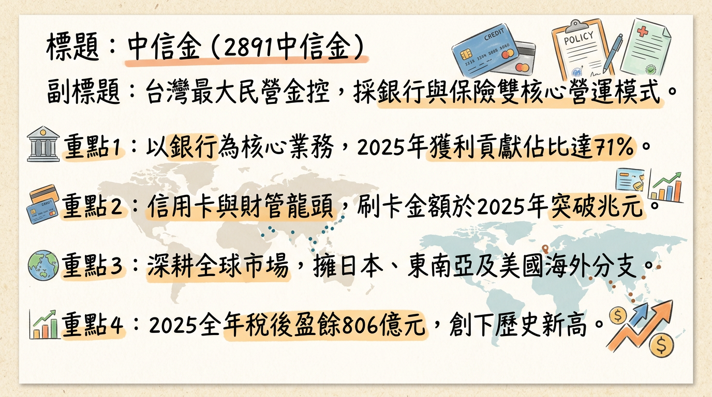
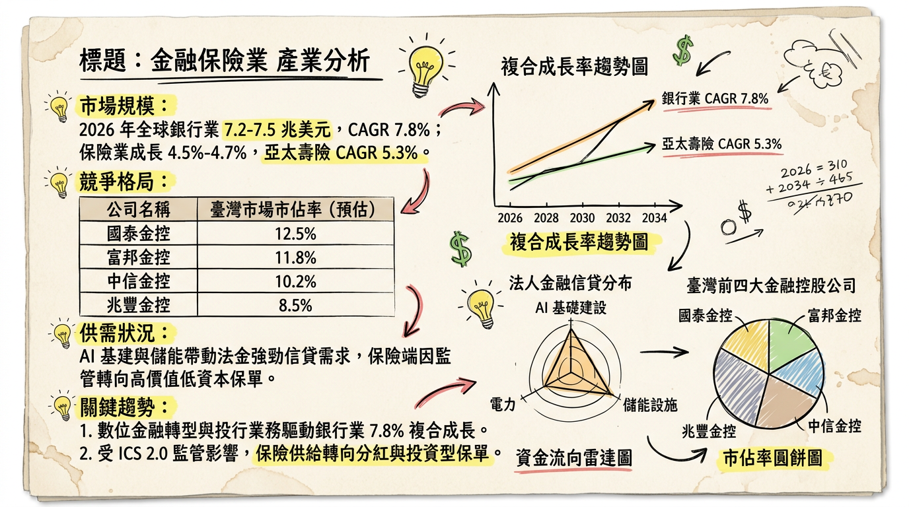
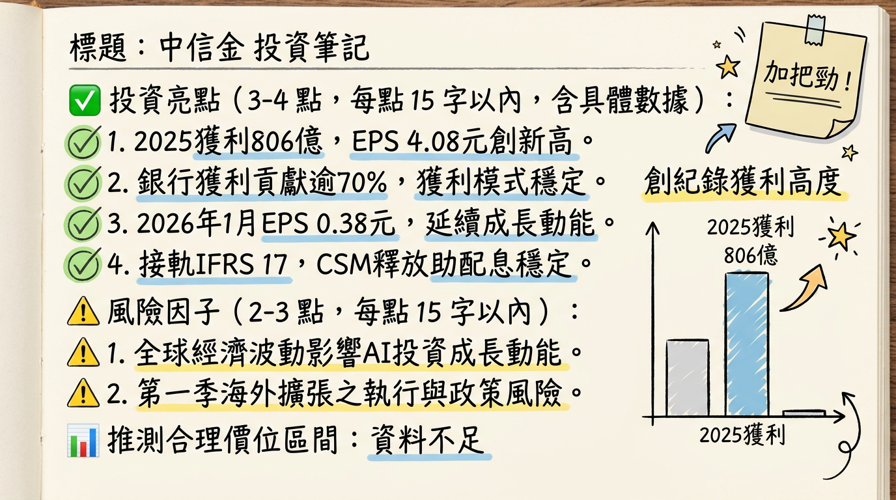

# 2891中信金 中信金 深度研究報告

## 一句話摘要
中信金控憑藉「銀行與壽險」雙核心引擎，2025 年獲利創下 806.19 億元歷史新高，EPS 達 4.08 元；2026 年在海外佈局收割與高股息題材（預估殖利率 >5%）驅動下，具備強勁評價調升動能。

---

## 公司概覽

中信金控（CTBC Financial Holding）為台灣民營金融龍頭，採取銀行與保險雙主軸經營模式。中信銀行在信用卡、財富管理及海外分支機構數量上長期居於領先地位。

### 業務與獲利結構（2025 全年度自結數據）
| 子公司名稱 | 核心業務 | 2025 稅後獲利 (億元) | 獲利貢獻佔比 | 備註 |
| :--- | :--- | :--- | :--- | :--- |
| **中國信託銀行** | 存借款、信用卡、財管 | 572.98 | 71% | 獲利年增 16%，刷卡額破兆 |
| **台灣人壽** | 人壽保險、投資型保單 | 208.50 | 26% | 排除準備金後獲利年增 29% |
| **其餘子公司** | 證券、創投、資產管理 | ~24.71 | 3% | 包含中信證券等 |
| **合計** | **中信金控** | **806.19** | **100%** | **EPS 4.08 元（歷史新高）** |

---

## 核心競爭優勢
1.  **海外佈局最深：** 擁有超過 370 處據點，海外獲利佔比長期維持在 33%-36%，領先國內同業。
2.  **財富管理龍頭：** 受惠台股高點，AUM（資產管理規模）與手續費收入維持雙位數成長。
3.  **GenAI 應用領先：** 2025 年推動 AI 協調員機制，AI 專案成功率提升至 50% 以上，降低核保與風險評估成本。
4.  **穩健的資本結構：** ROE 達 17.46%，顯著優於富邦金與國泰金。

---

## 財務分析

### 月營收趨勢表（合併營收）
| 月份 | 營業收入 (百萬 TWD) | 月增率 (MoM) | 年增率 (YoY) | 簡評 |
| :--- | :--- | :--- | :--- | :--- |
| **2026/01** | 25,857 | +13.18% | +48.23% | 銀行獲利創同期新高 |
| **2025/12** | 22,846 | -4.30% | +44.10% | 壽險提列準備金影響 |
| **2025/11** | 23,882 | -1.30% | +45.80% | 獲利動能平穩 |
| **2025/10** | 24,208 | -16.40% | +52.30% | 季節性基期影響 |
| **2025/09** | 28,973 | +15.80% | +77.70% | 財管收入爆發 |
| **2025/08** | 25,029 | +137.3% | +117.5% | 市場波動帶動交易收益 |

### 季度與年度數據
*   **2025 Q4 單季 EPS：** 1.02 元。
*   **淨利差 (NIM)：** 1.59% (YoY +0.07%)。
*   **2025 全年 EPS：** 4.08 元（2024 年為 3.64 元）。
*   **2026 預估 EPS：** 法人共識區間 3.99 - 4.17 元。

---

## 法說會重點
*   **股利政策 Guidance：** 2026 年預計配發率維持 60% 以上，法人推估配息約 **2.3 - 2.57 元**。
*   **資產品質：** 逾放比 (NPL) 僅 **0.48%**，備抵呆帳覆蓋率高達 **330%**。
*   **業務動向：** 2026 Q1 重點在於洛杉磯與雪梨分行正式營運。
*   **數位投資：** 強調 RWA（現實世界資產代幣化）平台開發，旨在降低跨境支付摩擦成本。

---

## 券商觀點
| 券商名稱 | 報告日期 | 目標價 | 評等 | 備註 |
| :--- | :--- | :--- | :--- | :--- |
| **中信投顧** | 2026/02/19 | **51.4 元** | 調升/買進 | 獲利創高且殖利率具吸引力 |
| **FactSet (綜合)** | 2026/01/30 | **50.0 元** | 調升 | 上修 2025 獲利超預期 |
| **FactSet (綜合)** | 2026/01/24 | **49.0 元** | 維持看多 | 看好 2026 海外擴張 |
| **本土法人** | 2026/02/25 | **52.0 元** | 買進 | 鎖定 3-4 月股利宣佈行情 |

---

## 財報深度分析

### 利潤率趨勢表
| 指標 | 2025 Q3 | 2025 Q2 | 2025 Q1 | 2024 Q4 |
| :--- | :--- | :--- | :--- | :--- |
| **稅後淨利率** | 39.48% | 33.71% | 33.08% | 28.71% |
| **營業利益率** | 44.26% | 35.10% | 39.98% | 34.88% |
| **成本收益比** | <50% | <50% | <50% | <50% |

*   **資本支出：** 2026/02 中信銀向子公司「中信金租」增資 **20 億人民幣**。
*   **存貨分析 (資產品質)：** 2025 年放款成長年增 **39.6%**，無異常呆帳，成長集中於高利差之東南亞市場。

---

## 股權異動
*   **申報轉讓：** 2026 年 1-2 月多位子公司經理人（如張嘉華、楊淑惠）小額轉讓 7-15 張（多為信託/贈與），屬正常稅務安排。
*   **額定資本額：** 已由 2300 億提高至 **3200 億元**，顯示未來仍有併購或大規模擴張意圖。
*   **公司債：** 2025 年發行 400 億元無擔保公司債，用於強化資本結構。

---

## 產業分析

### 市場格局
*   **全球趨勢：** 2026 全球銀行業 CAGR 估 7.8%，AI 基礎設施帶動聯貸需求。
*   **會計準則：** 2026/01/01 起接軌 IFRS 17，中信金因獲利透明化有利於股利穩定。

### 台灣同業競爭比較（2025 全自結）
| 公司名稱 | 稅後盈餘 (億) | EPS (元) | ROE (%) | 核心優勢 |
| :--- | :--- | :--- | :--- | :--- |
| **富邦金 (2881)** | 1208.5 | 8.35 | ~14% | 壽險獲利龍頭 |
| **國泰金 (2882)** | 1079.9 | 7.08 | ~12% | 資產規模最大 |
| **中信金 (2891)** | **806.19** | **4.08** | **17.46%** | **獲利效率與海外佈局最高** |

---

## 近期催化劑
*   **利多：** 
    *   3-4 月公佈 2026 現金股利，市場預期達 2.5 元。
    *   外資 2026 年初至今累計買超逾 11.7 萬張。
*   **利空：** 
    *   川普政府可能上調關稅，影響約 1.5% 之中高風險授信出口商。
    *   台幣若劇烈波動，仍會對台灣人壽產生避險成本壓力。

---

## ⭐ 成長動能時間軸

| 時間點 | 事件類型 | 具體內容 |
| :--- | :--- | :--- |
| **2025 Q4 - 2026 Q1** | **海外擴點** | 完成美國洛杉磯、德州、澳洲雪梨、日本福岡等 8 個據點佈建。 |
| **2026/01/01** | **制度轉型** | 正式接軌 IFRS 17 與 TW-ICS，提升長期配息穩定性。 |
| **2026 H1** | **需求增長** | AI 伺服器與半導體供應鏈全球設廠，帶動放款年增目標維持 >10%。 |
| **2026 Q3** | **產能擴充** | 海外據點總數目標突破 380 處，目標貢獻銀行獲利之 1/3。 |
| **2026 全年度** | **新市場切入** | 深耕印度 GIFT City 與越南平陽市場，鎖定台商供應鏈南移資金流。 |

---

## 2026 展望
*   **成長動能：** 銀行本業利差隨高利率環境維持高檔，且財富管理業務受惠資本市場熱絡；海外據點進入收割期。
*   **潛在風險：** 川普關稅政策影響全球貿易流向；ICS 2.0 實施對壽險業資本適足率的長期考驗。

---

## 投資結論
1.  **獲利體質強健：** 2025 年 EPS 4.08 元創歷史新高，2026 年預期維持 4 元左右水準。
2.  **殖利率護城河：** 預估配發 2.3-2.5 元股利，隱含殖利率約 5.0%-5.5%，具備防禦性。
3.  **評價調升空間：** 目前 P/B 與 P/E 仍具吸引力，隨海外獲利佔比提升，評價有望向國際大型銀行看齊。
4.  **建議操作：** 股價 50-52 元為強力支撐區，建議於 3 月股利宣佈前逢低佈局，**目標價區間看好 55-58 元**。

---
**本報告由 AI 自動產生，資料來源為公開網路資訊，僅供參考，不構成投資建議。產生時間：2026-03-01 21:31**

---

## 📊 資訊卡

