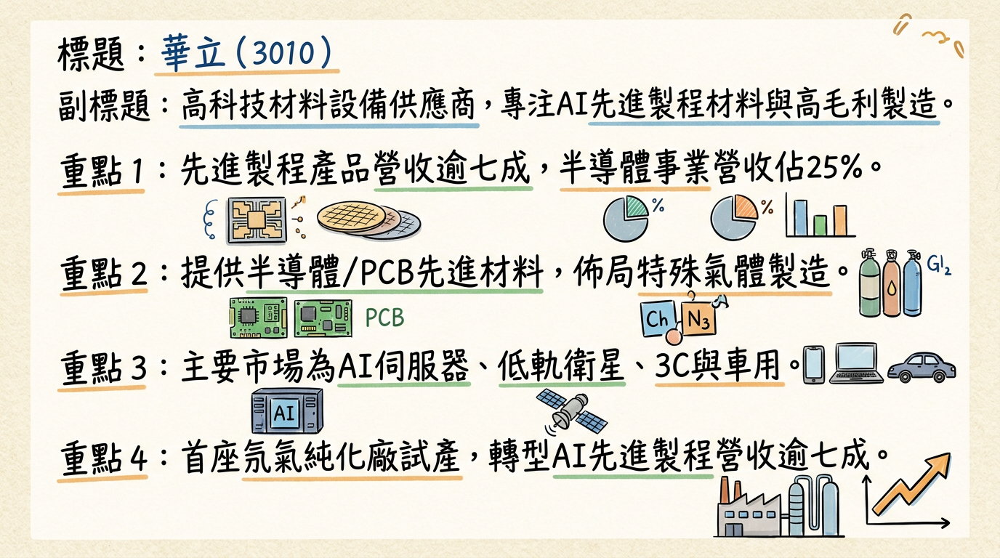
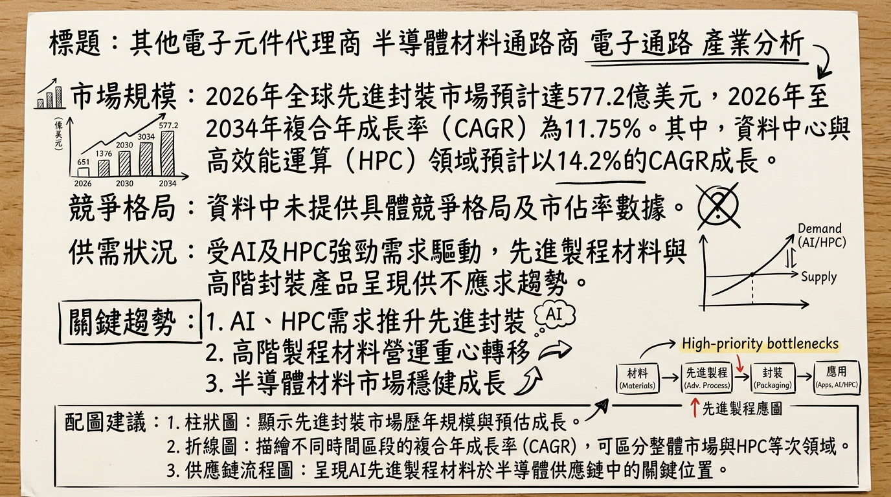
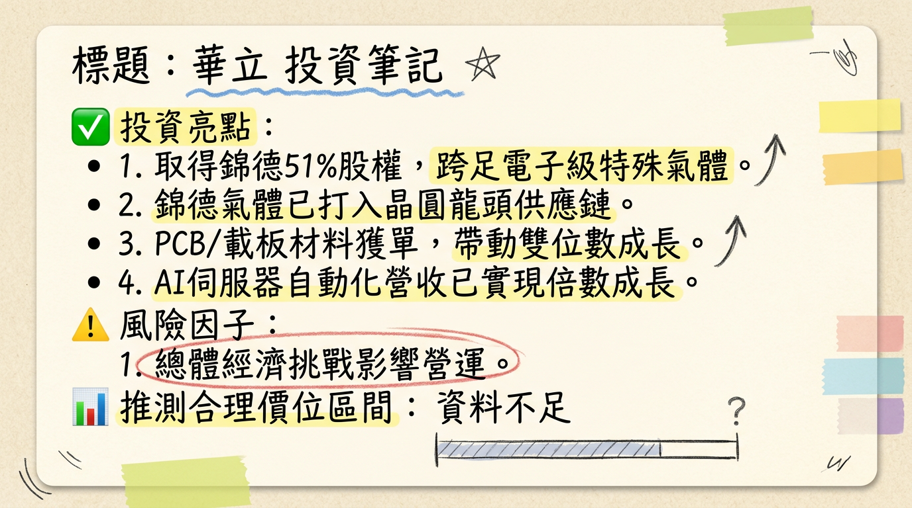

# 3010 華立 深度研究報告

## 一句話摘要
華立企業（3010）正成功轉型為高毛利製造與AI先進製程材料領導者，受惠於AI與高效能運算（HPC）強勁需求，2026年1月營收創歷史新高達75.98億元。公司策略性佈局電子級特殊氣體（併購錦德氣體、氖氣純化廠量產）及AI伺服器自動化產線，為未來成長奠定堅實基礎。法人預期其2026年EPS有望達9.09-9.56元，展現顯著成長潛力。

## 公司概覽
華立企業（3010）是一家台灣高科技材料與設備供應商及電子材料通路商，近年來營運重心已全面轉向「高毛利製造」與「AI先進製程材料」。

**核心產品與服務：**
*   **半導體材料**：提供半導體前段製程所需材料，如光阻液、研磨液、濕式化學品、特殊氣體、先進封裝材料等。
*   **PCB材料**：代理高解析度乾膜，並提供用於AI伺服器主板、低軌衛星、光收發模組等高成長領域的PCB材料，以及低損耗新世代銅箔基板（CCL）材料。
*   **高階工程塑膠**：應用於3C產品、車用連接器及光學模組等。
*   **特殊氣體製造**：積極布局氣體產品線，首座氖氣純化廠已進入試量產，並規劃切入混合氣體市場。
*   **智能工廠自動化**：憑藉在智能工廠自動化的經驗，已跨入電子五哥的AI伺服器組裝自動化產線，提供客製化解決方案。

**營收結構 (依業務別，截至2025年末至2026年初數據)：**
| 業務類別         | 營收佔比（最新） | 備註                                              |
| :--------------- | :--------------- | :------------------------------------------------ |
| 先進製程產品     | >70%             | 其中高速運算相關產品貢獻超過一半                  |
| 半導體事業       | 約25%            | 法人預期2026年將朝30%靠近                         |
| ICT（資通訊）    | 38.4% (2025年1-10月) | 相較2021年佔比下降                                |
| 光電             | 23.9% (2025年1-10月) | 相較2021年佔比下降                                |
| **舊有營收結構 (2024年，供參考)** |                  |                                                   |
| 平面顯示器產業   | 28.7%            |                                                   |
| 電子資通訊產業   | 28.1%            |                                                   |
| 半導體產業       | 26.4%            | 顯示半導體事業佔比自2024年以來持續增長且業務轉型 |

**製造與物流佈局：**
*   **氖氣純化廠**：位於屏南產業園區，已進入試量產，預計2026年第一季正式量產，月產能達8,000立方公尺。
*   **物流中心**：投資25至27億元於台南佳里興建1.2萬坪物流中心，規劃冷藏與常溫倉庫，預計於2025年底至2026年初啟用，以因應半導體客戶需求。
*   **國際佈局**：供應範圍涵蓋台灣、中國、新加坡、美國與日本。
*   **營收貢獻比例 (地區，2024年)：** 中國佔39.91%，台灣佔21.34%，其他佔19.53%，亞洲佔9.14%，美洲佔5.7%，歐洲佔4.38%。

## 核心競爭優勢
1.  **AI與HPC先進製程材料領導地位**：華立積極轉型，先進製程產品營收占比已突破七成，其中高速運算相關產品貢獻超過一半。在半導體前段製程材料、先進封裝材料及高階PCB材料領域，扮演關鍵供應商角色，緊密配合晶圓代工與封測大廠。
2.  **電子級特殊氣體製造能力**：透過併購錦德氣體（持股51%）切入高門檻的「混配氣」市場，並於屏南產業園區建置全台首座氖氣純化廠，預計2026年Q1量產，月產能達8,000立方公尺。此舉有助於掌握關鍵材料自主供應，提升毛利率。
3.  **智能工廠自動化解決方案**：成功切入電子五哥的AI伺服器組裝自動化產線，為全球AI運算領導品牌提供客製化解決方案，推動營收實現倍數成長，搭上智慧製造趨勢。
4.  **多元且深化的全球供應鏈**：華立在半導體材料領域的供應版圖持續擴大，涵蓋台灣、中國、新加坡、美國與日本，透過與世界級供應商及客戶的緊密合作，確保在缺貨期間能扮演關鍵材料供應者。

## 財務分析

### 月營收趨勢
| 月份      | 金額 (新台幣億元) | 月增率 (MoM) | 年增率 (YoY) | 備註                               |
| :-------- | :---------------- | :----------- | :----------- | :--------------------------------- |
| 2026年1月 | 75.98             | 15.09%       | 8.42%        | 創歷史單月營收新高                 |
| 2025年12月| 66.01             | -6.61%       | 3.21%        |                                    |
| 2025年11月| 70.69             | 11.18%       | -1.88%       |                                    |
| 2025年10月| 63.58             | -0.33%       | -3.84%       |                                    |
| 2025年9月 | 63.79             | -1.24%       | -6.42%       |                                    |
| 2025年8月 | 64.60             | -0.58%       | -11.61%      |                                    |

### 季度數據 (2025年第三季)
| 指標       | 數值                | 備註                                   |
| :--------- | :------------------ | :------------------------------------- |
| 季營收     | 新台幣 193.4 億元   | 累計2025年Q1-Q3營收為581.6億元          |
| 毛利率     | 8.26%               | 創歷年同期次高紀錄                     |
| 營業利益率 | 4.09%               | 優於去年同期                           |
| EPS        | 2.69 元             | 季增63.03%，年減2.18%。累計Q1-Q3 EPS 6.28元。 |

### 年度趨勢
| 年度      | 全年營收 (新台幣億元) | 年增率     | EPS (元) | 備註               |
| :-------- | :-------------------- | :--------- | :------- | :----------------- |
| 2024年 (實際) | 800.31                | 19.84%     | 8.89     | 創歷史新高         |
| 2025年 (預估) | 約 781.89             | -2.3%      | 7.42 ~ 8.41 | 法人機構平均預估   |
| 2026年 (預估) | (預期成長一成)        | >10%       | 9.09 ~ 9.56 | 法人機構平均預估   |

## 法說會重點 (最近一次：2025年11月25日)
*   **管理層發言核心**：華立積極轉型至半導體、AI、5G、電動車及綠能等高成長產業，深化供應鏈整合、擴大產品組合。2025年下半年及2026年展望受AI與HPC強勁需求推升，法人給予正向評價。公司管理層表示2025年會跑得更快，營收將持續維持往年雙位數成長（此為2024年9月資訊，後續2025年營收實際年減）。
*   **半導體材料**：受惠於AI、5G、HPC、電動車/自駕車等新興科技，半導體前段製程耗材銷量大增。先進製程營收占比突破七成，高速運算（HPC）貢獻客戶逾半營收。光阻液、研磨液與先進封裝材料等產品出貨暢旺，營收呈現高雙位數成長。隨客戶良率提升，終端下單意願增強，為華立半導體材料事業注入顯著成長動能。
*   **IC載板/PCB**：高解析度乾膜成功取得多家IC載板重點客戶訂單。PCB市場聚焦LEO低軌衛星、光收發模組及AI伺服器HDI主板等高成長應用，相關材料營收呈高雙位數成長。CCL方面，積極布局低損耗新世代樹脂材料，應用於AI伺服器專用GPU基板及ASIC加速板。
*   **自動化設備**：成功切入電子五哥AI伺服器的自動化組裝產線，為全球AI運算領導品牌量身打造客製化解決方案，推動營收實現倍數成長。
*   **產能利用率與資本支出**：
    *   **特殊氣體 (氖氣純化廠)**：首座氖氣純化廠已進入試量產，預計2026年Q1正式量產，鋼瓶月產能達8,000立方公尺。未來規劃切入混合氣體市場。
    *   **物流中心**：投資25至27億元於台南佳里興建1.2萬坪物流中心，預計2025年底至2026年初啟用，以因應半導體客戶需求。
    *   **資本支出總額**：法說會未明確提供2025-2026年具體總資本支出金額。

## 券商觀點
| 券商名稱       | 目標價 (新台幣元) | 評等 | 日期         | 2025年EPS預估 (元) | 2026年EPS預估 (元) |
| :------------- | :---------------- | :--- | :----------- | :----------------- | :----------------- |
| 元富證券投顧   | 125               | 看多 | 2025/11/27   | 8.41               | N/A                |
| CMoney團隊/法人機構平均 | N/A               | N/A  | 2026/01/09   | 4.40 (或 7.42-8.41) | 6.60               |
| 法人機構平均 (最新) | N/A               | N/A  | 2026/02/07   | N/A                | 9.09-9.56          |

**評等調整**：目前搜尋結果未明確顯示有近期重大調升/調降評等。元富證券投顧於2025年11月27日給予「看多」評等。

## 財報深度分析

### 利潤率趨勢 (近4-8季)
| 季度      | 毛利率  | 營業利益率 | 稅後淨利率 | EPS (元) | 備註                                   |
| :-------- | :------ | :--------- | :--------- | :------- | :------------------------------------- |
| 2025年Q3  | 8.26%   | 4.09%      | 4.07%      | 2.69     | 季營收、毛利創歷年同期次高，毛利率與營益率皆優於去年同期。 |
| 2025年Q2  | N/A     | N/A        | N/A        | 1.65     | 營收創歷年同期次高，毛利刷新同期歷史新高。 |
| 2025年Q1  | N/A     | N/A        | N/A        | 1.94     | 稅後淨利年增17.0%。                     |
| 2024年Q4  | N/A     | N/A        | N/A        | N/A      | 全年EPS 8.89元。                         |
| 2024年Q3  | N/A     | N/A        | N/A        | 2.75     |                                        |
| 2024年Q2  | N/A     | N/A        | N/A        | 2.29     |                                        |
| 2024年Q1  | N/A     | N/A        | N/A        | 1.80     |                                        |

**利潤率變化原因分析：**
*   **產品組合優化**：受惠於AI與HPC需求，先進製程材料出貨量增加，營收呈現高雙位數成長，先進製程產品營收占比已突破七成，有助於拉高整體毛利率。
*   **新製程與國際佈局**：進入量產階段的新製程為華立材料供應帶來契機。供應版圖擴大至美國、日本等市場，在特殊氣體與備用零件領域取得顯著成果，提升營運效率。
*   **智慧製造與自動化**：切入電子五哥AI伺服器自動化組裝產線，推動營收倍數成長，該高附加價值業務對利潤貢獻良多。
*   **泰國市場與電動車**：泰國子公司營收成長亮眼，受惠於電動車政策，導入創新材料深耕當地整車與零組件市場，特別聚焦非日系車廠，開啟新成長動能。
*   **低軌衛星與AI伺服器**：高解析度DI乾膜打入台廠供應鏈，應用於低軌衛星、光模塊與AI伺服器領域，低損耗新材料CCL因應AI主機板需求，這些高階應用均有助於維持較高毛利率。

### 存貨分析
| 季度      | 存貨週轉天數 (天) | 應收帳款週轉天數 (天) |
| :-------- | :---------------- | :-------------------- |
| 2025年Q3  | 26.8              | 79.58                 |
| 2025年Q2  | 25.91             | 75.47                 |
| 2025年Q1  | 29.69             | 85.82                 |
| 2024年Q4  | 25.72             | 83.16                 |
| 2024年Q3  | 22.22             | 80.22                 |
| 2024年Q2  | 21.98             | 74.81                 |
| 2024年Q1  | 26.82             | 82.36                 |

**存貨與營運分析：**
*   **存貨管理**：華立近期的存貨週轉天數維持在約20-30天範圍，相較於2023年Q1的42.03天有明顯下降趨勢，顯示存貨管理能力提升，消化速度加快。公司積極備料以協助客戶新廠裝機量產並爭取新製程基準品，此為策略性備料，並未見異常堆積。
*   **應收帳款管理**：應收帳款收現天數在2024年至2025年期間大致維持在75-86天，相較於2023年Q4的87.3天，部分季度有所下降，表明收款能力有所改善。

### 資本支出
*   **2024年**：年度合併營收達800.31億元，反映公司在產業擴張與投資。
*   **物流中心**：投資25至27億元於台南佳里興建1.2萬坪物流中心，預計2025年底至2026年初啟用，用以因應半導體客戶南部擴產需求，並承接第三方製造業委外倉儲商機。
*   **氖氣純化廠**：位於屏南產業園區的全台唯一氖氣提純工廠，預計2025年Q2啟動試量產，Q3完成主要客戶認證，年底前開始放量貢獻營收。2026年Q1將正式量產，月產能達8,000立方公尺，計畫切入混合氣體市場。
*   **折舊攤銷**：目前未找到2024-2026年具體折舊攤銷金額的公開資料。

## 股權異動

### 董監事/大股東申報轉讓紀錄 (2024年以後)
目前未找到2024-2026年華立董監事/大股東申報轉讓的最新紀錄。最近一次公開紀錄為：
*   2023年12月20日：經理人張瑞育申報轉讓22張股票予張真瑋（贈與）。
*   2023年10月17日：法人董事代表人配偶張瑞欽之配偶申報轉讓273張股票予張尊怡（贈與）。
*   2023年10月17日：法人董事代表人本人張瑞欽申報轉讓273張股票予張尊賢（贈與）。

### 庫藏股與可轉債
*   **庫藏股**：未找到2024-2026年華立實施庫藏股的紀錄。
*   **可轉換公司債 (CB)**：未找到2024-2026年華立發行可轉換公司債的相關資訊。

### 增減資
*   未找到2024-2026年華立現金增資或減資的具體計畫。

### 股利政策
華立近年主要以發放現金股利為主，配合發展計畫、考量投資環境、資金需求及股東利益，每年就可供分配盈餘提撥不低於10%分配股東紅利，其中現金股利不低於股利總額之50%。

| 年度      | 現金股利 (元/股) | 股票股利 (元/股) | 股利合計 (元/股) | 除息交易日 | 現金發放日 | 現金殖利率 (以除息前股價計) |
| :-------- | :--------------- | :--------------- | :--------------- | :--------- | :--------- | :-------------------------- |
| 2024 (預計2025分配) | 5.3              | 0                | 5.3              | 2025/06/23 | 2025/07/18 | 5.38% (以98.6元計)          |
| 2023 (2024分配) | 4.95             | 0                | 4.95             | 2024/07/24 | 2024/08/15 | 3.38% (以146.5元計)         |
| 2022 (2023分配) | 6.1              | 0                | 6.1              | 2023/06/29 | 2023/07/21 | 6.97% (以87.5元計)          |

## 產業分析

### 產業市場規模與CAGR
| 產業類別                      | 2025年市場規模     | 2026年市場規模     | CAGR (預估)          | 備註                          |
| :---------------------------- | :----------------- | :----------------- | :------------------- | :---------------------------- |
| 先進封裝市場                  | 516.5億美元        | 574.6億美元        | 9.42% (2026-2031)    | 資料中心與HPC領域CAGR 14.2%   |
| 半導體製造材料市場            | 676.9-720.3億美元  | 706-748.5億美元    | 4.20% (2026-2034)    | 晶圓製程材料佔2026年市場主導地位55.98% |
| 半導體先進封裝材料市場        | N/A (2024年124.3億美元) | N/A                | 11.0% (2024-2034)    | 預計2034年達268.2億美元       |
| AI伺服器PCB市場               | 50億美元           | 60億美元 (或96億美元) | 15.06% (2024-2032)   | 若涵蓋交換機及光模組，2026年市場規模有望達千億人民幣 |
| 銅箔基板 (CCL) 市場           | 168.9-187.6億美元  | 198.7億美元        | 5.9% (2026-2034)     | 高速數位CCL預計2025-2033 CAGR 5% |
| 半導體特種氣體市場            | 116.4億美元        | 125.2億美元        | 7.5% (2026-2034)     | 全球市場規模預計2026年將突破95億美元 |
| 純化氖氣市場                  | 數億美元           | 3.74億美元         | >7.6% (2026-2035)    | 氖氣市場預計2024年為263.9億美元，到2026年達281.1億美元 |

### 供需狀況與產業平均毛利率
*   **AI伺服器PCB材料**：2026年高階PCB產能將吃緊，上游關鍵材料如HVLP4銅箔（供需缺口預計擴大至25%、42%）、鑽針、玻纖布均供不應求。
*   **半導體特殊氣體**：EUV光刻雷射氣體混合物、ALD前驅體材料等，2025-2026年需求增速預計超過15%。全球氖氣生產集中，易受地緣政治影響，導致供不應求。
*   **CoWoS產能**：高盛預估NVIDIA Blackwell與Rubin架構將使CoWoS產能長期維持緊俏。
*   **產業平均毛利率**：
    *   半導體晶圓製造 (台積電)：長期目標53%以上，近期拉升至56%。
    *   晶圓代工 (世界先進)：預期2026年Q1毛利率28%至30%。
    *   伺服器PCB (金像電)：毛利率創歷史新高35.6%。

### 競爭格局 (主要參與者)
| 產業類別              | 主要參與者                                   | 華立之競爭優勢/定位                  |
| :-------------------- | :------------------------------------------- | :----------------------------------- |
| 先進封裝              | Intel, Samsung, ASE, Amkor, TSMC             | 代理先進封裝材料，深化與晶圓代工和OSAT客戶合作。 |
| 半導體先進封裝材料    | Unimicron (欣興), Ibiden, Shinko, Henkel     | 代理關鍵材料，透過AI/HPC需求取得客戶訂單。 |
| 銅箔基板 (CCL)        | TUC (台燿), SYTECH, Showa Denko, 南亞塑膠, Rogers, Kingboard, Nanya New Material, EMC等 (合計佔約72%市場份額) | 積極布局低損耗新世代樹脂材料，應對AI伺服器需求。 |
| 半導體特種氣體        | Air Liquide, Linde, Messer, Matheson, Iceblick, Airgas, Axcel Gases (中國本土企業亦有突破) | 併購錦德氣體切入混配製造，自建氖氣純化廠。 |
| 純化氖氣              | Air Liquide, Linde, Messer, Matheson, Iceblick, Airgas, Axcel Gases | 台灣唯一氖氣提純廠，掌握自主供應能力。 |
| 台灣特殊氣體同業      | 台特化 (4772)                                | 台特化專注高純度矽乙烷等，華立專注氖氣及混配氣體。 |
| 台灣PCB同業           | 金像電 (2368), 台燿 (6274), 台光電 (2383) 等 | 供應高階PCB材料，切入AI伺服器、低軌衛星等應用。 |

### 產業趨勢
1.  **異質整合與先進封裝**：摩爾定律減緩促使業界轉向異質整合與先進封裝 (2.5D, 3D ICs)，以提升AI/HPC應用效能與熱管理。玻璃基板等新材料被視為突破大尺寸封裝瓶頸的關鍵。
    *   **華立機會**：在先進封裝材料的代理與製造佈局將直接受益。
    *   **華立威脅**：需持續跟進快速變化的封裝技術與材料需求。
2.  **AI算力需求驅動PCB材料升級**：AI算力基礎設施推動PCB從連接載體轉變為決定運算效率的核心零組件。AI伺服器PCB層數提升 (34–50層)、M8/M9等級CCL、高層數HLC板材、低損耗材料 (Q-glass石英布、HVLP4銅箔) 需求暴增。
    *   **華立機會**：在低損耗CCL、高解析度乾膜等高階PCB材料的市場份額將持續擴大。
    *   **華立威脅**：上游關鍵材料供應緊張可能影響成本與交期。
3.  **半導體製程複雜度提升與高純度材料需求**：先進製程 (3奈米及以下) 和第三代半導體產業化，對高純度氣體 (電子級氟碳類氣體、矽烷、氖、氪、氙) 的純度和穩定性提出更高要求。
    *   **華立機會**：氖氣純化廠與錦德氣體的併購，使其切入高門檻電子級特殊氣體供應鏈。
    *   **華立威脅**：全球市場由少數國際巨頭主導，技術門檻高，競爭激烈。

### 相關投資題材
*   **AI (人工智慧)**：華立在AI伺服器PCB材料、AI加速半導體製造材料、AI伺服器組裝自動化產線解決方案等方面均有深度佈局，是AI產業浪潮下的關鍵供應商。
*   **HBM (高頻寬記憶體)**：HBM生產高度依賴先進封裝技術，華立在先進封裝材料的代理與製造佈局將直接受益於HBM市場的成長。
*   **電動車 (EV)**：電動車與ADAS需要高效能半導體封裝。華立在車用電子半導體材料和高階工程塑膠的業務，將從電動車產業的發展中獲益，特別是泰國市場的非日系車廠。

## 近期催化劑 (2025年12月至2026年3月)

### 重大合作、接單、新產品發佈
*   **2025年12月30日**：斥資新台幣5.61億元取得錦德氣體51%股權，攜手關係企業華宏新技合計持有約80%股權，正式跨足半導體高技術門檻的電子級特殊氣體混配製造領域。錦德氣體已打入全球晶圓代工龍頭廠供應鏈。
*   **2025年12月10日**：IC載板高解析度乾膜產品已接獲多家關鍵客戶訂單。PCB應用領域聚焦AI伺服器、光收發與LEO低軌衛星領域，帶動相關材料雙位數成長。銅箔基板(CCL)專注於低損耗新材料以因應AI主機板需求。
*   **智能工廠自動化**：已成功切入電子五哥的AI伺服器組裝自動化產線，為全球AI運算領導企業量身打造客製化解決方案，營收已實現倍數成長。

### 股東會/法說會重要決議
*   **2025年11月25日**：華立受邀參加元富證券「2025冬季投資論壇」，強調積極轉型至半導體、AI、5G、電動車及綠能等高成長產業。

### 股權異動與股利政策
*   **股利政策**：華立董事會於2025年4月14日決議，將2024年度現金股利由原訂每股5元調高至每股5.3元，並於2025年6月23日除權息，2025年7月18日發放。
*   **內部人買賣超、庫藏股**：未找到2025-2026年華立實施庫藏股或內部人買賣超的最新資料。

### 外資/投信近期買賣超張數 (2025年12月5日至2026年3月5日)
| 機構     | 2026/03/05 買賣超 (張) | 近三個月累計買賣超 | 備註           |
| :------- | :--------------------- | :----------------- | :------------- |
| 外資     | 買超697                | 買超約8.01億元 (佔成交額6.25%) | 積極加碼       |
| 投信     | 賣超406                | 買超約3.35億元 (佔成交額2.62%) | 持續佈局，但近期有調節 |
| 自營商 (自行) | 買超11                 | 買超約2,855張 (佔發行量1.1%) | 少量買超       |
| 自營商 (避險) | 賣超10                 | N/A                | 少量調節       |

## ⭐ 成長動能時間軸
*   **2025年5月**：智慧整合與應用部門於2024年設立，已卡位機器人商機，其自動化設備及代理AI伺服器業績可望在2025年與2026年創造**10億元產值**挹注。
*   **2025年下半年**：泰國子公司繳出亮眼營收成長成績，受惠泰國政府電動車政策，深耕當地整車與零組件製造商。
*   **2025年11月25日**：法說會分析指出，隨著下一代先進製程進入量產，華立在基準產品取得優勢市佔，可望為**2026年**業績挹注強勁動能。
*   **2025年12月30日**：完成**錦德氣體51%股權**併購，正式跨足電子級特殊氣體混配製造，補齊高技術門檻能力。
*   **2025年底至2026年初**：台南佳里**1.2萬坪物流中心**啟用，投資25至27億元，強化半導體材料供應鏈效率。
*   **2026年第一季**：屏南產業園區**氖氣純化廠正式量產**，月產能達**8,000立方公尺**，並計畫切入混合氣體市場。
*   **2026年全年**：受惠AI伺服器與先進封裝需求強勁，半導體材料出貨動能顯著提升，先進製程產品營收占比突破七成。法人機構平均預估稅後純益有望較2025年成長一成，達到**24.16億元**，預估EPS介於**9.09-9.56元**之間。

## 2026 展望
**成長動能：**
*   **AI與HPC需求爆發**：AI伺服器及先進製程產線滿載，將持續推升光阻液、研磨液、濕式化學品、特殊氣體及先進封裝材料等產品出貨量，貢獻高雙位數成長。
*   **特殊氣體自製能力提升**：氖氣純化廠量產及併購錦德氣體，使其在高門檻電子級特殊氣體市場佔據更有利位置，提升高毛利製造營收貢獻。
*   **智能自動化市場擴張**：AI伺服器組裝自動化產線需求強勁，華立客製化解決方案營收將持續倍數成長。
*   **國際化佈局效益顯現**：在美國、日本、新加坡及東南亞等地的客戶擴廠和機器人商機，將為華立帶來新的增長點。

**風險：**
*   **全球經濟放緩**：儘管AI需求強勁，但總體經濟環境的不確定性仍可能影響部分非AI相關產業需求。
*   **原材料供應鏈不確定性**：特殊氣體等關鍵材料生產集中度高，地緣政治風險可能導致供應中斷或成本波動。
*   **競爭加劇**：高毛利市場吸引更多競爭者，華立需持續投入研發和客戶關係維護以保持領先。
*   **財務指標壓力**：2024年營業現金流為負值，以及應收帳款天數仍需關注，若無法有效改善可能對短期營運現金流造成壓力。
*   **技術快速迭代**：半導體材料技術更新迅速，需確保產品線能持續跟上最新技術標準。

## 投資結論
1.  **AI與先進製程轉型成功，驅動核心成長**：華立成功將營運重心轉向高毛利製造與AI先進製程材料，先進製程產品營收占比已突破七成，受益於AI伺服器、HPC和先進封裝的強勁需求，預計半導體材料將是2026年成長性最佳的產品線，並持續推升營收。
2.  **策略性佈局特殊氣體，提升獲利結構**：透過併購錦德氣體及自建氖氣純化廠，華立成功切入高技術門檻的電子級特殊氣體混配與製造領域，這不僅能確保關鍵材料的自主供應，亦將顯著提升整體毛利率。
3.  **營運效率與國際佈局效益顯現**：存貨週轉天數下降至20-30天區間，顯示營運效率提升。台南物流中心及國際佈局（美國、日本、東南亞）的深化，將進一步提升供應鏈韌性與市場廣度。
4.  **穩健股利政策與法人樂觀展望**：華立近年維持穩定的現金股利政策，加上法人機構平均預估2026年EPS有望達到9.09-9.56元，顯示市場對其未來獲利能力持樂觀態度。
5.  **目標價區間建議**：考量華立在AI趨勢下的強勁成長動能、高毛利產品組合的優化及特殊氣體製造的潛力，若給予其2026年預估EPS 9.09-9.56元，並參考產業平均及成長性給予12-15倍的本益比區間，建議目標價區間為**新台幣 109 元至 143 元**。

本報告由 AI 自動產生，資料來源為公開網路資訊，僅供參考，不構成投資建議。產生時間：2026-03-06 13:00

---

## 📊 資訊卡

