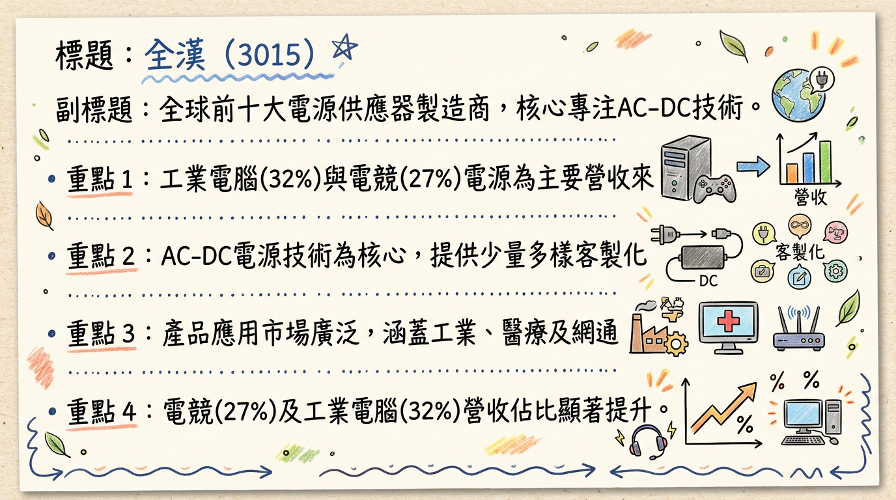
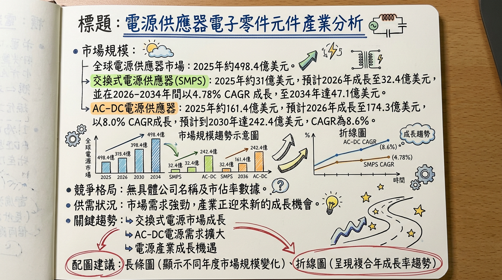
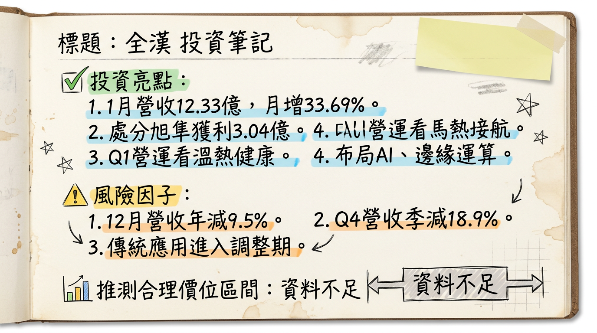

# 3015 全漢 深度研究報告

## 一句話摘要
全漢（3015）受惠於AI伺服器、邊緣運算及電競市場對高功率電源需求激增，並透過「少量多樣」客製化策略鎖定利基市場，儘管2025年面臨匯損與業外波動挑戰，但2026年1月營收表現強勁，且AI相關電源產品線持續升級，配合越南新廠擴建，預期營運將於AI應用和高功率趨勢中展現成長動能。

## 公司概覽
全漢企業（FSP Technology Inc.，3015）成立於1993年，為全球前十大交換式電源供應器製造商之一。公司核心技術專注於交流轉直流（AC to DC）電源供應器產品，以「少量多樣」的製造能力與客製化設計服務利基市場。

**主要產品線**：
工業電腦電源 (IPC PSU)、伺服器備援電源 (Redundant PSU)、醫療電源、網通電源 (5G PSU)、PC電源及電競電源、充電器、不斷電系統 (UPS)、太陽能逆變器 (PV Inverter) 及儲能系統 (ESS)。

**2025年前三季應用別營收結構**

| 應用領域         | 營收佔比 (2025年前三季) | 去年同期佔比 |
| :--------------- | :-------------------- | :----------- |
| 工業電腦 (IPC)   | 32%                   | 26%          |
| 電競 (Gaming)    | 27%                   | 19%          |
| PC               | 12%                   | -            |
| 雲端及邊緣運算   | 6%                    | -            |
| 網通             | 4%                    | -            |
| **合計 (部分)**  | **81%**               | -            |

**製造基地與銷售地區分佈**：
主要製造基地在中國（深圳、無錫、東莞）及台灣，並在越南建立第二座生產據點以分散地緣政治風險。
2025年前三季營收銷售地區分佈：其他地區 (RoW) 50%、歐洲 21%、美洲 20%、中國 9%。

## 核心競爭優勢
1.  **少量多樣與客製化能力**：具備為不同應用、不同批量的客戶提供客製化且可靠的電源解決方案的能力，服務大型電源供應商較難兼顧的利基市場。
2.  **多元產品線與高瓦數電源研發**：產品涵蓋工業、伺服器、醫療、網通、電競等多元領域，並積極拓展2500瓦至3000瓦甚至6000瓦以上的高功率電源，符合AI時代對高功率、高效率電源的需求。
3.  **地緣政治風險分散**：於越南建立第二生產據點，提升供應鏈韌性。
4.  **綠能與儲能佈局**：在太陽能逆變器及儲能系統領域的佈局，符合全球能源轉型趨勢。

## 財務分析

### 月營收趨勢
| 月份      | 金額 (億元) | 月增率 MoM | 年增率 YoY |
| :-------- | :---------- | :--------- | :--------- |
| 2026年1月 | 12.33       | +33.69%    | +23.12%    |
| 2025年12月 | 9.22        | -2.43%     | -9.48%     |
| 2025年11月 | 9.45        | -3.4%      | +2.79%     |
| 2025年10月 | 9.78        | -20.34%    | +4.62%     |
| 2025年9月 | 12.28       | +14.66%    | +17.65%    |
| 2025年8月 | 10.71       | -10.41%    | -3.42%     |
| 2026年2月 | (待公布)    | (待公布)   | (待公布)   |

**營收亮點**：2026年1月營收達12.33億元，創2025年6月以來新高，年/月雙增顯示營運動能回升。儘管2025年第四季受傳統應用調整影響，月營收呈現波動與下滑，但2026年開年表現強勁。

### 季度數據
*   **2025年第四季營收**：28.45億元，季減18.9%，年減2.8%。
*   **2025年第三季EPS**：1.18元，季增490%，年增23%，主要受惠於股利收入挹注。
*   **2025年前三季累計營收**：102.1億元，年增17%。
*   **2025年前三季累計毛利率**：17%。
*   **2025年前三季累計營業利益率**：2%。
*   **2025年前三季累計EPS**：1.58元。

### 年度趨勢
*   **2024年實際營收**：116億元。
*   **2024年實際EPS**：2.16元。
*   **2025年實際營收**：130.6億元，年增12.58%。
*   **2025年預估EPS**：法人機構平均預估約1.5至1.8元之間。

## 法說會重點
全漢於2025年12月18日舉行線上法說會，重點摘要如下：
*   **2026年第一季營運展望**：公司預期「溫熱但健康」，市場需求健康，訂單能見度已達三月。主要成長動能來自適配器與冗餘電源產品，邊緣伺服器相關專案持續開發中。
*   **AI應用佈局**：持續鎖定人工智慧工作站、邊緣運算、邊緣伺服器及AI伺服器電源等應用場域。電源產品瓦數規格將從目前的2500瓦逐步拓展至3000瓦甚至6000瓦以上。
*   **NVIDIA MGX平台**：輝達（NVIDIA）將CPRS（Common Redundant Power Supply）納為MGX平台電源標準，全漢已佈局完整產品線。
*   **電競與醫療新品**：電競業務受NVIDIA RTX 5090系列晶片推出激勵，預期帶動電競電源瓦特數提升及換機潮。新開發功率超過1200W高功率醫療級電源。
*   **整合電池電源**：開發內建電池的電源產品（如整合電池的適配器及ATX電源），應用於不容許斷電的精密設備，預計2026年第一季上市。
*   **網通新需求**：已看到網通客戶與AI相關測試設備的新應用需求。
*   **資料中心需求**：部分非美系資料中心客戶已完成廠房建置，正進入設備填充階段，有望帶來新一波需求。
*   **潛在風險提示**：管理層點出客戶端可能存在重複下單（overbooking）的情況，以及近期DRAM記憶體價格急漲可能對終端系統銷售與拉貨節奏造成影響。

## 券商觀點

### 目標價表格
| 券商名稱   | 目標價 (新台幣) | 評等     | 日期       |
| :--------- | :-------------- | :------- | :--------- |
| 康和證券   | 63元            | 未提供   | 2025/10/22 |

### 2025-2026年EPS預估
*   康和證券預估2025年度EPS約1.61元（2025年10月22日）。
*   法人機構平均預估2025年度稅後純益將落在3.2億元，預估EPS約1.61~1.8元（截至2025年12月營收公告）。
*   法人機構平均預估2025年度稅後純益將落在2.9億元，預估EPS約1.5~1.61元（截至2025年11月營收公告）。
*   目前未找到券商對2026年EPS的具體預估數字。

## 財報深度分析

### 利潤率趨勢
| 季度     | 毛利率    | 營業利益率 | 稅後淨利率 |
| :------- | :-------- | :--------- | :--------- |
| 2025年Q3 | 17.22%    | -0.17%     | 6.60%      |
| 2025年Q2 | 17.36%    | 3.78%      | 1.05%      |
| 2025年Q1 | 17.58%    | 0.71%      | 1.55%      |
| 2024年Q4 | 16.07%    | -1.32%     | 1.29%      |
| 2024年Q3 | 17.90%    | 1.22%      | 6.08%      |
| 2024年Q2 | 18.67%    | 1.87%      | 3.03%      |
| 2024年Q1 | 17.04%    | -0.20%     | 4.55%      |

**利潤率變化分析**：
全漢的毛利率在2024年Q2達到高峰18.67%後，於2024年Q4回落至16.07%，顯示成本壓力或產品組合變化。進入2025年，毛利率逐漸回升並穩定在17%以上。營業利益率波動較大，2025年Q3因營收結構變化及費用控制，雖營業利益率轉負，但稅後淨利率受惠於業外股利收入而大幅提升至6.60%，顯示業外收益對其獲利穩定性影響顯著。2025上半年因新台幣匯兌損失1.11億元，侵蝕本業獲利。

### 存貨與營運
| 季度     | 存貨週轉天數 | 應收帳款週轉天數 |
| :------- | :----------- | :--------------- |
| 2025年Q3 | 69.48天      | 103.43天         |
| 2025年Q2 | 64.35天      | 85.85天          |
| 2025年Q1 | 78.21天      | 96.19天          |
| 2024年Q4 | 77.17天      | 101.95天         |
| 2024年Q3 | 69.42天      | 95.44天          |
| 2024年Q2 | 78.77天      | 96.62天          |
| 2024年Q1 | 93.66天      | 96.84天          |

**存貨與應收帳款分析**：
存貨週轉天數在2024年Q1達到93.66天高點後持續改善，至2025年Q2降至64.35天，顯示存貨管理效率有所提升。應收帳款週轉天數則在85至103天間波動，2025年Q3有所上升，可能反映部分客戶拉貨延遲或信用期調整，需持續關注。目前無明確資料指出有異常堆積或備料現象。

### 資本支出
*   **折舊攤銷**：2025年Q3折舊為102,084千元，攤銷為4,240千元。
*   **未來資本支出計畫**：全漢近年於越南投資建立第二座生產據點，以因應地緣政治並分散產地。此外，產品線從2500瓦逐步拓展至3000瓦甚至6000瓦以上，亦代表在高瓦數產品開發與生產設備上持續投入。

## 股權異動

*   **董監事/大股東申報轉讓紀錄**：
    *   2025年8月11日：法人董事代表人王宗舜申報轉讓1,346.42張，轉讓後持股比率約下降至1.14%。
    *   2025年8月8日：法人董事代表人陳光俊以盤後定價交易方式轉讓100張。
    *   2024年9月26日：法人董事代表人王宗舜申報轉讓1,116張。
*   **庫藏股/可轉債/增減資**：未找到2024-2026年期間的庫藏股買回、發行可轉換公司債、現金增資或減資計畫。
*   **股利政策**：
    *   2025年：預計發放現金股利3.0元 (2024年度股利)。
    *   2024年：發放現金股利3.2元 (2023年度股利)。

### 其他財報重點
*   **負債比率**：2025年Q3為33.97%，較2024年Q3的24.36%有所上升。
*   **自由現金流量**：在2024年上半年為負值，下半年轉正，2024年Q3達543,868千元高峰。2025年Q1、Q2維持正值，但Q3降至24,279千元，顯示現金流入波動。
*   **業外收支**：對全漢的稅前淨利影響波動較大，2025年Q3業外收支佔稅前淨利比高達102.14%，其中股利收入2.06億元是單季獲利重要支撐。全漢持有旭準（6409）3,059張股票（持股3.49%）及上萬張佳必琪股票，業外投資收益是其獲利來源之一。

## 產業分析

### 市場規模與成長率
| 市場類別                      | 2025年市場規模 (預估) | 2026年市場規模 (預估) | CAGR (2026-203X) | 203X年市場規模 (預估) |
| :---------------------------- | :-------------------- | :-------------------- | :--------------- | :-------------------- |
| 交換式電源供應器 (SMPS)      | 31億美元              | 32.4-32.5億美元       | 4.78%-5%         | 47-47.1億美元 (至2033/34) |
| AC-DC 電源供應器             | 161.4億美元           | 174.3-239.2億美元     | 7.4%-8.6%        | 242.4-372.1億美元 (至2030/32) |
| 整體電源供應器市場           | 498.4-500億美元       | -                     | 6%-7%            | 686.4-850億美元 (至2033) |
| 工業電源供應器市場           | 90億美元              | -                     | 9.6%             | 226億美元 (至2035) |

**供需狀況**：
AI資料中心擴建、5G通訊及邊緣運算領域的興起，特別是AI伺服器對高功耗電源需求激增，導致AI電源產能持續緊張，超大型雲端服務商(CSP)甚至已規劃2029年產能需求，局部呈現供不應求。同時，備援電池模組(BBU)市場因AI伺服器需求，預計2026年成長50%以上。

**產業平均毛利率水準**：
目前未找到2025-2026年電源供應器產業的平均毛利率水準的最新公開資料。然而，AI業務的高單價與高毛利特性，對公司整體毛利率有顯著提升作用，例如台達電在AI產品組合優化下，2025年毛利率攀升至34.3%。

### 競爭格局
**全球前5大公司及其市佔率 (2025年估計)**

| 公司名稱           | 市佔率 (2025年) | 主要業務領域                      |
| :----------------- | :-------------- | :-------------------------------- |
| Delta Electronics (台達電) | 27.1%           | 伺服器電源、AI電源、液冷散熱、充電樁、工業自動化 |
| TDK-Lambda         | 19.5%           | 工業電源、醫療電源                  |
| Sungrow Power Supply (陽光電源) | 17.6%           | 太陽能逆變器、儲能系統              |
| LITEON (光寶科)    | 13.2%           | AI伺服器電源、BBU備援電池模組、網通電源 |
| MEAN WELL (明緯)   | 8.5%            | 工業電源、醫療電源、LED驅動電源     |

**全漢 vs 主要競爭對手比較**
| 特點     | 全漢 (3015)                                    | 台達電 (2308)                                  | 光寶科 (2301)                                    |
| :------- | :--------------------------------------------- | :--------------------------------------------- | :----------------------------------------------- |
| **核心技術** | 專注AC-DC轉換，少量多樣與客製化設計。產品線廣泛。 | HVDC架構、800V高壓平台、SiC/GaN、液冷散熱領先。 | AI伺服器電源、BBU備援電池模組技術領先。        |
| **產能** | 全球前十大製造商，越南建新廠分散風險。         | AI電源產能持續吃緊，規劃2029年產能，泰國產線轉移。 | AI電源產能吃緊，BBU預計2026年增50%，擴廠30%。 |
| **客戶** | 未具體披露，主要服務利基市場。                 | 掌握三大美系Tier-1 CSP客戶，液對氣Sidecar市占逾50%。 | 打入新美系超大雲端客戶。                         |
| **價格** | 未具體披露價格策略，客製化產品有溢價空間。     | AI電源ASP突破長期區間，因高功率密度與SiC/GaN搭載。 | AI電源ASP提升。                                  |

**台灣同業比較**
*   **台達電 (2308)**：2025年全年營收5548.85億元，年增31.75%；EPS 23.14元，毛利率34.3%創歷史新高。在AI電源市場具絕對領先地位。
*   **光寶科 (2301)**：雖未提供最新詳細數據，但在AI伺服器電源和BBU領域積極擴產，是重要的AI電源供應商。
*   **全漢 (3015)**：2025年營收130.6億元，年增12.58%；前三季毛利率17%，EPS 1.58元。相較兩大龍頭，全漢營收規模較小，毛利率水準有提升空間，但透過客製化和利基市場策略，在特定領域仍具競爭力。

### 產業趨勢
1.  **高功率密度與高能效需求 (HVDC, 800V架構, SiC/GaN)**：AI伺服器功耗激增推動電源供應器功率密度與能效需求，轉向HVDC、800V高壓平台，並廣泛採用SiC/GaN等寬能隙半導體材料。這將提升電源ASP與技術門檻。
2.  **液冷散熱解決方案的普及**：AI晶片高TDP使液冷成為資料中心趨勢，電源供應器需配合提供液冷相關解決方案，改變設計與封裝，帶來新市場機會。
3.  **備援電池模組（BBU）應用增加**：在HVDC架構全面導入前，BBU是解決AI資料中心電力穩定性的關鍵短期方案，市場需求預計2026年大幅成長。

**對全漢的機會與威脅**
*   **機會**：受益於AI與資料中心對高能效、高功率電源的強勁需求；5G網通與邊緣運算發展；再生能源與儲能系統市場成長；醫療電源市場穩健需求；客製化能力有助於深耕利基市場。
*   **威脅**：產業技術快速迭代壓力（如HVDC、800V、SiC/GaN）；市場集中度高，台達電、光寶科等大廠競爭激烈；產能擴張與成本控制挑戰；地緣政治風險影響供應鏈。

**相關投資題材連結**
*   **AI (人工智慧)**：AI伺服器、邊緣運算和資料中心是最大驅動力，全漢的伺服器備援電源、工業電腦電源和高瓦數電源產品直接受益。
*   **HBM (高頻寬記憶體)**：間接推動AI伺服器功耗增加，提升對電源供應器電力輸出與穩定性要求。
*   **儲能系統 (ESS) 與再生能源**：全漢的太陽能逆變器和儲能系統受惠於全球清潔能源和電網穩定性需求。
*   **5G基礎設施**：網通電源（5G PSU）受益於全球5G網路部署和擴張。

## 近期催化劑

*   **2026年02月09日 (利多)**：公布2026年1月合併營收12.33億元，月增33.69%，年增23.12%，創近8個月新高。
*   **2026年01月15日 (利多)**：公告處分不斷電系統（UPS）廠旭隼（6409）普通股244張，累計處分利益約3.04億元，預計於2026年第一季財報認列為業外收益。
*   **2026年01月14日 (利空/利多參半)**：公布2025年合併營收130.6億元，年增12.58%，創近二年新高。然而，2025年12月營收9.22億元，月減2.4%、年減9.5%，為10個月以來新低；第四季營收28.45億元，季減18.9%、年減2.8%，為七季低點，反映部分傳統應用進入調整期。
*   **2026年01月07日 (利多)**：管理層預期2026年第一季營運表現「溫熱但健康」，主要成長動能來自適配器與冗餘電源產品，邊緣伺服器相關專案持續開發。
*   **2025年12月18日 (利多)**：法說會指出，產品線將從2500瓦逐步拓展至3000瓦甚至6000瓦以上規格，聚焦AI、邊緣運算、工控、醫療等六大應用。
*   **2025年12月22日 (利多/利空參半)**：法說會備忘錄更新，2025年前三季累計營收102.1億元，年增17%；第三季EPS 1.18元，主要受股利收入挹注。但也點出客戶重複下單及DRAM漲價風險。
*   **2025年09月24日 (利多)**：法人預期2025年營收有望年增逾一成，主因網通及工業電腦需求回溫。第三季因匯率回穩及業外轉投資股利貢獻（旭隼、佳必琪），預估EPS有望超過1元。
*   **外資/投信近期買賣超 (截至2026年03月04日)**：外資近20日合計買超988張；投信近20日合計賣超74張；自營商近20日合計賣超17張。外資持股比重8.97%。

## ⭐ 成長動能時間軸

| 時間/狀態       | 成長動能                                   | 具體描述                                                           |
| :-------------- | :----------------------------------------- | :----------------------------------------------------------------- |
| **持續進行中**  | **AI與高功率電源應用拓展**                 | 積極鎖定人工智慧工作站、邊緣運算、邊緣伺服器、AI伺服器電源等應用場域。 |
| **持續進行中**  | **產品瓦數升級**                           | 電源產品線從目前2500瓦逐步拓展至3000瓦甚至6000瓦以上規格。         |
| **持續進行中**  | **NVIDIA MGX平台標準導入**               | 全漢已佈局完整CPRS（Common Redundant Power Supply）產品線。      |
| **持續進行中**  | **電競應用瓦數提升與換機潮**               | 受輝達RTX 5090系列晶片推出激勵。                                   |
| **持續進行中**  | **網通與AI相關測試設備需求**               | 已觀察到新應用需求。                                               |
| **持續進行中**  | **非美系資料中心設備填充**                 | 部分客戶已完成廠房建置，將進入設備填充階段，帶來新需求。           |
| **持續進行中**  | **工業電腦需求回溫**                       | 推升相關產品銷售。                                                 |
| **持續進行中**  | **越南第二生產據點建置**                   | 因應地緣政治風險，分散產地。具體完工/量產時間未明確。              |
| **2026年第一季** | **整合電池的儲能型電源產品上市**           | 鎖定資料保存與高可靠度設備應用。                                   |
| **2026年第一季** | **2500W電源產品訂單能見度**                | 已完成量產，訂單能見度延伸至2026年第一季。                         |

## 2026 展望

**成長動能**：
1.  **AI應用電源需求爆發**：AI伺服器、邊緣運算等領域對高功率、高能效電源的強勁需求，推動全漢高瓦數電源產品（3000W-6000W+）的成長。
2.  **新產品線推出**：整合電池的儲能型電源產品預計2026年第一季上市，將開拓新市場。
3.  **地緣分散策略奏效**：越南新廠的產能若能有效開出，將提升供應鏈韌性，並有助於爭取新訂單。
4.  **電競與工控市場回溫**：電競晶片升級帶動換機潮，工業電腦需求持續回溫，為傳統主力業務注入動能。
5.  **業外收益穩定貢獻**：持有旭準、佳必琪等優質股權，可望持續提供穩定的股利收入。

**風險**：
1.  **客戶端重複下單 (Overbooking)**：管理層提醒此風險，若重複下單導致後續訂單修正，可能影響營收成長。
2.  **DRAM記憶體價格急漲**：可能影響終端系統銷售與拉貨節奏，進而影響電源供應器需求。
3.  **總體經濟不確定性**：全球經濟放緩或地緣政治緊張可能影響企業資本支出，進而壓抑電源供應器需求。
4.  **匯率波動**：新台幣對美元匯率變動可能產生業外匯兌損益，影響獲利。
5.  **競爭加劇**：電源供應器產業巨頭如台達電、光寶科在AI電源領域持續擴張，全漢面臨的市場競爭壓力不減。

## 投資結論
全漢（3015）受惠於全球AI、邊緣運算和電競市場對高功率電源的結構性需求增長，並以其客製化及少量多樣的競爭優勢，成功卡位利基市場。儘管2025年受到匯損影響使獲利承壓，但2026年1月營收表現已展現強勁復甦動能，且高瓦數電源產品線的佈局與越南新廠的進度，將是未來營運成長的關鍵。

1.  **AI與高功率趨勢受惠者**：全漢在高瓦數電源產品的積極佈局，使其能直接受惠於AI伺服器與邊緣運算帶動的高功率電源需求浪潮，提升產品ASP與毛利率。
2.  **營收動能重啟**：2026年1月營收表現亮眼，顯示公司已走出2025年第四季的調整期，並在AI相關訂單帶動下，有望恢復成長軌道。
3.  **穩健的業外收益**：對旭準、佳必琪等轉投資的股利收入，能為公司提供穩定的獲利基礎，有助於平穩本業獲利波動。
4.  **供應鏈韌性提升**：越南新廠的建設將降低對單一製造基地的依賴，提升供應鏈彈性及因應地緣政治風險的能力。
5.  **估值合理區間**：考量公司在AI趨勢下的成長潛力，以及其客製化服務的利基優勢，我們認為全漢在克服短期逆風後，成長性可期。參考法人平均預估2025年EPS約1.6-1.8元，若2026年AI業務能如期貢獻，EPS有望向上。給予2026年預估本益比18-22倍，**建議目標價區間為 55-65 元**。

本報告由 AI 自動產生，資料來源為公開網路資訊，僅供參考，不構成投資建議。產生時間：2026-03-06 14:00

---

## 📊 資訊卡

