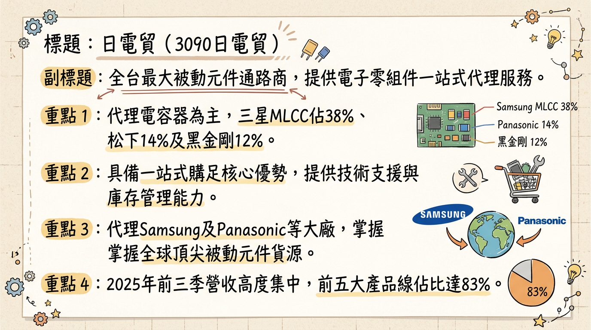
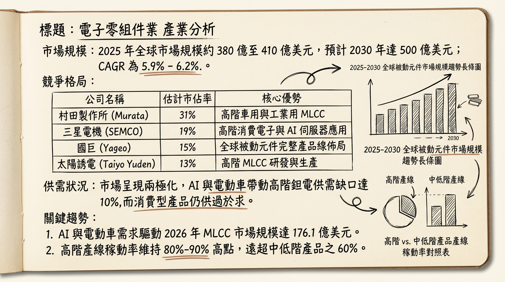
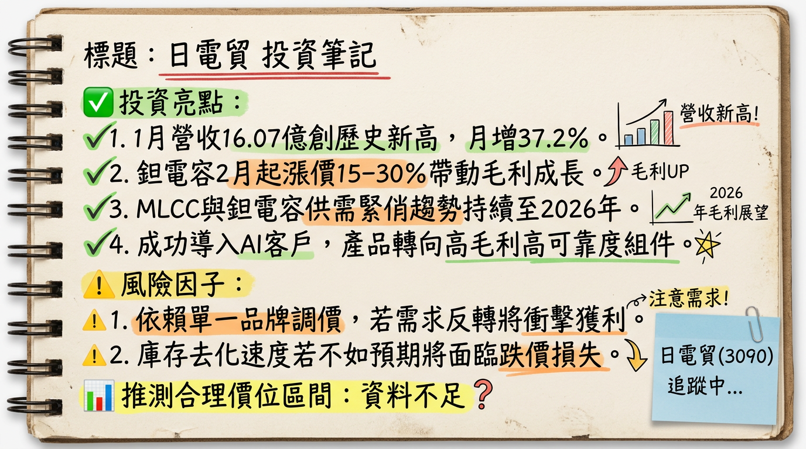

# 3090 日電貿 (Nichidenbo) 深度研究報告

## 一句話摘要
**受惠 AI 伺服器規格升級與高階鉭電容漲價潮，日電貿作為全台最大被動元件通路商，正進入「量價齊揚」的獲利爆發期。**

---

## 公司概覽
日電貿（3090）成立於 1993 年，為台灣規模最大的被動元件代理通路商。其核心價值在於代理全球頂尖品牌（如 Samsung、Panasonic、KEMET 等）之高階元件，並提供一站式技術支援與供應鏈管理。

### 業務營收結構（2025 年底法說會數據）
| 代理品牌 / 產品線 | 營收佔比 | 核心應用領域 |
| :--- | :--- | :--- |
| **Samsung (三星電機) MLCC** | 38% | AI 伺服器、智慧型手機、車用 |
| **Panasonic 高分子固態電容** | 14% | 筆電、伺服器電源、工業控制 |
| **Nippon Chemi-Con 鋁質電解電容** | 12% | 充電樁、通訊設備、家電 |
| **KEMET (基美) 高分子鉭質電容** | 11% | AI 加速器、高端 ASIC、航太 |
| **Kyocera AVX MLCC/鉭電** | 8% | 車用電子、5G 基礎建設 |
| **其他及自有品牌 (KTS, UWA)** | 17% | 感測元件、光電元件、電感電阻 |

---

## 核心競爭優勢
1.  **高階代理權壁壘：** 掌握日、韓大廠高階元件代理（Samsung 與 Panasonic 佔比合計過半），在 AI 伺服器所需的高容值 MLCC 與鉭電容市場具壟斷性優勢。
2.  **文曄戰略結盟：** 2025 年 10 月與全球半導體通路大廠文曄（3036）完成換股，日電貿獲得全球通路支援，並切入更多國際一線 CSP 客戶。
3.  **庫存管理能力：** 於 2025 年底精準布局低價鉭電容庫存，成功對接 2026 年初的漲價潮。

---

## 財務分析

### 月營收趨勢表格（最近 6 個月）
| 月份 | 營收金額 (百萬元) | 月增率 MoM | 年增率 YoY | 狀態說明 |
| :--- | :--- | :--- | :--- | :--- |
| **2026/01** | 1,607 | +37.19% | +13.06% | **創單月歷史新高**，AI 拉貨強勁 |
| **2025/12** | 1,171 | -8.74% | +30.92% | 年底庫存調整，但 YoY 顯著增長 |
| **2025/11** | 1,283 | -5.68% | +15.38% | 換股後股本擴大，營收維持高位 |
| **2025/10** | 1,361 | -3.59% | +18.67% | 傳統旺季尾聲，伺服器需求支撐 |
| **2025/09** | 1,411 | +2.16% | +32.80% | 單季歷史次高，AI 佔比突破 18% |
| **2025/08** | 1,382 | +9.87% | +22.82% | 需求回溫，庫存周轉加速 |

### 季度數據摘要（2025 Q3）
*   **單季 EPS：** 1.97 元（YoY +60.67%）。
*   **累計前三季 EPS：** 4.21 元（2024 全年僅 4.52 元，顯示成長顯著）。
*   **毛利率：** 15.97%（受惠高毛利 AI 產品組合）。

---

## 法說會重點（2025/12/08 摘要）
*   **管理層 Guidance：** 總經理于耀國指出，AI 伺服器對 MLCC 與鉭電容的需求量是傳統伺服器的 **10 倍** 以上。預期 2026 年高階元件供需缺口仍達 **10%**。
*   **漲價確認：** 證實代理品牌 Panasonic 於 2026/02 起調漲鉭電容報價 **15%-30%**。
*   **海外佈局：** 積極擴充泰國、越南與印度據點，應對地緣政治下的供應鏈移轉需求。

---

## 券商觀點（目標價表格）
| 券商名稱 | 評等 | 目標價 | 2026 EPS 預估 | 報告日期 |
| :--- | :--- | :--- | :--- | :--- |
| **康和證券** | 看多 | **115 元** | 6.45 元 | 2025/12/11 |
| **兆豐投顧** | 看多 | **111 元** | 5.80 元 | 2025/12/10 |
| **法人分析師** | 中性偏多 | **104.6 元** | 6.54 元 | 2025/11/08 |

---

## 財報深度分析

### 利潤率趨勢表格
| 季度指標 | 2025 Q3 | 2025 Q2 | 2025 Q1 | 2024 Q4 |
| :--- | :--- | :--- | :--- | :--- |
| **毛利率 (%)** | 15.97% | 14.48% | 15.52% | 14.90% |
| **營業利益率 (%)** | 9.34% | 9.12% | 8.85% | 8.20% |
| **存貨週轉天數** | 55.76 天 | 54.20 天 | 67.31 天 | 75.61 天 |

*   **存貨分析：** 存貨天數由 2024 年底的 75.6 天顯著降至 55.7 天，顯示去庫存完全結束，轉為健康的備貨循環。
*   **資本支出：** 2025 Q3 單季約 1,449 萬元，主要用於數位倉儲系統升級及東南亞分支機構。

---

## 股權異動與資本結構
1.  **股本擴增：** 2025/10/01 與文曄完成換股，2025/11/07 增資股上市，資本額增至 **28.75 億元**。此舉短期會稀釋 EPS，但長期強化通路競爭力。
2.  **大股東申報：** 2025 年 9 月多位經理人將持股轉入限制型股票信託專戶，顯示管理層與公司長期利益綁定。
3.  **股利政策：** 2025 年配息 4.2 元（配發率 93%），殖利率長期穩定維持在市場高標。

---

## 產業分析

### 競爭格局比較表格（2025 全年估計數據）
| 公司名稱 | 主要核心業務 | 2025 估計毛利率 | AI 營收佔比預估 | 優勢短評 |
| :--- | :--- | :--- | :--- | :--- |
| **日電貿 (3090)** | 被動元件通路 | 15.5% - 16% | 20% - 25% | 全台最大，代理日韓頂尖品牌 |
| **增你強 (3028)** | 半導體/零組件 | 7% - 8% | <10% | 產品線雜，毛利較低 |
| **蜜望實 (8043)** | 太陽誘電代理 | 11% - 12% | 40% | 代理線單一，AI 彈性大但風險高 |

---

## 近期催化劑
*   **利多：** 2026/02 鉭質電容正式生效的 **15%-30% 漲價** 效益。
*   **利多：** NVIDIA GB200/300 伺服器量產，帶動 01005 規格 MLCC 需求爆發。
*   **利空：** 2026 H1 若 HBM 記憶體缺貨，可能拖累伺服器出貨天數，間接影響零件拉貨。

---

## ⭐ 成長動能時間軸
*   **2025 Q4：** 完成與文曄股權交換，確立全球通路擴張戰略。
*   **2026 Q1：** 1 月營收創歷史新高（16.07 億元）；2 月起受惠 Panasonic 漲價效益。
*   **2026 Q2：** 實體 AI（Embodied AI）與人形機器人新客戶導入，高階感測電容開始出貨。
*   **2026 H2：** 東南亞（泰國、越南）物流中心完工，服務區域延伸至印度市場。

---

## 2026 展望
**成長動能：** AI 伺服器規格由 GPU 轉向 ASIC 雙軌發展，帶動特製化電容需求。預估 2026 年 AI 相關營收佔比將突破 **25%**。
**風險因子：** 台幣匯率波動（2025 Q2 曾出現 1.79 億元匯損）；美對中貿易關稅變動對 ODM 廠產地轉移的影響。

---

## 投資結論
1.  **獲利跳升：** 預估 2025 全年 EPS 落在 **5.5 - 6.0 元**，2026 年受惠漲價與 AI 滲透率提升，EPS 有望挑戰 **6.54 元**。
2.  **評價回升：** 歷史本益比（PE）區間約 12-18 倍，目前處於中低水位，具備上修空間。
3.  **高殖利率支撐：** 穩定 90% 以上的配發率，提供良好的下檔防禦。
4.  **建議目標價區間：** **105 - 115 元**，分批佈局。

---
本報告由 AI 自動產生，資料來源為公開網路資訊，僅供參考，不構成投資建議。
產生時間：2026-03-01 21:33

---

## 📊 資訊卡

