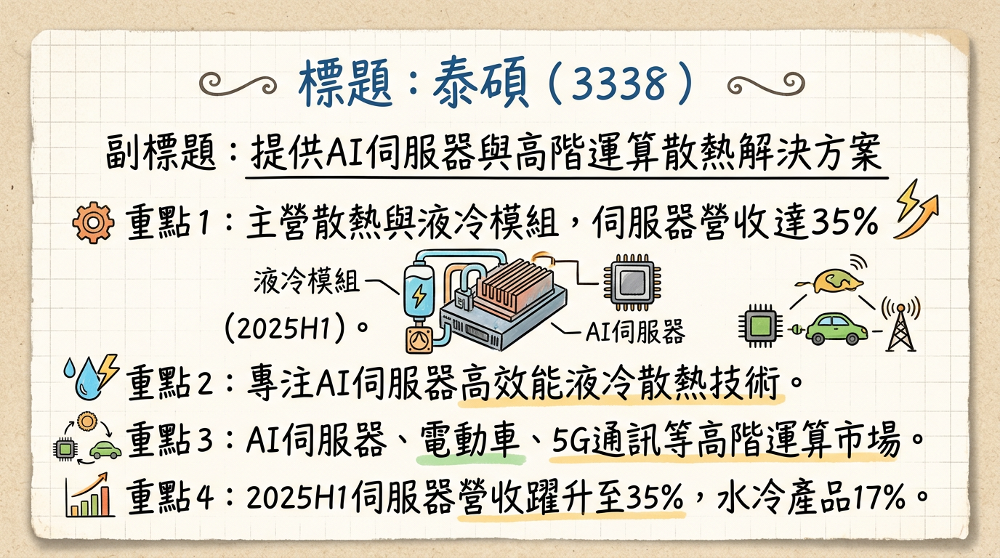
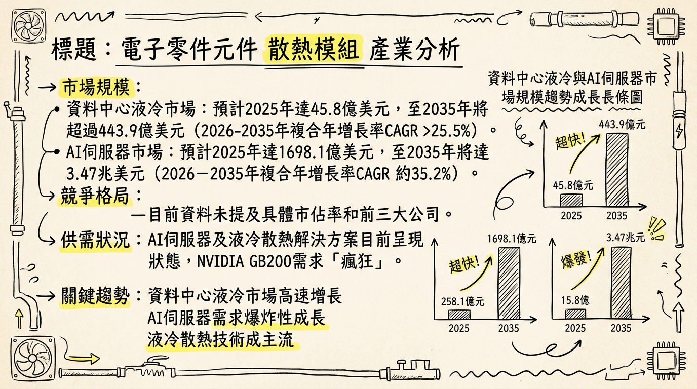
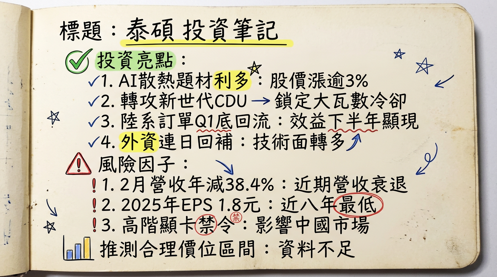

# 3338 泰碩 深度研究報告

**今天日期：2026年03月06日**

## 一句話摘要

泰碩（3338）正積極轉型為AI伺服器液冷散熱解決方案供應商，2025年伺服器相關營收佔比已顯著提升至35%，水冷產品佔比達17%。儘管2025年面臨高階顯卡銷陸禁令與新廠佈局的短期營運壓力（2025年EPS 1.8元，年減40.46%），但受惠於120KW CDU量產、150KW開發中、泰國廠國際化佈局、以及中國與非一線CSP客戶訂單回流，預計2026年營運將重回成長軌道，AI液冷與電動車散熱將是主要成長動能。

## 公司概覽

泰碩電子主要從事散熱模組及電子電腦零組件的加工、製造及買賣業務，涵蓋電線電纜及汽機車零配件。其核心產品與服務聚焦於高效能熱傳導解決方案，尤其在AI伺服器與高階運算領域。

**核心產品與服務：**
*   **熱傳導解決方案**：高效能散熱產品，針對AI伺服器與高階運算。
*   **液冷散熱產品**：水冷板 (Cold Plate)、液冷模組 (LCM)、冷卻分配歧管 (CDM) 及冷卻分配單元 (CDU)。
*   **應用方案**：電動車、5G通訊、伺服器、手機、平板電腦、個人電腦、工業電腦、遊戲主機等。

**營收結構（2025年上半年 vs 2023年）：**

| 產品類別     | 2023年佔比 | 2025年上半年佔比 | 備註                                       |
| :----------- | :--------- | :--------------- | :----------------------------------------- |
| 伺服器相關   | 16%        | 35%              | 其中AI相關應用貢獻：CDM 6%, LCM 3%         |
| 水冷產品     | 8%         | 17%              | 包含於伺服器相關營收中                     |
| 電動車       | 12%        | 目標提升至20%    | 策略性聚焦高附加價值品項                   |
| 筆電 (NB)    | -          | 呈現調整         | 比重受伺服器業務提升影響                   |
| 桌機/一體機  | -          | 呈現調整         | 比重受伺服器業務提升影響                   |
| 通訊產品     | -          | 策略性減少       | 策略性減少低毛利產品比重                   |
| **總計**     | **100%**   | **100%**         | 營收結構正積極轉型，伺服器與水冷佔比顯著提升 |

**製造基地：**
*   **中國東莞廠**：散熱模組、連接器、讀卡機、5G設備。水冷板主要集中生產，月產能約3萬套，實際稼動約月產2萬套，未來可擴充至5萬套。
*   **中國蘇州廠**：散熱模組、超薄裝置散熱。
*   **中國泗陽廠**：5G應用、超薄裝置散熱。
*   **泰國廠**：積極佈局國際市場，已啟動量產，初期聚焦CPU模組，未來將擴展至CDU與LCM組裝。

## 核心競爭優勢

1.  **液冷散熱技術領先與產品全面佈局**：泰碩在AI伺服器液冷散熱領域具備從水冷板(Cold Plate)、液冷模組(LCM)、冷卻分配歧管(CDM)到冷卻分配單元(CDU)的完整解決方案。已量產120KW CDU，並積極開發150KW高階產品，技術實力追平國際水準，尤其在NVIDIA H20相關應用上表現突出。
2.  **高附加價值產品組合優化**：公司策略性減少低毛利車用與通訊產品比重，聚焦於高單價、高毛利的AI伺服器液冷散熱模組，有效提升整體產品組合的獲利能力。2025年上半年AI相關應用佔比已達伺服器營收的一半。
3.  **國際化與客戶拓展策略**：透過泰國廠佈局，有效因應地緣政治風險並擴大國際市場份額，瞄準美系與非一線CSP客戶。同時，與中國客戶（如抖音）建立深度合作，確保在大中華區市場的領先地位。
4.  **技術跨域應用能力**：將多年在電動車與軍規產品累積的密封與高可靠度技術，成功應用於高複雜度的AI伺服器水冷產品，確保產品品質與穩定性，降低新技術導入風險。

## 財務分析

### 月營收趨勢

| 月份    | 金額 (億元) | 月增率 (MoM) | 年增率 (YoY) |
| :------ | :---------- | :----------- | :----------- |
| 2026年02月 | 1.97        | -36.1%       | -38.42%      |
| 2026年01月 | 3.08        | +10.71%      | +9.64%       |
| 2025年12月 | 2.78        | -6.44%       | -15.45%      |
| 2025年11月 | 2.97        | +19.58%      | -11.14%      |
| 2025年10月 | 2.49        | -18.93%      | -13.82%      |
| 2025年09月 | 3.07        | +7.49%       | +4.01%       |

### 季度數據 (2025年第四季)

*   **季營收**：8.2376 億元，季減 6.7%，年減約 13.44%。
*   **毛利率**：21.43%。
*   **歸屬母公司稅後淨利**：3,058.8 萬元，季增 0.3%，年減約 61.64%。
*   **EPS**：0.36 元。

### 年度趨勢

*   **2025年全年**：
    *   **累計營收**：36.2101 億元，年減 3.54%。
    *   **累計歸屬母公司稅後淨利**：1.564 億元，年衰退 40.46%。
    *   **累計 EPS**：1.80 元，年衰退 40%。
*   **2024年全年**：
    *   **實際 EPS**：3.0 元。

## 法說會重點

**最近一次法說會日期：** 2025年08月18日 (⚠️已逾6個月，資訊可能部分過時)

*   **產品線具體 guidance**：
    *   **伺服器液冷散熱**：2025年Q1出貨持續放量，伺服器(含液冷散熱)營收佔比已達30%。上半年伺服器相關營收佔比達35% (2023年為16%)，水冷產品佔比達17% (2023年為8%)。
    *   **AI相關產品**：
        *   CDM (冷卻分配歧管)：2025年上半年營收佔比達6%，具高單價及優異毛利。
        *   LCM (液冷模組)：上半年成長3%。
        *   CDU (冷卻分配單元)：已量產30KW至120KW規格，150KW產品開發中，預計2025年Q4完成開發並通過客戶測試。120KW CDU預計2026年Q1小幅試產。
    *   **車用與通訊產品**：策略性減少低毛利產品比重，聚焦高附加價值品項。
*   **產能與資本支出**：泰國廠已啟動量產，初期聚焦CPU模組，未來將擴展至CDU與LCM組裝。泰國廠建置與引進水冷人才導致費用增加，此為戰略性支出。
*   **管理層下季/下半年 guidance**：
    *   **2025年Q2**：預估會比Q1好。
    *   **2025年下半年**：展望樂觀，主要動能來自AI散熱需求成長、產品組合優化、國際市場拓展。預期毛利率有機會回升至21%～22%。
    *   **2026年展望**：期望在AI伺服器有所進展，力拼營收重回成長，AI佔比可突破兩成。

## 券商觀點

目前未能找到2025-2026年來自至少3家券商的具體目標價、評等及對2025-2026年EPS的預估數字。市場普遍預期泰碩2025年全年EPS約落在1.7-2.0元區間。

| 券商名稱 | 目標價 (NTD) | 評等   | 日期       |
| :------- | :----------- | :----- | :--------- |
| **無具體數據** | -            | -      | -          |
| Investing.com (參考) | 估值過低     | -      | (未註明)   |

## 財報深度分析

### 利潤率趨勢

| 季度     | 毛利率    | 營業利益率 | 稅後淨利率 |
| :------- | :-------- | :--------- | :--------- |
| 2024 Q1  | 20.10%    | 5.41%      | 7.88%      |
| 2024 Q2  | 20.08%    | 6.85%      | 7.33%      |
| 2024 Q3  | 20.76%    | 6.80%      | 4.40%      |
| 2024 Q4  | 19.31%    | 4.64%      | 8.38%      |
| 2025 Q1  | 19.87%    | 5.91%      | 5.65%      |
| 2025 Q2  | 19.52%    | 4.98%      | 4.34%      |
| 2025 Q3  | 17.16%    | 3.15%      | 3.45%      |
| 2025 Q4  | 21.43%    | - (未提供) | 3.71%      |

**利潤率變化原因分析：**
2025年泰碩營運面臨挑戰，全年營收36.21億元，年減3.54%，稅後純益1.56億元，年減40.46%，EPS 1.8元，創近八年低點。2025年上半年營業淨利年減10%，稅前淨利大幅減少37%，本期淨利亦衰退32.9%，主因營業費用增速高於營收、營業外收入大幅銳減及Q2匯損影響。傳統NB、DT&AIO、車用和通訊等業務營收佔比下滑，顯示公司正處於產品轉型期。儘管2025年Q3毛利率一度下滑至17.16%，但Q4已回升至21.43%，顯示產品組合優化（聚焦高毛利AI散熱）與營運效率改善的努力開始見效。

### 存貨分析與資本支出

*   **資本支出與產能**：未找到2024-2026年具體的資本支出金額，但公司積極佈局泰國廠，並在2025年Q2法說會中提及新廠擴產計畫將於2025年Q3啟用，預計提升產能一倍。泰碩預計2026年Q1小幅試產120kW CDU，若順利量產，將有助於拓展新客戶並達成2026年營收重回年增、伺服器應用佔比提升至30%～40%的目標。
*   **折舊攤銷趨勢**：未找到2024-2026年折舊攤銷趨勢資料。
*   **存貨與營運**：未找到2024-2026年的最新存貨金額、存貨週轉天數、應收帳款週轉天數趨勢，以及存貨是否有異常堆積或備料現象的具體資訊。

## 股權異動

*   **董監事/大股東申報轉讓紀錄**：未找到2024-2026年泰碩董監事或大股東申報轉讓紀錄。
*   **庫藏股買回紀錄**：未找到2024-2026年泰碩庫藏股買回紀錄。
*   **發行可轉換公司債 (CB)**：未找到2024-2026年泰碩發行可轉換公司債的資訊。
*   **現金增資或減資計畫**：未找到2024-2026年泰碩的現金增資或減資計畫。
*   **股利政策**：董事會於2026年3月4日決議，針對2025年度擬配發現金股利1.3元，配發率為72.22％。

## 產業分析

### 市場規模與供需

*   **全球市場規模**：
    *   **資料中心液冷市場**：預計2025年達45.8億美元，2035年超過443.9億美元，2026-2035年CAGR超過25.5%。
    *   **資料中心主動式液體冷卻系統**：預計2025年達48.9億美元，2026年達56.1億美元，2032年達108.4億美元，CAGR為12.02%。
    *   **AI伺服器市場**：預計2025年達1698.1億美元，2035年達3.47兆美元，2026-2035年CAGR約35.2%。另有預估2025年達3,000億美元，年增46.1%。
*   **供需狀況**：目前AI伺服器及液冷散熱解決方案呈現**供不應求**。NVIDIA執行長黃仁勳表示GB200 AI伺服器需求「瘋狂」。AI資料中心液冷技術採用率預計從2024年的14%急劇增長至2025年的33%，並持續增長。
*   **產業平均毛利率**：
    *   **泰碩 (3338)**：2025年上半年20%，預期2025年下半年回升至21%～22%。
    *   **雙鴻 (3324)**：2025年Q3達29.77%。
    *   **奇鋐 (3017)**：法人看好2026年上半年將顯著跳升至28%～29%。

### 競爭格局

**全球主要冷板 (Cold Plate) 供應商提及**：Cooler Master、AVC、BOYD、Auras。未找到全球前五大散熱模組公司的具體市佔率數據。

**泰碩 vs 主要競爭對手比較 (台灣同業)**

| 比較項目 | 泰碩 (3338) | 雙鴻 (3324) | 奇鋐 (3017) | 健策 (3653) |
| :------- | :---------- | :---------- | :---------- | :---------- |
| **技術** | 熱傳導解決方案 (AI伺服器、高階運算)；液冷產品 (水冷板、液冷模組、CDM、CDU)；液對液 (L2L) 與液對氣 (L2A) 混合式冷卻系統；42U整機櫃液冷模組；120KW CDU已量產，150KW開發中；技術領先，尤其NVIDIA H20相關應用；軍規與車規高標準技術移植至AI伺服器水冷。 | 提供直接式液冷與浸沒式液冷兩大架構，液冷整機系統解決方案供應商 (水冷板、櫃/機箱分歧管、水對氣或水對水的冷卻分配裝置)；具備客製化製造與模組整合能力；積極布局微通道水冷板技術。 | GB300伺服器的主要水冷供應商之一；Microsoft、Oracle等美系大廠的Cold Plate與CDM供應鏈中佔有重要地位；預計2026年將銜接Google TPUv8水冷產品放量。 | NVIDIA GPU均熱片的唯一供應商，技術領先同業；掌握規格升級帶來的漲價紅利；布局微通道蓋板（MCL）產品。 |
| **產能** | 泰國廠已啟動量產，初期聚焦CPU模組，未來擴展至CDU與LCM組裝；水冷板與分歧管產能擴大，CDU產線擴展。 | 泰國新產能開出，供給能力顯著提升。 | 受惠於GB300動能，新產品量產時程已排定。 | - (未明確提及產能擴張，但預計未來兩年營收爆發性成長)。 |
| **客戶** | 現有客戶以台系及陸系為主，涵蓋伺服器大廠如NVIDIA、Intel、AMD等；120KW CDU主要針對台系系統廠需求，未來將透過高階產品切入美系客戶；抖音水冷散熱產品獨家供應商；比亞迪供應商之一。 | 握有美系雲端客戶AISC訂單；進一步切入其他雲端服務供應商與客製化ASIC平台。 | AWS、Microsoft、Oracle等美系大廠。 | NVIDIA GPU均熱片唯一供應商；Google (TPU)、AWS (Trainium)、Meta (MTIA)自研晶片。 |
| **價格** | 業界預估液冷滲透率提升將大幅拉高散熱產品單價（ASP）。 | 液冷產品屬於高毛利。 | 高單價、高毛利的水冷伺服器產品比重持續提升。 | 均熱片單價將較G200/300成長數倍。 |

**台灣同業財務比較 (2025年上半年數據為主，部分為年度或預估)**

| 公司名稱 | 2025年上半年營收 (億元) | 2025年上半年毛利率 | 2025年上半年EPS (元) | 2025年全年EPS (預估/實際) (元) | 2026年全年EPS (預估) (元) |
| :------- | :------------------ | :---------------- | :------------------ | :----------------------------- | :-------------------------- |
| 泰碩 (3338) | 19.14               | 20%               | 1.09                | 1.80 (實際)                    | 約5                          |
| 雙鴻 (3324) | - (未提供)          | 27.38% (全年)     | - (未提供)          | 28.26 (實際)                   | 51.91 或 57.5               |
| 奇鋐 (3017) | - (未提供)          | 預估28-29% (2026H1) | 32.25 (累計前三季)¹ | - (未提供)                     | 78.1                        |
| 健策 (3653) | - (未提供)          | - (未提供)        | - (未提供)          | 64.93                          | 146.41                      |

¹ 註：奇鋐2025年前三季EPS 32.25元可能為累積稅後淨利或總營收誤植，實際每股盈餘需以公司公告為準，僅供參考。

### 產業趨勢

1.  **液冷技術成為AI伺服器散熱主流**：AI伺服器與HPC功耗飆升，傳統氣冷已無法滿足需求，液冷技術因卓越熱傳導能力成為新一代資料中心標準配置。液冷系統可顯著提升散熱效率並降低PUE，預計2026年起液冷伺服器出貨佔比將加速上升。
2.  **高密度機架與功耗飆升帶來架構重塑**：AI晶片高運算導致NVIDIA Rubin機櫃系統功耗將突破200KW。客戶對單機架100-200kW負載的需求普遍，迫使資料中心重新設計機械與電氣架構，液冷與高壓直流供電成關鍵。
3.  **微通道水冷板（MLCP）技術的發展**：處理器功耗持續超過4kW，MLCP被視為最佳散熱方案，藉由縮短傳熱路徑、減少導熱介面層提升散熱效率。NVIDIA Ultra RUBIN平台預計導入此技術，預計2027年下半年發酵，技術門檻高。

**對泰碩的具體機會和威脅**

*   **機會**：
    *   **轉型高階AI伺服器散熱**：伺服器相關營收佔比從2023年的16%增至2025年上半年的35%，水冷產品佔比從8%增至17%，顯示轉型效益顯著。
    *   **技術領先與產品佈局**：已量產120KW CDU，開發150KW產品，並成功出貨42U整機櫃液冷模組予客戶測試，技術實力受市場認可。
    *   **國際化佈局**：泰國廠啟動量產，有助於拓展國際市場並切入美系客戶。
    *   **車用電子領域擴張**：車用電子為長期成長支柱，泰碩為比亞迪供應商之一，目標將車用佔比提升至20%。
    *   **高附加價值產品聚焦**：策略性減少低毛利業務比重，優化產品組合。
*   **威脅**：
    *   **AI散熱市場競爭加劇**：奇鋐、雙鴻、健策等台灣同業在AI液冷領域表現強勁，競爭激烈。
    *   **技術門檻與研發投入**：微通道水冷板等新技術具高技術門檻，需大量研發資源與半導體製程合作，對泰碩的研發投入構成挑戰。
    *   **外部經濟因素**：2025年上半年受匯率波動及泰國廠投資增加影響，獲利承壓。美中貿易戰、全球經濟與地緣政治風險仍存。

### 相關投資題材

*   **AI (人工智慧)**：泰碩的核心成長動能。產品結構顯著轉向高階AI伺服器散熱，液冷產品（CDM、LCM、CDU）直接應用於AI伺服器。AI伺服器功耗飆升帶動液冷散熱市場滲透率快速增加，大幅拉高散熱產品單價。
*   **HBM (高頻寬記憶體)**：AI伺服器對GPU、ASIC與HBM等高效能晶片需求擴大，雖然泰碩不直接生產HBM，但其散熱解決方案是運行搭載HBM的高效能AI晶片的關鍵，間接提升對高階散熱模組的需求。
*   **電動車**：泰碩的應用方案之一，也是公司長期成長兩大支柱之一。泰碩是比亞迪的供應商，計畫將車規標準的密封與可靠度技術移植至AI伺服器水冷產品，並持續提升車用營收佔比。

## 近期催化劑

**利多事件清單：**
*   **AI伺服器散熱需求爆發**：AI算力需求持續增長，推動高階液冷散熱解決方案市場規模擴大，泰碩作為相關供應商直接受益。
*   **液冷產品新里程碑**：120KW CDU已量產，150KW產品開發中，42U整機櫃液冷模組已交付客戶測試，確立技術領先地位。
*   **泰國廠國際化佈局**：泰國廠已啟動量產，有助於擴大國際市場份額，分散生產風險並爭取美系客戶訂單。
*   **中國客戶訂單回流**：受惠於中國市場訂單逐步回流，預計2026年Q1底後效益將顯現，下半年可望有更多外溢訂單。
*   **高附加價值產品組合優化**：策略性聚焦AI伺服器與車用高毛利產品，有助於提升整體獲利能力。
*   **外資連日回補**：2026年2月26日外資買超275張，顯示市場對其AI散熱潛力認可。
*   **電動車市場擴張**：車用佔比目標從12%提升至20%，與比亞迪合作穩固。

**利空事件清單：**
*   **2025年營運承壓**：全年營收36.21億元 (年減3.54%)，稅後純益1.56億元 (年減40.46%)，EPS 1.8元，為近八年低點，短期獲利能力受挑戰。
*   **高階顯卡銷陸禁令影響**：2025年受H200禁止銷陸影響，為導致營運動能承壓的主要原因之一。
*   **近期營收表現不佳**：2026年2月營收1.97億元，月減36.1%，年減38.4%，累計前2月營收年減15.9%。
*   **營業費用增加與業外收入減少**：泰國廠建置等戰略性支出導致費用增加，以及營業外收入大幅銳減，影響短期獲利。
*   **市場競爭激烈**：AI散熱市場吸引眾多競爭者，潛在價格戰或技術迭代速度加快。
*   **匯率波動與地緣政治風險**：匯損風險及全球經濟、美中貿易戰不確定性可能影響營運。

## ⭐ 成長動能時間軸

| 時間點         | 事件                                   | 具體細節                                           | 影響                                     |
| :------------- | :------------------------------------- | :------------------------------------------------- | :--------------------------------------- |
| **2025年Q2**   | 泰國廠啟動量產，新廠擴產計畫啟用       | 初期聚焦CPU模組，未來擴展至CDU與LCM組裝；預計產能提升一倍。 | 拓展國際市場，分散生產風險，提升產能。   |
| **2025年Q2**   | 伺服器與水冷產品營收佔比顯著提升       | 伺服器營收佔比達35% (2023年16%)，水冷產品佔比達17% (2023年8%)。 | 產品組合優化，AI轉型初見成效。           |
| **2025年Q4**   | 120KW CDU完成客戶測試                | 針對NVIDIA H20相關應用，技術領先。                 | 為後續量產及客戶拓展奠定基礎。           |
| **2025年Q4**   | 150KW CDU產品開發中                    | 目標次世代更高功率AI伺服器平台。                   | 鞏固高階液冷市場地位。                   |
| **2025年Q4**   | 交付42U整機櫃液冷模組樣機              | 供客戶測試，顯示提供完整解決方案能力。             | 爭取大型CSP整機櫃訂單。                  |
| **2026年Q1**   | 120KW CDU進入小幅試產                  | 若順利量產，將擴大新客戶及地端伺服器應用。         | 營收成長主要驅動力之一。                 |
| **2026年Q1底後** | 陸系客戶訂單逐步回流發酵               | 彌補2025年H200禁令影響，提供營收動能。             | 中國市場復甦，營收回暖。                 |
| **2026年下半年** | 更多外溢訂單加持                       | 來自非一線CSP及代工廠客戶。                        | 拓展多元客戶基礎，提升營收規模。         |
| **長期**       | 車用電子佔比提升至20%                  | 泰碩為比亞迪供應商，將車規技術應用於AI散熱。       | 穩固第二成長支柱，提升獲利穩定性。       |
| **長期**       | 液冷散熱滲透率持續提升                 | AI伺服器功耗飆升，液冷需求革命性增長。             | 產業趨勢驅動泰碩長期成長。               |

## 2026 展望

**成長動能：**
泰碩預期2026年營收將重回年增長，主要動能來自AI伺服器液冷散熱業務的加速成長。管理層目標伺服器應用佔比能從2025年的25%以上提升至30%～40%區間。120KW CDU於2026年Q1進入小幅試產，配合150KW高階產品的開發，將有效搶佔市場。此外，泰國廠的產能貢獻與國際客戶的拓展（特別是非一線CSP客戶與美系客戶），將提供新的成長空間。中國客戶訂單在第一季底後逐步回流，預計下半年將有更多外溢訂單挹注。電動車業務作為另一成長支柱，也預期將持續擴張。

**風險：**
儘管展望樂觀，泰碩仍面臨多重風險。短期內，高階顯卡銷陸禁令的潛在持續影響仍需觀察。2025年的獲利能力下滑，反映了轉型期的營業費用增加和業外收入不確定性，2026年需關注經營成本控制與獲利能力能否迅速回升。此外，AI散熱市場競爭激烈，主要同業如奇鋐、雙鴻、健策等亦積極佈局，技術迭代速度快，泰碩需持續投入研發以維持領先地位。全球經濟的不確定性、匯率波動以及地緣政治風險，也可能對營運造成衝擊。

## 投資結論

綜合以上分析，泰碩（3338）作為AI伺服器液冷散熱領域的積極轉型者，具備以下3-5點投資結論：

1.  **AI液冷轉型策略明確，成長動能強勁**：泰碩已成功將營收結構從傳統IT產品轉向高成長的AI伺服器液冷散熱，伺服器相關營收佔比已達35%。隨著120KW CDU於2026年Q1試產、150KW開發中，以及泰國廠的戰略佈局，公司有望從AI伺服器液冷市場的爆發性成長中顯著受益。
2.  **短期逆風已過，2026年營運有望觸底反彈**：儘管2025年受高階顯卡銷陸禁令及新廠投入影響，EPS下滑至1.8元，但這些短期因素正逐步緩解。隨著中國客戶訂單回流、新產品放量以及產品組合優化，泰碩有望在2026年實現營收重回成長，獲利能力亦有機會改善。
3.  **多元客戶與國際化佈局降低風險**：泰碩不僅深耕中國市場（如抖音），也積極拓展美系與非一線CSP客戶，同時透過泰國廠分散地緣政治風險，這有助於建立更穩健的客戶基礎與營運彈性。
4.  **技術實力與產品線完整性**：公司在液冷散熱領域具備從水冷板到CDU的完整解決方案，且將車規等級的可靠度技術應用於AI散熱，凸顯其技術護城河與產品品質優勢。

**目標價區間建議：**
考量泰碩在AI液冷散熱領域的明確轉型、新產品逐步放量帶來的強勁成長潛力，以及產業的高本益比特性，儘管2025年獲利承壓，但市場預期2026年EPS有望大幅回升至約5元。若參考AI散熱同業平均本益比介於20-30倍，給予泰碩基於其成長潛力但同時考量其規模與競爭地位的合理評價，我們建議目標價區間為 **NT$ 100 - NT$ 150**。此區間反映了公司從AI液冷市場滲透率提升中受益的潛力，以及2026年獲利能力的預期復甦。

本報告由 AI 自動產生，資料來源為公開網路資訊，僅供參考，不構成投資建議。產生時間：2026-03-06 14:22

---

## 📊 資訊卡

