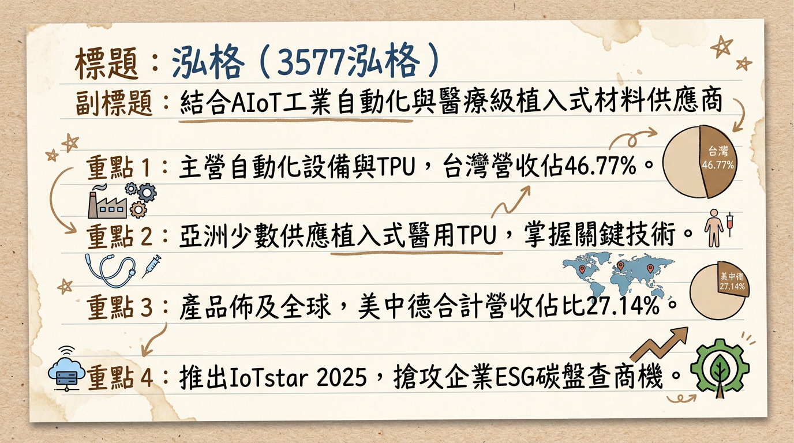
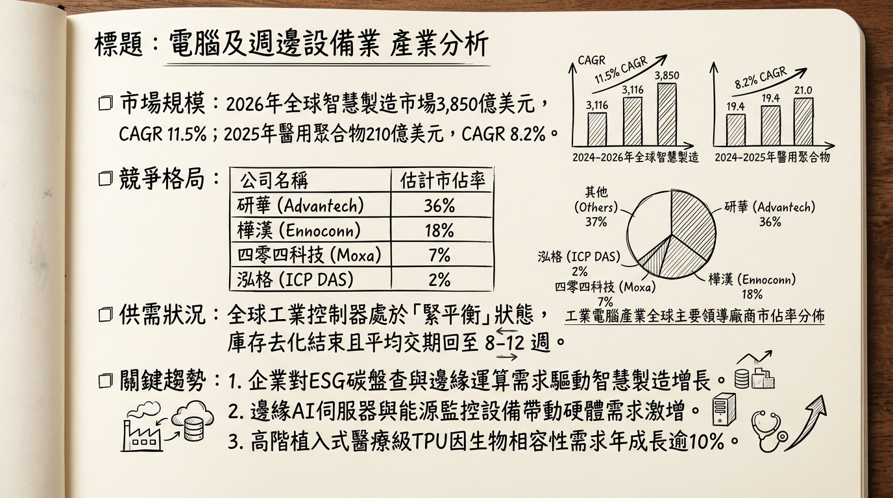
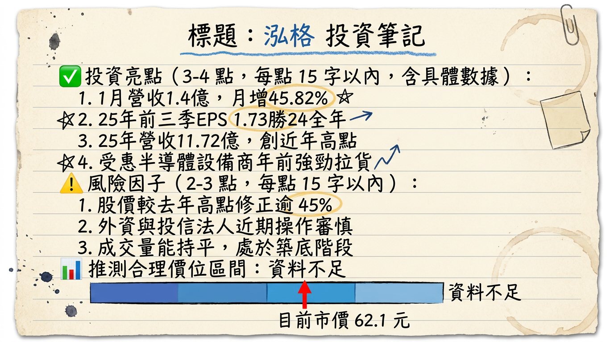

# 3577泓格 深度研究報告

## 一句話摘要
泓格（ICP DAS）成功轉型為「AIoT + ESG + 醫療 TPU」高毛利三引擎驅動企業，受惠於半導體 2 奈米擴產及醫用材料進口替代效應，2026 年獲利動能進入爆發期。

---

## 公司概覽
泓格科技成立於 1993 年，為資深工業電腦（IPC）廠商。近年透過核心技術延伸，由傳統工業自動化跨足智慧能源管理（ESG）與高階生醫材料領域。

**營收結構分析（2024-2025 綜合數據）：**

| 業務/區域 | 營收佔比 | 核心產品與應用 |
| :--- | :--- | :--- |
| **半導體設備** | >30% (2025 預估) | 利基型控制器、EtherCAT 通訊解決方案、廠務自動化 |
| **傳統工控/ESG** | 50-60% | 智慧電錶 PMC-284xM、IoTstar 雲端軟體、邊緣運算控制器 |
| **醫療級 TPU** | 快速成長中 | 泓格生醫品牌 (Arothane™)；植入式導管、導絲塗層 |
| **地區：台灣** | 46.77% | 服務台積電等一線半導體大廠 |
| **地區：海外** | 53.23% | 中國(16.4%)、美國(6.3%)、德國(4.4%)、其他(25.6%) |

---

## 核心競爭優勢
1.  **跨領域垂直整合：** 亞洲唯一具備「工業電腦控制器」與「植入式醫用 TPU 材料」開發能力的廠商。
2.  **醫材進口替代：** 泓格生醫 TPU 具備取代美商 Lubrizol 的優勢，提供亞太醫材廠更短的交期與高度客製化，毛利高達 50-70%。
3.  **ESG 剛需佈局：** 提供軟硬體一體化的能源監控系統，直接對接國際碳盤查標準，受惠各國碳稅政策。
4.  **半導體緊密合作：** 深度嵌入台積電供應鏈，單一客戶貢獻度曾達 20%，隨 2 奈米擴產需求高度穩定。

---

## 財務分析

**近 6 個月月營收趨勢表：**

| 月份 | 營收金額 (億元) | 月增率 (MoM) | 年增率 (YoY) | 簡評 |
| :--- | :--- | :--- | :--- | :--- |
| **2026/01** | 1.40 | +45.82% | +5.53% | 創近 112 個月新高，年初拉貨強勁 |
| **2025/12** | 0.96 | -16.58% | +34.26% | 2025 全年營收結算亮眼 |
| **2025/11** | 1.15 | +22.95% | -0.22% | 訂單回流動能顯現 |
| **2025/10** | 0.94 | +22.58% | +25.99% | 止跌回升，半導體專案啟動 |
| **2025/09** | 0.76 | -16.31% | -28.66% | 第三季傳統季節性調整 |
| **2025/08** | 0.91 | -0.03% | -32.03% | 庫存去化尾聲 |

**年度財務趨勢：**
*   **2024 實際：** 營收 10.71 億元，EPS 1.62 元。
*   **2025 實際（自結）：** 營收 11.72 億元（創新高），前三季累計 EPS 1.73 元。法人預估全年 EPS 約 2.1-2.2 元。
*   **2026 展望：** 法人預期營收挑戰 13-14 億元，EPS 預估區間 2.50 - 2.85 元。

---

## 法說會重點
*   **醫療級 TPU：** 在手客戶已破 **100 家**，隨 Lubrizol 供應吃緊，2026 年轉單放量效益將優於 2025。
*   **產能產值：** 二廠年產能規劃為 **2,000 噸**，若滿載運作，單一生醫事業部年產值可達 **30-40 億元**。
*   **訂單能見度：** 半導體關鍵客戶 2 奈米廠務需求明確，能見度已看到 2026 年上半年。
*   **海外策略：** 積極擴張美國矽谷辦事處，爭取美系半導體設備商（如應材）在地化訂單。

---

## 券商觀點

| 券商名 | 目標價 | 評等 | 日期 | 核心觀點 |
| :--- | :--- | :--- | :--- | :--- |
| **Factset 市場共識** | 62 - 75 元 | 中立偏多 | 2026/02 | 反映 32 倍 PE，看好醫材長期成長。 |
| **本土投顧法人** | -- | 調升 | 2026/01 | 醫材業務轉盈，半導體訂單回流。 |
| **第一金證券** | -- | 中立偏多 | 2025/12 | 自動化需求隨降息預期回溫。 |

---

## 財報深度分析

**利潤率趨勢表：**

| 季度 | 毛利率 (%) | 營業利益率 (%) | 稅後淨利率 (%) | EPS (元) |
| :--- | :--- | :--- | :--- | :--- |
| **2025 Q3** | 52.66% | 12.35% | 10.46% | 0.42 |
| **2025 Q2** | 54.31% | 18.10% | 13.75% | 0.65 |
| **2025 Q1** | 53.17% | 18.35% | 15.70% | 0.66 |
| **2024 Q4** | 52.75% | 11.05% | 9.69% | 0.38 |

*   **存貨分析：** 2025 Q3 存貨週轉天數 355 天，主因為工控長單備料及醫材認證需求，負債比僅 **14.16%**，財務極其穩健。
*   **資本支出：** 2025 年引進最新 SMT 設備，產能提升 20-25%，預計 2026 年進入產能收益期。

---

## 股權異動
*   **2026/02/11：** 董事長葉廼迪、大股東陳瑞煜申報「贈與」轉讓合計約 81 張股票予子女。
*   **分析：** 此為家族資產規劃，非二級市場拋售，對公司經營權與籌碼面無負面影響。目前大股東持股佔比約 12%，結構穩定。

---

## 產業分析

**競爭格局比較表（2025-2026 預估）：**

| 比較項目 | 泓格 (3577) | 研華 (2395) | 路博潤 (Lubrizol) |
| :--- | :--- | :--- | :--- |
| **核心優勢** | 高毛利醫材+精準自動化 | 全球品牌與規模化 | 醫用 TPU 全球龍頭 (對手) |
| **毛利率預估** | **48.5% - 53%** | 40.2% | 55% 以上 |
| **2026 成長性** | 高 (醫材爆發) | 穩定 (IPC 龍頭) | 穩定 |
| **價格策略** | 高性價比、高客製化 | 中高價、標準化 | 高價 |

---

## 近期催化劑
*   **利多：**
    1.  2026 年 1 月營收 1.4 億創近年新高。
    2.  杜拜 WHX 展後，醫用 TPU **ARP-B20** 系列訂單詢問度激增。
    3.  台積電 2 奈米產線關鍵控制器需求釋出。
*   **利空：**
    1.  台幣若持續強勢升值，恐面臨匯損。
    2.  國際 TPU 大廠若進行價格戰，可能壓抑醫材毛利。

---

## ⭐ 成長動能時間軸
*   **2025 Q2：** 完成新 SMT 生產線導入，產能提升 20-25%。
*   **2025/07：** 東京工業展展示 TPU 醫材，獲日本客戶試料。
*   **2025/11：** 獲取國內軌道交通 ESG 監控大案。
*   **2026/01：** 杜拜 WHX 展發表「自潤滑」TPU 新品。
*   **2026 Q2：** 預計半導體設備訂單進入大規模交付期。
*   **2026 全年：** 醫療 TPU 目標營收佔比拉升至 15% 以上。

---

## 2026 展望
*   **成長動能：**
    *   **醫療 TPU：** 隨著 ISO 10993-6 試驗通過，2026 年將由「試料期」轉入「放量期」。
    *   **ESG 控制器：** 全球碳稅實施，PMC 系列產品需求年增率上看 20%。
*   **風險：**
    *   客戶集中度高（半導體景氣相關）。
    *   存貨水位較高需關注去化速度。

---

## 投資結論
1.  **營運體質轉骨：** 綜合毛利站穩 50% 以上，已脫離傳統 IPC 低價競爭。
2.  **醫材估值重估：** 隨 TPU 產能利用率提升，市場有望將其視為「生技材料股」給予更高本益比。
3.  **穩健獲利：** 2026 年 EPS 有望挑戰 2.85 元，以 25-30 倍合理本益比計算，股價具備重回百元大關潛力。
4.  **建議目標價區間：** **72.0 - 85.0 元**。

---
本報告由 AI 自動產生，資料來源為公開網路資訊，僅供參考，不構成投資建議。產生時間：2026-03-01 21:31

---

## 📊 資訊卡

