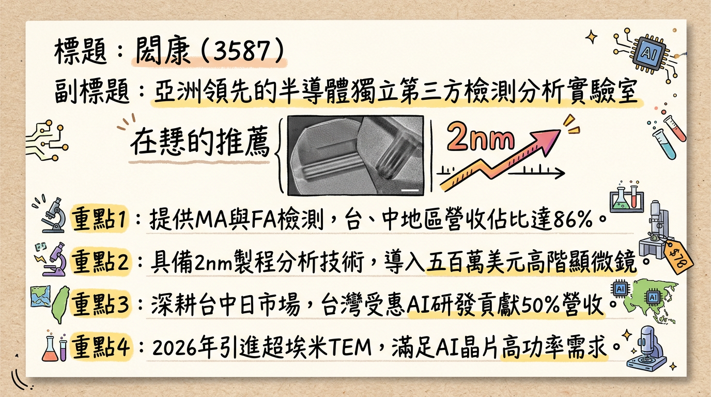
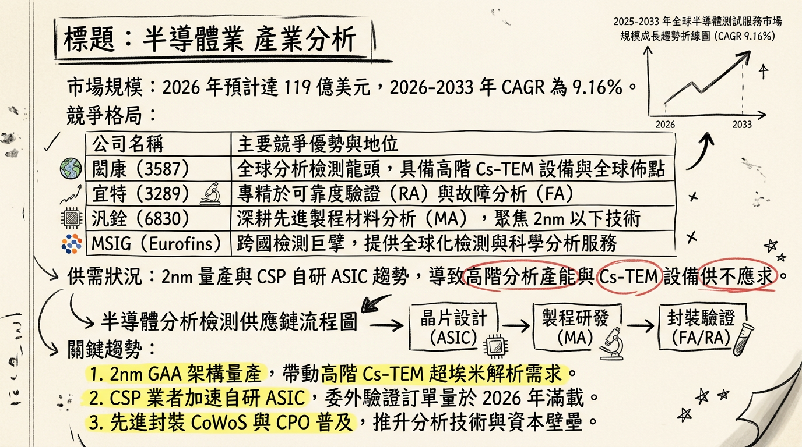
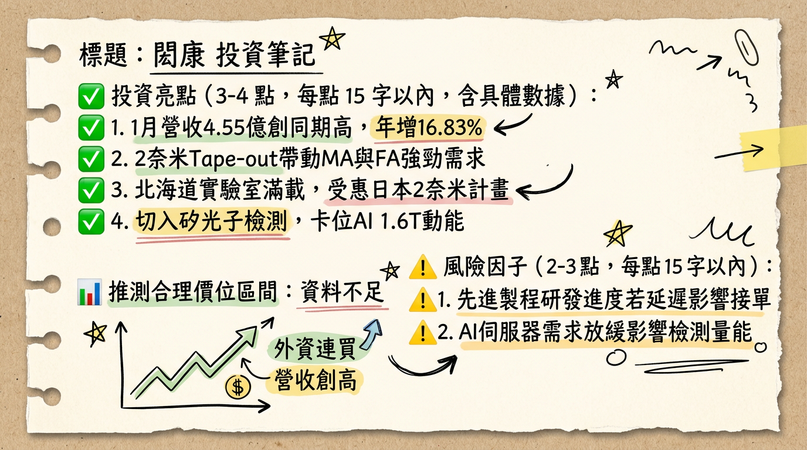

# 3587閎康 閎康 深度研究報告

## 一句話摘要
閎康（3587）已度過 2025 年高折舊的投資整頓期，2026 年將受惠於 **2 奈米 GAA 架構轉型**與**日本四大實驗室產能全面開出**，迎來獲利翻倍成長的「收割元年」。

---

## 公司概覽
閎康為亞洲領先的半導體獨立第三方檢測分析實驗室，主要提供材料分析 (MA)、故障分析 (FA) 及可靠度分析 (RA) 等服務。

**營收結構（2025 年底資料）**

| 類別 | 細分項目 | 營收佔比 | 備註 |
| :--- | :--- | :--- | :--- |
| **按區域分** | 台灣 | 50% | 受惠台積電先進製程與 AI ASIC 研發 |
| | 中國 | 36% | 主攻半導體自主化與成熟製程轉型 |
| | 日本 | 14% | **成長最快**，2025 年 YoY 達 63% |
| **按服務分** | 材料分析 (MA) | 最高 | 2nm 研發階段需求爆發，資本支出重點 |
| | 故障分析 (FA) | 次之 | 隨日本試產線啟動，2026 需求跳升 |
| | 可靠度分析 (RA) | 穩定 | 受惠 AI 伺服器高功率（800W+）測試 |

---

## 核心競爭優勢
1.  **高階技術壁壘：** 擁有價值逾 500 萬美元之「超埃米解析球差校正穿透式電子顯微鏡 (Cs-Corrector TEM)」，專攻 2nm 以下製程。
2.  **日本佈局領先：** 唯一在日本擁有大規模在地化服務的台廠，收費較台灣高約 2 倍。
3.  **一條龍服務：** 提供 MA/FA/RA 整合分析，縮短客戶研發週期，深度綁定北美 CSP (Google, Meta, AWS) 及日本 Rapidus。

---

## 財務分析

### 月營收趨勢表格
| 月份 | 營收 (億新台幣) | 月增率 MoM | 年增率 YoY | 簡評 |
| :--- | :--- | :--- | :--- | :--- |
| **2026/01** | 4.55 | -9.31% | **+16.82%** | 歷年同期新高，AI 需求續強 |
| **2025/12** | 5.01 | +2.70% | +10.65% | 2nm 設計案 Tape-out 帶動 |
| **2025/11** | 4.88 | +1.16% | +14.18% | 日本產能稼動率提升 |
| **2025/10** | 4.83 | -4.66% | +17.48% | 維持高位震盪 |
| **2025/09** | 5.06 | +5.48% | +11.91% | 2025 年單月最高 |
| **2025/08** | 4.80 | +1.04% | +10.50% | 需求穩健回升 |

### 年度趨勢
*   **2024 (實際)：** 營收 51.10 億元，EPS 10.39 元。
*   **2025 (實際營收/預估獲利)：** 營收 55.45 億元 (YoY +8.51%)，預估 EPS 約 6.3 - 6.7 元（受 14-17 億高額資本支出折舊影響）。
*   **2026 (預估)：** 營收目標突破 61.8 億元，EPS 預估回升至 **11.3 - 15.0 元**。

---

## 法說會重點
1.  **折舊壓力減輕：** 管理層定義 2025 為「投資整頓年」，高階設備折舊年增 22%。2026 年隨產能填滿，折舊佔比將下降。
2.  **2 奈米商機：** 2nm GAA 結構複雜度倍增，MA 取樣頻率增加 3-5 倍，且單價較 3nm 顯著提升。
3.  **新動能：** 矽光子 (Silicon Photonics) 與 CPO 檢測已獲主要客戶認證，2026 年開始貢獻。
4.  **區域 Guidance：** 日本市場將成獲利主力，名古屋二廠預計 2026 H2 營運。

---

## 券商觀點
| 券商名稱 | 報告日期 | 目標價 | 評等 | 2026 EPS 預估 |
| :--- | :--- | :--- | :--- | :--- |
| **群益證券** | 2026/02/06 | **275 元** | 看多 | 11.1 元 |
| **CMoney 法人** | 2025/12/10 | **232 元** | 看多 | 11.3 元 |
| **國泰證券** | 2025/11/28 | **225 元** | 看多 | 未提及 |
| **中國信託** | 2025/09/05 | **222 元** | 看多 | 未提及 |

---

## 財報深度分析

### 利潤率趨勢表格
| 季度 | 毛利率 (GPM) | 營益率 (OPM) | 稅後淨利率 (NPM) | EPS |
| :--- | :--- | :--- | :--- | :--- |
| **2025 Q3** | 31.35% | 14.61% | 9.70% | 2.11 元 |
| **2025 Q2** | 27.70% | 11.20% | 6.70% | 1.38 元 |
| **2025 Q1** | 24.33% | 8.50% | 4.10% | 0.76 元 |

*   **資本支出：** 2025 年高達 **16-18 億元**，主要採購單價高 2.5 倍之高階 TEM。
*   **營運效率：** 應收帳款週轉天數 (DSO) 由 Q1 的 93 天縮短至 Q3 的 **80.62 天**，顯示日本大客戶收現狀況優異。

---

## 股權異動與資本結構
1.  **可轉換公司債 (CB)：** 
    *   「閎康一」(35871) 餘額 4.5 億，轉換價 200.7 元，2026/06 到期。
    *   「閎康二」(35872) **2026/02/04 上櫃**，總額 7 億，轉換價 **198 元**，期間 5 年。
2.  **庫藏股：** 2025/05 轉讓 582 張予員工，展現留才決心。
3.  **大股東動向：** 近半年無重大申報轉讓，股權結構相對穩定。

---

## 產業分析

### 競爭格局比較 (2025 數據)
| 公司 | 營收規模 | 2025 毛利率 | 2026 核心動能 |
| :--- | :--- | :--- | :--- |
| **閎康 (3587)** | **55.45 億** | **~32%** | **日本 2nm GAA、AI ASIC 一條龍** |
| 宜特 (3289) | 42-45 億 | ~28% | 車用認證、高功率 RA |
| 汎銓 (6830) | 21.80 億 | ~25% | 先進製程 MA、矽光子專利 |

*   **趨勢：** 全球半導體測試服務 CAGR (2026-2033) 預計達 **9.16%**，高階 MA 產能持續供不應求。

---

## 近期催化劑
*   **利多：**
    *   外資於 2026/02/21-02/26 連續買超 6 日。
    *   日本 Rapidus 預計 2026 Q1 提供 2nm PDK。
    *   名古屋二廠 (日本第 4 座) 預計下半年量產。
*   **利空：**
    *   日圓匯率波動可能產生匯損。
    *   高額折舊若遇營收成長放緩，毛利率將受壓。

---

## ⭐ 成長動能時間軸
*   **2025 Q1：** 日本北海道實驗室啟用，鎖定 Rapidus 2nm 研發。
*   **2025 Q3：** 毛利率由 24% 回升至 31%，利潤率走出谷底。
*   **2026 Q1：** 閎康二 (CB) 7 億資金到位；日本產能緩解供不應求。
*   **2026 Q2：** 美國市場營收佔比目標首度突破 5%。
*   **2026 H2：** **名古屋二廠正式營運**，日本產能預計再增 20-30%。
*   **2026 全年：** 台積電 2nm GAA 正式放量，MA 分析單價顯著提升。

---

## 2026 展望
*   **成長動能：** 2026 年為日本布局收割元年。受惠於日本高單價訂單佔比提升至 20% 以上，獲利預計年增 **70%-100%**。
*   **風險因子：** 需關注 2 奈米客戶量產時程是否推遲，及高額折舊對淨利的邊際影響。

---

## 投資結論
1.  **獲利拐點已現：** 2025 年為獲利谷底，2026 年 EPS 有望重返 **11-13 元** 甚至更高。
2.  **稀缺性價值：** 作為日本半導體復興計畫的深度參與者，具備獨佔性的海外高毛利增量。
3.  **技術升級紅利：** GAA 架構轉換與矽光子趨勢，將維持 MA 業務的長期供不應求。
4.  **建議：** 2026 年預估 EPS 11.3 元，給予歷史均值 20-22 倍本益比，目標價區間建議在 **226 - 250 元** 之間。短期股價若因 CB 轉換壓力拉回，視為中長期布局機會。

---
本報告由 AI 自動產生，資料來源為公開網路資訊，僅供參考，不構成投資建議。產生時間：2026-03-01 21:33

---

## 📊 資訊卡

